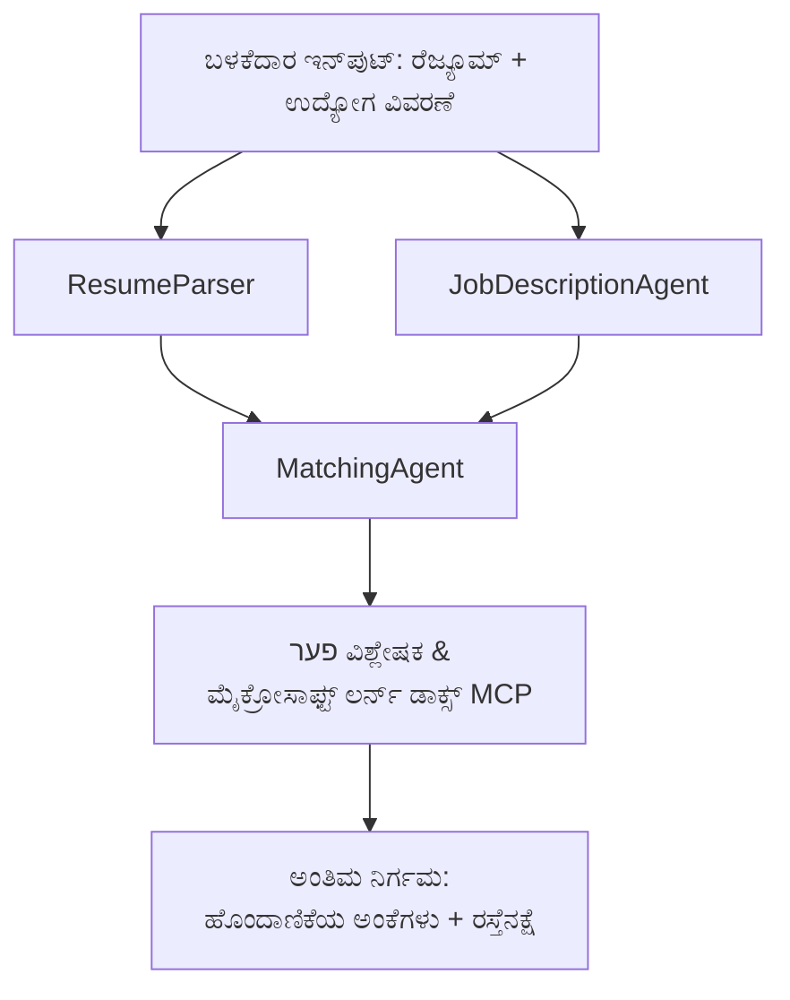

# PersonalCareerCopilot - ರೆಜೋಮ್ → ಉದ್ಯೋಗ ಹೊಂದಾಣಿಕೆ ಮೌಲ್ಯಮಾಪನಕಾರ

ಕೆಲಸ ವಿವರಣೆಯೊಂದಿಗೆ ರೆಜೋಮ್ ಎಷ್ಟು ಚೆನ್ನಾಗಿ ಹೊಂದಿಕೊಳ್ಳುತ್ತದೆ ಎಂಬುದನ್ನು ಮೌಲ್ಯಮಾಪನಗೊಳಿಸುವ ಬಹು-ಏಜೆಂಟ್ ವರ್ಕ್ಫ್ಲೋ, ನಂತರ ಕ್ಷೀನತೆಗಳನ್ನು ಮುಚ್ಚಲು ವೈಯಕ್ತಿಕ ಕಲಿಕೆಯ ರಸ್ತೆ ನಕ್ಷೆಯನ್ನು ರಚಿಸುತ್ತದೆ.

---

## ಏಜೆಂಟ್ಸ್

| ಏಜೆಂಟ್ | ಪಾತ್ರ | ಯಂತ್ರಗಳು |
|-------|------|-------|
| **ResumeParser** | ರೆಜೋಮ್ ಪಠ್ಯದಿಂದ ರಚನಾತ್ಮಕ ಕೌಶಲ್ಯಗಳು, ಅನುಭವ, ಪ್ರಮಾಣಪತ್ರಗಳನ್ನು ಸಂಗ್ರಹಿಸುತ್ತದೆ | - |
| **JobDescriptionAgent** | JD ಯಿಂದ ಅಗತ್ಯ/ಆಭ್ಯಾಸಿತ ಕೌಶಲ್ಯಗಳು, ಅನುಭವ, ಪ್ರಮಾಣಪತ್ರಗಳನ್ನು ಸಂಗ್ರಹಿಸುತ್ತದೆ | - |
| **MatchingAgent** | ಪ್ರೊಫೈಲ್ ಮತ್ತು ಅಗತ್ಯಗಳನ್ನು ಹೋಲಿಸಿ → ಹೊಂದಾಣಿಕೆ ಅಂಕ (0-100) + ಹೊಂದಿಕೊಂಡ/ಅಳವಡಿಸಲಾಗದ ಕೌಶಲ್ಯಗಳು | - |
| **GapAnalyzer** | Microsoft Learn ಸಂಪನ್ಮೂಲಗಳೊಂದಿಗೆ ವೈಯಕ್ತಿಕ ಕಲಿಕೆಯ ರಸ್ತೆ ನಕ್ಷೆಯನ್ನು ರಚಿಸುತ್ತದೆ | `search_microsoft_learn_for_plan` (MCP) |

## ವರ್ಕ್ಫ್ಲೋ


---

## ತ್ವರಿತ ಪ್ರಾರಂಭ

### 1. ಪರಿಸರವನ್ನು ಹೊಂದಿಸಿ

```powershell
cd workshop\lab02-multi-agent\PersonalCareerCopilot
python -m venv .venv
.\.venv\Scripts\Activate.ps1          # Windows ಪವರ್‌ಶೆಲ್
# source .venv/bin/activate            # macOS / ಲಿನಕ್ಸ್ನಲ್ಲಿ
pip install -r requirements.txt
```

### 2. ಪ್ರಮಾಣಿ(ಕ)ರಿಸು

ನಮೂನೆ env ಫೈಲ್ ಅನ್ನು ನಕಲಿಸಿ ಮತ್ತು ನಿಮ್ಮ Foundry ಯೋಜನೆ ವಿವರಗಳನ್ನು ತುಂಬಿಕೊಳ್ಳಿ:

```powershell
cp .env.example .env
```

`.env` ಅನ್ನು ಸಂಪಾದಿಸಿ:

```env
PROJECT_ENDPOINT=https://<your-account>.services.ai.azure.com/api/projects/<your-project>
MODEL_DEPLOYMENT_NAME=gpt-4.1-mini
```

| ಮೌಲ್ಯ | ಎಲ್ಲಿ ಕಂಡುಬರುತ್ತದೆ |
|-------|-----------------|
| `PROJECT_ENDPOINT` | VS Code ನಲ್ಲಿ Microsoft Foundry ಬದಿಯ ಪಟ್ಟಿ → ನಿಮ್ಮ ಯೋಜನೆಯನ್ನು ರೈಟ್ ಕ್ಲಿಕ್ ಮಾಡಿ → **Copy Project Endpoint** |
| `MODEL_DEPLOYMENT_NAME` | Foundry ಬದಿಯಲ್ಲಿ → ಯೋಜನೆಯನ್ನು ವಿಸ್ತರಿಸಿ → **Models + endpoints** → ನಿಯೋಜನೆ ಹೆಸರು |

### 3. ಸ್ಥಳೀಯವಾಗಿ ಚಾಲನೆ ಮಾಡಿ

```powershell
python -m debugpy --listen 127.0.0.1:5679 -m agentdev run main.py --verbose --port 8088
```

ಅಥವಾ VS Code ಟಾಸ್ಕ್ ಬಳಸಿ: `Ctrl+Shift+P` → **Tasks: Run Task** → **Run Lab02 HTTP Server**.

### 4. ಏಜೆಂಟ್ ಇನ್ಸ್ಪೆಕ್ಟರ್‌ನೊಂದಿಗೆ ಪರೀಕ್ಷೆ

ಏಜೆಂಟ್ ಇನ್ಸ್ಪೆಕ್ಟರ್ ತೆರೆಯಿರಿ: `Ctrl+Shift+P` → **Foundry Toolkit: Open Agent Inspector**.

ಈ ಪರೀಕ್ಷಾ ಪ್ರಾಂಪ್ಟ್ ಅನ್ನು ಪೇಸ್ಟ್ ಮಾಡಿ:

```
Resume:
Jane Doe
Senior Software Engineer with 5 years of experience in Python, Django, and AWS.
Built microservices handling 10K+ requests/second. Led a team of 4 developers.
Certifications: AWS Solutions Architect Associate.
Education: B.S. Computer Science, State University.

Job Description:
Senior Cloud Engineer at Contoso Ltd.
Required: Python, Azure, Kubernetes, Terraform, CI/CD pipelines.
Preferred: Go, monitoring (Prometheus/Grafana), cost optimization.
Experience: 5+ years in cloud infrastructure.
Certifications: Azure Solutions Architect Expert preferred.
```

** ನಿರೀಕ್ಷಿಸಲಾಗಿದೆ:** ಹೊಂದಾಣಿಕೆ ಅಂಕ (0-100), ಹೊಂದಿಕೊಂಡ/ಕಡಿಮೆಯಿರುವ ಕೌಶಲ್ಯಗಳು ಮತ್ತು Microsoft Learn URL ಗಳೊಂದಿಗೆ ವೈಯಕ್ತಿಕ ಕಲಿಕೆಯ ರಸ್ತೆ ನಕ್ಷೆ.

### 5. Foundry ಗೆ ನಿಯೋಜಿಸಿರಿ

`Ctrl+Shift+P` → **Microsoft Foundry: Deploy Hosted Agent** → ನಿಮ್ಮ ಯೋಜನೆಯನ್ನು ಆಯ್ಕೆ ಮಾಡಿ → ದೃಢೀಕರಿಸಿ.

---

## ಯೋಜನೆಯ ರಚನೆ

```
PersonalCareerCopilot/
├── .env.example        ← Template for environment variables
├── .env                ← Your credentials (git-ignored)
├── agent.yaml          ← Hosted agent definition (name, resources, env vars)
├── Dockerfile          ← Container image for Foundry deployment
├── main.py             ← 4-agent workflow (instructions, MCP tool, WorkflowBuilder)
└── requirements.txt    ← Python dependencies
```

## ಪ್ರಮುಖ ಫೈಲ್‌ಗಳು

### `agent.yaml`

Foundry ಏಜೆಂಟ್ ಸೇವೆಗೆ ನಿರ್ಧರಿಸಲಾಗಿರುವ ಏಜೆಂಟ್ ಅನ್ನು ವ್ಯಾಖ್ಯಾನಿಸುತ್ತದೆ:
- `kind: hosted` - ನಿರ್ವಹಿತ ಕಂಟೈನರ್ ಆಗಿ ನಡೆಯುತ್ತದೆ
- `protocols: [responses v1]` - `/responses` HTTP ಅಂತಿಮ ಬಿಂದುವನ್ನು ಪ್ರದರ್ಶಿಸುತ್ತದೆ
- `environment_variables` - ನಿಯೋಜನೆ ಸಮಯದಲ್ಲಿ `PROJECT_ENDPOINT` ಮತ್ತು `MODEL_DEPLOYMENT_NAME` ಇಂಜೆಕ್ಟ್ ಮಾಡಲಾಗುತ್ತದೆ

### `main.py`

ಇದು ಒಳಗೊಂಡಿದೆ:
- **ಏಜೆಂಟ್ ಸೂಚನೆಗಳು** - ನಾಲ್ಕು `*_INSTRUCTIONS` ಸ್ಥಿರಾಂಕಗಳು, ಪ್ರತಿ ಏಜೆಂಟ್ ಗೆ ಒಂದೊಂದು
- **MCP ಉಪಕರಣ** - `search_microsoft_learn_for_plan()` Streamable HTTP ಮೂಲಕ `https://learn.microsoft.com/api/mcp` ಗೆ ಕರೆಮಾಡುತ್ತದೆ
- **ಏಜೆಂಟ್ ಸೃಷ್ಟಿ** - `AzureAIAgentClient.as_agent()` ಬಳಸಿ `create_agents()` ಸಂದರ್ಭ ನಿರ್ವಹಣೆ
- **ವರ್ಕ್ಫ್ಲೋ ಗ್ರಾಫ್** - `create_workflow()` ಬಳಸಿಕೊಂಡು ಏಜೆಂಟ್‌ಗಳನ್ನು ಫ್ಯಾನ್-ಔಟ್/ಫ್ಯಾನ್-ಇನ್/ಕ್ರಮಬದ್ದ ಮಾದರಿಗಳೊಂದಿಗೆ ಜೋಡಿಸುವುದು
- **ಸರ್ವರ್ ಆರಂಭಣೆ** - `from_agent_framework(agent).run_async()` 8088 ಪೋರ್ಟ್ ನಲ್ಲಿ

### `requirements.txt`

| ಪ್ಯಾಕೇಜ್ | ಆವೃತ್ತಿ | ಉದ್ದೇಶ |
|---------|---------|---------|
| `agent-framework-azure-ai` | `1.0.0rc3` | Microsoft ಏಜೆಂಟ್ ಫ್ರೇಮ್ವರ್ಕ್ ಗಾಗಿ Azure AI ಸಂಯೋಜನೆ |
| `agent-framework-core` | `1.0.0rc3` | ಕೋರ್ ರನ್‌ಟೈಮ್ (WorkflowBuilder शामಿಲ) |
| `azure-ai-agentserver-agentframework` | `1.0.0b16` | ಹೋಸ್ಟ್ ಮಾಡಲಾದ ಏಜೆಂಟ್ ಸರ್ವರ್ ರನ್‌ಟೈಮ್ |
| `azure-ai-agentserver-core` | `1.0.0b16` | ಕೋರ್ ಏಜೆಂಟ್ ಸರ್ವರ್ ಅವಲಂಬನೆಗಳು |
| `debugpy` | ಇತ್ತೀಚಿನ | Python ಡಿಬಗ್ (VS Code ನಲ್ಲಿ F5) |
| `agent-dev-cli` | `--pre` | ಸ್ಥಳೀಯ ಡೆವ್ CLI + ಏಜೆಂಟ್ ಇನ್ಸ್ಪೆಕ್ಟರ್ ಬ್ಯಾಕೆಂಡು |

---

## ಸಮಸ್ಯೆಗಳು ಮತ್ತು ಪರಿಹಾರಗಳು

| ಸಮಸ್ಯೆ | ಪರಿಹಾರ |
|-------|-----|
| `RuntimeError: Missing required environment variable(s)` | `.env` ಫೈಲ್ ರಚಿಸಿ ಮತ್ತು `PROJECT_ENDPOINT` ಮತ್ತು `MODEL_DEPLOYMENT_NAME` ಸೇರಿಸಿ |
| `ModuleNotFoundError: No module named 'agent_framework'` | venv ಸಕ್ರಿಯಮಾಡಿ ಮತ್ತು `pip install -r requirements.txt` ಸಂಪಾದಿಸಿ |
| ಔಟ್ಪುಟ್‌ನಲ್ಲಿ Microsoft Learn URL ಗಳಿಲ್ಲ | `https://learn.microsoft.com/api/mcp` ಗೆ ಇಂಟರ್ನೆಟ್ ಸಂಪರ್ಕ ಪರಿಶೀಲಿಸಿ |
| ಕೇವಲ 1 ಗ್ಯಾಪ್ ಕಾರ್ಡ್ (ಕಟಾಫ್) | `GAP_ANALYZER_INSTRUCTIONS` ನಲ್ಲಿ `CRITICAL:` ಬ್ಲಾಕ್ ಸೇರಿದೆ ಎಂದು ಖಚಿತಪಡಿ |
| 8088 ಪೋರ್ಟ್ ಬಳಕೆಯಲ್ಲಿದೆ | ಇತರ ಸರ್ವರ್‌ಗಳನ್ನು ನಿಲ್ಲಿಸಿ: `netstat -ano \| findstr :8088` |

ವಿವರವಾದ ಸಮಸ್ಯಾ ಪರಿಹಾರಕ್ಕಾಗಿ, [Module 8 - Troubleshooting](../docs/08-troubleshooting.md) ನೋಡಿ.

---

**ಸಂಪೂರ್ಣ ಪ್ರಕ್ರಿಯೆ:** [Lab 02 Docs](../docs/README.md) · **ಹಿಂದೆ:** [Lab 02 README](../README.md) · [ವರ್ಕ್‌ಶಾಪ್ ಹೋಮ್](../../../README.md)

---

<!-- CO-OP TRANSLATOR DISCLAIMER START -->
**ನಿರಾಕರಣೆ**:  
ಈ ದಾಖಲೆ [Co-op Translator](https://github.com/Azure/co-op-translator) ಎಂಬ AI ಅನುವಾದ ಸೇವೆಯನ್ನು ಉಪಯೋಗಿಸಿ ಅನುವಾದಿಸಲಾಗಿದೆ. ನಾವು ಖಚಿತತೆಗೆ ಪ್ರಯತ್ನಿಸುವಾಗ, ಸ್ವಯಂಚಾಲಿತ ಅನುವಾದಗಳಲ್ಲಿ ತಪ್ಪುಗಳು ಅಥವಾ ಅಸತ್ಯತೆಗಳಿರಬಹುದು ಎಂಬುದನ್ನು ದಯವಿಟ್ಟು ಗಮನಿಸಿ. ಮೂಲ ಭಾಷೆಯ ಹೊರತಾಗಿ ಇರುವ ದಾಖಲೆ ಅಧಿಕೃತ ಮೂಲವೆಂದು ಪರಿಗಣಿಸಬೇಕು. ಪ್ರಮುಖ ಮಾಹಿತಿಗಾಗಿ, ವೃತ್ತಿಪರ ಮಾನವ ಅನುವಾದವನ್ನು ಶಿಫಾರಸು ಮಾಡಲಾಗುತ್ತದೆ. ಈ ಅನುವಾದ ಬಳಕೆಯಿಂದ ಸಂಭವಿಸುವ ಯಾವುದೇ ಅಪಹಾಸ್ಯಗಳ ಅಥವಾ ತಪ್ಪು ವೈಖರಿಗಳ ಹೊಣೆಗಾರಿಕೆಯನ್ನು ನಾವು ಹೊಂದುತ್ತಿಲ್ಲ.
<!-- CO-OP TRANSLATOR DISCLAIMER END -->