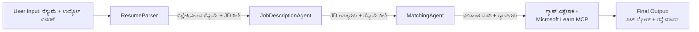

# PersonalCareerCopilot - ರೆಸ್ಯೂಮ್ → ಕೆಲಸ ಹೊಂದಾಣಿಕೆ ಮೌಲ್ಯಮಾಪಕ

ಒಂದು ಕಾರ್ಯವಾಹಿ-ಪ್ರಥಮ ಬಹು-ಏಜೆಂಟ್ ಆಪ್, ಅದು ರೆಸ್ಯೂಮ್ ಒಂದು ಕೆಲಸ ವಿವರಣೆಗೆ ಎಷ್ಟು ಚೆನ್ನಾಗಿ ಹೊಂದಿಕೆಯಾಗುತ್ತದೆ ಎಂದು ಮೌಲ್ಯಮಾಪನ ಮಾಡುತ್ತದೆ, ನಂತರ ಖಾಲಿಗಳನ್ನು ತುಂಬಲು ವೈಯಕ್ತಿಕ ಕಲಿಕೆ ರಸ್ತೆ ನಕ್ಷೆಯನ್ನು ರಚಿಸುತ್ತದೆ.

---

## ಏಜೆಂಟರು

| ಏಜೆಂಟ್ | ಪಾತ್ರ | ಸಾಧನಗಳು |
|-------|------|-------|
| **ResumeParser** | ರೆಸ್ಯೂಮ್ ಪಠ್ಯದಿಂದ ರಚನೆಯಾಗಿದ್ದ ಕೌಶಲ್ಯಗಳು, ಅನುಭವ, ಪ್ರಮಾಣಪತ್ರಗಳನ್ನು ತೆಗೆಯುತ್ತದೆ | - |
| **JobDescriptionAgent** | ಕೆಲಸ ವಿವರಣೆ (JD)ಯಿಂದ ಅಗತ್ಯ/ಆಗ್ರಹಿತ ಕೌಶಲ್ಯಗಳು, ಅನುಭವ, ಪ್ರಮಾಣಪತ್ರಗಳನ್ನು ತೆಗೆಯುತ್ತದೆ | - |
| **MatchingAgent** | ಪ್ರೊಫೈಲ್ ವಿರುದ್ಧ ಅಗತ್ಯತೆಗಳನ್ನು ಹೋಲಿಸುತ್ತದೆ → ಹೊಂದಿಕೆಯ ಅಂಕ (0-100) + ಹೊಂದಿಕೆಯಾಗಿದ್ದ/ಕಾಣದ ಕೌಶಲ್ಯಗಳು | - |
| **GapAnalyzer** | ಮೈಕ್ರೋಸಾಫ್ಟ್ ಲರ್ನ್ ಸಂಪನ್ಮೂಲಗಳೊಂದಿಗೆ ವೈಯಕ್ತಿಕ ಕಲಿಕಾ ರಸ್ತೆ ನಕ್ಷೆ ರಚಿಸುತ್ತದೆ | `search_microsoft_learn_for_plan` (MCP) |

## ಕಾರ್ಯವಾಹಿ


```mermaid
flowchart LR
    UserInput["User Input: ರೆಸ್ಯುಮೆ + ಉದ್ಯೋಗ ವಿವರಣೆ"] --> ResumeParser
    ResumeParser -- "ವಿಶ್ಲೇಷಿಸಲಾದ ರೆಸ್ಯುಮೆ + JD ರಿಲೇ" --> JobDescriptionAgent
    JobDescriptionAgent -- "JD ಅಗತ್ಯಗಳು + ರೆಸ್ಯುಮೆ ರಿಲೇ" --> MatchingAgent
    MatchingAgent -- "ಫಲಿತಾಂಶ ವರದಿ + ಗ್ಯಾಪ್‌ಗಳು" --> GapAnalyzerMCP["ಗ್ಯಾಪ್ ವಿಶ್ಲೇಷಕ +\nMicrosoft Learn MCP"]
    GapAnalyzerMCP --> FinalOutput["Final Output:\nಫಿಟ್ ಸ್ಕೋರ್ + ರಸ್ತೆ ಮಾಪನ"]
```

---

## ವേഗದ ಪ್ರಾರಂಭ

### 1. ಪರಿಸರವನ್ನು ಸೆಟ್ ಮಾಡಿ

ಈ ಫೋಲ್ಡರ್ ಕಾರ್ಯವಾಹಿ ಆಧಾರಿತ ಲ್ಯಾಬ್ 02 ಸ್ಕಾಫೋಲ್ಡ್ ಗಾಗಿ ಉಲ್ಲೇಖ ಅನುಸ್ಥಾಪನೆ ಆಗಿದೆ. ಇದರ `main.py` ಈಗಿನ ಪ್ರಾಂಪ್ಟ್ ಬ್ಲಾಕ್ಗಳು ಮತ್ತು `WorkflowBuilder` ಅನ್ನು ಬಳಸಿಕೊಂಡು ನಾಲ್ಕು ಏಜೆಂಟರನ್ನು ಸಂಪರ್ಕಿಸುತ್ತದೆ.

```powershell
cd workshop\lab02-multi-agent\PersonalCareerCopilot
python -m venv .venv
.\.venv\Scripts\Activate.ps1          # ವಿಂಡೋಸ್ ಪವರ್‌ಶೆಲ್
# source .venv/bin/activate            # ಮ್ಯಾಕ್‌ಒಎಸ್ / ಲಿನಕ್ಸ್
pip install -r requirements.txt
```

### 2. ಪ್ರಮಾಣಪತ್ರಗಳನ್ನು ಸಂರಚಿಸಿ

ಈ ಫೋಲ್ಡರ್‌ನಲ್ಲಿ `.env` ಫೈಲ್ ರಚಿಸಿ:

```powershell
copy .env .env.bak 2>$null; echo $null > .env
```

`.env` ಸಂಪಾದಿಸಿ:

```env
FOUNDRY_PROJECT_ENDPOINT=https://<your-account>.services.ai.azure.com/api/projects/<your-project>
AZURE_AI_MODEL_DEPLOYMENT_NAME=gpt-4.1-mini
```

| ಮೌಲ್ಯ | ಎಲ್ಲಿ ಕಾಣುವುದು |
|-------|------------------|
| `FOUNDRY_PROJECT_ENDPOINT` | Foundry Toolkit ಸೈಡ್‌ಬಾರ್ → ನಿಮ್ಮ ಪ್ರಾಜೆಕ್ಟ್ ಮೇಲೆ ರೈಟ್-ಕ್ಲಿಕ್ → **Copy Project Endpoint** |
| `AZURE_AI_MODEL_DEPLOYMENT_NAME` | Foundry ಸೈಡ್‌ಬಾರ್ → ಪ್ರಾಜೆಕ್ಟ್ ವಿಸ್ತರಿಸಿ → **Models + endpoints** → ನಿಯೋಜನೆ ಹೆಸರು |

### 3. ಸ್ಥಳೀಯವಾಗಿ ಚಾಲನೆಮಾಡಿ

```powershell
python -m debugpy --listen 127.0.0.1:5679 main.py --port 8088
```

ಅಥವಾ VS ಕೋಡ್ ಟಾಸ್ಕ್ ಬಳಸಿ: `Ctrl+Shift+P` → **Tasks: Run Task** → **Run Agent HTTP Server**.

F5 ಡಿಬಗ್ಗಿಂಗ್ ಗಾಗಿ, **Debug Local Agent HTTP Server** ಬಳಸಿ.

### 4. ಏಜೆಂಟ್ ಇನ್ಸ್‌ಪೆಕ್ಟರ್ ಬಳಸಿ ಪರೀಕ್ಷಿಸಿ

ಏಜೆಂಟ್ ಇನ್ಸ್‌ಪೆಕ್ಟರ್ ತೆರೆಯಿರಿ: `Ctrl+Shift+P` → **Foundry Toolkit: Open Agent Inspector**.

ಈ ಪರೀಕ್ಷಾ ಪ್ರಾಂಪ್ಟ್ ಪೇಸ್ಟ್ ಮಾಡಿ:

```
Resume:
Jane Doe
Senior Software Engineer with 5 years of experience in Python, Django, and AWS.
Built microservices handling 10K+ requests/second. Led a team of 4 developers.
Certifications: AWS Solutions Architect Associate.
Education: B.S. Computer Science, State University.

Job Description:
Senior Cloud Engineer at Contoso Ltd.
Required: Python, Azure, Kubernetes, Terraform, CI/CD pipelines.
Preferred: Go, monitoring (Prometheus/Grafana), cost optimization.
Experience: 5+ years in cloud infrastructure.
Certifications: Azure Solutions Architect Expert preferred.
```

**ನಿರೀಕ್ಷಿತ:** ಹೊಂದಿಕೆ ಅಂಕ (0-100), ಹೊಂದಿಕೆಯಾಗಿದ/ಕಾಣದ ಕೌಶಲ್ಯಗಳು, ಮತ್ತು ಮೈಕ್ರೋಸಾಫ್ಟ್ ಲರ್ನ್ URLಗಳುಳ್ಳ ವೈಯಕ್ತಿಕ ಕಲಿಕಾ ರಸ್ತೆ ನಕ್ಷೆ.

### 5. Foundry ಗೆ ನಿಯೋಜಿಸಿ

`Ctrl+Shift+P` → **Foundry Toolkit: Deploy Hosted Agent** → ನಿಮ್ಮ ಪ್ರಾಜೆಕ್ಟ್ ಆಯ್ಕೆಮಾಡಿ → ದೃಢೀಕರಿಸಿ.

---

## ಪ್ರಾಜೆಕ್ಟ್ ರಚನೆ

```
PersonalCareerCopilot/
├── .env                ← Your credentials (git-ignored)
├── agent.yaml          ← Hosted agent definition (name, resources, env vars)
├── Dockerfile          ← Container image for Foundry deployment
├── main.py             ← 4-agent workflow (instructions, MCP tool, WorkflowBuilder)
└── requirements.txt    ← Python dependencies
```

## ಪ್ರಮುಖ ಫೈಲ್ಗಳು

### `agent.yaml`

Foundry ಏಜೆಂಟ್ ಸರ್ವೀಸ್ ಗಾಗಿ ಹೋಸ್ಟ್ ಮಾಡಿದ ಏಜೆಂಟ್ ಅನ್ನು ವ್ಯಾಖ್ಯಾನಿಸುತ್ತದೆ:
- `kind: hosted` - ನಿರ್ವಹಿತ ಕಂಟೈನರ್ ಆಗಿ ಚಾಲನೆ ಮಾಡುತ್ತದೆ
- `protocols` - `responses` ಪ್ರೋಟೋಕಾಲ್ ಅನ್ನು `version: 1.0.0` ಜೊತೆ, `/responses` HTTP ಎಂಡ್‌ಪಾಯಿಂಟ್ ಅನ್ನು ಬಹಿರಂಗಪಡಿಸುತ್ತದೆ
- `environment_variables` - ಇಲ್ಲಿಯಲ್ಲಿ `AZURE_AI_MODEL_DEPLOYMENT_NAME` ಘೋಷಿಸಲಾಗಿದೆ; `FOUNDRY_PROJECT_ENDPOINT` ನಿಯೋಜನೆ ಸಮಯದಲ್ಲಿ ಸ್ವಯಂಚಾಲಿತವಾಗಿ ಶೇಕಡಾಳು ಮಾಡಲಾಗುತ್ತದೆ

### `main.py`

ಒಳಗೊಂಡಿದೆ:
- **ಏಜೆಂಟ್ ಸೂಚನೆಗಳು** - ಪ್ರತಿ ಏಜೆಂಟ್ ಗಾಗಿ ನಾಲ್ಕು `*_INSTRUCTIONS` ಸ್ಥಿರಾಂಕಗಳು
- **MCP ಸಾಧನ** - `search_microsoft_learn_for_plan()` ಕರೆ `https://learn.microsoft.com/api/mcp` ಮೂಲಕ Streamable HTTP ಬಳಸಿ
- **ಏಜೆಂಟ್ ರಚನೆ** - ನಾಲ್ಕು `Agent()` + `AgentExecutor()` ಉದಾಹರಣೆಗಳು ಒಂದೇ `FoundryChatClient` ಅನ್ನು ಹಂಚಿಕೊಳ್ಳುತ್ತವೆ
- **ಕಾರ್ಯವಾಹಿ ಗ್ರಾಫ್** - `WorkflowBuilder` ಏಜೆಂಟುಗಳನ್ನು ಕ್ರಮಬದ್ಧ ಪೈಪ್‌ಲೈನ್ ಆಗಿ ಜೋಡಿಸುತ್ತದೆ: ResumeParser → JD Agent → MatchingAgent → GapAnalyzer
- **ಸರ್ವರ್ ಪ್ರಾರಂಭ** - `ResponsesHostServer` 8088 ಪೋರ್ಟ್ ನಲ್ಲಿ ಕಾರ್ಯನಿರ್ವಹಿಸುತ್ತದೆ

### `requirements.txt`

| ಪ್ಯಾಕೇಜ್ | ಉದ್ದೇಶ |
|---------|----------|
| `agent-framework-foundry` | ಕೋರ್ ರನ್‌ಟೈಮ್: `Agent`, `AgentExecutor`, `WorkflowBuilder`, `@tool`, `FoundryChatClient` |
| `agent-framework-foundry-hosting` | `ResponsesHostServer` + Foundry ಹೋಸ್ಟ್ ಸ.integration *
| `mcp<2,>=1.24.0` | GapAnalyzer ಗಾಗಿ MCP ಕ್ಲೆಂಟ್ (`streamable_http_client`) |
| `debugpy` | Python ಡಿಬಗ್ಗಿಂಗ್ (VS Code ನಲ್ಲಿ F5) |

---

## ಸಮಸ್ಯೆ ಪರಿಹಾರ

| ಸಮಸ್ಯೆ | ಪರಿಹಾರ |
|-------|-----|
| `KeyError: 'FOUNDRY_PROJECT_ENDPOINT'` ಅಥವಾ `KeyError: 'AZURE_AI_MODEL_DEPLOYMENT_NAME'` | `.env` ರಚಿಸಿ ಮತ್ತು `FOUNDRY_PROJECT_ENDPOINT` ಮತ್ತು `AZURE_AI_MODEL_DEPLOYMENT_NAME` ಎರಡನ್ನೂ ಸೆಟ್ ಮಾಡಿ |
| `ModuleNotFoundError: No module named 'agent_framework'` | ವೆರ್ಚುಯಲ್ ಎನ್‌ವೈರನ್ಮೆಂಟ್ ಸಕ್ರಿಯ ಮಾಡಿ ಮತ್ತು `pip install -r requirements.txt` ನಡಿಸಿ |
| ನಿರ್ಗಮನದಲ್ಲಿ ಮೈಕ್ರೋಸಾಫ್ಟ್ ಲರ್ನ್ URLಗಳು ಇಲ್ಲ | `https://learn.microsoft.com/api/mcp` ಗೆ ಇಂಟರ್ನೆಟ್ ಸಂಪರ್ಕ ಪರಿಶೀಲಿಸಿ |
| ಒಂದೇ ಒಂದು ಖಾಲಿ ಕಾರ್ಡ್ (ತಗ್ಗಿಸಲಾಗಿದೆ) | `GAP_ANALYZER_INSTRUCTIONS`ನಲ್ಲಿ `CRITICAL:` ಬ್ಲಾಕ್ ಸೇರಿದ್ದೀರಿ ಎಂದು ಖಚಿತಪಡಿಸಿ |
| 8088 ಪೋರ್ಟ್ ಬಳಕೆಯಲ್ಲಿದೆ | ಇತರೆ ಸರ್ವರ್‌ಗಳನ್ನು ನಿಲ್ಲಿಸಿ: `netstat -ano \| findstr :8088` |

ವಿವರವಾದ ಸಮಸ್ಯೆ ಪರಿಹಾರಕ್ಕಾಗಿ, [Module 8 - Troubleshooting](../docs/08-troubleshooting.md) ನೋಡಿ.

---

**ಪೂರ್ಣ ವಾಕ್‌ಥ್ರೂ:** [Lab 02 Docs](../docs/README.md) · **ಹಿಂತೆಗೆದು ಹೋಗಿ:** [Lab 02 README](../README.md) · [ವರ್ಕ್‌ಶಾಪ್ ಹೋಮ್](../../../README.md)

---

<!-- CO-OP TRANSLATOR DISCLAIMER START -->
**ಅಸ್ವೀಕಾರ**:
ಈ ದಸ್ತಾವೇಜು AI ಅನುವಾದ ಸೇವೆ [Co-op Translator](https://github.com/Azure/co-op-translator) ಬಳಸಿ ಅನುವಾದಿಸಲಾಗಿದೆ. ನಾವು ನಿಖರತೆಯನ್ನು ಸಾಧಿಸಲು ಪ್ರಯತ್ನಿಸುತ್ತಿದ್ದರೂ, ದಯವಿಟ್ಟು ಗಮನಿಸಿ, ಸ್ವಯಂಚಾಲಿತ ಅನುವಾದಗಳಲ್ಲಿ ದೋಷಗಳು ಅಥವಾ ಅಸಡ್ಡೆಗಳು ಇರಬಹುದು. ಮೂಲ ಭಾಷೆಯಲ್ಲಿರುವ ಮೂಲ ದಸ್ತಾವೇಜು ಪ್ರಾಮಾಣಿಕ ಮೂಲವೆಂದು ಪರಿಗಣಿಸಬೇಕು. ಪ್ರಮುಖ ಮಾಹಿತಿಗಾಗಿ, ವೃತ್ತಿಪರ ಮಾನವ ಅನುವಾದವನ್ನು ಶಿಫಾರಸು ಮಾಡಲಾಗುತ್ತದೆ. ಈ ಅನುವಾದವನ್ನು ಬಳಸುವ ಮೂಲಕ ಉಂಟಾಗುವ ಯಾವುದೇ ತಪ್ಪು ಅರ್ಥಗಳ ಅಥವಾ ತಪ್ಪು ವ್ಯಾಖ್ಯಾನಗಳ ಬಗ್ಗೆ ನಾವು ಹೊಣೆಗಾರರಲ್ಲ.
<!-- CO-OP TRANSLATOR DISCLAIMER END -->