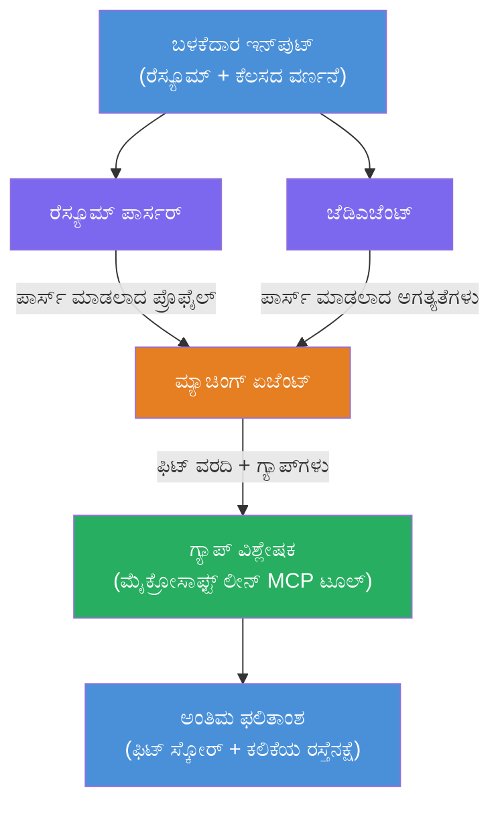

# ಪ್ರಯೋಗಶালা 02 - ಬಹು-ಏಜೆಂಟ್ ಕಾರ್ಯಪ್ರವಾಹ: ರೆಸ್ಯೂಮ್ → ಉದ್ಯೋಗ ಹೊಂದಾಣಿಕೆಯನ್ನು ಮೌಲ್ಯಮಾಪನ

---

## ನೀವು ನಿರ್ಮಿಸುವುದು

**ರೆಸ್ಯೂಮ್ → ಉದ್ಯೋಗ ಹೊಂದಾಣಿಕೆ ಮೌಲ್ಯಮಾಪಕ** - ನಾಲ್ಕು ತಜ್ಞ ಏಜೆಂಟ್‌ಗಳು ಸೇರಿಕೊಂಡು ಅಭ್ಯರ್ಥಿಯ ರೆಸ್ಯೂಮ್ ಉದ್ಯೋಗ ವಿವರಣೆಗೆ ಎಷ್ಟರ ಮಟ್ಟಿಗೆ ಹೊಂದಿಕೆಯಾಗುತ್ತದೆಯೋ ಅದನ್ನು ಮೌಲ್ಯಮಾಪನೆ ಮಾಡುತ್ತಾ, ನಂತರ ಗ್ಯಾಪ್‌ಗಳನ್ನು ಮುಚ್ಚಲು ವೈಯಕ್ತಿಕ ಶlearningಕ್ ಪಠ್ಯಕ್ರಮವನ್ನು ರಚಿಸುವ ಬಹು-ಏಜೆಂಟ್ ಕಾರ್ಯಪ್ರವಾಹ.

### ಏಜೆಂಟ್‌ ಗಳು

| ಏಜೆಂಟ್ | ಪಾತ್ರ |
|-------|------|
| **ರೆಸ್ಯೂಮ್ ಪಾರ್ಸರ್** | ರೆಸ್ಯೂಮ್ ಪಠ್ಯದಿಂದ ಸರಂಜಾಮಿ ಕೌಶಲ್ಯಗಳು, ಅನುಭವ, ಪ್ರಮಾಣೀಕರಣಗಳನ್ನು ಹೊರತೆಗೆದು ಹಿಡಿಯುತ್ತದೆ |
| **ಉದ್ಯೋಗ ವಿವರಣೆ ಏಜೆಂಟ್** | JDನಿಂದ ಬೇಕಾದ/ಪ್ರಾಧಾನ್ಯ ಕೌಶಲ್ಯಗಳು, ಅನುಭವ, ಪ್ರಮಾಣೀಕರಣಗಳನ್ನು ಹೊರತೆಗೆದು ಹಿಡಿಯುತ್ತದೆ |
| **ಹೋಲಿಕೆಯ ಏಜೆಂಟ್** | ಪ್ರೊಫೈಲ್ ಹಾಗೂ ಅಗತ್ಯಗಳನ್ನು ಹೋಲಿಸಿ → ಹೊಂದಾಣಿಕೆ ಅಂಕ್ (0-100) + ಹೊಂದಿದ/ಆಗಲದ ಕೌಶಲ್ಯಗಳು |
| **ಗ್ಯಾಪ್ ವಿಶ್ಲೇಷಕ** | ಸಂಪನ್ಮೂಲಗಳು, ಸಮಯರೇಖೆಗಳು, ಮತ್ತು ತ್ವರಿತ ಸಾಧನೆ ಪ್ರಾಜೆಕ್ಟುಗಳೊಂದಿಗೆ ವೈಯಕ್ತಿಕ ಶlearningಕ್ ಮಾರ್ಗರೆಖೆಯನ್ನು ನಿರ್ಮಿಸುತ್ತದೆ |

### ಡೆಮೊ ಕಾರ್ಯಪ್ರವಾಹ

**ರೆಸ್ಯೂಮ್ + ಉದ್ಯೋಗ ವಿವರಣೆ** ಅಪ್‌ಲೋಡ್ ಮಾಡಿ → **ಹೊಂದಾಣಿಕೆ ಅಂಕ್ + ಬಾಕಿ ಇರುವ ಕೌಶಲ್ಯಗಳು** ಪಡೆಯಿರಿ → ವೈಯಕ್ತಿಕ ಶlearningಕ್ ಮಾರ್ಗರೇಖೆ ಪಡೆಯಿರಿ.

### ಕಾರ್ಯಪ್ರವಾಹ ವಾಸ್ತುಶಿಲ್ಪ

> ಬೂದು = ಸಧಾರಣ ಏಜೆಂಟ್‌ಗಳು | ಕೆಂಪು ಹಣ್ಣುತ್ತಿರುವುದು = ಸಂಗ್ರಹಣಾ ಬಿಂದುವು | ಹಸಿರು = ಪರಿಕರಗಳೊಂದಿಗೆ ಅಂತಿಮ ಏಜೆಂಟ್. ವಿವರವಾದ ಚಿತ್ರಗಳು ಮತ್ತು ಡೇಟಾ ಹರಿವುಗಾಗಿ [ಮೊಡ್ಯೂಲ್ 1 - ವಾಸ್ತುಶಿಲ್ಪವನ್ನು ಅರ್ಥಮಾಡಿಕೊಳ್ಳಿ](docs/01-understand-multi-agent.md) ಮತ್ತು [ಮೊಡ್ಯೂಲ್ 4 - ಸಂಯೋಜನೆ ಮಾದರಿಗಳು](docs/04-orchestration-patterns.md) ನೋಡಿ.

### ಒಳಗೊಂಡ ವಿಷಯಗಳು

- **WorkflowBuilder** ಬಳಸಿ ಬಹು-ಏಜೆಂಟ್ ಕಾರ್ಯಪ್ರವಾಹ ರಚನೆ
- ಏಜೆಂಟ್ ಪಾತ್ರಗಳು ಮತ್ತು ಸಂಯೋಜನಾ ಪ್ರವಾಹ (ಸಧಾರಣ + ಕ್ರಮಬದ್ಧ) ನಿರ್ಧರಿಸುವುದು
- ಏಜೆಂಟ್‌ಗಳ ಮಧ್ಯೆ ಸಂವಹನ ಮಾದರಿಗಳು
- ಏಜೆಂಟ್ ಇನ್‌ಸ್ಪೆಕ್ಟರ್ ಬಳಸಿ ಸ್ಥಳೀಯ ಪರೀಕ್ಷೆ
- Foundry Agent ಸರ್ವೀಸ್‌ಗೆ ಬಹು-ಏಜೆಂಟ್ ಕಾರ್ಯಪ್ರವಾಹಗಳನ್ನು ಮರುಪೇರಿಸುವುದು

---

## ಮುಂಚಿತ ಅಗತ್ಯಗಳು

ಮೊದಲು ಪ್ರಯೋಗಶಾಲಾ 01 ಪೂರ್ಣಗೊಳಿಸಿ:

- [ಪ್ರಯೋಗಶಾಲಾ 01 - ಏಕ ಏಜೆಂಟ್](../lab01-single-agent/README.md)

---

## ಪ್ರಾರಂಭಿಸುವುದು

ಪೂರ್ಣ ಸ್ಥಾಪನೆ ಸೂಚನೆಗಳು, ಕೋಡ್ ನಡೆಸುವಿಕೆ, ಮತ್ತು ಪರೀಕ್ಷಾ ಆದೇಶಗಳಿಗೆ ನೋಡಿ:

- [ಪ್ರಯೋಗಶಾಲಾ 2 ಡಾಕ್ಸ್ - ಮುಂಚಿತ ಅಗತ್ಯಗಳು](docs/00-prerequisites.md)
- [ಪ್ರಯೋಗಶಾಲಾ 2 ಡಾಕ್ಸ್ - ಸಂಪೂರ್ಣ ಅಧ್ಯಯನ ಮಾರ್ಗ](docs/README.md)
- [PersonalCareerCopilot ಚಾಲನೆಯ ಮಾರ್ಗದರ್ಶನ](PersonalCareerCopilot/README.md)

## ಸಂಯೋಜನಾ ಮಾದರಿಗಳು (ಏಜೆಂಟಿಕ ಪರ್ಯಾಯಗಳು)

ಪ್ರಯೋಗಶಾಲಾ 2‌ನಲ್ಲಿ ಅನಿವಾರ್ಯ **ಸಧಾರಣ → ಸಂಗ್ರಹಣೆ → ಯೋಜಕ** ಪ್ರವಾಹವನ್ನು ಒಳಗೊಂಡಿದೆ, ಮತ್ತು ಡಾಕ್ಸ್‌ನಲ್ಲಿ ಬಲವಾದ ಏಜೆಂಟ್ ವರ್ತನೆ ತೋರಿಸಲು ಪರ್ಯಾಯ ಮಾದರಿಗಳನ್ನು ಕೂಡ ವಿವರಿಸಲಾಗಿದೆ:

- **ಭಾರಿತ ಒಕ್ಕೂಟದೊಂದಿಗೆ ಫ್ಯಾನ್-ಆನ್/ಫ್ಯಾನ್-ಇನ್**
- **ಅಂತಿಮ ಮಾರ್ಗರೆಖೆಗೆ ಮುನ್ನ ವಿಮರ್ಶಕ/ಆಲೋಚಕ ಹಾದಿ**
- **ಶರತಾಳಿದ ಮಾರ್ಗವ್ಯವಸ್ಥಕ** (ಹೊಂದಾಣಿಕೆ ಅಂಕ್ ಮತ್ತು ಬಾಕಿ ಕೌಶಲ್ಯಗಳ ಮೇಲೆ ಆಧಾರಿತ ಮಾರ್ಗ ಆಯ್ಕೆ)

ದಯವಿಟ್ಟು [docs/04-orchestration-patterns.md](docs/04-orchestration-patterns.md) ನೋಡಿ.

---

**ಹಿಂದಿನದು:** [ಪ್ರಯೋಗಶಾಲಾ 01 - ಏಕ ಏಜೆಂಟ್](../lab01-single-agent/README.md) · **ಮನೆಗೆ ಹಿಂತಿರುಗು:** [ಕಾರ್ಯಾಗಾರ ಮನೆ](../../README.md)

---

<!-- CO-OP TRANSLATOR DISCLAIMER START -->
**ಕಾರಣವಾಣಿ**:  
ಈ ದస్తಾವೇಜು AI ಅನುವಾದ ಸೇವೆ [Co-op Translator](https://github.com/Azure/co-op-translator) ಬಳಸಿ ಅನuvadಗೊಳ್ಳಲಾಗಿದೆ. ನಾವು ನಿಖರತೆಯತ್ತ ಪ್ರಯತ್ನಿಸುವುದಾದರೂ, ಸ್ವಯಂಚಾಲಿತ ಅನುವಾದಗಳಲ್ಲಿ ತಪ್ಪುಗಳು ಅಥವಾ ಅಸತ್ಯತೆಗಳು ಇರಬಹುದು ಎಂದು ದಯವಿಟ್ಟು ಗಮನಿಸಿ. ಮೂಲ ಭಾಷೆಯಲ್ಲಿ ಇರುವ ಮೂಲ ದಸ್ತಾವೇಜನ್ನು ಎಚ್ಚರಿಕೆಯಿಂದ ಅಧಿಕೃತ ಮೂಲವೆಂದು ಪರಿಗಣಿಸಬೇಕು. ಪ್ರಮುಖ ಮಾಹಿತಿಗಾಗಿ ವೃತ್ತಿಪರ ಮಾನವ ಅನುವಾದವನ್ನು ಶಿಫಾರಸು ಮಾಡಲಾಗುತ್ತದೆ. ಈ ಅನುವಾದದ ಬಳಕೆಯಿಂದ ಆಗುವ ಯಾವುದೇ ತಪ್ಪು ವ್ಯಾಖ್ಯಾನಗಳಿಗೆ ಅಥವಾ ಅರ್ಥಮಾಡಿಕೊಳ್ಳದಿರುವಿಕೆಗೆ ನಾವು ಹೊಣೆಗಾರರಲ್ಲ.
<!-- CO-OP TRANSLATOR DISCLAIMER END -->