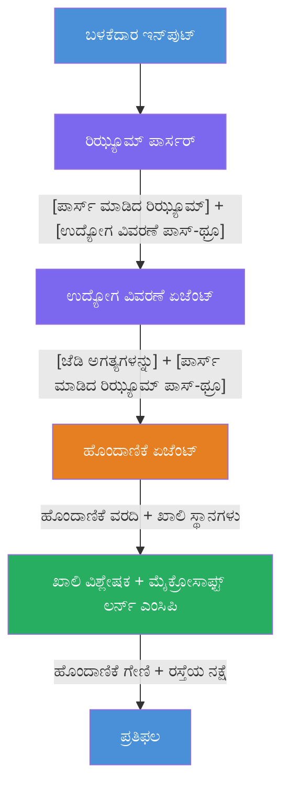

# ಪ್ರಯೋಗಾಲಯ 02 - ಮಲ್ಟಿ-ಏಜೆಂಟ್ ವರ್ಕ್‌ಫ್ಲೋ: ರೆಸ್ಯೂಮ್ → ಉದ್ಯೋಗ ಹೊಂದಿಕೆ ಮೌಲ್ಯಮಾಪಕ

## ಅವಲೋಕನ

ಈ ಹ್ಯಾಂಡ್ಸ್-ಆನ್ ಪ್ರಯೋಗಾಲಯದಲ್ಲಿ, ನೀವು VS ಕೋಡ್‌ನಲ್ಲಿ Foundry Toolkit ಬಳಸಿ **ವರ್ಕ್‌ಫ್ಲೋ-ಪ್ರಥಮ ಮಲ್ಟಿ-ಏಜೆಂಟ್ ಆ್ಯಪ್** ಅನ್ನು ನಿರ್ಮಿಸಿ Microsoft Foundry ಏಜೆಂಟ್ ಸೇವೆಗೆ ನಿಯೋಜಿಸುವಿರಿ.

**ನೀವು ನಿರ್ಮಿಸುವುದು:** ರೆಸ್ಯೂಮ್ → ಉದ್ಯೋಗ ಹೊಂದಿಕೆ ಮೌಲ್ಯಮಾಪಕ जो रೆಸ್ಯೂಮ್ ಮತ್ತು ಉದ್ಯೋಗ ವಿವರಣೆಗಳನ್ನು ಪಾರ್ಸ್ ಮಾಡಿ, ಹೊಂದಿಕೆಯನ್ನು ಅಂಕ ನೀಡುತ್ತದೆ, ಮತ್ತು Microsoft Learn ಸಂಪನ್ಮೂಲಗಳನ್ನು ಬಳಸಿ ವೈಯಕ್ತಿಕ ಕಲಿಕೆಯ ದಾಖಲೆ ನಕ್ಷೆಯನ್ನು ನೀಡುತ್ತದೆ.

---

## ವಾಸ್ತುಶಿಲ್ಪ

```mermaid
flowchart TD
    A["ಬಳಕೆದಾರ ಇನ್‌ಪುಟ್"] --> B["ರಿಝ್ಯೂಮ್ ಪಾರ್ಸರ್"]
    B -->|"[ಪಾರ್ಸ್ ಮಾಡಿದ ರಿಝ್ಯೂಮ್] + [ಉದ್ಯೋಗ ವಿವರಣೆ ಪಾಸ್-ಥ್ರೂ]"| C["ಉದ್ಯೋಗ ವಿವರಣೆ ಏಜೆಂಟ್"]
    C -->|"[ಜೆಡಿ ಅಗತ್ಯಗಳನ್ನು] + [ಪಾರ್ಸ್ ಮಾಡಿದ ರಿಝ್ಯೂಮ್ ಪಾಸ್-ಥ್ರೂ]"| D["ಹೊಂದಾಣಿಕೆ ಏಜೆಂಟ್"]
    D -->|ಹೊಂದಾಣಿಕೆ ವರದಿ + ಖಾಲಿ ಸ್ಥಾನಗಳು| E["ಖಾಲಿ ವಿಶ್ಲೇಷಕ + ಮೈಕ್ರೋಸಾಫ್ಟ್ ಲರ್ನ್ ಎಂಸಿಪಿ"]
    E -->|ಹೊಂದಾಣಿಕೆ ಗೇಣಿ + ರಸ್ತೆಯ ನಕ್ಷೆ| F["ಪ್ರತಿಫಲ"]

    style A fill:#4A90D9,color:#fff
    style B fill:#7B68EE,color:#fff
    style C fill:#7B68EE,color:#fff
    style D fill:#E67E22,color:#fff
    style E fill:#27AE60,color:#fff
    style F fill:#4A90D9,color:#fff
```

**ಹೇಗೆ ಕಾರ್ಯನಿರ್ವಹಿಸುತ್ತದೆ:**
1. ಬಳಕೆದಾರರು ರೆಸ್ಯೂಮ್ ಮತ್ತು ಉದ್ಯೋಗ ವಿವರಣೆಗಳನ್ನು ಪೇಸ್ಟ್ ಮಾಡುತ್ತಾರೆ.
2. **ResumeParser** ರೆಸ್ಯೂಮನ್ನು ಪಾರ್ಸ್ ಮಾಡಿ ಜಾಬ್ ವಿವರಣೆని ಅದೇ ಹಾಗೆಯೆ `[JOB DESCRIPTION PASS-THROUGH]` ವಿಭಾಗಕ್ಕೆ ನಕಲಿಸುತ್ತದೆ.
3. **JD Agent** ಪಾಸ್-ತ್ರೂ ತುದಿಯಿಂದ ಸಂರಚಿತ ಅವಶ್ಯಕತೆಗಳನ್ನು ತೆಗೆದುಹಾಕುತ್ತದೆ, ನಂತರ `[PARSED RESUME]` ಅನ್ನು `[PARSED RESUME PASS-THROUGH]` ಎಂದು ಮುಂದುವರೆಸುತ್ತದೆ.
4. **MatchingAgent** `[PARSED RESUME PASS-THROUGH]` ಮತ್ತು `[JD REQUIREMENTS]` ಅನ್ನು ಹೋಲಿಸಿ ಹೊಂದಿಕೆ ಅಂಕವನ್ನು ಪಂಟಿಸುತ್ತದೆ.
5. **GapAnalyzer** ಕೊರತೆಗಳನ್ನು ಪ್ರಾಯೋಗಿಕ ರಸ್ತೆಮಾರ್ಗದಲ್ಲಿ ಪರಿವರ್ತಿಸಿ, MCP ಮೂಲಕ ನಿಜವಾದ Microsoft Learn ಲಿಂಕ್‌ಗಳನ್ನು ಹುಡುಕುತ್ತದೆ.

---

## ಪೂರ್ವಶರತ್ತುಗಳು

ಮೊದಲು ಪ್ರಯೋಗಾಲಯ 01 ಪೂರ್ಣಗೊಳಿಸಿ:

- [ಪ್ರಯೋಗಾಲಯ 01 - ಸಿಂಗಲ್ ಏಜೆಂಟ್](../lab01-single-agent/README.md)

---

## ಭಾಗ 1: ಕ್ರಮವಾಗಿ ಮ್ಯಾಡ್ಯೂಲ್‌ಗಳನ್ನು ಓದಿ

ಸಂಪೂರ್ಣ ಕಲಿಕಾ ಮಾರ್ಗವನ್ನು ನೋಡಿ:

- [ಪ್ರಯೋಗಾಲಯ 2 ಡಾಕ್ಸ್ - ಪೂರ್ವಶರತ್ತುಗಳು](docs/00-prerequisites.md)
- [ಪ್ರಯೋಗಾಲಯ 2 ಡಾಕ್ಸ್ - ಸಂಪೂರ್ಣ ಕಲಿಕೆ ಮಾರ್ಗ](docs/README.md)
- [PersonalCareerCopilot ರನ್ ಮಾರ್ಗದರ್ಶಿ](PersonalCareerCopilot/README.md)

---

## ಭಾಗ 2: ವರ್ಕ್‌ಫ್ಲೋ ನಿರ್ಮಿಸಿ ಮತ್ತು ಪರೀಕ್ಷಿಸಿ

1. Foundry Toolkit ವಿಜಾರ್ಡ್ ಬಳಸಿ ವರ್ಕ್‌ಫ್ಲೋ ಆಧಾರಿತ ಪ್ರಾಜೆಕ್ಟ್ ಸ್ಕ್ಯಾಫೋಲ್ಡ್ ಮಾಡಿ.
2. `PersonalCareerCopilot/main.py`ನಿಂದ ಪ್ರಾಂಪ್ಟ್ ಬ್ಲಾಕ್ಸ್ ಮತ್ತು ವರ್ಕ್‌ಫ್ಲೋ ಗ್ರಾಫ್ ನಕಲಿಸಿ ನಿಮ್ಮ ವರಕ್‌ಸ್ಪೇಸ್‌ಗೆ ಇಲಿ.
3. ಏಜೆಂಟ್ ಇನ್ಸ್ಪೆಕ್ಟರ್ನೊಂದಿಗೆ ಸ್ಥಳೀಯವಾಗಿ ಓಡಿಸಿ ಮತ್ತು ಎಲ್ಲಾ ನಾಲ್ಕು ಏಜೆಂಟ್‌ಗಳು ಹಾಗೂ MCP ಯಂತ್ರವನ್ನು ಪರಿಶೀಲಿಸಿ.
4. ಸ್ಥಳೀಯ ಪರೀಕ್ಷೆ ಯಶಸ್ವಿಯಾದಾಗ Foundry ಗೆ ಹೋಸ್ಟ್ ಮಾಡಿದ ಏಜೆಂಟ್ ಅನ್ನು ನಿಯೋಜಿಸಿ.

---

## ಸಂಯೋಜನೆ ಮಾದರಿಗಳು

ಪ್ರಯೋಗಾಲಯ 02 ಡೀಫಾಲ್ಟ್ **ಫ್ಯಾನ್-ಆಟ್ → ಫ್ಯಾನ್-ಇನ್ → ಕ್ರಮಬದ್ಧ** ಪ್ರವರ್ತನೆಗಳನ್ನು ಒಳಗೊಂಡಿದ್ದು, ಡಾಕ್ಸ್ تجربೆ ಮಾಡಿಕೊಳ್ಳಲು ಪರ್ಯಾಯ ಸಂಯೋಜನೆ ಮಾದರಿಗಳನ್ನು ಸಹ ವಿವರಿಸುತ್ತವೆ.

- **ತೂಕದ ಒಪ್ಪಿಗೆಯೊಂದಿಗೆ ಫ್ಯಾನ್-ಆಟ್/ಫ್ಯಾನ್-ಇನ್**
- **ಅಂತಿಮ ರಸ್ತೆಮಾರ್ಗದ ಮೊದಲು ಪರಿಶೀಲಕ/ವಿಮರ್ಶಕ ಹಾದಿ**
- **ಹೊಂದಿಕೆಯ ಅಂಕ ಮತ್ತು ಕಾಣದ ಕೌಶಲ್ಯಗಳ ಆಧಾರದ ಮೇಲೆ ನಿರ್ದಿಷ್ಟ ಮಾರ್ಗ ನಿರ್ದೇಶಕ**

[docs/04-orchestration-patterns.md](docs/04-orchestration-patterns.md) ನೋಡಿ.

---

**ಹಿಂದಿನ:** [ಪ್ರಯೋಗಾಲಯ 01 - ಸಿಂಗಲ್ ಏಜೆಂಟ್](../lab01-single-agent/README.md) · **ಹೆರಿಗೆ:** [ಕಾರ್ಯಾಗಾರ ಮನೆ](../../README.md)

---

<!-- CO-OP TRANSLATOR DISCLAIMER START -->
**ಅಸ್ವೀಕಾರ**:
ಈ ದಸ್ತಾವೇಜು AI ಅನುವಾದ ಸೇವೆ [Co-op Translator](https://github.com/Azure/co-op-translator) ಬಳಸಿ ಅನುವಾದಿಸಲಾಗಿದೆ. ನಾವು ನಿಖರತೆಯನ್ನು ಸಾಧಿಸಲು ಪ್ರಯತ್ನಿಸುತ್ತಿದ್ದರೂ, ದಯವಿಟ್ಟು ಗಮನಿಸಿ, ಸ್ವಯಂಚಾಲಿತ ಅನುವಾದಗಳಲ್ಲಿ ದೋಷಗಳು ಅಥವಾ ಅಸಡ್ಡೆಗಳು ಇರಬಹುದು. ಮೂಲ ಭಾಷೆಯಲ್ಲಿರುವ ಮೂಲ ದಸ್ತಾವೇಜು ಪ್ರಾಮಾಣಿಕ ಮೂಲವೆಂದು ಪರಿಗಣಿಸಬೇಕು. ಪ್ರಮುಖ ಮಾಹಿತಿಗಾಗಿ, ವೃತ್ತಿಪರ ಮಾನವ ಅನುವಾದವನ್ನು ಶಿಫಾರಸು ಮಾಡಲಾಗುತ್ತದೆ. ಈ ಅನುವಾದವನ್ನು ಬಳಸುವ ಮೂಲಕ ಉಂಟಾಗುವ ಯಾವುದೇ ತಪ್ಪು ಅರ್ಥಗಳ ಅಥವಾ ತಪ್ಪು ವ್ಯಾಖ್ಯಾನಗಳ ಬಗ್ಗೆ ನಾವು ಹೊಣೆಗಾರರಲ್ಲ.
<!-- CO-OP TRANSLATOR DISCLAIMER END -->