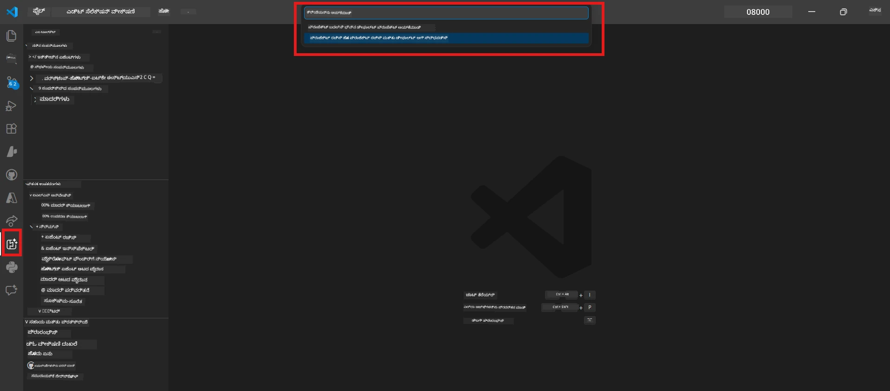

# Module 0 - ಪೂರ್ವಾಬಿಪ್ರಾಯಗಳು

ಲ್ಯಾಬ್ 02 ಪ್ರಾರಂಭಿಸುವ ಮುನ್ನ, ನೀವು ಕೆಳಗಿನವುಗಳನ್ನು ಪೂರ್ಣಗೊಳಿಸಿದ್ದೀರಿ ಎಂಬುದನ್ನು ಖಚಿತಪಡಿಸಿಕೊಳ್ಳಿ. ಈ ಲ್ಯಾಬ್ ನೇರವಾಗಿ ಲ್ಯಾಬ್ 01 ಮಿಗಿಲಾಗಿ ನಿರ್ಮಿಸಲಾಗುತ್ತದೆ - ಇದನ್ನು ದಾಟಬೇಡಿ.

---

## 1. ಲ್ಯಾಬ್ 01 ಪೂರ್ಣಗೊಳಿಸಿ

ಲ್ಯಾಬ್ 02 assumes ನೀವು ಈಗಾಗಲೇ:

- [x] [Lab 01 - Single Agent](../../lab01-single-agent/README.md) ರ ಎಲ್ಲಾ 8 ಮೋಡ್ಯೂಲುಗಳನ್ನು ಪೂರ್ಣಗೊಳಿಸಿದ್ದೀರಿ
- [x] Foundry Agent Service ಗೆ ಒಬ್ಬ ಏಜಂಟ್ ಯಶಸ್ವಿಯಾಗಿ ನಿಯೋಜಿಸಲಾಗಿದೆ
- [x] ಏಜಂಟ್ ಸ್ಥಳೀಯ Agent Inspector ಮತ್ತು Foundry Playground ಎರಡೂಲ್ಲಿ ಕಾರ್ಯನಿರ್ವಹಿಸುತ್ತದೆ ಎಂದು ಸತ್ವಪೂರ್ಣವಾಗಿ ಪರಿಶೀಲಿಸಲಾಗಿದೆ

ನೀವು ಲ್ಯಾಬ್ 01 ಪೂರ್ಣಗೊಳಿಸಿರಲಿಲ್ಲದಿದ್ದರೆ, ಹಿಂದಕ್ಕೆ ಹೋಗಿ ಇದೀಗ ಅದನ್ನು ಮುಗಿಸಿ: [Lab 01 Docs](../../lab01-single-agent/docs/00-prerequisites.md)

---

## 2. ಇತ್ತೀಚಿನ ಸೆಟಪ್ ಪರಿಶೀಲಿಸಿ

ಲ್ಯಾಬ್ 01 ನ ಎಲ್ಲಾ ಉಪಕರಣಗಳು ಇನ್ನೂ ಸ್ಥಾಪಿತವಾಗಿಯೂ ಕಾರ್ಯನಿರ್ವಹಿಸುತ್ತಿರಬೇಕು. ಈ ಸರಳ ಪರಿಶೀಲನೆಗಳನ್ನು ಮಾಡಿ:

### 2.1 ಅಜರ್ CLI

```powershell
az account show --query "{name:name, id:id}" --output table
```

ನಿರೀಕ್ಷೆ: ನಿಮ್ಮ ಚಂದಾದಾರರ ಹೆಸರು ಮತ್ತು ID ತೋರಿಸುತ್ತದೆ. ಇದರಲ್ಲಿ ವಿಫಲವಾದರೆ, [`az login`](https://learn.microsoft.com/cli/azure/authenticate-azure-cli-interactively) ಕಳುಹಿಸಿ.

### 2.2 VS Code ವಿಸ್ತರಣೆಗಳು

1. `Ctrl+Shift+P` ಒತ್ತಿ → **"Microsoft Foundry"** ಟೈಪ್ ಮಾಡಿ → ನೀವು ಆಜ್ಞೆಗಳು ಕಾಣಿಸುತ್ತಿರುವುದನ್ನು ಖಚಿತಪಡಿಸಿಕೊಳ್ಳಿ (ಉದಾ., `Microsoft Foundry: Create a New Hosted Agent`).
2. `Ctrl+Shift+P` ಒತ್ತಿ → **"Foundry Toolkit"** ಟೈಪ್ ಮಾಡಿ → ನೀವು ಆಜ್ಞೆಗಳು ಕಾಣಿಸುತ್ತಿರುವುದನ್ನು ಖಚಿತಪಡಿಸಿಕೊಳ್ಳಿ (ಉದಾ., `Foundry Toolkit: Open Agent Inspector`).

### 2.3 Foundry ಪ್ರಾಜೆಕ್ಟ್ ಮತ್ತು ಮಾದರಿ

1. VS Code Activity Bar ನಲ್ಲಿ **Microsoft Foundry** ಐಕಾನ್ ಕ್ಲಿಕ್ ಮಾಡಿರಿ.
2. ನಿಮ್ಮ ಪ್ರಾಜೆಕ್ಟ್ ಪಟ್ಟಿಯಲ್ಲಿ ಇದೆಯೇ ಎಂದು ಖಚಿತಪಡಿಸಿಕೊಳ್ಳಿ (ಉದಾ., `workshop-agents`).
3. ಪ್ರಾಜೆಕ್ಟ್ ವಿಸ್ತರಿಸಿ → ನಿಯೋಜಿಸಲಾದ ಮಾದರಿ ಇದೆ ಎಂದು ಪರಿಶೀಲಿಸಿ (ಉದಾ., `gpt-4.1-mini`) ಮತ್ತು **Succeeded** ಸ್ಥಿತಿಯಿದೆ ಎಂದು ಖಚಿತಪಡಿಸಿಕೊಳ್ಳಿ.

> **ನಿಮ್ಮ ಮಾದರಿ ನಿಯೋಜನೆ ಅವಧಿ ಮುಕ್ತಾಯವಾಗಿದೆ ಎಂದಾದರೆ:** ಕೆಲವು ಮುಕ್ತ-ತರಗತಿ ನಿಯೋಜನೆಗಳು ಸ್ವಯಂಚಾಲಿತವಾಗಿ ಅವಧಿ ಮುಗಿಸುವುವು. [Model Catalog](https://learn.microsoft.com/azure/foundry/foundry-models/concepts/models-sold-directly-by-azure) ನಿಂದ ಮರುನಿಯೋಜನೆ ಮಾಡಿ (`Ctrl+Shift+P` → **Microsoft Foundry: Open Model Catalog**).



### 2.4 RBAC ಪಾತ್ರಗಳು

Foundry ಪ್ರಾಜೆಕ್ಟ್ ನಲ್ಲಿ ನಿಮಗೆ **Azure AI User** ಪಾತ್ರವಿದೆ ಎಂದು ಖಚಿತಪಡಿಸಿಕೊಳ್ಳಿ:

1. [Azure Portal](https://portal.azure.com) → ನಿಮ್ಮ Foundry **ಪ್ರಾಜೆಕ್ಟ್** ಸಂಪನ್ಮೂಲ → **Access control (IAM)** → **[Role assignments](https://learn.microsoft.com/azure/foundry/concepts/rbac-foundry)** ಟ್ಯಾಬ್.
2. ನಿಮ್ಮ ಹೆಸರನ್ನು ಹುಡುಕಿ → ಖಚಿತಪಡಿಸಿಕೊಳ್ಳಿ **[Azure AI User](https://aka.ms/foundry-ext-project-role)** ಪಟ್ಟಿ ಮಾಡಲಾಗಿದೆ.

---

## 3. ಮಲ್ಟಿ-ಏಜೆಂಟ್ ಪರಿಕಲ್ಪನೆಗಳನ್ನು ಅರ್ಥಮಾಡಿಕೊಳ್ಳಿ (ಲ್ಯಾಬ್ 02 ಗಾಗಿ ಹೊಸದು)

ಲ್ಯಾಬ್ 02 ಮಾದರಿ ಪರಿಕಲ್ಪನೆಗಳನ್ನು ಪರಿಚಯಿಸುತ್ತದೆ, ಇದು ಲ್ಯಾಬ್ 01 ನಲ್ಲಿ ಮುಚ್ಚಲಾಗಿಲ್ಲ. ಮುಂದುವರೆಯುವ ಮುನ್ನ ಈ ಎಲ್ಲವನ್ನೂ ಓದಿ:

### 3.1 ಮಲ್ಟಿ-ಏಜೆಂಟ್ ವರ್ಕ್‌ಫ್ಲೋ ಎಂದರೇನು?

ಒಬ್ಬ ಏಜೆಂಟ್ ಎಲ್ಲವನ್ನು ನಿರ್ವಹಿಸುವ ಬದಲಿಗೆ, **ಮಲ್ಟಿ-ಏಜೆಂಟ್ ವರ್ಕ್‌ಫ್ಲೋ** ಕೆಲಸವನ್ನು ಹಲವಾರು ವೈಶಿಷ್ಟ್ಯಪೂರ್ಣ ಏಜೆಂಟ್‌ಗಳ ನಡುವೆ ಹಂಚುತ್ತದೆ. ಪ್ರತಿಯೊಬ್ಬ ಏಜೆಂಟ್ ಗೆ:

- ಅದರ ಸ್ವಂತ **ಸೂಚನೆಗಳು** (ಸಿಸ್ಟಂ ಪ್ರಾಂಪ್ಟ್)
- ಅದರ ಸ್ವಂತ **ಪಾತ್ರ** (ಅವನ ಜವಾಬ್ದಾರಿ ಏನು)
- ಐಚ್ಛಿಕ **ಉಪಕರಣಗಳು** (ಅವನಿಗೆ ಕರೆ ಮಾಡಬಹುದಾದ ಕಾರ್ಯಗಳು)

ಏಜೆಂಟ್‌ಗಳು **ಆರ್ಕೆಸ್ಟ್ರೇಷನ್ ಗ್ರಾಫ್** ಮೂಲಕ ಸಂವಹಿಸುತ್ತವೆ, ಇದು ಡೇಟಾ ಅವುಗಳ ನಡುವೆ ಹೇಗೆ ಹರಿಯುತ್ತದೆ ಎಂದು ವ್ಯಾಖ್ಯಾನಿಸುತ್ತದೆ.

### 3.2 WorkflowBuilder

`agent_framework` ನಿಂದ [`WorkflowBuilder`](https://learn.microsoft.com/agent-framework/workflows/agents-in-workflows) ವರ್ಗವು ಏಜೆಂಟ್‌ಗಳನ್ನು ಸುತ್ತುಗಟ್ಟುವ SDK ಘಟಕವಾಗಿದೆ:

```python
from agent_framework import WorkflowBuilder

workflow = (
    WorkflowBuilder(
        name="MyWorkflow",
        start_executor=agent_a,
        output_executors=[agent_d],
    )
    .add_edge(agent_a, agent_b)
    .add_edge(agent_a, agent_c)
    .add_edge(agent_b, agent_d)
    .add_edge(agent_c, agent_d)
    .build()
)
```

- **`start_executor`** - ಬಳಕೆದಾರನ ಇನ್ಪುಟ್ ಪಡೆಯುವ ಮೊದಲ ಏಜೆಂಟ್
- **`output_executors`** - ಅಂತಿಮ ಪ್ರತಿಕ್ರಿಯೆಯಾಗುವ ಏಜೆಂಟ್ (ಗಳ)
- **`add_edge(source, target)`** - `target` ಗೆ `source` ನ ಅಭିಸರಿನ (output) ದೊರಕುತಿದ್ದೆಂದು ವ್ಯಾಖ್ಯಾನಿಸುತ್ತದೆ

### 3.3 MCP (ಮಾದರಿ ಸಂಧರ್ಭ ಪ್ರೊಟೋಕಾಲ್) ಉಪಕರಣಗಳು

ಲ್ಯಾಬ್ 02 ಒಂದು **MCP ಉಪಕರಣ** ಬಳಸುತ್ತದೆ, ಇದು Microsoft Learn API ಕರೆಮಾಡಿ ಕಲಿಕೆಯ ಸಂಪನ್ಮೂಲಗಳನ್ನು ಪಡೆಯುತ್ತದೆ. [MCP (Model Context Protocol)](https://modelcontextprotocol.io/introduction) ಎಂಬುದು AI ಮಾದರಿಗಳನ್ನು ಬಾಹ್ಯ ಡೇಟಾ ಮೂಲಗಳಿಗೆ ಮತ್ತು ಸಾಧನಗಳಿಗೆ ಸಂಪರ್ಕಿಸುವ ಮಾನದಂಡಿತ ಪ್ರೊಟೋಕಾಲ್.

| ಪದ | ವ್ಯಾಖ್ಯಾನ |
|------|----------|
| **MCP ಸರ್ವರ್** | [MCP ಪ್ರೊಟೋಕಾಲ್](https://learn.microsoft.com/azure/foundry/agents/how-to/tools/model-context-protocol) ಮೂಲಕ ಉಪಕರಣಗಳು/ಸಂಪನ್ಮೂಲಗಳನ್ನು ಹೀಗೆ ಪ್ರದರ್ಶಿಸುವ ಸೇವೆ |
| **MCP ಕ್ಲೈಂಟ್** | MCP ಸರ್ವರ್ ಗೆ ಸಂಪರ್ಕ ಹೊಂದಿ ಆ ಅದರ ಉಪಕರಣಗಳನ್ನು ಕರೆ ಮಾಡುವ ನಿಮ್ಮ ಏಜೆಂಟ್ ಕೋಡ್ |
| **[Streamable HTTP](https://learn.microsoft.com/agent-framework/agents/tools/hosted-mcp-tools)** | MCP ಸರ್ವರ್ ಜೊತೆ ಸಂವಹನಕ್ಕಾಗಿ ಬಳಸುವ ಸಂಚಾರ ವಿಧಾನ |

### 3.4 ಲ್ಯಾಬ್ 02 ಮತ್ತು ಲ್ಯಾಬ್ 01 ನಡುವೆ ವ್ಯತ್ಯಾಸ

| ಅಂಶ | ಲ್ಯಾಬ್ 01 (ಏಕ ಏಜೆಂಟ್) | ಲ್ಯಾಬ್ 02 (ಮಲ್ಟಿ-ಏಜೆಂಟ್) |
|--------|----------------------|---------------------|
| ಏಜೆಂಟ್‌ಗಳು | 1 | 4 (ವೈಶಿಷ್ಟ್ಯಪೂರ್ಣ ಪಾತ್ರಗಳು) |
| ಆರ್ಕೆಸ್ಟ್ರೇಷನ್ | ಇಲ್ಲ | WorkflowBuilder (ಸಮಾನಾಂತರ + ಕ್ರಮೋಪಯೋಗಿ) |
| ಉಪಕರಣಗಳು | ಐಚ್ಛಿಕ `@tool` ಕಾರ್ಯ | MCP ಉಪಕರಣ (ಬಾಹ್ಯ API ಕರೆ) |
| ಸಂಕೀರ್ಣತೆ | ಸರಳ ಪ್ರಾಂಪ್ಟ್ → ಪ್ರತಿಕ್ರಿಯೆ | ರೆಸ್ಯೂಮ್ + ಜಾಬ್ ಡಿಸ್ಕ್ರಿಪ್ಷನ್ → ಹೊಂದಾಣಿಕೆ ಅಂಕಿ → ಯೋಜನೆ |
| ಸಂಧರ್ಭ ಹರಿವು | ನೇರ | ಏಜೆಂಟ್ ಇದ್ದು ಏಜೆಂಟ್ ಗೆ ಕಳುಹಿಸುವಿಕೆ |

---

## 4. ಲ್ಯಾಬ್ 02 ಗಾಗಿ ಕಾರ್ಯಾಗಾರ ರೆಪೊ ಸ್ಟ್ರಕ್ಚರ್

ನೀವು ಲ್ಯಾಬ್ 02 ಫೈಲ್‌ಗಳು ಎಲ್ಲಿವೆ ಎಂಬುದನ್ನು ತಿಳಿದುಕೊಳ್ಳಿ:

```
workshop/
└── lab02-multi-agent/
    ├── README.md                       ← Lab overview
    ├── docs/                           ← You are here
    │   ├── README.md                   ← Learning path index
    │   ├── 00-prerequisites.md         ← This file
    │   ├── 01-understand-multi-agent.md
    │   ├── ...
    │   └── 08-troubleshooting.md
    └── PersonalCareerCopilot/          ← The agent project
        ├── agent.yaml                  ← Agent definition
        ├── main.py                     ← 4-agent workflow code
        ├── Dockerfile                  ← Container configuration
        └── requirements.txt            ← Python dependencies
```

---

### ಪರಿಶೀಲನೆ

- [ ] ಲ್ಯಾಬ್ 01 ಸಂಪೂರ್ಣವಾಗಿ ಪೂರ್ಣಗೊಂಡಿದೆ (ಎಲ್ಲ 8 ಮೋಡ್ಯೂಲುಗಳು, ಏಜೆಂಟ್ ನಿಯೋಜಿಸಲಾಗಿದೆ ಮತ್ತು ಪರಿಶೀಲಿಸಲಾಗಿದೆ)
- [ ] `az account show` ನಿಮ್ಮ ಚಂದಾದಾರರ ಮಾಹಿತಿಯನ್ನು ತೋರಿಸುತ್ತದೆ
- [ ] Microsoft Foundry ಮತ್ತು Foundry Toolkit ವಿಸ್ತರಣೆಗಳು ಸ್ಥಾಪಿತವಾಗಿವೆ ಮತ್ತು ಪ್ರತಿಕ್ರಿಯಿಸುತ್ತಿವೆ
- [ ] Foundry ಪ್ರಾಜೆಕ್ಟ್ ನಲ್ಲಿ ನಿಯೋಜಿಸಲಾದ ಮಾದರಿ ಇದೆ (ಉದಾ., `gpt-4.1-mini`)
- [ ] ಪ್ರಾಜೆಕ್ಟ್ ನಲ್ಲಿ ನಿಮಗೆ **Azure AI User** ಪಾತ್ರವಿದೆ
- [ ] ಮೇಲಿನ ಮಲ್ಟಿ-ಏಜೆಂಟ್ ಪರಿಕಲ್ಪನೆಗಳನ್ನು ಓದಿದ್ದು WorkflowBuilder, MCP ಮತ್ತು ಏಜೆಂಟ್ ಆರ್ಕೆಸ್ಟ್ರೇಷನ್ ಅನ್ನು ಅರ್ಥಮಾಡಿಕೊಂಡಿದ್ದೀರಿ

---

**ಮುಂದೆ:** [01 - ಮಲ್ಟಿ-ಏಜೆಂಟ್ ವಾಸ್ತುಶಿಲ್ಪವನ್ನು ಅರ್ಥಮಾಡಿಕೊಳ್ಳಿ →](01-understand-multi-agent.md)

---

<!-- CO-OP TRANSLATOR DISCLAIMER START -->
**ನಾಯಕರ ಮಾಹಿತಿ**:  
ಈ ಡಾಕ್ಯೂಮೆಂಟ್ ಅನ್ನು AI ಭಾಷಾಂತರ ಸೇವೆ [Co-op Translator](https://github.com/Azure/co-op-translator) ಬಳಸಿ ಭಾಷಾಂತರಿಸಲಾಗಿದೆ. ನಾವು ಖಚಿತತೆಯಿಗಾಗಿ ಪ್ರಯತ್ನಿಸುತ್ತಿದ್ದರೂ, ಸ್ವಯಂಚಾಲಿತ ಭಾಷಾಂತರಗಳಲ್ಲಿ ದೋಷಗಳು ಅಥವಾ ಅಸರುವಾತೆಗಳು ಇರಬಹುದು ಎಂಬುದನ್ನು ಗಮನದಲ್ಲಿಡಿ. ಮೂಲ ಭಾಷೆಯಲ್ಲಿ ಇರುವ ಪ್ರಾರಂಭಿಕ ಡಾಕ್ಯೂಮೆಂಟ್ ಅನ್ನು ಅಧಿಕೃತ ಮೂಲವೆಂದು ಪರಿಗಣಿಸಬೇಕು. ಮಹತ್ವಪೂರ್ಣ ಮಾಹಿತಿಗೆ, ವೃತ್ತಿಪರ ಮಾನವ ಭಾಷಾಂತರವನ್ನು ಶಿಫಾರಸು ಮಾಡಲಾಗುತ್ತದೆ. ಈ ಭಾಷಾಂತರವನ್ನು ಬಳಸುವ ಮೂಲಕ ಉಂಟಾಗಬಹುದಾದ ಯಾವುದೇ ತಪ್ಪುಬಲ್ಲಿಕೆಗಳು ಅಥವಾ ಅರ್ಥಕ್ಷೇಪಗಳಿಗೆ ನಾವು ಹೊಣೆಗಾರರಾಗಿರಲ್ಲ.
<!-- CO-OP TRANSLATOR DISCLAIMER END -->