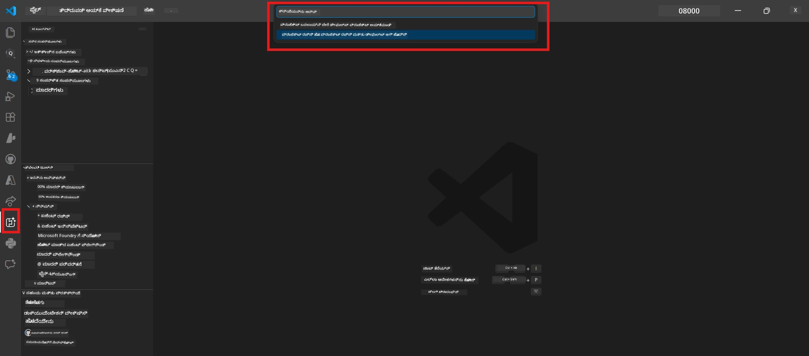

# ಮೋಡ್ಯೂಲ್ 0 - ಪರಿಚಯ

⏱️ ~10 ನಿಮಿಷಗಳು

> [!WARNING]
> **ಪೂರ್ವದೃಷ್ಟಿ ಮತ್ತು ನಿರ್ಬಂಧಗಳು:** [Hosted Agents](https://learn.microsoft.com/azure/foundry/agents/concepts/hosted-agents) ಪ್ರಸ್ತುತ **ಸಾರ್ವಜನಿಕ ಪೂರ್ವದೃಷ್ಟಿಯಲ್ಲಿ** ಇದ್ದು - ಉತ್ಪಾದನಾ ಕೆಲಸಗಳಿಗೆ ಶಿಫಾರಸು ಮಾಡುತ್ತಿಲ್ಲ. ಈ ಕಾರ್ಯ ಶಾಲೆಯಲ್ಲಿ ತೋರಿಸಲಾದ ಕೆಲವು ವೈಶಿಷ್ಟ್ಯಗಳು ಸೇವೆ GA ತಲುಪುವಂತೆ ಬದಲಾಗಬಹುದು.

## ನೀವು 무엇 ನಿರ್ಮಿಸಬಹುದು

ಈ ಪ್ರಯೋಗಶಾಲೆಯಲ್ಲಿ, ನೀವು ಲ್ಯಾಬ್ 01 ನಿಂದ ಏಕರೂಪ ಏಜೆಂಟ್ ಕೌಶಲ್ಯಗಳನ್ನು ವಿಸ್ತರಿಸಿ **ಬಹು ಏಜೆಂಟ್ ವರ್ಕ್‌ಫ್ಲೋ** ಅನ್ನು ನಿರ್ಮಿಸಲಿದ್ದೀರಿ - ರೆಸ್ಯೂಮ್ → ಕೆಲಸ ಹೊಂದಾಣಿಕೆ ಮೌಲ್ಯಮಾಪಕ.

ನೀವು ಒಂದು **ರೆಸ್ಯೂಮ್** ಮತ್ತು ಒಂದು **ಕೆಲಸದ ವಿವರಣೆ** ಅನ್ನು ಪೇಸ್ಟ್ ಮಾಡುತ್ತೀರಿ. ನಾಲ್ಕು ವಿಶೇಷೀಕೃತ ಏಜೆಂಟ್‌ಗಳು ಕ್ರಮವಾಗಿ ಇನ್‌ಪುಟ್ ಅನ್ನು ಪ್ರಕ್ರಿಯೆ ಮಾಡುತ್ತವೆ, ನಂತರ ಹಿಂತಿರುಗಿಸುತ್ತವೆ:
- ಹೊಂದಾಣಿಕೆ ಅಂಕ (0–100 ಅಂಕಗಳ ವಿವರಣೆಯೊಂದಿಗೆ)
- ಕೌಶಲ್ಯ ಮತ್ತು ಪ್ರಮಾಣಪತ್ರ ವ್ಯತ್ಯಾಸ ಪಟ್ಟಿ
- ಪ್ರತಿ ವ್ಯತ್ಯಾಸಕ್ಕೆ ನಿಜವಾದ Microsoft Learn ಲಿಂಕ್‌ಗಳೊಂದಿಗೆ ವೈಯಕ್ತಿಕ ಕಲಿಕಾ ರೂಪರೇಖೆ

**ವರ್ಕ್‌ಫ್ಲೋ ಬಳCpuವಾಗಿಸುತ್ತದೆ:**
- **Microsoft Agent Framework** - ಕ್ರಮಾತ್ಮಕ ಪೈಪ್ಲೈನ್ ನಿರ್ವಾಹಕತೆಗಾಗಿ `WorkflowBuilder`
- **Foundry Toolkit for VS Code** - ಸ್ಕಾಫೋಲ್ಡ್ ಮಾಡುವುದು, ಸ್ಥಳೀಯವಾಗಿ ಪರೀಕ್ಷಿಸುವುದು, ನಿಯೋಜಿಸುವುದು
- **ಏಐ ಮಾದರಿ** (ಉದಾ. `gpt-4.1-mini`) - ನಾಲ್ಕು ಏಜೆಂಟ್‌ಗಳೆಲ್ಲರೂ ಬಳಸುವದು
- **Microsoft Learn MCP ಸರ್ವರ್** - ಪ್ರತಿ ಕೌಶಲ್ಯ ವ್ಯತ್ಯಾಸಕ್ಕೆ ನಿಜವಾದ ಕಲಿಕೆಯ ಸಂಪನ್ಮೂಲ ಲಿಂಕ್‌ಗಳನ್ನು ಒದಗಿಸುವದು

---

## ನಿಮ್ಮ ಮಾರ್ಗವನ್ನು ಆಯ್ಕೆಮಾಡಿ

> ⚠️ **ನೀವು ಲ್ಯಾಬ್ 01 ನಲ್ಲಿ ಬಳಸಿದ ಅದೇ ಮಾರ್ಗವನ್ನು ನೈವರಿಸಿಕೊಂಡು ಮುಂದುವರಿಯಿರಿ.**

<details open>
<summary><strong>🅰️ ಮಾರ್ಗ A - ಅಜೂರ್ ಕ್ಲೌಡ್ (ಅಜೂರ್ ಸಬ್ಸ್ಕ್ರಿಪ್ಶನ್ ಅಗತ್ಯವಿದೆ)</strong></summary>

| | ವಿವರಗಳು |
|---|---|
| **ಇದನ್ನು ಯಾರಿಗಾಗಿ?** | ನೀವು ಅಜೂರ್ ಸಬ್ಸ್ಕ್ರಿಪ್ಶನ್ ಬಳಸಿ ಲ್ಯಾಬ್ 01 ಮುಗಿಸಿದ್ದಾರೆ |
| **ಮಾದರಿ** | Foundry ಮೂಲಕ ಅಜೂರ್ OpenAI (ಉದಾ., `gpt-4.1-mini`) |
| **ಮುಡ್ಯೂಲ್‌ಗಳು ಆವರಿಸಿದೆ** | ಎಲ್ಲಾ ಮುಡ್ಯೂಲ್‌ಗಳು (00–09) |
| **ಕ್ಲೌಡ್‌ಗೆ ನಿಯೋಜನೆ?** | ✅ ಹೌದು - ಸಂಪೂರ್ಣ ಅಂತ್ಯ-ಇನ್ಡ್ ನಿಯೋಜನೆ |

</details>

<details open>
<summary><strong>🅱️ ಮಾರ್ಗ B - Foundry ಲೋಕಲ್ (ಅಜೂರ್ ಸಬ್ಸ್ಕ್ರಿಪ್ಶನ್ ಅಗತ್ಯವಿಲ್ಲ)</strong></summary>

| | ವಿವರಗಳು |
|---|---|
| **ಇದನ್ನು ಯಾರಿಗಾಗಿ?** | ನೀವು Foundry Local ಬಳಸಿ ಲ್ಯಾಬ್ 01 ಮುಗಿಸಿದ್ದಾರೆ |
| **ಮಾದರಿ** | Foundry Local (ಉಚಿತ, ನಿಮ್ಮ ಯಂತ್ರದಲ್ಲಿ ಚಲಿಸುವದು) |
| **ಮುಡ್ಯೂಲ್‌ಗಳು ಆವರಿಸಿದೆ** | ಮುಡ್ಯೂಲ್ 00–05 (06–07 ಕೂಡಲೇ ಬಿಟ್ಟು - ನಿಯೋಜನೆ ಮತ್ತು ಕ್ಲೌಡ್ ಸತ್ಯೀಕರಣ) |
| **ಕ್ಲೌಡ್‌ಗೆ ನಿಯೋಜನೆ?** | ❌ ಅಲ್ಲ - ಏಜೆಂಟ್ ಇನ್ಸ್‌ಪೆಕ್ಟರ್ ಮೂಲಕ ಸ್ಥಳೀಯ ಪರೀಕ್ಷೆ ಮಾತ್ರ |

</details>

---

## ಲ್ಯಾಬ್ 01 ಪರಿಶೀಲನೆ

ಲ್ಯಾಬ್ 02 ನೇರವಾಗಿ ಲ್ಯಾಬ್ 01 ಮೇಲೆ ನಿರ್ಮಿಸಲಾಗುತ್ತದೆ. ಇಲ್ಲಿಗೆ ಶುರುಮಾಡುವ ಮೊದಲು ಲ್ಯಾಬ್ 01 ಮುಗಿಸಿ.

ಇನ್ನೂ ಲ್ಯಾಬ್ 01 ಮಾಡಿಲ್ಲವೇ? ಇಲ್ಲಿ ಪ್ರಾರಂಭಿಸಿ: [Lab 01 - Introduction](../../lab01-single-agent/docs/00-prerequisites.md)

<details open>
<summary><strong>🅰️ ಮಾರ್ಗ A - ಅಜೂರ್ ಕ್ಲೌಡ್</strong></summary>

```powershell
az account show --query "{name:name, id:id}" --output table
```

ವಿಫಲವಾದರೆ, `az login` ಅನ್ನು ಚಲಾಯಿಸಿ. ನಂತರ VS Code ನಲ್ಲಿ ಪರಿಶೀಲಿಸಿ:

1. `Ctrl+Shift+P` → ಟೈಪ್ ಮಾಡಿ **Foundry Toolkit** → ಕಮಾಂಡ್‌ಗಳು ಪ್ರತ್ಯೇಕವಾಗಿವೆ ಎಂದು ದೃಢೀಕರಿಸಿ.
2. **Foundry Toolkit** ಐಕಾನ್ ಕ್ಲಿಕ್ ಮಾಡಿ → ನಿಮ್ಮ ಯೋಜನೆ ಮತ್ತು ನೀಡಲಾದ ಮಾದರಿ **ಯಶಸ್ವಿಯಾಗಿದೆ** ಎಂದು ತೋರಿಸುತ್ತದೆ.



> **RBAC:** ನೀವು ಲ್ಯಾಬ್ 01 ನಲ್ಲಿ **Foundry User** ಹಂಚಿದ್ದೀರಿ. ಪುನಃ ಹಂಚಿಕೆಗೆ ಅಗತ್ಯವಿದ್ದರೆ, [Lab 01, Module 1](../../lab01-single-agent/docs/01-setup.md#deploy-a-model--assign-rbac) ನೋಡಿ. ಈ ಪಾತ್ರದ ಹೆಸರು ಹಳೆಯದಾಗಿ **Azure AI User** ಆಗಿತ್ತು - ಅದೇ ಅನುಮತಿಗಳು.

</details>

<details open>
<summary><strong>🅱️ ಮಾರ್ಗ B - Foundry ಲೋಕಲ್</strong></summary>

```powershell
Invoke-WebRequest -Uri "http://localhost:5273/v1/health" -UseBasicParsing | Select-Object StatusCode
```

ನಿರೀಕ್ಷಿತ: `StatusCode: 200`. ಇಲ್ಲದಿದ್ದರೆ, Foundry Toolkit ಬದಿಪಡೆಯಿಂದ Foundry Local ಅನ್ನು ಮರುಪ್ರಾರಂಭಿಸಿ.

> ಎಲ್ಲ ಇನ್‌ಫರೆನ್ಸ್ ನಿಮ್ಮ ಯಂತ್ರದಲ್ಲಿ ನಡೆಯುತ್ತದೆ. ಏಕೈಕ ಹೊರಬಂದ ಕರೆ MCP ಉಪಕರಣಕ್ಕೆ `https://learn.microsoft.com/api/mcp` ಗೆ.

</details>

---

## ಲ್ಯಾಬ್ 02 ನಲ್ಲಿ ಹೊಸದಾಗಿದೆ ಏನು

| | ಲ್ಯಾಬ್ 01 | ಲ್ಯಾಬ್ 02 |
|--|--------|--------|
| ಏಜೆಂಟ್‌ಗಳು | 1 | 4 (WorkflowBuilder ಜೊತೆ ಸರಪಳಿಯಾಗಿ) |
| ಸ್ಕಾಫೋಲ್ಡ್ ಟೆಂಪ್ಲೇಟ್ | ಮೂಲ - ಏಜೆಂಟ್ ಫ್ರೇಮ್‌ವರ್ಕ್ | ವರ್ಕ್‌ಫ್ಲೋಗಳು - ಏಜೆಂಟ್ ಫ್ರೇಮ್‌ವರ್ಕ್ |
| ಹೊಸ ಪ್ಯಾಕೇಜ್ | - | `mcp` |
| ನಿರ್ವಾಹಕತೆ | ಒಂದೇ ಸಂಭಾಷಣಾತ್ಮಕ ಏಜೆಂಟ್ | ಕ್ರಮಾತ್ಮಕ ಪೈಪ್ಲೈನ್ (WorkflowBuilder) |
| ಹೊಸ ಉಪಕರಣ | - | `search_microsoft_learn_for_plan` (MCP) |

---

**ಮುಂದೆ:** [01 - ವಿಸ್ತೃತವಾಗಿ ಸ್ಥಾಪತ್ಯದ ಅರ್ಥಮಾಡಿಕೊಳ್ಳಿ →](01-understand-multi-agent.md)

---

<!-- CO-OP TRANSLATOR DISCLAIMER START -->
**ಅಸ್ವೀಕಾರ**:
ಈ ದಸ್ತಾವೇಜು AI ಅನುವಾದ ಸೇವೆ [Co-op Translator](https://github.com/Azure/co-op-translator) ಬಳಸಿ ಅನುವಾದಿಸಲಾಗಿದೆ. ನಾವು ನಿಖರತೆಯನ್ನು ಸಾಧಿಸಲು ಪ್ರಯತ್ನಿಸುತ್ತಿದ್ದರೂ, ದಯವಿಟ್ಟು ಗಮನಿಸಿ, ಸ್ವಯಂಚಾಲಿತ ಅನುವಾದಗಳಲ್ಲಿ ದೋಷಗಳು ಅಥವಾ ಅಸಡ್ಡೆಗಳು ಇರಬಹುದು. ಮೂಲ ಭಾಷೆಯಲ್ಲಿರುವ ಮೂಲ ದಸ್ತಾವೇಜು ಪ್ರಾಮಾಣಿಕ ಮೂಲವೆಂದು ಪರಿಗಣಿಸಬೇಕು. ಪ್ರಮುಖ ಮಾಹಿತಿಗಾಗಿ, ವೃತ್ತಿಪರ ಮಾನವ ಅನುವಾದವನ್ನು ಶಿಫಾರಸು ಮಾಡಲಾಗುತ್ತದೆ. ಈ ಅನುವಾದವನ್ನು ಬಳಸುವ ಮೂಲಕ ಉಂಟಾಗುವ ಯಾವುದೇ ತಪ್ಪು ಅರ್ಥಗಳ ಅಥವಾ ತಪ್ಪು ವ್ಯಾಖ್ಯಾನಗಳ ಬಗ್ಗೆ ನಾವು ಹೊಣೆಗಾರರಲ್ಲ.
<!-- CO-OP TRANSLATOR DISCLAIMER END -->