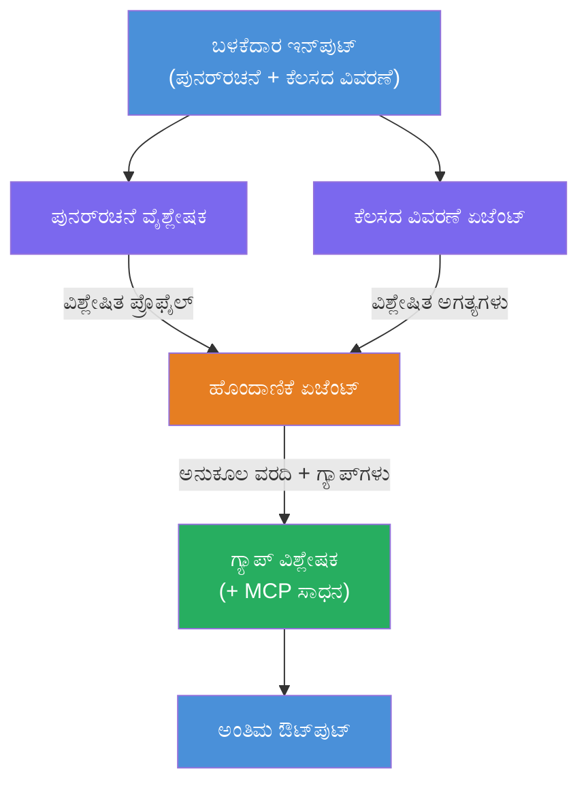
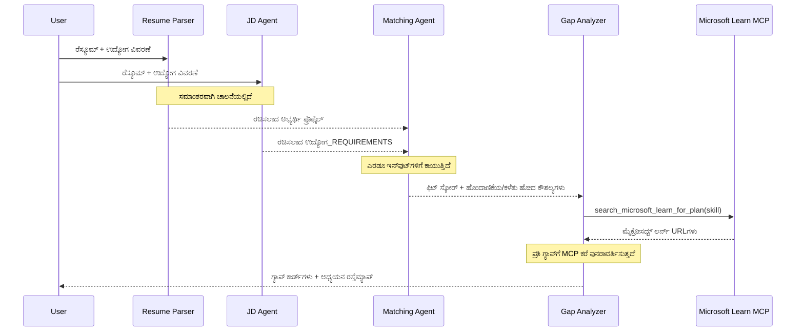
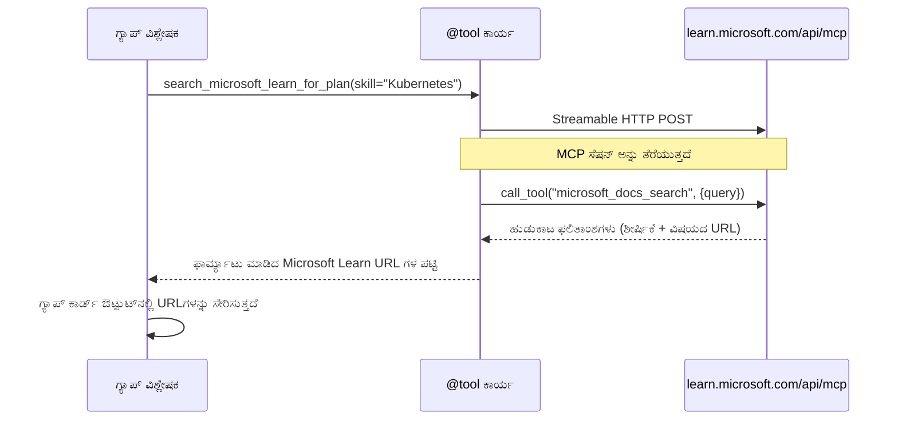

# Module 1 - ಮಲ್ಟಿ-ಏಜೆಂಟ್ ಸಾಂರಚನೆ ಅನ್ನು ಅರ್ಥಮಾಡಿಕೊಳ್ಳುವುದು

ಈ模块ನಲ್ಲಿ, ನೀವು Resume → Job Fit Evaluator ನ ಸಾಂರಚನೆ ಬಗ್ಗೆ ತಿಳಿದುಕೊಳ್ಳುತ್ತೀರಿ, ಯಾವುದೇ ಕೋಡ್ ಬರೆಯೋದಕ್ಕಿಂತ ಮೊದಲು. [ಮಲ್ಟಿ-ಏಜೆಂಟ್ ವರ್ಕ್‌ಫ್ಲೋಗಳನ್ನು](https://learn.microsoft.com/azure/architecture/ai-ml/idea/multiple-agent-workflow-automation) ಡಿಬಗ್ ಮಾಡಲು ಮತ್ತು ವಿಸ್ತರಿಸಲು, ಆರ್ಕಸ್ಟ್ರೇಷನ್ ಗ್ರಾಫ್, ಏಜೆಂಟ್ ಪಾತ್ರಗಳು ಮತ್ತು ಡೇಟಾ ಹರಿವು ಅರ್ಥಮಾಡಿಕೊಳ್ಳುವುದು ಅತ್ಯಂತ ಮುಖ್ಯ.

---

## ಈ ಸಮಸ್ಯೆಯನ್ನು ಇದು ಹೇಗೆ ಪರಿಹರಿಸುತ್ತದೆ

೧. **ಪಾರ್ಸಿಂಗ್** - ನೆರೆದಿಲ್ಲದ ಪಠ್ಯ (ರಿಜ್ಯೂಮ್) ನಿಂದ ರಚಿಸಲಾದ ಡೇಟಾ ತೆಗೆದುಹಾಕುವುದು  
೨. **ವಿಶ್ಲೇಷಣೆ** - ಕೆಲಸದ ವಿವರಣೆ ಯಿಂದ ಅಗತ್ಯಗಳನ್ನು ತೆಗೆಯುವುದು  
೩. **ಹೋಲಿಕೆ** - ಎರಡರ ಮಧ್ಯೆ ಹೊಂದಾಣಿಕೆಯನ್ನು ಅಂಕೆ ಮಾಡುವುದು  
೪. **ತೀರ್ಪಿಸುವಿಕೆ** - ಗ್ಯಾಪ್‌ಗಳನ್ನು ಮುಚ್ಚಲು ಶಿಕ್ಷಣ ಸಂರಚನೆ ರೂಪಿಸುವುದು  

ಒಂದು ಏಜೆಂಟ್ ಆ ಕಡೆಗಳನ್ನೆಲ್ಲಾ ಒಂದೇ ಪ್ರಾಂಪ್ಟಿನಲ್ಲಿ ಮಾಡುವಾಗ:  
- ಪಾರ್ಸಿಂಗ್ ಮಾಡೋದಕ್ಕೆ ಹೊರತಾಗಿ ಅಪ್ರತಿಪೂರ್ಣ ಪಡೆದುಕೊಳ್ಳುವುದು  
- ಆಳವಾದ ಅಂಕೆ ವೀಕ್ಷಣೆ ಇಲ್ಲ (ಪ್ರಮಾಣಾಧಾರಿತ ಹಂಚಿಕೆ ಇಲ್ಲ)  
- ಸಾಮಾನ್ಯ ಶಿಕ್ಷಣ ಮಾರ್ಗಗಳು (ನಿರ್ದಿಷ್ಟ ಗ್ಯಾಪ್‌ಗಳಿಗೆ ಹೊಂದಾಣಿಕೆ ಇಲ್ಲ)  

**ನಾಲ್ಕು ವಿಶೇಷ ಏಜೆಂಟ್‌ಗಳಾಗಿ ವಿಭಜಿಸುವುದರಿಂದ**, ಪ್ರತಿಯೊಬ್ಬರೂ ತನ್ನ ಕಾರ್ಯಕ್ಕೆ ಸಮರ್ಪಿತ ಸೂಚನೆಗಳೊಂದಿಗೆ ಕೆಲಸ ಮಾಡುತ್ತಾರೆ, ಪ್ರತಿ ಹಂತದಲ್ಲಿಯೂ ಎತ್ತ ಮಟ್ಟದ ಫಲಿತಾಂಶ ನೀಡಬಹುದು.

---

## ನಾಲ್ಕು ಏಜೆಂಟ್‌ಗಳು

ಪ್ರತಿಯೊಬ್ಬ ಏಜೆಂಟ್ ಪೂರ್ಣ [Microsoft Foundry](https://learn.microsoft.com/azure/foundry/agents/concepts/hosted-agents) ಏಜೆಂಟ್ ಆಗಿದ್ದು `AzureAIAgentClient.as_agent()` ಮೂಲಕ ನಿರ್ಮಿಸಲಾಗಿದೆ. ಎಲ್ಲರೂ ಒಂದೇ ಮಾದರಿ ನಿಯೋಜನೆಯನ್ನು ಹಂಚಿಕೊಳ್ಳುತ್ತಾರೆ ಆದರೆ ವಿಭಿನ್ನ ಸೂಚನೆಗಳು ಮತ್ತು (ಆಪ್ಷನಲ್) ವಿಭಿನ್ನ ಉಪಕರಣಗಳು ಇವೆ.

| # | ಏಜೆಂಟ್ ಹೆಸರು | ಪಾತ್ರ | ಇನ್ಪುಟ್ | ಔಟ್‌ಪುಟ್ |
|---|--------------|--------|---------|----------|
| 1 | **ResumeParser** | ರಿಜ್ಯೂಮ್ ಪಠ್ಯದಿಂದ ರಚಿಸಲಾದ ಪ್ರೊಫೈಲ್ ತೆಗೆದುಹಾಕುತ್ತದೆ | ನೇರ ರಿಜ್ಯೂಮ್ ಪಠ್ಯ (ಬಳಕೆದಾರರಿಂದ) | ಅಭ್ಯರ್ಥಿ ಪ್ರೊಫೈಲ್, ತಾಂತ್ರಿಕ ಕೌಶಲ್ಯಗಳು, ಸಾಫ್ಟ್ ಕೌಶಲ್ಯಗಳು, ಪ್ರಮಾಣಪತ್ರಗಳು, ಕ್ಷೇತ್ರ ಅನುಭವ, ಸಾಧನೆಗಳು |
| 2 | **JobDescriptionAgent** | ಜಾಬ್ ಡಿಸ್ಕ್ರಿಪ್ಷನ್‌ನಿಂದ ರಚಿಸಲಾದ ಅಗತ್ಯಗಳನ್ನು ತೆಗೆದುಹಾಕುತ್ತದೆ | ನೇರ ಜಾಬ್ ಡಿಸ್ಕ್ರಿಪ್ಷನ್ ಪಠ್ಯ (ಬಳಕೆದಾರರಿಂದ, ResumeParser ಮೂಲಕ ಫಾರ್ವರ್ಡ್ ಆಗಿದೆ) | ಪಾತ್ರ ಅವಲೋಕನ, ಅಗತ್ಯ ಕೌಶಲ್ಯಗಳು, ಇಷ್ಟಕಾಲಿನ ಕೌಶಲ್ಯಗಳು, ಅನುಭವ, ಪ್ರಮಾಣಪತ್ರಗಳು, ಶಿಕ್ಷಣ, ಜವಾಬ್ದಾರಿಗಳು |
| 3 | **MatchingAgent** | ಪ್ರಮಾಣಾಧಾರಿತ ಹೊಂದಾಣಿಕೆ ಅಂಕೆಯನ್ನು ಲೆಕ್ಕ ಹಾಕುತ್ತದೆ | ResumeParser ಮತ್ತು JobDescriptionAgent ನ ಔಟ್‌ಪುಟ್‌ಗಳು | ಹೊಂದಾಣಿಕೆ ಅಂಕೆ (0-100 ಹಂಚಿಕೆಗೂಡಿದ), ಹೊಂದಿಕೊಂಡ ಕೌಶಲ್ಯಗಳು, ಇಲ್ಲದಿರುವ ಕೌಶಲ್ಯಗಳು, ಗ್ಯಾಪ್‌ಗಳು |
| 4 | **GapAnalyzer** | ವೈಯಕ್ತಿಕ ಶಿಕ್ಷಣ ಮಾರ್ಗವನ್ನು ನಿರ್ಮಿಸುತ್ತದೆ | MatchingAgent ನ ಔಟ್‌ಪುಟ್ | ಗ್ಯಾಪ್ ಕಾರ್ಡ್‌ಗಳು (ಪ್ರತಿ ಕೌಶಲ್ಯಕ್ಕೆ), ಕಲಿಕೆ ಕ್ರಮ, ಸಮಯರೇಖೆ, Microsoft Learnರಿಂದ ಸಂಪನ್ಮೂಲಗಳು |

---

## ಆರ್ಕಸ್ಟ್ರೇಷನ್ ಗ್ರಾಫ್

ವರ್ಕ್‌ಫ್ಲೋಯಲ್ಲಿ **ಸಮನ್ವಯ ಫ್ಯಾನ್-ಔಟ್** ನಂತರ **ಕ್ರಮಬದ್ಧ ಸಂಗ್ರಹಣೆ** ಇರುತ್ತದೆ:


> **ಲೇಜೆಂಡ್:** ಬೂದು = ಸಮನ್ವಯ ಏಜೆಂಟ್‌ಗಳು, ಕಿತ್ತಳೆ = ಸಂಗ್ರಹಣಾ ಬಿಂದುವು, ಹಸಿರು = ಕೊನೆಯ ಏಜೆಂಟ್ ಉಪಕರಣಗಳೊಂದಿಗೆ

### ಡೇಟಾ ಹರಿವು ಹೇಗೆ ನಡೆಯುತ್ತದೆ


1. **ಬಳಕೆದಾರರು** ರಿಜ್ಯೂಮ್ ಮತ್ತು ಕೆಲಸದ ವಿವರಣೆಯೊಂದಿಗೆ ಸಂದೇಶ ಕಳುಹಿಸುತ್ತಾರೆ.  
2. **ResumeParser** ಪೂರ್ಣ ಬಳಕೆದಾರ ಇನ್ಪುಟ್ ಪಡೆಯುತ್ತಾ, ರಚಿಸಲಾದ ಅಭ್ಯರ್ಥಿ ಪ್ರೊಫೈಲ್ ತೆಗೆದುಹಾಕುತ್ತದೆ.  
3. **JobDescriptionAgent** ಬಳಕೆದಾರ ಇನ್ಪುಟ್ ಅನ್ನು ಸಮನ್ವಯವಾಗಿ ಸ್ವೀಕರಿಸಿ ರಚಿಸಲಾದ ಅಗತ್ಯಗಳನ್ನು ಹೊರತೆಗೆಯುತ್ತದೆ.  
4. **MatchingAgent** ResumeParser ಮತ್ತು JobDescriptionAgent ಎರಡರ ಔಟ್‌ಪುಟ್‌ಗಳನ್ನು ಸ್ವೀಕರಿಸುತ್ತದೆ (ಫ್ರೇಮ್ವರ್ಕ್ ಎರಡರ ಪೂರ್ಣಗೊಂಡು ನಂತರ MatchingAgent ರನ್ ಮಾಡುತ್ತದೆ).  
5. **GapAnalyzer** MatchingAgent ಔಟ್‌ಪುಟ್ ಪಡೆದ ಮೇಲೆ ಪ್ರತಿ ಗ್ಯಾಪ್‌ಗೆ ನಿಜವಾದ ಕಲಿಕಾ ಸಂಪನ್ಮೂಲಗಳನ್ನು ಪಡೆಯಲು **Microsoft Learn MCP ಉಪಕರಣ** ಅನ್ನು ಕಾಲ್ ಮಾಡುತ್ತದೆ.  
6. **ಕೊನೆಯ ಔಟ್‌ಪುಟ್** GapAnalyzer ಪ್ರತಿಕ್ರಿಯೆಯಾಗಿದೆ, ಇದರಲ್ಲಿ ಹೊಂದಿಕೊಳ್ಳುವ ಅಂಕೆ, ಗ್ಯಾಪ್ ಕಾರ್ಡ್‌ಗಳು ಮತ್ತು ಸಂಪೂರ್ಣ ಕಲಿಕಾ ಮಾರ್ಗರೇಖೆ ಸೇರಿವೆ.  

### ಸಮನ್ವಯ ಫ್ಯಾನ್-ಔಟ್ ಮುಖ್ಯತೆ

ResumeParser ಮತ್ತು JobDescriptionAgent ಎರಡೂ **ಸಮನ್ವಯವಾಗಿ** ರನ್ ಆಗುತ್ತವೆ ಏಕೆಂದರೆ ಎರಡೂ ಪರಸ್ಪರ ಅವಲಂಬನೆಯಿಲ್ಲ. ಇದರಿಂದ:  
- ಒಟ್ಟೂ ತಡತೆ ಕಡಿಮೆಯಾಗುತ್ತದೆ (ಒಗ್ಗಾಗಿ ಅಲ್ಲದೆ ಸಮಕಾಲೀನವಾಗಿ ನಡೆಯುತ್ತದೆ)  
- ಹೋಲಿಕೆ ಅವರ ಕಾರ್ಯಲಕ್ಷ್ಯಗಳ ಸ್ವತಂತ್ರತೆ  
- ಸಾಮಾನ್ಯ ಮಲ್ಟಿ-ಏಜೆಂಟ್ ಮಾದರಿ ಪ್ರದರ್ಶಿಸುತ್ತದೆ: **ಫ್ಯಾನ್-ಔಟ್ → ಸಂಗ್ರಹಣೆ → ಕಾರ್ಯ**

---

## ವರ್ಕ್‌ಫ್ಲೋಬಿಲ್ದರ್ ಕೋಡ್ ನಲ್ಲಿ

ಮೇಲಿನ ಗ್ರಾಫ್ [`WorkflowBuilder`](https://learn.microsoft.com/agent-framework/workflows/agents-in-workflows) API ಕರೆಗಳಿಗೆ `main.py` ನಲ್ಲಿ ಹೀಗೆ ನಕ್ಷೆ ಹಾಕಲಾಗಿದೆ:

```python
from agent_framework import WorkflowBuilder

workflow = (
    WorkflowBuilder(
        name="ResumeJobFitEvaluator",
        start_executor=resume_parser,       # ಬಳಕೆದಾರರ ಇನ್‌ಪುಟ್ ಸ್ವೀಕರಿಸುವ ಮೊದಲ ಏಜೆಂಟ್
        output_executors=[gap_analyzer],     # ರಿಟರ್ನ್ ಆಗುವ ಅಂತಿಮ ಏಜೆಂಟ್‌ನ ಔಟ್‌ಪುಟ್
    )
    .add_edge(resume_parser, jd_agent)      # ರಿಸ್ಯೂಮ್ ಪಾರ್ಸರ್ → ಕೆಲಸದ ವಿವರಣೆ ಏಜೆಂಟ್
    .add_edge(resume_parser, matching_agent) # ರಿಸ್ಯೂಮ್ ಪಾರ್ಸರ್ → ಹೊಂದಾಣಿಕೆ ಏಜೆಂಟ್
    .add_edge(jd_agent, matching_agent)      # ಕೆಲಸದ ವಿವರಣೆ ಏಜೆಂಟ್ → ಹೊಂದಾಣಿಕೆ ಏಜೆಂಟ್
    .add_edge(matching_agent, gap_analyzer)  # ಹೊಂದಾಣಿಕೆ ಏಜೆಂಟ್ → ಗ್ಯಾಪ್ ವಿಶ್ಲೇಷಕ
    .build()
)
```
  
**ಎಜ್‌ಗಳು ಅರ್ಥ:**

| ಎಜ್ | ಅರ್ಥ |
|------|-------|
| `resume_parser → jd_agent` | JD ಏಜೆಂಟ್ ResumeParser ಔಟ್‌ಪುಟ್ ಪಡೆಯುತ್ತದೆ |
| `resume_parser → matching_agent` | MatchingAgent ResumeParser ಔಟ್‌ಪುಟ್ ಪಡೆಯುತ್ತದೆ |
| `jd_agent → matching_agent` | MatchingAgent JD ಏಜೆಂಟ್ ಔಟ್‌ಪುಟ್ ಕೂಡ ಪಡೆಯುತ್ತದೆ (ಎರಡನ್ನು ಕಾಯುತ್ತದೆ) |
| `matching_agent → gap_analyzer` | GapAnalyzer MatchingAgent ಔಟ್‌ಪುಟ್ ಪಡೆಯುತ್ತದೆ |

`matching_agent` ಗೆ ಎರಡು ಬಂದ ಎಜ್‌ಗಳಿವೆ (`resume_parser` ಮತ್ತು `jd_agent`), ಆದ್ದರಿಂದ ಫ್ರೇಮ್ವರ್ಕ್ ತನ್ನ ಮಾತೃಕೆಯನ್ನು ಪೂರ್ಣಗೊಳಿಸಿ ಬಳಿಕ ಮಾತ್ರ MatchingAgent ರನ್ ಮಾಡುತ್ತದೆ.

---

## MCP ಉಪಕರಣ

GapAnalyzer ಏಜೆಂಟ್‌ಗೆ ಒಂದು ಉಪಕರಣ ಇದೆ: `search_microsoft_learn_for_plan`. ಇದು **[MCP ಉಪಕರಣ](https://learn.microsoft.com/agent-framework/agents/tools/hosted-mcp-tools)** ಆಗಿದ್ದು, Microsoft Learn API ಅನ್ನು ಕರೆದು ತರಾತುರಿ ಕಲಿಕಾ ಸಂಪನ್ಮೂಲಗಳನ್ನು ಪಡೆದುಕೊಳ್ಳುತ್ತದೆ.

### ಇದು ಹೇಗೆ ಕೆಲಸ ಮಾಡುತ್ತದೆ

```python
@tool
async def search_microsoft_learn_for_plan(
    skill: str, role: str = "", max_results: int = 5
) -> str:
    """Search Microsoft Learn MCP and return curated official links."""
    # https://learn.microsoft.com/api/mcp ಗೆ Streamable HTTP ಮೂಲಕ ಸಂಪರ್ಕಿಸುತ್ತದೆ
    # MCP ಸರ್ವರ್ ಮೇಲೆ 'microsoft_docs_search' ಸಾಧನವನ್ನು ಕರೆಸುತ್ತದೆ
    # Microsoft Learn URLಗಳ ರೂಪುಗೊಂಡ ಪಟ್ಟಿಯನ್ನು ವಾಪಸು ನೀಡುತ್ತದೆ
```
  
### MCP ಕರೆ ಹರಿವು


1. GapAnalyzer ಒಂದು ಕೌಶಲ್ಯ (ಉದಾಹರಣೆಗಾಗಿ "Kubernetes") ಗೆ ಕಲಿಕಾ ಸಂಪನ್ಮೂಲಗಳು ಬೇಕೆಂದರೆ ನಿರ್ಧರಿಸುತ್ತದೆ.  
2. ಫ್ರೇಮ್ವರ್ಕ್ `search_microsoft_learn_for_plan(skill="Kubernetes")` ಅನ್ನು ಕರೆಸುತ್ತದೆ.  
3. ಫಂಕ್ಷನ್ [Streamable HTTP](https://learn.microsoft.com/agent-framework/agents/tools/hosted-mcp-tools) ಸಂಪರ್ಕವನ್ನು `https://learn.microsoft.com/api/mcp` ಗೆ ತೆರೆಯುತ್ತದೆ.  
4. [MCP ಸರ್ವರ್](https://learn.microsoft.com/azure/foundry/agents/how-to/tools/model-context-protocol) ನಲ್ಲಿ `microsoft_docs_search` ಉಪಕರಣವನ್ನು ಕರೆಸುತ್ತದೆ.  
5. MCP ಸರ್ವರ್ ಹುಡುಕಾಟ ಫಲಿತಾಂಶಗಳನ್ನು (ಶೀರ್ಷಿಕೆ + URL) ನೀಡುತ್ತದೆ.  
6. ಫಂಕ್ಷನ್ ಫಲಿತಾಂಶಗಳನ್ನು ಫಾರ್ಮ್ಯಾಟ್ ಮಾಡಿ ಸ್ಟ್ರಿಂಗ್ ಆಗಿ ಹಿಂತಿರುಗಿಸುತ್ತದೆ.  
7. GapAnalyzer ತಾನೆ ಸೆರೆಹಾಕಿದ URL ಗಳನ್ನು ಗ್ಯಾಪ್ ಕಾರ್ಡ್ ಔಟ್‌ಪುಟ್‌ನಲ್ಲಿ ಬಳಸುತ್ತದೆ.

### ನಿರೀಕ್ಷಿತ MCP ಲಾಗ್‌ಗಳು

ಉಪಕರಣ ಚಾಲನೆಯಲ್ಲಿರುವಾಗ ನೀವು ಈ ರೀತಿಯ ಲಾಗ್ ದಾಖಲೆಗಳನ್ನು ನೋಡಬಹುದು:

```
GET https://learn.microsoft.com/api/mcp → 405 (Method Not Allowed)
POST https://learn.microsoft.com/api/mcp → 200
DELETE https://learn.microsoft.com/api/mcp → 405 (Method Not Allowed)
```
  
**ಇವು ಸಾಮಾನ್ಯವಾಗಿವೆ.** MCP ಕ್ಲೈಂಟ್ ಪ್ರಾರಂಭದಲ್ಲಿ GET ಮತ್ತು DELETE ಪ್ರಯತ್ನಿಸುವುದು - 405 ಪ್ರಯೋಜನವಿಲ್ಲದ ಹಠಾತ್ ಪ್ರತ್ಯುತ್ತರಗಳನ್ನು ನೀಡುವುದು ಸಹಜ. ಮೂಲ ಉಪಕರಣ ಕರೆ POST ಆಗಿದ್ದು, 200 ಮರಳಿಸುತ್ತದೆ. POST ಕರೆಗಳು ವಿಫಲವಾದರೆ ಮಾತ್ರ ಚಿಂತೆ.

---

## ಏಜೆಂಟ್ ಸೃಷ್ಟಿ ಮಾದರಿ

ಪ್ರತಿ ಏಜೆಂಟ್ **[`AzureAIAgentClient.as_agent()`](https://learn.microsoft.com/python/api/overview/azure/ai-agents-readme) ಅಸಿಂಕ್ರೋನ್ ಕಂಟೆಕ್ಸ್ಟ್ ಮ್ಯಾನೇಜರ್** ಬಳಸಿ ನಿರ್ಮಿಸಲಾಗುತ್ತದೆ. ಇದು ಫೌಂಡ್ರಿ SDK ಮಾದರಿ ಆಗಿದ್ದು, ಸ್ವಯಂಚಾಲಿತವಾಗಿ ಏಜೆಂಟ್‌ಗಳನ್ನು ಕ್ಲೀನ್ ಅಪ್ ಮಾಡುತ್ತದೆ:

```python
async with (
    get_credential() as credential,
    AzureAIAgentClient(
        project_endpoint=PROJECT_ENDPOINT,
        model_deployment_name=MODEL_DEPLOYMENT_NAME,
        credential=credential,
    ).as_agent(
        name="ResumeParser",
        instructions=RESUME_PARSER_INSTRUCTIONS,
    ) as resume_parser,
    # ... ಪ್ರತಿಯೊಬ್ಬ ಏಜೆಂಟ್‌ಗೆ ಪುನರಾವರ್ತಿಸಿ ...
):
    # ಇಲ್ಲಿ ಎಲ್ಲಾ 4 ಏಜೆಂಟುಗಳು ಇದ್ದಾರೆ
    workflow = create_workflow(resume_parser, jd_agent, matching_agent, gap_analyzer)
```
  
**ಮುಖ್ಯ ಅಂಶಗಳು:**  
- ಪ್ರತಿ ಏಜೆಂಟ್‌ಗೆ ತನ್ನದೇ ಆದ `AzureAIAgentClient` ಇನ್ಸ್ಟಾನ್ಸ್ ಸಿಗುತ್ತದೆ (SDKಗೆ ಏಜೆಂಟ್ ಹೆಸರನ್ನು ಕ್ಲೈಯೆಂಟ್‌ಗೆ ಸೀಮಿತ ಮಾಡಬೇಕು)  
- ಎಲ್ಲರೂ ಒಂದೇ `credential`, `PROJECT_ENDPOINT`, ಮತ್ತು `MODEL_DEPLOYMENT_NAME` ಹಂಚಿಕೊಳ್ಳುತ್ತಾರೆ  
- `async with` ಬ್ಲಾಕ್ ಸರ್ವರ್ ಆಫ್ ಆಗುವಾಗ ಎಲ್ಲ ಏಜೆಂಟ್‌ಗಳನ್ನು ಸ್ವಚ್ಛಗೊಳಿಸುವುದನ್ನು ಖಚಿತಪಡಿಸುತ್ತದೆ  
- GapAnalyzer‌ಗೆ ಹೆಚ್ಚಾಗಿ `tools=[search_microsoft_learn_for_plan]` ಸಿಗುತ್ತದೆ

---

## ಸರ್ವರ್ ಆರಂಭ

ಏಜೆಂಟ್‌ಗಳನ್ನು ಸೃಷ್ಟಿಸಿ ವರ್ಕ್‌ಫ್ಲೋ ನಿರ್ಮಿಸಿದ ನಂತರ ಸರ್ವರ್ ಶುರುವಾಗುತ್ತದೆ:

```python
from azure.ai.agentserver.agentframework import from_agent_framework

agent = create_workflow(resume_parser, jd_agent, matching_agent, gap_analyzer)
await from_agent_framework(agent).run_async()
```
  
`from_agent_framework()` ವರ್ಕ್‌ಫ್ಲೋಯನ್ನು HTTP ಸರ್ವರ್ ಆಗಿ ಲೇಪಿಸುತ್ತದೆ ಮತ್ತು `/responses` ಎಂಡ್ಪಾಯಿಂಟ್ ಅನ್ನು ಪೋರ್ಟ್ 8088 ನಲ್ಲಿ ಲೋಕಲ್‌ಗಾಗಿ ರಚಿಸುತ್ತದೆ. ಇದು Lab 01 ಅನ್ನು ಹೋಲುತ್ತದೆ ಆದರೆ ಈಗ "ಏಜೆಂಟ್" ಸಂಪೂರ್ಣ [ವರ್ಕ್‌ಫ್ಲೋ ಗ್ರಾಫ್](https://learn.microsoft.com/agent-framework/workflows/as-agents) ಆಗಿದೆ.

---

### ಪರಿಶೀಲನೆ

- [ ] ನೀವು 4-ಏಜೆಂಟ್ ಸಾಂರಚನೆ ಮತ್ತು ಪ್ರತಿ ಏಜೆಂಟ್ ಪಾತ್ರವನ್ನು ಅರ್ಥಮಾಡಿಕೊಂಡಿದ್ದೀರಿ  
- [ ] ನೀವು ಡೇಟಾ ಹರಿವನ್ನು ಹಾದುಹೋಗಬಹುದು: ಬಳಕೆದಾರ → ResumeParser → (ಸಮನ್ವಯ) JD ಏಜೆಂಟ್ + MatchingAgent → GapAnalyzer → ಔಟ್‌ಪುಟ್  
- [ ] ನೀವು ಜಾಣ್ಮೆಯಿಂದ ತಿಳಿದುಕೊಂಡಿದ್ದೀರಿ MatchingAgentೆ为何 ResumeParser ಮತ್ತು JD ಏಜೆಂಟ್ ಎರಡನ್ನೂ ಕಾಯುತ್ತದೆ (ಎರಡು ಬರುವ ಬಿದ್ದಿಯೊಂದಿಗೆ)  
- [ ] ನೀವು MCP ಉಪಕರಣದ ಕಾರ್ಯ, ಅದನ್ನು ಹೇಗೆ ಕರೆಸುವುದೆಂಬುದನ್ನು ಅರಿತಿದ್ದೀರಿ ಮತ್ತು GET 405 ಲಾಗ್‌ಗಳು ಸಾಮಾನ್ಯವೆಂದು ತಿಳಿದಿದ್ದೀರಿ  
- [ ] ನೀವು `AzureAIAgentClient.as_agent()` ಮಾದರಿಯು ಏಕೆ ಪ್ರತಿ ಏಜೆಂಟ್‌ಗೆ ತನ್ನದೇ ಕ್ಲೈಯಂಟ್ ಇನ್ಸ್ಟಾನ್ಸ್ ಕೊಡುತ್ತೆ ಎಂಬುದು ತಿಳಿದಿರಬೇಕು  
- [ ] ನೀವು `WorkflowBuilder` ಕೋಡ್ ಓದಿ ಅದನ್ನು ದೃಶ್ಯಗ್ರಾಫ್‌ಗೆ ನಕ್ಷೆ ಮಾಡಬಹುದು

---

**ಹಿಂದೆ:** [00 - ಪ್ರತ್ಯೇಕತೆಗಳು](00-prerequisites.md) · **ಮುಂದೆ:** [02 - ಮಲ್ಟಿ-ಏಜೆಂಟ್ ಪ್ರಾಜೆಕ್ಟ್ ಸ್ಕ್ಯಾಫೋಲ್ಡ್ →](02-scaffold-multi-agent.md)

---

<!-- CO-OP TRANSLATOR DISCLAIMER START -->
**ತ್ಯಾಗಪತ್ರ**:  
ಈ ದಸ್ತಾವೇಜು [Co-op Translator](https://github.com/Azure/co-op-translator) ಎಂಬ AI ಅನುವಾದ ಸೇವೆಯನ್ನು ಬಳಸಿ ಅನುವದಿಸಲಾಗಿದೆ. ನಾವು ನಿಖರತೆಯ ಕಡೆಗೆ ಪ್ರಯತ್ನಿಸುತ್ತಿದ್ದರೂ ಸಹ, ಸ್ವಯಂಚಾಲಿತ ಅನುವಾದಗಳು ತಪ್ಪುಗಳು ಅಥವಾ ಅಸತ್ಯತೆಯನ್ನು ಹೊಂದಿರಬಹುದು ಎಂದು ದಯವಿಟ್ಟು ತಿಳಿದುಕೊಳ್ಳಿ. ಮೂಲ ದಸ್ತಾವೇಜನ್ನು ಅದರ ಸ್ಥಳೀಯ ಭಾಷೆಯಲ್ಲಿ ಅಧಿಕಾರಾತ್ಮಕ ಮೂಲವೆಂದು ಪರಿಗಣಿಸಬೇಕು. ಮಹತ್ವದ ಮಾಹಿತಿಗಾಗಿ ವೃತ್ತಿಪರ ಮಾನವ ಅನುವಾದವನ್ನು ಶಿಫಾರಸು ಮಾಡಲಾಗುತ್ತದೆ. ಈ ಅನುವಾದದ ಬಳಕೆಯಿಂದ ಉಂಟಾಗುವ ಯಾವುದೇ ತಪ್ಪು ಗ್ರಹಿಕೆ ಅಥವಾ ತಪ್ಪು ವಿಶ್ಲೇಷಣೆಗೆ ನಾವು ಹೊಣೆಗಾರರಲ್ಲ.
<!-- CO-OP TRANSLATOR DISCLAIMER END -->