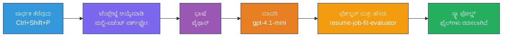
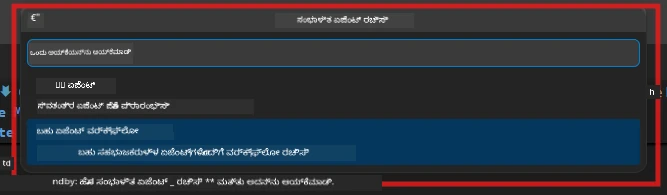

# Module 2 - ಮಲ್ಟಿ-ಏಜೆಂಟ್ ಪ್ರಾಜೆಕ್ಟ್ ಸ್ಕಾಫೋಲ್ ಮಾಡಿ

ಈ ಮೋಡ್ಯೂಲ್‌ನಲ್ಲಿ, ನೀವು [Microsoft Foundry ವಿಸ್ತರಣೆ](https://marketplace.visualstudio.com/items?itemName=TeamsDevApp.vscode-ai-foundry) ಅನ್ನು ಬಳಸಿ **ಮಲ್ಟಿ-ಏಜೆಂಟ್ ವರ್ಕ್ಫ್ಲೋ ಪ್ರಾಜೆಕ್ಟ್ ಸ್ಕಾಫೋಲ್** ಮಾಡುತ್ತೀರಿ. ವಿಸ್ತರಣೆ ಸಂಪೂರ್ಣ ಪ್ರಾಜೆಕ್ಟ್ ರಚನೆಯನ್ನು ತಯಾರಿಸುತ್ತದೆ - `agent.yaml`, `main.py`, `Dockerfile`, `requirements.txt`, `.env`, ಮತ್ತು ಡಿಬಗ್ ಕಾನ್ಫಿಗರೇಶನ್. ನಂತರ ನೀವು ಮೋಡ್ಯೂಲ್ 3 ಮತ್ತು 4 ರಲ್ಲಿ ಈ ಫೈಲ್ಗಳನ್ನು ಕಸ್ಟಮೈಸ್ ಮಾಡುತ್ತೀರಿ.

> **ಗಮನಿಸಿ:** ಈ ಪ್ರಯೋಗಾಲಯದಲ್ಲಿನ `PersonalCareerCopilot/` ಫೋಲ್ಡರ್ ಕಸ್ಟಮೈಸ್ ಮಾಡಿದ ಮಲ್ಟಿ-ಏಜೆಂಟ್ ಪ್ರಾಜೆಕ್ಟ್ ನ ಪೂರ್ಣ, ಕಾರ್ಯನಿರ್ವಹಿಸುತ್ತಿರುವ ಉದಾಹರಣೆಯಾಗಿದೆ. ನೀವು ಹೊಸ ಪ್ರಾಜೆಕ್ಟ್ ಸ್ಕಾಫೋಲ್ ಮಾಡಬಹುದು (ಕಲಿಕೆಗಾಗಿ ಶಿಫಾರಸು) ಅಥವಾ ಈಗಿನ ಕೋಡ್ ನೇರವಾಗಿ ಅಧ್ಯಯನ ಮಾಡಬಹುದು.

---

## ಹಂತ 1: Create Hosted Agent wizard ತೆರೆಯಿರಿ


1. **Command Palette** ತೆರೆಯಲು `Ctrl+Shift+P` ಒತ್ತಿ.
2. ಟೈಪ್ ಮಾಡಿ: **Microsoft Foundry: Create a New Hosted Agent** ಮತ್ತು ಆಯ್ಕೆಮಾಡಿ.
3. ಹೋಸ್ಟ್ ಮಾಡಿದ ಏಜೆಂಟ್ ರಚನೆ ವಿಸಾರ ತನೀರಿ.

> **ಪರ್ಯಾಯ:** Activity Bar ನಲ್ಲಿ **Microsoft Foundry** ಐಕಾನ್ ಕ್ಲಿಕ್ ಮಾಡಿ → **Agents** ಬಳಿ ಇರುವ **+** ಐಕಾನ್ ಕ್ಲಿಕ್ ಮಾಡಿ → **Create New Hosted Agent** ಆಯ್ಕೆಮಾಡಿ.

---

## ಹಂತ 2: ಮಲ್ಟಿ-ಏಜೆಂಟ್ ವರ್ಕ್ಫ್ಲೋ ಟೆಂಪ್ಲೇಟನ್ನು ಆಯ್ಕೆಮಾಡಿ

ವಿಸಾರ ನಿಮಗೆ ಟೆಂಪ್ಲೇಟ್ ಆಯ್ಕೆಮಾಡಲು ಕೇಳುತ್ತದೆ:

| ಟೆಂಪ್ಲೇಟ್ | ವಿವರಣೆ | ಉಪಯೋಗಿಸುವ ಸಮಯ |
|----------|-------------|-------------|
| Single Agent | ಸೂಚನೆಗಳು ಮತ್ತು ಐಚ್ಛಿಕ ವಿಧಾನಗಳಿರುವ ಒಬ್ಬ ಏಜೆಂಟ್ | ಲ್ಯಾಬ್ 01 |
| **Multi-Agent Workflow** | WorkflowBuilder ಮೂಲಕ ಸಹಕರಿಸುವ ಬಹು ಏಜೆಂಟ್ ಗಳು | **ಈ ಲ್ಯಾಬ್ (ಲ್ಯಾಬ್ 02)** |

1. **Multi-Agent Workflow** ಆಯ್ಕೆಮಾಡಿ.
2. **Next** ಕ್ಲಿಕ್ ಮಾಡಿ.



---

## ಹಂತ 3: ಪ್ರೋಗ್ರಾಮಿಂಗ್ ಭಾಷೆ ಆಯ್ಕೆಮಾಡಿ

1. **Python** ಆಯ್ಕೆಮಾಡಿ.
2. **Next** ಕ್ಲಿಕ್ ಮಾಡಿ.

---

## ಹಂತ 4: ನಿಮ್ಮ ಮಾದರಿಯನ್ನು ಆಯ್ಕೆಮಾಡಿ

1. ವಿಸಾರದಲ್ಲಿ ನಿಮ್ಮ Foundry ಪ್ರಾಜೆಕ್ಟ್‌ನಲ್ಲಿ ನಿಯೋಜಿಸಿದ ಮಾದರಿಗಳು ತೋರಿಸಲಾಗುತ್ತದೆ.
2. ಲ್ಯಾಬ್ 01 ನಲ್ಲಿ ನೀವು ಬಳಸಿದ ಅದೇ ಮಾದರಿಯನ್ನು ಆಯ್ಕೆಮಾಡಿ (ಉದಾ: **gpt-4.1-mini**).
3. **Next** ಕ್ಲಿಕ್ ಮಾಡಿ.

> **ಸೂಚನೆ:** [`gpt-4.1-mini`](https://learn.microsoft.com/azure/foundry/foundry-models/concepts/models-sold-directly-by-azure#gpt-41-series) ಅಭಿವೃದ್ಧಿಗಾಗಿ ಶಿಫಾರಸು ಮಾಡಲಾಗಿದೆ - ಇದು ವೇಗವಾಗಿ, ಸಸ್ತയാണ് ಮತ್ತು ಮಲ್ಟಿ-ಏಜೆಂಟ್ ವರ್ಕ್ಫ್ಲೋಗಳು ಮೃದುವಾಗಿ ನಿರ್ವಹಿಸುತ್ತದೆ. ಉತ್ತಮ-ಮಟ್ಟದ ಔಟ್‌ಪುಟ್ ಬೇಕಿದ್ದರೆ ಅಂತಿಮ ಉತ್ಪಾದನೆ ನಿಯೋಜನೆಗೆ `gpt-4.1` ಗೆ ಬದಲಾಯಿಸಬಹುದು.

---

## ಹಂತ 5: ಫೋಲ್ಡರ್ ಸ್ಥಳ ಮತ್ತು ಏಜೆಂಟ್ ಹೆಸರು ಆಯ್ಕೆಮಾಡಿ

1. ಫೈಲ್ ಡಯಾಲಾಗ್ ತೆರೆಯುತ್ತದೆ. ಗುರಿ ಫೋಲ್ಡರ್ ಆಯ್ಕೆಮಾಡಿ:
   - ವರ್ಕ್‌ಶಾಪ್ ರೆಪೋ ಜೊತೆ ಸಾಗುವಾಗ: `workshop/lab02-multi-agent/` ಗೆ ನ್ಯಾವಿಗೇಟ್ ಮಾಡಿ ಹೊಸ ಸಬ್‌ಫೋಲ್ಡರ್ ರಚಿಸಿ
   - ಹೊಸದಾಗಿ ಪ್ರಾರಂಭಿಸಿದಾಗ: ಯಾವುದೇ ಫೋಲ್ಡರ್ ಆಯ್ಕೆಮಾಡಿ
2. ಹೋಸ್ಟ್ ಮಾಡಿದ ಏಜೆಂಟ್ ಗಾಗಿ **ಹೆಸರು** ನಮೂದಿಸಿ (ಉದಾ., `resume-job-fit-evaluator`).
3. **Create** ಕ್ಲಿಕ್ ಮಾಡಿ.

---

## ಹಂತ 6: ಸ್ಕಾಫೋಲ್ಡ್ ಸಂಪೂರ್ಣವಾಗುವವರೆಗೆ ಕಾಯಿರಿ

1. VS Code ನೂತನ ವಿಂಡೋ (ಅಥವಾ ಪ್ರಸ್ತುತ ವಿಂಡೋ ಅಪ್ಡೇಟ್ ಆಗಿ) ಸ್ಕಾಫೋಲ್ಡ್ ಪ್ರಾಜೆಕ್ಟ್ ತೆರೆದಿಡುತ್ತದೆ.
2. ಈ ಫೈಲ್ ರಚನೆಯನ್ನು ಕಾಣಬೇಕು:

```
resume-job-fit-evaluator/
├── .env                ← Environment variables (placeholders)
├── .vscode/
│   └── launch.json     ← Debug configuration
├── agent.yaml          ← Agent definition (kind: hosted)
├── Dockerfile          ← Container configuration
├── main.py             ← Multi-agent workflow code (scaffold)
└── requirements.txt    ← Python dependencies
```

> **ವರ್ಕ್‌ಶಾಪ್ ಟಿಪ್ಪಣಿ:** ವರ್ಕ್‌ಶಾಪ್ ರೆಪೋದಲ್ಲಿ `.vscode/` ಫೋಲ್ಡರ್ **ವರ್ಕ್‌ಸ್ಪೇಸ್ ರೂಟ್** ನಲ್ಲಿ ಇದೆ, ಹಂಚಿಕೊಂಡ `launch.json` ಮತ್ತು `tasks.json` ಫೈಲ್ಗಳೊಂದಿಗೆ. ಲ್ಯಾಬ್ 01 ಮತ್ತು ಲ್ಯಾಬ್ 02 ಗೆ ಡಿಬಗ್ ಕಾನ್ಫಿಗರೇಶನ್ಗಳು ಎರಡೂ ಸೇರಿಸಿರುತ್ತವೆ. ನೀವು F5 ಒತ್ತಿದಾಗ, ಡ್ರೋಪ್‌ಡೌನ್ ನಲ್ಲಿ **"Lab02 - Multi-Agent"** ಆಯ್ಕೆಮಾಡಿ.

---

## ಹಂತ 7: ಸ್ಕಾಫೋಲ್ಡ್ ಫೈಲ್ಗಳನ್ನು (ಮಲ್ಟಿ-ಏಜೆಂಟ್ ವಿಶೇಷತೆಯಲ್ಲಿ) ಅರ್ಥಮಾಡಿಕೊಳ್ಳಿ

ಮಲ್ಟಿ-ಏಜೆಂಟ್ ಸ್ಕಾಫೋಲ್ಡ್ ಕೆಲವು ಮುಖ್ಯ ಭೇದಗಳಿಂದ ಸಿಂಗಲ್-ಏಜೆಂಟ್ ಸ್ಕಾಫೋಲ್ಡ್ ಥಿಂದ ವಿಭಿನ್ನವಾಗಿದೆ:

### 7.1 `agent.yaml` - ಏಜೆಂಟ್ ವ್ಯಾಖ್ಯಾನ

```yaml
kind: hosted
name: resume-job-fit-evaluator
description: >
  A multi-agent workflow that evaluates resume-to-job fit.
metadata:
  authors:
    - Microsoft
  tags:
    - Multi-Agent Workflow
    - Resume Evaluator
protocols:
  - protocol: responses
    version: v1
environment_variables:
  - name: PROJECT_ENDPOINT
    value: ${PROJECT_ENDPOINT}
  - name: MODEL_DEPLOYMENT_NAME
    value: ${MODEL_DEPLOYMENT_NAME}
```

**ಲ್ಯಾಬ್ 01 ನಿಂದ ಪ್ರಮುಖ ಭೇದ:** `environment_variables` ವಿಭಾಗದಲ್ಲಿ MCP ಎಂಡ್ಫಾಯಿಂಟ್‌ಗಳು ಅಥವಾ ಇತರ ಟೂಲ್ ಕಾನ್ಫಿಗರೇಶನ್ ಗಾಗಿ ಹೆಚ್ಚುವರಿ ಚರಗಳು ಇರಬಹುದು. `name` ಮತ್ತು `description` ಮಲ್ಟಿ-ಏಜೆಂಟ್ ಬಳಕೆಯನ್ನು ಪ್ರತಿಬಿಂಬಿಸುತ್ತವೆ.

### 7.2 `main.py` - ಮಲ್ಟಿ-ಏಜೆಂಟ್ ವರ್ಕ್ಫ್ಲೋ ಕೋಡ್

ಸ್ಕಾಫೋಲ್ಡ್ ಒಳಗೊಂಡಿದೆ:
- **ಬಹು ಏಜೆಂಟ್ ಸೂಚನೆ ಸ್ಟ್ರಿಂಗ್‌ಗಳು** (ಪ್ರತಿ ಏಜೆಂಟ್ ಗಾಗಿ ಒಂದು `const`)
- **ಬಹು [`AzureAIAgentClient.as_agent()`](https://learn.microsoft.com/python/api/overview/azure/ai-agents-readme) ಕಾಂಟೆಕ್ಸ್ಟ್ ಮ್ಯಾನೇಜರ್‌ಗಳು** (ಪ್ರತಿ ಏಜೆಂಟ್ ಗಾಗಿ ಒಂದು)
- **[`WorkflowBuilder`](https://learn.microsoft.com/agent-framework/workflows/agents-in-workflows)** ಮೂಲಕ ಏಜೆಂಟ್‌ಗಳನ್ನು ಸಂಪರ್ಕಿಸುವುದು
- **`from_agent_framework()`** ಮೂಲಕ ವರ್ಕ್ಫ್ಲೋ ಅನ್ನು HTTP ಎಂಡ್‌ಪಾಯಿಂಟ್ ಆಗಿ ಕೆಲಸ ಮಾಡಿಸುವುದು

```python
from agent_framework import WorkflowBuilder, tool
from agent_framework.azure import AzureAIAgentClient
from azure.ai.agentserver.agentframework import from_agent_framework
```

ಲ್ಯಾಬ್ 01 ಜೊತೆ ಹೋಲಿಸಿದರೆ ಹೆಚ್ಚುವರಿ ಇಂಪೋರ್ಟ್ [`WorkflowBuilder`](https://learn.microsoft.com/agent-framework/workflows/agents-in-workflows) ಹೊಸದು.

### 7.3 `requirements.txt` - ಹೆಚ್ಚುವರಿ ನಿಬಂಧನೆಗಳು

ಮಲ್ಟಿ-ಏಜೆಂಟ್ ಪ್ರಾಜೆಕ್ಟ್ ಲ್ಯಾಬ್ 01 ನಲ್ಲಿದ್ದಂತೆಯೇ ಆಧಾರ ಪ್ಯಾಕೇಜುಗಳನ್ನು ಉಪಯೋಗಿಸುತ್ತದೆ, ಜೊತೆಗೆ MCP-ಸಂಬಂಧಿತ ಪ್ಯಾಕೇಜುಗಳೂ ಸೇರಿವೆ:

```
agent-framework-azure-ai==1.0.0rc3
agent-framework-core==1.0.0rc3
azure-ai-agentserver-agentframework==1.0.0b16
azure-ai-agentserver-core==1.0.0b16
debugpy
agent-dev-cli --pre
```

> **ಮಹತ್ವಪೂರ್ಣ ಆವೃತ್ತಿ ಟಿಪ್ಪಣಿ:** `agent-dev-cli` ಪ್ಯಾಕೇಜ್‌ಗೆ `requirements.txt` ನಲ್ಲಿ `--pre` ಫ್ಲ್ಯಾಗ್‌ ಇರಬೇಕು ಹಾಗಾಗಿ ಇತ್ತೀಚಿನ ಪೂರ್ವಾವಲೋಕನ ಆವೃತ್ತಿ ಇನ್ಸ್ಟಾಲ್ ಆಗುತ್ತದೆ. ಇದು `agent-framework-core==1.0.0rc3` ಗೆ Agent Inspector ಆನುವಂಶಿಕತೆಗೆ ಅಗತ್ಯ. ಆವೃತ್ತಿ ವಿವರಗಳಿಗೆ [Module 8 - Troubleshooting](08-troubleshooting.md) ನೋಡಿ.

| ಪ್ಯಾಕೇಜ್ | ಆವೃತ್ತಿ | ಉದ್ದೇಶ |
|---------|---------|---------|
| [`agent-framework-azure-ai`](https://learn.microsoft.com/agent-framework/overview/) | `1.0.0rc3` | [Microsoft Agent Framework](https://github.com/microsoft/agent-framework) ಗೆ Azure AI ಸಂಯೋಜನೆ |
| [`agent-framework-core`](https://learn.microsoft.com/agent-framework/overview/) | `1.0.0rc3` | ಕೋರ್ ರನ್‌ಟೈಮ್ (WorkflowBuilder ಸಹಿತ) |
| `azure-ai-agentserver-agentframework` | `1.0.0b16` | ಹೋಸ್ಟ್ ಮಾಡಿದ ಏಜೆಂಟ್ ಸರ್ವರ್ ರನ್‌ಟೈಮ್ |
| `azure-ai-agentserver-core` | `1.0.0b16` | ಕೋರ್ ಏಜೆಂಟ್ ಸರ್ವರ್ ಆಬ್ಸ್‌ಟ್ರ್ಯಾಕ್ಷನ್‌ಗಳು |
| `debugpy` | ಇತ್ತೀಚಿನ | ಪೈಥನ್ ಡಿಬಗಿಂಗ್ (VS Code ನಲ್ಲಿ F5) |
| `agent-dev-cli` | `--pre` | ಲೋಕಲ್ ಡೆವ್ CLI + Agent Inspector ಬ್ಯಾಕ್‌ಎಂಡ್ |

### 7.4 `Dockerfile` - ಲ್ಯಾಬ್ 01 ನಷ್ಟೇ

Dockerfile ಲ್ಯಾಬ್ 01 ನಷ್ಟೇ ಇದೆ - ಫೈಲ್ಗಳನ್ನು ನಕಲಿಸಿ, `requirements.txt` ನಿಂದ ಅವಲಂಬನೆಗಳನ್ನು ಇನ್ಸ್ಟಾಲ್ ಮಾಡಿ, ಪೋರ್ಟ್ 8088 ಅನ್ನು ತೆರೆದು, `python main.py` ಅನ್ನು ಚಾಲನೆ ಮಾಡುತ್ತದೆ.

```dockerfile
FROM python:3.14-slim
WORKDIR /app
COPY ./ .
RUN pip install --upgrade pip && \
    if [ -f requirements.txt ]; then \
        pip install -r requirements.txt; \
    else \
      echo "No requirements.txt found" >&2; exit 1; \
    fi
EXPOSE 8088
CMD ["python", "main.py"]
```

---

### ಚೆಕ್ಪಾಯಿಂಟ್

- [ ] ಸ್ಕಾಫೋಲ್ಡ್ ವಿಸಾರ ಸಂಪೂರ್ಣವಾಗಿದೆ → ಹೊಸ ಪ್ರಾಜೆಕ್ಟ್ ರಚನೆ ಕಾಣುತ್ತದೆ
- [ ] ನೀವು ಎಲ್ಲಾ ಫೈಲ್ಗಳನ್ನು ನೋಡಬಹುದು: `agent.yaml`, `main.py`, `Dockerfile`, `requirements.txt`, `.env`
- [ ] `main.py` ಗೆ `WorkflowBuilder` ಇಂಪೋರ್ಟ್ ಸೇರಿದೆ (ಮಲ್ಟಿ-ಏಜೆಂಟ್ ಟೆಂಪ್ಲೇಟ್ ಆಯ್ಕೆಮಾಡಿದ ಸಂದೇಶ)
- [ ] `requirements.txt` ನಲ್ಲಿ `agent-framework-core` ಮತ್ತು `agent-framework-azure-ai` ಎರಡೂ ಸೇರಿವೆ
- [ ] ಮಲ್ಟಿ-ಏಜೆಂಟ್ ಸ್ಕಾಫೋಲ್ಡ್ ಮತ್ತು ಸಿಂಗಲ್-ಏಜೆಂಟ್ ಸ್ಕಾಫೋಲ್ಡ್ ನಡುವಿನ ವ್ಯತ್ಯಾಸಗಳನ್ನು ನೀವು ಅರ್ಥಮಾಡಿಕೊಂಡಿದ್ದೀರಾ (ಬಹು ಏಜೆಂಟ್ ಗಳು, WorkflowBuilder, MCP ಸಾಧನಗಳು)

---

**ಹಿಂದಿನ:** [01 - ಮಲ್ಟಿ-ಏಜೆಂಟ್ ವಾಸ್ತುಶಿಲ್ಪಿಯನ್ನು ಅರ್ಥಮಾಡಿಕೊಳ್ಳಿ](01-understand-multi-agent.md) · **ಮುಂದಿನ:** [03 - ಏಜೆಂಟ್ ಗಳು & ಪರಿಸರವನ್ನು ಕಾನ್ಫಿಗರ್ ಮಾಡಿ →](03-configure-agents.md)

---

<!-- CO-OP TRANSLATOR DISCLAIMER START -->
**ಮುಕ್ತಾಯ ಘೋಷಣೆ**:
ಈ ದಸ್ತಾವೇಜು AI ಅನುವಾದ ಸೇವೆ [Co-op Translator](https://github.com/Azure/co-op-translator) ಬಳಸಿ ಅನುವಾದಿಸಲಾಗಿದೆ. ನಾವು ನಿಖರತೆಗಾಗಿ ಪ್ರಯತ್ನಿಸುತ್ತಿದ್ದರೂ, ಸ್ವಯಂಚಾಲಿತ ಅನುವಾದಗಳಲ್ಲಿ ತಪ್ಪುಗಳು ಅಥವಾ ಅಸತ್ಯತೆಗಳು ಇರಬಹುದೆಂದು ಕಾಳಜಿ ವಹಿಸಿ. ಮೂಲ ಭಾಷೆಯಲ್ಲಿರುವ ಮೂಲ ದಸ್ತಾವೇಜು ಅಧಿಕೃತ ಮೂಲವಾಗಿ ಪರಿಗಣಿಸಬೇಕು. ಪ್ರಮುಖ ಮಾಹಿತಿ ಗಾಗಿ, ವೃತ್ತಿಪರ ಮಾನವ ಅನುವಾದವನ್ನು ಶಿಫಾರಸು ಮಾಡಲಾಗುತ್ತದೆ. ಈ ಅನುವಾದದ ಬಳಕೆಯಿಂದ ಉದ्भವಿಸುವ ಯಾವುದೇ ತಪ್ಪು ಅರ್ಥಮಾಡಿಕೊಳ್ಳುವಿಕೆ ಅಥವಾ ತಪ್ಪು ವಿವರಣೆಗಳಿಗೆ ನಾವು ಹೊಣೆಗಾರರಲ್ಲ.
<!-- CO-OP TRANSLATOR DISCLAIMER END -->