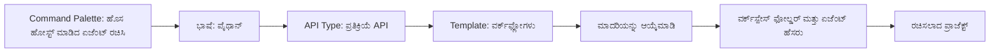
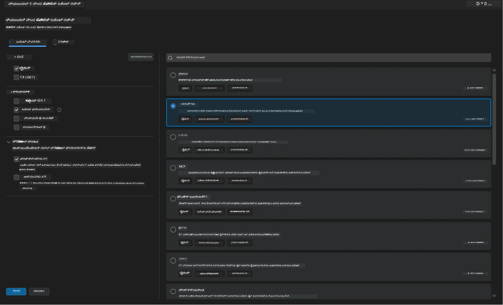
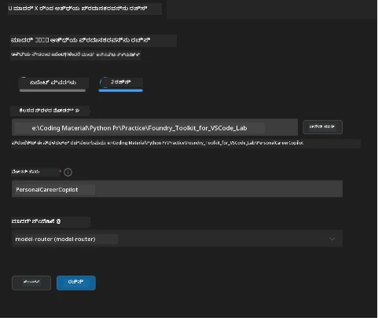

# ಮೋಡುಲ್ 2 - ಬಹು-ಕಾರ್ಯನಿರ್ವಹಕ ಯೋಜನೆಯನ್ನು ವಿಸ್ತರಿಸಿ

⏱️ ~5 ನಿಮಿಷ

ಈ ಮೋಡುಲ್‌ನಲ್ಲಿ, ನೀವು [Foundry Toolkit for VS Code](https://aka.ms/foundrytk) ಬಳಸಿ **ಬಹು-ಕಾರ್ಯನಿರ್ವಹಕ ಯೋಜನೆಯನ್ನು ವಿಸ್ತರಿಸುತ್ತೀರಿ**. ವಿಜಾರ್ಡ್ `agent.yaml`, `main.py`, `Dockerfile`, `requirements.txt`, `.env`, ಮತ್ತು VS Code ಡೀಬಗ್ ಸಂರಚನೆಯನ್ನು ಉತ್ಪಾದಿಸುತ್ತದೆ - ಹಾಗಾಗಿ ನೀವು ಮೋಡುಲ್ 3 ರಲ್ಲಿ 4-ಕಾರ್ಯನಿರ್ವಹಕ ವರ್ಕ್ಫ್ಲೋವನ್ನು ಜೋಡಿಸುವುದರ ಮೇಲೆ ಗಮನ ಕೇಂದ್ರೀಕರಿಸಬಹುದು.

> **ಪ್ರಮುಖ ಸಂಜ್ಞೆ:** ಈ ವಿಸ್ತರಣೆ ಒಂದು ಕಾರ್ಯನಿರ್ವಹಿಸುವ ಸ್ಟಬ್ ಆಗಿದೆ ಒಂದು ಕಾರ್ಯನಿರ್ವಹಕದೊಂದಿಗೆ. ನೀವು ಮೋಡುಲ್ 3 ರಲ್ಲಿ `WorkflowBuilder` ಗ್ರಾಫ್ ಅನ್ನು ಸ್ಥಳಾಪಕ ನಿಯಮಿಕತೆಗೆ ಬದಲಾಯಿಸುತ್ತೀರಿ. ನೀವು ಬೊಯ್ಲರ್ ಪ್ಲೇಟ್ ಅನ್ನು ಶುರಿನಿಂದ ಬರೆಯುವುದಿಲ್ಲ.

> **ರೆಫರೆನ್ಸ್ ಅನುಷ್ಠಾನ:** [`PersonalCareerCopilot/`](../../../../../workshop/lab02-multi-agent/PersonalCareerCopilot) ಒಂದು ಸಕಲ ಕಾರ್ಯನಿರ್ವಹಿಸುವ ಉದಾಹರಣೆ. ನೀವು ಕೆಲಸ ಮಾಡುತ್ತಿದ್ದಂತೆ ಅದನ್ನು ಹೋಲಿಕೆ ಮಾಡಲು ಉಪಯೋಗಿಸಿ.

### ವಿಸ್ತರಣೆ ವಿಜಾರ್ಡ್ ಪ್ರವಾಹ


```mermaid
flowchart LR
    A[Command Palette: ಹೊಸ ಹೋಸ್ಟ್ ಮಾಡಿದ ಏಜೆಂಟ್ ರಚಿಸಿ] --> B[ಭಾಷೆ: ಪೈಥಾನ್]
    B --> C[API Type: ಪ್ರತಿಕ್ರಿಯೆ API]
    C --> D[Template: ವರ್ಕ್‌ಫ್ಲೋಗಳು]
    D --> E[ಮಾದರಿಯನ್ನು ಆಯ್ಕೆಮಾಡಿ]
    E --> F[ವರ್ಕ್‌ಸ್ಪೇಸ್ ಫೋಲ್ಡರ್ ಮತ್ತು ಏಜೆಂಟ್ ಹೆಸರು]
    F --> G[ರಚಿಸಲಾದ ಪ್ರಾಜೆಕ್ಟ್]
```

---

## ಹಂತ 1: ಹೊಸ ಹೋಸ್ತ್ಡ್ ಕಾರ್ಯನಿರ್ವಹಕ ಸೃಷ್ಟಿ ಮಂತ್ರಿಯನ್ನು ತೆರೆಯಿರಿ

1. `Ctrl+Shift+P` ಒತ್ತಿ **ಕಮಾಂಡ್ ಪ್ಯಾಲೆಟ್** ತೆರೆಯಲು.
2. ಟೈಪ್ ಮಾಡಿ: **Foundry Toolkit: Create a New Hosted Agent** ಮತ್ತು ಆಯ್ಕೆಮಾಡಿ.
3. ವಿಜಾರ್ಡ್ **ಕಾರ್ಯನಿರ್ವಹಕ ವಿವರಗಳು** ಟ್ಯಾಬ್ ನಲ್ಲಿ ತೆರೆಯುತ್ತದೆ.

> **ವಿಕಲ್ಪ:** ಚಟುವಟಿಕೆ ಬಾರಿನಲ್ಲಿನ **Foundry Toolkit** ಐಕಾನ್ ಅನ್ನು ಕ್ಲಿಕ್ ಮಾಡಿ → **Hosted Agents** ಪಕ್ಕದ **+** ಐಕಾನ್ ಕ್ಲಿಕ್ ಮಾಡಿ → **Create New Hosted Agent** ಕ್ಲಿಕ್ ಮಾಡಿ.

---

## ಹಂತ 2: ಸೆಟ್ಟಿಂಗ್ಸ್ ಆಯ್ಕೆಮಾಡಿ



1. ಬಲ ಪದಿ ನ್ಯಾವಿಗೇಶನ್/ಆಪ್ಷನ್ಸ್ ವಿಭಾಗದಲ್ಲಿ ಕೆಳಗಿನವುಗಳನ್ನು ಆಯ್ಕೆಮಾಡಿ:

| ಮೆನು | ಆಯ್ಕೆ | ಟಿಪ್ಪಣಿಗಳು |
|--------|-----------|-------|
| **ಭಾಷೆ** | ಪೈಥಾನ್ | C# (.NET) ಕೂಡ ಬೆಂಬಲಿಸಲಾಗಿದೆ |
| **ಫ್ರೇಮ್ವರ್ಕ್** | ಕಾರ್ಯನಿರ್ವಹಕ ಫ್ರೇಮ್ವರ್ಕ್ | `Agent`, `AgentExecutor`, `WorkflowBuilder` ಒದಗಿಸುತ್ತದೆ |
| **API ಪ್ರಕಾರ** | ಪ್ರತಿಕ್ರಿಯೆ API | `POST /responses` - ವೇದಿಕೆ-ನಿಯಂತ್ರಿತ ಇತಿಹಾಸ, ಸ್ಟ್ರೀಮಿಂಗ್ ಬೆಂಬಲ |
| **ಟೆಂಪ್ಲೇಟು** | **ವರ್ಕ್ಫ್ಲೋಸ್** | ಅನೇಕ ಕಾರ್ಯನಿರ್ವಹಕರ ಮೂಲಕ ವಿನಂತಿಗಳನ್ನು ಸರಣಿಯಲ್ಲಿ ಪ್ರಕ್ರಿಯೆ ಮಾಡುತ್ತದೆ |

2. ಆಯ್ಕೆಮಾಡಿದ ಮೇಲೆ, **ಮುಂದೆ** ಕ್ಲಿಕ್ ಮಾಡಿ



3. ಮುಂದಿನ ವಿಂಡೋದಲ್ಲಿ ಕೆಳಗಿನವುಗಳನ್ನು ಆಯ್ಕೆಮಾಡಿ:

| ಮೆನು | ಆಯ್ಕೆ | ಟಿಪ್ಪಣಿಗಳು |
|--------|-----------|-------|
| **ಕಾರ್ಯಸ್ಥಳ ಫೋಲ್ಡರ್** | ಗುರಿ ಫೋಲ್ಡರ್ಗಾಗಿ ಬ್ರೌಸ್ ಮಾಡಿ | ಉದಾ., ಈ ರೆಪೋನಲ್ಲಿನ `workshop/lab02-multi-agent/` |
| **ಕಾರ್ಯನಿರ್ವಹಕ ಹೆಸರು** | `PersonalCareerCopilot` | ಇದು ಯೋಜನೆಯ ಡೈರೆಕ್ಟರಿ ಹೆಸರು ಆಗುತ್ತದೆ |
| **ಮಾದರಿ ನಿಯೋಜನೆ** | ನಿಮ್ಮ ನಿಯೋಜಿತ ಮಾದರಿಯನ್ನು ಆಯ್ಕೆಮಾಡಿ | ಉದಾ., ಲ್ಯಾಬ್ 01 ನಿಂದ `gpt-4.1-mini` |

4. ಯೋಜನೆಯನ್ನು ವಿಸ್ತರಿಸಲು **ಸೃಷ್ಟಿಸಿ** ಕ್ಲಿಕ್ ಮಾಡಿ. VS Code ಫೈಲುಗಳನ್ನು ಉತ್ಪಾದಿಸಿ ಫೋಲ್ಡರ್ ತೆರೆಯುತ್ತದೆ.

> **ಸೂಚನೆ:** [`gpt-4.1-mini`](https://learn.microsoft.com/azure/foundry/foundry-models/concepts/models-sold-directly-by-azure#gpt-41-series) ಬಹು-ಕಾರ್ಯನಿರ್ವಹಕ ಅಭಿವೃದ್ಧಿಗಾಗಿ ವೇಗ ಮತ್ತು ಗುಣಮಟ್ಟವನ್ನು ಸಮತೋಲಿಸಲು ಉತ್ತಮವಾಗಿದೆ.

---

## ಹಂತ 3: ಉತ್ಪಾದಿತ ಯೋಜನೆಯನ್ನು ಪರಿಶೀಲಿಸಿ

ವಿಸ್ತರಣೆ ನಡಲಾಗಿದೆ ನಂತರ, ಈ ಫೈಲುಗಳು ಎಕ್ಸ್‌ಪ್ಲೋರರ್ (`Ctrl+Shift+E`) ನಲ್ಲಿ ತೋರಿಸಿದೆಯೇ ಪರಿಶೀಲಿಸಿ:

```
📂 <your-agent-name>/
├── .azdignore          ← Files excluded from Azure Developer CLI deployments
├── .dockerignore       ← Files excluded from Docker builds
├── .env                ← Environment variables (placeholders - fill in Module 3)
├── .vscode/
│   ├── launch.json     ← Debug config (F5 → run + Agent Inspector)
│   └── tasks.json      ← VS Code task definitions
├── agent.yaml          ← Agent definition (kind: hosted, protocol: responses)
├── Dockerfile          ← Container config for deployment
├── main.py             ← Stub agent entry point (replace with WorkflowBuilder in Module 3)
└── requirements.txt    ← Python dependencies
```

> **ಪ್ರಮುಖ:** `.vscode/launch.json` ಮತ್ತು `tasks.json` ಸರಿಯಾಗಿ F5 ಡೀಬಗಿಗಾಗಿ ಅನ್ವಯವಾಗಲು ಈ ವಿಸ್ತರಿಸಲಾದ ಫೋಲ್ಡರ್ ನೇರವಾಗಿ VS Code ನಲ್ಲಿ ತೆರೆಯಿರಿ.

### ಪ್ರಮುಖ ಫೈಲುಗಳ ವಿವರಣೆ

| ಫೈಲು | ಉದ್ದೇಶ |
|------|---------|
| `agent.yaml` | `kind: hosted` ಘೋಷಿಸುತ್ತದೆ, env vars ನಕ್ಷೆ ಮಾಡುತ್ತದೆ, `/responses` ಪ್ರೋಟೋಕಾಲ್ ನಿರ್ದಿಷ್ಟಪಡಿಸುತ್ತದೆ |
| `main.py` | ಸ್ಟಬ್: ಒಂದು `FoundryChatClient` → `Agent` → `ResponsesHostServer`. ನೀವು ಮೋಡುಲ್ 3 ರಲ್ಲಿ 4 ಕಾರ್ಯನಿರ್ವಹಕ + `WorkflowBuilder` ಜೊತೆ ಇದನ್ನು ಬದಲಾಯಿಸುತ್ತೀರಿ |
| `Dockerfile` | `python:3.12-slim`, `requirements.txt` ಸ್ಥಾಪಿಸುತ್ತದೆ, 8088 ಪೋರ್ಟ್ ತೆರೆಯುತ್ತದೆ, `python main.py` ರನ್ ಮಾಡುತ್ತದೆ |
| `requirements.txt` | `agent-framework-foundry`, `agent-framework-foundry-hosting`, `mcp<2,>=1.24.0`, `debugpy` |

> **ರೆಫರೆನ್ಸ್:** ಸಕಲ ಉತ್ಪಾದಿತ ವಿಷಯಕ್ಕಾಗಿ [`PersonalCareerCopilot/agent.yaml`](../../../../../workshop/lab02-multi-agent/PersonalCareerCopilot/agent.yaml) ಮತ್ತು [`PersonalCareerCopilot/requirements.txt`](../../../../../workshop/lab02-multi-agent/PersonalCareerCopilot/requirements.txt) ನೋಡಿ.

---

### ✅ ಚેક್ಪಾಯಿಂಟ್

- [ ] ವಿಸ್ತರಣೆ ಮಂತ್ರಿ ಪೂರ್ಣಗೊಂಡಿದೆ - ಹೊಸ ಯೋಜನಾ ಫೋಲ್ಡರ್ ಎಕ್ಸ್‌ಪ್ಲೋರರ್‌ನಲ್ಲಿ ಕಾಣಿಸುತ್ತದೆ
- [ ] ನಿರೀಕ್ಷಿತ ಎಲ್ಲ ಫೈಲುಗಳು ಇದ್ದವೆ: `agent.yaml`, `main.py`, `Dockerfile`, `requirements.txt`, `.env`
- [ ] `agent.yaml` ನಲ್ಲಿ `kind: hosted` ಮತ್ತು `protocol: responses` ತೋರಿಸುತ್ತದೆ
- [ ] `main.py` ಯಲ್ಲಿ `Agent`, `FoundryChatClient`, `ResponsesHostServer` ಆಮದು ಮಾಡಿಕೊಳ್ಳಲಾಗಿದೆ
- [ ] ವಿಸ್ತರಿಸಿದ ಫೋಲ್ಡರ್ VS Code ಕಾರ್ಯಕ್ಷೇತ್ರ ಮೂಲವಾಗಿ ತೆರೆಯಲಾಗಿದೆ
- [ ] ನಿಮಗೆ ಗೊತ್ತಿದೆ `main.py` ಒಂದು ಸ್ಟಬ್ - `WorkflowBuilder` ಮೋಡುಲ್ 3 ರಲ್ಲಿ ಸೇರಿಸಲಾಗುತ್ತದೆ

---

**ಹಿಂದಿನದು:** [01 - ಬಹು-ಕಾರ್ಯನಿರ್ವಹಕ ವಾಸ್ತುಶಿಲ್ಪವನ್ನು ಅರ್ಥಮಾಡಿಕೊಳ್ಳುವುದು](01-understand-multi-agent.md) · **ಮುಂದಿನದು:** [03 - ಕಾರ್ಯನಿರ್ವಹಕರು ಮತ್ತು ಪರಿಸರವನ್ನು ಕಾನ್ಫಿಗರ್ ಮಾಡಿ →](03-configure-agents.md)

---

<!-- CO-OP TRANSLATOR DISCLAIMER START -->
**ಅಸ್ವೀಕಾರ**:
ಈ ದಸ್ತಾವೇಜು AI ಅನುವಾದ ಸೇವೆ [Co-op Translator](https://github.com/Azure/co-op-translator) ಬಳಸಿ ಅನುವಾದಿಸಲಾಗಿದೆ. ನಾವು ನಿಖರತೆಯನ್ನು ಸಾಧಿಸಲು ಪ್ರಯತ್ನಿಸುತ್ತಿದ್ದರೂ, ದಯವಿಟ್ಟು ಗಮನಿಸಿ, ಸ್ವಯಂಚಾಲಿತ ಅನುವಾದಗಳಲ್ಲಿ ದೋಷಗಳು ಅಥವಾ ಅಸಡ್ಡೆಗಳು ಇರಬಹುದು. ಮೂಲ ಭಾಷೆಯಲ್ಲಿರುವ ಮೂಲ ದಸ್ತಾವೇಜು ಪ್ರಾಮಾಣಿಕ ಮೂಲವೆಂದು ಪರಿಗಣಿಸಬೇಕು. ಪ್ರಮುಖ ಮಾಹಿತಿಗಾಗಿ, ವೃತ್ತಿಪರ ಮಾನವ ಅನುವಾದವನ್ನು ಶಿಫಾರಸು ಮಾಡಲಾಗುತ್ತದೆ. ಈ ಅನುವಾದವನ್ನು ಬಳಸುವ ಮೂಲಕ ಉಂಟಾಗುವ ಯಾವುದೇ ತಪ್ಪು ಅರ್ಥಗಳ ಅಥವಾ ತಪ್ಪು ವ್ಯಾಖ್ಯಾನಗಳ ಬಗ್ಗೆ ನಾವು ಹೊಣೆಗಾರರಲ್ಲ.
<!-- CO-OP TRANSLATOR DISCLAIMER END -->