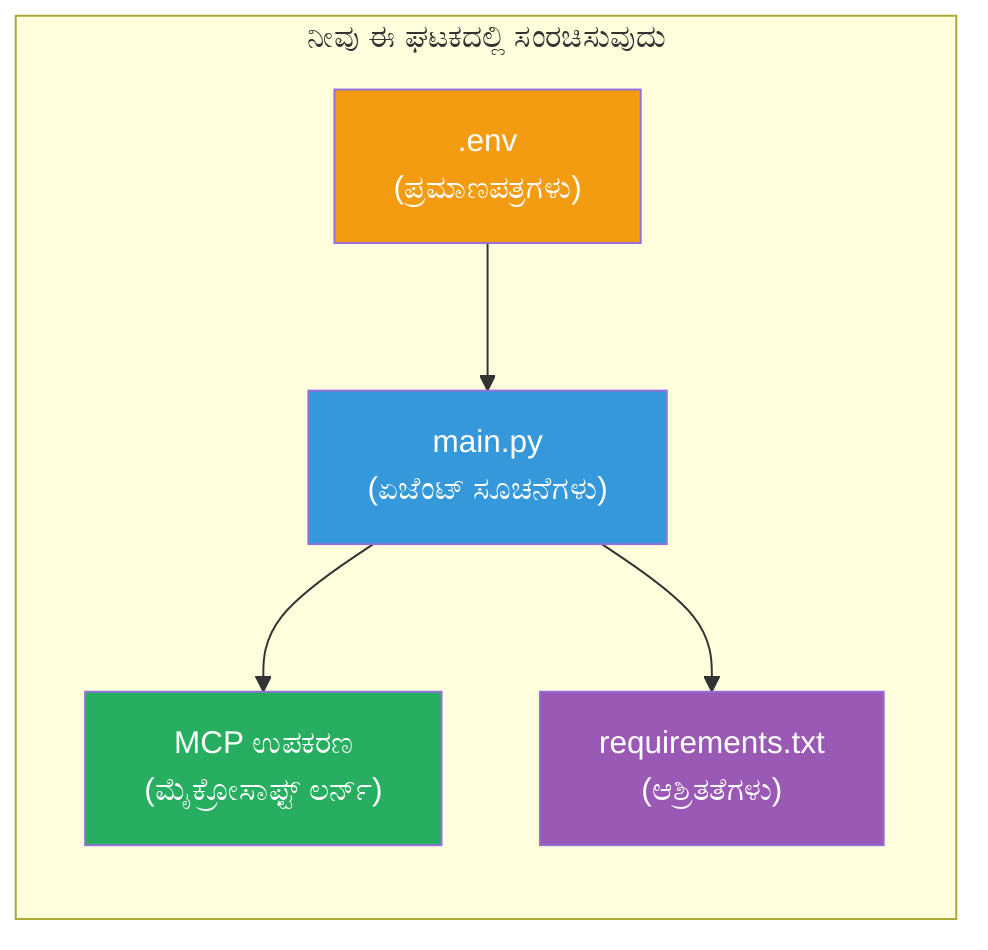

# ಮದುಳಿ 3 - ಏಜೆಂಟುಗಳು, MCP ಉಪಕರಣ ಮತ್ತು ಪರಿಸರವನ್ನು ಸಂರಚಿಸಿ

ಈ ಮದುಳಿಯಲ್ಲಿ, ನೀವು ಕಸ್ಟಮೈಸ್ ಮಾಡಲಾದ ಬಹು-ಏಜೆಂಟ್ ಪ್ರಾಜೆಕ್ಟ್ ಅನ್ನು ಹೊಂದಿಸುತ್ತೀರಿ. ನೀವು ಎಲ್ಲಾ ನಾಲ್ಕು ಏಜೆಂಟುಗಳ ಇನ್ಸ್ಟ್ರಕ್ಷನ್ಗಳನ್ನು ಬರೆಯುತ್ತೀರಿ, Microsoft Learnಗಾಗಿ MCP ಉಪಕರಣವನ್ನು ಹೊಂದಿಸುತ್ತೀರಿ, ಪರಿಸರ ಬದಲಾವಣೆಗಳನ್ನು ಸಂರಚಿಸುತ್ತೀರಿ ಮತ್ತು ಅವಲಂಬನೆಗಳನ್ನು ಸ್ಥಾಪಿಸುತ್ತೀರಿ.


> **ಉಲ್ಲೇಖ:** ಸಂಪೂರ್ಣ ಕಾರ್ಯ ನಿರ್ವಹಿಸುವ ಕೋಡ್ [`PersonalCareerCopilot/main.py`](../../../../../workshop/lab02-multi-agent/PersonalCareerCopilot/main.py) ನಲ್ಲಿ ಇದೆ. ನಿಮ್ಮದೇ ಪ್ರಾಜೆಕ್ಟ್ ನಿರ್ಮಿಸುವಾಗ ಇದರನ್ನೂ ಉಲ್ಲೇಖವಾಗಿ ಬಳಸಿ.

---

## ಹಂತ 1: ಪರಿಸರ ಬದಲಾವಣೆಗಳನ್ನು ಸಂರಚಿಸಿ

1. ನಿಮ್ಮ ಪ್ರಾಜೆಕ್ಟ್ ರೂಟ್ ನಲ್ಲಿ **`.env`** ಫೈಲ್ ತೆರೆಯಿರಿ.
2. ನಿಮ್ಮ Foundry ಪ್ರಾಜೆಕ್ಟ್ ವಿವರಗಳನ್ನು ತುಂಬಿರಿ:

   ```env
   PROJECT_ENDPOINT=https://<your-account>.services.ai.azure.com/api/projects/<your-project>
   MODEL_DEPLOYMENT_NAME=gpt-4.1-mini
   ```

3. ಫೈಲ್ ಉಳಿಸಿ.

### ಈ ಮೌಲ್ಯಗಳನ್ನು ಎಲ್ಲಿ ಹುಡುಕುವುದು

| ಮೌಲ್ಯ | ಹೇಗೆ ಹುಡುಕುವುದು |
|-------|-----------------|
| **ಪ್ರಾಜೆಕ್ಟ್ ಎಂಡ್‌ಪಾಯಿಂಟ್** | Microsoft Foundry ಸೈಡ್‌ಬಾರ್ → ನಿಮ್ಮ ಪ್ರಾಜೆಕ್ಟ್ ಕ್ಲಿಕ್ ಮಾಡಿ → ಡೀಟೈಲ್ ವೀಕ್ಷಣೆಯಲ್ಲಿ ಎಂಡ್‌ಪಾಯಿಂಟ್ URL |
| **ಮಾದರಿ ನಿಯೋಜನೆ ಹೆಸರು** | Foundry ಸೈಡ್‌ಬಾರ್ → ಪ್ರಾಜೆಕ್ಟ್ ವಿಸ್ತರಿಸಿ → **ಮಾದರಿಗಳು + ಎಂಡ್‌ಪಾಯಿಂಟ್‌ಗಳು** → ನಿಯೋಜಿಸಲಾದ ಮಾದರಿಯ ಮುಂದಿನ ಹೆಸರು |

> **ಭದ್ರತೆ:** `.env` ಅನ್ನು ಸಂಚಿಕೆ ನಿಯಂತ್ರಣಕ್ಕೆ ಎಂದಿಗೂ ಕಮಿಟ್ ಮಾಡಬೇಡಿ. ಇದು `.gitignore` ನಲ್ಲಿ ಸೇರಿಸಿರಿ.

### ಪರಿಸರ ಬದಲಾವಣೆ ನಕ್ಷೆ

ಬಹು-ಏಜೆಂಟ್ `main.py` ಸಾಮಾನ್ಯ ಮತ್ತು ವರ್ಕ್‌ಶಾಪ್-ವಿಶಿಷ್ಟ env ಬದಲಾವಣೆ ಹೆಸರನ್ನು ಓದುವದು:

```python
PROJECT_ENDPOINT = os.getenv("AZURE_AI_PROJECT_ENDPOINT") or os.getenv("PROJECT_ENDPOINT")
MODEL_DEPLOYMENT_NAME = os.getenv(
    "AZURE_AI_MODEL_DEPLOYMENT_NAME",
    os.getenv("MODEL_DEPLOYMENT_NAME", "gpt-4.1-mini"),
)
MICROSOFT_LEARN_MCP_ENDPOINT = os.getenv(
    "MICROSOFT_LEARN_MCP_ENDPOINT", "https://learn.microsoft.com/api/mcp"
)
```

MCP ಎಂಡ್‌ಪಾಯಿಂಟ್‌ಗೆ ಅರ್ಥಪೂರ್ಣ ಡೀಫಾಲ್ಟ್ ಇದೆ - ನೀವು ಅದನ್ನು `.env` ನಲ್ಲಿ ಹೊಂದಿಸುವ ಅಗತ್ಯವಿಲ್ಲ ಆಪರೈಡ್ ಮಾಡಲು ಬಯಸಿದರೆ ಹೊರತು.

---

## ಹಂತ 2: ಏಜೆಂಟ್ ಸೂಚನೆಗಳನ್ನು ಬರೆಯಿರಿ

ಇದು ಅತಿ ಪ್ರಮುಖ ಹಂತ. ಪ್ರತಿ ಏಜೆಂಟಿಗೆ ಅದರ ಪಾತ್ರ, ಔಟ್‌ಪುಟ್ ಫಾರ್ಮಾಟ್ ಮತ್ತು ನಿಯಮಗಳನ್ನು ವ್ಯಾಖ್ಯಾನಿಸುವ ಸೂಕ್ತವಾಗಿ ರಚಿಸಲಾದ ಸೂಚನೆಗಳು ಅಗತ್ಯ. `main.py` ತೆರೆಯಿರಿ ಮತ್ತು ಸೂಚನೆ ಸ್ಥಿರಾಂಕಗಳನ್ನು ಸೃಷ್ಟಿಸಿ (ಅಥವಾ ಪರಿಷ್ಕರಿಸಿ).

### 2.1 ರೆಸ್ಯೂಮ್ ಪಾರ್ಸರ್ ಏಜೆಂಟ್

```python
RESUME_PARSER_INSTRUCTIONS = """\
You are the Resume Parser.
Extract resume text into a compact, structured profile for downstream matching.

Output exactly these sections:
1) Candidate Profile
2) Technical Skills (grouped categories)
3) Soft Skills
4) Certifications & Awards
5) Domain Experience
6) Notable Achievements

Rules:
- Use only explicit or strongly implied evidence.
- Do not invent skills, titles, or experience.
- Keep concise bullets; no long paragraphs.
- If input is not a resume, return a short warning and request resume text.
"""
```

**ಈ ವಿಭಾಗಗಳು ಏಕೆ?** MatchingAgentಗೆ ಅಂಕಗಳನ್ನು ಲೆಕ್ಕಿಸಲು ರಚಿಸಿದ ಡೇಟಾವೆ ಅಗತ್ಯ. ನಿರಂತರ ವಿಭಾಗಗಳು ಕ್ರಾಸ್-ಏಜೆಂಟ್ ಹ್ಯಾಂಡ್ಓಫ್ ಅನ್ನು ಭರವಸಯುತವಾಗಿಸುತ್ತವೆ.

### 2.2 ಉದ್ಯೋಗ ವಿವರ ಏಜೆಂಟ್

```python
JOB_DESCRIPTION_INSTRUCTIONS = """\
You are the Job Description Analyst.
Extract a structured requirement profile from a JD.

Output exactly these sections:
1) Role Overview
2) Required Skills
3) Preferred Skills
4) Experience Required
5) Certifications Required
6) Education
7) Domain / Industry
8) Key Responsibilities

Rules:
- Keep required vs preferred clearly separated.
- Only use what the JD states; do not invent hidden requirements.
- Flag vague requirements briefly.
- If input is not a JD, return a short warning and request JD text.
"""
```

**ಅತ್ಯಂತ್ರಿತ ಅಗತ್ಯ ಮತ್ತು ಪ್ರಿಯತೆ ಏಕೆ?** MatchingAgent ಪ್ರತಿ ಒಂದಕ್ಕೆ ಭಿನ್ನ ತೂಕಗಳನ್ನು ಬಳಸುತ್ತದೆ (ಅಗತ್ಯ ಕೌಶಲಗಳು = 40 ಅಂಕಗಳು, ಪ್ರಿಯತೆಯ ಕೌಶಲಗಳು = 10 ಅಂಕಗಳು).

### 2.3 ಮ್ಯಾಚಿಂಗ್ ಏಜೆಂಟ್

```python
MATCHING_AGENT_INSTRUCTIONS = """\
You are the Matching Agent.
Compare parsed resume output vs JD output and produce an evidence-based fit report.

Scoring (100 total):
- Required Skills 40
- Experience 25
- Certifications 15
- Preferred Skills 10
- Domain Alignment 10

Output exactly these sections:
1) Fit Score (with breakdown math)
2) Matched Skills
3) Missing Skills
4) Partially Matched
5) Experience Alignment
6) Certification Gaps
7) Overall Assessment

Rules:
- Be objective and evidence-only.
- Keep partial vs missing separate.
- Keep Missing Skills precise; it feeds roadmap planning.
"""
```

**ಸ್ಪಷ್ಟ ಅಂಕಗಣನೆಯು ಏಕೆ?** ಮರು ಉತ್ಪಾದಿಸಬಹುದಾದ ಅಂಕಗಣನೆಯಿಂದ ಓಡಣೆಗಳನ್ನು ಹೋಲಿಸಲು ಮತ್ತು ಬಗೆಯಲು ಸಾಧ್ಯ. 100-ಅಂಕದ ಮಾಪನವನ್ನು ಕೊನೆ ಬಳಕೆದಾರರೀಗು ಲೀಯವಾಗಿ ಅರ್ಥಮಾಡಿಕೊಳ್ಳಬಹುದು.

### 2.4 ಗ್ಯಾಪ್ ವಿಶ್ಲೇಷಕ ಏಜೆಂಟ್

```python
GAP_ANALYZER_INSTRUCTIONS = """\
You are the Gap Analyzer and Roadmap Planner.
Create a practical upskilling plan from the matching report.

Microsoft Learn MCP usage (required):
- For EVERY High and Medium priority gap, call tool `search_microsoft_learn_for_plan`.
- Use returned Learn links in Suggested Resources.
- Prefer Microsoft Learn for free resources.

CRITICAL: You MUST produce a SEPARATE detailed gap card for EVERY skill listed in
the Missing Skills and Certification Gaps sections of the matching report. Do NOT
skip or combine gaps. Do NOT summarize multiple gaps into one card.

Output format:
1) Personalized Learning Roadmap for [Role Title]
2) One DETAILED card per gap (produce ALL cards, not just the first):
   - Skill
   - Priority (High/Medium/Low)
   - Current Level
   - Target Level
   - Suggested Resources (include Learn URL from tool results)
   - Estimated Time
   - Quick Win Project
3) Recommended Learning Order (numbered list)
4) Timeline Summary (week-by-week)
5) Motivational Note

Rules:
- Produce every gap card before writing the summary sections.
- Keep it specific, realistic, and actionable.
- Tailor to candidate's existing stack.
- If fit >= 80, focus on polish/interview readiness.
- If fit < 40, be honest and provide a staged path.
"""
```

**"CRITICAL" ಒತ್ತಡ ಏಕೆ?** ಎಲ್ಲಾ ಗ್ಯಾಪ್ ಕಾರ್ಡ್ ಗಳನ್ನು ಉತ್ಪಾದಿಸಲು ಸ್ಪಷ್ಟ ಸೂಚನೆ ಇಲ್ಲದಿದ್ದರೆ, ಮಾದರಿ ಸಾಮಾನ್ಯವಾಗಿ 1-2 ಕಾರ್ಡ್‌ಗಳನ್ನು ಮಾತ್ರ ಸೃಷ್ಟಿಸಿ ಉಳಿದವು ಸಣ್ಣಸಾರದಲ್ಲಿ ಹೇಳುತ್ತದೆ. "CRITICAL" ಬ್ಲಾಕ್ ಈ ಕಡಿತವನ್ನು ತಡೆಯುತ್ತದೆ.

---

## ಹಂತ 3: MCP ಉಪಕರಣವನ್ನು ವ್ಯಾಖ್ಯಾನಿಸಿ

GapAnalyzer ಒಂದು ಉಪಕರಣ ಬಳಸುತ್ತದೆ ಅದು [Microsoft Learn MCP ಸರ್ವರ್](https://learn.microsoft.com/azure/foundry/agents/how-to/tools/model-context-protocol) ಅನ್ನು ಕರೆ ಮಾಡುತ್ತದೆ. ಇದನ್ನು `main.py` ಗೆ ಸೇರಿಸಿ:

```python
import json
from agent_framework import tool
from mcp.client.session import ClientSession
from mcp.client.streamable_http import streamable_http_client

@tool
async def search_microsoft_learn_for_plan(
    skill: str, role: str = "", max_results: int = 5
) -> str:
    """Search Microsoft Learn MCP and return curated official links for roadmap planning."""
    query = " ".join(part for part in [skill, role, "learning path module"] if part).strip()
    query = query or "job skills learning path"

    try:
        async with streamable_http_client(MICROSOFT_LEARN_MCP_ENDPOINT) as (
            read_stream, write_stream, _,
        ):
            async with ClientSession(read_stream, write_stream) as session:
                await session.initialize()
                result = await session.call_tool(
                    "microsoft_docs_search", {"query": query}
                )

        if not result.content:
            return (
                "No results returned from Microsoft Learn MCP. "
                "Fallback: https://learn.microsoft.com/training/support/catalog-api"
            )

        payload_text = getattr(result.content[0], "text", "")
        data = json.loads(payload_text) if payload_text else {}
        items = data.get("results", [])[:max(1, min(max_results, 10))]

        if not items:
            return f"No direct Microsoft Learn results found for '{skill}'."

        lines = [f"Microsoft Learn resources for '{skill}':"]
        for i, item in enumerate(items, start=1):
            title = item.get("title") or item.get("url") or "Microsoft Learn Resource"
            url = item.get("url") or item.get("link") or ""
            lines.append(f"{i}. {title} - {url}".rstrip(" -"))
        return "\n".join(lines)
    except Exception as ex:
        return (
            f"Microsoft Learn MCP lookup unavailable. Reason: {ex}. "
            "Fallbacks: https://learn.microsoft.com/api/mcp"
        )
```

### ಉಪಕರಣ ಹೇಗೆ ಕೆಲಸ ಮಾಡುತ್ತದೆ

| ಹಂತ | ಏನಾಗುತ್ತದೆ |
|------|-------------|
| 1 | GapAnalyzer ಒಂದು ಕೌಶಲ್ಯಕ್ಕಾಗಿ ಸಂಪನ್ಮೂಲಗಳು ಬೇಕು ಎಂದು ತೀರ್ಮಾನಿಸುತ್ತದೆ (ಉದಾಹರಣೆ, "Kubernetes") |
| 2 | ಫ್ರೇಮ್ವರ್ಕ್ `search_microsoft_learn_for_plan(skill="Kubernetes")` ಅನ್ನು ಕರೆ ಮಾಡುತ್ತದೆ |
| 3 | ಫಂಕ್ಷನ್ [Streamable HTTP](https://learn.microsoft.com/agent-framework/agents/tools/hosted-mcp-tools) ಕನೆಕ್ಷನ್ `https://learn.microsoft.com/api/mcp` ಗೆ ತೆರೆಯುತ್ತದೆ |
| 4 | [MCP ಸರ್ವರ್](https://learn.microsoft.com/azure/foundry/agents/how-to/tools/model-context-protocol) ನಲ್ಲಿ `microsoft_docs_search` ಅನ್ನು ಕರೆ ಮಾಡುತ್ತದೆ |
| 5 | MCP ಸರ್ವರ್ ಹುಡುಕಾಟ ಫಲಿತಾಂಶಗಳನ್ನು (ಶೀರ್ಷಿಕೆ + URL) ನೀಡುತ್ತದೆ |
| 6 | ಫಂಕ್ಷನ್ ಫಲಿತಾಂಶಗಳನ್ನು ಸಂಖ್ಯಿತ ಪಟ್ಟಿಯಾಗಿ ರೂಪಿಸುತ್ತದೆ |
| 7 | GapAnalyzer URL ಗಳು ಗ್ಯಾಪ್ ಕಾರ್ಡ್‌ಗೆ ಸೇರಿಸುತ್ತದೆ |

### MCP ಅವಶ್ಯಕತೆಗಳು

MCP ಕ್ಲೈಂಟ್ ಲೈಬ್ರರಿಗಳು [`agent-framework-core`](https://learn.microsoft.com/agent-framework/overview/) ಮೂಲಕ ಪಾರಿತವಾಗಿದ್ದು ಸೇರಿವೆ. ನೀವು ಅವುಗಳನ್ನು ವಿಭಿನ್ನವಾಗಿ `requirements.txt` ಗೆ ಸೇರಿಸುವ ಅಗತ್ಯವಿಲ್ಲ. ನೀವು ಇಂಪೋರ್ಟ್ ತಪ್ಪುಗಳು ಎದುರಿಸಿದರೆ, ಪರಿಶೀಲಿಸಿ:

```powershell
pip list | Select-String "mcp"
```

ನಿರೀಕ್ಷಿತ: `mcp` ಪ್ಯಾಕೇಜ್ ಸ್ಥಾಪಿತವಾಗಿದೆ (ಆವೃತ್ತಿ 1.x ಅಥವಾ ನಂತರದದು).

---

## ಹಂತ 4: ಏಜೆಂಟುಗಳು ಮತ್ತು ಕಾರ್ಯಾಚರಣೆಯನ್ನು ಸಂಪರ್ಕಿಸಿ

### 4.1 ಕಂಡಾಕ್ಸ್ ಮ್ಯಾನೇಜರ್‌ಗಳೊಂದಿಗೆ ಏಜೆಂಟುಗಳನ್ನು ರಚಿಸಿ

```python
from contextlib import asynccontextmanager

@asynccontextmanager
async def create_agents():
    async with (
        get_credential() as credential,
        AzureAIAgentClient(
            project_endpoint=PROJECT_ENDPOINT,
            model_deployment_name=MODEL_DEPLOYMENT_NAME,
            credential=credential,
        ).as_agent(
            name="ResumeParser",
            instructions=RESUME_PARSER_INSTRUCTIONS,
        ) as resume_parser,
        AzureAIAgentClient(
            project_endpoint=PROJECT_ENDPOINT,
            model_deployment_name=MODEL_DEPLOYMENT_NAME,
            credential=credential,
        ).as_agent(
            name="JobDescriptionAgent",
            instructions=JOB_DESCRIPTION_INSTRUCTIONS,
        ) as jd_agent,
        AzureAIAgentClient(
            project_endpoint=PROJECT_ENDPOINT,
            model_deployment_name=MODEL_DEPLOYMENT_NAME,
            credential=credential,
        ).as_agent(
            name="MatchingAgent",
            instructions=MATCHING_AGENT_INSTRUCTIONS,
        ) as matching_agent,
        AzureAIAgentClient(
            project_endpoint=PROJECT_ENDPOINT,
            model_deployment_name=MODEL_DEPLOYMENT_NAME,
            credential=credential,
        ).as_agent(
            name="GapAnalyzer",
            instructions=GAP_ANALYZER_INSTRUCTIONS,
            tools=[search_microsoft_learn_for_plan],
        ) as gap_analyzer,
    ):
        yield resume_parser, jd_agent, matching_agent, gap_analyzer
```

**ಮುಖ್ಯ ಬಿಂದುಗಳು:**
- ಪ್ರತಿ ಏಜೆಂಟಿಗೆ ತನ್ನದೇ ಆದ `AzureAIAgentClient` ಉದಾಹರಣೆಯಿದೆ
- ಕೇವಲ GapAnalyzer ಗೆ ಮಾತ್ರ `tools=[search_microsoft_learn_for_plan]` ಸಿಗುತ್ತದೆ
- `get_credential()` ಆಜುರ್‌ನಲ್ಲಿ [`ManagedIdentityCredential`](https://learn.microsoft.com/python/api/overview/azure/identity-readme#managed-identity-support) ನೀಡುತ್ತದೆ, ಸ್ಥಳೀಯವಾಗಿ [`DefaultAzureCredential`](https://learn.microsoft.com/azure/developer/python/sdk/authentication/credential-chains#defaultazurecredential-overview) ನೀಡುತ್ತದೆ

### 4.2 ಕಾರ್ಯಾಖಂಡ ಗ್ರಾಫ್ ನಿರ್ಮಿಸಿ

```python
def create_workflow(resume_parser, jd_agent, matching_agent, gap_analyzer):
    workflow = (
        WorkflowBuilder(
            name="ResumeJobFitEvaluator",
            start_executor=resume_parser,
            output_executors=[gap_analyzer],
        )
        .add_edge(resume_parser, jd_agent)
        .add_edge(resume_parser, matching_agent)
        .add_edge(jd_agent, matching_agent)
        .add_edge(matching_agent, gap_analyzer)
        .build()
    )
    return workflow.as_agent()
```

> `.as_agent()` ಮಾದರಿಯನ್ನು ಅರ್ಥಮಾಡಿಕೊಳ್ಳಲು [ಏಜೆಂಟುಗಳಾಗಿ ಕಾರ್ಯಮುಖ್ಯತೆಗಳು](https://learn.microsoft.com/agent-framework/workflows/as-agents) ಅನ್ನು ನೋಡಿ.

### 4.3 ಸರ್ವರ್ ಪ್ರಾರಂಭಿಸಿ

```python
async def main() -> None:
    validate_configuration()
    async with create_agents() as (resume_parser, jd_agent, matching_agent, gap_analyzer):
        agent = create_workflow(resume_parser, jd_agent, matching_agent, gap_analyzer)
        from azure.ai.agentserver.agentframework import from_agent_framework
        await from_agent_framework(agent).run_async()

if __name__ == "__main__":
    asyncio.run(main())
```

---

## ಹಂತ 5: ವರ್ಚುವಲ್ ಪರಿಸರವನ್ನು ರಚಿಸಿ ಮತ್ತು ಸಕ್ರಿಯಗೊಳಿಸಿ

### 5.1 ಪರಿಸರವನ್ನು ಸೃಜಿಸಿ

```powershell
cd workshop\lab02-multi-agent\PersonalCareerCopilot
python -m venv .venv
```

### 5.2 ಅದನ್ನು ಸಕ್ರಿಯಗೊಳಿಸಿ

**ಪವರ್‌ಶೆಲ್ (ವಿಂಡೋಸ್):**
```powershell
.\.venv\Scripts\Activate.ps1
```

**ಮ್ಯಾಕ್‌ಒಎಸ್/ಲಿನಕ್ಸ್:**
```bash
source .venv/bin/activate
```

### 5.3 ಅವಲಂಬನೆಗಳನ್ನು ಸ್ಥಾಪಿಸಿ

```powershell
pip install -r requirements.txt
```

> **ಗಮನಿಸಿ:** `requirements.txt` ನಲ್ಲಿ `agent-dev-cli --pre` ಪಂಕ್ತಿ ಇತ್ತೀಚಿನ ಪೂರ್ವವೀಕ್ಷಣಾ ಆವೃತ್ತಿಯನ್ನು ಸ್ಥಾಪಿಸುವುದನ್ನು ಖಚಿತಪಡಿಸುತ್ತದೆ. ಇದು `agent-framework-core==1.0.0rc3` ಅಗತ್ಯತೆಗಳ ಸಪೋರ್ಟ್‌ಗಾಗಿ.

### 5.4 ಸ್ಥಾಪನೆ ಪರಿಶೀಲನೆ

```powershell
pip list | Select-String "agent-framework|agentserver|agent-dev"
```

ನಿರೀಕ್ಷಿತ ಔಟ್‌ಪುಟ್:
```
agent-dev-cli                  0.0.1b260316
agent-framework-azure-ai       1.0.0rc3
agent-framework-core            1.0.0rc3
azure-ai-agentserver-agentframework 1.0.0b16
azure-ai-agentserver-core      1.0.0b16
```

> **`agent-dev-cli` ಹಳೆಯ ಆವೃತ್ತಿಯನ್ನು ತೋರಿಸಿದರೆ** (ಉದಾ. `0.0.1b260119`), ಏಜೆಂಟ್ ಇನ್ಸ್ಪೆಕ್ಟರ್ 403/404 ದೋಷಗಳೊಂದಿಗೆ ವಿಫಲವಾಗುತ್ತದೆ. ಮುಂದುವರೆಯಿರಿ: `pip install agent-dev-cli --pre --upgrade`

---

## ಹಂತ 6: ಪರವಾನಗಿ ಪರಿಶೀಲನೆ ಮಾಡಿ

ಲ್ಯಾಬ್ 01 ರಿಂದ ಹೋಲುವುದಾದರೇ auth ಪರಿಶೀಲನೆಯನ್ನು ನಿರ್ವಹಿಸಿ:

```powershell
az account show --query "{name:name, id:id}" --output table
```

ಇದು ವಿಫಲವಾದರೆ, [`az login`](https://learn.microsoft.com/cli/azure/authenticate-azure-cli-interactively) ಅನ್ನು ನಡೆಸಿ.

ಬಹು-ಏಜೆಂಟ್ ಕಾರ್ಯಾಚರಣೆಗಳಲ್ಲಿ, ನಾಲ್ಕೂ ಏಜೆಂಟುಗಳೂ ಒಂದೇ ಪರವಾನಗಿ ಹಂಚಿಕೊಳ್ಳುತ್ತವೆ. ಒಂದು ಏಜೆಂಟ್‌ಗೆ ಪಾಸ್ ಆದರೆ ಎಲ್ಲಿಗೆ ಹೋದೆ.

---

### ಪರಿಶೀಲನಾ ಪಾಯಿಂಟ್

- [ ] `.env` ನಲ್ಲಿ ಮಾನ್ಯವಾದ `PROJECT_ENDPOINT` ಮತ್ತು `MODEL_DEPLOYMENT_NAME` ಮೌಲ್ಯಗಳನ್ನು ಹೊಂದಿದೆ
- [ ] ಎಲ್ಲಾ 4 ಏಜೆಂಟ್ ಸೂಚನೆ ಸ್ಥಿರಾಂಕಗಳು `main.py` ನಲ್ಲಿ ವ್ಯಾಖ್ಯಾನಿಸಲ್ಪಟ್ಟಿವೆ (ResumeParser, JD Agent, MatchingAgent, GapAnalyzer)
- [ ] `search_microsoft_learn_for_plan` MCP ಉಪಕರಣವನ್ನು ವ್ಯಾಖ್ಯಾನಿಸಿ ಮತ್ತು GapAnalyzer ಗೆ ನೋಂದಾಯಿಸಲಾಗಿದೆ
- [ ] `create_agents()` ಎಲ್ಲಾ 4 ಏಜೆಂಟ್‌ಗಳನ್ನು ಸ್ವತಂತ್ರ `AzureAIAgentClient` ಉದಾಹರಣೆಗಳೊಂದಿಗೆ ರಚಿಸುತ್ತದೆ
- [ ] `create_workflow()` ಸರಿಯಾದ ಗ್ರಾಫ್ ಅನ್ನು `WorkflowBuilder` ಜೊತೆಗೆ ನಿರ್ಮಿಸುತ್ತದೆ
- [ ] ವರ್ಚುವಲ್ ಪರಿಸರವು ಸೃಷ್ಟಿಸಲಾಗಿದ್ದು ಸಕ್ರಿಯಗೊಂಡಿದೆ (`(.venv)` ಗೋಚರಿಸುತ್ತದೆ)
- [ ] `pip install -r requirements.txt` ದೋಷರಹಿತವಾಗಿ ಪೂರ್ಣಗೊಂಡಿದೆ
- [ ] `pip list` ಎಲ್ಲಾ ನಿರೀಕ್ಷಿತ ಪ್ಯಾಕೇಜ್ಗಳನ್ನು ಸರಿಯಾದ ಆವೃತ್ತಿಗಳಲ್ಲಿ ತೋರಿಸುತ್ತದೆ (rc3 / b16)
- [ ] `az account show` ನಿಮ್ಮ ಚಂದಾದಾರಿಕೆಯನ್ನು ತಲುಪಿಸುತ್ತದೆ

---

**ಹಿಂದಿನುದು:** [02 - ಬಹು-ಏಜೆಂಟ್ ಪ್ರಾಜೆಕ್ಟ್ ಅನ್ನು ಸ್ಕಾಫೋಲ್ಡ್ ಮಾಡುವುದು](02-scaffold-multi-agent.md) · **ಮುಂದಿನದು:** [04 - ಸಂಯೋಜನೆ ಮಾದರಿಗಳು →](04-orchestration-patterns.md)

---

<!-- CO-OP TRANSLATOR DISCLAIMER START -->
**ಅಸ್ವೀಕರಣಿಕೆ**:  
ಈ ಡಾಕ್ಯುಮೆಂಟ್ ಅನ್ನು AI ಅನುವಾದ ಸೇವೆ [Co-op Translator](https://github.com/Azure/co-op-translator) ಬಳಸಿಕೊಂಡು ಅನುವಾದಿಸಲಾಗಿದೆ. ನಮಗೆ ಶುದ್ಧತೆಯನ್ನು ಸಾಧಿಸಲು ಪ್ರಯತ್ನಿಸುತ್ತಿದ್ದರೂ, ಸ್ವಯಂಚಾಲಿತ ಅನುವಾದಗಳಲ್ಲಿ ದೋಷಗಳು ಅಥವಾ ತಪ್ಪುಗಳಿರಬಹುದು ಎಂಬುದು ಗಮನದಲ್ಲಿ ಇರಲಿ. ಮೂಲ ಭಾಷೆಯಲ್ಲಿ ಇರುವ ಮೂಲ ಡಾಕ್ಯುಮೆಂಟ್ ಅನ್ನು ಅಧಿಕಾರಿಯ ಮೂಲದಾಗಿ ಪರಿಗಣಿಸಬೇಕು. ಪ್ರಮುಖ ಮಾಹಿತಿಗಾಗಿ, ವೃತ್ತಿಪರ ಮಾನವ ಅನುವಾದವನ್ನು ಶಿಫಾರಸು ಮಾಡಲಾಗುತ್ತದೆ. ಈ ಅನುವಾದದ ಬಳಕೆಯಿಂದ ಉಂಟಾಗುವ ಯಾವುದೇ ತಪ್ಪು ಅರಿವಿಗೆ ಅಥವಾ ಅರ್ಥಮಾಡಿಕೊಳ್ಳದಿಕೆಯುಗಳಿಗೆ ನಾವು ಹೊಣೆಗಾರರಾಗಿರುವುದಿಲ್ಲ.
<!-- CO-OP TRANSLATOR DISCLAIMER END -->