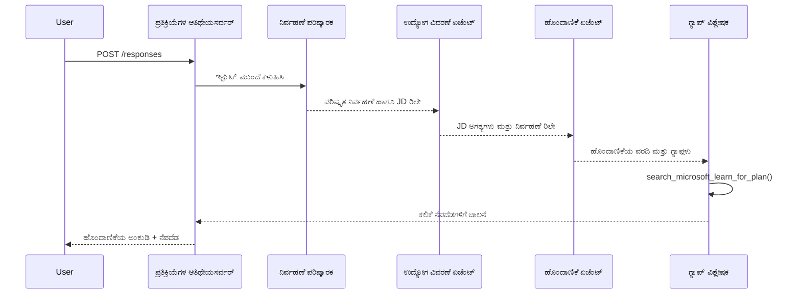

# ಮೋಡ್ಯೂಲ್ 3 - ಸೂಚನೆಗಳನ್ನು ಸಂರಚಿಸಿ, ಪರಿಸರವನ್ನು ಸಂರಚಿಸಿ ಮತ್ತು ಅವಲಂಬನಗಳನ್ನು ಸ್ಥಾಪಿಸಿ

⏱️ ~15 ನಿಮಿಷಗಳು

ಈ ಮೋಡ್ಯೂಲ್‌ನಲ್ಲಿ, ನೀವು ಸ್ಕಾಫೋಲ್ಡೆಡ್ ಸ್ಟಬ್ ಅನ್ನು **ನಿಮ್ಮ** ಬಹು-_AGENT ವರ್ಕ್‌ಫ್ಲೋ ಆಗಿ ಪರಿವರ್ತಿಸುತ್ತೀರಿ - ಪರಿಸರ ಚರಗಳನ್ನು ಹೊಂದಿಸುವ ಮೂಲಕ, ಏಜೆಂಟ್ ಸೂಚನೆಗಳನ್ನು ಬರೆಯುವ ಮೂಲಕ, MCP ಸಾಧನ ಸೇರಿಸುವ ಮೂಲಕ, ವರ್ಕ್‌ಫ್ಲೋ ಗ್ರಾಫ್ ಅನ್ನು ಸಂಪರ್ಕಿಸುವ ಮೂಲಕ ಮತ್ತು ಅವಲಂಬನಗಳನ್ನು ಅನುಸ್ಥಾಪಿಸುವ ಮೂಲಕ.

> **ಉಲ್ಲೇಖ:** ಸಂಪೂರ್ಣ ಕಾರ್ಯನಿರ್ವಹಿಸುವ ಕೋಡ್ [`PersonalCareerCopilot/main.py`](../../../../../workshop/lab02-multi-agent/PersonalCareerCopilot/main.py) ನಲ್ಲಿ ಇರುತ್ತದೆ. ನಿಮ್ಮ ಸ್ವಂತ ವರ್ಕ್‌ಫ್ಲೋ ಗ್ರಾಫ್ ಮತ್ತು ಪ್ರಾಂಪ್ಟ್ ಬ್ಲಾಕ್‌ಗಳನ್ನು ತಯಾರಿಸುವಾಗ ಇದನ್ನು ಉಲ್ಲೇಖವಾಗಿ ಬಳಸಿಕೊಳ್ಳಿ.

---

## ನಾಲ್ಕು ಏಜೆಂಟ್‌ಗಳು ಹೇಗೆ ಸೇರಿಕೊಳ್ಳುತ್ತವೆ


```mermaid
sequenceDiagram
    participant User
    participant Server as ಪ್ರತಿಕ್ರಿಯೆಗಳ ಆತಿಥೇಯಸರ್ವರ್
    participant RP as ನಿರ್ವಹಣೆ ಪರಿಷ್ಕಾರಕ
    participant JD as ಉದ್ಯೋಗ ವಿವರಣೆ ಏಜೆಂಟ್
    participant MA as ಹೊಂದಾಣಿಕೆ ಏಜೆಂಟ್
    participant GA as ಗ್ಯಾಪ್ ವಿಶ್ಲೇಷಕ

    User->>Server: POST /responses
    Server->>RP: ಇನ್ಪುಟ್ ಮುಂದೆ ಕಳುಹಿಸಿ
    RP-->>JD: ಪರಿಷ್ಕೃತ ನಿರ್ವಹಣೆ ಹಾಗೂ JD ರಿಲೇ
    JD-->>MA: JD ಅಗತ್ಯಗಳು ಮತ್ತು ನಿರ್ವಹಣೆ ರಿಲೇ
    MA-->>GA: ಹೊಂದಾಣಿಕೆಯ ವರದಿ ಮತ್ತು ಗ್ಯಾಪ್ಗಳು
    GA->>GA: search_microsoft_learn_for_plan()
    GA-->>Server: ಕಲಿಕೆ ನೆಪದೆಡಗಳಿಗೆ ಚಾಲನೆ
    Server-->>User: ಹೊಂದಾಣಿಕೆಯ ಅಂಕುಡಿ + ನೆಪದೆಡ
```

---

## ಹಂತ 1: ಪರಿಸರ ಚರಗಳನ್ನು ಸಂರಚಿಸಿ

1. ನಿಮ್ಮ ಪ್ರಾಜೆಕ್ಟ್ ರೂಟ್‌ನಲ್ಲಿರುವ **`.env`** ಫೈಲನ್ನು ತೆರೆಯಿರಿ (ಸ್ಕಾಫೋಲ್ಡ್ ವಿಜಾರ್ಡ್ ಸೃಷ್ಟಿಸಿರುವುದು).
2. ಲ್ಯಾಬ್ 01 ರಿಂದ ನಿಮ್ಮ ನೈಜ ಮೌಲ್ಯಗಳಿಂದ ಪ್ಲೇಸ್‌ಹೋಲ್ಡರ್‌ಗಳನ್ನು ಬದಲಾಯಿಸಿ.

<details open>
<summary><strong>🅰️ ಮಾರ್ಗ A - ಫೌಂಡ್ರಿ ಸಬ್ಸ್ಕ್ರಿಪ್ಷನ್</strong></summary>

```env
FOUNDRY_PROJECT_ENDPOINT=https://<your-account>.services.ai.azure.com/api/projects/<your-project>
AZURE_AI_MODEL_DEPLOYMENT_NAME=gpt-4.1-mini
```

> **ಮೌಲ್ಯಗಳನ್ನು ಎಲ್ಲಿಗೆ ಹುಡುಕಬಹುದು:** [Lab 01, Module 1](../../lab01-single-agent/docs/01-setup.md#deploy-a-model--assign-rbac) ನೋಡಿ.

</details>

<details open>
<summary><strong>🅱️ ಮಾರ್ಗ B - ಫೌಂಡ್ರಿ ಲೋಕಲ್</strong></summary>

```env
FOUNDRY_PROJECT_ENDPOINT=http://localhost:5273/v1
AZURE_AI_MODEL_DEPLOYMENT_NAME=phi-4-mini
```

> ಎಲ್ಲಾ ಇನ್ಫರೆನ್ಸ್ ನಿಮ್ಮ ಯಂತ್ರದಲ್ಲಿ ನಡೆಯುತ್ತದೆ - ಯಾವುದೇ ಡೇಟಾ ನಿಮ್ಮ ಸಾಧನದಿಂದ ಹೊರ ಹೋಗುವುದಿಲ್ಲ. ಸರಿಯಾದ ಮಾದರಿ ಅಲಿಯಾಸ್ ದೃಢೀಕರಿಸಲು `foundry model list` ನಡಿಸಿ. ಏಕೈಕ ಔಟ್‌ಬೌಂಡ್ ವಿನಂತಿ MCP ಸಾಧನದ ಕರೆ `https://learn.microsoft.com/api/mcp` ಗೆ ಇರುತ್ತದೆ.

> **ಮೌಲ್ಯಗಳನ್ನು ಎಲ್ಲಿಗೆ ಹುಡುಕಬಹುದು:** [Lab 01, Module 1 - local path](../../lab01-single-agent/docs/01-setup.md#step-2-set-up-based-on-your-access) ನೋಡಿ.

</details>

> **ಭದ್ರತೆ:** `.env` ಅನ್ನು ಕನಿಷ್ಠ ಸಂಸ್ಕರಣಾ ನಿಯಂತ್ರಣದಲ್ಲಿ‌ ಸಂಸ್ಥಾಪಿಸಬೇಡಿ. ಅದು `.gitignore` ನಲ್ಲಿ ಈಗಾಗಲೇ ಇರಬೇಕು.

---

## ಹಂತ 2: ಏಜೆಂಟ್ ಸೂಚನೆಗಳನ್ನು ಬರೆಯಿರಿ

ಸೂಚನೆಗಳು ಪ್ರತಿ ಏಜೆಂಟ್ ಪಾತ್ರ, ಔಟ್‌ಪುಟ್ ಫಾರ್ಮಾಟ್ ಮತ್ತು ನಿಯಮಗಳನ್ನು ನಿರ್ಧರಿಸುತ್ತವೆ. `main.py`ನ್ನು ತೆರೆಯಿರಿ ಮತ್ತು ನಾಲ್ಕು ಸೂಚನಾ ಸ್ಥಿರಾಂಕಗಳನ್ನು (ಅಥವಾ ಬದಲಾಯಿಸಿ) ವ್ಯಾಖ್ಯಾನಿಸಿ - ಸಂಪೂರ್ಣ ಸಾಲುಗಳು [`PersonalCareerCopilot/main.py`](../../../../../workshop/lab02-multi-agent/PersonalCareerCopilot/main.py) ನಲ್ಲಿ ದೊರೆಯುತ್ತವೆ.

### 2.1 `RESUME_PARSER_INSTRUCTIONS`
ರೆಸ್ಯೂಮೆಯನ್ನು ಸಂರಚಿತ ಮಾಡಿದ ಅಭ್ಯರ್ಥಿ ಪ್ರೊಫೈಲ್ಗೆ ಪಾರ್ಸ್ ಮಾಡುತ್ತದೆ **ಮತ್ತು** ಉದ್ಯೋಗ ವಿವರಣೆಯನ್ನು ನಕಲುಮಾಡಿ `[JOB DESCRIPTION PASS-THROUGH]` ಯಲ್ಲಿ ನಕಲಿಸುತ್ತದೆ. ಎರಡೂ ಲೇಬಲ್ ಮಾಡಿದ ವಿಭಾಗಗಳು ಔಟ್‌ಪುಟ್‌ನಲ್ಲಿ ಕಾಣಿಸಬೇಕು.

> **ಪಾಸ್-ತ್ರೂ ಯಾಕೆ?** `context_mode="last_agent"` ಇರುವಾಗ, ResumeParser ಆಗಿದೆ **ಏಕೈಕ** ಏಜೆಂಟ್ ಆ ಮೂಲ ಬಳಕೆದಾರ ಸಂದೇಶವನ್ನು ಕಾಣುವವನು. ಅದು JD ನಕಲಿಸದಿದ್ದರೆ, ನಂತರದ ಏಜೆಂಟ್‌ಗಳು ಅದನ್ನು ಎಂದಿಗೂ ನೋಡಲಾರವು.

### 2.2 `JOB_DESCRIPTION_INSTRUCTIONS`
ResumeParser ಔಟ್‌ಪುಟ್ ನಲ್ಲಿ ಇರುವ `[PARSED RESUME]` ಮತ್ತು `[JOB DESCRIPTION PASS-THROUGH]` ಓದುತ್ತದೆ. `[JD REQUIREMENTS]` (ಸಂರಚಿತ ಅಗತ್ಯಗಳು) ಮತ್ತು `[PARSED RESUME PASS-THROUGH]` (ಮ್ಯಾಚಿಂಗ್ ಏಜೆಂಟ್‌ಗೆ ನಕಲಿಸಿದ ರೆಸ್ಯೂಮ್) ಉತ್ಪಾದಿಸುತ್ತದೆ.

### 2.3 `MATCHING_AGENT_INSTRUCTIONS`
`[JD REQUIREMENTS]` ಮತ್ತು `[PARSED RESUME PASS-THROUGH]` ಓದುತ್ತದೆ. 0–100 ಅಂಕದ ಸ್ಕೋರ್ ಜೊತೆಗೆ ವೈವಿಧ್ಯಮಯ ಗಣಿತ, ಹೊಂದುವ ನಿಪುಣತೆಗಳು, ತೊಂದರೆಗಳಿಗೆ ನಿಪುಣತೆಗಳು ಮತ್ತು ಅನುಭವ ಹೊಂದಾಣಿಕೆಯನ್ನು ಉತ್ಪಾದಿಸುತ್ತದೆ.

### 2.4 `GAP_ANALYZER_INSTRUCTIONS`
ಫಿಟ್ ವರದಿಯನ್ನು ಓದುತ್ತದೆ. ಪ್ರತಿ ಇಲ್ಲದ ನಿಪುಣತೆಗೆ, `search_microsoft_learn_for_plan` ಅನ್ನು ಕರೆದು Microsoft Learn ಸಂಪನ್ಮೂಲಗಳನ್ನು ಪಡೆಯುತ್ತದೆ. ಪ್ರತಿ ನಿಪುಣತೆಗೆ ಒಂದು ವಿವರವಾದ ಗ್ಯಾಪ್ ಕಾರ್ಡು ಮತ್ತು ವಾರದಿಂದ ವಾರ ಕಲಿಕಾ ರಸ್ತೆವakkenು ಉತ್ಫತ್ತಿಸುತ್ತದೆ.

---

## ಹಂತ 3: MCP ಸಾಧನ ಸೇರಿಸಿ

GapAnalyzer [Microsoft Learn MCP ಸರ್ವರ್](https://learn.microsoft.com/azure/foundry/agents/how-to/tools/model-context-protocol) ಅನ್ನು ಕರೆದು ಪ್ರತಿ ನಿಪುಣತಾ ಗ್ಯಾಪ್ ಗೆ ನಿಜವಾದ ಕಲಿಕಾ ಸಂಪನ್ಮೂಲಗಳನ್ನು ಪಡೆಯುತ್ತದೆ. ಸಂಪೂರ್ಣ `search_microsoft_learn_for_plan` ಫಂಕ್ಷನ್ [`PersonalCareerCopilot/main.py`](../../../../../workshop/lab02-multi-agent/PersonalCareerCopilot/main.py) ನಲ್ಲಿ ಇರುವುದು.

ಏಜೆಂಟ್ ಸೃಷ್ಟಿಸುವಾಗ GapAnalyzer ಮೇಲೆ ಸಾಧನವನ್ನು ನೋಂದಾಯಿಸಿ:

```python
gap_analyzer = Agent(
    client=client,
    instructions=GAP_ANALYZER_INSTRUCTIONS,
    name="GapAnalyzer",
    tools=[search_microsoft_learn_for_plan],
)
```

> ಸಂಪೂರ್ಣ `WorkflowBuilder` ಗ್ರಾಫ್ ಅನ್ನು `FoundryChatClient`, `AgentExecutor`, ಮತ್ತು ಎಲ್ಲಾ `add_edge()` ಕರೆಗಳನ್ನು ನೋಡಲು [`PersonalCareerCopilot/main.py`](../../../../../workshop/lab02-multi-agent/PersonalCareerCopilot/main.py) ನೋಡಿ.

---

## ಹಂತ 4: ವರ್ಚುವಲ್ ಪರಿಸರವನ್ನು ಸೃಷ್ಟಿಸಿ ಮತ್ತು ಅವಲಂಬನಗಳನ್ನು ಸ್ಥಾಪಿಸಿ

> ⚠️ **ಈ ಹಂತವನ್ನು ತಪ್ಪಿಸಬೇಡಿ.** ಅವಲಂಬನಗಳು ಸ್ಥಾಪಿಸಲ್ಪಟ್ಟಿಲ್ಲದೆ, F5 ಡೀಬಗಿಂಗ್ ವಿಫಲವಾಗಬಹುದು.

### 4.1 ವರ್ಚುವಲ್ ಪರಿಸರವನ್ನು ಸೃಷ್ಟಿಸಿ

```powershell
python -m venv .venv
```

### 4.2 ಅದನ್ನು ಸಕ್ರಿಯಗೊಳಿಸಿ

| OS | ಆಜ್ಞೆ |
|----|---------|
| **Windows (PowerShell)** | `.\.venv\Scripts\Activate.ps1` |
| **Windows (CMD)** | `.venv\Scripts\activate.bat` |
| **macOS / Linux** | `source .venv/bin/activate` |

ಟರ್ಮಿನಲ್ ಪ್ರಾಂಪ್ಟ್‌ನಲ್ಲಿ `(.venv)` ಕಾಣಿಸಬೇಕು.

### 4.3 ಅವಲಂಬನಗಳನ್ನು ಸ್ಥಾಪಿಸಿ

```powershell
pip install -r requirements.txt
```

### 4.4 ಪರಿಶೀಲಿಸಿ

```powershell
pip list | Select-String "agent-framework|mcp|debugpy"
```

ನಿರೀಕ್ಷಿಸಲಾಗಿದೆ: `agent-framework-foundry`, `agent-framework-foundry-hosting`, `mcp`, ಮತ್ತು `debugpy` ಪಟ್ಟಿ ಮಾಡಲ್ಪಟ್ಟಿರಬೇಕು.

---

## ಹಂತ 5: ಪ್ರಾಮಾಣೀಕರಣ ಪರಿಶೀಲನೆ ಮಾಡಿ

<details open>
<summary><strong>🅰️ ಮಾರ್ಗ A - ಅಜೂರ್ ರೆಡ್‌ರಶಿಯಲ್</strong></summary>

```powershell
az account show --query "{name:name, id:id}" --output table
```

ಇದು ವಿಫಲವಾದರೆ, [`az login`](https://learn.microsoft.com/cli/azure/authenticate-azure-cli-interactively) ನಡಿಸಿ.

ಎಲ್ಲಾ ನಾಲ್ಕು ಏಜೆಂಟ್‌ಗಳು ಒಂದೇ `FoundryChatClient` ಮತ್ತು ಒಂದೇ `DefaultAzureCredential` ಅನ್ನು ಹಂಚಿಕೊಳ್ಳುತ್ತವೆ. ಒಂದು ಏಜೆಂಟ್‌ಗೆ ಪ್ರಾಮಾಣೀಕರಣ ಕೆಲಸ ಮಾಡಿದರೆ, ಎಲ್ಲಾ ಏಜೆಂಟ್‌ಗಳಿಗೆ ಅದು ಕೆಲಸಮಾಡುತ್ತದೆ.

</details>

<details open>
<summary><strong>🅱️ ಮಾರ್ಗ B - ಫೌಂಡ್ರಿ ಲೋಕಲ್</strong></summary>

ಲೋಕಲ್ ಪರೀಕ್ಷೆಗಾಗಿ ಪ್ರಾಮಾಣೀಕರಣ ಅಗತ್ಯವಿಲ್ಲ.

</details>

---

### ✅ ಪರಿಶೀಲನೆ

> **ಮಾಡಬದು** ಮೊಡ್ಯೂಲ್ 04 ವಾರದು: **(1)** ನಿಮ್ಮ ಪ್ರಾಂಪ್ಟ್‌ನಲ್ಲಿ `(.venv)` ಗೋಚರಿಸುತ್ತದೆ ಮತ್ತು **(2)** `pip install -r requirements.txt` ಯಶಸ್ವಿಯಾಗಿ ಪೂರ್ಣಗೊಂಡಿದೆ.

- [ ] `.env` ನಲ್ಲಿ ಅಮಾನ್ಯ ಎಂಡ್‌ಪಾಯಿಂಟ್ ಮತ್ತು ಮಾದರಿ ನಿಯೋಜನೆ ಹೆಸರು (ಪ್ಲೇಸ್‌ಹೋಲ್ಡರ್‌ಗಳು ಅಲ್ಲ)
- [ ] main.py ನಲ್ಲಿ ಎಲ್ಲಾ 4 ಏಜೆಂಟ್ ಸೂಚನಾ ಸ್ಥಿರಾಂಕಗಳು ವ್ಯಾಖ್ಯಾನಿಸಲಾಗಿದೆ (ResumeParser, JD Agent, MatchingAgent, GapAnalyzer)
- [ ] `search_microsoft_learn_for_plan` MCP ಸಾಧನ ವ್ಯಾಖ್ಯಾನಿತ ಮತ್ತು GapAnalyzer ಮೇಲೆ ನೋಂದಾಯಿತವಾಗಿದೆ
- [ ] `FoundryChatClient` + 4 `Agent` + 4 `AgentExecutor` ವಸ್ತುಗಳು `main()` ನಲ್ಲಿ ಸೃಷ್ಟಿಸಲ್ಪಟ್ಟಿವೆ
- [ ] `WorkflowBuilder` ಸರಿಯಾದ ಕ್ರಮಾತ್ಮಕ ಗ್ರಾಫ್ ನಿರ್ಮಿಸಿದೆ ಎಲ್ಲಾ 3 `add_edge()` ಕರೆಗಳೊಂದಿಗೆ
- [ ] ವರ್ಚುವಲ್ ಪರಿಸರ ಸೃಷ್ಟಿಸಲ್ಪಟ್ಟಿದೆ ಹಾಗು ಸಕ್ರಿಯಗೊಳಿಸಲಾಗಿದೆ (`(.venv)` ಪ್ರಾಂಪ್ಟ್‌ನಲ್ಲಿ ಗೋಚರಿಸುತ್ತದೆ)
- [ ] `pip install -r requirements.txt` ದೋಷವಿಲ್ಲದೇ ಪೂರ್ಣಗೊಂಡಿದೆ
- [ ] **ಮಾರ್ಗ A:** `az account show` ಯಶಸ್ವಿಯಾಗಿದೆ ಅಥವಾ VS ಕೋಡ್ ಖಾತೆಗಳು ಐಕಾನ್‌ನಲ್ಲಿ ಸೈನ್ ಇನ್ ಆಗಿದ ಖಾತೆ ತೋರಿಸುತ್ತಿದೆ

---

**ಹಿಂದಿನ:** [02 - Scaffold Multi-Agent Project](02-scaffold-multi-agent.md) · **ಮುಂದಿನ:** [04 - Orchestration Patterns →](04-orchestration-patterns.md)

---

<!-- CO-OP TRANSLATOR DISCLAIMER START -->
**ಅಸ್ವೀಕಾರ**:
ಈ ದಸ್ತಾವೇಜು AI ಅನುವಾದ ಸೇವೆ [Co-op Translator](https://github.com/Azure/co-op-translator) ಬಳಸಿ ಅನುವಾದಿಸಲಾಗಿದೆ. ನಾವು ನಿಖರತೆಯನ್ನು ಸಾಧಿಸಲು ಪ್ರಯತ್ನಿಸುತ್ತಿದ್ದರೂ, ದಯವಿಟ್ಟು ಗಮನಿಸಿ, ಸ್ವಯಂಚಾಲಿತ ಅನುವಾದಗಳಲ್ಲಿ ದೋಷಗಳು ಅಥವಾ ಅಸಡ್ಡೆಗಳು ಇರಬಹುದು. ಮೂಲ ಭಾಷೆಯಲ್ಲಿರುವ ಮೂಲ ದಸ್ತಾವೇಜು ಪ್ರಾಮಾಣಿಕ ಮೂಲವೆಂದು ಪರಿಗಣಿಸಬೇಕು. ಪ್ರಮುಖ ಮಾಹಿತಿಗಾಗಿ, ವೃತ್ತಿಪರ ಮಾನವ ಅನುವಾದವನ್ನು ಶಿಫಾರಸು ಮಾಡಲಾಗುತ್ತದೆ. ಈ ಅನುವಾದವನ್ನು ಬಳಸುವ ಮೂಲಕ ಉಂಟಾಗುವ ಯಾವುದೇ ತಪ್ಪು ಅರ್ಥಗಳ ಅಥವಾ ತಪ್ಪು ವ್ಯಾಖ್ಯಾನಗಳ ಬಗ್ಗೆ ನಾವು ಹೊಣೆಗಾರರಲ್ಲ.
<!-- CO-OP TRANSLATOR DISCLAIMER END -->