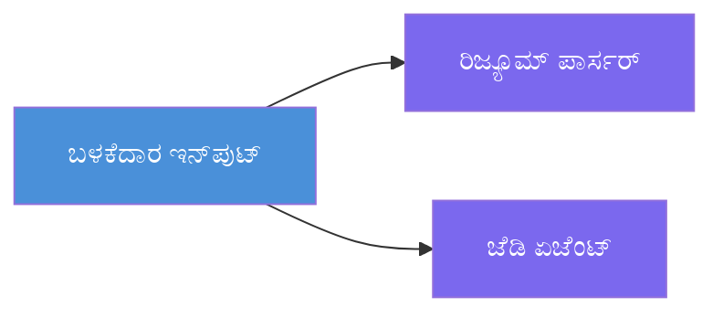
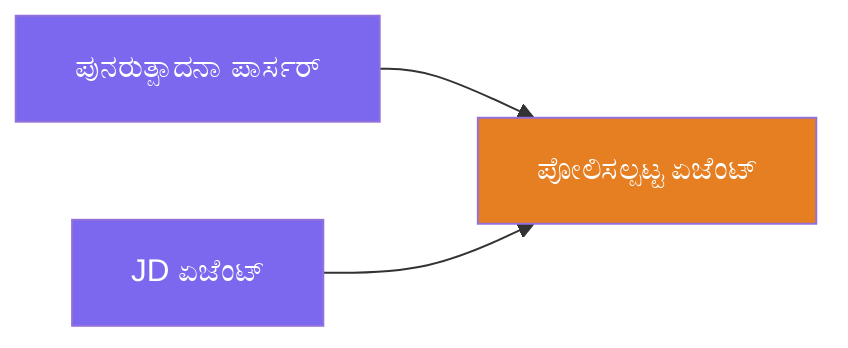
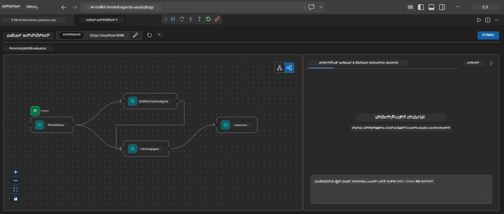
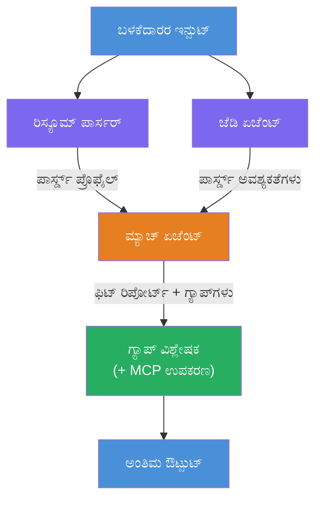
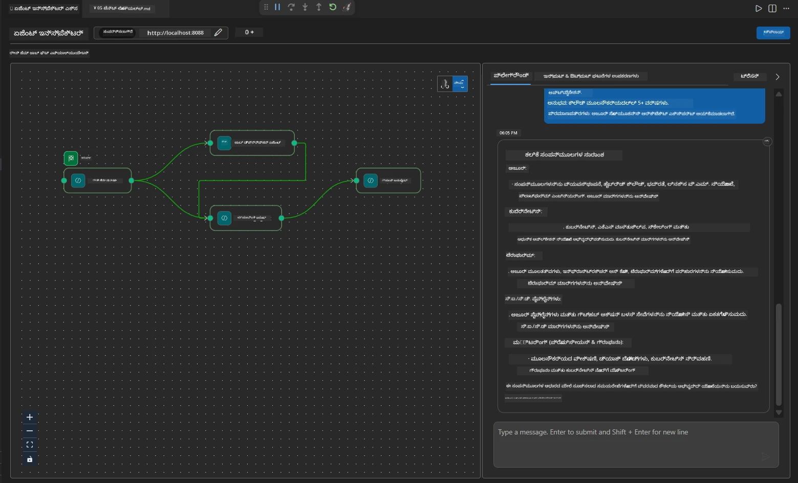

# Module 4 - ಸಂಯೋಜನಾ ಮಾದರಿಗಳು

ಈ ಘಟಕದಲ್ಲಿ, ನೀವು Resume Job Fit Evaluator ನಲ್ಲಿ ಬಳಸುವ ಸಂಯೋಜನಾ ಮಾದರಿಗಳನ್ನು ಅನ್ವೇಷಿಸಿ, ವರ್ಕ್ಫ್ಲೋ ಗ್ರಾಫ್ ಅನ್ನು ಓದುತ್ತಾ, ಬದಲಾಯಿಸುತ್ತಾ ಮತ್ತು ವಿಸ್ತರಿಸುವ ವಿಧಾನವನ್ನು ಕಲಿಯುತ್ತೀರಿ. ಈ ಮಾದರಿಗಳನ್ನು ಅರ್ಥಮಾಡಿಕೊಳ್ಳುವುದು ಡೇಟಾ ಫ್ಲೋ ಸಮಸ್ಯೆಗಳನ್ನು ಡಿಬಗ್ ಮಾಡಲು ಮತ್ತು ನಿಮ್ಮ ಸ್ವಂತ [ಬಹು-ಏಜೆಂಟ್ ವರ್ಕ್ಫ್ಲೋಗಳು](https://learn.microsoft.com/agent-framework/workflows/) ನಿರ್ಮಿಸಲು ಅಗತ್ಯವಾಗಿದೆ.

---

## ಮಾದರಿ 1: ಫ್ಯಾನ್-ಔಟ್ (ಸಮಾಂತರ ವಿಭಜನೆ)

ವರ್ಕ್ಫ್ಲೋದಲ್ಲಿ ಮೊದಲ ಮಾದರಿ **ಫ್ಯಾನ್-ಔಟ್** — ಒಂದೇ ಇನ್ಪುಟ್ ಅನ್ನು ಏಕಕಾಲದಲ್ಲಿ ಹಲವು ಏಜೆಂಟ್‌ಗಳಿಗೆ ಕಳುಹಿಸಲಾಗುತ್ತದೆ.


ಕೋಡಿನಲ್ಲಿ, ಇದು ಸಂಭವಿಸುವುದು `resume_parser` ಎಂಬುದು `start_executor` ಆಗಿರುವುದರಿಂದ - ಅದು ಮೊದಲಿಗೆ ಬಳಕೆದಾರರ ಸಂದೇಶವನ್ನು ಸ್ವೀಕರಿಸುತ್ತದೆ. ನಂತರ, `jd_agent` ಮತ್ತು `matching_agent` ಎರಡೂ `resume_parser` ಯಿಂದ ಎಡ್ಗ್‌ಗಳನ್ನು ಹೊಂದಿರುವ ಕಾರಣ, ಫ್ರೇಮ್ವರ್ಕ್ `resume_parser` ನ ಔಟ್‌ಪುಟ್ ಅನ್ನು ಎರಡೂ ಏಜೆಂಟ್‌ಗಳಿಗೆ ಮಾರ್ಗನಿರ್ದೇಶನ ಮಾಡುತ್ತದೆ:

```python
.add_edge(resume_parser, jd_agent)         # ResumeParser output → ಜೊಬ್ ವಿವರಣೆ ಏಜೆಂಟ್
.add_edge(resume_parser, matching_agent)   # ResumeParser output → ವೈಶಿಷ್ಟ್ಯಪೂರಕ ಏಜೆಂಟ್
```

**ಇದು ಹೇಗೆ ಕಾರ್ಯನಿರ್ವಹಿಸುತ್ತದೆ:** ResumeParser ಮತ್ತು JD Agent ಒಂದೇ ಇನ್ಪುಟ್‌ನ ವಿಭಿನ್ನ ಅಂಶಗಳನ್ನು ಪ್ರಕ್ರಿಯೆಗೊಳಿಸುತ್ತವೆ. ಅವುಗಳನ್ನು ಸಮಾಂತರವಾಗಿ ಕಾರ್ಯಗತಗೊಳಿಸುವುದು ಕ್ರಮವಾಗಿ ನಡೆಸುವುದನ್ನು ಹೋಲಿಸಿದರೆ ಒಟ್ಟು ವಿಳಂಬವನ್ನು ಕಡಿಮೆ ಮಾಡುತ್ತದೆ.

### ಫ್ಯಾನ್-ಔಟ್ ಅನ್ನು ಯಾವಾಗ ಬಳಸುವುದು

| ಬಳಕೆದಾರಿಕೆ | ಉದಾಹರಣೆ |
|----------|---------|
| ಸ್ವತಂತ್ರ ಉಪಕಾರ್ಯಗಳು | ರೆಸ್ಯೂಮ್ ವಾಚನೆ vs. JD ವಾಚನೆ |
| ಮಾತಿನಲ್ಲಿ ಪುನರಾವರ್ತನೆ / ಮತದಾನ | ಎರಡು ಏಜೆಂಟ್‌ಗಳು ಒಂದೇ ಡೇಟಾವನ್ನು ವಿಶ್ಲೇಷಣೆ ಮಾಡುತ್ತವೆ, ಮೂರನೆಯದು ಉತ್ತಮ ಉತ್ತರವನ್ನು ಆರಿಸುತ್ತದೆ |
| ಬಹುರೂಪ ಔಟ್‌ಪುಟ್ | ಒಂದು ಏಜೆಂಟ್ ಪಠ್ಯವನ್ನು ರಚಿಸುತ್ತದೆ, ಮತ್ತೊಂದು ವ್ಯವಸ್ಥಿತ JSON ರಚಿಸುತ್ತದೆ |

---

## ಮಾದರಿ 2: ಫ್ಯಾನ್-ಇನ್ (ಸಮ್ಮಿಲನ)

ಎರಡನೇ ಮಾದರಿ **ಫ್ಯಾನ್-ಇನ್** — ಹಲವಾರು ಏಜೆಂಟ್ ಔಟ್‌ಪುಟ್‌ಗಳು ಸಂಗ್ರಹಿಸಿ ಒಂದೇ ಕೆಳಗಿನ ಏಜೆಂಟ್‌ಗೆ ಕಳುಹಿಸಲಾಗುತ್ತದೆ.


ಕೋಡಿನಲ್ಲಿ:

```python
.add_edge(resume_parser, matching_agent)   # ResumeParser ಔಟ್ಪುಟ್ → MatchingAgent
.add_edge(jd_agent, matching_agent)        # JD Agent ಔಟ್ಪುಟ್ → MatchingAgent
```

**ಮುಖ್ಯ ವರ್ತನೆ:** ಏಜೆಂಟ್‌ಗೆ **ಎರಡು ಅಥವಾ ಹೆಚ್ಚಿನ ಇನಕಮಿಂಗ್ ಎಡ್ಜ್‌ಗಳು** ಇದ್ದಾಗ, ಫ್ರೇಮ್ವರ್ಕ್ ಸ್ವಯಂಚಾಲಿತವಾಗಿ ಎಲ್ಲಾ ಮೇಲFLOW ಏಜೆಂಟ್‌ಗಳು ಪೂರ್ಣಗೊಂಡ ನಂತರ ಕೆಳಗಿನ ಏಜೆಂಟ್ ಚಾಲನೆಗೊಳ್ಳುತ್ತದೆ. MatchingAgent ಅನ್ನು ResumeParser ಮತ್ತು JD Agent ಎರಡೂ ಪೂರ್ಣಗೊಂಡ ನಂತರ ಆರಂಭ ಮಾಡುತ್ತದೆ.

### MatchingAgent what gets

ಫ್ರೇಮ್ವರ್ಕ್ ಎಲ್ಲ ಮೇಲFLOW ಏಜೆಂಟ್‌ಗಳ ಔಟ್‌ಪುಟ್‌ಗಳನ್ನು concatenate ಮಾಡುತ್ತದೆ. MatchingAgent ನ ಇನ್ಪುಟ್ ಹೀಗೆ ಕಾಣುತ್ತದೆ:

```
[ResumeParser output]
---
Candidate Profile:
  Name: Jane Doe
  Technical Skills: Python, Azure, Kubernetes, ...
  ...

[JobDescriptionAgent output]
---
Role Overview: Senior Cloud Engineer
Required Skills: Python, Azure, Terraform, ...
...
```

> **ಗಮನಿಸಿ:** concatenate ಮಾಡುವ ನಿಖರ ರೂಪಾಂತರಣ ಫ್ರೇಮ್ವರ್ಕ್ ಆವೃತ್ತಿಯ ಮೇಲೆ ಅವಲಂಬಿತವಾಗಿದೆ. ಏಜೆಂಟ್ ಸೂಚನೆಗಳು ವ್ಯವಸ್ಥಿತ ಮತ್ತು ಅಸಂಯೋಜಿತ ಮೇಲFLOW ಔಟ್‌ಪುಟ್ ಎರಡನ್ನೂ ಹ್ಯಾಂಡ್ಸ್‌ಲಿಂಗ್ ಮಾಡಲು ಬರೆಯಲ್ಪಟ್ಟಿರಬೇಕು.



---

## ಮಾದರಿ 3: ಕ್ರಮಾನುಕ್ರಮ ಶೃಂಖಲೆ

ಮೂರನೇ ಮಾದರಿ **ಕ್ರಮಾನುಕ್ರಮ ಶೃಂಖಲೆ** — ಒಂದನೇ ಏಜೆಂಟ್ ಔಟ್‌ಪುಟ್ ನೇರವಾಗಿ ಮುಂದಿನ ಏಜೆಂಟ್‌ಗೆ ಆಹಾರವಾಗುತ್ತದೆ.


ಕೋಡಿನಲ್ಲಿ:

```python
.add_edge(matching_agent, gap_analyzer)    # ಮ್ಯಾಚಿಂಗ್ ಏಜೆಂಟ್ ಉತ್ಪನ್ನ → ಗ್ಯಾಪ್ ಅನಾಲೈಸರ್
```

ಇದು ಸರಳತಮ ಮಾದರಿ. GapAnalyzer MatchingAgent ನ ಫಿಟ್ ಸ್ಕೋರ್, ಹೊಂದಿಕೆಯ/ಕಂಪವಾಗಿರುವ ಕೌಶಲ್ಯಗಳು ಮತ್ತು ಗ್ಯಾಪ್‌ಗಳನ್ನು ಸ್ವೀಕರಿಸುತ್ತದೆ. ನಂತರ ಪ್ರತಿ ಗ್ಯಾಪ್‌ಗೆ Microsoft Learn ಸಂಪನ್ಮೂಲಗಳನ್ನು ಪಡೆಯಲು [MCP ಉಪಕರಣ](https://learn.microsoft.com/azure/foundry/agents/how-to/tools/model-context-protocol) ಅನ್ನು ಕರೆಸುತ್ತದೆ.

---

## ಸಂಪೂರ್ಣ ಗ್ರಾಫ್

ಈ ಮೂರು ಮಾದರಿಗಳನ್ನು ಜೊತೆಗೆ ಕೆಲಸ ಮಾಡುವ ಮೂಲಕ ಪೂರ್ಣ ವರ್ಕ್ಫ್ಲೋ ಸೃಷ್ಟಿಸಿದೆ:


### ಕಾರ್ಯಗತಗೊಳಿಸುವ ಸಮಯರೇಖೆ

```mermaid
gantt
    title ಏಜೆಂಟ್ ನಿರ್ವಹಣಾ ಸಮಯರೇಖೆ
    dateFormat X
    axisFormat %s

    section ಸಾಮಾಂತರ
    Resume Parser       :rp, 0, 3
    JD Agent            :jd, 0, 2

    section ಕ್ರಮಪಥ
    Matching Agent      :ma, 3, 5
    Gap Analyzer        :ga, 5, 9
```


> ಒಟ್ಟು ವಾಲ್-ಕ್ಲಾಕ್ ಸಮಯವು ಸರಾಸರಿ `max(ResumeParser, JD Agent) + MatchingAgent + GapAnalyzer` ಆಗಿದೆ. GapAnalyzer ಸಾಮಾನ್ಯವಾಗಿ ಸುಸ್ತಾಗಿರುತ್ತದೆ ಏಕೆಂದರೆ ಅದು ಪ್ರತಿ ಗ್ಯಾಪ್‌ಗೆ MCP ಉಪಕರಣ ಕರೆಗಳನ್ನು ಮಾಡುತ್ತದೆ.

---

## WorkflowBuilder ಕೋಡ್ ಓದುವುದು

ಇದು `main.py` ನಿಂದ ಸಂಪೂರ್ಣ `create_workflow()` ಫಂಕ್ಷನ್, ಟಿಪ್ಪಣಿಗಳೊಂದಿಗೆ:

```python
def create_workflow(resume_parser, jd_agent, matching_agent, gap_analyzer):
    workflow = (
        WorkflowBuilder(
            name="ResumeJobFitEvaluator",

            # ಬಳಕೆದಾರರ ಇನ್‌ಪುಟ್ ಸ್ವೀಕರಿಸುವ ಮೊದಲ ಏಜೆಂಟ್
            start_executor=resume_parser,

            # ಔಟ್‌ಪುಟ್ ಅಂತಿಮ ಪ್ರತಿಕ್ರಿಯೆಯಾಗುವ ಏಜೆಂಟ್(ಗಳು)
            output_executors=[gap_analyzer],
        )
        # ಫ್ಯಾನ್-ಔಟ್: ResumeParser ಔಟ್‌ಪುಟ್ JD Agent ಮತ್ತು MatchingAgent ಎರಡಕ್ಕೂ ಹೋಗುತ್ತದೆ
        .add_edge(resume_parser, jd_agent)
        .add_edge(resume_parser, matching_agent)

        # ಫ್ಯಾನ್-ಇನ್: MatchingAgent ResumeParser ಮತ್ತು JD Agent ಎರಡನ್ನೂ ಕಾಯುತ್ತದೆ
        .add_edge(jd_agent, matching_agent)

        # ಕ್ರಮಾನುಗತ: MatchingAgent ಔಟ್‌ಪುಟ್ GapAnalyzer ಗೆ ವೇತನ ನೀಡುತ್ತದೆ
        .add_edge(matching_agent, gap_analyzer)

        .build()
    )
    return workflow.as_agent()
```

### ಎಡ್ಜ್ ಸಾರಾಂಶ ಪಟ್ಟಿಕೆ

| # | ಎಡ್ಜ್ | ಮಾದರಿ | ಪರಿಣಾಮ |
|---|------|---------|--------|
| 1 | `resume_parser → jd_agent` | ಫ್ಯಾನ್-ಔಟ್ | JD Agent ResumeParser ಔಟ್‌ಪುಟ್ (ಮತ್ತೆ ಮೂಲ ಬಳಕೆದಾರ ಇನ್ಪುಟ್ ಜೊತೆಗೆ) ಸ್ವೀಕರಿಸುತ್ತದೆ |
| 2 | `resume_parser → matching_agent` | ಫ್ಯಾನ್-ಔಟ್ | MatchingAgent ResumeParser ಔಟ್‌ಪುಟ್ ಸ್ವೀಕರಿಸುತ್ತದೆ |
| 3 | `jd_agent → matching_agent` | ಫ್ಯಾನ್-ಇನ್ | MatchingAgent JD Agent ಔಟ್‌ಪುಟ್ ಕೂಡ ಸ್ವೀಕರಿಸುತ್ತದೆ (ಎರಡಕ್ಕೂ ಕಾಯುತ್ತದೆ) |
| 4 | `matching_agent → gap_analyzer` | ಕ್ರಮಾನುಕ್ರಮ | GapAnalyzer ಫಿಟ್ ವರದಿ + ಗ್ಯಾಪ್ ಪಟ್ಟಿಯನ್ನು ಸ್ವೀಕರಿಸುತ್ತದೆ |

---

## ಗ್ರಾಫ್ ಬದಲಾಯಿಸುವುದು

### ಹೊಸ ಏಜೆಂಟ್ ಸೇರಿಸುವುದು

ಇದಕ್ಕೆ ಐದನೇ ಏಜೆಂಟ್ ಸೇರಿಸಲು (ಉದಾ: ಗ್ಯಾಪ್ ವಿಶ್ಲೇಷಣೆ ಆಧಾರಿತವಾಗಿ ಸಂದರ್ಶನ ಪ್ರಶ್ನೆಗಳನ್ನು ರಚಿಸುವ **InterviewPrepAgent**):

```python
# 1. ಸೂಚನೆಗಳನ್ನು ವ್ಯಾಖ್ಯಾನಿಸಿ
INTERVIEW_PREP_INSTRUCTIONS = """\
You are the Interview Prep Agent.
Given a gap analysis and fit report, generate 10 targeted interview questions
the candidate should prepare for.
"""

# 2. ಏಜೆಂಟ್ ಅನ್ನು ರಚಿಸಿ (async with ಬ್ಲಾಕ್ ಒಳಗೆ)
AzureAIAgentClient(
    project_endpoint=PROJECT_ENDPOINT,
    model_deployment_name=MODEL_DEPLOYMENT_NAME,
    credential=credential,
).as_agent(
    name="InterviewPrepAgent",
    instructions=INTERVIEW_PREP_INSTRUCTIONS,
) as interview_prep,

# 3. create_workflow() ನಲ್ಲಿ ಎಡ್ಜ್‌ಗಳನ್ನು ಸೇರಿಸಿ
.add_edge(matching_agent, interview_prep)   # ಫಿಟ್ ವರದಿಯನ್ನು ಸ್ವೀಕರಿಸುತ್ತದೆ
.add_edge(gap_analyzer, interview_prep)     # ನಡುವೆ ಗ್ಯಾಪ್ ಕಾರ್ಡ್ ಗಳನ್ನು ಸಹ ಸ್ವೀಕರಿಸುತ್ತದೆ

# 4. output_executors ಅನ್ನು ನವೀಕರಿಸಿ
output_executors=[interview_prep],  # ಈಗ ಅಂತಿಮ ಏಜೆಂಟ್
```

### ಕಾರ್ಯಗತಗೊಳಿಸುವ ಕ್ರಮ ಬದಲಾಯಿಸುವುದು

JD Agent ಅನ್ನು ResumeParser ನಂತರ ಕಾರ್ಯಗತಗೊಳಿಸಲು (ಸಮಾಂತರವಲ್ಲದೆ ಕ್ರಮಾನುಕ್ರಮವಾಗಿ):

```python
# ತೆಗೆಯಿರಿ: .add_edge(resume_parser, jd_agent)  ← ಈಗಾಗಲೇ ಇದೆ, ಇದನ್ನು ಇಡಿ
# jd_agent ನೇರವಾಗಿ ಬಳಕೆದಾರನ ಇನ್‌ಪುಟ್‌ ಅನ್ನು ಸ್ವೀಕರಿಸುವುದನ್ನು ನಿಲ್ಲಿಸಿ ಅಸ್ಪಷ್ಟ ಅನುಕ್ರಮಿಕತೆಯನ್ನು ತೆಗೆಯಿರಿ
# start_executor ಮೊದಲಿಗೆ resume_parser ಗೆ ಕಳುಹಿಸುತ್ತದೆ, ಮತ್ತು jd_agent ಕೇವಲ ಪಡೆಯುತ್ತದೆ
# resume_parser ರ ವುಟ್ಪತ್ತಿ ಆ ಎಡ್ಜ್ ಮೂಲಕ. ಇದರಿಂದ ಅವು ಕ್ರಮಬದ್ಧವಾಗುತ್ತವೆ.
```

> **ಮೊಖ್ಯ:** `start_executor` ಮಾತ್ರ ಮೂಲ ಬಳಕೆದಾರ ಇನ್ಪುಟ್ ಪಡೆಯುವ ಏಜೆಂಟ್. ಮಿಕ್ಕ ಕಾರ್ಯಾಚರಣೆಗಳು ತಮ್ಮ ಮೇಲFLOW ಎಡ್ಜ್ ಗಳ ಔಟ್‌ಪುಟ್ ಪಡೆಯುತ್ತವೆ. ನೀವು ಏಜೆಂಟ್‌ಗೆ ಮೂಲ ಬಳಕೆದಾರ ಇನ್ಪುಟ್ ಸಹ ಬೇಕಾದರೆ, ಅದಕ್ಕೆ `start_executor` ಯಿಂದ ಎಡ್ಜ್ ಇರಬೇಕು.

---

## ಸಾಮಾನ್ಯ ಗ್ರಾಫ್ ದೋಷಗಳು

| ದೋಷ | ಲಕ್ಷಣ | ಪರಿಹಾರ |
|---------|---------|-----|
| `output_executors` ಗೆ ಎಡ್ಜ್ ಇಲ್ಲ | ಏಜೆಂಟ್ ಚಾಲನೆ ಆದರೆ ಔಟ್‌ಪುಟ್ ಖಾಲಿ | `start_executor` ನಿಂದ `output_executors` ಎಲ್ಲಾ ಏಜೆಂಟ್‌ಗೆ ಮಾರ್ಗ ಇರಿಸಬೇಕು |
| ವೃತ್ತಾಕಾರದ ಡಿಪೆಂಡೆನ್ಸಿ | ಅನಂತ ಲೂಪ್ ಅಥವಾ ಸಮಯ ಮೀರಿದ | ಯಾವ ಏಜೆಂಟ್ ಮೇಲFLOW ಏಜೆಂಟ್‌ಗೆ ಅರ್ಜಿ ಹೊಡೆಯದಿರಲಿ ಎಂಬುದು ಪರಿಶೀಲಿಸಿ |
| `output_executors` ನಲ್ಲಿ ಯಾವುದೇ ಇನಕಮಿಂಗ್ ಎಡ್ಜ್ ಇಲ್ಲದ ಏಜೆಂಟ್ | ಖಾಲಿ ಔಟ್‌ಪುಟ್ | ಕನಿಷ್ಠ ಒಂದು `add_edge(source, that_agent)` ಸೇರಿಸಿ |
| ಫ್ಯಾನ್-ಇನ್ ಇಲ್ಲದ ಹಲವಾರು `output_executors` | ಔಟ್‌ಪುಟ್ ಒಂದು ಏಜೆಂಟ್ ಪ್ರತಿಕ್ರಿಯೆ ಮಾತ್ರ | ಒಂದೇ ಔಟ್‌ಪುಟ್ ಏಜೆಂಟ್ ಬಳಸಿ ಸಮ್ಮಿಲನ ಮಾಡಿಸಿ ಅಥವಾ ಬಹು ಔಟ್‌ಪುಟ್‌ಗಳನ್ನು ಸ್ವೀಕರಿಸಿ |
| `start_executor` ಕಾಣಿಸದಿರುವುದು | ನಿರ್ಮಾಣ ಸಮಯದಲ್ಲಿ `ValueError` | `WorkflowBuilder()` ನಲ್ಲಿ `start_executor` ನಿರಂತರ Specify ಮಾಡಿ |

---

## ಗ್ರಾಫ್ ಡಿಬಗ್ಗಿಂಗ್

### Agent Inspector ಬಳಕೆ

1. ಏಜೆಂಟ್ ಅನ್ನು ಸ್ಥಳೀಯವಾಗಿ ಪ್ರಾರಂಭಿಸಿ (F5 ಅಥವಾ ಟೆರ್ಮಿನಲ್ - ನೋಡಿ [Module 5](05-test-locally.md)).
2. Agent Inspector ತೆರೆಯಿರಿ (`Ctrl+Shift+P` → **Foundry Toolkit: Open Agent Inspector**).
3. ಟೆಸ್ಟ್ ಸಂದೇಶ ಕಳುಹಿಸಿ.
4. ಇನ್‌ಸ್ಪೆಕ್ಟರ್ ರಿಸ್ಪಾನ್ಸ್ ಪ್ಯಾನೆಲ್‌ನಲ್ಲಿ **ಸ್ಟ್ರೀಮಿಂಗ್ ಔಟ್‌ಪುಟ್** ಹುಡುಕಿ - ಅದು ಪ್ರತಿ ಏಜೆಂಟ್ ಕೊಡುಗಿನ ಕ್ರಮವನ್ನು ತೋರಿಸುತ್ತದೆ.



### ಲಾಗಿಂಗ್ ಬಳಕೆ

`main.py`ಗೆ ಲಾಗಿಂಗ್ ಸೇರಿಸಿ ಡೇಟಾ ಫ್ಲೋ ಟ್ರೇಸ್ ಮಾಡಲು:

```python
import logging
logger = logging.getLogger("resume-job-fit")

# create_workflow()ನಲ್ಲಿ, ರಚನೆಯ ನಂತರ:
logger.info("Workflow graph built with edges: RP→JD, RP→MA, JD→MA, MA→GA")
```

ಸರ್ವರ್ ಲಾಗ್‌ಗಳು ಏಜೆಂಟ್ ಕಾರ್ಯಾಚರಣೆಯ ಆದೇಶ ಮತ್ತು MCP ಉಪಕರಣ ಕರೆಗಳನ್ನು ತೋರಿಸುತ್ತವೆ:

```
INFO:resume-job-fit:Starting Resume -> Job Fit Evaluator HTTP server...
INFO:resume-job-fit:Server running on http://localhost:8088
INFO:agent_framework:Executing agent: ResumeParser
INFO:agent_framework:Executing agent: JobDescriptionAgent
INFO:agent_framework:Waiting for upstream agents: ResumeParser, JobDescriptionAgent
INFO:agent_framework:Executing agent: MatchingAgent
INFO:agent_framework:Executing agent: GapAnalyzer
INFO:agent_framework:Tool call: search_microsoft_learn_for_plan(skill="Kubernetes")
POST https://learn.microsoft.com/api/mcp → 200
INFO:agent_framework:Tool call: search_microsoft_learn_for_plan(skill="Terraform")
POST https://learn.microsoft.com/api/mcp → 200
```

---

### ಪರಿಶೀಲನೆ

- [ ] ನೀವು ವರ್ಕ್ಫ್ಲೋದಲ್ಲಿ ಮೂರು ಸಂಯೋಜನಾ ಮಾದರಿಗಳನ್ನು ಗುರುತಿಸಬಹುದು: ಫ್ಯಾನ್-ಔಟ್, ಫ್ಯಾನ್-ಇನ್, ಮತ್ತು ಕ್ರಮಾನುಕ್ರಮ ಶೃಂಖಲೆ
- [ ] ನಿಮಗೆ ತಿಳಿದಿದೆ ಹೆಚ್ಚಿನ ಇನಕಮಿಂಗ್ ಎಡ್ಜ್‌ಗಳೊಂದಿಗೆ ಏಜೆಂಟ್‌ಗಳು ಎಲ್ಲಾ ಮೇಲFLOW ಏಜೆಂಟ್ ಪೂರ್ಣಗೊಳ್ಳುವ ತನಕ ಕಾಯುತ್ತವೆ
- [ ] ನೀವು `WorkflowBuilder` ಕೋಡ್ ಓದಿ ಪ್ರತಿ `add_edge()` ಕರೆವನ್ನು ದೃಶ್ಯ ಗ್ರಾಫ್‌ಗೆ ಸಮ್ಮಿಳಿಸಬಹುದು
- [ ] ಕಾರ್ಯಗತಗೊಳಿಸುವ ಸಮಯರೇಖೆಯನ್ನು ಅರ್ಥಮಾಡಿಕೊಂಡಿದ್ದೀರಿ: ಸಮಾಂತರ ಏಜೆಂಟ್‌ಗಳು ಮೊದಲಾಗಿ, ನಂತರ ಸಮ್ಮಿಲನ, ಬಳಿಕ ಕ್ರಮಾನುಕ್ರಮ
- [ ] ನೀವು ಸೇರ್ಪಡೆ ಮಾಡುವ ಹೊಸ ಏಜೆಂಟ್‌ನ ಸೂಚನೆಗಳನ್ನು ವ್ಯಾಖ್ಯಾನಿಸಿ, ಏಜೆಂಟ್ ರಚಿಸಿ, ಎಡ್ಜ್ ಸೇರಿಸಿ ಮತ್ತು ಔಟ್‌ಪುಟ್ تازهಮಾಡುವುದು ತಿಳಿದಿದೆ
- [ ] ನೀವು ಸಾಮಾನ್ಯ ಗ್ರಾಫ್ ಮೇಲ್ವಿಚಾರಣ ದೋಷಗಳನ್ನು ಮತ್ತು ಅವುಗಳ ಲಕ್ಷಣಗಳನ್ನು ಗುರುತಿಸಬಹುದು

---

**ಹಿಂದಿನ:** [03 - ಏಜೆಂಟ್ಸ್ ಮತ್ತು ಪರಿಸರ ವ್ಯವಸ್ಥೆಯನ್ನು ರಚಿಸುವುದು](03-configure-agents.md) · **ಮುಂದಿನ:** [05 - ಸ್ಥಳೀಯವಾಗಿ ಪರೀಕ್ಷಿಸುವುದು →](05-test-locally.md)

---

<!-- CO-OP TRANSLATOR DISCLAIMER START -->
**ಪ್ರತ್ಯೇಕತಾ ಘೋಷಣೆ**:  
ಈ ದಾಖಲೆ [Co-op Translator](https://github.com/Azure/co-op-translator) ಎಂಬ AI ಭಾಷಾಂತರ ಸೇವೆಯನ್ನು ಉಪಯೋಗಿಸಿ ಭಾಷಾಂತರಿಸಲಾಗಿದೆ. ನಾವು ನಿಖರತೆಗೆ ಪ್ರಯತ್ನಿಸುತ್ತಿದ್ದರೂ, ಸ್ವಯಂಚಾಲಿತ ಭಾಷಾಂತರಗಳಲ್ಲಿ ತಪ್ಪುಗಳು ಅಥವಾ ಅಸಡ್ಡೆಗಳು ಇರಬಹುದೆಂದು ದಯವಿಟ್ಟು ಗಮನಿಸಿ. ಮೂಲ ಭಾಷೆಯಲ್ಲಿ ಇರುವ ಮೂಲ ದಾಖಲೆ ಅಧಿಕೃತ ಮೂಲವಾಗಿ ಪರಿಗಣಿಸಲಾಗಿದೆ. ಪ್ರಮುಖ ಮಾಹಿತಿಗಾಗಿ ವೃತ್ತಿಪರ ಮಾನವ ಭಾಷಾಂತರವನ್ನು ಶಿಫಾರಸು ಮಾಡಲಾಗುತ್ತದೆ. ಈ ಭಾಷಾಂತರ ಬಳಕೆಯಿಂದ ಉಂಟಾಗುವ ಯಾವುದೇ ಅರ್ಥ ತಪ್ಪುಮಾಡಿಕೊಳ್ಳುವಿಕೆ ಅಥವಾ ತಪ್ಪು ಅರ್ಥಗರ್ಭಿತತೆಗೆ ನಾವು ಹೊಣೆಗಾರರಾಗುವುದಿಲ್ಲ.
<!-- CO-OP TRANSLATOR DISCLAIMER END -->