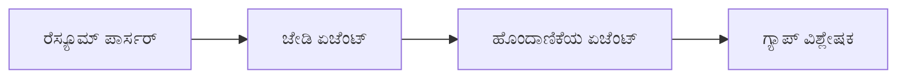
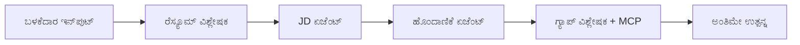

# MODULE 4 - ವ್ಯವಸ್ಥಾಪನಾ ಮಾದರಿಗಳು

⏱️ ~10 ನಿಮಿಷಗಳು

ಈ ಮ್ಯಾಜ್ಯೂಲ್‌ನಲ್ಲಿ, ನೀವು Resume Job Fit Evaluator ನಲ್ಲಿ ಬಳಸಲಾಗುವ ವ್ಯವಸ್ಥಾಪನಾ ಮಾದರಿಗಳನ್ನು ಅನ್ವೇಷಿಸಿ, ವರ್ಕ್‌ಫ್ಲೋ ಗ್ರಾಫ್ ಅನ್ನು ಓದಲು, ಬದಲಾಯಿಸಲು ಮತ್ತು ವಿಸ್ತರಿಸಿಕೊಳ್ಳಲು ಕಲಿತೀರಿ. ಈ ಮಾದರಿಗಳನ್ನು ಅರ್ಥಮಾಡಿಕೊಳ್ಳುವುದು ಡೇಟಾ ಹರಿವು ಸಮಸ್ಯೆಗಳನ್ನು ಡೀಬಗ್ ಮಾಡುವುದು ಮತ್ತು ನಿಮ್ಮದೇ [ಬಹು- ಏಜೆಂಟ್ ವರ್ಕ್‌ಫ್ಲೋಗಳು](https://learn.microsoft.com/agent-framework/workflows/) ನಿರ್ಮಿಸಲು ಅಗತ್ಯವಾಗಿದೆ.

---

## ಮಾದರಿ 1: ಕ್ರಮಬದ್ಧ ಸರಪಳಿ

ವರ್ಕ್‌ಫ್ಲೋದಲ್ಲಿ ಮೂಲಭೂತ ಮಾದರಿ ಒಂದು **ಕ್ರಮಬದ್ಧ ಸರಪಳಿ** - ಪ್ರತಿ ಏಜೆಂಟ್‌ನ ಔಟ್ಪುಟ್ ನೇರವಾಗಿ ಮುಂದಿನದಕ್ಕೆ ಪೂರೈಸುತ್ತದೆ.


```mermaid
flowchart LR
    RP[ರೆಸ್ಯೂಮ್ ಪಾರ್ಸರ್] --> JD[ಜೇಡಿ ಏಜೆಂಟ್]
    JD --> MA[ಹೊಂದಾಣಿಕೆಯ ಏಜೆಂಟ್]
    MA --> GA[ಗ್ಯಾಪ್ ವಿಶ್ಲೇಷಕ]
```

ಕೋಡ್‌ನಲ್ಲಿ, ಪ್ರತಿ `add_edge()` ಕಾಲ್ ಸರಪಳಿಯಲ್ಲಿ ಒಂದು ಹಂತವನ್ನು ನಿರ್ಮಿಸುತ್ತದೆ:

```python
.add_edge(resume_executor, jd_executor)       # ResumeParser output → ಜೇಡಿ ಏಜೆಂಟ್
.add_edge(jd_executor, matching_executor)     # JD Agent output → ಮ್ಯಾಚಿಂಗ್ ಏಜೆಂಟ್
.add_edge(matching_executor, gap_executor)    # MatchingAgent output → ಗ್ಯಾಪ್ ಅನಾಲೈಸರ್
```

> **ಏಕೆ ಕ್ರಮಬದ್ಧ, fan-out/fan-in ಅಲ್ಲ?** `WorkflowBuilder` ಇರುತ್ತದೆ **OR-ಅರ್ಥತಂತ್ರ** ಆಮದ ಎಡ್ಜ್ಗಳಿಗಾಗಿ: ಕೆಳಗೆedka ಕಾರ್ಯಾಚರಣೆ ಯಾವುದೇ ಹಿಂದಿನ ಕಾರ್ಯಾರಂಭದ ನಂತರ ಕಾರ್ಯಗತಗೊಳ್ಳುತ್ತದೆ. `matching_executor`ಗೆ ಎರಡು ಆಮದ ಎಡ್ಜ್ಗಳು ಇದ್ದರೆ (`resume_executor` ಮತ್ತು `jd_executor`ಯಿಂದ), ಅದು ಎರಡು ಬಾರಿ ಟ್ರಿಗರ್ ಆಗುತ್ತದೆ - ಮೊದಲು ResumeParser ಮುಗಿಸಿದಾಗ ಮತ್ತು ಮತ್ತೆ JD Agent ಮುಗಿಸಿದಾಗ - ಇದರಿಂದ GapAnalyzer ಕೂಡ ಎರಡು ಬಾರಿ ನಡೆಸಲ್ಪಡುತ್ತದೆ ಮತ್ತು ಔಟ್ಪುಟ್ ಎರಡು ಬಾರಿ ಕಾಣುತ್ತದೆ. ಕ್ರಮಬದ್ಧ ಪೈಪ್‌ಲೈನ್ ಇದನ್ನು ಸಂಪೂರ್ಣವಾಗಿ ತಡೆಯುತ್ತದೆ.

## ಮಾದರಿ 2: ವಿಷಯ ರಿಲೇ

`context_mode="last_agent"` ಅಂದರೆ ಪ್ರತಿ ಕಾರ್ಯಾಚಾರವು ತನ್ನ **ನೇರ ಹಿಂದಿನದ ಔಟ್ಪುಟ್** ಮಾತ್ರ ನೋಡುವುದರಿಂದ, ಕ್ರಮಬದ್ಧ ಸರಪಳಿಯ ಏಜೆಂಟ್‌ಗಳು ಕೆಳಗಿನ ಏಜೆಂಟ್ ಗಳು ಬೇಕಾಗುವ ಡೇಟಾವನ್ನು ಸ್ಪಷ್ಟವಾಗಿ ಮುಂದಕ್ಕೆ ಕಳುಹಿಸಬೇಕು.

ಈ ವರ್ಕ್‌ಫ್ಲೋದಲ್ಲಿ:
- **ResumeParser** JD ಅನ್ನು ನಕಲಿಸಿ `[JOB DESCRIPTION PASS-THROUGH]` ಗೆ (ಅಥವಾ JD Agent ಅದನ್ನು ಹುಡುಕಲು ಸಾಧ್ಯವಾಗಲಿ).
- **JD Agent** `[PARSED RESUME]` ಯನ್ನು ನಕಲಿಸಿ `[PARSED RESUME PASS-THROUGH]` ಗೆ (ಅಥವಾ MatchingAgent ಎರಡೂ ಪ್ರಾಧಿಕಾರಗಳನ್ನು ಹೋಲಿಸಬಹುದು).

```
ResumeParser output
└─ [PARSED RESUME]               ← extracted by JD Agent
└─ [JOB DESCRIPTION PASS-THROUGH] ← extracted by JD Agent

JD Agent output
└─ [JD REQUIREMENTS]             ← extracted by MatchingAgent
└─ [PARSED RESUME PASS-THROUGH]  ← extracted by MatchingAgent
```

ಪ್ರತಿ ರಿಲೇ ಭಾಗವನ್ನು **ತೊಂದರೆ ಇಲ್ಲದೆ** ನಕಲಿಸಬೇಕು - ಸಂಕ್ಷಿಪ್ತ ಅಥವಾ ಪರಿಷ್ಕೃತ ಮಾಡುವುದರಿಂದ ಕೆಳಗಿನ ಏಜೆಂಟ್ ಕೆಲಸ ತಪ್ಪಾಗಬಹುದು.

---

## ಪೂರ್ಣ ಗ್ರಾಫ್

ಕ್ರಮಬದ್ಧ ಸರಪಳಿ ಮತ್ತು ವಿಷಯ ರಿಲೇ ಮಾದರಿಗಳನ್ನು ಸಂಯೋಜಿಸುವುದು ಪೂರ್ಣ ವರ್ಕ್‌ಫ್ಲೋ ಅನ್ನು ರಚಿಸುತ್ತದೆ:


```mermaid
flowchart LR
    U[ಬಳಕೆದಾರ ಇನ್‌ಪುಟ್] --> RP[ರೆಸ್ಯೂಮ್ ವಿಶ್ಲೇಷಕ]
    RP --> JD[JD ಏಜೆಂಟ್]
    JD --> MA[ಹೊಂದಾಣಿಕೆ ಏಜೆಂಟ್]
    MA --> GA[ಗ್ಯಾಪ್ ವಿಶ್ಲೇಷಕ + MCP]
    GA --> O[ಅಂತಿಮೇ ಉತ್ಪನ್ನ]
```

ಏಜೆಂಟ್ ಇನ್ಸ್ಪೆಕ್ಟರ್ ಏಜೆಂಟ್ ಸ್ಥಳೀಯವಾಗಿ ನಡೆಯುತ್ತಿರುವಾಗ ಇದೇ ಗ್ರಾಫ್ ರಚನೆಯನ್ನು ತೋರಿಸುತ್ತದೆ. ಚಿತ್ರಗಳಿಗಾಗಿ [Module 5 - ಸ್ಥಳೀಯವಾಗಿ ಪರೀಕ್ಷಿಸುವುದು](05-test-locally.md) ನೋಡಿ.

---

## WorkflowBuilder ಕೋಡ್ ಓದುವಿಕೆ

ಪೂರ್ಣ `create_workflow()` ಕಾರ್ಯ [PersonalCareerCopilot/main.py](../../../../../workshop/lab02-multi-agent/PersonalCareerCopilot/main.py) ನಲ್ಲಿ ಇದೆ. ಮೂರು `add_edge()` ಕಾಲುಗಳು ಕ್ರಮಬದ್ಧ ಪೈಪ್‌ಲೈನ್ ಅನ್ನು ನಿರ್ಮಿಸುತ್ತವೆ:

| # | ಎಡ್ಜ್ | ಪರಿಣಾಮ |
|---|------|--------|
| 1 | `resume_executor → jd_executor` | JD Agent ಗೆ `[PARSED RESUME]` + `[JOB DESCRIPTION PASS-THROUGH]` ಸಿಕ್ಕುತ್ತದೆ |
| 2 | `jd_executor → matching_executor` | MatchingAgent ಗೆ `[JD REQUIREMENTS]` + `[PARSED RESUME PASS-THROUGH]` ಸಿಕ್ಕುತ್ತದೆ |
| 3 | `matching_executor → gap_executor` | GapAnalyzer ಗೆ ಫಿಟ್ ರಿಪೋರ್ಟ್ + ಗ್ಯಾಪ್ ಪಟ್ಟಿ ಸಿಕ್ಕುತ್ತದೆ |

---

## ಗ್ರಾಫ್ ಬದಲಾವಣೆ ಮಾಡುವುದು

### ಹೊಸ ಏಜೆಂಟ್ ಸೇರಿಸುವುದು

ಐದನೇ ಏಜೆಂಟ್ (ಉದಾಹರಣೆಗೆ, GapAnalyzer ನಂತರ **InterviewPrepAgent**) ಸೇರಿಸಲು:

1. `INTERVIEW_PREP_INSTRUCTIONS` ಸ್ಥಿರಾಂಕ นิರ್ಪಡಿಸಿ.
2. `Agent` + `AgentExecutor` ವಸ್ತುಗಳನ್ನು ರಚಿಸಿ (ಹಳೆಯ ನಾಲ್ಕು ಮಾದರಿಯಂತೆ).
3. `WorkflowBuilder` ನಲ್ಲಿ `.add_edge(gap_executor, interview_exec)` ನ್ನು ಸೇರಿಸಿ.
4. `output_executors=[interview_exec]` ಅನ್ನು ಅಪ್ಡೇಟ್ ಮಾಡಿ.

> **ಅತ್ಯುತ್ತಮ:** `start_executor` ಮಾತ್ರ ಕಚೇರಿ ಬಳಕೆದಾರ ಇನ್ಪುಟ್ ಪಡೆಯುವ ಏಜೆಂಟ್ ಆಗಿದ್ದು, ಉಳಿದ ಎಲ್ಲ ಏಜೆಂಟ್ ಗಳು ತಮ್ಮ ಮೇಲಿನ ಎಡ್ಜ್'ನಿಂದ ಔಟ್ಪುಟ್ ಪಡೆಯುತ್ತವೆ.

---

## ಸಾಮಾನ್ಯ ಗ್ರಾಫ್ ದೋಷಗಳು

| ದೋಷ | ಲಕ್ಷಣಗಳು | ಪರಿಹಾರ |
|---------|---------|-----|
| `output_executors` ಗೆ ನುಗ್ಗುವ ಎಡ್ಜ್ ಇಲ್ಲ | ಏಜೆಂಟ್ ನಡೀತು ಆದರೆ ಔಟ್ಪುಟ್ ಖಾಲಿ | `start_executor` ರಿಂದ ಪ್ರತಿ `output_executors` ಏಜೆಂಟ್‌ಗೆ ಮಾರ್ಗವಿದ್ದು ಖಚಿತಪಡಿಸಿ |
| ವೃತ್ತಾಕಾರ ನಂಬಿಕೆ ಹೊಂದಿಕೆ | ಅನಂತ ಲೂಪ್ ಅಥವಾ ಸಮಯಾವಧಿ ಗಡಿವು | ಯಾವ ಏಜೆಂಟ್ ಮೇಲೆಯೇ ಹಿಂದಕ್ಕೆ ಸೇರುವುದಿಲ್ಲ ಎಂದು ಪರಿಶೀಲಿಸಿ |
| `output_executors` ಸದಸ್ಯರಲ್ಲಿ ಆಮದ ಎಡ್ಜ್ ಇಲ್ಲ | ಔಟ್ಪುಟ್ ಖಾಲಿ | ಕನಿಷ್ಠ ಒಂದು `add_edge(source, that_agent)` ಸೇರಿಸಿ |
| ಬಹು `output_executors` ಆದರೆ fan-in ಇಲ್ಲ | ಔಟ್ಪುಟ್ ಒಂದು ಏಜೆಂಟ್ ಪ್ರತಿಕ್ರಿಯೆಯಷ್ಟೇ ಇದೆ | ಸಂಗ್ರಹಿಸುವ ಏಜೆಂಟ್ ಬಳಸಿ ಅಥವಾ ಬಹು ಔಟ್ಪುಟ್ ಒಪ್ಪಿಕೊಳ್ಳಿ |
| `start_executor` ಕಳವಳಿ | ನಿರ್ಮಾಣ ಸಮಯದಲ್ಲಿ `ValueError` | ಯಾವಾಗಲೂ `WorkflowBuilder()` ಎರಡು `start_executor` ನ್ನು ಸ್ಪಷ್ಟವಾಗಿ ಕೊಡಿ |

---

## ಗ್ರಾಫ್ ಡೀಬಗ್ ಮಾಡುವುದು

### ಏಜೆಂಟ್ ಇನ್ಸ್ಪೆಕ್ಟರ್ ಬಳಸಿ

1. ಏಜೆಂಟ್ ಅನ್ನು ಸ್ಥಳೀಯವಾಗಿ F5 ಮೂಲಕ ಪ್ರಾರಂಭಿಸಿ.
2. ಏಜೆಂಟ್ ಇನ್ಸ್ಪೆಕ್ಟರ್ ತೆರೆಯಿರಿ (`Ctrl+Shift+P` → **Foundry Toolkit: Open Agent Inspector**).
3. ಒಂದು ಟೆಸ್ಟ್ ಸಂದೇಶ ಕಳುಹಿಸಿ.
4. ಇನ್ಸ್ಪೆಕ್ಟರ್ ಪ್ರತಿಕ್ರಿಯಾ ಫಲಕದಲ್ಲಿ **ಸ್ಟ್ರೀಮಿಂಗ್ ಔಟ್ಪುಟ್** ನೋಡಿರಿ - ಇದು ಪ್ರತಿ ಏಜೆಂಟ್ ಕೊಡುಗೆಯನ್ನು ಸರಣಿಯಲ್ಲಿ ತೋರಿಸುತ್ತದೆ.


### ಲಾಗಿಂಗ್ ಬಳಸಿ

ಡೇಟಾ ಹರಿವನ್ನು ಟ್ರೇಸ್ ಮಾಡಲು `main.py` ಗೆ ಲಾಗಿಂಗ್ ಸೇರಿಸಿ:

```python
import logging
logger = logging.getLogger("resume-job-fit")

# ಮುಖ್ಯ() ನಲ್ಲಿ, ವರ್ಕ್‌ಫ್ಲೋ ನಿರ್ಮಿಸಿದ ನಂತರ:
logger.info("Workflow graph built with edges: RP→JD, JD→MA, MA→GA")
```

ಸರ್ವರ್ ಲಾಗ್ ಏಜೆಂಟ್ ಕಾರ್ಯಾಚರಣೆ ಕ್ರಮ ಮತ್ತು MCP ಉಪಕರಣ ಕರೆಗಳನ್ನು ತೋರಿಸುತ್ತದೆ:

```
INFO:agent_framework:Executing agent: ResumeParser
INFO:agent_framework:Executing agent: JobDescriptionAgent
INFO:agent_framework:Executing agent: MatchingAgent
INFO:agent_framework:Executing agent: GapAnalyzer
INFO:agent_framework:Tool call: search_microsoft_learn_for_plan(skill="Kubernetes")
POST https://learn.microsoft.com/api/mcp → 200
INFO:agent_framework:Tool call: search_microsoft_learn_for_plan(skill="Terraform")
POST https://learn.microsoft.com/api/mcp → 200
```

---

### ಚೆಕ್‌ಪಾಯಿಂಟ್

- [ ] ನೀವು ವರ್ಕ್‌ಫ್ಲೋದಲ್ಲಿ ಎರಡು ವ್ಯವಸ್ಥಾಪನಾ ಮಾದರಿಗಳನ್ನು ಗುರುತಿಸಬಹುದು: ಕ್ರಮಬದ್ಧ ಸರಪಳಿ ಮತ್ತು ವಿಷಯ ರಿಲೇ
- [ ] ನೀವು বুঝುತ್ತೀರಿ ಯಾಕೆ `context_mode="last_agent"` ಏಜೆಂಟ್‌ಗಳಿಗೆ ಸ್ಪಷ್ಟವಾಗಿ ಡೇಟಾ ರಿಲೇ ಅಗತ್ಯವಿದೆ
- [ ] ನೀವು `WorkflowBuilder` ಕೋಡ್ ಓದಿ ಪ್ರತಿ `add_edge()` ಅನ್ನು ದೃಶ್ಯ ಗ್ರಾಫ್‌ಗೆ ಹೊಂದಿಸಬಹುದು
- [ ] ನೀವು ಪೈಪ್‌ಲೈನ್ ಕೊನೆಯಲ್ಲಿ ಹೊಸ ಏಜೆಂಟ್ ಸೇರಿಸುವುದನ್ನು ತಿಳಿದುಕೊಂಡಿದ್ದೀರಿ
- [ ] ನೀವು ಸಾಮಾನ್ಯ ಗ್ರಾಫ್ ದೋಷಗಳು ಮತ್ತು ಅವುಗಳ ಲಕ್ಷಣಗಳನ್ನು ಗುರುತಿಸಬಹುದು

---

**ಹಿಂದಿನ:** [03 - ಏಜೆಂಟ್‌ಗಳು ಮತ್ತು ಪರಿಸರ ಸ್ಥಾಪನೆ](03-configure-agents.md) · **ಮುಂದಿನ:** [05 - ಸ್ಥಳೀಯವಾಗಿ ಪರೀಕ್ಷೆ →](05-test-locally.md)

---

<!-- CO-OP TRANSLATOR DISCLAIMER START -->
**ಅಸ್ವೀಕಾರ**:
ಈ ದಸ್ತಾವೇಜು AI ಅನುವಾದ ಸೇವೆ [Co-op Translator](https://github.com/Azure/co-op-translator) ಬಳಸಿ ಅನುವಾದಿಸಲಾಗಿದೆ. ನಾವು ನಿಖರತೆಯನ್ನು ಸಾಧಿಸಲು ಪ್ರಯತ್ನಿಸುತ್ತಿದ್ದರೂ, ದಯವಿಟ್ಟು ಗಮನಿಸಿ, ಸ್ವಯಂಚಾಲಿತ ಅನುವಾದಗಳಲ್ಲಿ ದೋಷಗಳು ಅಥವಾ ಅಸಡ್ಡೆಗಳು ಇರಬಹುದು. ಮೂಲ ಭಾಷೆಯಲ್ಲಿರುವ ಮೂಲ ದಸ್ತಾವೇಜು ಪ್ರಾಮಾಣಿಕ ಮೂಲವೆಂದು ಪರಿಗಣಿಸಬೇಕು. ಪ್ರಮುಖ ಮಾಹಿತಿಗಾಗಿ, ವೃತ್ತಿಪರ ಮಾನವ ಅನುವಾದವನ್ನು ಶಿಫಾರಸು ಮಾಡಲಾಗುತ್ತದೆ. ಈ ಅನುವಾದವನ್ನು ಬಳಸುವ ಮೂಲಕ ಉಂಟಾಗುವ ಯಾವುದೇ ತಪ್ಪು ಅರ್ಥಗಳ ಅಥವಾ ತಪ್ಪು ವ್ಯಾಖ್ಯಾನಗಳ ಬಗ್ಗೆ ನಾವು ಹೊಣೆಗಾರರಲ್ಲ.
<!-- CO-OP TRANSLATOR DISCLAIMER END -->