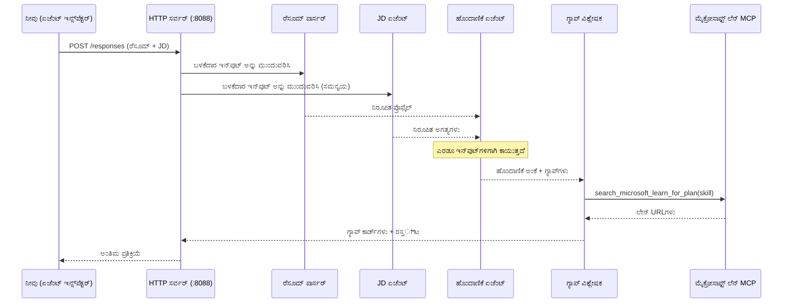
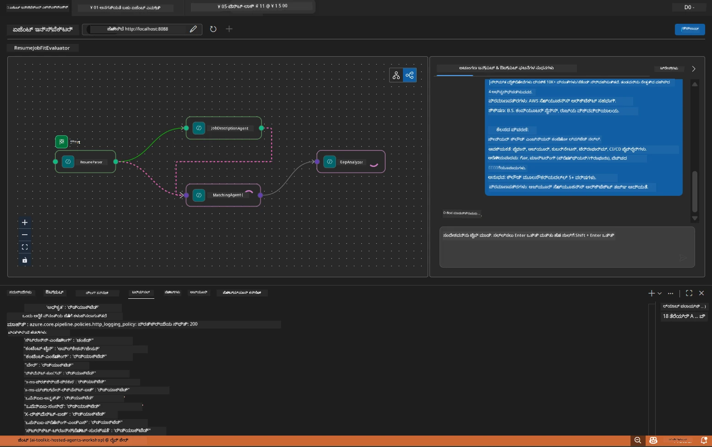

# Module 5 - ಸ್ಥಳೀಯವಾಗಿ ಪರೀಕ್ಷೆ ಮಾಡುವುದು (ಬಹು-ಏಜೆಂಟ್)

ಈ ಘಟಕದಲ್ಲಿ, ನೀವು ಬಹು-ಏಜೆಂಟ್ ವರ್ಕ್‌ಫ್ಲೋವನ್ನು ಸ್ಥಳೀಯವಾಗಿ ಚಾಲನೆ ಮಾಡುತ್ತೀರಿ, ಏಜೆಂಟ್ ಇನ್ಸ್‌ಪೆಕ್ಟರ್‌ನೊಂದಿಗೆ ಪರೀಕ್ಷೆ ಮಾಡುತ್ತೀರಿ ಮತ್ತು Foundryಗೆ ನಿಯೋಜಿಸುವ ಮುನ್ನ ನಾಲ್ಕು ಏಜೆಂಟ್‌ಗಳು ಮತ್ತು MCP ಸಾಧನ ಸರಿಯಾಗಿ ಕೆಲಸ ಮಾಡುತ್ತಿವೆಯೇ ಎಂದು ಖಚಿತಪಡಿಸಿಕೊಳ್ಳುತ್ತೀರಿ.

### ಸ್ಥಳೀಯ ಪರೀಕ್ಷಾ ಚಾಲನೆಯ ಸಂದರ್ಭದಲ್ಲಿ ಏನು ಆಗುತ್ತದೆ


---

## ಹಂತ 1: ಏಜೆಂಟ್ ಸರ್ವರ್ ಪ್ರಾರಂಭಿಸಿ

### ಆಯ್ಕೆ A: VS ಕೋಡ್ ಟಾಸ್ಕ್ ಬಳಸಿ (ಶಿಫಾರಸು ಮಾಡಲ್ಪಟ್ಟದ್ದು)

1. `Ctrl+Shift+P` ಒತ್ತಿ → **Tasks: Run Task** ಟೈಪ್ ಮಾಡಿ → **Run Lab02 HTTP Server** ಆಯ್ಕೆಮಾಡಿ.
2. ಟಾಸ್ಕ್ ಡಿಬಗ್ಪೈ ಜೋಡಣೆಯೊಂದಿಗೆ ಪೋರ್ಟ್ `5679`ರ ಮೇಲೆ ಸರ್ವರ್ ಪ್ರಾರಂಭಿಸುತ್ತದೆ ಮತ್ತು ಏಜೆಂಟ್ ಗಾಗಿ `8088` ರಲ್ಲಿ.
3. ಹೀಗಿರುವ ಒputut ಕ್ಕೆ ಕಾಯಿರಿ:

```
INFO:resume-job-fit:Starting Resume -> Job Fit Evaluator HTTP server...
INFO:resume-job-fit:Server running on http://localhost:8088
```

### ಆಯ್ಕೆ B: ಟರ್ಮಿನಲ್ ಬಳಸಿ ಕೈಗೆ ಕೈ

```powershell
cd workshop\lab02-multi-agent\PersonalCareerCopilot
```

ವರ್ಚುವಲ್ ಪರಿಸರವನ್ನು ಸಕ್ರಿಯಗೊಳಿಸಿ:

**ಪವರ್‌ಶೆಲ್ (ವಿಂಡೋಸ್):**
```powershell
.\.venv\Scripts\Activate.ps1
```

**ಮ್ಯಾಕ್‌ಒಎಸ್/ಲಿನಕ್ಸ್:**
```bash
source .venv/bin/activate
```

ಸರ್ವರ್ ಪ್ರಾರಂಭಿಸಿ:

```powershell
python -m debugpy --listen 127.0.0.1:5679 -m agentdev run main.py --verbose --port 8088
```

### ಆಯ್ಕೆ C: F5 (ಡೀಬಗ್ ಮೋಡ್) ಬಳಸಿ

1. `F5` ಒತ್ತಿ ಅಥವಾ **Run and Debug** (`Ctrl+Shift+D`) ಗೆ ಹೋಗಿ.
2. ಡ್ರಾಪ್ಡೌನ್‌ನಿಂದ **Lab02 - Multi-Agent** ಪ್ರವರ್ತನೆ ಆಯ್ಕೆಮಾಡಿ.
3. ಸರ್ವರ್ ಪೂರ್ಣ ಬ್ರೇಕ್‌పಾಯಿಂಟ್ ಬೆಂಬಲದೊಂದಿಗೆ ಪ್ರಾರಂಭವಾಗುತ್ತದೆ.

> **ಟಿಪ್:** ಡೀಬಗ್ ಮೋಡ್ режим್ ನಿಮಗೆ `search_microsoft_learn_for_plan()` ಒಳಗೆ ಬ್ರೇಕ್‌ಪಾಯಿಂಟ್‌ಗಳನ್ನು ಹೊಂದಲು ಸಹಾಯ ಮಾಡುತ್ತದೆ MCP ಪ್ರತಿಕ್ರಿಯೆಗಳನ್ನು ಪರಿಶೀಲಿಸಲು, ಅಥವಾ ಏಜೆಂಟ್ ಸೂಚನಾ ಸ್ಟ್ರಿಂಗ್‌ಗಳೊಳಗೆ ಯಾವ ಏಜೆಂಟ್ ಏನು ಸ್ವೀಕರಿಸುತ್ತಿದ್ದಾನೋ ಪರಿಶೀಲಿಸಲು.

---

## ಹಂತ 2: ಏಜೆಂಟ್ ಇನ್ಸ್‌ಪೆಕ್ಟರ್ ತೆರೆಯಿರಿ

1. `Ctrl+Shift+P` ಒತ್ತಿ → **Foundry Toolkit: Open Agent Inspector** ಟೈಪ್ ಮಾಡಿ.
2. ಏಜೆಂಟ್ ಇನ್ಸ್‌ಪೆಕ್ಟರ್ ಬ್ರೌಸರ್ ಟ್ಯಾಬ್‌ನಲ್ಲಿ `http://localhost:5679` ನಲ್ಲಿ ತೆರೆಯಲಾಗುತ್ತದೆ.
3. ಸಂದೇಶಗಳನ್ನು ಸ್ವೀಕರಿಸಲು ಏಜೆಂಟ್ ಮುಖಪುಟ ಸಿದ್ಧವಾಗಿದೆ ಎಂದು ಕಾಣಬೇಕು.

> **ನೋಟ್:** ಏಜೆಂಟ್ ಇನ್ಸ್‌ಪೆಕ್ಟರ್ ತೆರೆಯದಿದ್ದರೆ: ಸರ್ವರ್ ಪೂರ್ಣವಾಗಿ ಪ್ರಾರಂಭವಾದದ್ದೇನೋ ಖಚಿತಪಡಿಸಿಕೊಳ್ಳಿ (ನೀವು "Server running" ಲಾಗ್ ನೋಡುತ್ತೀರಿ). ಪೋರ್ಟ್ 5679 ಬ್ಯುಸಿ ಇದ್ದರೆ, [Module 8 - Troubleshooting](08-troubleshooting.md) ನೋಡಿ.

---

## ಹಂತ 3: ಸ್ಮೋಕ್ ಪರೀಕ್ಷೆಗಳನ್ನು ನಡೆಸಿ

ಈ तीन ಪರೀಕ್ಷೆಗಳನ್ನು ಅನುಕ್ರಮವಾಗಿ ನಡೆಸಿ. ಪ್ರತಿಯೊಂದು ಕಾರ್ಯಪ್ರವಾಹದ ಹೆಚ್ಚಿದ அணಿಭಾಗವನ್ನು ಪರೀಕ್ಷಿಸುತ್ತದೆ.

### ಪರೀಕ್ಷೆ 1: ಮೂಲ ರೆಸೂಮ್ + ಕೆಲಸ ವಿವರಣೆ

ಕೆಳಗಿನವನ್ನು ಏಜೆಂಟ್ ಇನ್ಸ್‌ಪೆಕ್ಟರ್‌ಗೆ ಪೇಸ್ಟ್ ಮಾಡಿ:

```
Resume:
Jane Doe
Senior Software Engineer with 5 years of experience in Python, Django, and AWS.
Built microservices handling 10K+ requests/second. Led a team of 4 developers.
Certifications: AWS Solutions Architect Associate.
Education: B.S. Computer Science, State University.

Job Description:
Senior Cloud Engineer at Contoso Ltd.
Required: Python, Azure, Kubernetes, Terraform, CI/CD pipelines.
Preferred: Go, monitoring (Prometheus/Grafana), cost optimization.
Experience: 5+ years in cloud infrastructure.
Certifications: Azure Solutions Architect Expert preferred.
```

**ನಿರೀಕ್ಷಿತ output ರಚನೆ:**

ಪ್ರತಿಕ್ರಿಯೆಯಲ್ಲಿ ನಾಲ್ಕು ಏಜೆಂಟ್‌ಗಳ ಎಲ್ಲ output ಕ್ರಮವಾಗಿ ಇರಬೇಕು:

1. **Resume Parser output** - ವರ್ಗೀಕೃತ ರಚನೆಯಂದು ಅಭ್ಯರ್ಥಿಯ ಪ್ರೊಫೈಲ್, ಕೌಶಲಗಳು ವರ್ಗೀಕೃತವಾಗಿವೆ
2. **JD Agent output** - ಬೇಡಿಕೆಯೊಂದಿಗೆ ಅವಶ್ಯಕ ಮತ್ತು ಇಷ್ಟಪೂರ್ವಕ ಕೌಶಲಗಳನ್ನು ವಿಭಜಿಸಿದ್ದಾಗಿರುವ ಪ್ರಸ್ತುತ REQUIREMENTS
3. **Matching Agent output** - ಫಿಟ್ ಸ್ಕೋರ್ (0-100) ಜೊತೆ ವಿಭಜನೆ, ಹೊಂದಿಕೆ ಕೌಶಲಗಳು, ಕೊರತೆಯ ಕೌಶಲಗಳು, ವಿರಾಮಗಳು
4. **Gap Analyzer output** - ಪ್ರತಿಯೊಂದು ಕೊರತೆಯ ಕೌಶಲೆಗೆ ವೈಯಕ್ತಿಕ గ್ಯాప్ ಕಾರ್ಡ್‌ಗಳು, microsoft ಲರ್ನ್ URLಗಳೊಂದಿಗೆ



### ಪರೀಕ್ಷೆ 1 ನಲ್ಲಿ ಪರಿಶೀಲಿಸಲು ಏನು

| ಪರಿಶೀಲನೆ | ನಿರೀಕ್ಷಿತ | ಪಾಸ್? |
|-------|----------|-------|
| ಪ್ರತಿಕ್ರಿಯೆಯಲ್ಲಿ ಫಿಟ್ ಸ್ಕೋರ್ ಇದೆ | 0-100 ನಡುವೆ ಸಂಖ್ಯೆ ವಿವರಣೆಯೊಂದಿಗೆ | |
| ಹೊಂದಿಕೆಯ ಕೌಶಲಗಳು ಪಟ್ಟಿಯಾಗಿವೆ | Python, CI/CD (ಅಂಚುನಡಿ), ಇತ್ಯಾದಿ | |
| ಕೊರತೆಯ ಕೌಶಲಗಳು ಪಟ್ಟಿಯಾಗಿವೆ | Azure, Kubernetes, Terraform, ಇತ್ಯಾದಿ | |
| ಪ್ರತಿಯೊಂದು ಕೊರತೆಯ ಕೈಗುಣಕ್ಕೆ Gap ಕಾರ್ಡ್ ಇದೆ | ಪ್ರತಿ ಕೌಶಲೆಗೆ ಒಂದು ಕಾರ್ಡ್ | |
| Microsoft Learn URLಗಳು ಇದ್ದವೆ | ನಿಜವಾದ `learn.microsoft.com` ಲಿಂಕ್‌ಗಳು | |
| ಪ್ರತಿಕ್ರಿಯೆಯಲ್ಲಿ ದೋಷ ಸಂದೇಶಗಳಿಲ್ಲ | ಶುದ್ಧ ಸವಿವರ output | |

### ಪರೀಕ್ಷೆ 2: MCP ಸಾಧನ ಕಾರ್ಯಾಚರಣೆ ಪರಿಶೀಲಿಸಿ

ಪರೀಕ್ಷೆ 1 ನಡೆದು ಮಾಡಿಯಲ್ಲಿ, **ಸರ್ವರ್ ಟರ್ಮಿನಲ್** ನಲ್ಲಿ MCP ಲಾಗ್ ಎಂಟ್ರಿಗಳನ್ನು ಪರಿಶೀಲಿಸಿ:

```
GET https://learn.microsoft.com/api/mcp → 405 (Method Not Allowed)
POST https://learn.microsoft.com/api/mcp → 200
DELETE https://learn.microsoft.com/api/mcp → 405 (Method Not Allowed)
```

| ಲಾಗ್ ಎಂಟ್ರಿ | ಅರ್ಥ | ನಿರೀಕ್ಷಿತವೇ? |
|-----------|---------|-----------|
| `GET ... → 405` | MCP ಕ್ಲೈಂಟ್ ಪ್ರಾರಂಭದಲ್ಲಿ GET ಬಳಸುವ ಪ್ರಯತ್ನ | ಹೌದು - ಸಾಮಾನ್ಯ |
| `POST ... → 200` | Microsoft Learn MCP ಸರ್ವರ್‌ಗೆ ನಿಜವಾದ ಸಾಧನ ಕರೆ | ಹೌದು - ಇದು ನಿಜವಾದ ಕರೆ |
| `DELETE ... → 405` | ಕೊನೆಗಾಣಿಕೆಗಾಗಿಯ DELETE ಪ್ರಯತ್ನ | ಹೌದು - ಸಾಮಾನ್ಯ |
| `POST ... → 4xx/5xx` | ಸಾಧನ ಕರೆ ವೈಫಲ್ಯ | ಇಲ್ಲ - [Troubleshooting](08-troubleshooting.md) ನೋಡಿ |

> **ಮುಖ್ಯಾಂಶ:** `GET 405` ಮತ್ತು `DELETE 405` ಸಾಲುಗಳು **ನಿರೀಕ್ಷಿತ ನಡೆ**. `POST` ಕರೆ non-200 ಸ್ಥಿತಿ ಕೋಡ್ ವಾಪಸು ನೀಡಿದರೆ ಮಾತ್ರ ಕಾಳಜಿ ವಹಿಸಿ.

### ಪರೀಕ್ಷೆ 3: ವಿವಿಧ-ಕೇಸು - ಹೈ-ಫಿಟ್ ಅಭ್ಯರ್ಥಿ

JD ಗೆ ಸಮೀಪವಾದ ರೆಸ್ಯೂಮ್ ಹಾಕಿ GapAnalyzer ಹೈ-ಫಿಟ್ ಸಂದರ್ಭಗಳನ್ನು ಕ್ವಹಿಸುವಿಕೆ ಪರೀಕ್ಷಿಸಿ:

```
Resume:
Alex Chen
Senior Cloud Engineer with 7 years of experience.
Skills: Python, Azure (AKS, Functions, DevOps), Kubernetes, Terraform, CI/CD (GitHub Actions, Azure Pipelines), Go, Prometheus, Grafana, cost optimization.
Certifications: Azure Solutions Architect Expert, Azure DevOps Engineer Expert.
Led infrastructure migration to Azure for 3 enterprise clients.
Education: M.S. Computer Science, Tech University.

Job Description:
Senior Cloud Engineer at Contoso Ltd.
Required: Python, Azure, Kubernetes, Terraform, CI/CD pipelines.
Preferred: Go, monitoring (Prometheus/Grafana), cost optimization.
Experience: 5+ years in cloud infrastructure.
Certifications: Azure Solutions Architect Expert preferred.
```

**ನಿರೀಕ್ಷಿತ ನಡೆ:**
- ಫಿಟ್ ಸ್ಕೋರ್ **80+** ಆಗಿರಬೇಕು (ಬಹುತೇಕ ಕೌಶಲಗಳು ಹೊಂದಿಕೆಯಾಗುತ್ತವೆ)
- Gap ಕಾರ್ಡ್‌ಗಳು ಮೂಲ ಕಲಿಕೆಗೆ ಬದಲಾಗಿ ಪೋಷಣೆ/ಸಾಕ್ಷಾತ್ಕಾರ ಸಿದ್ಧತೆಗೆ ಕೇಂದ್ರಿತವಾಗಿರಬೇಕು
- GapAnalyzer ಸೂಚನೆಗಳು ಹೇಳುತ್ತವೆ: "ಫಿಟ್ ≥ 80 ಆದಾಗ, ಪೋಷಣೆ/ಸಾಕ್ಷಾತ್ಕಾರ ಸಿದ್ಧತೆಗೆ ಕೇಂದ್ರೀಕರಿಸಿ"

---

## ಹಂತ 4: output ಪೂರ್ಣತೆಯನ್ನು ಪರಿಶೀಲಿಸಿ

ಪರೀಕ್ಷೆ ಮುಗಿಸಿದ ಮೇಲೆ, ಕೆಳಗಿನ ಮಾನದಂಡಗಳನ್ನು ಪರಿಶೀಲಿಸಿ:

### output ರಚನೆ ಪರಿಶೀಲನಾ ಹಾಳೆ

| ವಿಭಾಗ | ಏಜೆಂಟ್ | ಲಭ್ಯವಿದೆಯೇ? |
|---------|-------|----------|
| ಅಭ್ಯರ್ಥಿ ಪ್ರೊಫೈಲ್ | Resume Parser | |
| ತಾಂತ್ರಿಕ ಕೌಶಲಗಳು (ಕೂಟಗೊಳಿಸಲಾಗಿದೆ) | Resume Parser | |
| ಪಾತ್ರ ಸಮೀಕ್ಷೆ | JD Agent | |
| ಅವಶ್ಯಕ ಮತ್ತು ಇಷ್ಟಪೂರ್ವಕ ಕೌಶಲಗಳು | JD Agent | |
| ಫಿಟ್ ಸ್ಕೋರ್ ವಿವರಣೆ ಸಹಿತ | Matching Agent | |
| ಹೊಂದಿಕೆ / ಕೊರತೆ / ಅಂಚುನಡಿ ಕೌಶಲಗಳು | Matching Agent | |
| ಪ್ರತಿಯೊಂದು ಕೊರತೆಗೆ Gap ಕಾರ్డ్ | Gap Analyzer | |
| ಗ್ಯಾಪ್ ಕಾರ್ಡ್‌ಗಳಲ್ಲಿ Microsoft Learn URLಗಳು | Gap Analyzer (MCP) | |
| ಕಲಿಕೆಯ ಕ್ರಮ (ಸಂಖ್ಯೆಯಾಗಿ) | Gap Analyzer | |
| ಸಮಯರೇಖೆ ಸಾರಾಂಶ | Gap Analyzer | |

### ಈ ಹಂತದಲ್ಲಿ ಸಾಮಾನ್ಯ ಸಮಸ್ಯೆಗಳು

| ಸಮಸ್ಯೆ | ಕಾರಣ | ಪರಿಹಾರ |
|-------|-------|-----|
| ಕೇವಲ 1 Gap ಕಾರ್ಡ್ (ಇತರವು ಛಿದ್ದವಾಗಿವೆ) | GapAnalyzer ಸೂಚನೆ CRITICAL ಬ್ಲಾಕ್ ಇಲ್ಲ | `GAP_ANALYZER_INSTRUCTIONS` ಗೆ `CRITICAL:` ಪ್ಯಾರಾಗ್ರಾಫ್ ಸೇರಿಸಿ - ನೋಡಿರಿ [Module 3](03-configure-agents.md) |
| Microsoft Learn URLಗಳು ಇಲ್ಲ | MCP endpoint ಲಭ್ಯವಿಲ್ಲ | ಇಂಟರ್‌ನೆಟ್ ಸಂಪರ್ಕ ಪರಿಶೀಲಿಸಿ. `.env` ನಲ್ಲಿ `MICROSOFT_LEARN_MCP_ENDPOINT=https://learn.microsoft.com/api/mcp` ಆಗಿದ್ದು ಖಚಿತಪಡಿಸಿ |
| ಖಾಲಿ ಪ್ರತಿಕ್ರಿಯೆ | `PROJECT_ENDPOINT` ಅಥವಾ `MODEL_DEPLOYMENT_NAME` ಸೆಟ್ ಆಗಿಲ್ಲ | `.env` ಫೈಲ್ ಮೌಲ್ಯಗಳು ಪರಿಶೀಲಿಸಿ. ಟರ್ಮಿನಲ್‌ನಲ್ಲಿ `echo $env:PROJECT_ENDPOINT` ರನ್ ಮಾಡಿ |
| ಫಿಟ್ ಸ್ಕೋರ್ 0 ಅಥವಾ ಇಲ್ಲ | MatchingAgent ಗೆ ಮೇಲ್ಮೈಯ ಡೇಟಾ ಬಾರದಿರುವುದು | `create_workflow()` ನಲ್ಲಿ `add_edge(resume_parser, matching_agent)` ಮತ್ತು `add_edge(jd_agent, matching_agent)` ಇದ್ದುದೇ ಎಂದು ಪರಿಶೀಲಿಸಿ |
| ಏಜೆಂಟ್ ಪ್ರಾರಂಭವಾಗಿ ತಕ್ಷಣ ನಿಲ್ಲುವುದು | ಆಮದು ದೋಷ ಅಥವಾ ಅವಶ್ಯಕತೆ ಇಲ್ಲ | ಮತ್ತೆ `pip install -r requirements.txt` ರನ್ ಮಾಡಿ. ಟರ್ಮಿನಲ್ ಸ್ಟಾಕ್‌ಟ್ರೇಸ್ ಪರಿಶೀಲಿಸಿ |
| `validate_configuration` ದೋಷ | ಎನ್‌ವಿ ಚರಗಳು ಇಲ್ಲ | `.env` ನಿರ್ಮಿಸಿ `PROJECT_ENDPOINT=<your-endpoint>` ಮತ್ತು `MODEL_DEPLOYMENT_NAME=<your-model>` ಜೊತೆಗೆ |

---

## ಹಂತ 5: ನಿಮ್ಮದೇ ಡೇಟಾ ಬಳಸಿ ಪರೀಕ್ಷಿಸಿ (ಐಚ್ಛಿಕ)

ನಿಮ್ಮದೇ ರೆಸ್ಯೂಮ್ ಮತ್ತು ನಿಜವಾದ ಕೆಲಸ ವಿವರಣೆಗಳನ್ನು ಪೇಸ್ಟ್ ಮಾಡಿ ಪ್ರಯತ್ನಿಸಿ. ಇದು ಖಚಿತಪಡಿಸುವಲ್ಲಿ ಸಹಾಯ ಮಾಡುತ್ತದೆ:

- ಏಜೆಂಟ್‌ಗಳು ವಿಭಿನ್ನ ರೆಸ್ಯೂಮ್ ಫಾರ್ಮ್ಯಾಟ್ (ಕ್ರಮಬದ್ಧ, ಕಾರ್ಯೋಚಿತ, ಸಂಯೋಜಿತ)ಗಳನ್ನು ನಿಭಾಯಿಸುತ್ತವೆ
- JD ಏಜೆಂಟ್ ವಿವಿಧ JD ಶೈಲಿಗಳು (ಬುಲೆಟ್ ಪಾಯಿಂಟ್‌ಗಳು, ಪ್ಯಾರಾಗ್ರಾಫ್‌ಗಳು, ರಚನಾತ್ಮಕ) ನಿಭಾಯಿಸುತ್ತದೆ
- MCP ಸಾಧನ ನಿಜವಾದ ಕೌಶಲಗಳಿಗೆ ಸಂಬಂಧಿತ ಸಂಪನ್ಮೂಲಗಳನ್ನು ನೀಡುತ್ತದೆ
- Gap ಕಾರ್ಡ್‌ಗಳು ನಿಮ್ಮ ವಿಶೇಷ ಹಿನ್ನೆಲೆಗೆ ವೈಯಕ್ತಿಕೃತವಾಗಿವೆ

> **ಗೌಪ್ಯತಾ ಟಿಪ್ಪಣಿ:** ಸ್ಥಳೀಯ ಪರೀಕ್ಷೆಯಲ್ಲಿ ನಿಮ್ಮ ಡೇಟಾ ನಿಮ್ಮ ಯಂತ್ರದಲ್ಲಿ ಉಳಿದಿರುತ್ತದೆ ಮತ್ತು ನಿಮ್ಮ ಅಝುರ್ ಓಪನ್‌ಎಐ ನಿಯೋಜನೆಗೆ ಮಾತ್ರ ಕಳುಹಿಸಲಾಗುತ್ತದೆ. ಕಾರ್ಯಾಗಾರ ಮೂಲಸೌಕರ್ಯದಿಂದ ಲಾಗ್ ಅಥವಾ ಸಂಗ್ರಹಣೆಯಾಗುವುದಿಲ್ಲ. ನೀವು ಇಚ್ಛಿಸಿದರೆ Placeholder ಹೆಸರುಗಳನ್ನು ಬಳಸಬಹುದು (ಉದಾ. ನಿಮ್ಮ ನಿಜ ಹೆಸರು ಬದಲು "Jane Doe").

---

### ಚೆಕ್‌ಪಾಯಿಂಟ್

- [ ] ಪೋರ್ಟ್ `8088` ನಲ್ಲಿ ಸರ್ವರ್ ಯಶಸ್ವಿಯಾಗಿ ಪ್ರಾರಂಭವಾಯಿತು ("Server running" ಲಾಗ್ ತೋರಿಸುತ್ತದೆ)
- [ ] ಏಜೆಂಟ್ ಇನ್ಸ್‌ಪೆಕ್ಟರ್ ತೆರೆಯಲಾಗಿದೆ ಮತ್ತು ಏಜೆಂಟ್‌ಗೆ ಸಂಪರ್ಕವಿದೆ
- [ ] ಪರೀಕ್ಷೆ 1: ಫಿಟ್ ಸ್ಕೋರ್, ಹೊಂದಿಕೆ/ಕೊರತೆಯ ಕೌಶಲಗಳು, Gap ಕಾರ್ಡ್‌ಗಳು ಮತ್ತು Microsoft Learn URLಗಳೊಂದಿಗೆ ಸಂಪೂರ್ಣ ಪ್ರತಿಕ್ರಿಯೆ
- [ ] ಪರೀಕ್ಷೆ 2: MCP ಲಾಗ್‌ಗಳಲ್ಲಿ `POST ... → 200` ಕಂಡುಬರುತ್ತಿದೆ (ಸಾಧನ ಕರೆ ಯಶಸ್ವಿ)
- [ ] ಪರೀಕ್ಷೆ 3: ಹೈ-ಫಿಟ್ ಅಭ್ಯರ್ಥಿಗೆ 80+ ಸ್ಕೋರ್ ಮತ್ತು ಪೋಷಣೆ-ಕೇಂದ್ರೀತ ಶಿಫಾರಸುಗಳು
- [ ] ಎಲ್ಲಾ Gap ಕಾರ್ಡ್‌ಗಳು ಲಭ್ಯವಿವೆ (ಪ್ರತಿ ಕೊರತೆಯ ಕೌಶಲೆಗೆ ಒಂದು ಕಾರ್ಡ್, ನಿರಂತರ ಕಡಿತವಿಲ್ಲ)
- [ ] ಸರ್ವರ್ ಟರ್ಮಿನಲ್‌ನಲ್ಲಿ ದೋಷಗಳು ಅಥವಾ ಸ್ಟಾಕ್‌ಟ್ರೇಸ್‌ಗಳಿಲ್ಲ

---

**ಹಿಂದಿನ:** [04 - Orchestration Patterns](04-orchestration-patterns.md) · **ಮುಂದಿನ:** [06 - Deploy to Foundry →](06-deploy-to-foundry.md)

---

<!-- CO-OP TRANSLATOR DISCLAIMER START -->
**ತಡಸಿ ಬೇಡಿಕೆ**:  
ಈドಾಕ್ಯುಮೆಂಟ್ ಅನ್ನು AI ಅನುವಾದ ಸೇವೆ [Co-op Translator](https://github.com/Azure/co-op-translator) ಬಳಸಿ ಅನುವಾದಿಸಲಾಗಿದೆ. ನಾವೆಲ್ಲ ಅನುಕೂಲತೆಗಾಗಿ ಪ್ರಯತ್ನಿಸುತ್ತಿದ್ದರೂ, ಸ್ವಯಂಚಾಲಿತ ಅನುವಾದಗಳಲ್ಲಿ ತಪ್ಪುಗಳು ಅಥವಾ ಅಸತ್ಯತೆಗಳು ಇರಬಹುದು ಎಂದು ದಯವಿಟ್ಟು ಗಮನಿಸಿ. ಮೂಲドಾಕ್ಯುಮೆಂಟ್ ಅದರ ಸ್ವರೂಪ ಭಾಷೆಯಲ್ಲಿರುವುದು ಅತ್ಯಂತ ಪ್ರಾಧಿಕಾರ ಪೂರಕ ಮೂಲವಾಗಿದೆ. ಮಹತ್ವದ ಮಾಹಿತಿಗಾಗಿ, ವೃತ್ತಿಪರ ಮಾನವ ಅನುವಾದವನ್ನು ಶಿಫಾರಸು ಮಾಡಲಾಗಿದೆ. ಈ ಅನುವಾದ ಬಳಕೆಯಿಂದ ಉಂಟಾಗುವ ಯಾವುದೇ ಅರ್ಥಮಾತೃತ್ತಿ ಅಥವಾ ತಪ್ಪಿನ ಜವಾಬ್ದಾರಿ ನಾವು ಹೊತ್ತುಕೊಳ್ಳುತ್ತಿಲ್ಲ.
<!-- CO-OP TRANSLATOR DISCLAIMER END -->