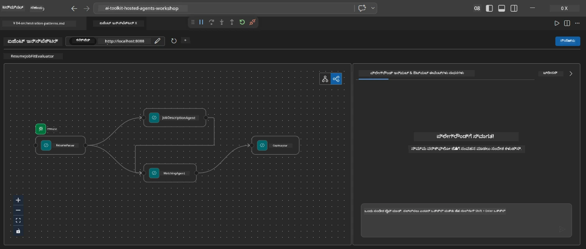
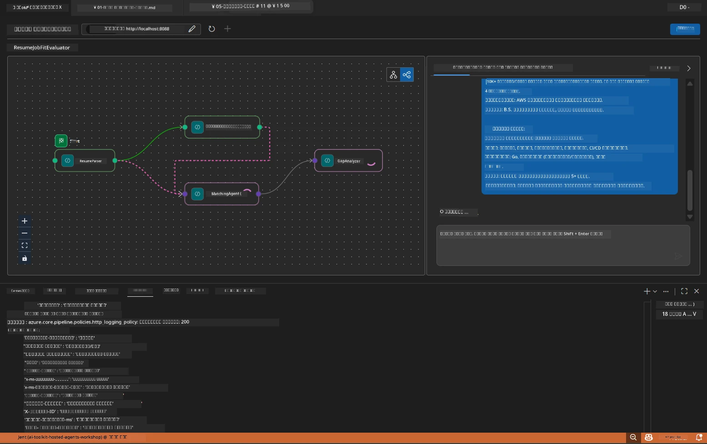
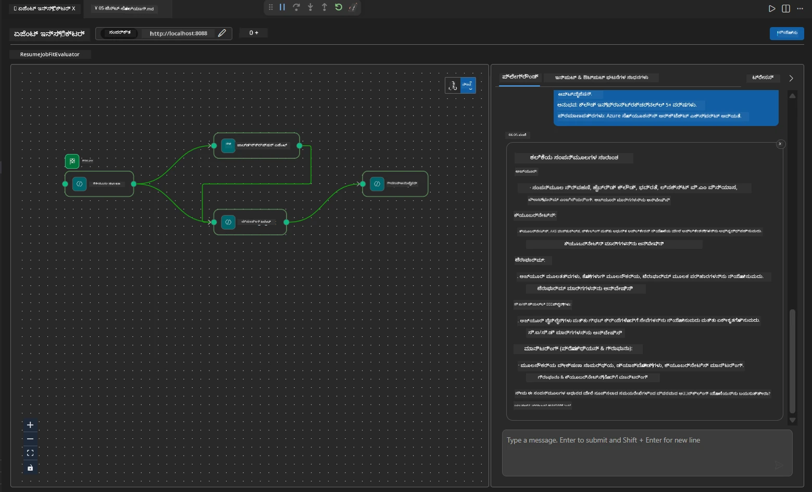

# ಭಾಗ 5 - ಸ್ಥಳೀಯವಾಗಿ ಪ್ರಯೋಗಿಸು

⏱️ ~15 ನಿಮಿಷ

ಈ ಭಾಗದಲ್ಲಿ, ನೀವು ಬಹು-ಏಜೆಂಟ್ ಕಾರ್ಯವಿಧಾನವನ್ನು ಸ್ಥಳೀಯವಾಗಿ ರನ್ ಮಾಡುತ್ತೀರಿ, Agent Inspector ನೊಂದಿಗೆ ಪರೀಕ್ಷಿಸಿ, ಮತ್ತು ಎಲ್ಲಾ ನಾಲ್ಕು ಏಜೆಂಟ್‌ಗಳು ಮತ್ತು MCP ಉಪಕರಣ ಸರಿಯಾಗಿ ಕಾರ್ಯನಿರ್ವಹಿಸುತ್ತವೆ ಎಂಬುದನ್ನ ಪರಿಶೀಲಿಸಿ ಮರುಬಳಕೆಗೂ ಮುನ್ನ.

---

## ಹಂತ 1: ಏಜೆಂಟ್ ಸರ್ವರ್ ಪ್ರಾರಂಭಿಸಿ

### ಆಯ್ಕೆ A: VS ಕೋಡ್ ಟಾಸ್ಕ್ ಬಳಸಿ (ಶಿಫಾರಸುಮಾಡಲಾಗಿದೆ)

1. `workshop/lab02-multi-agent/PersonalCareerCopilot/` ಅನ್ನು ನಿಮ್ಮ VS Code ಫೋಲ್ಡರ್ ಆಗಿ ತೆರೆಯಿರಿ.
2. `Ctrl+Shift+P` ಒತ್ತಿರಿ → **Tasks: Run Task** ಎಂದು ಟೈಪ್ ಮಾಡಿ → **Run Agent HTTP Server** ಆಯ್ಕೆಮಾಡಿ.
3. ಟಾಸ್ಕ್ ಡಿಬಗ್ಗಿಂಗ್ ಸಾಮರ್ಥ್ಯ ಹೊಂದಿರುವ debugpy ಅನ್ನು `5679` ಪೋರ್ಟ್‌ನಲ್ಲಿ ಮತ್ತು ಏಜೆಂಟ್ ಅನ್ನು `8088` ಪೋರ್ಟ್‌ನಲ್ಲಿ ಜೊತೆಯಾಗಿ ಸರ್ವರ್ ಪ್ರಾರಂಭಿಸುತ್ತದೆ.
4. ಔಟ್‌ಪುಟ್ ಈ ರೀತಿ ಕಾಣಲು ಕಾಯಿರಿ:

```
INFO:resume-job-fit:Starting Resume -> Job Fit Evaluator HTTP server...
INFO:resume-job-fit:Server running on http://localhost:8088
```

### ಆಯ್ಕೆ B: F5 (ಡೀಬಗ್ ಮೋಡ್) ಬಳಸಿ

1. `F5` ಒತ್ತಿ → **Debug Local Agent HTTP Server** ಆಯ್ಕೆಮಾಡಿ.
2. ಸರ್ವರ್ ಪೂರ್ಣ ಬ್ರೇಕ್‌ಪಾಯಿಂಟ್ ಬೆಂಬಲವುಳ್ಳಂತೆ ಪ್ರಾರಂಭವಾಗುತ್ತದೆ - ಇದು MCP ಪ್ರತಿಕ್ರಿಯೆಗಳು ಅಥವಾ ಏಜೆಂಟ್ ಔಟ್‌ಪುಟ್‌ಗಳನ್ನು ಪರಿಶೀಲಿಸಲು ಉಪಯುಕ್ತ.

---

## ಹಂತ 2: ಏಜೆಂಟ್ ಇನ್ಸ್‌ಪೆಕ್ಟರ್ ತೆರೆಯಿರಿ

1. `Ctrl+Shift+P` ಒತ್ತಿ → **Foundry Toolkit: Open Agent Inspector** ಎಂದು ಟೈಪ್ ಮಾಡಿ.
2. Agent Inspector VS Code ಪ್ಯಾನೆಲ್ ಆಗಿ ತೆರೆಯುತ್ತದೆ ಮತ್ತು `http://localhost:8088` ಗೆ ಸಂಪರ್ಕ ಹೊಂದಿದೆ.
3. ಸೂಚನೆಗಳನ್ನು ಸ್ವೀಕರಿಸಲು ಏಜೆಂಟ್ ಇಂಟರ್ಫೇಸಿನ ತಯಾರಿ ಕಾಣಿಸಿಕೊಳ್ಳಬೇಕು.



> **Agent Inspector ತೆರೆಯದಿದ್ದರೆ:** ಸರ್ವರ್ ಸಂಪೂರ್ಣವಾಗಿ ಪ್ರಾರಂಭವಾಗಿದೆ ಎಂದು ಖಾತ್ರಿಪಡಿಸಿಕೊಳ್ಳಿ ("Server running" ಲಾಗ್ ಕಾಣಿಸುತ್ತದೆ). ಪೋರ್ಟ್ 5679 ಬ್ಯುಯಿಯಿದ್ದರೆ, [ಭಾಗ 8 - ಸಮಸ್ಯೆಗಳು ಪರಿಹಾರ](08-troubleshooting.md) ನೋಡಿರಿ.

---

## ಹಂತ 2b: (ಐಚ್ಛಿಕ) ವರ್ಕ್‌ಫ್ಲೋ ದೃಶ್ಯಕ (Visualizer) ತೆರೆಯಿರಿ

Foundry Toolkit ನಲ್ಲಿದೆ ನೇರಕಾಲದ **Workflow Visualizer** ಇದು ಏಜೆಂಟ್‌ಗಳು ಹೇಗೆ ಪರಸ್ಪರ ಸಂವಹನ ನಡೆಸುತ್ತವೆ ಎಂಬುದನ್ನು ಗ್ರಾಫ್ ನಡವಳಿಕೆಯಂತೆ ತೋರಿಸುತ್ತದೆ. ಇದು ಬಹು-ಏಜೆಂಟ್ ಡೀಬಗ್‌ಗಾಗಿ ವಿಶೇಷವಾಗಿ ಉಪಯುಕ್ತ.

1. `Ctrl+Shift+P` ಒತ್ತಿ → **Foundry Toolkit: Open Visualizer for Hosted Agents** ಎಂದು ಟೈಪ್ ಮಾಡಿ.
2. ಹೊಸ VS Code ಟ್ಯಾಬ್ ತೆರೆಯುತ್ತದೆ ಇದು ನೇರ ಕಾರ್ಯನಿರ್ವಹಣಾ ಗ್ರಾಫ್ ತೋರಿಸುತ್ತದೆ.
3. ನೀವು Agent Inspector ನಲ್ಲಿ ಸಂದೇಶಗಳನ್ನು ಕಳುಹಿಸುವಂತೆ, ವೀಕ್ಷಕ ಸ್ವಯಂಚಾಲಿತವಾಗಿ ನವೀಕರಿಸುತ್ತದೆ - ಹಸಿರು ನೋಡ್‌ಗಳು ಪೂರ್ಣಗೊಂಡ ಏಜೆಂಟ್‌ಗಳನ್ನು ಸೂಚಿಸುತ್ತವೆ ಮತ್ತು ಅಲೆಯುವ ಎಡ್ಜ್‌ಗಳು ಡೇಟಾ ಹರಿವು ತೋರಿಸುತ್ತವೆ.

> **ಪೋರ್ಟ್ ಸಂಕುರ್ಷ:** ವೀಕ್ಷಕದ ಪೋರ್ಟ್ ಬಳಸಲಾಗುತ್ತಿರುವುದಾದರೆ, ಅದನ್ನು VS Code ಸೆಟ್ಟಿಂಗ್ಸ್ → **Extensions** → **Microsoft Foundry Configuration** → **Hosted Agents: Visualizer Port** ನಲ್ಲಿ ಬದಲಾಯಿಸಿ.

---

## ಹಂತ 3: ಸ್ಮೋಕ್ ಟೆಸ್ಟ್‌ಗಳು ಚಾಲನೆ ಮಾಡಿ

ಈ ಮೂರು ಪರೀಕ್ಷೆಗಳನ್ನು ಕ್ರಮವಾಗಿ ರನ್ ಮಾಡಿರಿ. ಪ್ರತಿ ಪರೀಕ್ಷೆ ಕಾರ್ಯವಿಧಾನದ ಹೆಚ್ಚಿನ ಭಾಗವನ್ನು ಪರೀಕ್ಷಿಸುತ್ತದೆ.

### ಪರೀಕ್ಷೆ 1: ಮೂಲ ರಿಜ್ಯೂಮ್ + ಉದ್ಯೋಗ ವಿವರಣೆ

ಕೆಳಗಿನವುಗಳನ್ನು Agent Inspector ಗೆ ಅಂಟಿಸಿರಿ:

```
Resume:
Jane Doe
Senior Software Engineer with 5 years of experience in Python, Django, and AWS.
Built microservices handling 10K+ requests/second. Led a team of 4 developers.
Certifications: AWS Solutions Architect Associate.
Education: B.S. Computer Science, State University.

Job Description:
Senior Cloud Engineer at Contoso Ltd.
Required: Python, Azure, Kubernetes, Terraform, CI/CD pipelines.
Preferred: Go, monitoring (Prometheus/Grafana), cost optimization.
Experience: 5+ years in cloud infrastructure.
Certifications: Azure Solutions Architect Expert preferred.
```

**ನಿರೀಕ್ಷಿಸಲಾದ ಔಟ್‌ಪುಟ್ ರಚನೆ:**

ಪ್ರತಿಕ್ರಿಯೆಯಲ್ಲಿ ಎಲ್ಲಾ ನಾಲ್ಕು ಏಜೆಂಟ್‌ಗಳಿಂದ ಕ್ರಮವಾಗಿ ಔಟ್‌ಪುಟ್ ಅನಿವಾರ್ಯ:

1. **Resume Parser ಔಟ್‌ಪುಟ್** - ಎರಡು ಲೇಬಲ್ ಮಾಡಲಾದ ವಿಭಾಗಗಳು: `[PARSED RESUME]` (ಅರ್ಹತೆಯ ಪ್ರೊಫೈಲ್ ಮತ್ತು ಗುಂಪು ಕಲಿಕೆಗಳು) ಮತ್ತು `[JOB DESCRIPTION PASS-THROUGH]` (ನಕಲಿಸಿದ JD ಪಠ್ಯ, JD ಏಜೆಂಟ್‌ಗೆ ನೀಡುವದು)
2. **JD ಏಜೆಂಟ್ ಔಟ್‌ಪುಟ್** - ಅಗತ್ಯ ಮತ್ತು ಇಚ್ಛಿತ ಕೌಶಲಗಳು ಬೇರ್ಪಡಿಸಿದ ರಚಿಸಲಾದ ಅವಶ್ಯಕತೆಗಳು
3. **ಮ್ಯಾಚಿಂಗ್ ಏಜೆಂಟ್ ಔಟ್‌ಪುಟ್** - ಫಿಟ್ ಸ್ಕೋರ್ (0-100), ವಿವರಗಳು, ಹೊಂದಿದ ಕೌಶಲಗಳು, ಕಾಣದ ಕೌಶಲಗಳು, ಗ್ಯಾಪ್‌ಗಳು
4. **ಗ್ಯಾಪ್ ಅನಾಲೈಸರ್ ಔಟ್‌ಪುಟ್** - ಪ್ರತಿ ಕಾಣದ ಕೌಶಲಕ್ಕೆ ವೈಯಕ್ತಿಕ ಗ್ಯಾಪ್ ಕಾರ್ಡ್‌ಗಳು, ಪ್ರತಿಯೊಂದಕ್ಕೂ Microsoft Learn URL ಗಳು





### ಪರೀಕ್ಷೆ 1 ನಲ್ಲಿ ಪರಿಶೀಲಿಸುವುದೇನು

| ಪರಿಶೀಲನೆ | ನಿರೀಕ್ಷಿತ | ಪಾಸ್? |
|-------|----------|-------|
| ಪ್ರತಿಕ್ರಿಯೆಯಲ್ಲಿ ಫಿಟ್ ಸ್ಕೋರ್ ಇದೆ | 0-100 ಸಂಖ್ಯೆಯೊಂದಿಗೆ ವಿವರ | |
| ಹೊಂದಿದ ಕೌಶಲಗಳು ಪಟ್ಟಿ ಆಗಿವೆ | Python, CI/CD (ಪಾರ್ಶ್ವಿಕ), ಇತ್ಯಾದಿ | |
| ಕಾಣದ ಕೌಶಲಗಳು ಪಟ್ಟಿ ಆಗಿವೆ | Azure, Kubernetes, Terraform, ಇತ್ಯಾದಿ | |
| ಪ್ರತಿಯೊಂದು ಕಾಣದ ಕೌಶಲಕ್ಕಾಗಿ ಗ್ಯಾಪ್ ಕಾರ್ಡ್‌ಗಳು ಇದ್ದಾರೆ | ಪ್ರತಿ ಕೌಶಲೆಗೆ ಒಂದು ಕಾರ್ಡ್ | |
| Microsoft Learn URL ಗಳು ಲಭ್ಯವಿವೆ | ನಿಜವಾದ `learn.microsoft.com` ಲಿಂಕ್ ಗಳು | |
| ಪ್ರತಿಕ್ರಿಯೆಯಲ್ಲಿ ಯಾವ ದೋಷ ಸಂದೇಶಗಳೂ ಇಲ್ಲ | ಸ್ವಚ್ಛ, ರಚಿಸಲಾದ ಔಟ್‌ಪುಟ್ | |

### ಪರೀಕ್ಷೆ 2: ತೀರಾವಣೆ ಪ್ರಕರಣ - ಹೆಚ್ಚಿನ ಫಿಟ್ ಅಭ್ಯರ್ಥಿ

JD ಗೆ ಹತ್ತಿರವಾಗಿ ಹೊಂದಿಕೆಯಾಗುವ ರಿಜ್ಯೂಮ್ ಅಂಟಿಸಿ ಗ್ಯಾಪ್ ಅನಾಲೈಸರ್ ಹೆಚ್ಚು ಫಿಟ್ ಪರಿಸ್ಥಿತಿಗಳನ್ನು ಹೇಗೆ ನಿಭಾಯಿಸುತ್ತದೆ ಎಂದು ಪರಿಶೀಲಿಸಿ:

```
Resume:
Alex Chen
Senior Cloud Engineer with 7 years of experience.
Skills: Python, Azure (AKS, Functions, DevOps), Kubernetes, Terraform, CI/CD (GitHub Actions, Azure Pipelines), Go, Prometheus, Grafana, cost optimization.
Certifications: Azure Solutions Architect Expert, Azure DevOps Engineer Expert.
Led infrastructure migration to Azure for 3 enterprise clients.
Education: M.S. Computer Science, Tech University.

Job Description:
Senior Cloud Engineer at Contoso Ltd.
Required: Python, Azure, Kubernetes, Terraform, CI/CD pipelines.
Preferred: Go, monitoring (Prometheus/Grafana), cost optimization.
Experience: 5+ years in cloud infrastructure.
Certifications: Azure Solutions Architect Expert preferred.
```

**ನಿರೀಕ್ಷಿಸಲಾದ ವರ್ತನೆ:**
- ಫಿಟ್ ಸ್ಕೋರ್ **80+** ಇರಬೇಕು (ಅಧಿಕಾಂಶ ಕೌಶಲಗಳು ಹೊಂದಿವೆ)
- ಗ್ಯಾಪ್ ಕಾರ್ಡ್‌ಗಳು ಮೂಲ ಕಲಿಕೆಕ್ಕಿಂತ ಹೆಚ್ಚಾಗಿ ಸಿನ್ನಾ/ಸಾಕ್ಷಾತ್ಕಾರ ಸಿದ್ದತೆಗೆ ಕೇಂದ್ರೀಕರಿಸಬೇಕು
- ಗ್ಯಾಪ್ ಅನಾಲೈಸರ್ ಸೂಚನೆ: "ಫಿಟ್ >= 80 ಇದ್ದರೆ, ಸಿನ್ನಾ/ಸಾಕ್ಷಾತ್ಕಾರ ಸಿದ್ಧತೆ ಮೇಲೆ ಕೇಂದ್ರೀಕರಿಸಿ"

---

## ಹಂತ 4: ನಿಮ್ಮದೇ ಡೇಟಾ ಬಳಸಿ ಪರೀಕ್ಷಿಸು (ಐಚ್ಛಿಕ)

ನಿಮ್ಮದೇ ರಿಜ್ಯೂಮ್ ಮತ್ತು ನಿಜವಾದ ಉದ್ಯೋಗ ವಿವರಣೆ ಅಂಟಿಸುವ ಪ್ರಯತ್ನ ಮಾಡಿ. ಇದು ಸಹಾಯ ಮಾಡುತ್ತದೆ ಪರಿಶೀಲಿಸಲು:

- ಏಜೆಂಟ್‌ಗಳು ವಿಭಿನ್ನ ರಿಜ್ಯೂಮ್ ಫಾರ್ಮ್ಯಾಟ್‌ಗಳನ್ನು ನಿಭಾಯಿಸುತ್ತವೆ (ಕ್ರಮಬಂಧಿತ, ಕಾರ್ಯದರ್ಶಿ, ಮಿಶ್ರ)
- JD ಏಜೆಂಟ್ ವಿವಿಧ JD ಶೈಲಿಗಳನ್ನು ನಿಭಾಯಿಸುತ್ತದೆ (ಬುಲೆಟ್ ಪಾಯಿಂಟ್‌ಗಳು, ಪ್ಯಾರಾಗ್ರಾಫ್‌ಗಳು, ರಚಿಸಲಾದವು)
- MCP ಉಪಕರಣವು ನಿಜವಾದ ಕೌಶಲಗಳಿಗೆ ಸಂಬಂಧಿಸಿದ ಸಂಪನ್ಮೂಲಗಳನ್ನು ನೀಡುತ್ತದೆ
- ಗ್ಯಾಪ್ ಕಾರ್ಡ್‌ಗಳು ನಿಮ್ಮ ವೈಯಕ್ತಿಕ ಹಿನ್ನೆಲೆನೊಂದಿಗೆ ವೈಯಕ್ತಿಕಗೊಳಿಸಲಾಗಿದೆ

> **ಗೌಪ್ಯತೆ - ಮಾರ್ಗ A (Foundry cloud):** ರಿಜ್ಯೂಮ್ ಮತ್ತು JD ಪಠ್ಯ ನಿಮ್ಮ Azure OpenAI ನಿಯೋಜನೆಗೆ ನಿರ್ವಹಣಾ ಕಾರ್ಯಕ್ಕಾಗಿ ಕಳುಹಿಸಲಾಗುತ್ತದೆ. ಕಾರ್ಯಾಗಾರ ಮೂಲಸೌಕರ್ಯದಿಂದ ಲಾಗ್ ಅಥವಾ ಸಂಗ್ರಹಣೆಯಾಗುವುದಿಲ್ಲ. ನೀವು ಬಯಸಿದರೆ ಸ್ಥಳಾಪಕ ಹೆಸರುಗಳನ್ನು (ಉದಾ., "Jane Doe") ಉಪಯೋಗಿಸಬಹುದು.
>
> **ಗೌಪ್ಯತೆ - ಮಾರ್ಗ B (Foundry Local):** ಎಲ್ಲಾ ನಾಲ್ಕು ಏಜೆಂಟ್ ನಿರ್ಣಯಗಳು ಸಂಪೂರ್ಣವಾಗಿ ನಿಮ್ಮ ಸಾಧನದಲ್ಲಿ ನಡೆಯುತ್ತವೆ. ನಿಮ್ಮ ರಿಜ್ಯೂಮ್ ಮತ್ತು ಉದ್ಯೋಗ ವಿವರಣೆ ಪಠ್ಯ **ಯಾವುದೇ ರೀತಿ ನಿಮ್ಮ ಯಂತ್ರದಿಂದ ಹೊರಗೆ ಹೋಗುವುದಿಲ್ಲ**. ಏಕಮಾತ್ರ ಹೊರಗಿನ ಕರೆ MCP ಉಪಕರಣದಿಂದ `https://learn.microsoft.com/api/mcp` ಗೆ ಸಂಪನ್ಮೂಲಗಳನ್ನು ಪಡೆಯಲು; ಆ ಕ್ವೆರಿ ಕೌಶಲ ಹೆಸರನ್ನು ಮಾತ್ರ ಹೊಂದಿರುತ್ತದೆ, ನಿಮ್ಮ ವೈಯಕ್ತಿಕ ಡೇಟಾಗಳನ್ನು ಅಲ್ಲ.

---

### ಚೆಕ್‌ಪಾಯಿಂಟ್

- [ ] ಸರ್ವರ್ ಯಶಸ್ವಿಯಾಗಿ `8088` ಪೋರ್ಟಿನಲ್ಲಿ ಪ್ರಾರಂಭಗೊಂಡಿದೆ ("Server running" ಲಾಗ್ ತೋರಿಸುತ್ತದೆ)
- [ ] Agent Inspector ತೆರೆಯಲಾಗಿದೆ ಮತ್ತು ಏಜೆಂಟ್ ಗೆ ಸಂಪರ್ಕಗೊಂಡಿದೆ
- [ ] ಪರೀಕ್ಷೆ 1: ಪೂರ್ಣ ಪ್ರತಿಕ್ರಿಯೆ ಫಿಟ್ ಸ್ಕೋರ್, ಹೊಂದಿದ/ಕಾಣದ ಕೌಶಲಗಳು, ಗ್ಯಾಪ್ ಕಾರ್ಡ್‌ಗಳು ಮತ್ತು Microsoft Learn URL ಗಳು
- [ ] ಪರೀಕ್ಷೆ 2: ಹೆಚ್ಚಿನ ಫಿಟ್ ಅಭ್ಯರ್ಥಿಗೆ 80+ ಸ್ಕೋರ್ ಮತ್ತು ಸಿನ್ನಾ-ಮೇಲ್ಹೋಗುವ ಶಿಫಾರಸುಗಳು
- [ ] ಎಲ್ಲಾ ಗ್ಯಾಪ್ ಕಾರ್ಡ್‌ಗಳು ಲಭ್ಯವಿವೆ (ಪ್ರತಿ ಕಾಣದ ಕೌಶಲೆಗೆ ಒಂದು, ಕಡಿತವಿಲ್ಲ)
- [ ] ಸರ್ವರ್ ಟರ್ಮಿನಲ್‌ನಲ್ಲಿ ಯಾವುದೇ ದೋಷಗಳು ಅಥವಾ ಸ್ಟ್ಯಾಂಕ್ ಟ್ರೇಸ್‌ಗಳು ಇಲ್ಲ

---

**ಹಿಂದಿನ:** [04 - Orchestration Patterns](04-orchestration-patterns.md) · **ಮುಂದಿನ:** [06 - Deploy to Foundry →](06-deploy-to-foundry.md)

---

<!-- CO-OP TRANSLATOR DISCLAIMER START -->
**ಅಸ್ವೀಕಾರ**:
ಈ ದಸ್ತಾವೇಜು AI ಅನುವಾದ ಸೇವೆ [Co-op Translator](https://github.com/Azure/co-op-translator) ಬಳಸಿ ಅನುವಾದಿಸಲಾಗಿದೆ. ನಾವು ನಿಖರತೆಯನ್ನು ಸಾಧಿಸಲು ಪ್ರಯತ್ನಿಸುತ್ತಿದ್ದರೂ, ದಯವಿಟ್ಟು ಗಮನಿಸಿ, ಸ್ವಯಂಚಾಲಿತ ಅನುವಾದಗಳಲ್ಲಿ ದೋಷಗಳು ಅಥವಾ ಅಸಡ್ಡೆಗಳು ಇರಬಹುದು. ಮೂಲ ಭಾಷೆಯಲ್ಲಿರುವ ಮೂಲ ದಸ್ತಾವೇಜು ಪ್ರಾಮಾಣಿಕ ಮೂಲವೆಂದು ಪರಿಗಣಿಸಬೇಕು. ಪ್ರಮುಖ ಮಾಹಿತಿಗಾಗಿ, ವೃತ್ತಿಪರ ಮಾನವ ಅನುವಾದವನ್ನು ಶಿಫಾರಸು ಮಾಡಲಾಗುತ್ತದೆ. ಈ ಅನುವಾದವನ್ನು ಬಳಸುವ ಮೂಲಕ ಉಂಟಾಗುವ ಯಾವುದೇ ತಪ್ಪು ಅರ್ಥಗಳ ಅಥವಾ ತಪ್ಪು ವ್ಯಾಖ್ಯಾನಗಳ ಬಗ್ಗೆ ನಾವು ಹೊಣೆಗಾರರಲ್ಲ.
<!-- CO-OP TRANSLATOR DISCLAIMER END -->