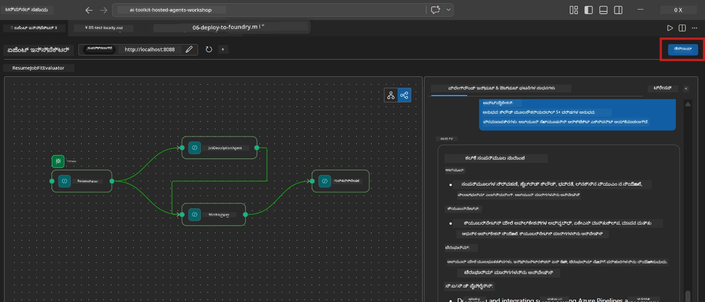
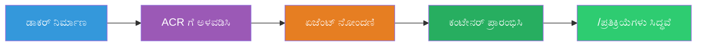
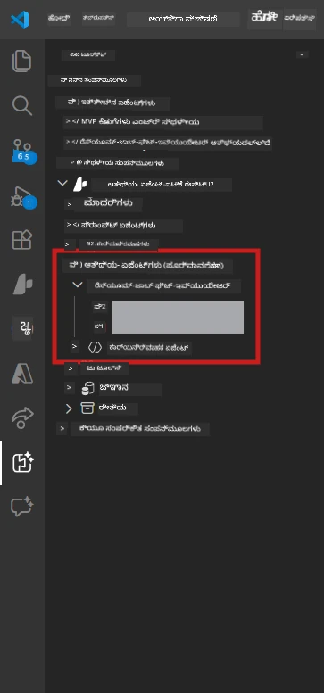

# Module 6 - Foundry ಏಜೆಂಟ್ ಸೇವೆಗೆ ನಿಯೋಜಿಸಿ

ಈ ಘಟಕದಲ್ಲಿ, ನೀವು ನಿಮ್ಮ ಸ್ಥಳೀಯವಾಗಿ ಪರೀಕ್ಷಿಸಲಾದ ಬಹು-ಏಜೆಂಟ್ ವರ್ಕ್‌ಫ್ಲೋವನ್ನು [Microsoft Foundry](https://learn.microsoft.com/azure/foundry/agents/concepts/hosted-agents) ನಲ್ಲಿ **ಅತಿಥಿ ಏಜೆಂಟ್** ಆಗಿ ನಿಯೋಜಿಸುತ್ತೀರಿ. ನಿಯೋಜನೆ ಪ್ರಕ್ರಿಯೆ ಡಾಕರ್ ಕಂಟೈನರ್ ಚಿತ್ರವನ್ನು ನಿರ್ಮಿಸಿ, ಅದನ್ನು [Azure Container Registry (ACR)](https://learn.microsoft.com/azure/container-registry/container-registry-intro) ಗೆ ತಳ್ಳುತ್ತದೆ ಮತ್ತು [Foundry Agent Service](https://learn.microsoft.com/azure/foundry/agents/how-to/publish-agent) ನಲ್ಲಿ ಅತಿಥಿ ಏಜೆಂಟ್ ಆವೃತ್ತಿಯನ್ನು ರಚಿಸುತ್ತದೆ.

> **ಲ್ಯಾಬ್ 01 ರ ಪ್ರಮುಖ ಭೇದ:** ನಿಯೋಜನೆ ಪ್ರಕ್ರಿಯೆ ಅದೇ ರೀತಿಯೇ ಇರುತ್ತದೆ. Foundry ನಿಮ್ಮ ಬಹು-ಏಜೆಂಟ್ ವರ್ಕ್‌ಫ್ಲೋವನ್ನು ಒಂದೇ ಅತಿಥಿ ಏಜೆಂಟ್ ಆಗಿ ಪರಿಗಣಿಸುತ್ತದೆ - ಸಂಕುಲತೆ ಕಂಟೈನರ್ ಒಳಗೆ ಇರುತ್ತದೆ, ಆದರೆ ನಿಯೋಜನೆಯ ಮೇಲ್ಮಟ್ಟವು ಒಂದೇ `/responses` ಅಂತ್ಯದೀಪವಾಗಿದೆ.

---

## ಪೂರ್ವಾಪೇಕ್ಷೆಗಳ ಪರಿಶೀಲನೆ

ನಿಯೋಜಿಸುವ ಮೊದಲು, ಕೆಳಗಿನ ಪ್ರತಿಯೊಂದನ್ನು ಪರಿಶೀಲಿಸಿ:

1. **ಏಜೆಂಟ್ ಸ್ಥಳೀಯ ಸ್ಮೋಕ್ ಪರೀಕ್ಷೆಗಳನ್ನು ಪಾಸ್ ಮಾಡಿದೆ:**
   - ನೀವು [Module 5](05-test-locally.md) ರಲ್ಲಿ ಎಲ್ಲಾ 3 ಪರೀಕ್ಷೆಗಳು ಪೂರ್ಣಗೊಳಿಸಿದ್ದು, ವರ್ಕ್‌ಫ್ಲೋ ಸಂಪೂರ್ಣ ಔಟ್‌‌ಪುಟ್ ಅನ್ನು ಗ್ಯಾಪ್ ಕಾರ್ಡ್‌ಗಳು ಮತ್ತು Microsoft Learn URLs ಜೊತೆಗೆ ಉತ್ಪಾದಿಸಿದೆ.

2. **ನೀವು [Azure AI User](https://learn.microsoft.com/azure/foundry/concepts/rbac-foundry) ಪಾತ್ರವನ್ನು ಹೊಂದಿದ್ದೀರಿ:**
   - [Lab 01, Module 2](../../lab01-single-agent/docs/02-create-foundry-project.md) ನಲ್ಲಿ ನಿಯೋಜಿಸಲಾಗಿದೆ. ಪರಿಶೀಲಿಸಿ:
   - [Azure Portal](https://portal.azure.com) → ನಿಮ್ಮ Foundry **ಪ್ರಾಜೆಕ್ಟ್** ಸಂಪನ್ಮೂಲ → **ಪ್ರವೇಶ ನಿಯಂತ್ರಣ (IAM)** → **ಪಾತ್ರ ನಿಯುಕ್ತಿಗಳು** → ನಿಮ್ಮ ಖಾತೆಗೆ **[Azure AI User](https://aka.ms/foundry-ext-project-role)** ಪಟ್ಟಿ ಇದೆ ಎಂದು ದೃಢೀಕರಿಸಿ.

3. **ನೀವು VS Code ನಲ್ಲಿ ಅಜೂರ್‌ಗೆ ಸೈನ್ ಇನ್ ಆಗಿದ್ದೀರಿ:**
   - VS Code ಕೆಳಭಾಗ-ಎಡಕೆರೆಯಲ್ಲಿನ ಖಾತೆಗಳ ಚಿಹ್ನೆ ಪರಿಶೀಲಿಸಿ. ನಿಮ್ಮ ಖಾತೆ ಹೆಸರನ್ನು ಕಾಣಿಸಿಕೊಳ್ಳುತ್ತದೆ.

4. **`agent.yaml` ನಲ್ಲಿ ಸರಿಯಾದ ಮೌಲ್ಯಗಳಿವೆ:**
   - `PersonalCareerCopilot/agent.yaml` ತೆರೆಯಿರಿ ಮತ್ತು ಪರಿಶೀಲಿಸಿ:  
     ```yaml
     environment_variables:
       - name: PROJECT_ENDPOINT
         value: ${PROJECT_ENDPOINT}
       - name: MODEL_DEPLOYMENT_NAME
         value: ${MODEL_DEPLOYMENT_NAME}
     ```
   - ಅವುಗಳು ನಿಮ್ಮ `main.py` ಓದುವ ಪರಿಸರಚರಿಕೆಗಳೊಂದಿಗೆ ಹೊಂದಿಕೊಳ್ಳಬೇಕು.

5. **`requirements.txt` ನಲ್ಲಿ ಸರಿಯಾದ ಆವೃತ್ತಿಗಳಿವೆ:**
   ```
   agent-framework-azure-ai==1.0.0rc3
   agent-framework-core==1.0.0rc3
   azure-ai-agentserver-agentframework==1.0.0b16
   azure-ai-agentserver-core==1.0.0b16
   debugpy
   agent-dev-cli --pre
   ```

---

## ಹಂತ 1: ನಿಯೋಜನೆ ಪ್ರಾರಂಭಿಸಿ

### ಆಯ್ಕೆಯ A: ಏಜೆಂಟ್ ಇನ್ಸ್‌ಪೆಕ್ಟರ್ ನಿಂದ ನಿಯೋಜಿಸಿ (ಶಿಫಾರಸುಮಾಡಲಾಗಿದೆ)

ನೀವು F5 ಮೂಲಕ ಏಜೆಂಟ್ ರನ್ ಮಾಡುತ್ತಿರುವಾಗ ಏಜೆಂಟ್ ಇನ್ಸ್‌ಪೆಕ್ಟರ್ open ಆದಾಗ:

1. ಏಜೆಂಟ್ ಇನ್ಸ್‌ಪೆಕ್ಟರ್ ಫಲಕದ **ಪajos-ಬಲಮೂಲೆ** ನೋಡಿ.
2. **Deploy** ಬಟನ್ (ಮೇಲೆ ಬಾಣದೊಂದಿಗೆ ಮೋಡ ಚಿಹ್ನೆ) ಕ್ಲಿಕ್ ಮಾಡಿ.
3. ನಿಯೋಜನೆ ವಿಜಾರ್ಡ್ ತೆರೆದೀತು.



### ಆಯ್ಕೆಯ B: ಕಮಾಂಡ್ ಪ್ಯಾಲೆಟ್ ನಿಂದ ನಿಯೋಜಿಸಿ

1. `Ctrl+Shift+P` ಒತ್ತಿ **Command Palette** ತೆರೆಯಿರಿ.
2. ಟೈಪ್ ಮಾಡಿ: **Microsoft Foundry: Deploy Hosted Agent** ಮತ್ತು ಆಯ್ಕೆಮಾಡಿ.
3. ನಿಯೋಜನೆ ವಿಜಾರ್ಡ್ ತೆರೆಯುತ್ತದೆ.

---

## ಹಂತ 2: ನಿಯೋಜನೆಯನ್ನು ಸಂರಚಿಸಿ

### 2.1 ಗುರಿ ಪ್ರಾಜೆಕ್ಟ್ ಆಯ್ಕೆಮಾಡಿ

1. ಡ್ರಾಪ್‌ಡೌನ್‌ನಲ್ಲಿ ನಿಮ್ಮ Foundry ಪ್ರಾಜೆಕ್ಟ್‌ಗಳು ಕಾಣಿಸುತ್ತದೆ.
2. ಕಾರ್ಯಾಗಾರದಲ್ಲಿ ಬಳಸಿದ ಪ್ರಾಜೆಕ್ಟನ್ನು (ಉದಾಹರಣೆಗೆ `workshop-agents`) ಆಯ್ಕೆಮಾಡಿ.

### 2.2 ಕಂಟೈನರ್ ಏಜೆಂಟ್ ಫೈಲ್ ಆಯ್ಕೆಮಾಡಿ

1. ಏಜೆಂಟ್ ಪ್ರವೇಶ ಬಿಂದುವನ್ನು ಆಯ್ಕೆ ಮಾಡಬೇಕೆಂದು ಕೇಳುತ್ತದೆ.
2. `workshop/lab02-multi-agent/PersonalCareerCopilot/` ಗೆ ಹೋಗಿ **`main.py`** ಅನ್ನು ಆರಿಸಿ.

### 2.3 ಸಂಪನ್ಮೂಲಗಳನ್ನು ಸಂರಚಿಸಿ

| ಸೆಟ್ಟಿಂಗ್ | ಶಿಫಾರಸು ಮಾಡಿದ ಮೌಲ್ಯ | ಟಿಪ್ಪಣಿಗಳು |
|---------|------------------|-------|
| **CPU** | `0.25` | ಡೀಫಾಲ್ಟ್. ಬಹು-ಏಜೆಂಟ್ ವರ್ಕ್‌ಫ್ಲೋಗಳು ಹೆಚ್ಚು CPU ಬೇಡಿಕೆ ಮಾಡುತ್ತಿಲ್ಲ ಏಕೆಂದರೆ ಮಾದರಿ ಕರೆಗಳು I/O-ಬೌಂಡ್ ಆಗಿವೆ |
| **ಮೆಮೊರಿ** | `0.5Gi` | ಡೀಫಾಲ್ಟ್. ದೊಡ್ಡ ಡೇಟಾ ಪ್ರಕ್ರಿಯೆ ಉಪಕರಣಗಳನ್ನು ಸೇರಿಸಿದರೆ `1Gi` ಗೆ ಹೆಚ್ಚಿಸಿರಿ |

---

## ಹಂತ 3: ದೃಢೀಕರಿಸಿ ಮತ್ತು ನಿಯೋಜಿಸಿ

1. ವಿಜಾರ್ಡ್ ನಿಯೋಜನೆಯ ಸಾರಾಂಶವನ್ನು ತೋರಿಸುತ್ತದೆ.
2. ಪರಿಶೀಲಿಸಿ ಮತ್ತು **Confirm and Deploy** ಕ್ಲಿಕ್ ಮಾಡಿ.
3. VS Code ನಲ್ಲಿ ಪ್ರಗತಿಯನ್ನ ನೋಡುವಿರಿ.

### ನಿಯೋಜನೆಯಾಗುವಾಗ ಯಾವುದು ಸಂಭವಿಸುತ್ತದೆ

VS Code **Output** ಫಲಕ ನೋಡಿರಿ ("Microsoft Foundry" ಡ್ರಾಪ್‌ಡೌನ್ ಆಯ್ಕೆ ಮಾಡಿ):


1. **ಡಾಕರ್ ಬಿಲ್ಡ್** - ನಿಮ್ಮ `Dockerfile` ನಿಂದ ಕಂಟೈನರ್ ನಿರ್ಮಿಸುತ್ತದೆ:  
   ```
   Step 1/6 : FROM python:3.14-slim
   Step 2/6 : WORKDIR /app
   ...
   Successfully built abc123def456
   ```

2. **ಡಾಕರ್ ಪುಲ್** - ಚಿತ್ರವನ್ನು ACR ಗೆ ತಳ್ಳುತ್ತದೆ (ಮೊದಲ ನಿಯೋಜನೆಯಲ್ಲಿ 1-3 ನಿಮಿಷ).

3. **ಏಜೆಂಟ್ ನೋಂದಣಿ** - Foundry `agent.yaml` ಮೆಟಾಡೇಟಾವನ್ನು ಬಳಸಿ ಅತಿಥಿ ಏಜೆಂಟ್ ರಚಿಸುತ್ತದೆ. ಏಜೆಂಟ್ ಹೆಸರು `resume-job-fit-evaluator`.

4. **ಕಂಟೈನರ್ ಪ್ರಾರಂಭ** - ಕಂಟೈನರ್ Foundry ನ ನಿರ್ವಹಿತ ಮೂಲಸೌಕರ್ಯದಲ್ಲಿ ಸಿಸ್ಟಮ್ ನಿರ್ವಹಿತ ಗುರುತಿನೊಂದಿಗೆ ಪ್ರಾರಂಭವಾಗುತ್ತದೆ.

> **ಮೊದಲ ನಿಯೋಜನೆ ನಿಧಾನವಾಗಿರುತ್ತದೆ** (ಡಾಕರ್ ಎಲ್ಲಾ ಲೇಯರ್‌ಗಳನ್ನು ತಳ್ಳುತ್ತದೆ). ನಂತರದ ನಿಯೋಜನೆಗಳು ಕ್ಯಾಶ್ ಮಾಡಿದ ಲೇಯರ್‌ಗಳನ್ನು ಮರುಬಳಕೆ ಮಾಡುತ್ತವೆ ಮತ್ತು ವೇಗವಾಗಿ ನಡೆಯುತ್ತವೆ.

### ಬಹು-ಏಜೆಂಟ್ ಸಂಬಂಧಿತ ಟಿಪ್ಪಣಿಗಳು

- **ಎಲ್ಲಾ ನಾಲ್ಕು ಏಜೆಂಟ್‌ಗಳು ಒಂದೇ ಕಂಟೈನರ್ ಒಳಗಿವೆ.** Foundry ಒಂದೇ ಅತಿಥಿ ಏಜೆಂಟ್ ಆಗಿ ವಿಚಾರಿಸುತ್ತದೆ. WorkflowBuilder ಗ್ರಾಫ್ ಒಳಗೆ ಚಾಲನೆ ಆಗುತ್ತದೆ.
- **MCP ಕರೆಗಳು ಹೊರಗೆ ಹೋಗುತ್ತವೆ.** ಕಂಟೈನರ್ `https://learn.microsoft.com/api/mcp` ತಲುಪಲು ಇಂಟರ್ನೆಟ್ ಪ್ರವೇಶ ಬೇಕಾಗುತ್ತದೆ. Foundry ನಿರ್ವಹಿತ ಮೂಲಸೌಕರ್ಯ ಇದು ಡೀಫಾಲ್ಟ್ ಕೊಡುತ್ತದೆ.
- **[Managed Identity](https://learn.microsoft.com/python/api/overview/azure/identity-readme#managed-identity-support).** ಅತಿಥಿ ಪರಿಸರದಲ್ಲಿ, `main.py` ರಲ್ಲಿ `get_credential()` `ManagedIdentityCredential()` ಅನ್ನು ಹಿಂತಿರುಗಿಸುತ್ತದೆ (`MSI_ENDPOINT` ಸೆಟಾಗಿದೆ). ಇದು ಸ್ವಯಂಚಾಲಿತ.

---

## ಹಂತ 4: ನಿಯೋಜನೆ ಸ್ಥಿತಿಯನ್ನು ಪರಿಶೀಲಿಸಿ

1. **Microsoft Foundry** ಸೈಡ್‌ಬಾರ್ ತೆರೆಯಿರಿ (Activity Bar ಯಲ್ಲಿ Foundry ಐಕಾನ್ ಕ್ಲಿಕ್ ಮಾಡಿ).
2. ನಿಮ್ಮ ಪ್ರಾಜೆಕ್ಟ್ ಅಡಿಯಲ್ಲಿ **Hosted Agents (Preview)** ವಿಸ್ತರಿಸಿ.
3. **resume-job-fit-evaluator** (ಅಥವಾ ನಿಮ್ಮ ಏಜೆಂಟ್ ಹೆಸರು) ಹುಡುಕಿ.
4. ಏಜೆಂಟ್ ಹೆಸರನ್ನು ಕ್ಲಿಕ್ ಮಾಡಿ → ಆವೃತ್ತಿಗಳನ್ನು ವಿಸ್ತರಿಸಿ (ಉದಾಹರಣೆಗೆ `v1`).
5. ಆವೃತ್ತಿ ಕ್ಲಿಕ್ ಮಾಡಿ → **Container Details** → **Status** ಪರಿಶೀಲಿಸಿ:



| ಸ್ಥಿತಿ | ಅರ್ಥ |
|--------|---------|
| **ಪ್ರಾರಂಭಿಸಲಾಗಿದೆ** / **ಚಲಿಸುತ್ತಿದೆ** | ಕಂಟೈನರ್ ಚಲಿಸುತ್ತಿದೆ, ಏಜೆಂಟ್ ಸಿದ್ಧವಾಗಿದೆ |
| **ಪೆಂಡಿಂಗ್** | ಕಂಟೈನರ್ ಪ್ರಾರಂಭವಾಗುತ್ತಿದೆ (30-60 ಸೆಕೆಂಡುಗಳುವರೆಗೆ ಕಾಯಿರಿ) |
| **ವಿಫಲವಾಗಿದೆ** | ಕಂಟೈನರ್ ಪ್ರಾರಂಭ ವಿಫಲವಾಗಿದೆ (ಲಾಗ್‌ಗಳನ್ನು ಪರಿಶೀಲಿಸಿ - ಕೆಳಗೆ ನೋಡಿ) |

> **ಬಹು-ಏಜೆಂಟ್ ಪ್ರಾರಂಭವೇಲೆಗೆ ಹೆಚ್ಚು ಸಮಯ ಬೇಕಾಗುತ್ತದೆ** ಏಕೆಂದರೆ ಕಂಟೈನರ್ ಪ್ರಾರಂಭದಲ್ಲಿ 4 ಏಜೆಂಟ್ ಕಾಪಿ ರಚಿಸುತ್ತದೆ. "ಪೆಂಡಿಂಗ್" 2 ನಿಮಿಷಗಳವರೆಗೆ ಸಾಮಾನ್ಯ.

---

## ಸಾಮಾನ್ಯ ನಿಯೋಜನೆ ದೋಷಗಳು ಮತ್ತು ಪರಿಹಾರಗಳು

### ದೋಷ 1: ಅನುಮತಿ ನಿರಾಕರಿಸಲಾಗಿದೆ - `agents/write`

```
Error: lacks the required data action 
Microsoft.CognitiveServices/accounts/AIServices/agents/write
```

**ಪರಿಹಾರ:** **[Azure AI User](https://learn.microsoft.com/azure/foundry/concepts/rbac-foundry)** ಪಾತ್ರವನ್ನು **ಪ್ರಾಜೆಕ್ಟ್** ಮಟ್ಟದಲ್ಲಿ ನಿಗದಿಪಡಿಸಿ. ಹಂತ ಬದ್ಧ ಸೂಚನೆಗೆ [Module 8 - Troubleshooting](08-troubleshooting.md) ನೋಡಿ.

### ದೋಷ 2: ಡಾಕರ್ ಚಾಲನೆಯಲ್ಲಿಲ್ಲ

```
Error: Docker build failed / Cannot connect to Docker daemon
```

**ಪರಿಹಾರ:**
1. ಡಾಕರ್ ಡೆಸ್ಕ್‌ಟಾಪ್ ಪ್ರಾರಂಭಿಸಿ.
2. "Docker Desktop is running" ಕಾಣುವವರೆಗೆ ಕಾಯಿರಿ.
3. ಪರಿಶೀಲಿಸಿ: `docker info`
4. **Windows:** ಡಾಕರ್ ಡೆಸ್ಕ್‌ಟಾಪ್ ಸೆಟ್ಟಿಂಗ್ಸ್‌ನಲ್ಲಿ WSL 2 ಬ್ಯಾಕ್‌ಎಂಡ್ ಸಕ್ರಿಯವಾಗಿದೆ ಎಂದು ಖಚಿತಪಡಿಸಿಕೊಳ್ಳಿ.
5. ಮರುಪ್ರಯತ್ನಿಸಿ.

### ದೋಷ 3: pip install ಡಾಕರ್ ನಿರ್ಮಾಣದ ವೇಳೆ ವಿಫಲವಾಗಿದೆ

```
Error: Could not find a version that satisfies the requirement agent-dev-cli
```

**ಪರಿಹಾರ:** `requirements.txt` ರಲ್ಲಿ `--pre` ಫ್ಲ್ಯಾಗ್ ಡಾಕರ್‌ನಲ್ಲಿ ಬೇರೆಯಾಗಿ ನಿರ್ವಹಿಸಲಾಗುತ್ತದೆ. 
ನಿಮ್ಮ `requirements.txt`ಗೆ ಈ ರೀತಿಯೂ ಇರಬೇಕು:  
```
agent-dev-cli --pre
```

ಡಾಕರ್ ಇನ್ನೂ ವಿಫಲವಾದರೆ, `pip.conf` ರಚಿಸಿ ಅಥವಾ ನಿರ್ಮಾಣ ವಾದಿಯಾಗಿ `--pre` ಪಾಸ್ ಮಾಡಿ. [Module 8](08-troubleshooting.md) ನೋಡಿ.

### ದೋಷ 4: MCP ಸಾಧನೆ ಅತಿಥಿ ಏಜೆಂಟ್‌ನಲ್ಲಿ ವಿಫಲವಾಗಿದೆ

ನಿಯೋಜನೆಯ ನಂತರ Gap Analyzer Microsoft Learn URLs ಉತ್ಪಾದಿಸುವುದನ್ನು ನಿಲ್ಲಿಸಿದರೆ:

**ಮೂಲ ಕಾರಣ:** ನೆಟ್ವರ್ಕ್ ನೀತಿಯಾಗಿಯೇ ಕಂಟೈನರ್‌ನಿಂದ ಹೊರಗೆ HTTPS ನಿರ್ವಹಣೆಯನ್ನು ತಡೆಗಟ್ಟಬಹುದು.

**ಪರಿಹಾರ:**
1. Foundry ಡೀಫಾಲ್ಟ್ ಸಂರಚನೆಯೊಂದಿಗೆ ಇದು ಸಾಮಾನ್ಯ ಸಮಸ್ಯೆಯಾಗಿರಲ್ಲ.
2. ಸಂಭವಿಸಿದರೆ, Foundry ಪ್ರಾಜೆಕ್ಟ್‌ನ ವ್ಯರ್ಜ್ಯುಯಲ್ ನೆಟ್ವರ್ಕ್‌ನಲ್ಲಿನ NSG HTTPS ನಿರ್ಗಮನ ತಡೆಯುತ್ತಿರುವುದನ್ನು ಪರಿಶೀಲಿಸಿ.
3. MCP ಉಪಕರಣದಲ್ಲಿ ಒಳಗೊಳ್ಳುವ ಫಾಲ್‌ಬ್ಯಾಕ್ URLs ಇವೆ, ಆದ್ದರಿಂದ ಏಜೆಂಟ್ ಪಟ್ಟಿ (ನೇರ URL ಇಲ್ಲದೆ) ಮಾತ್ರ ಉತ್ಪಾದಿಸುತ್ತದೆ.

---

### ಪರಿಶೀಲನಾ ಪಟ್ಟಿ

- [ ] ನಿಯೋಜನೆ ಕಮಾಂಡ್ VS Code ನಲ್ಲಿ ದೋಷವಿಲ್ಲದೆ ಪೂರ್ಣವಾಗಿದೆ
- [ ] ಏಜೆಂಟ್ Foundry ಸೈಡ್‌ಬಾರ್ ಅಡಿಯಲ್ಲಿ **Hosted Agents (Preview)** ನಲ್ಲಿ ಕಾಣಿಸುತ್ತಿದೆ
- [ ] ಏಜೆಂಟ್ ಹೆಸರು `resume-job-fit-evaluator` (ಅಥವಾ ನಿಮ್ಮ ಆಯ್ಕೆಮಾಡಿದ ಹೆಸರು)
- [ ] ಕಂಟೈನರ್ ಸ್ಥಿತಿ **Started** ಅಥವಾ **Running** ತೋರಿಸುತ್ತದೆ
- [ ] (ದೋಷಗಳಿದ್ದಲ್ಲಿ) ದೋಷ ಪತ್ತೆಯಾಗಿ, ಪರಿಹಾರ ಮಾಡಿದ್ದು ಮತ್ತೆ ಯಶಸ್ವಿಯಾಗಿ ನಿಯೋಜಿಸಲಾಗಿದೆ

---

**ಹಿಂದಿನ:** [05 - ಸ್ಥಳೀಯವಾಗಿ ಪರೀಕ್ಷಿಸಿ](05-test-locally.md) · **ಮುಂದಿನ:** [07 - ಪ್ಲೇಗ್ರೌಂಡ್‌ನಲ್ಲಿ ಪರಿಶೀಲಿಸಿ →](07-verify-in-playground.md)

---

<!-- CO-OP TRANSLATOR DISCLAIMER START -->
**ಉಪಶಮನ**:
ಈ ದಸ್ತಾವೇಜನ್ನು AI ಅನುವಾದ ಸೇವೆ [Co-op Translator](https://github.com/Azure/co-op-translator) ಬಳಸಿ ಅನುವಾದಿಸಲಾಗಿದೆ. ನಾವು ಶುದ್ಧತೆಗಾಗಿ ಪ್ರಯತ್ನಿಸುತ್ತಿರುವರೂ, ಆಟೋಮೇಟೆಡ್ ಅನುವಾದಗಳಲ್ಲಿ ತಪ್ಪುಗಳು ಅಥವಾ ಅಸತ್ಯತೆಗಳು ಇರಬಹುದು ಎಂದು ದಯವಿಟ್ಟು ಗಮನಿಸಿ. ಮೂಲ ಭಾಷೆಯಲ್ಲಿರುವ ಮೂಲ ದಸ್ತಾವೇಜ್ ಪ್ರಾಧಿಕಾರಿಕ ಮೂಲವಾಗಿ ಪರಿಗಣಿಸಬೇಕು. ಪ್ರಮುಖ ಮಾಹಿತಿಗಾಗಿ, ವೃತ್ತಿಪರ ಮಾನವ ಅನುವಾದವನ್ನು ಶಿಫಾರಸು ಮಾಡಲಾಗಿದೆ. ಈ ಅನುವಾದ ಬಳಕೆಯಿಂದ ಉಂಟಾಗುವ ಯಾವುದೇ ತಪ್ಪುಬೇರಿಕೆಗಳು ಅಥವಾ ತಪ್ಪಾಗಿ ಅರ್ಥಮಾಡಿಕೊಳ್ಳುವಿಕೆಗೆ ನಾವು ಹೊಣೆಗಾರರಾಗಿಲ್ಲ.
<!-- CO-OP TRANSLATOR DISCLAIMER END -->