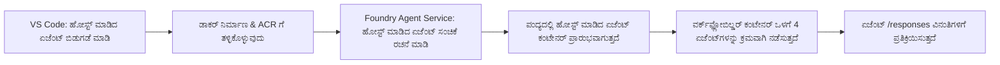
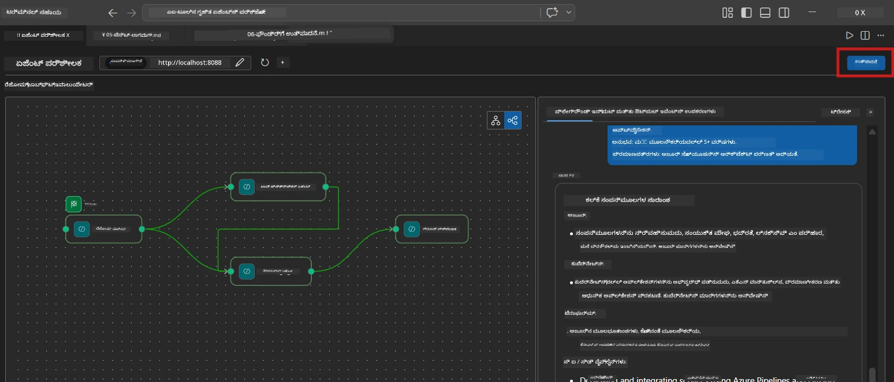
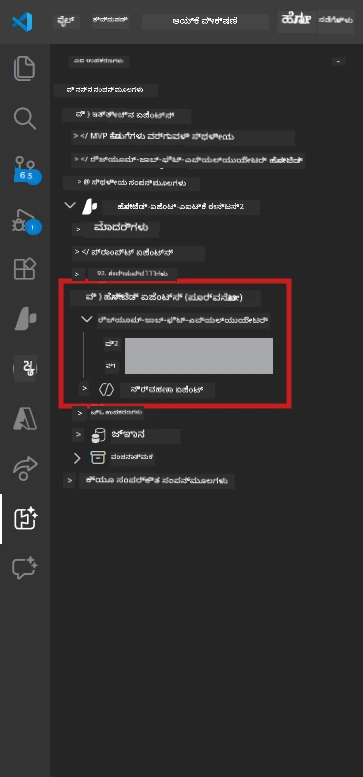

# ಘಟಕ 6 - Foundry ಏಜೆಂಟ್ ಸೇವೆಗೆ ನಿಯೋಜಿಸಿ

⏱️ ~10 ನಿಮಿಷಗಳು

ಈ ಘಟಕದಲ್ಲಿ, ನೀವು ಸ್ಥಳೀಯವಾಗಿ ಪರೀಕ್ಷಿಸಿದ ಬಹು-ಏಜೆಂಟ್ ವರ್ಕ್‌ಫ್ಲೋವನ್ನು [Microsoft Foundry](https://learn.microsoft.com/azure/foundry/agents/concepts/hosted-agents) ನಲ್ಲಿ **ಆತಿಥ್ಯ ಸಹಿತ ಏಜೆಂಟ್** ಆಗಿ ನಿಯೋಜಿಸುತ್ತೀರಿ. ನಿಯೋಜನೆಯ ಪ್ರಕ್ರಿಯೆ ಡೋಕರ್ ಕಂಟೇನರ್ ಚಿತ್ರವನ್ನು ನಿರ್ಮಿಸಿ, ಅದನ್ನು [Azure Container Registry (ACR)](https://learn.microsoft.com/azure/container-registry/container-registry-intro) ಗೆ ದೂರುಸುತ್ತದೆ, ಮತ್ತು [Foundry Agent Service](https://learn.microsoft.com/azure/foundry/agents/how-to/publish-agent) ನಲ್ಲಿ ಆತಿಥ್ಯ ಸಹಿತ ಏಜೆಂಟ್ ಆವೃತ್ತಿಯನ್ನು ರಚಿಸುತ್ತದೆ.

> **ಲ್ಯಾಬ್ 01 ನಿಂದ ಪ್ರಮುಖ ವಿಭಿನ್ನತೆ:** ನಿಯೋಜನೆಯ ಪ್ರಕ್ರಿಯೆ ಅದೇ ರೀತಿಯಾಗಿದೆ. Foundry ನಿಮ್ಮ ಬಹು-ಏಜೆಂಟ್ ವರ್ಕ್‌ಫ್ಲೋವನ್ನು ಒಂದು ಆತಿಥ್ಯ ಏಜೆಂಟ್ ಆಗಿ ಪರಿಗಣಿಸುತ್ತದೆ - ಸಂಕೀರ್ಣತೆ ಕಂಟೈನರ್ ಒಳಗೆ ಇದೆ, ಆದರೆ ನಿಯೋಜನೆಯ ಮೇಲೆ "/responses" ಎಂಡ್‌ಪಾಯಿಂಟ್ ಅದೇ ಇದೆ.

### ನಿಯೋಜನೆ ಪೈಪ್ಲೈನ್


```mermaid
flowchart LR
    A[VS Code: ಹೋಸ್ಟ್ ಮಾಡಿದ ಏಜೆಂಟ್ ಬಿಡುಗಡೆ ಮಾಡಿ] --> B[ಡಾಕರ್ ನಿರ್ಮಾಣ & ACR ಗೆ ತಳ್ಳಿಕೊಳ್ಳುವುದು]
    B --> C[Foundry Agent Service: ಹೋಸ್ಟ್ ಮಾಡಿದ ಏಜೆಂಟ್ ಸಂಚಿಕೆ ರಚನೆ ಮಾಡಿ]
    C --> D[ಪಂದ್ಯದಲ್ಲಿ ಹೋಸ್ಟ್ ಮಾಡಿದ ಏಜೆಂಟ್ ಕಂಟೇನರ್ ಪ್ರಾರಂಭವಾಗುತ್ತದೆ]
    D --> E[ವರ್ಕ್‌ಫ್ಲೋಬಿಲ್ಡರ್ ಕಂಟೇನರ್ ಒಳಗೆ 4 ಏಜೆಂಟ್‌ಗಳನ್ನು ಕ್ರಮವಾಗಿ ನಡೆಸುತ್ತದೆ]
    E --> F[ಏಜೆಂಟ್ /responses ವಿನಂತಿಗಳಿಗೆ ಪ್ರತಿಕ್ರಿಯಿಸುತ್ತದೆ]
```

---

## ಪೂರ್ವಾಪೇಕ್ಷಿತ ಪರೀಕ್ಷೆ

ನಿಯೋಜಿಸುವ ಮೊದಲು, ಕೆಳಗಿನ ಎಲ್ಲ ಅಂಶಗಳನ್ನು ಪರಿಶೀಲಿಸಿ:

1. **ಏಜೆಂಟ್ ಸ್ಥಳೀಯ ಸ್ಮೋಕ್ ಪರೀಕ್ಷೆಗಳನ್ನು ಪಾಸ್ವಾಗಿದ್ದಾನೆ:**
   - ನೀವು [ಘಟಕ 5](05-test-locally.md) ನಲ್ಲಿ ನೀಡಲಾದ 3 ಪರೀಕ್ಷೆಗಳನ್ನು ಪೂರ್ಣಗೊಳಿಸಿದ್ದೀರಿ ಮತ್ತು ವರ್ಕ್‌ಫ್ಲೋ ಸಂಪೂರ್ಣ ಔಟ್‌ಪುಟ್ ಅನ್ನು ಗ್ಯಾಪ್ ಕಾರ್ಡ್‌ಗಳು ಮತ್ತು Microsoft Learn URL ಗಳೊಂದಿಗೆ ಉತ್ಪಾದಿಸಿತು.

2. **ನೀವು [Foundry ಬಳಕೆದಾರ](https://learn.microsoft.com/azure/foundry/concepts/rbac-foundry) ಪಾತ್ರ ಹೊಂದಿದ್ದೀರಿ** (ನಿಯೋಜಿಸಲು ಕನಿಷ್ಠ **Foundry Project Manager** ಯೋಜನೆ ವ್ಯಾಪ್ತಿಯಲ್ಲಿ ಬೇಕಾಗುತ್ತದೆ):

   > ** ಗಮನಿಸಿ:** Foundry RBAC ಪಾತ್ರಗಳನ್ನು ಇತ್ತೀಚೆಗೆ ಮರುನಾಮಕರಣ ಮಾಡಲಾಗಿದೆ - **Foundry User**, **Foundry Owner**, ಮತ್ತು **Foundry Project Manager** ಹಳೆಯದಲ್ಲಿ Azure AI User, Azure AI Owner, ಮತ್ತು Azure AI Project Manager ಎಂದು ಕರೆಸುತ್ತಿದ್ದರು. ಪಾತ್ರ IDಗಳು ಮತ್ತು ಅನುಮತಿಗಳು ಬದಲಾಗಿಲ್ಲ.

   - [Azure ಪೋರ್ಟಲ್](https://portal.azure.com) → ನಿಮ್ಮ Foundry **ಯೋಜನೆ** ಸಂಪತ್ತು → **ಹೊರಹೋಗುವ ನಿಯಂತ್ರಣ (IAM)** → **ಪಾತ್ರ ನಿಯೋಜನೆಗಳು** → ನಿಮ್ಮ ಖಾತೆಗೆ **Foundry User** (ಅಥವಾ ಮೇಲೆ) ಪಟ್ಟಿ ಇದ್ದುದನ್ನು ದೃಢೀಕರಿಸಿ.

3. **ನೀವು VS Code ನಲ್ಲಿ Azure ಗೆ ಸೈನ್ ಇನ್ ಆಗಿದ್ದೀರಿ:**
   - VS Code ನ ಕೆಳಗೆ ಎಡಕೈನ ಮೇಲ್ಭಾಗದಲ್ಲಿನ ಖಾತೆಗಳ ಐಕಾನ್ ಪರಿಶೀಲಿಸಿ. ನಿಮ್ಮ ಖಾತೆಯ ಹೆಸರು ಕಾಣಿಸಿಕೊಳ್ಳಬೇಕು.

4. **`agent.yaml` ನಲ್ಲಿ ಸರಿಯಾದ ಮೌಲ್ಯಗಳು ಇವೆ:**
   - `PersonalCareerCopilot/agent.yaml` ತೆರೆದು ಪರಿಶೀಲಿಸಿ:
     ```yaml
     environment_variables:
       - name: AZURE_AI_MODEL_DEPLOYMENT_NAME
         value: ${AZURE_AI_MODEL_DEPLOYMENT_NAME}
     ```
   - `FOUNDRY_PROJECT_ENDPOINT` ಇಲ್ಲಿ ಲಿಸ್ಟ್ ಆಗಿಲ್ಲ - Foundry ಅದನ್ನು ಸಮಯದಲ್ಲಿ ಸೇರಿಸುತ್ತದೆ. ಮಾತ್ರ `AZURE_AI_MODEL_DEPLOYMENT_NAME` ಘೋಷಿಸಬೇಕು.

5. **`requirements.txt` ನಲ್ಲಿ ಸರಿಯಾದ ಆವೃತ್ತಿಗಳಿವೆ:**
   ```
   agent-framework-foundry
   agent-framework-foundry-hosting
   mcp<2,>=1.24.0
   debugpy
   ```

---

## ಹಂತ 1: ನಿಯೋಜನೆ ಪ್ರಾರಂಭಿಸಿ

### ಆಯ್ಕೆಯ A: ಏಜೆಂಟ್ ಇನ್ಸ್‌ಪೆಕ್ಟರ್ ನಿಂದ ನಿಯೋಜಿಸಿ (ಉಪಾಕಾರಿ)

ಏಜೆಂಟ್ F5 ಮೂಲಕ ಚಲಿಸುವಾಗ ಏಜೆಂಟ್ ಇನ್ಸ್‌ಪೆಕ್ಟರ್ ತೆರೆಯಲ್ಪಟ್ಟಿದೆ:

1. ಏಜೆಂಟ್ ಇನ್ಸ್‌ಪೆಕ್ಟರ್ ಫಲಕದ **ಮೇಲ್ಗಡ ಬಹುಗೋಲು** ನೋಡಿ.
2. **Deploy** ಬಟನ್ ಮೇಲೆ ಕ್ಲಿಕ್ ಮಾಡಿ (ಮೇಲಕ್ಕೆ ಬತ್ತುವ ತಾರೆಯುಳ್ಳ ಮേഘ ಚಿಹ್ನೆ ↑).
3. ನಿಯೋಜನೆ ಮಾಸ್ಟರ್ ತೆರೆಯುತ್ತದೆ.



### ಆಯ್ಕೆಯ B: ಕಮಾಂಡ್ ಪ್ಯಾಲೆಟ್ ನಿಂದ ನಿಯೋಜಿಸಿ

1. `Ctrl+Shift+P` ಒತ್ತಿ ಮತ್ತು **Command Palette** ತೆರೆದುಕೊಳ್ಳಿ.
2. ಟೈಪ್ ಮಾಡಿ: **Foundry Toolkit: Deploy Hosted Agent** ಮತ್ತು ಆಯ್ಕೆಮಾಡಿ.
3. ನಿಯೋಜನೆ ಮಾಸ್ಟರ್ ತೆರೆಯುತ್ತದೆ.

---

## ಹಂತ 2: ನಿಯೋಜನೆ ಹೊಂದಿಸಿ

### 2.1 ಗುರಿ ಯೋಜನೆಯನ್ನು ಆಯ್ಕೆಮಾಡಿ

1. ನಿಮ್ಮ Foundry ಯೋಜನೆಗಳು ಡ್ರಾಪ್‌ಡೌನ್‌ನಲ್ಲಿ ಪ್ರದರ್ಶಿಸಲಾಗುತ್ತವೆ.
2. ಕಾರ್ಯಾಗಾರದಲ್ಲಿ ಬಳಸಿದ ಯೋಜನೆಯನ್ನು ಆಯ್ಕೆಮಾಡಿ (ಉದಾಹರಣೆ: `workshop-agents`).

### 2.2 ಕಂಟೇನರ್ ಏಜೆಂಟ್ ಫೈಲ್ ಆಯ್ಕೆಮಾಡಿ

1. ನೀವು ಏಜೆಂಟ್ ಎಂಟ್ರಿ ಪಾಯಿಂಟ್ ಆಯ್ಕೆಮಾಡಲು ಕೇಳಲಾಗುತ್ತದೆ.
2. `workshop/lab02-multi-agent/PersonalCareerCopilot/` ಗೆ ನಡತಿ ಮಾಡಿ **`main.py`** ಆಯ್ಕೆಮಾಡಿ.

### 2.3 ಸಂಪನ್ಮೂಲಗಳನ್ನು ಹೊಂದಿಸಿ

| ಸೆಟ್ಟಿಂಗ್ | ಶಿಫಾರಸು ಮಾಡಿದ ಮೌಲ್ಯ | ಟಿಪ್ಪಣಿಗಳು |
|---------|------------------|-------|
| **ನಿಯೋಜನೆ ವಿಧಾನ** | **ಕಂಟೇನರ್** (ಶಿಫಾರಸು ಮಾಡಲಾಗಿದೆ) ಅಥವಾ **ಕೋಡ್** | ಕಂಟೇನರ್ ಡೋಕರ್ ಚಿತ್ರವನ್ನು ನಿರ್ಮಿಸುತ್ತದೆ; ಕೋಡ್ ಮೂಲವನ್ನು ZIP (ಪೂರ್ವದರ್ಶಿ) ಆಗಿ ಅಪ್ಲೋಡ್ ಮಾಡುತ್ತದೆ |
| **ಕಂಟೇನರ್ ರೆಜಿಸ್ಟ್ರಿ** | **ಡೀಫಾಲ್ಟ್ ACR** | Foundry ನಿಮಗಾಗಿ ಒಂದು ರಚಿಸುತ್ತದೆ ಮತ್ತು ನಿರ್ವಹಿಸುತ್ತದೆ |
| **CPU** | `0.25` | ಡೀಫಾಲ್ಟ್. ಬಹು-ಏಜೆಂಟ್ ವರ್ಕ್‌ಫ್ಲೋಗಳಿಗೆ ಹೆಚ್ಚು CPU ಬೇಕಾಗಿಲ್ಲ ಏಕೆಂದರೆ ಮಾದರಿ ಕರೆಗಳು I/O-ಬೌಂಡ್ ಆಗಿವೆ |
| **ಮೆಮರಿ** | `0.5Gi` | ಡೀಫಾಲ್ಟ್. ನೀವು ದೊಡ್ಡ ಡೇಟಾ ಪ್ರಕ್ರಿಯೆ ಸಾಧನಗಳನ್ನು ಸೇರಿಸಿದರೆ `1Gi` ಗೆ ಹೆಚ್ಚಿಸಬಹುದು |

---

## ಹಂತ 3: ದೃಢೀಕರಿಸಿ ಮತ್ತು ನಿಯೋಜಿಸಿ

1. ಮಾಸ್ಟರ್ ನಿಯೋಜನೆ ಸಾರಾಂಶವನ್ನು ತೋರಿಸುತ್ತದೆ.
2. ಸಮೀಕ್ಷಿಸಿ ಮತ್ತು **Confirm and Deploy** ಮೇಲೆ ಕ್ಲಿಕ್ ಮಾಡಿ.
3. ಪ್ರಗತಿಯನ್ನೂ VS Code ನಲ್ಲಿ ಗಮನಿಸಿ.

### ನಿಯೋಜನೆಯ ವೇಳೆ ಏನಾಗುತ್ತದೆ

VS Code **Output** ಫಲಕವನ್ನು ಗಮನಿಸಿ (“Microsoft Foundry” ಡ್ರಾಪ್‌ಡೌನ್ ಆಯ್ಕೆಮಾಡಿ):

1. **ಡೋಕರ್ ಬಿಲ್ಡ್** - ನಿಮ್ಮ `Dockerfile` ಮೂಲಕ ಕಂಟೇನರ್ ನಿರ್ಮಿಸಲಾಗುತ್ತದೆ
   ```
   Step 1/6 : FROM python:3.12-slim
   Step 2/6 : WORKDIR /app
   ...
   Successfully built abc123def456
   ```

2. **ಡೋಕರ್ ಪುಷ್** - ಚಿತ್ರವನ್ನು ACR ಗೆ ದೂರುಸುತ್ತದೆ (ಮೊದಲ ನಿಯೋಜನೆಯಲ್ಲಿ 1-3 ನಿಮಿಷಗಳು).

3. **ಏಜೆಂಟ್ ನೋಂದಣಿ** - Foundry `agent.yaml` ಮೆಟಾಡೇಟಾ ಬಳಸಿ ಆತಿಥ್ಯ ಏಜೆಂಟ್ ರಚಿಸುತ್ತದೆ. ಏಜೆಂಟ್ ಹೆಸರು `resume-job-fit-evaluator`.

4. **ಕಂಟೇನರ್ ಪ್ರಾರಂಭ** - ಕಂಟೇನರ್ Foundry ನಿರ್ವಹಿಸಲಾದ ಮೂಲಸೌಕರ್ಯದಲ್ಲಿ ಸಿಸ್ಟಂ ನಿರ್ವಹಿತ ಐಡಂಟಿಟಿಯೊಂದಿಗೆ ಪ್ರಾರಂಭವಾಗುತ್ತದೆ.

> **ಮೊದಲ ನಿಯೋಜನೆ ನಿಧಾನವಾಗಿರಬಹುದು** (ಡೋಕರ್ ಎಲ್ಲಾ ಪದರಗಳನ್ನು ಪುಷ್ ಮಾಡುತ್ತದೆ). ನಂತರದ ನಿಯೋಜನೆಗಳು ಕ್ಯಾಶೇಡ್ ಪದರಗಳನ್ನು ಮರುಬಳಕೆಮಾಡುತ್ತವೆ ಮತ್ತು ವೇಗದಿರುತ್ತವೆ.

### ಬಹು-ಏಜೆಂಟ್ ವಿಶೇಷ ಟಿಪ್ಪಣಿಗಳು

- **ಎಲ್ಲಾ ನಾಲ್ಕು ಏಜೆಂಟ್‌ಗಳು ಒಂದೇ ಕಂಟೈನರ್ ಒಳಗೆ ಇವೆ.** Foundry ಒಂದು ಏಜೆಂಟ್ ಅನ್ನು ಮಾತ್ರ ಕಾಣುತ್ತದೆ. WorkflowBuilder ಗ್ರಾಫ್ ಒಳಗೆ ಚಲಿಸುತ್ತದೆ.
- **MCP ಕರೆಗಳು ಹೊರಗೆ ಹೋಗುತ್ತವೆ.** ಕಂಟೇನರ್ `https://learn.microsoft.com/api/mcp` ಗೆ ತಲುಪಲು ಇಂಟರ್ನೆಟ್ ಪ್ರವೇಶ ಬೇಕಾಗುತ್ತದೆ. Foundry ನಿರ್ವಹಿತ ಮೂಲಸೌಕರ್ಯ ಇದು ಅಪೇಕ್ಷಿಸಿದ್ದಂತೆ ಒದಗಿಸುತ್ತದೆ.
- **[Managed Identity](https://learn.microsoft.com/azure/foundry/agents/concepts/agent-identity).** Foundry ಸ್ವಯಂಚಾಲಿತವಾಗಿ ಪ್ರತಿಯೊಂದು ಆತಿಥ್ಯ ಏಜೆಂಟ್ ಗೆ ನಿಯೋಜನೆಯಾಗುವಾಗ **ಪ್ರತಿನಿಧಿ ಪ್ರತಿ ಏಜೆಂಟ್ Entra ಐಡಂಟಿಟಿ** ರಚಿಸುತ್ತದೆ. ಆತಿಥ್ಯ ಪರಿಸರದಲ್ಲಿ, `DefaultAzureCredential` ಸ್ವಯಂಚಾಲಿತವಾಗಿ ಈ ಏಜೆಂಟ್ ಐಡಂಟಿಟಿ ತಲುಪಿಸುತ್ತದೆ - ಕೈಯಿಂದ ಯಾವುದೇ ನಿರ್ವಹಿತ ಐಡಂಟಿಟಿ ಸಂರಚನೆ ಅಗತ್ಯವಿಲ್ಲ.

---

## ಹಂತ 4: ನಿಯೋಜನೆ ಸ್ಥಿತಿ ಪರಿಶೀಲಿಸಿ

1. **Microsoft Foundry** ಸೈಡ್ಬಾರ್ ತೆರೆದುಕೊಳ್ಳಿ (Activity Bar ನಲ್ಲಿ Foundry ಐಕಾನ್ ಕ್ಲಿಕ್ ಮಾಡಿ).
2. ನಿಮ್ಮ ಯೋಜನೆಯಡಿ **Hosted Agents (Preview)** ವಿಸ್ತರಿಸಿ.
3. **resume-job-fit-evaluator** (ಅಥವಾ ನಿಮ್ಮ ಏಜೆಂಟ್ ಹೆಸರು) ಹುಡುಕಿ.
4. ಏಜೆಂಟ್ ಹೆಸರಿನ ಮೇಲೆ ಕ್ಲಿಕ್ ಮಾಡಿ → ಆವೃತ್ತಿಗಳನ್ನು ವಿಸ್ತರಿಸಿ (ಉದಾ. `v1`).
5. ಆವೃತ್ತಿ ಮೇಲೆ ಕ್ಲಿಕ್ ಮಾಡಿ → **Container Details** → ** ಸ್ಥಿತಿ** ತಪಾಸಿಸಿ:



| ಸ್ಥಿತಿ | ಅರ್ಥ |
|--------|---------|
| **ಸಕ್ರಿಯ** | ಏಜೆಂಟ್ ಚಲಿಸುತ್ತಿದ್ದು, ವಿನಂತಿಗಳನ್ನು ಸ್ವೀಕರಿಸಲು ಸಿದ್ಧವಾಗಿದೆ |
| **ಸೃಷ್ಟಿಸಲಾಗುತ್ತಿದೆ** | ಕಂಟೇನರ್ ಪ್ರಾರಂಭದಲ್ಲಿ ಇದೆ (30–60 ಸೆಕೆಂಡುಗಳು ಕಾಯಿರಿ) |
| **ವಿಫಲ** | ಕಂಟೇನರ್ ಪ್ರಾರಂಭ ವಿಫಲವಾಗಿದೆ (ಲಾಗ್‌ಗಳನ್ನು ಪರಿಶೀಲಿಸಿ - ಕೆಳಕೆ ನೋಡಿರಿ) |

> **ಗುರುತಿಸಿ:** VS Code ಸೈಡ್ಬಾರ್ "Running" ಅಥವಾ "Started" ಎಂದು ಲೇಬಲ್ ತೋರಿಸಬಹುದು, ಆದರೆ ಅಡಿಯಲ್ಲಿ APIstatus `active`/`creating` ಬಳಕೆ ಮಾಡುತ್ತದೆ. ಎರಡೂ ತೋರಿಸುವುದು ಅದೇ ಸ್ಥಿತಿಯನ್ನು ಸೂಚಿಸುತ್ತದೆ.

> **ಬಹು-ಏಜೆಂಟ್ ಪ್ರಾರಂಭ ಹೆಚ್ಚಾಗಿ ಸಮಯ ತೆಗೆದುಕೊಳ್ಳಬಹುದು** ಏಕೆಂದರೆ ಕಂಟೇನರ್ ಪ್ರಾರಂಭದಲ್ಲಿ 4 ಏಜೆಂಟ್ ನಕಲಿಕೆಗಳನ್ನು ರಚಿಸುತ್ತದೆ. `creating` ಸ್ಥಿತಿ 2 ನಿಮಿಷಗಳವರೆಗೆ ಪ್ರಾಮಾಣಿಕವಾಗಿದೆ.

---

## ಸಾಮಾನ್ಯ ನಿಯೋಜನೆ ದೋಷಗಳು ಮತ್ತು ಪರಿಹಾರಗಳು

### ದೋಷ 1: ಅನುಮತಿ ನಿರಾಕರಿಸಲಾಗಿದೆ - `agents/write`

```
Error: lacks the required data action 
Microsoft.CognitiveServices/accounts/AIServices/agents/write
```

**ಪರಿಹಾರ:** **[Foundry User](https://learn.microsoft.com/azure/foundry/concepts/rbac-foundry)** ಪಾತ್ರವನ್ನು (ಹಿಂದೆ **Azure AI User**) **ಯೋಜನೆ** ಮಟ್ಟದಲ್ಲಿ ನೀಡಿ. ಹಂತ ಹಂತವಾಗಿ ಹಂತಾಂಶಕ್ಕಾಗಿ [ಘಟಕ 8 - ತೊಂದರೆ ಪರಿಹಾರ](08-troubleshooting.md) ನೋಡಿ.

### ದೋಷ 2: ಡೋಕ್‌ರ್ ಚಾಲನೆಯಲ್ಲಿಲ್ಲ

```
Error: Docker build failed / Cannot connect to Docker daemon
```

**ಪರಿಹಾರ:**
1. Docker Desktop ಪ್ರಾರಂಭಿಸಿ.
2. "Docker Desktop is running" ಎಂಬ ಸಂದೇಶಕ್ಕಾಗಿ ಕಾಯಿರಿ.
3. ಪರಿಶೀಲಿಸಿ: `docker info`
4. **Windows:** Docker Desktop ಸೆಟ್ಟಿಂಗ್‌ಗಳಲ್ಲಿ WSL 2 ಬ್ಯಾಕ್ಎಂಡ್ ಸಕ್ರಿಯವಾಗಿದ್ದು ಎಂದು ಖಚಿತಪಡಿಸಿಕೊಳ್ಳಿ.
5. ಮತ್ತೆ ಪ್ರಯತ್ನಿಸಿ.

### ದೋಷ 3: ಡೋಕ್‌ರ್ ಬಿಲ್ಡ್ ವೇಳೆ pip ಇನ್ಸ್ಟಾಲ್ ವಿಫಲ

```
Error: Could not find a version that satisfies the requirement agent-framework-foundry
```

**ಪರಿಹಾರ:** `requirements.txt` ಪರಿಶೀಲಿಸಿ:
```
agent-framework-foundry
agent-framework-foundry-hosting
mcp<2,>=1.24.0
debugpy
```

ಬಿಲ್ಡ್ ಇನ್ನೂ ವಿಫಲವಾದರೆ, ನಿಮ್ಮ ಡೋಕ್‌ರ್ ನೆಟ್ವರ್ಕ್ PyPI ಅನ್ನು ತಡೆಯುತ್ತಿರುವ ಸಾಧ್ಯತೆ ಇದೆ. `docker info` ನಲ್ಲಿ ಪ್ರಾಕ್ಸಿ ಸೆಟ್ಟಿಂಗ್‌ಗಳನ್ನು ಪರಿಶೀಲಿಸಿ.

### ದೋಷ 4: MCP ಉಪಕರಣ ಆತಿಥ್ಯ ಏಜೆಂಟ್‌ನಲ್ಲಿ ವಿಫಲ

ನಿಯೋಜನೆಯ ನಂತರ Gap Analyzer Microsoft Learn URL ಗಳನ್ನು ಉತ್ಪಾದಿಸುವುದಿಲ್ಲದಿದ್ದರೆ:

**ಮೂಲ ಕಾರಣ:** ನೆಟ್ವರ್ಕ್ ನೀತಿ ಕಂಟೇನರ್ ನಿಂದ ಹೊರಗೆ HTTPS ಅನ್ನು ತಡೆಯಬಹುದು.

**ಪರಿಹಾರ:**
1. ಸಾಮಾನ್ಯವಾಗಿ Foundry ಡೀಫಾಲ್ಟ್ ಸಂರಚನೆ ಇದನ್ನು ತಡೆಯುವುದಿಲ್ಲ.
2. ಆಗಿದ್ದಲ್ಲಿ, Foundry ಯೋಜನೆಯ ವರ್ಚುವಲ್ ನೆಟ್ವರ್ಕ್ ಹೈದೂರಳೆ (NSG) ಹೊರಗಿನ HTTPS ಅನ್ನು ತಡೆಯುತ್ತದೋ ಎಂದು ಪರಿಶೀಲಿಸಿ.
3. MCP ಉಪಕರಣದಲ್ಲಿ ಒಳನೇರ ಪುನಃ ಮುನ್ನಡೆಸುವ URL ಗಳು ಇವೆ, ಆದ್ದರಿಂದ ಏಜೆಂಟ್ ಇನ್ನೂ ಔಟ್‌ಪುಟ್ ನೀಡುತ್ತದೆ (ಲೈವ್ URL ಗಳು ಇಲ್ಲದೆ).

---

### ಸ್ಥಿತಿ ಪರಿಶೀಲನೆ

- [ ] VS Code ನಲ್ಲಿ ದೋಷವಿಲ್ಲದೆ ನಿಯೋಜನೆ ಆಜ್ಞೆ ಪೂರ್ಣಗೊಂಡಿದೆ
- [ ] Foundry ಸೈಡ್ಬಾರ್ ನಲ್ಲಿ **Hosted Agents (Preview)** ಒಳಗೆ ಏಜೆಂಟ್ ಕಾಣಿಸಿಕೊಳ್ಳುತ್ತಿದೆ
- [ ] ಏಜೆಂಟ್ ಹೆಸರನ್ನು `resume-job-fit-evaluator` (ಅಥವಾ ನಿಮ್ಮ ಆಯ್ಕೆಮಾಡಿದ ಹೆಸರು)
- [ ] ಕಂಟೇನರ್ ಸ್ಥಿತಿ **Started** ಅಥವಾ **Running** ತೋರಿಸುತ್ತಿದೆ
- [ ] (ದೋಷಗಳಿದ್ದರೆ) ನೀವು ದೋಷನಿರ್ಣಯ ಮಾಡಿ, ಪರಿಹಾರ ಅನ್ವಯಿಸಿ ಮತ್ತು ಯಶಸ್ವಿಯಾಗಿ ಮತ್ತೆ ನಿಯೋಜಿಸಿದ್ದೀರಿ

---

**ಹಿಂದಿನ:** [05 - ಸ್ಥಳೀಯವಾಗಿ ಪರೀಕ್ಷೆ](05-test-locally.md) · **ಮುಂದಿನ:** [07 - ಪ್ಲೇಗ್ರೌಂಡ್‌ನಲ್ಲಿ ಪರಿಶೀಲಿಸಿ →](07-verify-in-playground.md)

---

<!-- CO-OP TRANSLATOR DISCLAIMER START -->
**ಅಸ್ವೀಕಾರ**:
ಈ ದಸ್ತಾವೇಜು AI ಅನುವಾದ ಸೇವೆ [Co-op Translator](https://github.com/Azure/co-op-translator) ಬಳಸಿ ಅನುವಾದಿಸಲಾಗಿದೆ. ನಾವು ನಿಖರತೆಯನ್ನು ಸಾಧಿಸಲು ಪ್ರಯತ್ನಿಸುತ್ತಿದ್ದರೂ, ದಯವಿಟ್ಟು ಗಮನಿಸಿ, ಸ್ವಯಂಚಾಲಿತ ಅನುವಾದಗಳಲ್ಲಿ ದೋಷಗಳು ಅಥವಾ ಅಸಡ್ಡೆಗಳು ಇರಬಹುದು. ಮೂಲ ಭಾಷೆಯಲ್ಲಿರುವ ಮೂಲ ದಸ್ತಾವೇಜು ಪ್ರಾಮಾಣಿಕ ಮೂಲವೆಂದು ಪರಿಗಣಿಸಬೇಕು. ಪ್ರಮುಖ ಮಾಹಿತಿಗಾಗಿ, ವೃತ್ತಿಪರ ಮಾನವ ಅನುವಾದವನ್ನು ಶಿಫಾರಸು ಮಾಡಲಾಗುತ್ತದೆ. ಈ ಅನುವಾದವನ್ನು ಬಳಸುವ ಮೂಲಕ ಉಂಟಾಗುವ ಯಾವುದೇ ತಪ್ಪು ಅರ್ಥಗಳ ಅಥವಾ ತಪ್ಪು ವ್ಯಾಖ್ಯಾನಗಳ ಬಗ್ಗೆ ನಾವು ಹೊಣೆಗಾರರಲ್ಲ.
<!-- CO-OP TRANSLATOR DISCLAIMER END -->