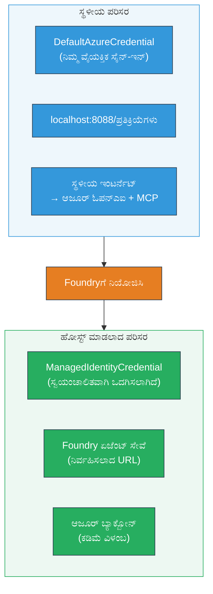

# Module 7 - Playground ನಲ್ಲಿ ಪರಿಶೀಲಿಸಿ

ಈ module ನಲ್ಲಿ, ನೀವು ನಿಮ್ಮ ನಿಯೋಜಿಸಿರುವ ಬಹು-ಏಜೆಂಟ್ ವರ್ಕ್‌ಫ್ಲೋವನ್ನು **VS Code** ಮತ್ತು **[Foundry Portal](https://ai.azure.com)** ಎರಡರಲ್ಲಿ ಪರೀಕ್ಷಿಸಿ, ಏಜೆಂಟ್ ಸ್ಥಳೀಯ ಪರೀಕ್ಷೆಯಂತೆ ವ್ಯವಹರಿಸುತ್ತಿದೆಯೋ ಇಲ್ಲವೋ ಎಂದು ದೃಢೀಕರಿಸುತ್ತೀರಿ.

---

## ನಿಯೋಜನೆಯ ನಂತರ ಪರಿಶೀಲಿಸುವುದು ಯಾಕೆ?

ನಿಮ್ಮ ಬಹು-ಏಜೆಂಟ್ ವರ್ಕ್‌ಫ್ಲೋ ಸ್ಥಳೀಯವಾಗಿ ಸರಿ ಕೆಲಸ ಮಾಡಿತು, ಆದರೂ ನೀವು ಮತ್ತೆ ಪರೀಕ್ಷಿಸುವುದಕ್ಕೆ ಕಾರಣ ಏನು? ಹೋಸ್ಟಿಂಗ್ ವಾತಾವರಣವು ಹಲವಾರು ರೀತಿಯಲ್ಲಿ ಭಿನ್ನವಾಗಿದೆ:


| ಭೇದ | ಸ್ಥಳೀಯ | ಹೋಸ್ಟಿಂಗ್ |
|-----------|-------|--------|
| **ಪರಿಚಯ** | [`DefaultAzureCredential`](https://learn.microsoft.com/azure/developer/python/sdk/authentication/credential-chains#defaultazurecredential-overview) (ನಿಮ್ಮ ವೈಯಕ್ತಿಕ ಸೈನ್-ಇನ್) | [`ManagedIdentityCredential`](https://learn.microsoft.com/python/api/overview/azure/identity-readme#managed-identity-support) (ಸ್ವಯಂಚಾಲಿತ ಒದಗಿಸಲಾಗಿದೆ) |
| **ಎಂಡ್‌ಪಾಯಿಂಟ್** | `http://localhost:8088/responses` | [Foundry Agent Service](https://learn.microsoft.com/azure/foundry/agents/concepts/hosted-agents) ಎಂಡ್‌ಪಾಯಿಂಟ್ (ನಿರ್ವಹಿಸಲಾಗುವ URL) |
| **ಜಾಲತಾಣ** | ಸ್ಥಳೀಯ ಯಂತ್ರ → Azure OpenAI + MCP ಔಟ್‌ಬೌಂಡ್ | Azure ಮೈನ್‌ಫ್ರೇಮ್ (ಸೇವೆಗಳ ನಡುವೆ ಕಡಿಮೆ ವಿಳಂಬ) |
| **MCP ಸಂಪರ್ಕ** | ಸ್ಥಳೀಯ ಇಂಟರ್ನೆಟ್ → `learn.microsoft.com/api/mcp` | ಕಂಟೈನರ್ ಔಟ್‌ಬೌಂಡ್ → `learn.microsoft.com/api/mcp` |

ಯಾವುದಾದರೂ ಪರಿಸರ ವೈಶಿಷ್ಟ್ಯ ತಪ್ಪಾದರೆ, RBAC ಭಿನ್ನವಾಗಿದ್ದರೆ, ಅಥವಾ MCP ಔಟ್‌ಬೌಂಡ್ ತಡೆಯಲ್ಪಟ್ಟಿದ್ದರೆ, ನೀವು ಇಲ್ಲಿ ಅದನ್ನು ಹಿಡಿಯಬಹುದು.

---

## ಆಯ್ಕೆ A: VS Code Playground ನಲ್ಲಿ ಪರೀಕ್ಷೆ (ಮೊದಲನೆಯದಾಗಿ ಶಿಫಾರಸು)

[Foundry ವಿಸ್ತರಣೆ](https://marketplace.visualstudio.com/items?itemName=TeamsDevApp.vscode-ai-foundry) ಒಂದು ಅಂತರ್ಗತ Playground ಅನ್ನು ಒಳಗೊಂಡಿದೆ, ಅದು ನೀವು VS Code ನಿಂದ ಹೊರ ಬಿಸದೆ ನಿಮ್ಮ ನಿಯೋಜಿಸಿರುವ ಏಜೆಂಟ್ ಜೊತೆ ಮಾತನಾಡಲು ಅನುಮತಿಸುತ್ತದೆ.

### ಹಂತ 1: ನಿಮ್ಮ ಹೋಸ್ಟಿಂಗ್ ಮಾಡಲಾದ ಏಜೆಂಟ್ ಗೆ ಸಾಗಿರಿ

1. VS Code **Activity Bar** (ಎಡ ಬದಿಯ ಸೈಡ್‌ಬಾರ್) ನಲ್ಲಿ **Microsoft Foundry** ಐಕಾನ್ ಕ್ಲಿಕ್ ಮಾಡಿ Foundry ಪ್ಯಾನೆಲ್ ತೆರೆಯಿರಿ.
2. ನಿಮ್ಮ ಸಂಪರ್ಕ ಹೊಂದಿದ ಪ್ರಾಜೆಕ್ಟ್ (ಉದಾ: `workshop-agents`) ವಿಸ್ತರಿಸಿ.
3. **Hosted Agents (Preview)** ವಿಸ್ತರಿಸಿ.
4. ನೀವು ನಿಮ್ಮ ಏಜೆಂಟ್ ಹೆಸರು (ಉದಾ: `resume-job-fit-evaluator`) ಕಾಣಬೇಕು.

### ಹಂತ 2: ಒಂದು ಆವೃತ್ತಿ ಆಯ್ಕೆಮಾಡಿ

1. ಏಜೆಂಟ್ ಹೆಸರನ್ನು ಕ್ಲಿಕ್ ಮಾಡಿ ಅದರ ಆವೃತ್ತಿಗಳನ್ನು ವಿಸ್ತರಿಸಿ.
2. ನೀವು ನಿಯೋಜಿಸಿದ ಆವೃತ್ತಿಯನ್ನು ಕ್ಲಿಕ್ ಮಾಡಿ (ಉದಾ: `v1`).
3. ಒಂದು **ವಿವರ ಪ್ಯಾನೆಲ್** ತೆರೆದು ಕಂಟೈನರ್ ವಿವರಗಳನ್ನು ತೋರಿಸುತ್ತದೆ.
4. ಸ್ಥಿತಿಯನ್ನು **Started** ಅಥವಾ **Running** ಆಗಿದೆಯೇ ಎಂದು ಪರಿಶೀಲಿಸಿ.

### ಹಂತ 3: Playground ತೆರೆಯಿರಿ

1. ವಿವರ ಪ್ಯಾನೆಲ್ ನಲ್ಲಿ **Playground** ಬಟನ್ ಕ್ಲಿಕ್ ಮಾಡಿ (ಅಥವಾ ಆವೃತ್ತಿಯ ಮೇಲೆ ರೈಟ್-ಕ್ಲಿಕ್ ಮಾಡಿ → **Open in Playground**).
2. VS Code ಟ್ಯಾಬ್‌ನಲ್ಲಿ ಮಾತುಕತೆ ಇಂಟರ್ಫೇಸ್ ತೆರೆಯುತ್ತದೆ.

### ಹಂತ 4: ನಿಮ್ಮ ಸ್ಮೋಕ್ ಟೆಸ್ಟ್‌ಗಳನ್ನು ನಡೆಸಿ

[Module 5](05-test-locally.md) ನಿಂದ ಅದೇ 3 ಪರೀಕ್ಷೆಗಳನ್ನು Playground ಇನ್ಪುಟ್ ಬಾಕ್ಸ್‌ನಲ್ಲಿ ಟೈಪ್ ಮಾಡಿ ಮತ್ತು **Send** (**Enter**) ಒತ್ತಿ.

#### ಪರೀಕ್ಷೆ 1 - ಪೂರ್ಣ ರೆಸ್ಯೂಮ್ + JD (ಸಾಮಾನ್ಯ ರೀತಿ)

Module 5, ಪರೀಕ್ಷೆ 1 (ಜೆನ್ ಡೋ + ಸೀನಿಯರ್ ಕ್ಲೌಡ್ ಎಂಜಿನಿಯರ್ at Contoso Ltd) ನಿಂದ ಪೂರ್ಣ ರೆಸ್ಯೂಮ್ + JD ಪ್ರಾಂಪ್ಟ್ ನಕಲು ಮಾಡಿ.

**ನಿರೀಕ್ಷಿತ:**
- ಫಿಟ್ ಸ್ಕೋರ್ ವಿಭಾಗವಾದ ಗಣನೆ (100-ಪಾಯಿಂಟ್ ಪ್ರಮಾಣ)
- ಹೊಂದಾಣಿಕೆಯ ಕೌಶಲ್ಯಗಳು ವಿಭಾಗ
- ಕಳವಳಗೊಂಡ ಕೌಶಲ್ಯಗಳು ವಿಭಾಗ
- **ಪ್ರತಿಯೊಂದು ಕಳವಳಗೊಂಡ ಕೌಶಲ್ಯಕ್ಕೆ ಒಂದು ಗ್ಯಾಪ್ ಕಾರ್ಡ್** Microsoft Learn URLs ಜೊತೆಗೆ
- ಕಲಿಕೆ ಸ್ಥಾನದ ಕಾಲಾನುಗತವಾದ ಪಥ

#### ಪರೀಕ್ಷೆ 2 - ತ್ವರಿತ ಕ್ಷಿಪ್ರ ಪರೀಕ್ಷೆ (ಕಡಿಮೆ ಇನ್ಪುಟ್)

```
RESUME: 3 years Python developer, knows Django and PostgreSQL, no cloud experience.

JOB: Cloud DevOps Engineer requiring AWS, Kubernetes, Terraform, CI/CD. 5 years needed.
```

**ನಿರೀಕ್ಷಿತ:**
- ಕಡಿಮೆ ಫಿಟ್ ಸ್ಕೋರ್ (< 40)
- ಸತ್ಯವಾದ ಮೌಲ್ಯಮಾಪನ ಮತ್ತು ಹಂತಬದ್ಧ ಕಲಿಕೆ ಪಥ
- ಹಲವು ಗ್ಯಾಪ್ ಕಾರ್ಡ್‌ಗಳು (AWS, Kubernetes, Terraform, CI/CD, ಅನುಭವದ ಗ್ಯಾಪ್)

#### ಪರೀಕ್ಷೆ 3 - ಹೆಚ್ಚು ಫಿಟ್ ಅಭ್ಯರ್ಥಿ

```
RESUME:
10 years Azure Cloud Architect. AZ-305 certified. Expert in AKS, Terraform, Azure DevOps, 
Azure Functions, Helm, Prometheus, Grafana, Python, Go. Led platform team of 8.

JOB:
Senior Cloud Engineer. Required: AKS, Terraform, Azure DevOps, Python. Preferred: Helm, Go.
5+ years experience. AZ-305 preferred.
```

**ನಿರೀಕ್ಷಿತ:**
- ಹೆಚ್ಚಿನ ಫಿಟ್ ಸ್ಕೋರ್ (≥ 80)
- ಸಂದರ್ಶನ ಸಿದ್ಧತೆ ಮತ್ತು ಶುಷ್ಕರಣೆಯ ಮೇಲೆ ಕೇಂದ್ರೀಕರಣ
- ಕಡಿಮೆ ಅಥವಾ ಯಾವುದೇ ಗ್ಯಾಪ್ ಕಾರ್ಡ್‌ಗಳು ಇಲ್ಲ
- ಸಿದ್ಧತೆ ಮೇಲೆ ಕೇಂದ್ರೀಕೃತ ಕುတို ಕಾಮಗಾರಿ

### ಹಂತ 5: ಸ್ಥಳೀಯ ಫಲಿತಾಂಶಗಳೊಂದಿಗೆ ಹೋಲಿಕೆ ಮಾಡಿ

Module 5 ರಿಂದ ನೀವು ಸಂಗ್ರಹಿಸಿದ ಸ್ಥಳೀಯ ಉತ್ತರಗಳನ್ನು ನಿಮ್ಮ ನೋಟ್ಸ್ ಅಥವಾ ಬ್ರೌಸರ್ ಟ್ಯಾಬ್ ತೆರೆಯಿರಿ. ಪ್ರತಿ ಪರೀಕ್ಷೆಗೆ:

- ಉತ್ತರವು **ಅದೇ ರಚನೆ** ಹೊಂದಿದೆಯೇ (ಫಿಟ್ ಸ್ಕೋರ್, ಗ್ಯಾಪ್ ಕಾರ್ಡ್‌ಗಳು, ಪಥ)?
- **ಅದೇ ಸ್ಕೋರ್ ಮಂಜೂರಾತಿ ನಿಯಮ** ಅನುಸರಿಸುತ್ತಿದೆಯೇ (100-ಪಾಯಿಂಟ್ ವಿಭಾಗ)?
- **Microsoft Learn URLs ಗಳು** ಗ್ಯಾಪ್ ಕಾರ್ಡ್‌ಗಳಲ್ಲಿ ಇನ್ನೂ ಇದ್ದವೆಯೇ?
- **ಪ್ರತಿಯೊಂದು ಕಳವಳಗೊಂಡ ಕೌಶಲ್ಯಕ್ಕೆ ಒಂದು ಗ್ಯಾಪ್ ಕಾರ್ಡ್** ಇದೆಯೇ (ಕಡಿತವಲ್ಲದ) ?

> **ಸಣ್ಣ ಶಬ್ದ ವ್ಯತ್ಯಾಸಗಳು ಸಾಮಾನ್ಯವಾಗಿದೆ** - ಮಾದರಿ ನಿಶ್ಚಿತವಲ್ಲ. ರಚನೆ, ಸ್ಕೋರ್ ಸತತತೆ, ಮತ್ತು MCP ಉಪಕರಣ ಬಳಕೆಯ ಮೇಲೆ ಗಮನ ಹರಿಸಿ.

---

## ಆಯ್ಕೆ B: Foundry Portal ನಲ್ಲಿ ಪರೀಕ್ಷೆ

[Foundry Portal](https://ai.azure.com) ವೆಬ್ ಆಧಾರಿತ playground ಒದಗಿಸುತ್ತದೆ, ಇದು ಸಹೋದ್ಯೋಗಿಗಳು ಅಥವಾ ಹಿತಚಿಂತಕರೊಂದಿಗೆ ಹಂಚಿಕೊಳ್ಳಲು ಸಹಾಯಕ.

### ಹಂತ 1: Foundry Portal ತೆರೆಯಿರಿ

1. ನಿಮ್ಮ ಬ್ರೌಸರ್ ತೆರೆಯಿರಿ ಮತ್ತು [https://ai.azure.com](https://ai.azure.com) ಗೆ ಹೋಗಿ.
2. ವರ್ಕ್‌ಶಾಪ್ ನಲ್ಲಿ ಬಳಸುತ್ತಿರುವ ಅದೇ Azure ಖಾತೆ ಯೊಂದಿಗೆ ಸೈನ್ ಇನ್ ಮಾಡಿಕೊಳ್ಳಿ.

### ಹಂತ 2: ನಿಮ್ಮ ಪ್ರಾಜೆಕ್ಟ್‌కి ನೀವುವಳಿ ಸಹಾಯಕ

1. ಮನೆ ಪುಟದಲ್ಲಿ, ಎಡ ಸೈಡ್‌ಬಾರ್‌ನಲ್ಲಿ **Recent projects** ನೋಡಿ.
2. ನಿಮ್ಮ ಪ್ರಾಜೆಕ್ಟ್ ಹೆಸರನ್ನು (ಉದಾ: `workshop-agents`) ಕ್ಲಿಕ್ ಮಾಡಿ.
3. ಕಂಡುಬರದಿದ್ದರೆ **All projects** ಕ್ಲಿಕ್ ಮಾಡಿ ಮತ್ತು ಹುಡುಕಿ.

### ಹಂತ 3: ನಿಮ್ಮ ನಿಯೋಜಿಸಿದ ಏಜೆಂಟ್ ಕಾಣಿಸಿ

1. ಪ್ರಾಜೆಕ್ಟ್ ಎಡ ನ್ಯಾವಿಗೇಶನ್ ನಲ್ಲಿ **Build** → **Agents** ಕ್ಲಿಕ್ ಮಾಡಿ (ಅಥವಾ **Agents** ವಿಭಾಗ ಹುಡುಕಿ).
2. ಏಜೆಂಟ್‌ಗಳ ಪಟ್ಟಿ ಕಾಣಿಸುತ್ತದೆ. ನಿಮ್ಮ ನಿಯೋಜಿಸಿದ ಏಜೆಂಟ್ (ಉದಾ: `resume-job-fit-evaluator`) ಹುಡುಕಿ.
3. ಏಜೆಂಟ್ ಹೆಸರನ್ನು ಕ್ಲಿಕ್ ಮಾಡಿ ಅದರ ವಿವರ ಪುಟ ತೆರೆysi.

### ಹಂತ 4: Playground ತೆರೆಯಿರಿ

1. ಏಜೆಂಟ್ ವಿವರ ಪುಟದ ಮೇಲ್ಮೈ ಟೂಲ್‌ಬಾರ್ ನೋಡಿ.
2. **Open in playground** (ಅಥವಾ **Try in playground**) ಕ್ಲಿಕ್ ಮಾಡಿ.
3. ಮಾತುಕತೆ ಇಂಟರ್ಫೇಸ್ ತೆರೆಯುತ್ತದೆ.

### ಹಂತ 5: ಅದೇ 3 ಸ್ಮೋಕ್ ಟೆಸ್ಟ್‌ಗಳನ್ನು ನಡೆಸಿ

ಮೇಲೆ VS Code Playground ಭಾಗದಿಂದ 3 ಪರೀಕ್ಷೆಗಳನ್ನೂ ಪುನರಾವರ್ತಿಸಿ. ಪ್ರತಿಯೊಂದು ಉತ್ರವನ್ನು ಸ್ಥಳೀಯ ಫಲಿತಾಂಶಗಳ (Module 5) ಮತ್ತು VS Code Playground ಫಲಿತಾಂಶಗಳೊಂದಿಗೆ ಹೋಲಿಸಿ (ಆಯ್ಕೆ A).

---

## ಬಹು-ಏಜೆಂಟ್ ವಿಶೇಷ ಪರಿಶೀಲನೆ

ಸಾಧಾರಣ ಸರಿಯಾದತೆಯ ಜೊತೆಗೆ ಈ ಬಹು-ಏಜೆಂಟ್-ವಿಶೇಷ ಗುಣಲಕ್ಷಣಗಳನ್ನೂ ಪರಿಶೀಲಿಸಿ:

### MCP ಉಪಕರಣ ಕಾರ್ಯಾಚರಣೆ

| ಪರಿಶೀಲನೆ | ಪರಿಶೀಲಿಸುವ ವಿಧಾನ | ಪಾಸ್ ಶರತ್ತು |
|-------|---------------|----------------|
| MCP ಕರೆಗಳು ಯಶಸ್ವಿ | ಗ್ಯಾಪ್ ಕಾರ್ಡ್‌ಗಳಲ್ಲಿಯ `learn.microsoft.com` URLs | ನಿಜವಾದ URLs, ಫಾಲ್‌ ಬ್ಯಾಕ್ ಸಂದೇಶಗಳು ಅಲ್ಲ |
| ಹಲವಾರು MCP ಕರೆಗಳು | ಪ್ರತಿಯೊಂದು ಹೈ/ಮಧ್ಯಮ ಆದ್ಯತೆ ಗ್ಯಾಪ್‌ಗೆ ಸಂಪನ್ಮೂಲಗಳಿವೆ | ಮೊದಲ ಗ್ಯಾಪ್ ಕಾರ್ಡ್ ಮಾತ್ರವಲ್ಲ |
| MCP ಫಾಲ್‌ ಬ್ಯಾಕ್ ಕಾರ್ಯಗತವಾಗುತ್ತದೆ | URLs ಇಲ್ಲದಿದ್ದರೆ ಫಾಲ್‌ ಬ್ಯಾಕ್ ಪಠ್ಯವನ್ನು ಪರಿಶೀಲಿಸಿ | ಏಜೆಂಟ್ ಗ್ಯಾಪ್ ಕಾರ್ಡ್‌ಗಳನ್ನು ಉತ್ಪಾದಿಸುತ್ತದೆ (URLs ಜೊತೆ ಅಥವಾ ಇಲ್ಲದೆ) |

### ಏಜೆಂಟ್ ಸಮನ್ವಯ

| ಪರಿಶೀಲನೆ | ಪರಿಶೀಲಿಸುವ ವಿಧಾನ | ಪಾಸ್ ಶರತ್ತು |
|-------|---------------|----------------|
| ಎಲ್ಲಾ 4 ಏಜೆಂಟ್‌ಗಳು ಓಡಿದವು | ಔಟ್‌ಪುಟ್‌ನಲ್ಲಿ ಫಿಟ್ ಸ್ಕೋರ್ ಮತ್ತು ಗ್ಯಾಪ್ ಕಾರ್ಡ್‌ಗಳು ಇವೆ | ಸ್ಕೋರ್ MatchingAgent ನಿಂದ, ಕಾರ್ಡ್‌ಗಳು GapAnalyzer ನಿಂದ |
| ಪ್ಯಾರಲಲ್ ಫ್ಯಾನ್-ಔಟ್ | ಪ್ರತಿಕ್ರಿಯೆ ಸಮಯ ತಕ್ಕಮಟ್ಟಿಗೆ (< 2 ನಿಮಿಷ) | > 3 ನಿಮಿಷವಾದರೆ ಪ್ಯಾರಲಲ್ ಕಾರ್ಯಾಚರಣೆ ಕಾರ್ಯನಿರ್ವಹಿಸುತ್ತಿಲ್ಲಬಹುದು |
| ಡೇಟಾ ಹಬ್ಬವು ಸತ್ಯವಾಗಿದೆ | ಗ್ಯಾಪ್ ಕಾರ್ಡ್‌ಗಳು ಹೊಂದಾಣಿಕೆಯ ವರದಿ ಕೌಶಲ್ಯಗಳನ್ನು ಉಲ್ಲೇಖಿಸುತ್ತವೆ | JD ನಲ್ಲಿ ಇಲ್ಲದ ಕಲ್ಪಿತ ಕೌಶಲ್ಯಗಳಿಲ್ಲ |

---

## ಮಾನ್ಯತೆಮಾಡುವ ರೂಬ್ರಿಕ್

ನಿಮ್ಮ ಬಹು-ಏಜೆಂಟ್ ವರ್ಕ್‌ಫ್ಲೋ ಹೋಸ್ಟ್ ಮಾಡಿದ ವರ್ತನೆ ಅನ್ನು ಈ ರೂಬ್ರಿಕ್ ಬಳಸಿ ಮೌಲ್ಯಮಾಪನಮಾಡಿ:

| # | ಮಾನದಂಡ | ಪಾಸ್ ಶರತ್ತು | ಪಾಸ್? |
|---|----------|---------------|-------|
| 1 | **ಕಾರ್ಯಾತ್ಮಕ ಸರಿಯಾದತೆ** | ಏಜೆಂಟ್ ರೆಸ್ಯೂಮ್ + JD ಗೆ ಫಿಟ್ ಸ್ಕೋರ್ ಮತ್ತು ಗ್ಯಾಪ್ ವಿಶ್ಲೇಷಣೆ ಉತ್ತರಿಸುತ್ತದೆ | |
| 2 | **ಸ್ಕೋರ್‌ಮಾಡುವ ಸತತತೆ** | ಫಿಟ್ ಸ್ಕೋರ್ 100-ಪಾಯಿಂಟ್ ಮಟ್ಟದಲ್ಲಿ ವಿಭಾಗಗೊಳ್ಳುತ್ತದೆ | |
| 3 | **ಗ್ಯಾಪ್ ಕಾರ್ಡ್ ಪೂರ್ಣತೆ** | ಪ್ರತಿಯೊಂದು ಕಳವಳಗೊಂಡ ಕೌಶಲ್ಯದಿಗೂ ಒಂದು ಕಾರ್ಡ್ (ಕಡಿತವಾಗದೆ) | |
| 4 | **MCP ಉಪಕರಣ ಏಕೀಕರಣ** | ಗ್ಯಾಪ್ ಕಾರ್ಡ್‌ಗಳಲ್ಲಿ ನಿಜವಾದ Microsoft Learn URLs ಇವೆ | |
| 5 | **ರಚನಾತ್ಮಕ ಸತತತೆ** | ಔಟ್‌ಪುಟ್ ರಚನೆ ಸ್ಥಳೀಯ ಮತ್ತು ಹೋಸ್ಟ್ ಮಾಡಲಾದ ಓಟುಕೆಗಳು ಒಂದೇ | |
| 6 | **ಪ್ರತಿಕ್ರಿಯೆ ಸಮಯ** | ಪೂರ್ಣ ಮೌಲ್ಯಮಾಪನಕ್ಕೆ 2 ನಿಮಿಷದಲ್ಲಿ ಹೋಸ್ಟ್ ಏಜೆಂಟ್ ಪ್ರತಿಕ್ರಿಯಿಸುತ್ತದೆ | |
| 7 | **ದೋಷ ಇಲ್ಲ** | ಯಾವುದೇ HTTP 500 ದೋಷಗಳು, ಟೈಮೌಟ್‌ಗಳು ಅಥವಾ ಖಾಲಿ ಪ್ರತಿಕ್ರಿಯೆಗಳು ಇಲ್ಲ | |

> "ಪಾಸ್" ಅಂದರೆ ಎಲ್ಲಾ 3 ಸ್ಮೋಕ್ ಟೆಸ್ಟ್‌ಗಳಿಗೆ 7 ಮಾನದಂಡಗಳೂ ಒಂದು playground (VS Code ಅಥವಾ Portal) ನಲ್ಲಿ ಪೂರ್ತಿ ಆಗಿವೆ ಎಂದು ಅರ್ಥ.

---

## Playground ಸಮಸ್ಯೆಗಳನ್ನು ಪರಿಹರಿಸುವುದು

| ಲಕ್ಷಣ | ಸಂಭವನೀಯ ಕಾರಣ | ಪರಿಹಾರ |
|---------|-------------|-----|
| Playground ಲೋಡ್ ಆಗಲ್ಲ | ಕಂಟೈನರ್ ಸ್ಥಿತಿ "Started" ಅಲ್ಲ | [Module 6](06-deploy-to-foundry.md) ಗೆ ಹಿಂತಿರುಗಿ, ನಿಯೋಜನೆ ಸ್ಥಿತಿಯನ್ನು ಪರಿಶೀಲಿಸಿ. "Pending" ಇದ್ದರೆ ಕಾಯಿರಿ |
| ಏಜೆಂಟ್ ಖಾಲಿ ಪ್ರತಿಕ್ರಿಯೆ ನೀಡುತ್ತದೆ | ಮಾದರಿ ನಿಯೋಜನೆಯ ಹೆಸರು ಹೊಂದಾಣಿಕೆ ಇಲ್ಲ | `agent.yaml` → `environment_variables` → `MODEL_DEPLOYMENT_NAME` ನಿಮ್ಮ ನಿಯೋಜಿಸಿರುವ ಮಾದರಿಯಿಂದ ಹೊಂದಿವುದನ್ನು ಪರಿಶೀಲಿಸಿ |
| ಏಜೆಂಟ್ ದೋಷ ಸಂದೇಶ ನೀಡುತ್ತದೆ | [RBAC](https://learn.microsoft.com/azure/foundry/concepts/rbac-foundry) ಅನುಮತಿ ಇಲ್ಲ | ಪ್ರಾಜೆಕ್ಟ್ ಸ್ಕೋಪ್‌ನಲ್ಲಿ **[Azure AI User](https://aka.ms/foundry-ext-project-role)** ಹಂಚಿಕೆ ಮಾಡಿ |
| ಗ್ಯಾಪ್ ಕಾರ್ಡ್‌ಗಳಲ್ಲಿ Microsoft Learn URLs ಇಲ್ವ | MCP ಔಟ್‌ಬೌಂಡ್ ತಡೆಯಲಾಗಿದೆ ಅಥವಾ MCP ಸರ್ವರ್ ಲಭ್ಯವಿಲ್ಲ | ಕಂಟೈನರ್ `learn.microsoft.com` ತಲುಪಬಹುದೇ ಎಂದು ಪರಿಶೀಲಿಸಿ. ನೋಡಿ [Module 8](08-troubleshooting.md) |
| ಕೇವಲ 1 ಗ್ಯಾಪ್ ಕಾರ್ಡ್ (ಕಡಿತ) | GapAnalyzer ಸೂಚನೆಗಳಲ್ಲಿ "CRITICAL" ವಿಭಾಗ ಇಲ್ಲ | [Module 3, Step 2.4](03-configure-agents.md) ಪರಿಶೀಲಿಸಿ |
| ಸ್ಥಳೀಯದೊಂದಿಗೆ ಫಿಟ್ ಸ್ಕೋರ್ ತುಂಬಾ ವಿಭಿನ್ನ | ಬೇರೆ ಮಾದರಿ ಅಥವಾ ಸೂಚನೆ ನಿಯೋಜಿಸಲಾಗಿದೆ | `agent.yaml` ಪರಿಸರ ಚರಗಳನ್ನು ಸ್ಥಳೀಯ `.env` ಜೊತೆ ಹೋಲಿಸಿ. ಅಗತ್ಯವಿದ್ದರೆ ಮತ್ತೆ ನಿಯೋಜಿಸಿ |
| Portal‌ನಲ್ಲಿ "Agent not found" | ನಿಯೋಜನೆ ಇನ್ನೂ ಹರಡುತ್ತಿದೆ ಅಥವಾ ವಿಫಲವಾಗಿದೆ | 2 ನಿಮಿಷ ಕಾಯಿರಿ, ರಿಫ್ರೆಶ್ ಮಾಡಿ. ಇನ್ನೂ ಕಾಣದಿದ್ದರೆ [Module 6](06-deploy-to-foundry.md) ನಿಂದ ಪುನರ್‌ನಿಯೋಜನೆ ಮಾಡಿ |

---

### ಪರಿಶೀಲನೆ ಪಟ್ಟಿ

- [ ] VS Code Playground ನಲ್ಲಿ ಏಜೆಂಟ್ ಪರೀಕ್ಷಿಸಲಾಗಿದೆ - ಎಲ್ಲಾ 3 ಸ್ಮೋಕ್ ಟೆಸ್ಟ್‌ಗಳು ಪಾಸಾದವು
- [ ] [Foundry Portal](https://ai.azure.com) Playground ನಲ್ಲಿ ಏಜೆಂಟ್ ಪರೀಕ್ಷಿಸಲಾಗಿದೆ - ಎಲ್ಲಾ 3 ಸ್ಮೋಕ್ ಟೆಸ್ಟ್‌ಗಳು ಪಾಸಾದವು
- [ ] ಪ್ರತಿಕ್ರಿಯೆಗಳು ಸ್ಥಳೀಯ ಪರೀಕ್ಷೆಯೊಂದಿಗೆ ರಚನಾತ್ಮಕವಾಗಿ ಸಮ್ಮೇಳನಗೊಂಡಿವೆ (ಫಿಟ್ ಸ್ಕೋರ್, ಗ್ಯಾಪ್ ಕಾರ್ಡ್‌ಗಳು, ಪಥ)
- [ ] ಗ್ಯಾಪ್ ಕಾರ್ಡ್‌ಗಳಲ್ಲಿ Microsoft Learn URLs ಇವೆ (ಹೋಸ್ಟ್ ವಾತಾವರಣದಲ್ಲಿ MCP ಉಪಕರಣ ಕೆಲಸ ಮಾಡುತ್ತಿದೆ)
- [ ] ಪ್ರತಿಯೊಂದು ಕಳವಳಗೊಂಡ ಕೌಶಲ್ಯಕ್ಕೆ ಒಂದು ಗ್ಯಾಪ್ ಕಾರ್ಡ್ (ಕಡಿತವಿಲ್ಲ)
- [ ] ಪರೀಕ್ಷೆ ಸಮಯದಲ್ಲಿ ದೋಷಗಳು ಅಥವಾ ಟೈಮೌಟ್‌ಗಳು ಇಲ್ಲ
- [ ] ಮಾನ್ಯತಾ ರೂಬ್ರಿಕ್ ಪೂರ್ಣವಾಗಿದೆ (ಎಲ್ಲ 7 ಮಾನದಂಡಗಳು ಪಾಸ್)

---

**ಹಿಂದಿನ:** [06 - Deploy to Foundry](06-deploy-to-foundry.md) · **ಮುಂದಿನ:** [08 - Troubleshooting →](08-troubleshooting.md)

---

<!-- CO-OP TRANSLATOR DISCLAIMER START -->
**ವಿಮರ್ಶಾ ಘೋಷಣೆ**:
ಈ ಡಾಕ್ಯುಮೆಂಟ್ [Co-op Translator](https://github.com/Azure/co-op-translator) ಎಂಬ AI ಅನುವಾದ ಸೇವೆಯನ್ನು ಬಳಸಿಕೊಂಡು ಅನುವಾದಿಸಲಾಗಿದೆ. ನಾವು ನಿಖರತೆಗೆ ಪ್ರಯತ್ನಿಸುತ್ತಿದ್ದರೂ ಸಹ, ಸ್ವಯಂಚಾಲಿತ ಅನುವಾದಗಳಲ್ಲಿ ತಪ್ಪುಗಳು ಅಥವಾ ಅಶುದ್ಧತೆಗಳಿರಬಹುದು ಎಂಬುದನ್ನು ದಯವಿಟ್ಟು ಗಮನಿಸಿ. ಮೂಲ ಭಾಷೆಯಲ್ಲಿ ಇರುವ ಡಾಕ್ಯುಮೆಂಟ್ ಅನ್ನು ಅಧಿಕೃತವಾದ ಮೂಲವಾಗಿ ಪರಿಗಣಿಸಬೇಕು. ಮಹತ್ವಪೂರ್ಣ ಮಾಹಿತಿಗಾಗಿ, ವೃತ್ತಿಪರ ಮಾನವ ಅನುವಾದವನ್ನು ಶಿಫಾರಸು ಮಾಡಲಾಗುತ್ತದೆ. ಈ ಅನುವಾದ ಬಳಕೆಯಿಂದ ಉಂಟಾಗುವ ಯಾವುದೇ ತಪ್ಪು ತಿಳಿವು ಅಥವಾ ಅರ್ಥಮಾಡಿಕೆಗಾಗಿ ನಾವು ಹೊಣೆಗಾಗಿ ಯಾವುದಕ್ಕೂ ಜವಾಬ್ದಾರರಾಗುತ್ತಿಲ್ಲ.
<!-- CO-OP TRANSLATOR DISCLAIMER END -->