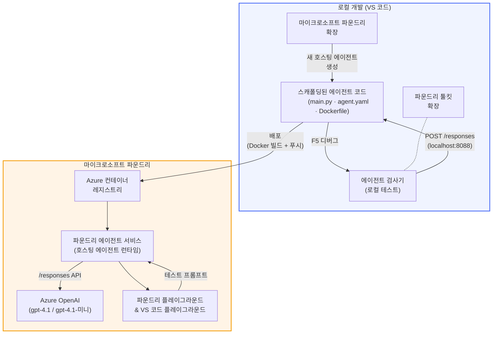

# Foundry Toolkit + Foundry Hosted Agents 워크숍

[](https://www.python.org/)
[](https://github.com/microsoft/agents)
[](https://learn.microsoft.com/azure/ai-foundry/agents/concepts/hosted-agents/)
[](https://ai.azure.com/)
[](https://learn.microsoft.com/azure/ai-services/openai/)
[](https://learn.microsoft.com/cli/azure/install-azure-cli)
[](https://learn.microsoft.com/azure/developer/azure-developer-cli/install-azd)
[](https://www.docker.com/)
[](https://marketplace.visualstudio.com/items?itemName=ms-windows-ai-studio.windows-ai-studio)
[](LICENSE)

VS Code에서 <strong>Microsoft Foundry 확장</strong>과 <strong>Foundry Toolkit</strong>을 사용하여 AI 에이전트를 <strong>Microsoft Foundry Agent Service</strong>의 <strong>Hosted Agents</strong>로 빌드, 테스트 및 배포하세요.

> **Hosted Agents는 현재 미리보기 상태입니다.** 지원되는 지역이 제한적이니 [지역 가용성](https://learn.microsoft.com/azure/foundry/agents/concepts/hosted-agents#region-availability)을 참조하세요.

> 각 실습 내 `agent/` 폴더는 <strong>Foundry 확장 프로그램에 의해 자동으로 스캐폴딩</strong>되며, 이후 코드를 사용자 정의하고, 로컬에서 테스트한 후 배포합니다.

### 🌐 다중 언어 지원

#### GitHub Action을 통해 지원 (자동화 및 항상 최신 상태 유지)

<!-- CO-OP TRANSLATOR LANGUAGES TABLE START -->
[Arabic](../ar/README.md) | [Bengali](../bn/README.md) | [Bulgarian](../bg/README.md) | [Burmese (Myanmar)](../my/README.md) | [Chinese (Simplified)](../zh-CN/README.md) | [Chinese (Traditional, Hong Kong)](../zh-HK/README.md) | [Chinese (Traditional, Macau)](../zh-MO/README.md) | [Chinese (Traditional, Taiwan)](../zh-TW/README.md) | [Croatian](../hr/README.md) | [Czech](../cs/README.md) | [Danish](../da/README.md) | [Dutch](../nl/README.md) | [Estonian](../et/README.md) | [Finnish](../fi/README.md) | [French](../fr/README.md) | [German](../de/README.md) | [Greek](../el/README.md) | [Hebrew](../he/README.md) | [Hindi](../hi/README.md) | [Hungarian](../hu/README.md) | [Indonesian](../id/README.md) | [Italian](../it/README.md) | [Japanese](../ja/README.md) | [Kannada](../kn/README.md) | [Khmer](../km/README.md) | [Korean](./README.md) | [Lithuanian](../lt/README.md) | [Malay](../ms/README.md) | [Malayalam](../ml/README.md) | [Marathi](../mr/README.md) | [Nepali](../ne/README.md) | [Nigerian Pidgin](../pcm/README.md) | [Norwegian](../no/README.md) | [Persian (Farsi)](../fa/README.md) | [Polish](../pl/README.md) | [Portuguese (Brazil)](../pt-BR/README.md) | [Portuguese (Portugal)](../pt-PT/README.md) | [Punjabi (Gurmukhi)](../pa/README.md) | [Romanian](../ro/README.md) | [Russian](../ru/README.md) | [Serbian (Cyrillic)](../sr/README.md) | [Slovak](../sk/README.md) | [Slovenian](../sl/README.md) | [Spanish](../es/README.md) | [Swahili](../sw/README.md) | [Swedish](../sv/README.md) | [Tagalog (Filipino)](../tl/README.md) | [Tamil](../ta/README.md) | [Telugu](../te/README.md) | [Thai](../th/README.md) | [Turkish](../tr/README.md) | [Ukrainian](../uk/README.md) | [Urdu](../ur/README.md) | [Vietnamese](../vi/README.md)

> **로컬 복제 선호하시나요?**
>
> 이 저장소는 50개 이상의 언어 번역을 포함하고 있어 다운로드 크기가 크게 증가합니다. 번역 없이 복제하려면 sparse checkout을 사용하세요:
>
> **Bash / macOS / Linux:**
> ```bash
> git clone --filter=blob:none --sparse https://github.com/microsoft-foundry/Foundry_Toolkit_for_VSCode_Lab.git
> cd Foundry_Toolkit_for_VSCode_Lab
> git sparse-checkout set --no-cone '/*' '!translations' '!translated_images'
> ```
>
> **CMD (Windows):**
> ```cmd
> git clone --filter=blob:none --sparse https://github.com/microsoft-foundry/Foundry_Toolkit_for_VSCode_Lab.git
> cd Foundry_Toolkit_for_VSCode_Lab
> git sparse-checkout set --no-cone "/*" "!translations" "!translated_images"
> ```
>
> 코스를 완료하는 데 필요한 모든 것을 훨씬 빠른 다운로드 속도로 받을 수 있습니다.
<!-- CO-OP TRANSLATOR LANGUAGES TABLE END -->

---

## 아키텍처


**흐름:** Foundry 확장이 에이전트를 스캐폴딩 → 코딩 및 지침을 사용자 정의 → Agent Inspector로 로컬 테스트 → Foundry에 배포 (Docker 이미지가 ACR에 푸시됨) → Playground에서 검증.

---

## 만들게 될 것

| 실습 | 설명 | 상태 |
|-----|-------------|--------|
| **Lab 01 - 단일 에이전트** | <strong>"경영진에게 설명하기" 에이전트</strong>를 빌드하고 로컬 테스트 후 Foundry에 배포 | ✅ 사용 가능 |
| **Lab 02 - 다중 에이전트 워크플로** | 4명의 에이전트가 협업하여 이력서 적합도를 평가하고 학습 로드맵을 생성하는 **"이력서 → 직무 적합도 평가기"** 빌드 | ✅ 사용 가능 |

---

## 경영진 에이전트 만나보기

이번 워크숍에서는 <strong>"경영진에게 설명하기" 에이전트</strong>를 구축합니다 - 복잡한 기술 용어를 차분하고 이사회 회의에 적합한 요약으로 번역하는 AI 에이전트입니다. 솔직히 C-레벨 경영진 누구도 "v3.2에서 도입된 동기 호출로 인한 스레드 풀 소진" 이야기는 듣고 싶어 하지 않으니까요.

이 에이전트는 완벽하게 작성한 사후 분석 보고서에 <em>"그래서... 사이트가 다운된 건가요?"</em>라는 반응을 너무 많이 받아서 만들었습니다.

### 작동 방식

기술 업데이트를 입력하면 에이전트가 경영진 요약을 제공합니다 - 3개의 핵심 사항으로, 전문 용어나 스택 트레이스, 불안감 없이, 단순히 **무슨 일이 있었는지**, **비즈니스 영향**, 그리고 <strong>다음 단계</strong>만 전달합니다.

### 작동 예시

**당신이 말하면:**
> "API 지연이 v3.2에서 도입된 동기 호출로 인한 스레드 풀 소진 때문에 증가했습니다."

**에이전트가 대답합니다:**

> **경영진 요약:**
> - **무슨 일이 있었는가:** 최신 릴리스 후 시스템이 느려졌습니다.
> - **비즈니스 영향:** 일부 사용자가 서비스 이용 시 지연을 경험했습니다.
> - **다음 단계:** 변경 사항을 롤백했으며 재배포 전에 수정 작업을 준비 중입니다.

### 이 에이전트를 선택한 이유

복잡한 도구 체인에 빠지기 없이 호스티드 에이전트 워크플로를 처음부터 끝까지 배우기에 완벽한 단일 목적의 매우 단순한 에이전트이기 때문입니다. 솔직히 말해 모든 엔지니어링 팀에 이런 에이전트가 한 명쯤 있으면 좋겠죠.

---

## 워크숍 구조

```
📂 Foundry_Toolkit_for_VSCode_Lab/
├── 📄 README.md                      ← You are here
├── 📂 ExecutiveAgent/                ← Standalone hosted agent project
│   ├── agent.yaml
│   ├── Dockerfile
│   ├── main.py
│   └── requirements.txt
└── 📂 workshop/
    ├── 📂 lab01-single-agent/        ← Full lab: docs + agent code
    │   ├── README.md                 ← Hands-on lab instructions
    │   ├── 📂 docs/                  ← Step-by-step tutorial modules
    │   │   ├── 00-prerequisites.md
    │   │   ├── 01-install-foundry-toolkit.md
    │   │   ├── 02-create-foundry-project.md
    │   │   ├── 03-create-hosted-agent.md
    │   │   ├── 04-configure-and-code.md
    │   │   ├── 05-test-locally.md
    │   │   ├── 06-deploy-to-foundry.md
    │   │   ├── 07-verify-in-playground.md
    │   │   └── 08-troubleshooting.md
    │   └── 📂 agent/                 ← Reference solution (auto-scaffolded by Foundry extension)
    │       ├── agent.yaml
    │       ├── Dockerfile
    │       ├── main.py
    │       └── requirements.txt
    └── 📂 lab02-multi-agent/         ← Resume → Job Fit Evaluator
        ├── README.md                 ← Hands-on lab instructions (end-to-end)
        ├── 📂 docs/                  ← Step-by-step tutorial modules
        │   ├── 00-prerequisites.md
        │   ├── 01-understand-multi-agent.md
        │   ├── 02-scaffold-multi-agent.md
        │   ├── 03-configure-agents.md
        │   ├── 04-orchestration-patterns.md
        │   ├── 05-test-locally.md
        │   ├── 06-deploy-to-foundry.md
        │   ├── 07-verify-in-playground.md
        │   └── 08-troubleshooting.md
        └── 📂 PersonalCareerCopilot/ ← Reference solution (multi-agent workflow)
            ├── agent.yaml
            ├── Dockerfile
            ├── main.py
            └── requirements.txt
```

> **참고:** 각 실습 내 `agent/` 폴더는 명령 팔레트에서 `Microsoft Foundry: Create a New Hosted Agent`를 실행할 때 <strong>Microsoft Foundry 확장</strong>이 생성합니다. 이후 에이전트 지침, 도구 및 구성을 맞춤 설정합니다. Lab 01은 이를 처음부터 재현하는 과정을 안내합니다.

---

## 시작하기

### 1. 저장소 복제하기

```bash
git clone https://github.com/microsoft-foundry/Foundry_Toolkit_for_VSCode_Lab.git
cd Foundry_Toolkit_for_VSCode_Lab
```

### 2. Python 가상 환경 설정하기

```bash
python -m venv venv
```

활성화하기:

- **Windows (PowerShell):**
  ```powershell
  .\venv\Scripts\Activate.ps1
  ```
- **macOS / Linux:**
  ```bash
  source venv/bin/activate
  ```

### 3. 의존성 설치하기

```bash
pip install -r workshop/lab01-single-agent/agent/requirements.txt
```

### 4. 환경 변수 구성하기

에이전트 폴더 내 예제 `.env` 파일을 복사 후 값을 채우세요:

```bash
cp workshop/lab01-single-agent/agent/.env.example workshop/lab01-single-agent/agent/.env
```

`workshop/lab01-single-agent/agent/.env` 편집:

```env
AZURE_AI_PROJECT_ENDPOINT=https://<your-account>.services.ai.azure.com/api/projects/<your-project>
MODEL_DEPLOYMENT_NAME=<your-model-deployment-name>
```

### 5. 워크숍 실습 따라하기

각 실습은 자체 모듈로 구성되어 있습니다. 기본기를 배우려면 <strong>Lab 01</strong>부터 시작하고, 이후 다중 에이전트 워크플로는 <strong>Lab 02</strong>를 진행하세요.

#### Lab 01 - 단일 에이전트 ([전체 지침](workshop/lab01-single-agent/README.md))

| # | 모듈 | 링크 |
|---|--------|------|
| 1 | 사전 준비 사항 읽기 | [00-prerequisites.md](workshop/lab01-single-agent/docs/00-prerequisites.md) |
| 2 | Foundry Toolkit 및 Foundry 확장 설치 | [01-install-foundry-toolkit.md](workshop/lab01-single-agent/docs/01-install-foundry-toolkit.md) |
| 3 | Foundry 프로젝트 만들기 | [02-create-foundry-project.md](workshop/lab01-single-agent/docs/02-create-foundry-project.md) |
| 4 | 호스티드 에이전트 생성 | [03-create-hosted-agent.md](workshop/lab01-single-agent/docs/03-create-hosted-agent.md) |
| 5 | 지침 및 환경 구성하기 | [04-configure-and-code.md](workshop/lab01-single-agent/docs/04-configure-and-code.md) |
| 6 | 로컬 테스트 | [05-test-locally.md](workshop/lab01-single-agent/docs/05-test-locally.md) |
| 7 | Foundry에 배포 | [06-deploy-to-foundry.md](workshop/lab01-single-agent/docs/06-deploy-to-foundry.md) |
| 8 | 플레이그라운드에서 검증 | [07-verify-in-playground.md](workshop/lab01-single-agent/docs/07-verify-in-playground.md) |
| 9 | 문제 해결 | [08-troubleshooting.md](workshop/lab01-single-agent/docs/08-troubleshooting.md) |

#### Lab 02 - 다중 에이전트 워크플로 ([전체 지침](workshop/lab02-multi-agent/README.md))

| # | 모듈 | 링크 |
|---|--------|------|
| 1 | 사전 준비 사항 (Lab 02) | [00-prerequisites.md](workshop/lab02-multi-agent/docs/00-prerequisites.md) |
| 2 | 다중 에이전트 아키텍처 이해 | [01-understand-multi-agent.md](workshop/lab02-multi-agent/docs/01-understand-multi-agent.md) |
| 3 | 다중 에이전트 프로젝트 스캐폴딩 | [02-scaffold-multi-agent.md](workshop/lab02-multi-agent/docs/02-scaffold-multi-agent.md) |
| 4 | 에이전트 및 환경 구성 | [03-configure-agents.md](workshop/lab02-multi-agent/docs/03-configure-agents.md) |
| 5 | 오케스트레이션 패턴 | [04-orchestration-patterns.md](workshop/lab02-multi-agent/docs/04-orchestration-patterns.md) |
| 6 | 로컬 테스트 (다중 에이전트) | [05-test-locally.md](workshop/lab02-multi-agent/docs/05-test-locally.md) |
| 7 | Foundry에 배포 | [06-deploy-to-foundry.md](workshop/lab02-multi-agent/docs/06-deploy-to-foundry.md) |
| 8 | 플레이그라운드에서 확인 | [07-verify-in-playground.md](workshop/lab02-multi-agent/docs/07-verify-in-playground.md) |
| 9 | 문제 해결 (멀티 에이전트) | [08-troubleshooting.md](workshop/lab02-multi-agent/docs/08-troubleshooting.md) |

---

## 유지 관리자

<table>
<tr>
    <td align="center"><a href="https://github.com/ShivamGoyal03">
        <br />
        <sub><b>Shivam Goyal</b></sub>
    </a><br />
    </td>
</tr>
</table>

---

## 필요한 권한 (빠른 참고)

| 시나리오 | 필요한 역할 |
|----------|---------------|
| 새 Foundry 프로젝트 생성 | Foundry 리소스의 **Azure AI Owner** |
| 기존 프로젝트에 배포 (새 리소스) | 구독에 대한 **Azure AI Owner** + **Contributor** |
| 완전히 구성된 프로젝트에 배포 | 계정에 대한 **Reader** + 프로젝트에 대한 **Azure AI User** |

> **중요:** Azure `Owner` 및 `Contributor` 역할은 <em>관리</em> 권한만 포함하며 <em>개발</em> (데이터 작업) 권한은 포함하지 않습니다. 에이전트를 빌드하고 배포하려면 **Azure AI User** 또는 <strong>Azure AI Owner</strong>가 필요합니다.

---

## 참고 문서

- [빠른 시작: 첫 호스팅 에이전트 배포 (VS Code)](https://learn.microsoft.com/azure/foundry/agents/quickstarts/quickstart-hosted-agent)
- [호스팅 에이전트란 무엇인가?](https://learn.microsoft.com/azure/foundry/agents/concepts/hosted-agents)
- [VS Code에서 호스팅 에이전트 워크플로 생성](https://learn.microsoft.com/azure/foundry/agents/how-to/vs-code-agents-workflow-pro-code)
- [호스팅 에이전트 배포](https://learn.microsoft.com/azure/foundry/agents/how-to/deploy-hosted-agent)
- [Microsoft Foundry의 RBAC](https://learn.microsoft.com/azure/foundry/concepts/rbac-foundry)
- [아키텍처 리뷰 에이전트 샘플](https://github.com/Azure-Samples/agent-architecture-review-sample) - MCP 도구, Excalidraw 다이어그램 및 이중 배포가 포함된 실제 호스팅 에이전트

---

## 라이선스

[MIT](../../LICENSE)

---

<!-- CO-OP TRANSLATOR DISCLAIMER START -->
**면책 조항**:  
이 문서는 AI 번역 서비스 [Co-op Translator](https://github.com/Azure/co-op-translator)를 사용하여 번역되었습니다. 정확성을 위해 최선을 다하고 있으나, 자동 번역에는 오류나 부정확성이 포함될 수 있음을 양지하시기 바랍니다. 원본 문서의 원어 버전을 권위 있는 자료로 간주해야 합니다. 중요한 정보의 경우에는 전문적인 인간 번역을 권장합니다. 본 번역 사용으로 인한 오해나 잘못된 해석에 대해 당사는 책임을 지지 않습니다.
<!-- CO-OP TRANSLATOR DISCLAIMER END -->