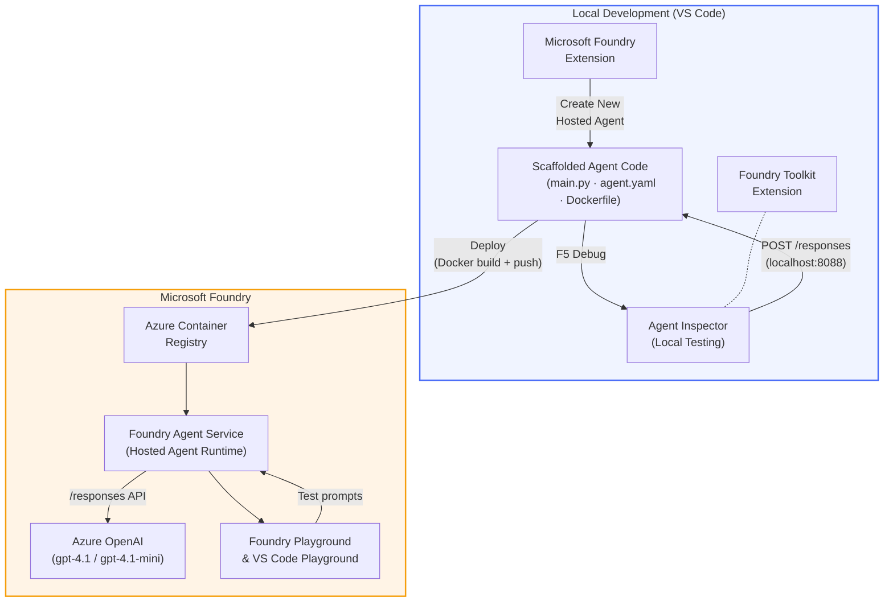

# Foundry Toolkit + Foundry Hosted Agents 워크숍

[](https://www.python.org/)
[](https://learn.microsoft.com/agent-framework/)
[](https://learn.microsoft.com/azure/foundry/agents/concepts/hosted-agents)
[](https://ai.azure.com/)
[](https://learn.microsoft.com/azure/ai-services/openai/)
[](https://learn.microsoft.com/cli/azure/install-azure-cli)
[](https://learn.microsoft.com/azure/developer/azure-developer-cli/install-azd)
[](https://www.docker.com/)
[](https://marketplace.visualstudio.com/items?itemName=ms-windows-ai-studio.windows-ai-studio)
[](LICENSE)

<strong>Microsoft Foundry Agent Service</strong>에 AI 에이전트를 <strong>Hosted Agents</strong>로 빌드, 테스트, 배포 - VS Code에서 <strong>Microsoft Foundry 확장</strong>과 <strong>Foundry Toolkit</strong>을 사용하여 완전히 수행합니다.

> **Hosted Agents는 현재 미리 보기 상태입니다.** 지원되는 지역이 제한적입니다 - [지역 지원 현황](https://learn.microsoft.com/azure/foundry/agents/concepts/hosted-agents#region-availability)을 참조하세요.

> 각 실습의 `agent/` 폴더는 Foundry 확장에 의해 <strong>자동으로 생성</strong>됩니다 - 이후 코드를 사용자 정의하고, 로컬에서 테스트하며, 배포합니다.

### 🌐 다국어 지원

#### GitHub Action을 통한 지원 (자동화 및 항상 최신)

<!-- CO-OP TRANSLATOR LANGUAGES TABLE START -->
[Arabic](../ar/README.md) | [Bengali](../bn/README.md) | [Bulgarian](../bg/README.md) | [Burmese (Myanmar)](../my/README.md) | [Chinese (Simplified)](../zh-CN/README.md) | [Chinese (Traditional, Hong Kong)](../zh-HK/README.md) | [Chinese (Traditional, Macau)](../zh-MO/README.md) | [Chinese (Traditional, Taiwan)](../zh-TW/README.md) | [Croatian](../hr/README.md) | [Czech](../cs/README.md) | [Danish](../da/README.md) | [Dutch](../nl/README.md) | [Estonian](../et/README.md) | [Finnish](../fi/README.md) | [French](../fr/README.md) | [German](../de/README.md) | [Greek](../el/README.md) | [Hebrew](../he/README.md) | [Hindi](../hi/README.md) | [Hungarian](../hu/README.md) | [Indonesian](../id/README.md) | [Italian](../it/README.md) | [Japanese](../ja/README.md) | [Kannada](../kn/README.md) | [Khmer](../km/README.md) | [Korean](./README.md) | [Lithuanian](../lt/README.md) | [Malay](../ms/README.md) | [Malayalam](../ml/README.md) | [Marathi](../mr/README.md) | [Nepali](../ne/README.md) | [Nigerian Pidgin](../pcm/README.md) | [Norwegian](../no/README.md) | [Persian (Farsi)](../fa/README.md) | [Polish](../pl/README.md) | [Portuguese (Brazil)](../pt-BR/README.md) | [Portuguese (Portugal)](../pt-PT/README.md) | [Punjabi (Gurmukhi)](../pa/README.md) | [Romanian](../ro/README.md) | [Russian](../ru/README.md) | [Serbian (Cyrillic)](../sr/README.md) | [Slovak](../sk/README.md) | [Slovenian](../sl/README.md) | [Spanish](../es/README.md) | [Swahili](../sw/README.md) | [Swedish](../sv/README.md) | [Tagalog (Filipino)](../tl/README.md) | [Tamil](../ta/README.md) | [Telugu](../te/README.md) | [Thai](../th/README.md) | [Turkish](../tr/README.md) | [Ukrainian](../uk/README.md) | [Urdu](../ur/README.md) | [Vietnamese](../vi/README.md)

> **로컬에서 클론하는 것을 선호하십니까?**
>
> 이 저장소에는 50개 이상의 언어 번역이 포함되어 있어 다운로드 크기가 상당히 커집니다. 번역 없이 클론하려면 sparse checkout을 사용하세요:
>
> **Bash / macOS / Linux:**
> ```bash
> git clone --filter=blob:none --sparse https://github.com/microsoft-foundry/Foundry_Toolkit_for_VSCode_Lab.git
> cd Foundry_Toolkit_for_VSCode_Lab
> git sparse-checkout set --no-cone '/*' '!translations' '!translated_images'
> ```
>
> **CMD (Windows):**
> ```cmd
> git clone --filter=blob:none --sparse https://github.com/microsoft-foundry/Foundry_Toolkit_for_VSCode_Lab.git
> cd Foundry_Toolkit_for_VSCode_Lab
> git sparse-checkout set --no-cone "/*" "!translations" "!translated_images"
> ```
>
> 이 방법으로 훨씬 빠른 다운로드로 코스 완료에 필요한 모든 것을 얻을 수 있습니다.
<!-- CO-OP TRANSLATOR LANGUAGES TABLE END -->

---

## 아키텍처


```mermaid
flowchart TB
    subgraph Local["Local Development (VS Code)"]
        direction TB
        FE["Microsoft Foundry
        Extension"]
        FoundryToolkit["Foundry Toolkit
        Extension"]
        Scaffold["Scaffolded Agent Code
        (main.py · agent.yaml · Dockerfile)"]
        Inspector["Agent Inspector
        (Local Testing)"]
        FE -- "Create New
        Hosted Agent" --> Scaffold
        Scaffold -- "F5 Debug" --> Inspector
        FoundryToolkit -.- Inspector
    end

    subgraph Cloud["Microsoft Foundry"]
        direction TB
        ACR["Azure Container
        Registry"]
        AgentService["Foundry Agent Service
        (Hosted Agent Runtime)"]
        Model["Azure OpenAI
        (gpt-4.1 / gpt-4.1-mini)"]
        Playground["Foundry Playground
        & VS Code Playground"]
        ACR --> AgentService
        AgentService -- "/responses API" --> Model
        AgentService --> Playground
    end

    Scaffold -- "Deploy
    (Docker build + push)" --> ACR
    Inspector -- "POST /responses
    (localhost:8088)" --> Scaffold
    Playground -- "Test prompts" --> AgentService

    style Local fill:#f0f4ff,stroke:#4a6cf7,stroke-width:2px
    style Cloud fill:#fff4e6,stroke:#f59e0b,stroke-width:2px
```

**흐름:** Foundry 확장이 에이전트를 생성 → 코드 및 지침을 커스터마이즈 → Agent Inspector로 로컬 테스트 → Foundry에 배포 (Docker 이미지가 ACR에 푸시됨) → Playground에서 검증.

---

## 만들게 될 내용

| 실습 | 설명 | 상태 |
|-----|-------------|--------|
| **실습 01 - 단일 에이전트** | <strong>"임원에게 설명하기" 에이전트</strong>를 빌드, 로컬 테스트 후 Foundry에 배포 | ✅ 사용 가능 |
| **실습 02 - 다중 에이전트 워크플로우** | **"이력서 → 직무 적합도 평가자"** 구축 - 4개의 에이전트가 협력하여 이력서 적합도를 평가하고 학습 로드맵 생성 | ✅ 사용 가능 |

---

## 임원 에이전트 소개

이번 워크숍에서는 <strong>"임원에게 설명하기" 에이전트</strong>를 만듭니다 - 복잡한 기술 전문 용어를 차분하고 이사회 회의에 적합한 요약으로 바꾸는 AI 에이전트입니다. 솔직히 말해 C-레벨 경영진 누구도 "v3.2에 도입된 동기식 호출로 인한 스레드 풀 소진" 같은 이야기를 듣고 싶어 하지 않으니까요.

한 번은 완벽하게 작성한 사후 분석 보고서가 <em>"그래서... 웹사이트가 다운된 건가요, 아닌가요?"</em>라는 반응을 받아 이 에이전트를 만들게 되었습니다.

### 작동 방식

기술 업데이트를 입력하면, 에이전트가 임원 요약을 출력합니다 - 3가지 핵심 사항으로, 전문 용어, 스택 트레이스, 불안 없이. 단지 **무슨 일이 있었는지**, **비즈니스 영향**, <strong>다음 단계</strong>만 전달합니다.

### 실제 예시

**입력:**
> "v3.2에 도입된 동기식 호출로 인한 스레드 풀 소진 때문에 API 지연 시간이 증가했습니다."

**에이전트 답변:**

> **임원 요약:**
> - **무슨 일이 있었나:** 최신 릴리스 이후 시스템이 느려졌습니다.
> - **비즈니스 영향:** 일부 사용자가 서비스 이용 시 지연을 경험했습니다.
> - **다음 단계:** 변경 사항을 롤백하고 재배포 전에 수정 작업을 준비 중입니다.

### 왜 이 에이전트인가요?

이 에이전트는 매우 단순하고 단일 목적입니다 - 복잡한 툴체인에 빠지지 않고 호스티드 에이전트 워크플로우 전 과정을 배우기에 완벽합니다. 그리고 솔직히 말해 모든 엔지니어링 팀에 하나쯤 있으면 좋을 에이전트입니다.

---

## 워크숍 구성

```
📂 Foundry_Toolkit_for_VSCode_Lab/
├── 📄 README.md                      ← You are here
└── 📂 workshop/
    ├── 📂 lab01-single-agent/        ← Full lab: docs + agent code
    │   ├── README.md                 ← Hands-on lab instructions
    │   ├── 📂 docs/                  ← Step-by-step tutorial modules
    │   │   ├── 00-prerequisites.md
    │   │   ├── 01-setup.md
    │   │   ├── 02-create-hosted-agent.md
    │   │   ├── 03-configure-and-code.md
    │   │   ├── 04-test-locally.md
    │   │   ├── 05-deploy-to-foundry.md
    │   │   ├── 06-verify-in-playground.md
    │   │   ├── 07-summary.md
    │   │   └── 08-troubleshooting.md
    │   └── 📂 agent/                 ← Reference solution (auto-scaffolded by Foundry extension)
    │       ├── agent.yaml
    │       ├── Dockerfile
    │       ├── main.py
    │       └── requirements.txt
    └── 📂 lab02-multi-agent/         ← Resume → Job Fit Evaluator
        ├── README.md                 ← Hands-on lab instructions (end-to-end)
        ├── 📂 docs/                  ← Step-by-step tutorial modules
        │   ├── 00-prerequisites.md
        │   ├── 01-understand-multi-agent.md
        │   ├── 02-scaffold-multi-agent.md
        │   ├── 03-configure-agents.md
        │   ├── 04-orchestration-patterns.md
        │   ├── 05-test-locally.md
        │   ├── 06-deploy-to-foundry.md
        │   ├── 07-verify-in-playground.md
        │   ├── 08-troubleshooting.md
        │   └── 09-summary.md
        └── 📂 PersonalCareerCopilot/ ← Reference solution (multi-agent workflow)
            ├── agent.yaml
            ├── Dockerfile
            ├── main.py
            └── requirements.txt
```

> **참고:** 각 실습의 `agent/` 폴더는 <strong>Microsoft Foundry 확장</strong>이 Command Palette에서 `Microsoft Foundry: Create a New Hosted Agent` 실행 시 생성합니다. 이후 에이전트의 지침, 도구, 구성이 반영되도록 파일을 커스터마이즈합니다. 실습 01에서는 이를 처음부터 재현하는 방법을 안내합니다.

---

## 시작하기

### 1. 저장소 클론하기

```bash
git clone https://github.com/microsoft-foundry/Foundry_Toolkit_for_VSCode_Lab.git
cd Foundry_Toolkit_for_VSCode_Lab
```

### 2. Python 가상 환경 설정

```bash
python -m venv venv
```

활성화하기:

- **Windows (PowerShell):**
  ```powershell
  .\venv\Scripts\Activate.ps1
  ```
- **macOS / Linux:**
  ```bash
  source venv/bin/activate
  ```

### 3. 의존성 설치

```bash
pip install -r workshop/lab01-single-agent/agent/requirements.txt
```

### 4. 환경 변수 구성

에이전트 폴더 내 예시 `.env` 파일을 복사하고 값을 입력하세요:

```bash
cp workshop/lab01-single-agent/agent/.env.example workshop/lab01-single-agent/agent/.env
```

`workshop/lab01-single-agent/agent/.env` 파일 수정:

```env
FOUNDRY_PROJECT_ENDPOINT=https://<your-account>.services.ai.azure.com/api/projects/<your-project>
AZURE_AI_MODEL_DEPLOYMENT_NAME=<your-model-deployment-name>
```

### 5. 워크숍 실습 따라하기

각 실습은 자체 모듈을 포함한 독립적인 구성입니다. 기본 사항을 배우려면 **실습 01** 부터 시작하고, 다중 에이전트 워크플로우는 <strong>실습 02</strong>로 진행하세요.

#### 실습 01 - 단일 에이전트 ([전체 안내](workshop/lab01-single-agent/README.md))

| # | 모듈 | 링크 |
|---|--------|------|
| 1 | 필수 조건 읽기 | [00-prerequisites.md](workshop/lab01-single-agent/docs/00-prerequisites.md) |
| 2 | Foundry Toolkit 및 Foundry 확장 설치 | [01-setup.md](workshop/lab01-single-agent/docs/01-setup.md) |
| 3 | Foundry 프로젝트 생성 | [01-setup.md](workshop/lab01-single-agent/docs/01-setup.md) |
| 4 | 호스티드 에이전트 생성 | [02-create-hosted-agent.md](workshop/lab01-single-agent/docs/02-create-hosted-agent.md) |
| 5 | 지침 및 환경 구성 | [03-configure-and-code.md](workshop/lab01-single-agent/docs/03-configure-and-code.md) |
| 6 | 로컬 테스트 | [04-test-locally.md](workshop/lab01-single-agent/docs/04-test-locally.md) |
| 7 | Foundry에 배포 | [05-deploy-to-foundry.md](workshop/lab01-single-agent/docs/05-deploy-to-foundry.md) |
| 8 | Playground에서 검증 | [06-verify-in-playground.md](workshop/lab01-single-agent/docs/06-verify-in-playground.md) |
| 9 | 요약 및 다음 단계 | [07-summary.md](workshop/lab01-single-agent/docs/07-summary.md) |
| 10 | 문제 해결 | [08-troubleshooting.md](workshop/lab01-single-agent/docs/08-troubleshooting.md) |

#### 실습 02 - 다중 에이전트 워크플로우 ([전체 안내](workshop/lab02-multi-agent/README.md))

| # | 모듈 | 링크 |
|---|--------|------|
| 1 | 필수 조건 (실습 02) | [00-prerequisites.md](workshop/lab02-multi-agent/docs/00-prerequisites.md) |
| 2 | 다중 에이전트 아키텍처 이해 | [01-understand-multi-agent.md](workshop/lab02-multi-agent/docs/01-understand-multi-agent.md) |
| 3 | 다중 에이전트 프로젝트 생성 | [02-scaffold-multi-agent.md](workshop/lab02-multi-agent/docs/02-scaffold-multi-agent.md) |
| 4 | 에이전트 및 환경 구성 | [03-configure-agents.md](workshop/lab02-multi-agent/docs/03-configure-agents.md) |
| 5 | 오케스트레이션 패턴 | [04-orchestration-patterns.md](workshop/lab02-multi-agent/docs/04-orchestration-patterns.md) |
| 6 | 로컬 테스트 (다중 에이전트) | [05-test-locally.md](workshop/lab02-multi-agent/docs/05-test-locally.md) |
| 7 | Foundry에 배포 | [06-deploy-to-foundry.md](workshop/lab02-multi-agent/docs/06-deploy-to-foundry.md) |
| 8 | Playground에서 검증 | [07-verify-in-playground.md](workshop/lab02-multi-agent/docs/07-verify-in-playground.md) |
| 9 | 문제 해결 (다중 에이전트) | [08-troubleshooting.md](workshop/lab02-multi-agent/docs/08-troubleshooting.md) |
| 10 | 요약 및 다음 단계 | [09-summary.md](workshop/lab02-multi-agent/docs/09-summary.md) |

---

## 유지보수 담당자

<table>
<tr>
    <td align="center"><a href="https://github.com/ShivamGoyal03">
        <br />
        <sub><b>Shivam Goyal</b></sub>
    </a><br />
    </td>
</tr>
</table>

---

## 필요한 권한 (빠른 참고)

| 시나리오 | 필요한 역할 |
|----------|---------------|
| 새로운 Foundry 프로젝트 생성 | Foundry 리소스에 대한 **Azure AI 소유자** 역할 |
| 기존 프로젝트에 배포 (신규 리소스 포함) | 구독에 대한 **Azure AI 소유자** + <strong>기여자</strong> 역할 |
| 완전히 구성된 프로젝트에 배포 | 계정에 대한 **읽기 권한자** + 프로젝트에 대한 **Azure AI 사용자** 역할 |

> **중요:** Azure `Owner` 및 `Contributor` 역할에는 <em>관리</em> 권한만 포함되며, <em>개발</em> (데이터 작업) 권한은 포함되지 않습니다. 에이전트를 빌드하고 배포하려면 **Azure AI 사용자** 또는 <strong>Azure AI 소유자</strong>가 필요합니다.

---

## 참조

- [빠른 시작: 첫 번째 호스팅 에이전트 배포 (VS 코드)](https://learn.microsoft.com/azure/foundry/agents/quickstarts/quickstart-hosted-agent)
- [호스팅 에이전트란 무엇입니까?](https://learn.microsoft.com/azure/foundry/agents/concepts/hosted-agents)
- [VS 코드에서 호스팅 에이전트 워크플로 만들기](https://learn.microsoft.com/azure/foundry/agents/how-to/vs-code-agents-workflow-pro-code)
- [호스팅 에이전트 배포](https://learn.microsoft.com/azure/foundry/agents/how-to/deploy-hosted-agent)
- [Microsoft Foundry의 RBAC](https://learn.microsoft.com/azure/foundry/concepts/rbac-foundry)
- [아키텍처 리뷰 에이전트 샘플](https://github.com/Azure-Samples/agent-architecture-review-sample) - MCP 도구, Excalidraw 다이어그램 및 이중 배포가 포함된 실제 호스팅 에이전트

---


## 라이선스

[MIT](../../LICENSE)

---

<!-- CO-OP TRANSLATOR DISCLAIMER START -->
**면책 조항**:
이 문서는 AI 번역 서비스 [Co-op Translator](https://github.com/Azure/co-op-translator)를 사용하여 번역되었습니다. 정확성을 기하기 위해 노력하고 있으나, 자동 번역은 오류나 부정확한 부분이 있을 수 있음을 유의하시기 바랍니다. 원본 문서의 원어본이 권위 있는 자료로 간주되어야 합니다. 중요한 정보의 경우, 전문가의 인간 번역을 권장합니다. 이 번역 사용으로 인해 발생하는 오해나 잘못된 해석에 대해 당사는 책임을 지지 않습니다.
<!-- CO-OP TRANSLATOR DISCLAIMER END -->