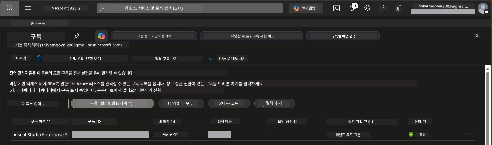

# Module 0 - 사전 준비 사항

워크숍을 시작하기 전에 다음 도구, 액세스 및 환경이 준비되어 있는지 확인하세요. 아래의 모든 단계를 따르세요 - 건너뛰지 마세요.

---

## 1. Azure 계정 및 구독

### 1.1 Azure 구독 생성 또는 확인

1. 브라우저를 열고 [https://azure.microsoft.com/free/](https://azure.microsoft.com/free/)로 이동합니다.
2. Azure 계정이 없다면 <strong>무료 시작</strong>을 클릭하고 가입 절차를 진행하세요. Microsoft 계정이 필요하며 (또는 새로 생성) 신원 확인을 위해 신용카드가 필요합니다.
3. 이미 계정이 있다면 [https://portal.azure.com](https://portal.azure.com)에서 로그인합니다.
4. 포털에서 왼쪽 탐색 메뉴의 **구독(Subscriptions)** 블레이드를 클릭하거나 상단 검색창에 "Subscriptions"를 입력합니다.
5. 최소 하나 이상의 **활성(Active)** 구독이 표시되는지 확인하세요. <strong>구독 ID(Subscription ID)</strong>를 메모해 두세요 - 나중에 필요합니다.



### 1.2 필요한 RBAC 역할 이해하기

[호스티드 에이전트](https://learn.microsoft.com/azure/foundry/agents/concepts/hosted-agents) 배포는 일반 Azure `소유자(Owner)` 및 `참여자(Contributor)` 역할에 포함되지 않은 **데이터 작업** 권한을 요구합니다. 아래 [역할 조합](https://learn.microsoft.com/azure/foundry/concepts/rbac-foundry#built-in-roles) 중 하나가 필요합니다:

| 시나리오 | 필요한 역할 | 할당 위치 |
|----------|-------------|-----------|
| 새 Foundry 프로젝트 생성 | Foundry 리소스에 대한 **Azure AI 소유자(Owner)** | Azure 포털의 Foundry 리소스 |
| 기존 프로젝트에 배포 (새 리소스) | 구독에 대한 **Azure AI 소유자(Owner)** + **참여자(Contributor)** | 구독 + Foundry 리소스 |
| 완전히 구성된 프로젝트에 배포 | 계정에 대한 **읽기 권한(Reader)** + 프로젝트에 대한 **Azure AI 사용자(User)** | Azure 포털의 계정 + 프로젝트 |

> **핵심 포인트:** Azure `소유자` 및 `참여자` 역할은 <em>관리</em> 권한(ARM 작업)만 포함합니다. `agents/write` 같은 <em>데이터 작업</em>을 수행하려면 [**Azure AI 사용자**](https://learn.microsoft.com/azure/foundry/concepts/rbac-foundry#built-in-roles) (또는 그 이상의 역할)이 필요합니다. 이 역할은 에이전트를 만들고 배포하는데 필요합니다. 해당 역할들은 [2단계](02-create-foundry-project.md)에서 할당합니다.

---

## 2. 로컬 도구 설치

아래 도구들을 각각 설치하세요. 설치 후, 작동 확인 명령어를 실행해 제대로 설치되었는지 검증하세요.

### 2.1 Visual Studio Code

1. [https://code.visualstudio.com/](https://code.visualstudio.com/)로 이동합니다.
2. 운영체제에 맞는 설치 프로그램(Windows/macOS/Linux)을 다운로드합니다.
3. 기본 설정으로 설치 프로그램을 실행합니다.
4. VS Code가 정상적으로 실행되는지 확인합니다.

### 2.2 Python 3.10 이상

1. [https://www.python.org/downloads/](https://www.python.org/downloads/)로 이동합니다.
2. Python 3.10 이상 버전을 다운로드합니다 (3.12 이상 권장).
3. **Windows:** 설치 시 첫 화면에서 **"Add Python to PATH"** 옵션을 체크합니다.
4. 터미널을 열고 다음을 확인합니다:

   ```powershell
   python --version
   ```

   예상 출력: `Python 3.10.x` 이상.

### 2.3 Azure CLI

1. [https://learn.microsoft.com/cli/azure/install-azure-cli](https://learn.microsoft.com/cli/azure/install-azure-cli)로 이동합니다.
2. 운영체제에 맞는 설치 지침을 따릅니다.
3. 설치 후 확인:

   ```powershell
   az --version
   ```

   예상: `azure-cli 2.80.0` 이상.

4. 로그인:

   ```powershell
   az login
   ```

### 2.4 Azure Developer CLI (azd)

1. [https://learn.microsoft.com/azure/developer/azure-developer-cli/install-azd](https://learn.microsoft.com/azure/developer/azure-developer-cli/install-azd)로 이동합니다.
2. 운영체제에 맞는 설치 지침을 따릅니다. Windows의 경우:

   ```powershell
   winget install microsoft.azd
   ```

3. 설치 후 확인:

   ```powershell
   azd version
   ```

   예상: `azd version 1.x.x` 이상.

4. 로그인:

   ```powershell
   azd auth login
   ```

### 2.5 Docker Desktop (선택 사항)

Docker는 배포 전에 컨테이너 이미지를 로컬에서 빌드하고 테스트하려는 경우에만 필요합니다. Foundry 확장 프로그램이 배포 중 컨테이너 빌드를 자동으로 처리합니다.

1. [https://docs.docker.com/get-docker/](https://docs.docker.com/get-docker/)로 이동합니다.
2. 운영체제에 맞는 Docker Desktop을 다운로드하여 설치합니다.
3. **Windows:** 설치 시 WSL 2 백엔드가 선택되었는지 확인하세요.
4. Docker Desktop을 시작시키고 시스템 트레이 아이콘에 **"Docker Desktop이 실행 중입니다"** 메시지가 표시될 때까지 기다립니다.
5. 터미널을 열고 다음을 확인합니다:

   ```powershell
   docker info
   ```

   오류 없이 Docker 시스템 정보가 출력되어야 합니다. `Cannot connect to the Docker daemon` 메시지가 나오면 Docker가 완전히 시작될 때까지 몇 초 더 기다리세요.

---

## 3. VS Code 확장 프로그램 설치

워크숍 시작 전에 아래 세 가지 확장을 설치하세요.

### 3.1 Microsoft Foundry for VS Code

1. VS Code를 엽니다.
2. `Ctrl+Shift+X`를 눌러 확장 패널을 엽니다.
3. 검색창에 <strong>"Microsoft Foundry"</strong>를 입력합니다.
4. **Microsoft Foundry for Visual Studio Code**(게시자: Microsoft, ID: `TeamsDevApp.vscode-ai-foundry`)를 찾습니다.
5. <strong>설치</strong>를 클릭합니다.
6. 설치가 완료되면 왼쪽 사이드바(활동 표시줄)에 **Microsoft Foundry** 아이콘이 나타납니다.

### 3.2 Foundry Toolkit

1. 확장 패널(`Ctrl+Shift+X`)에서 <strong>"Foundry Toolkit"</strong>을 검색합니다.
2. **Foundry Toolkit**(게시자: Microsoft, ID: `ms-windows-ai-studio.windows-ai-studio`)을 찾습니다.
3. <strong>설치</strong>를 클릭합니다.
4. **Foundry Toolkit** 아이콘이 활동 표시줄에 나타납니다.

### 3.3 Python

1. 확장 패널에서 <strong>"Python"</strong>을 검색합니다.
2. **Python**(게시자: Microsoft, ID: `ms-python.python`)을 찾습니다.
3. <strong>설치</strong>를 클릭합니다.

---

## 4. VS Code에서 Azure 로그인

[Microsoft Agent Framework](https://learn.microsoft.com/agent-framework/overview/)는 인증을 위해 [`DefaultAzureCredential`](https://learn.microsoft.com/azure/developer/python/sdk/authentication/credential-chains#defaultazurecredential-overview)를 사용합니다. VS Code에서 Azure에 로그인되어 있어야 합니다.

### 4.1 VS Code에서 로그인

1. VS Code 왼쪽 하단에 있는 **계정(Accounts)** 아이콘(사람형 실루엣)을 클릭합니다.
2. **Microsoft Foundry 사용을 위해 로그인**(또는 **Azure로 로그인**)을 클릭합니다.
3. 브라우저 창이 열리면 구독에 액세스할 수 있는 Azure 계정으로 로그인합니다.
4. VS Code로 돌아와 왼쪽 하단에 계정 이름이 표시되는지 확인합니다.

### 4.2 (선택 사항) Azure CLI로 로그인

Azure CLI를 설치했고 CLI 기반 인증을 선호하는 경우:

```powershell
az login
```

브라우저가 열려 로그인합니다. 로그인 후 올바른 구독을 설정합니다:

```powershell
az account set --subscription "<your-subscription-id>"
```

확인:

```powershell
az account show --query "{name:name, id:id, state:state}" --output table
```

구독 이름, ID, 상태가 `Enabled`로 표시되어야 합니다.

### 4.3 (대안) 서비스 주체 인증

CI/CD 또는 공유 환경에서는 대신 다음 환경 변수를 설정하세요:

```powershell
$env:AZURE_TENANT_ID = "<your-tenant-id>"
$env:AZURE_CLIENT_ID = "<your-client-id>"
$env:AZURE_CLIENT_SECRET = "<your-client-secret>"
```

---

## 5. 미리보기 한계 사항

진행하기 전에 다음 현재 한계 사항을 인지하세요:

- [**호스티드 에이전트**](https://learn.microsoft.com/azure/foundry/agents/concepts/hosted-agents)는 현재 **퍼블릭 프리뷰** 단계로, 프로덕션 워크로드에는 권장하지 않습니다.
- **지원되는 지역이 제한적임** - 리소스 생성 전에 [지역 가능 여부](https://learn.microsoft.com/azure/foundry/agents/concepts/hosted-agents#region-availability)를 확인하세요. 지원되지 않는 지역을 선택하면 배포가 실패합니다.
- `azure-ai-agentserver-agentframework` 패키지는 프리릴리스(`1.0.0b16`)이며 API가 변경될 수 있습니다.
- 스케일 제한: 호스티드 에이전트는 0-5 복제본(스케일 투 제로 포함)을 지원합니다.

---

## 6. 사전 점검 목록

아래 항목을 모두 점검하세요. 실패하는 단계가 있으면 계속 진행하지 말고 반드시 수정하세요.

- [ ] VS Code가 오류 없이 열림
- [ ] Python 3.10 이상이 PATH에 있음 (`python --version` 실행 시 `3.10.x` 이상 출력)
- [ ] Azure CLI가 설치됨 (`az --version` 실행 시 `2.80.0` 이상 출력)
- [ ] Azure Developer CLI가 설치됨 (`azd version` 실행 시 버전 정보 출력)
- [ ] Microsoft Foundry 확장 설치됨 (활동 표시줄에 아이콘 표시)
- [ ] Foundry Toolkit 확장 설치됨 (활동 표시줄에 아이콘 표시)
- [ ] Python 확장 설치됨
- [ ] VS Code에서 Azure에 로그인됨 (왼쪽 하단 계정 아이콘 확인)
- [ ] `az account show` 명령이 구독 정보를 반환함
- [ ] (선택 사항) Docker Desktop 실행 중 (`docker info` 명령 오류 없이 시스템 정보 출력)

### 점검 지점

VS Code 활동 표시줄에서 <strong>Foundry Toolkit</strong>과 **Microsoft Foundry** 두 사이드바 보기가 모두 보이는지 확인하세요. 각 항목을 클릭해 오류 없이 로드되는지도 확인합니다.

---

**다음:** [01 - Foundry Toolkit 및 Foundry 확장 설치 →](01-install-foundry-toolkit.md)

---

<!-- CO-OP TRANSLATOR DISCLAIMER START -->
**면책 조항**:  
이 문서는 AI 번역 서비스 [Co-op Translator](https://github.com/Azure/co-op-translator)를 사용하여 번역되었습니다. 정확성을 위해 노력하고 있지만, 자동 번역에는 오류나 부정확한 부분이 있을 수 있음을 유의하시기 바랍니다. 원문은 권위 있는 자료로 간주되어야 합니다. 중요한 정보의 경우 전문 인간 번역을 권장합니다. 본 번역 사용으로 인한 오해나 오해석에 대해 당사는 책임을 지지 않습니다.
<!-- CO-OP TRANSLATOR DISCLAIMER END -->