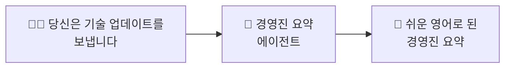

# 모듈 0 - 소개

⏱️ 약 10분

> [!WARNING]
> **미리보기 및 제한사항:** [호스티드 에이전트](https://learn.microsoft.com/azure/foundry/agents/concepts/hosted-agents)는 현재 **공개 미리보기** 단계에 있으며, 프로덕션 워크로드에는 권장되지 않습니다. 다음 사항에 유의하세요:
> - **지원되는 지역이 제한적입니다** - 리소스 생성 전에 [지역 가용성](https://learn.microsoft.com/azure/foundry/agents/concepts/hosted-agents#region-availability)을 확인하세요. 지원되지 않는 지역을 선택하면 배포가 실패합니다.
> - `azure-ai-agentserver-agentframework` 패키지는 프리릴리스로, 버전 간에 API가 변경될 수 있습니다.
> - 확장 한도: 호스티드 에이전트는 0~5개의 복제본을 지원합니다(제로 확장 포함).
> - 이 워크숍에 소개된 일부 기능은 서비스가 GA로 전환되면서 변경될 수 있습니다.

## 여러분이 만들 것

이 워크숍에서는 **"임원이 이해하기 쉽게 설명하는"** 에이전트를 만듭니다 - 복잡한 기술 업데이트를 평이한 영어 임원 요약으로 재작성하는 호스티드 AI 에이전트입니다.

```mermaid
flowchart LR
    A["🧑‍💻 당신은 기술 업데이트를\n보냅니다"] --> B["🤖 경영진 요약\n에이전트"]
    B --> C["📝 쉬운 영어로 된\n경영진 요약"]
```

**에이전트가 사용하는 것:**
- **Microsoft Agent Framework** - 에이전트 로직 및 구조용
- **Foundry Toolkit for VS Code** - 구조화, 로컬 테스트, 배포용
- **AI 모델** (예: `gpt-4.1-mini/gpt-5-mini`) - 요약 생성용

이 랩을 마치면 Agent Inspector를 통해 로컬에서 테스트할 수 있는 작동하는 에이전트가 완성되며, 필요시 클라우드에 배포할 수 있습니다.

---

## 호스티드 에이전트란?

<strong>호스티드 에이전트</strong>는 Microsoft Foundry에서 관리되는 서비스로 실행되는 AI 에이전트입니다. 자체 인프라를 관리하는 대신, 에이전트 코드를 컨테이너에 패키징하고 Foundry가 확장, 호스팅 및 표준 HTTP 엔드포인트를 통해 노출하는 것을 처리합니다.

| 개념 | 의미 |
|---------|--------------|
| <strong>에이전트</strong> | 사용자 메시지를 받아 AI 모델을 호출하고 구조화된 응답을 반환하는 Python 코드 |
| <strong>호스티드</strong> | Foundry가 컨테이너를 대신 실행 - VM, Kubernetes, 인프라 관리 불필요 |
| **응답 프로토콜** | 모든 클라이언트가 호출할 수 있는 표준 HTTP API (`POST /responses`) |
| **Agent Inspector** | 배포 전 에이전트와 채팅할 수 있는 로컬 테스트 UI (Foundry Toolkit 내장) |

이 워크숍에서 여러분은 0부터 완전히 호스티드된 에이전트를 만들거나, 로컬 테스트 단계에서 멈출 수 있습니다.

---

## 경로 선택

> ⚠️ **계속하기 전에 경로를 하나 선택하세요.** 선택에 따라 설치할 도구와 적용되는 모듈이 결정됩니다. 나중에 구독을 얻으면 경로 B에서 A로 변경할 수 있습니다.

<strong>🅰️ 경로 A - Azure 클라우드 (Azure 구독 필요)</strong>

| | 세부 정보 |
|---|---|
| **누구를 위한 것인가?** | 활성 Azure 구독이 있고 Foundry 리소스를 만들 수 있는 사용자 |
| <strong>모델</strong> | Foundry를 통한 Azure OpenAI (예: `gpt-4.1-mini/gpt-5-mini`) |
| **포함 모듈** | 모든 모듈 (00–07) |
| **클라우드 배포?** | ✅ 예 - 완전한 엔드-투-엔드 배포 |

<strong>🅱️ 경로 B - 로컬 / 무료 계층 (Azure 구독 불필요)</strong>

| | 세부 정보 |
|---|---|
| **누구를 위한 것인가?** | Azure 접근이 없는 MVP, 학생 또는 누구나 |
| <strong>모델</strong> | **Foundry Local** (무료, 사용자의 머신에서 실행) |
| **포함 모듈** | 모듈 00–04 (배포 및 클라우드 검증 제외) |
| **클라우드 배포?** | ❌ 아니요 - Agent Inspector로 로컬 테스트만 가능 |

---

## 모든 경로: 필수 도구

아래 도구들을 각각 설치하세요. 설치 후 작동하는지 확인 명령어를 실행해 검증하세요.

| # | 도구 | 버전 | 설치 | 검증 (예상 출력) |
|---|------|---------|---------|---------------------------|
| 1 | **Visual Studio Code** | 최신 | [code.visualstudio.com](https://code.visualstudio.com/) | 오류 없이 실행됨 |
| 2 | **Python** | 3.12 이상 | [python.org/downloads](https://www.python.org/downloads/) | `python --version` $\rightarrow$ `Python 3.12.x` |
| 3 | **Foundry Toolkit for VS Code** | 최신 | 확장 ID: `ms-windows-ai-studio.windows-ai-studio` | 활동 표시줄에 Foundry 아이콘 |
| 4 | **VS Code용 Python 확장** | 최신 | 확장 ID: `ms-python.python` | 확장 패널에 설치됨 |

> [!TIP]
> **설치 팁:**
> - **Python PATH (Windows):** Python 설치 첫 화면에서 항상 **"Add Python to PATH"** 옵션을 체크하세요. 이 옵션 없이는 터미널에서 `python` 명령어가 인식되지 않습니다.
> - **여러 Python 버전:** Python 3.10과 3.12가 모두 설치된 경우, 가상 환경 생성시 `python3.12 -m venv .venv` 명령어를 사용하여 올바른 버전을 사용하게 하세요.
> - **Docker WSL 2 (Windows):** Docker Desktop 설치 시 <strong>WSL 2 백엔드</strong>가 선택되어 있는지 확인하세요. Hyper-V 사용 시 Foundry 컨테이너 빌드가 느려지고 문제를 일으킬 수 있습니다.
> - **Docker가 시작되지 않나요?** Docker Desktop을 실행한 후 30~60초 정도 기다리세요. `docker info` 명령어를 실행해 "Cannot connect to the Docker daemon" 메시지가 보이면 아직 초기화 중입니다.
> - **VS Code 확장이 로드되지 않나요?** 확장 설치 후 `Ctrl+Shift+P` → `Developer: Reload Window`로 창을 새로 고치세요.

> **Windows 사용자:** Python 설치 시 반드시 **"Add Python to PATH"** 옵션을 확인하세요.

**다음:** [01 - 설정 →](01-setup.md)

---

<!-- CO-OP TRANSLATOR DISCLAIMER START -->
**면책 조항**:
이 문서는 AI 번역 서비스 [Co-op Translator](https://github.com/Azure/co-op-translator)를 사용하여 번역되었습니다. 정확성을 기하기 위해 노력하고 있으나, 자동 번역은 오류나 부정확한 부분이 있을 수 있음을 유의하시기 바랍니다. 원본 문서의 원어본이 권위 있는 자료로 간주되어야 합니다. 중요한 정보의 경우, 전문가의 인간 번역을 권장합니다. 이 번역 사용으로 인해 발생하는 오해나 잘못된 해석에 대해 당사는 책임을 지지 않습니다.
<!-- CO-OP TRANSLATOR DISCLAIMER END -->