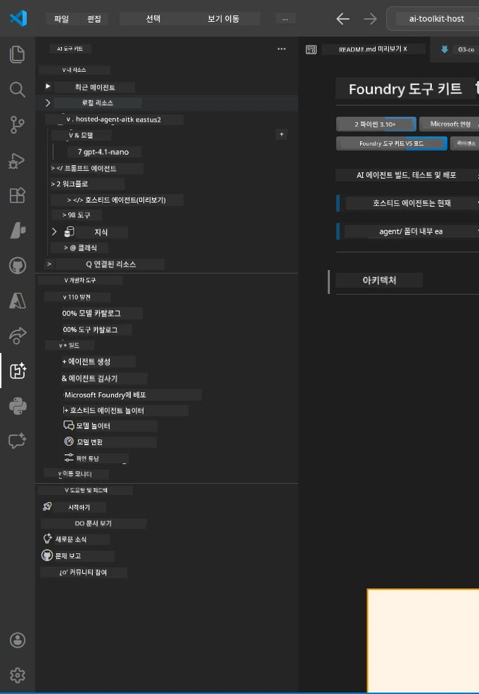
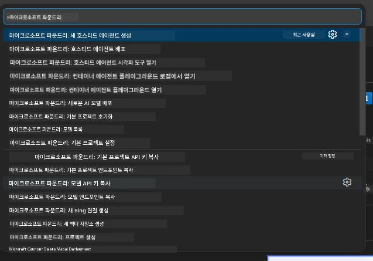

# Module 1 - Foundry Toolkit 및 Foundry Extension 설치

이 모듈에서는 이 워크숍을 위한 두 가지 주요 VS Code 확장 프로그램을 설치하고 확인하는 방법을 안내합니다. 이미 [Module 0](00-prerequisites.md)에서 설치했다면, 이 모듈을 사용하여 정상 작동하는지 확인하세요.

---

## Step 1: Microsoft Foundry Extension 설치

**Microsoft Foundry for VS Code** 확장 프로그램은 Foundry 프로젝트 생성, 모델 배포, 호스팅 에이전트 스캐폴딩 및 VS Code에서 직접 배포를 위한 주요 도구입니다.

1. VS Code를 엽니다.
2. `Ctrl+Shift+X`를 눌러 **확장 프로그램** 패널을 엽니다.
3. 상단 검색 상자에 <strong>Microsoft Foundry</strong>를 입력합니다.
4. 결과 중 <strong>Microsoft Foundry for Visual Studio Code</strong>를 찾으세요.
   - 게시자: **Microsoft**
   - 확장 ID: `TeamsDevApp.vscode-ai-foundry`
5. <strong>설치</strong> 버튼을 클릭합니다.
6. 설치 완료까지 기다립니다(작은 진행 표시가 보입니다).
7. 설치 후, VS Code 왼쪽의 <strong>활동 표시줄</strong>에서 새로운 **Microsoft Foundry** 아이콘(다이아몬드/AI 아이콘처럼 보임)을 확인합니다.
8. **Microsoft Foundry** 아이콘을 클릭하여 사이드바 뷰를 엽니다. 다음 섹션이 보여야 합니다:
   - **Resources** (또는 Projects)
   - **Agents**
   - **Models**

> **아이콘이 보이지 않으면:** VS Code를 다시 로드해 보세요(`Ctrl+Shift+P` → `Developer: Reload Window`).

---

## Step 2: Foundry Toolkit Extension 설치

**Foundry Toolkit** 확장 프로그램은 [**Agent Inspector**](https://learn.microsoft.com/azure/foundry/agents/how-to/vs-code-agents-workflow-pro-code) — 에이전트를 로컬에서 테스트하고 디버깅하기 위한 시각적 인터페이스 — 와 플레이그라운드, 모델 관리 및 평가 도구를 제공합니다.

1. 확장 프로그램 패널에서(`Ctrl+Shift+X`) 검색 상자를 비우고 <strong>Foundry Toolkit</strong>을 입력합니다.
2. 결과에서 <strong>Foundry Toolkit</strong>을 찾습니다.
   - 게시자: **Microsoft**
   - 확장 ID: `ms-windows-ai-studio.windows-ai-studio`
3. <strong>설치</strong>를 클릭합니다.
4. 설치가 완료되면 활동 표시줄에 **Foundry Toolkit** 아이콘(로봇/반짝임 아이콘처럼 보임)이 나타납니다.
5. **Foundry Toolkit** 아이콘을 클릭하여 사이드바를 엽니다. Foundry Toolkit 환영 화면이 나타나며 다음 옵션을 확인할 수 있습니다:
   - **Models**
   - **Playground**
   - **Agents**

---

## Step 3: 두 확장 프로그램이 정상 작동하는지 확인하기

### 3.1 Microsoft Foundry Extension 확인

1. 활동 표시줄에서 **Microsoft Foundry** 아이콘을 클릭합니다.
2. Azure에 로그인되어 있으면(모듈 0 참고) **Resources** 아래에 프로젝트가 나열되는 것을 볼 수 있습니다.
3. 로그인하라는 메시지가 나오면 <strong>Sign in</strong>을 클릭하고 인증 절차를 진행합니다.
4. 사이드바가 오류 없이 보이는지 확인합니다.

### 3.2 Foundry Toolkit Extension 확인

1. 활동 표시줄에서 **Foundry Toolkit** 아이콘을 클릭합니다.
2. 환영 화면이나 메인 패널이 오류 없이 로드되는지 확인합니다.
3. 아직 아무것도 구성할 필요는 없습니다 — [Module 5](05-test-locally.md)에서 Agent Inspector를 사용할 예정입니다.

### 3.3 명령 팔레트를 통해 확인

1. `Ctrl+Shift+P`를 눌러 명령 팔레트를 엽니다.
2. <strong>"Microsoft Foundry"</strong>를 입력하면 다음과 같은 명령이 나타납니다:
   - `Microsoft Foundry: Create a New Hosted Agent`
   - `Microsoft Foundry: Deploy Hosted Agent`
   - `Microsoft Foundry: Open Model Catalog`
3. `Escape`를 눌러 명령 팔레트를 닫습니다.
4. 명령 팔레트를 다시 열고 <strong>"Foundry Toolkit"</strong>을 입력하면 다음과 같은 명령이 표시됩니다:
   - `Foundry Toolkit: Open Agent Inspector`

> 이 명령들이 보이지 않으면 확장 프로그램이 제대로 설치되지 않은 것일 수 있습니다. 확장 프로그램을 제거한 후 다시 설치해 보세요.

---

## 이 확장 프로그램들이 이 워크숍에서 하는 일

| 확장 프로그램 | 역할 | 사용 시기 |
|-----------|-------------|-------------------|
| **Microsoft Foundry for VS Code** | Foundry 프로젝트 생성, 모델 배포, **[호스팅 에이전트](https://learn.microsoft.com/azure/foundry/agents/concepts/hosted-agents)** 스캐폴딩(`agent.yaml`, `main.py`, `Dockerfile`, `requirements.txt` 자동 생성), [Foundry Agent Service](https://learn.microsoft.com/azure/foundry/agents/overview)로 배포 | Modules 2, 3, 6, 7 |
| **Foundry Toolkit** | 로컬 테스트/디버깅을 위한 Agent Inspector, 플레이그라운드 UI, 모델 관리 | Modules 5, 7 |

> **Foundry 확장 프로그램은 이 워크숍에서 가장 중요한 도구입니다.** 전 과정을 처리합니다: 스캐폴드 → 구성 → 배포 → 검증. Foundry Toolkit은 로컬 테스트를 위한 시각적 Agent Inspector를 제공해 보완합니다.

---

### 점검 사항

- [ ] 활동 표시줄에 Microsoft Foundry 아이콘이 보임
- [ ] 클릭 시 오류 없이 사이드바가 열림
- [ ] 활동 표시줄에 Foundry Toolkit 아이콘이 보임
- [ ] 클릭 시 오류 없이 사이드바가 열림
- [ ] `Ctrl+Shift+P` → "Microsoft Foundry" 입력 시 사용 가능한 명령어 표시
- [ ] `Ctrl+Shift+P` → "Foundry Toolkit" 입력 시 사용 가능한 명령어 표시

---

**이전:** [00 - 사전 준비](00-prerequisites.md) · **다음:** [02 - Foundry 프로젝트 생성 →](02-create-foundry-project.md)

---

<!-- CO-OP TRANSLATOR DISCLAIMER START -->
**면책 조항**:  
이 문서는 AI 번역 서비스 [Co-op Translator](https://github.com/Azure/co-op-translator)를 사용하여 번역되었습니다. 정확성을 위해 노력하고 있지만, 자동 번역에는 오류나 부정확성이 포함될 수 있음을 유의하시기 바랍니다. 원문 문서는 권위 있는 출처로 간주되어야 합니다. 중요한 정보의 경우, 전문 인력에 의한 번역을 권장합니다. 본 번역 사용으로 인해 발생하는 오해나 잘못된 해석에 대해 당사는 책임을 지지 않습니다.
<!-- CO-OP TRANSLATOR DISCLAIMER END -->