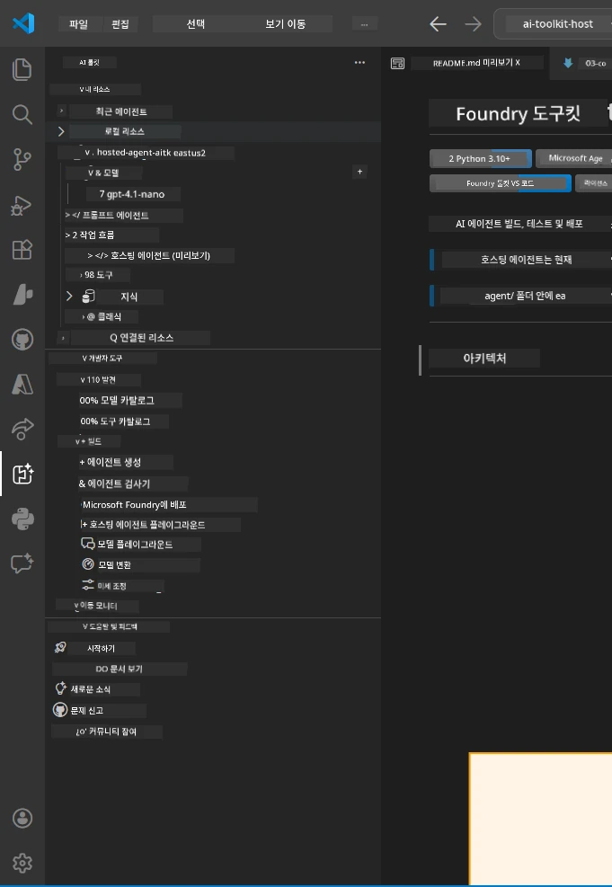
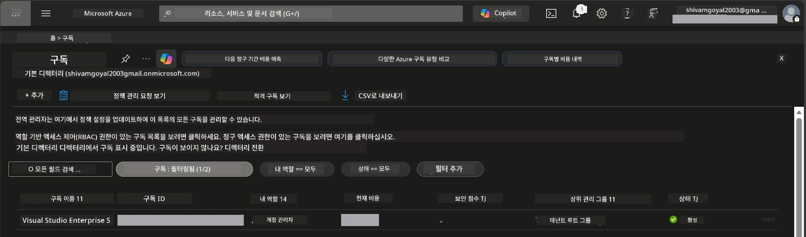
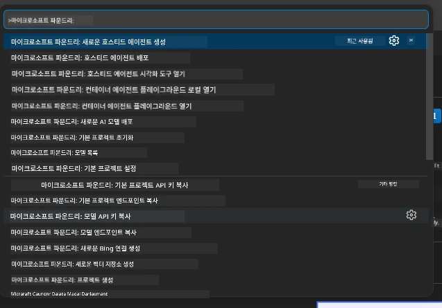
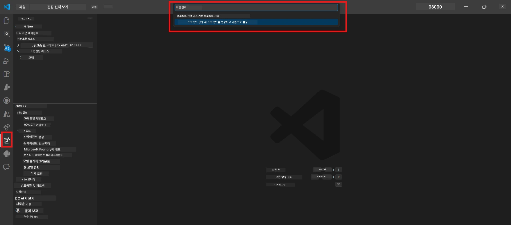
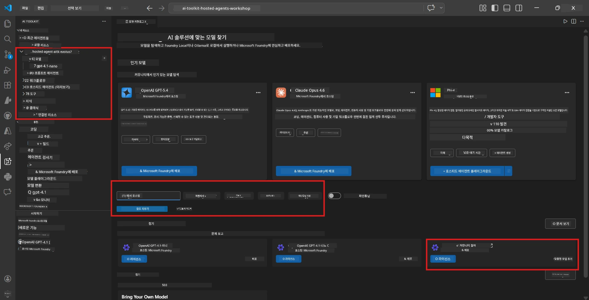
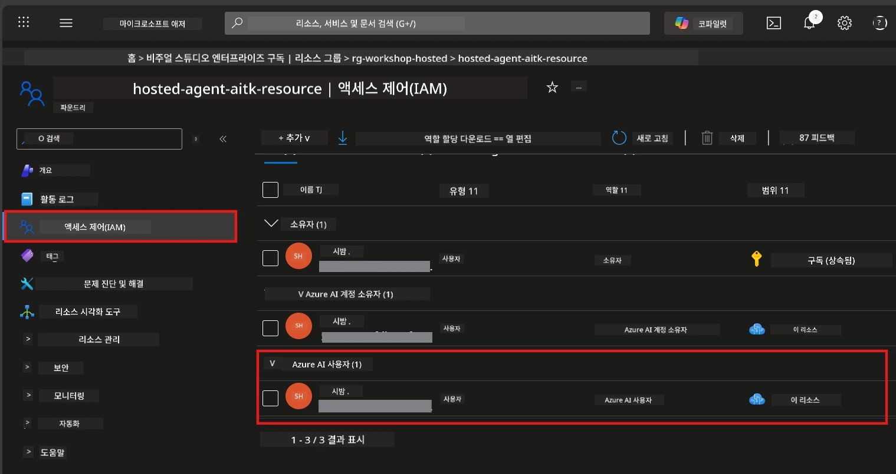

# 설정: 확장, 프로젝트 및 모델

⏱️ 약 15분

이 모듈에서는 Foundry Toolkit 확장 기능을 설치 및 확인하고, Foundry 프로젝트를 생성(또는 연결)하며, 에이전트가 사용할 모델을 배포합니다.

## 1단계: Foundry Toolkit 설치

<strong>VS Code용 Foundry Toolkit</strong>은 이 워크숍의 주요 확장 기능입니다. 프로젝트 생성, 모델 배포, 에이전트 스캐폴딩, 로컬 테스트(Agent Inspector), 클라우드 배포를 모두 VS Code에서 제공합니다.

1. VS Code를 열고 `Ctrl+Shift+X`를 눌러 <strong>확장</strong> 패널을 엽니다.
2. <strong>Foundry Toolkit</strong>을 검색합니다.
3. **VS Code용 Foundry Toolkit**(퍼블리셔: Microsoft, ID: `ms-windows-ai-studio.windows-ai-studio`)을 설치합니다.
4. 설치 완료 후, 활동 표시줄(왼쪽 사이드바)에 **Foundry Toolkit** 아이콘이 나타납니다.

> *참고: 이전 확장 버전에서는 활동 표시줄에 "AI TOOLKIT"으로 표시될 수 있습니다. 기능은 동일합니다.*



## 2단계: 액세스 유형에 따른 설정

> **경로 선택:** 아래에서 본인의 환경과 맞는 경로를 펼치세요. 경로는 <strong>하나만</strong> 완료하면 됩니다.

<details>
<summary><strong>🅰️ 경로 A - Azure 클라우드 (Azure 구독 필요)</strong></summary>

### Azure CLI

1. [learn.microsoft.com/cli/azure/install-azure-cli](https://learn.microsoft.com/cli/azure/install-azure-cli)에서 설치하세요.
2. 확인: `az --version` (버전 2.80.0 이상 기대).
3. 로그인: `az login`

### 인증 옵션

[Microsoft Agent Framework](https://learn.microsoft.com/agent-framework/overview/)은 [`DefaultAzureCredential`](https://learn.microsoft.com/azure/developer/python/sdk/authentication/credential-chains#defaultazurecredential-overview)을 사용하여 여러 인증 방법을 순차적으로 시도합니다. 환경에 맞는 방법을 선택하세요:

#### 옵션 1: VS Code 계정 (워크숍 권장)
1. VS Code 왼쪽 하단의 <strong>계정</strong> 아이콘(사람 실루엣)을 클릭합니다.
2. **Microsoft Foundry 사용을 위한 로그인**(또는 **Azure로 로그인**)을 선택합니다.
3. 브라우저가 열리면, 구독에 접근 권한이 있는 Azure 계정으로 로그인합니다.
4. VS Code로 돌아오면 왼쪽 하단에 계정 이름이 표시됩니다.

#### 옵션 2: Azure CLI
```bash
az login
az account set --subscription "<your-subscription-id>"
```

#### 옵션 3: 서비스 주체(Enterprise/CI 환경)
잠긴 환경이나 CI/CD 파이프라인 사용 시 `.env` 파일에 아래 환경 변수들을 설정하세요:
```env
AZURE_TENANT_ID=<your-tenant-id>
AZURE_CLIENT_ID=<your-client-id>
AZURE_CLIENT_SECRET=<your-client-secret>
```

> **`DefaultAzureCredential` 작동 방식:** 환경 변수를 우선 시도하고, 다음에 관리형 ID, VS Code 로그인, Azure CLI 순으로 시도하며 가장 먼저 성공하는 방법을 사용합니다. 자세한 내용은 [인증 체인 문서](https://learn.microsoft.com/azure/developer/python/sdk/authentication/credential-chains#defaultazurecredential-overview)를 참고하세요.

### Azure Developer CLI (azd)

1. 설치: `winget install microsoft.azd` (Windows) 또는 [설치 문서](https://learn.microsoft.com/azure/developer/azure-developer-cli/install-azd)를 참고하세요.
2. 확인: `azd version`
3. 로그인: `azd auth login`

### Docker Desktop (선택 사항)

Docker는 로컬에서 컨테이너를 빌드하려는 경우에만 필요합니다. Foundry 확장은 배포 중 빌드를 자동으로 처리합니다.

1. [docs.docker.com/get-docker](https://docs.docker.com/get-docker/)에서 설치하세요.
2. 확인: `docker info`

### Azure 구독 및 RBAC

1. [portal.azure.com](https://portal.azure.com)에 로그인합니다.
2. <strong>구독</strong>으로 이동하여 최소 하나가 <strong>활성</strong> 상태인지 확인합니다.
3. <strong>구독 ID</strong>를 기록해두세요 - 모듈 01에서 필요합니다.



#### RBAC 시나리오 표

[Hosted Agent](https://learn.microsoft.com/azure/foundry/agents/concepts/hosted-agents) 배포에는 표준 Azure `Owner` 및 `Contributor` 역할에는 포함되지 않은 **데이터 작업** 권한이 필요합니다. 아래 표를 참고하여 필요한 역할을 확인하세요:

| 시나리오 | 필요한 역할 | 할당 위치 |
|----------|---------------|----------------------|
| 새 Foundry 프로젝트 생성 | Foundry 리소스의 **Azure AI Owner** | Azure 포털의 Foundry 리소스 |
| 기존 프로젝트에 배포 (새 리소스) | 구독의 **Azure AI Owner** + **Contributor** | 구독 + Foundry 리소스 |
| 완전 구성된 프로젝트에 배포 | 계정의 **Reader** + 프로젝트의 **Azure AI User** | Azure 포털의 계정 + 프로젝트 |
| 로컬 테스트만 (배포 없음) | 프로젝트의 **Azure AI User** | Azure 포털 내 프로젝트 |

> **핵심:** Azure `Owner` 및 `Contributor` 역할은 <em>관리</em> 권한만 포함합니다(ARM 작업). 에이전트 생성 및 배포에 필요한 `agents/write` 같은 <em>데이터 작업</em>을 위해 [**Azure AI User**](https://learn.microsoft.com/azure/foundry/concepts/rbac-foundry#built-in-roles) 이상의 권한이 필요합니다.

## Foundry 프로젝트 연결 또는 생성



1. `Ctrl+Shift+P`를 누르고 **Foundry Toolkit: Create Project** 입력 후 선택합니다.
2. 드롭다운에서 <strong>Azure 구독</strong>을 선택합니다.
3. <strong>리소스 그룹</strong>을 선택하거나 새로 만듭니다(예: `rg-hosted-agents-workshop`).
4. 호스팅된 에이전트를 지원하는 <strong>지역</strong>(`East US`, `West US 2`, `Sweden Central`)을 선택합니다. [지역 가용성](https://learn.microsoft.com/azure/foundry/agents/concepts/hosted-agents#region-availability)을 참고하세요.
5. 프로젝트 이름을 입력합니다(예: `workshop-agents`).
6. 프로비저닝 완료까지 2~5분 기다립니다. VS Code에 진행 알림이 나타납니다.
7. 완료되면 프로젝트가 **Foundry Toolkit** 사이드바의 **MY RESOURCES** 아래에 나타납니다.



## 모델 배포 및 RBAC 할당

호스팅된 에이전트는 응답 생성에 사용할 AI 모델이 필요합니다.

#### 모델 선택 매트릭스
필요에 따라 다양한 모델 등급 중 선택할 수 있습니다:

| 모델 | 적합 용도 | 비용 | 비고 |
|-------|----------|------|-------|
| `gpt-4.1` | 고품질, 세밀한 응답 | 높음 | 최고의 결과, 최종 테스트 권장 |
| `gpt-4.1-mini/gpt-5-mini` | 빠른 반복, 저비용 | 낮음 | 워크숍 개발 및 빠른 테스트에 적합 |
| `gpt-4.1-nano` | 경량 작업용 | 가장 낮음 | 가장 비용 효율적이나 단순한 응답 |

1. `Ctrl+Shift+P` → **Foundry Toolkit: Open Model Catalog**(또는 사이드바 DEVELOPER TOOLS 아래 **Model Catalog** 클릭)로 이동합니다.
2. 카탈로그에서 <strong>gpt-4.1</strong>을 검색합니다.
3. **OpenAI GPT-4.1-mini**(또는 품질을 원하면 `gpt-5-mini`)를 찾아 <strong>Deploy</strong>를 클릭합니다.



4. 배포 구성에서:
   - **배포 이름:** 기본값 유지 또는 사용자 정의 이름 입력. **이 이름을 기억하세요.**
   - **대상:** **Deploy to Foundry Toolkit** 선택 후 프로젝트 선택.
5. <strong>Deploy</strong>를 클릭하고 1~3분 기다립니다.

> **권장:** 워크숍의 경우 `gpt-4.1-mini/gpt-5-mini`를 사용하세요 - 빠르고 저렴하며 좋은 결과를 제공합니다.

### 값 기록

배포 후, 이 두 값을 기록해두세요(모듈 03에서 필요):

| 값 | 위치 |
|-------|-----------------|
| **프로젝트 엔드포인트** | 사이드바에서 프로젝트 클릭 → 세부 정보에 URL 표시 (예: `https://<account>.services.ai.azure.com/api/projects/<project>`) |
| **모델 배포 이름** | 프로젝트 확장 → **Models** → 배포된 모델 옆 이름 (예: `gpt-4.1-mini/gpt-5-mini`) |

### RBAC 역할 할당

> ⚠️ **가장 자주 누락되는 단계입니다.** 올바른 역할 없이는 모듈 05에서 배포가 실패합니다.

#### 어떤 역할이 필요한가요?
시나리오에 따라 다음 역할 조합이 필요합니다:

| 시나리오 | 필요한 역할 | 할당 위치 |
|----------|---------------|----------------------|
| 새 Foundry 프로젝트 생성 | Foundry 리소스의 **Azure AI Owner** | Azure 포털의 Foundry 리소스 |
| 기존 프로젝트에 배포 (새 리소스) | 구독의 **Azure AI Owner** + **Contributor** | 구독 + Foundry 리소스 |
| 완전 구성된 프로젝트에 배포 | 계정의 **Reader** + 프로젝트의 **Azure AI User** | Azure 포털의 계정 + 프로젝트 |

**핵심:** Azure `Owner` 및 `Contributor` 역할은 관리 권한만 제공합니다. 에이전트 생성 및 배포에 필요한 `agents/write` 등의 데이터 작업을 위해 **Azure AI User**(또는 그 이상)가 필요합니다.

1. [portal.azure.com](https://portal.azure.com) 열기.
2. **Foundry 프로젝트** 이름 검색 → 결과 중 **"Foundry Toolkit project"** (부모 계정 아님) 클릭.
3. 왼쪽 탐색에서 **Access control (IAM)** 클릭.
4. **+ 추가** → **역할 할당 추가** 클릭.
5. **역할 탭:** **Azure AI User** 검색 후 선택, <strong>다음</strong> 클릭.
6. **멤버 탭:** **사용자, 그룹 또는 서비스 주체** 선택 → **멤버 선택 +** 클릭 → 자신 검색 후 선택 → <strong>선택</strong> 클릭.
7. **검토 + 할당** 클릭 → 다시 **검토 + 할당** 클릭.
8. 전파 완료까지 **1~2분 기다리기**.

> **왜 이 역할인가요?** Azure `Owner`/`Contributor`는 관리 권한만 부여합니다. **Azure AI User** 역할은 에이전트 생성 및 배포에 필요한 `agents/write` 데이터 작업 권한을 부여합니다. [Foundry RBAC 문서](https://learn.microsoft.com/azure/foundry/concepts/rbac-foundry#built-in-roles)를 참고하세요.



</details>

<details>
<summary><strong>🅱️ 경로 B - 로컬 / 무료 등급 (Azure 구독 불필요)</strong></summary>

### Foundry Local

Foundry Local은 별도의 클라우드 계정 없이 본인 컴퓨터에서 AI 모델을 실행할 수 있게 합니다. Foundry Toolkit을 통해 모델 카탈로그에서 Foundry Local 모델에 접근할 수 있습니다:

1. Foundry Toolkit 확장으로 이동합니다.
2. Foundry Toolkit 내 탐색에서 **Developer Tools** > <strong>Model Catalog</strong>를 선택합니다.
3. 새 창에서 탐색 바에서 <strong>local</strong>을 선택합니다.
4. 아래로 스크롤하여 <strong>Phi 4 Mini</strong>를 찾고 <strong>추가 버튼</strong>을 클릭하면 모델이 다운로드 중임을 알리는 팝업이 나타납니다.
5. 모델 다운로드가 완료되면 다음 단계로 진행할 수 있습니다.

</details>

### ✅ 체크포인트


- [ ] `Ctrl+Shift+P` → "Foundry Toolkit" 명령어가 보여야 함
- [ ] Foundry Toolkit 확장 기능이 설치되어 있고 사이드바가 오류 없이 로드됨
- [ ] VS Code가 정상 실행됨
- [ ] `python --version`이 3.10 이상 표시됨
- [ ] VS Code 활동 표시줄에 Foundry Toolkit 아이콘 보임
- [ ] **경로 A:** `az login` 성공, 구독이 활성 상태임
- [ ] **경로 B:** Foundry Local 실행 중(`foundry local status`)
- [ ] **경로 A:** Foundry 프로젝트가 사이드바에 보이고, 모델이 배포되었으며, Azure AI User 역할이 할당됨
- [ ] **경로 B:** Foundry Local이 모델과 함께 실행 중임
- [ ] <strong>엔드포인트</strong>와 <strong>모델 배포 이름</strong>을 기록함


**이전:** [00 - 사전 요구 사항](00-prerequisites.md) · **다음:** [02 - 호스팅 에이전트 생성 →](02-create-hosted-agent.md)

---

<!-- CO-OP TRANSLATOR DISCLAIMER START -->
**면책 조항**:
이 문서는 AI 번역 서비스 [Co-op Translator](https://github.com/Azure/co-op-translator)를 사용하여 번역되었습니다. 정확성을 기하기 위해 노력하고 있으나, 자동 번역은 오류나 부정확한 부분이 있을 수 있음을 유의하시기 바랍니다. 원본 문서의 원어본이 권위 있는 자료로 간주되어야 합니다. 중요한 정보의 경우, 전문가의 인간 번역을 권장합니다. 이 번역 사용으로 인해 발생하는 오해나 잘못된 해석에 대해 당사는 책임을 지지 않습니다.
<!-- CO-OP TRANSLATOR DISCLAIMER END -->