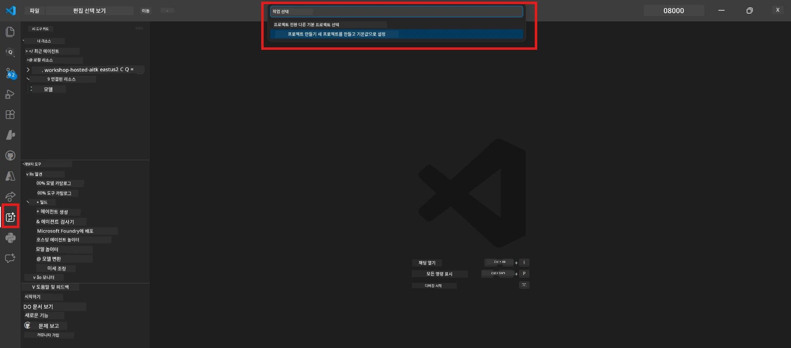
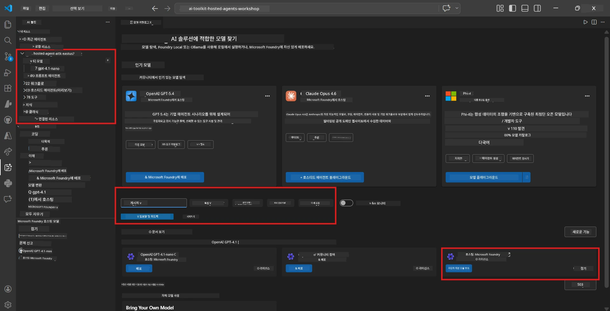
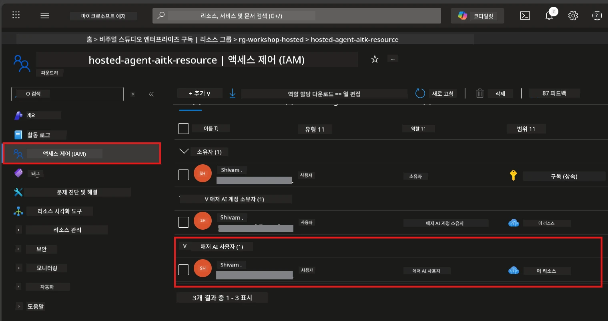

# Module 2 - Foundry 프로젝트 생성 및 모델 배포

이 모듈에서는 Microsoft Foundry 프로젝트를 생성(또는 선택)하고 에이전트가 사용할 모델을 배포합니다. 모든 단계가 명확하게 작성되어 있으니 순서대로 따라하세요.

> 이미 모델이 배포된 Foundry 프로젝트가 있다면 [모듈 3](03-create-hosted-agent.md)으로 건너뛰세요.

---

## Step 1: VS Code에서 Foundry 프로젝트 생성

Microsoft Foundry 확장 기능을 사용해 VS Code를 벗어나지 않고 프로젝트를 생성합니다.

1. `Ctrl+Shift+P`를 눌러 <strong>명령 팔레트</strong>를 엽니다.
2. 입력란에 <strong>Microsoft Foundry: Create Project</strong>를 입력하고 선택합니다.
3. 드롭다운이 나타나면 <strong>Azure 구독</strong>을 선택합니다.
4. <strong>리소스 그룹</strong>을 선택하거나 생성하라는 메시지가 표시됩니다:
   - 새로 만들려면 이름(예: `rg-hosted-agents-workshop`)을 입력하고 Enter를 누릅니다.
   - 기존 것을 사용하려면 드롭다운에서 선택합니다.
5. <strong>지역</strong>을 선택합니다. **중요:** 호스팅된 에이전트를 지원하는 지역을 선택하세요. [지역 가용성](https://learn.microsoft.com/azure/foundry/agents/concepts/hosted-agents#region-availability)을 확인하세요 - 일반적인 선택지는 `East US`, `West US 2`, `Sweden Central`입니다.
6. Foundry 프로젝트의 <strong>이름</strong>을 입력합니다 (예: `workshop-agents`).
7. Enter를 누르고 프로비저닝이 완료될 때까지 기다립니다.

> **프로비저닝은 2-5분 정도 소요됩니다.** VS Code 우측 하단에서 진행 상황 알림을 볼 수 있습니다. 프로비저닝 중에는 VS Code를 닫지 마세요.

8. 완료되면 **Microsoft Foundry** 사이드바에 새 프로젝트가 <strong>리소스</strong> 아래에 표시됩니다.
9. 프로젝트 이름을 클릭하여 확장하면 <strong>Models + endpoints</strong>와 **Agents** 섹션이 보이는지 확인합니다.



### 대안: Foundry 포털에서 생성

브라우저를 선호하는 경우:

1. [https://ai.azure.com](https://ai.azure.com)을 열고 로그인합니다.
2. 홈 페이지에서 <strong>Create project</strong>를 클릭합니다.
3. 프로젝트 이름을 입력하고 구독, 리소스 그룹, 지역을 선택합니다.
4. <strong>Create</strong>를 클릭하고 프로비저닝이 완료될 때까지 기다립니다.
5. 프로젝트가 생성되면 VS Code로 돌아와 Foundry 사이드바에서 새로고침 아이콘을 클릭해(새로고침) 프로젝트가 나타나는지 확인합니다.

---

## Step 2: 모델 배포

[호스팅된 에이전트](https://learn.microsoft.com/azure/foundry/agents/concepts/hosted-agents)는 응답을 생성하기 위해 Azure OpenAI 모델이 필요합니다. 지금 [모델을 배포](https://learn.microsoft.com/azure/ai-foundry/openai/how-to/create-resource#deploy-a-model)합니다.

1. `Ctrl+Shift+P`를 눌러 <strong>명령 팔레트</strong>를 엽니다.
2. 입력란에 <strong>Microsoft Foundry: Open [Model Catalog](https://learn.microsoft.com/azure/ai-foundry/openai/concepts/models)</strong>를 입력하고 선택합니다.
3. VS Code에서 모델 카탈로그 뷰가 열립니다. 검색창을 이용해 **gpt-4.1** 모델을 찾습니다.
4. **gpt-4.1** 모델 카드(또는 비용 절감을 위해 `gpt-4.1-mini`)를 클릭합니다.
5. <strong>Deploy</strong>를 클릭합니다.


6. 배포 구성에서:
   - **Deployment name**: 기본값(예: `gpt-4.1`)을 유지하거나 직접 이름을 입력합니다. **이 이름을 기억하세요** - 모듈 4에서 필요합니다.
   - **Target**: <strong>Deploy to Microsoft Foundry</strong>를 선택하고 방금 생성한 프로젝트를 선택합니다.
7. <strong>Deploy</strong>를 클릭하고 배포가 완료될 때까지 기다립니다(1-3분 소요).

### 모델 선택

| 모델 | 적합한 용도 | 비용 | 참고 |
|-------|-------------|------|-------|
| `gpt-4.1` | 고품질, 세밀한 응답 | 높음 | 최상의 결과, 최종 테스트에 권장 |
| `gpt-4.1-mini` | 빠른 반복, 비용 절감 | 낮음 | 워크숍 개발 및 빠른 테스트에 적합 |
| `gpt-4.1-nano` | 경량 작업 | 가장 낮음 | 비용 효율적이나 단순한 응답 |

> **워크숍 권장사항:** 개발 및 테스트용으로 `gpt-4.1-mini`를 사용하세요. 빠르고 저렴하며 실습에 적합한 결과를 제공합니다.

### 모델 배포 확인

1. **Microsoft Foundry** 사이드바에서 프로젝트를 확장합니다.
2. **Models + endpoints** (또는 유사 섹션) 아래에 배포된 모델이 있는지 확인합니다.
3. 배포된 모델(예: `gpt-4.1-mini`)이 **Succeeded** 또는 **Active** 상태이어야 합니다.
4. 모델 배포를 클릭하여 세부 정보를 확인합니다.
5. 모듈 4에서 사용할 두 값을 <strong>기록</strong>하세요:

   | 설정 | 찾는 위치 | 예시 값 |
   |---------|-------------|---------|
   | **프로젝트 엔드포인트** | Foundry 사이드바에서 프로젝트 이름 클릭 - 세부정보에 엔드포인트 URL 표시 | `https://<account>.services.ai.azure.com/api/projects/<project>` |
   | **모델 배포 이름** | 배포된 모델 옆에 표시된 이름 | `gpt-4.1-mini` |

---

## Step 3: 필요한 RBAC 역할 할당

가장 <strong>자주 누락되는 단계</strong>입니다. 역할이 없으면 모듈 6의 배포가 권한 오류로 실패합니다.

### 3.1 Azure AI 사용자 역할을 본인에게 할당

1. 브라우저에서 [https://portal.azure.com](https://portal.azure.com)을 엽니다.
2. 상단 검색창에 <strong>Foundry 프로젝트 이름</strong>을 입력하고 결과에서 클릭합니다.
   - **중요:** 상위 계정/허브 리소스가 아니라 <strong>프로젝트</strong> 리소스(유형: Microsoft Foundry project)로 이동하세요.
3. 프로젝트 왼쪽 탐색에서 <strong>액세스 제어 (IAM)</strong>을 클릭합니다.
4. 상단의 **+ 추가** → <strong>역할 할당 추가</strong>를 클릭합니다.
5. <strong>역할</strong> 탭에서 [**Azure AI User**](https://learn.microsoft.com/azure/foundry/concepts/rbac-foundry#built-in-roles)를 검색하고 선택한 후 <strong>다음</strong>을 클릭합니다.
6. <strong>사용자</strong> 탭에서:
   - <strong>사용자, 그룹 또는 서비스 주체</strong>를 선택합니다.
   - <strong>+ 구성원 선택</strong>을 클릭합니다.
   - 본인 이름이나 이메일을 검색, 선택하고 <strong>선택</strong>을 클릭합니다.
7. <strong>검토 + 할당</strong>을 클릭한 후 다시 한 번 <strong>검토 + 할당</strong>으로 확인합니다.



### 3.2 (선택 사항) Azure AI 개발자 역할 할당

프로젝트 내에서 추가 리소스 생성이나 프로그래밍 방식으로 배포를 관리해야 할 경우:

1. 위 단계를 반복하지만 5단계에서 <strong>Azure AI Developer</strong>를 선택합니다.
2. 반드시 프로젝트 수준뿐 아니라 **Foundry 리소스(계정)** 수준에도 할당하세요.

### 3.3 역할 할당 확인

1. 프로젝트의 **액세스 제어 (IAM)** 페이지에서 **역할 할당** 탭을 클릭합니다.
2. 본인 이름을 검색합니다.
3. 프로젝트 범위에 대해 적어도 <strong>Azure AI User</strong>가 할당되어 있어야 합니다.

> **중요:** [`Azure AI User`](https://learn.microsoft.com/azure/foundry/concepts/rbac-foundry#built-in-roles) 역할은 `Microsoft.CognitiveServices/accounts/AIServices/agents/write` 데이터 작업 권한을 제공합니다. 이 권한 없이는 배포 시 다음 오류가 발생합니다:
>
> ```
> Error: lacks the required data action 
> Microsoft.CognitiveServices/accounts/AIServices/agents/write 
> to perform POST /api/projects/{projectName}/assistants operation.
> ```
>
> 자세한 내용은 [모듈 8 - 문제 해결](08-troubleshooting.md)을 참고하세요.

---

### 점검 사항

- [ ] Foundry 프로젝트가 VS Code의 Microsoft Foundry 사이드바에 존재하고 보임
- [ ] 최소 한 개 이상의 모델(예: `gpt-4.1-mini`)이 **Succeeded** 상태로 배포됨
- [ ] **프로젝트 엔드포인트** URL과 <strong>모델 배포 이름</strong>을 기록함
- [ ] Azure Portal → IAM → 역할 할당에서 프로젝트 수준에 **Azure AI User** 역할이 할당됨
- [ ] 프로젝트가 호스팅된 에이전트를 위한 [지원 지역](https://learn.microsoft.com/azure/foundry/agents/concepts/hosted-agents#region-availability)에 위치함

---

**이전:** [01 - Foundry 도구 모음 설치](01-install-foundry-toolkit.md) · **다음:** [03 - 호스팅된 에이전트 만들기 →](03-create-hosted-agent.md)

---

<!-- CO-OP TRANSLATOR DISCLAIMER START -->
**면책 조항**:  
이 문서는 AI 번역 서비스 [Co-op Translator](https://github.com/Azure/co-op-translator)를 사용하여 번역되었습니다. 정확성을 위해 노력하고 있으나, 자동 번역에는 오류나 부정확성이 포함될 수 있음을 유의하시기 바랍니다. 원본 문서는 해당 언어의 원문이 권위 있는 출처로 간주되어야 합니다. 중요한 정보의 경우 전문 인력에 의한 번역을 권장합니다. 본 번역 사용으로 인한 오해나 잘못된 해석에 대해서는 책임을 지지 않습니다.
<!-- CO-OP TRANSLATOR DISCLAIMER END -->