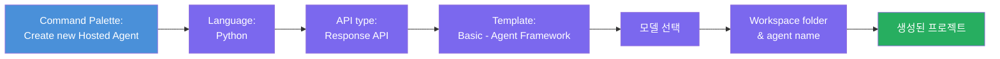
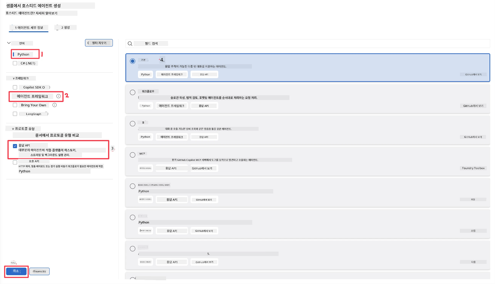
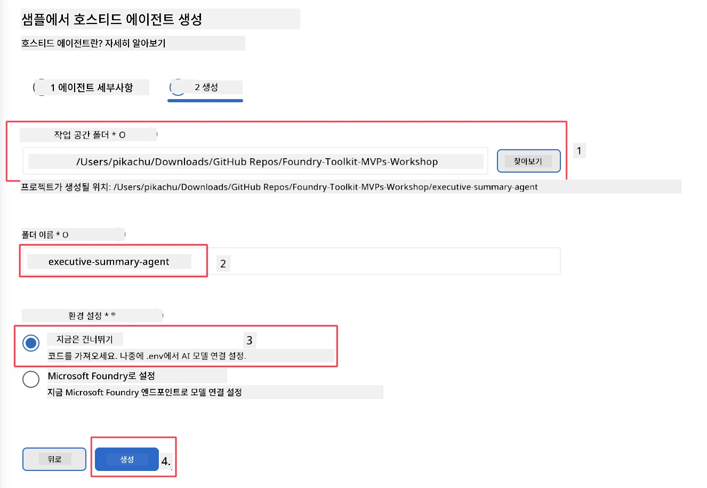

# 모듈 2 - 새로운 호스티드 에이전트 생성

⏱️ 약 5분

이 모듈에서는 Foundry Toolkit을 사용하여 <strong>호스티드 에이전트 프로젝트를 스캐폴딩</strong>합니다. 스캐폴딩은 전체 프로젝트 구조(`agent.yaml`, `main.py`, `Dockerfile`, `requirements.txt`, VS Code 디버그 구성)를 생성하므로 에이전트 동작 맞춤화에 집중할 수 있습니다.

> **핵심 개념:** 이 실습의 `agent/` 폴더는 Foundry Toolkit이 생성하는 예시입니다. 이 파일들을 처음부터 직접 작성하지 않습니다.

### 스캐폴드 마법사 흐름



---

## 1단계: Create Hosted Agent 마법사 열기

1. `Ctrl+Shift+P`를 눌러 <strong>명령 팔레트</strong>를 엽니다.
2. 입력: **Foundry Toolkit: Create new Hosted Agent** 를 선택합니다.

> **대체 방법: Foundry 포털에서 생성하기**
> 브라우저를 선호하면 [https://ai.azure.com](https://ai.azure.com)에서 프로젝트를 생성할 수 있습니다. 프로젝트가 프로비저닝되면 VS Code로 돌아와 **Foundry Toolkit** 사이드바에서 연결합니다.

> **대체:** Foundry Toolkit 사이드바의 **Hosted Agents (Preview)** 옆에 있는 **+** 아이콘을 클릭합니다.

## 2단계: 설정 선택



1. 왼쪽 네비게이션/옵션 섹션에서 다음을 선택합니다:

| 메뉴 | 선택 | 비고 |
|--------|-----------|-------|
| <strong>언어</strong> | Python | C#도 지원 |
| <strong>프레임워크</strong> | Agent Framework | Agent Framework SDK를 사용하는 간단한 시작점 |
| **API 유형** | Response API | `POST /responses` - 대화식, 플랫폼 관리 기록 포함 |
| <strong>템플릿</strong> | Basic | Agent Framework SDK를 사용하는 간단한 시작점 |

2. 선택 후 **Next** 클릭



3. 다음 창에서 다음을 선택합니다:

| 메뉴 | 선택 | 비고 |
|--------|-----------|-------|
| **작업 공간 폴더** | 대상 폴더 선택 | 예: `/workspace/Foundry_Toolkit_for_VSCode_Lab/` 또는 이 저장소의 하위폴더 |
| **에이전트 이름** | 이름 입력 | 예: `executive-summary-agent` |
| **환경 설정** | 지금은 설정 건너뛰기 |  |

<strong>생성</strong>을 클릭해 에이전트를 만듭니다. 호스티드 에이전트 이름으로 새 폴더가 생성됩니다.

## 3단계: 생성된 프로젝트 검사

스캐폴딩 완료 후 탐색기(`Ctrl+Shift+E`)에서 다음 파일들을 확인합니다:

```
📂 my-agent/
├── .env                ← Environment variables (placeholders)
├── .vscode/
│   ├── launch.json     ← Debug config (F5 → run + Agent Inspector)
│   └── tasks.json      ← VS Code task definitions
├── agent.yaml          ← Agent definition (kind: hosted)
├── Dockerfile          ← Container config for deployment
├── main.py             ← Agent entry point (your main code)
└── requirements.txt    ← Python dependencies
```

### 주요 파일 설명

| 파일 | 용도 |
|------|---------|
| `agent.yaml` | 에이전트를 `kind: hosted`로 선언하고, 환경 변수 매핑, `/responses` 프로토콜 정의 |
| `main.py` | `FoundryChatClient`를 생성 → 명령어와 함께 `Agent`로 래핑 → 포트 8088에서 `ResponsesHostServer`로 서비스 |
| `Dockerfile` | `python:3.12-slim` 사용, 의존성 설치, 포트 8088 노출, `main.py` 실행 |
| `requirements.txt` | `agent-framework-foundry`, `agent-framework-foundry-hosting`, `mcp`, `debugpy` |

> **중요:** 스캐폴딩된 에이전트 폴더 자체(`agent/`)를 VS Code에서 직접 열어 `.vscode/launch.json`과 `tasks.json`이 F5 디버깅에 올바르게 작동하도록 합니다.

---

### ✅ 체크포인트

- [ ] 예상된 모든 파일과 함께 스캐폴딩된 프로젝트 생성됨
- [ ] `agent.yaml`에 `kind: hosted` 및 `protocol: responses` 표시됨
- [ ] `main.py`가 `Agent`, `FoundryChatClient`, `ResponsesHostServer`를 임포트함
- [ ] 에이전트 폴더가 작업 공간 루트로 VS Code에서 열림

---

**이전:** [01 - 설정](01-setup.md) · **다음:** [03 - 구성 및 코딩 →](03-configure-and-code.md)

---

<!-- CO-OP TRANSLATOR DISCLAIMER START -->
**면책 조항**:
이 문서는 AI 번역 서비스 [Co-op Translator](https://github.com/Azure/co-op-translator)를 사용하여 번역되었습니다. 정확성을 기하기 위해 노력하고 있으나, 자동 번역은 오류나 부정확한 부분이 있을 수 있음을 유의하시기 바랍니다. 원본 문서의 원어본이 권위 있는 자료로 간주되어야 합니다. 중요한 정보의 경우, 전문가의 인간 번역을 권장합니다. 이 번역 사용으로 인해 발생하는 오해나 잘못된 해석에 대해 당사는 책임을 지지 않습니다.
<!-- CO-OP TRANSLATOR DISCLAIMER END -->