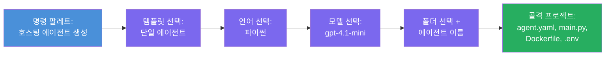

# Module 3 - 새로운 호스티드 에이전트 생성 (Foundry 확장 자동 스캐폴딩)

이 모듈에서는 Microsoft Foundry 확장을 사용하여 **새로운 [호스티드 에이전트](https://learn.microsoft.com/azure/foundry/agents/concepts/hosted-agents) 프로젝트를 스캐폴딩** 합니다. 이 확장은 `agent.yaml`, `main.py`, `Dockerfile`, `requirements.txt`, `.env` 파일 및 VS Code 디버그 구성 등 전체 프로젝트 구조를 생성해줍니다. 스캐폴딩 후에는 이 파일들을 에이전트의 지침, 도구 및 구성으로 맞춤화합니다.

> **핵심 개념:** 이 실습의 `agent/` 폴더는 Foundry 확장이 이 스캐폴딩 명령을 실행할 때 생성하는 예시입니다. 여러분이 직접 파일을 처음부터 작성하는 것이 아니라 확장이 생성한 후 이를 수정합니다.

### 스캐폴드 마법사 흐름


---

## 1단계: 호스티드 에이전트 생성 마법사 열기

1. `Ctrl+Shift+P`를 눌러 <strong>명령 팔레트</strong>를 엽니다.
2. 입력란에 <strong>Microsoft Foundry: Create a New Hosted Agent</strong>를 입력하고 선택합니다.
3. 호스티드 에이전트 생성 마법사가 열립니다.

> **대체 경로:** Microsoft Foundry 사이드바에서 → **Agents** 옆의 **+** 아이콘을 클릭하거나 마우스 오른쪽 버튼을 클릭하여 <strong>Create New Hosted Agent</strong>를 선택할 수도 있습니다.

---

## 2단계: 템플릿 선택

마법사에서 템플릿을 선택하라고 묻습니다. 다음과 같은 옵션이 표시됩니다:

| 템플릿 | 설명 | 사용 시기 |
|--------|-------|-----------|
| **Single Agent** | 자체 모델, 지침 및 선택적 도구가 있는 단일 에이전트 | 이 워크숍 (Lab 01) |
| **Multi-Agent Workflow** | 순차적으로 협력하는 여러 에이전트 | Lab 02 |

1. <strong>Single Agent</strong>를 선택합니다.
2. <strong>Next</strong>를 클릭하거나 선택이 자동으로 진행됩니다.

---

## 3단계: 프로그래밍 언어 선택

1. <strong>Python</strong>을 선택합니다 (이 워크숍에서 권장).
2. <strong>Next</strong>를 클릭합니다.

> <strong>C#도 지원</strong>되며 .NET을 선호하는 경우 사용할 수 있습니다. 스캐폴드 구조는 비슷하며 `main.py` 대신 `Program.cs`를 사용합니다.

---

## 4단계: 모델 선택

1. 마법사는 Foundry 프로젝트(모듈 2에서 배포한)의 모델을 표시합니다.
2. 배포한 모델을 선택합니다 - 예: **gpt-4.1-mini**.
3. <strong>Next</strong>를 클릭합니다.

> 모델이 보이지 않으면 [모듈 2](02-create-foundry-project.md)로 돌아가 먼저 모델을 배포하세요.

---

## 5단계: 폴더 위치 및 에이전트 이름 선택

1. 파일 대화상자가 열립니다 - 프로젝트가 생성될 <strong>대상 폴더</strong>를 선택합니다. 이 워크숍의 경우:
   - 새로 시작하는 경우: 아무 폴더나 선택 가능 (예: `C:\Projects\my-agent`)
   - 워크숍 저장소 내에서 작업하는 경우: `workshop/lab01-single-agent/agent/` 하위에 새 폴더 생성
2. 호스티드 에이전트의 <strong>이름</strong>을 입력합니다 (예: `executive-summary-agent` 또는 `my-first-agent`).
3. <strong>Create</strong>를 클릭하거나 Enter를 누릅니다.

---

## 6단계: 스캐폴딩 완료 대기

1. VS Code가 스캐폴드된 프로젝트를 새 창에서 엽니다.
2. 프로젝트가 완전히 로드될 때까지 몇 초 기다립니다.
3. 탐색기 패널(`Ctrl+Shift+E`)에서 다음 파일들을 확인합니다:

```
📂 my-first-agent/
├── .env                ← Environment variables (auto-generated with placeholders)
├── .vscode/
│   └── launch.json     ← Debug configuration (F5 to run + Agent Inspector)
├── agent.yaml          ← Agent definition (kind: hosted)
├── Dockerfile          ← Container configuration for deployment
├── main.py             ← Agent entry point (your main code file)
└── requirements.txt    ← Python dependencies
```

> **이것은 이 실습 내 `agent/` 폴더의 동일 구조입니다.** Foundry 확장이 이 파일들을 자동으로 생성하므로 직접 만들 필요가 없습니다.

> **워크숍 참고:** 이 워크숍 저장소에서는 `.vscode/` 폴더가 <strong>작업공간 루트</strong>에 위치하며 각 프로젝트 내에 있지 않습니다. 여기에는 공유 `launch.json` 및 `tasks.json`이 포함되어 있고, 두 가지 디버그 구성을 갖습니다 - <strong>"Lab01 - Single Agent"</strong>와 **"Lab02 - Multi-Agent"** - 각 구성은 해당 실습의 `cwd`를 가리킵니다. F5를 누를 때 작업 중인 실습에 맞는 구성을 드롭다운에서 선택하세요.

---

## 7단계: 생성된 각 파일 이해하기

마법사가 만든 각 파일을 잠시 살펴보세요. 이 파일들을 이해하는 것이 모듈 4(맞춤화)에서 중요합니다.

### 7.1 `agent.yaml` - 에이전트 정의

`agent.yaml`을 엽니다. 다음과 같습니다:

```yaml
# yaml-language-server: $schema=https://raw.githubusercontent.com/microsoft/AgentSchema/refs/heads/main/schemas/v1.0/ContainerAgent.yaml

kind: hosted
name: my-first-agent
description: >
  A hosted agent deployed to Microsoft Foundry Agent Service.
metadata:
  authors:
    - Microsoft
  tags:
    - Azure AI AgentServer
    - Microsoft Agent Framework
    - Hosted Agent
protocols:
  - protocol: responses
    version: v1
environment_variables:
  - name: AZURE_AI_PROJECT_ENDPOINT
    value: ${PROJECT_ENDPOINT}
  - name: AZURE_AI_MODEL_DEPLOYMENT_NAME
    value: ${MODEL_DEPLOYMENT_NAME}
dockerfile_path: Dockerfile
resources:
  cpu: '0.25'
  memory: 0.5Gi
```

**주요 필드:**

| 필드 | 용도 |
|-------|-------|
| `kind: hosted` | 호스티드 에이전트임을 선언 (컨테이너 기반으로 [Foundry Agent Service](https://learn.microsoft.com/azure/foundry/agents/overview)에 배포됨) |
| `protocols: responses v1` | 에이전트가 OpenAI 호환 `/responses` HTTP 엔드포인트를 노출함 |
| `environment_variables` | 배포 시 `.env` 값들을 컨테이너 환경 변수에 매핑 |
| `dockerfile_path` | 컨테이너 이미지 빌드에 사용되는 Dockerfile 경로 지정 |
| `resources` | 컨테이너에 할당되는 CPU 및 메모리 (0.25 CPU, 0.5Gi 메모리) |

### 7.2 `main.py` - 에이전트 진입점

`main.py`를 엽니다. 이 파일은 에이전트 로직의 메인 파이썬 파일입니다. 스캐폴드에는 다음이 포함됩니다:

```python
from agent_framework.azure import AzureAIAgentClient
from azure.ai.agentserver.agentframework import from_agent_framework
from azure.identity.aio import DefaultAzureCredential
```

**주요 임포트:**

| 임포트 | 용도 |
|--------|-------|
| `AzureAIAgentClient` | Foundry 프로젝트에 연결하고 `.as_agent()`를 통해 에이전트를 생성 |
| [`DefaultAzureCredential`](https://learn.microsoft.com/azure/developer/python/sdk/authentication/credential-chains#defaultazurecredential-overview) | 인증 처리 (Azure CLI, VS Code 로그인, 관리 ID 또는 서비스 주체) |
| `from_agent_framework` | `/responses` 엔드포인트를 노출하는 HTTP 서버로 에이전트를 래핑 |

주요 흐름은:
1. 자격 증명 생성 → 클라이언트 생성 → `.as_agent()` 호출하여 에이전트 얻기 (비동기 컨텍스트 매니저) → 서버로 래핑 → 실행

### 7.3 `Dockerfile` - 컨테이너 이미지

```dockerfile
FROM python:3.14-slim

WORKDIR /app

COPY ./ .

RUN pip install --upgrade pip && \
    if [ -f requirements.txt ]; then \
        pip install -r requirements.txt; \
    else \
        echo "No requirements.txt found" >&2; exit 1; \
    fi

EXPOSE 8088

CMD ["python", "main.py"]
```

**주요 내용:**
- `python:3.14-slim` 이미지를 베이스로 사용.
- 모든 프로젝트 파일을 `/app`에 복사.
- `pip` 업그레이드 후 `requirements.txt`에서 의존성 설치, 파일 누락 시 즉시 실패.
- **포트 8088을 노출** - 호스티드 에이전트에서 필수 포트이므로 변경하지 말 것.
- `python main.py`로 에이전트 시작.

### 7.4 `requirements.txt` - 의존성

```
agent-framework-azure-ai==1.0.0rc3
agent-framework-core==1.0.0rc3
azure-ai-agentserver-agentframework==1.0.0b16
azure-ai-agentserver-core==1.0.0b16
debugpy
agent-dev-cli
```

| 패키지 | 용도 |
|---------|-------|
| `agent-framework-azure-ai` | Microsoft Agent Framework용 Azure AI 통합 |
| `agent-framework-core` | 에이전트 구축용 핵심 런타임 (`python-dotenv` 포함) |
| `azure-ai-agentserver-agentframework` | Foundry Agent Service용 호스티드 에이전트 서버 런타임 |
| `azure-ai-agentserver-core` | 핵심 에이전트 서버 추상화 |
| `debugpy` | Python 디버깅 지원 (VS Code에서 F5 디버깅 가능) |
| `agent-dev-cli` | 에이전트 로컬 개발용 CLI (디버그/실행 구성에서 사용) |

---

## 에이전트 프로토콜 이해하기

호스티드 에이전트는 **OpenAI Responses API** 프로토콜로 통신합니다. 로컬 또는 클라우드에서 실행 중일 때, 에이전트는 단일 HTTP 엔드포인트를 노출합니다:

```
POST http://localhost:8088/responses
Content-Type: application/json

{
  "input": "Your prompt here",
  "stream": false
}
```

Foundry Agent Service가 이 엔드포인트를 호출해 사용자 프롬프트를 보내고 에이전트 응답을 받습니다. 이는 OpenAI API와 동일한 프로토콜이므로 여러분의 에이전트는 OpenAI Responses 형식을 따르는 모든 클라이언트와 호환됩니다.

---

### 점검표

- [ ] 스캐폴드 마법사가 성공적으로 완료되고 <strong>새로운 VS Code 창</strong>이 열렸는가
- [ ] 다음 5개 파일이 모두 보이는가: `agent.yaml`, `main.py`, `Dockerfile`, `requirements.txt`, `.env`
- [ ] `.vscode/launch.json` 파일이 존재하는가 (F5 디버깅 활성화를 위해 - 이 워크숍에서는 작업공간 루트에 있으며 실습별 구성 포함)
- [ ] 각 파일을 읽고 용도를 이해했는가
- [ ] 포트 `8088`이 필수이며 `/responses` 엔드포인트가 프로토콜임을 이해했는가

---

**이전:** [02 - Foundry 프로젝트 생성](02-create-foundry-project.md) · **다음:** [04 - 구성 및 코딩 →](04-configure-and-code.md)

---

<!-- CO-OP TRANSLATOR DISCLAIMER START -->
**면책 조항**:  
이 문서는 AI 번역 서비스 [Co-op Translator](https://github.com/Azure/co-op-translator)를 사용하여 번역되었습니다. 정확성을 위해 노력하고 있으나, 자동 번역에는 오류나 부정확한 내용이 포함될 수 있음을 유의하시기 바랍니다. 원문은 해당 언어로 된 원본 문서를 권위 있는 출처로 간주해야 합니다. 중요한 정보의 경우 전문가의 인간 번역을 권장합니다. 본 번역 사용으로 인한 오해나 잘못된 해석에 대해 당사는 책임을 지지 않습니다.
<!-- CO-OP TRANSLATOR DISCLAIMER END -->