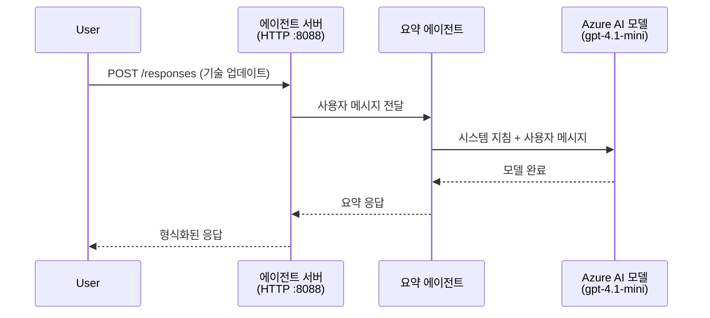
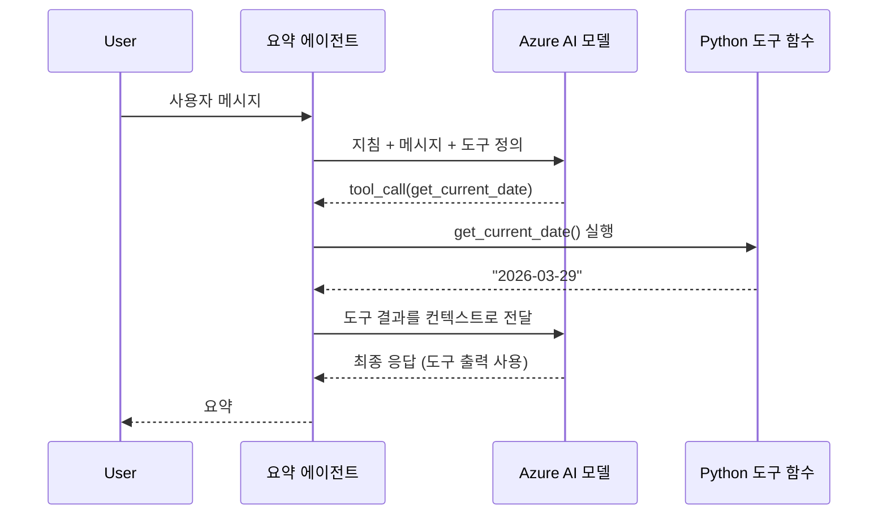

# Module 4 - 지침 구성, 환경 및 종속성 설치

이 모듈에서는 Module 3에서 자동 생성된 에이전트 파일을 사용자 지정합니다. 여기서 일반적인 스캐폴드를 <strong>자신만의</strong> 에이전트로 변환합니다 - 지침을 작성하고, 환경 변수를 설정하며, 필요에 따라 도구를 추가하고, 종속성을 설치합니다.

> **알림:** Foundry 확장이 프로젝트 파일을 자동으로 생성했습니다. 이제 이를 수정합니다. 사용자 지정된 완전한 작동 예제는 [`agent/`](../../../../../workshop/lab01-single-agent/agent) 폴더를 참조하세요.

---

## 구성 요소가 어떻게 연결되는지

### 요청 수명주기 (단일 에이전트)


> **도구가 있을 경우:** 에이전트에 도구가 등록되어 있으면 모델이 직접 완료 대신 도구 호출을 반환할 수 있습니다. 프레임워크는 도구를 로컬에서 실행한 후 결과를 모델에 다시 전달하고, 모델은 최종 응답을 생성합니다.


---

## 1단계: 환경 변수 구성

스캐폴드는 자리 표시자 값이 포함된 `.env` 파일을 생성했습니다. Module 2에서 실제 값을 채워야 합니다.

1. 스캐폴딩된 프로젝트에서 **`.env`** 파일을 엽니다(프로젝트 루트에 있음).
2. 자리 표시자 값을 실제 Foundry 프로젝트 세부 정보로 바꿉니다:

   ```env
   PROJECT_ENDPOINT=https://<your-account>.services.ai.azure.com/api/projects/<your-project>
   MODEL_DEPLOYMENT_NAME=gpt-4.1-mini
   ```

3. 파일을 저장합니다.

### 이러한 값을 찾는 방법

| 값 | 찾는 방법 |
|-------|---------------|
| **프로젝트 엔드포인트** | VS Code에서 **Microsoft Foundry** 사이드바를 열고 → 프로젝트 클릭 → 세부 정보 보기에서 엔드포인트 URL 확인. `https://<account-name>.services.ai.azure.com/api/projects/<project-name>` 형식입니다. |
| **모델 배포 이름** | Foundry 사이드바에서 프로젝트 확장 → **모델 + 엔드포인트** 확인 → 배포된 모델 옆에 이름이 표시됨(e.g., `gpt-4.1-mini`) |

> **보안:** `.env` 파일을 버전 관리에 커밋하지 마세요. 기본적으로 `.gitignore`에 포함되어 있습니다. 안 되어 있다면 추가하세요:
> ```
> .env
> ```

### 환경 변수 흐름

매핑 체인: `.env` → `main.py` (`os.getenv`로 읽음) → `agent.yaml` (배포 시 컨테이너 환경 변수에 매핑).

`main.py`에서는 다음과 같이 값을 읽습니다:

```python
PROJECT_ENDPOINT = os.getenv("AZURE_AI_PROJECT_ENDPOINT") or os.getenv("PROJECT_ENDPOINT")
MODEL_DEPLOYMENT_NAME = os.getenv("AZURE_AI_MODEL_DEPLOYMENT_NAME", os.getenv("MODEL_DEPLOYMENT_NAME", "gpt-4.1-mini"))
```

`AZURE_AI_PROJECT_ENDPOINT`와 `PROJECT_ENDPOINT` 모두 허용되며 (`agent.yaml`은 `AZURE_AI_*` 접두사를 사용).

---

## 2단계: 에이전트 지침 작성

가장 중요한 사용자 지정 단계입니다. 지침은 에이전트의 개성, 동작, 출력 형식 및 안전 제약을 정의합니다.

1. 프로젝트에서 `main.py`를 엽니다.
2. 기본/일반적인 지침 문자열을 찾습니다(스캐폴드에 포함됨).
3. 상세하고 구조화된 지침으로 바꿉니다.

### 좋은 지침에 포함될 내용

| 구성 요소 | 목적 | 예시 |
|-----------|---------|---------|
| <strong>역할</strong> | 에이전트가 무엇이고 무엇을 하는지 | "당신은 간략 요약 에이전트입니다" |
| <strong>대상</strong> | 응답 대상 | "기술 배경이 제한된 고위 리더" |
| **입력 정의** | 처리하는 프롬프트 유형 | "기술 사고 보고서, 운영 업데이트" |
| **출력 형식** | 응답의 정확한 구조 | "간략 요약: - 발생 내용: ... - 비즈니스 영향: ... - 다음 단계: ..." |
| <strong>규칙</strong> | 제약 조건 및 거절 조건 | "제공된 정보 외 추가하지 마세요" |
| <strong>안전</strong> | 오남용 및 환각 방지 | "입력이 불명확하면 명확히 요청하세요" |
| <strong>예시</strong> | 동작 유도를 위한 입출력 쌍 | 다양한 입력을 포함한 2-3개 예시 |

### 예시: 간략 요약 에이전트 지침

워크숍의 [`agent/main.py`](../../../../../workshop/lab01-single-agent/agent/main.py)에서 사용된 지침입니다:

```python
AGENT_INSTRUCTIONS = """You are an "Explain Like I'm an Executive" agent.

Purpose:
Your job is to translate complex technical or operational information into
clear, concise, and outcome-focused summaries that can be easily understood
by non-technical executives.

Audience:
Senior leaders with limited technical background who care about impact,
risk, and what happens next.

What you must do:
- Rephrase the input so it is understandable to a non-technical audience
- Prioritize clarity, brevity, and outcomes over technical accuracy
- Remove technical jargon, logs, metrics, stack traces, and deep root-cause details
- Translate technical causes into simple cause-and-effect statements
- Explicitly call out business impact
- Always include a clear next step or action
- Maintain a neutral, factual, and calm executive tone
- Do NOT add new facts or speculate beyond the input

Standard Output Structure (always use this wording):

Executive Summary:
- What happened: <plain-language description>
- Business impact: <clear, non-technical impact>
- Next step: <clear action or mitigation>

Rules:
- Keep responses under 100 words
- Do NOT add facts beyond the input
- If input is unclear, ask for clarification
"""
```

4. `main.py`의 기존 지침 문자열을 사용자 지정 지침으로 바꿉니다.
5. 파일을 저장합니다.

---

## 3단계: (선택 사항) 사용자 정의 도구 추가

호스팅된 에이전트는 <strong>로컬 Python 함수</strong>를 [도구로](https://learn.microsoft.com/azure/foundry/agents/concepts/tool-catalog) 실행할 수 있습니다. 이는 코드 기반 호스팅 에이전트가 프롬프트 전용 에이전트보다 가지는 핵심 이점으로, 임의의 서버측 로직 실행이 가능합니다.

### 3.1 도구 함수 정의

`main.py`에 도구 함수를 추가하세요:

```python
from agent_framework import tool

@tool
def get_current_date() -> str:
    """Returns the current date in YYYY-MM-DD format."""
    from datetime import date
    return str(date.today())
```

`@tool` 데코레이터는 일반 Python 함수를 에이전트 도구로 변환합니다. docstring은 모델이 보는 도구 설명이 됩니다.

### 3.2 에이전트에 도구 등록

`.as_agent()` 컨텍스트 매니저로 에이전트를 생성할 때 `tools` 매개변수에 도구를 전달하세요:

```python
async with AzureAIAgentClient(
    project_endpoint=PROJECT_ENDPOINT,
    model_deployment_name=MODEL_DEPLOYMENT_NAME,
    credential=credential,
).as_agent(
    name="my-agent",
    instructions=AGENT_INSTRUCTIONS,
    tools=[get_current_date],
) as agent:
    server = from_agent_framework(agent)
    await server.run_async()
```

### 3.3 도구 호출 작동 방식

1. 사용자가 프롬프트를 보냅니다.
2. 모델이 도구 필요 여부 결정(프롬프트, 지침, 도구 설명 기반).
3. 도구 필요 시, 프레임워크가 로컬에서 Python 함수 호출(컨테이너 내).
4. 도구의 반환값을 컨텍스트로 모델에 전달.
5. 모델이 최종 응답 생성.

> **도구는 서버 측에서 실행** - 사용자 브라우저나 모델에서 실행되지 않고, 컨테이너 내부에서 실행됩니다. 따라서 데이터베이스, API, 파일 시스템 또는 모든 Python 라이브러리에 접근할 수 있습니다.

---

## 4단계: 가상 환경 생성 및 활성화

종속성을 설치하기 전에 독립된 Python 환경을 만듭니다.

### 4.1 가상 환경 생성

VS Code 터미널(`Ctrl+```)을 열고 실행:

```powershell
python -m venv .venv
```

이로써 프로젝트 디렉터리에 `.venv` 폴더가 생성됩니다.

### 4.2 가상 환경 활성화

**PowerShell (Windows):**

```powershell
.\.venv\Scripts\Activate.ps1
```

**명령 프롬프트 (Windows):**

```cmd
.venv\Scripts\activate.bat
```

**macOS/Linux (Bash):**

```bash
source .venv/bin/activate
```

터미널 프롬프트 앞에 `(.venv)`가 나타나면 가상 환경이 활성화된 상태입니다.

### 4.3 종속성 설치

가상 환경이 활성화된 상태에서 필요한 패키지를 설치하세요:

```powershell
pip install -r requirements.txt
```

다음 항목을 설치합니다:

| 패키지 | 목적 |
|---------|---------|
| `agent-framework-azure-ai==1.0.0rc3` | [Microsoft Agent Framework](https://learn.microsoft.com/agent-framework/overview/)용 Azure AI 통합 |
| `agent-framework-core==1.0.0rc3` | 에이전트 빌드용 핵심 런타임(`python-dotenv` 포함) |
| `azure-ai-agentserver-agentframework==1.0.0b16` | [Foundry Agent Service](https://learn.microsoft.com/azure/foundry/agents/overview)용 호스팅 에이전트 서버 런타임 |
| `azure-ai-agentserver-core==1.0.0b16` | 핵심 에이전트 서버 추상화 |
| `debugpy` | Python 디버깅(VS Code에서 F5 디버깅 활성화) |
| `agent-dev-cli` | 에이전트 테스트용 로컬 개발 CLI |

### 4.4 설치 확인

```powershell
pip list | Select-String "agent-framework|agentserver"
```

예상 출력:
```
agent-framework-azure-ai   1.0.0rc3
agent-framework-core       1.0.0rc3
azure-ai-agentserver-agentframework 1.0.0b16
azure-ai-agentserver-core  1.0.0b16
```

---

## 5단계: 인증 확인

에이전트는 [`DefaultAzureCredential`](https://learn.microsoft.com/azure/developer/python/sdk/authentication/credential-chains#defaultazurecredential-overview)을 사용하며, 여러 인증 방법을 다음 순서로 시도합니다:

1. **환경 변수** - `AZURE_CLIENT_ID`, `AZURE_TENANT_ID`, `AZURE_CLIENT_SECRET` (서비스 주체)
2. **Azure CLI** - `az login` 세션을 사용
3. **VS Code** - VS Code에 로그인한 계정 사용
4. **관리되는 ID** - Azure에서 실행 시(배포 시) 사용

### 5.1 로컬 개발용 확인

다음 중 하나는 작동해야 합니다:

**옵션 A: Azure CLI (권장)**

```powershell
az account show --query "{name:name, id:id}" --output table
```

예상: 구독 이름과 ID가 표시됩니다.

**옵션 B: VS Code 로그인**

1. VS Code 왼쪽 하단의 <strong>계정</strong> 아이콘 확인.
2. 계정명이 보이면 인증된 상태.
3. 없으면 아이콘 클릭 → **Sign in to use Microsoft Foundry** 선택.

**옵션 C: 서비스 주체 (CI/CD용)**

```powershell
$env:AZURE_TENANT_ID = "<your-tenant-id>"
$env:AZURE_CLIENT_ID = "<your-client-id>"
$env:AZURE_CLIENT_SECRET = "<your-client-secret>"
```

### 5.2 일반 인증 문제

여러 Azure 계정에 로그인한 경우, 올바른 구독이 선택되었는지 확인:

```powershell
az account set --subscription "<your-subscription-id>"
```

---

### 점검 사항

- [ ] `.env` 파일에 자리 표시자가 아닌 유효한 `PROJECT_ENDPOINT`와 `MODEL_DEPLOYMENT_NAME`이 있는가
- [ ] `main.py`에서 에이전트 지침이 역할, 대상, 출력 형식, 규칙, 안전 제약을 정의하도록 커스터마이즈 되었는가
- [ ] (선택 사항) 사용자 정의 도구가 정의되고 등록되었는가
- [ ] 가상 환경이 생성 및 활성화 되었는가 (터미널 프롬프트에 `(.venv)`가 표시됨)
- [ ] `pip install -r requirements.txt`가 오류 없이 성공했는가
- [ ] `pip list | Select-String "azure-ai-agentserver"` 명령으로 패키지 설치 확인했는가
- [ ] 인증이 유효한가 - `az account show`가 구독을 반환하거나 VS Code에 로그인되어 있는가

---

**이전:** [03 - 호스팅 에이전트 생성](03-create-hosted-agent.md) · **다음:** [05 - 로컬 테스트 →](05-test-locally.md)

---

<!-- CO-OP TRANSLATOR DISCLAIMER START -->
**면책 조항**:  
이 문서는 AI 번역 서비스 [Co-op Translator](https://github.com/Azure/co-op-translator)를 사용하여 번역되었습니다. 정확성을 위해 노력하고 있으나, 자동 번역에는 오류나 부정확성이 있을 수 있음을 유의하시기 바랍니다. 원본 문서는 해당 언어의 정식 문서가 권위 있는 출처로 간주되어야 합니다. 중요한 정보의 경우 전문적인 인간 번역을 권장합니다. 본 번역문 사용으로 인해 발생하는 오해나 잘못된 해석에 대해 당사는 책임을 지지 않습니다.
<!-- CO-OP TRANSLATOR DISCLAIMER END -->