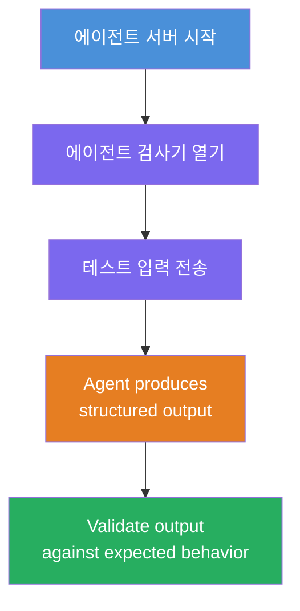
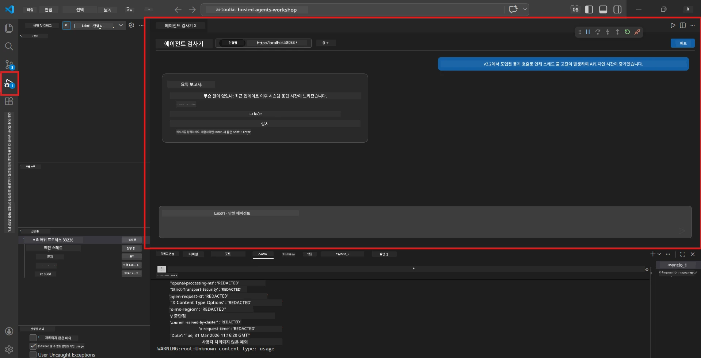
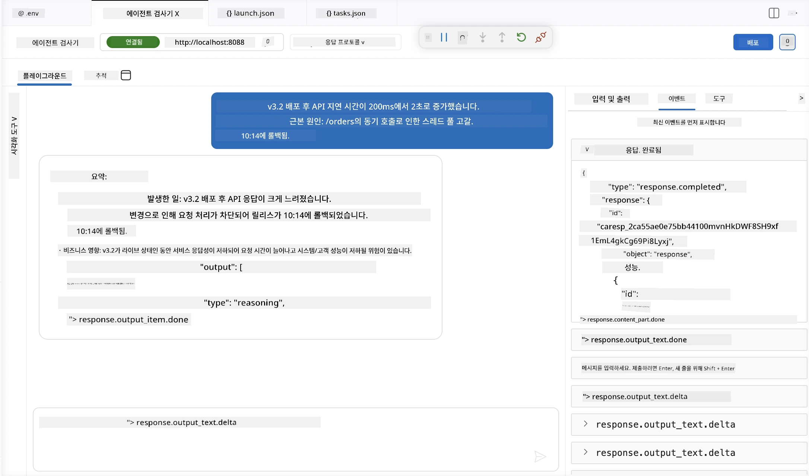

# 모듈 4 - 로컬에서 테스트하기

⏱️ ~10분

이 모듈에서는 에이전트를 로컬에서 실행하고 <strong>행복 경로 기능 테스트</strong>를 사용하여 제대로 작동하는지 검증합니다. Agent Inspector(시각 UI) 또는 직접 HTTP 호출을 사용하여 에이전트가 구조화되고 정확한 응답을 생성하는지 확인할 것입니다.

### 로컬 테스트 흐름



---

## 옵션 1: F5 누르기 - Agent Inspector로 디버깅 (권장)

### 디버거 시작하기

1. VS Code에서 **executive-summary-agent/** 폴더를 직접 엽니다 (`파일 → 폴더 열기`).
2. **실행 및 디버그** 패널을 엽니다 (`Ctrl+Shift+D`).
3. 드롭다운에서 <strong>Debug Local Agent Server</strong>를 선택합니다.
4. **F5** 키를 누르거나 ▶ 디버깅 시작을 클릭합니다.

> ⚠️ **중요: Python 인터프리터 선택하기**
> "ModuleNotFoundError"가 발생하거나 디버거가 시작되지 않으면 VS Code가 가상 환경을 사용하도록 설정해야 합니다:
  > 1. `Ctrl+Shift+P`를 누르고 <strong>Python: Select Interpreter</strong>를 입력합니다.
  > 2. 프로젝트의 `.venv` 폴더에 위치한 인터프리터를 선택합니다(예: Windows에서 `.\.venv\Scripts\python.exe`).
  > 3. 디버그 세션을 다시 시작합니다.
> 여전히 오류가 발생하면 `tasks.json` 파일을 수동으로 다음과 같이 업데이트하세요:
  > 1. `.vscode/tasks.json` 파일로 이동
  > 2. `Run Agent/Workflow HTTP Server`라는 명령을 찾음
  > 3. 명령 값을 `"value": "${workspaceFolder}/.venv/bin/python",`로 업데이트

### 일어나는 일

1. HTTP 서버가 `http://localhost:8088/responses`에서 시작됩니다.
2. **Agent Inspector** 패널이 자동으로 열립니다 - 테스트용 시각적 채팅 인터페이스입니다.
3. `main.py`에서 중단점이 활성화됩니다.

터미널을 주시하세요:
```
Starting executive summary hosted agent
Executive agent server running on http://localhost:8088
```

> **Agent Inspector가 열리지 않으면:** `Ctrl+Shift+P` → <strong>Foundry Toolkit: Open Agent Inspector</strong>를 누르세요.



> *스크린샷은 이전 확장 버전의 'AI TOOLKIT' 브랜드를 보여줄 수 있습니다.*

---

## 옵션 2: 터미널을 통한 테스트 (대안)

한 터미널에서 에이전트를 시작하고 다른 터미널에서 요청을 보냅니다:

```bash
# 터미널 1: 에이전트 시작
cd executive-summary-agent/
source .venv/bin/activate
python main.py
```

```bash
# 터미널 2: 테스트 전송 (curl)
curl -sS -X POST http://localhost:8088/responses \
  -H "Content-Type: application/json" \
  -d '{"input": "The API latency increased due to thread pool exhaustion caused by sync calls in v3.2.", "stream": false}'
```

---

## 시나리오 테스트: 행복 경로 기능 검증

아래 **세 가지** 시나리오를 모두 실행하세요. 이들은 에이전트가 현실적인 입력에 대해 올바르고 구조화된 출력을 생성하는지 검증합니다.



### 시나리오 1: IT 사고 - API 지연 급증

**입력:**
```
The API latency increased from 200ms to 2s after deploying v3.2.
Root cause: thread pool starvation from synchronous calls in /orders.
Rolled back at 10:14.
```

**예상 동작:**
- ✅ "Executive Summary" 구조(무슨 일이 있었는지 / 비즈니스 영향 / 다음 단계)를 따름
- ✅ 기술 용어 없음 ("thread pool", "/orders", "v3.2" 등 없음)
- ✅ 비즈니스 영향을 명확히 서술 (예: 사용자들이 지연을 경험함)
- ✅ 다음 단계를 포함 (예: 수정 배포, 모니터링 시행 중)

---

### 시나리오 2: 데이터 파이프라인 - ETL 실패

**입력:**
```
The nightly ETL job failed because the upstream schema changed. APAC dashboards show missing data.
```

**예상 동작:**
- ✅ 데이터 갱신 실패를 쉬운 언어로 요약함
- ✅ APAC 대시보드 영향 언급
- ✅ 조치 다음 단계 포함
- ✅ "ETL", "스키마"나 기타 기술 용어 포함 안 함

---

### 시나리오 3: 보안 - 노출된 자격 증명

**입력:**
```
Static analysis flagged a hardcoded secret in the repository.
The secret may have been exposed in commit history.
```

**예상 동작:**
- ✅ 자격 증명/보안 문제를 임원 친화적인 언어로 설명함
- ✅ 잠재적 위험(무단 접근) 언급
- ✅ 조치 사항 명시 (자격 증명 교체, 감사)
- ✅ "static analysis", "commit history", "hardcoded" 같은 용어 포함 안 함

---

## 검증 기준

각 시나리오에 대해 다음을 확인하세요:

| # | 기준 | 통과 조건 |
|---|----------|---------------|
| 1 | <strong>구조</strong> | 응답이 "Executive Summary" 형식을 사용하고 세 가지 항목 모두 포함 |
| 2 | **쉬운 언어** | 임원이 이해하지 못할 기술 용어 없음 |
| 3 | <strong>정확성</strong> | 요약이 입력 내용을 반영하며, 허위 정보 없음 |
| 4 | <strong>간결성</strong> | 응답이 100단어 미만임 |
| 5 | **다음 단계** | 명확한 행동 또는 완화 방안이 명시됨 |

---

## 디버깅 팁

| 문제 | 해결책 |
|-------|-----|
| 에이전트가 시작되지 않음 | `.env` 값을 확인하고, 가상 환경이 활성화되었는지 확인, `pip install -r requirements.txt` 실행 |
| 응답이 비었거나 일반적임 | `main.py`의 지침을 검토하여 출력 형식이 명시되었는지 확인 |
| 응답에 전문 용어 포함됨 | 지침에서 "기술 용어 제거" 규칙 강화 |
| Agent Inspector가 열리지 않음 | `Ctrl+Shift+P` → **Foundry Toolkit: Open Agent Inspector** 실행 |
| 터미널에서 모델 오류 발생 | `AZURE_AI_MODEL_DEPLOYMENT_NAME`이 정확히 일치하는지 확인 (대소문자 구분) |

---

### ✅ 체크포인트

- [ ] 에이전트가 로컬에서 오류 없이 시작됨
- [ ] Agent Inspector가 열리고 채팅 인터페이스를 보여줌 (F5 사용 시)
- [ ] **시나리오 1** (IT 사고) - 구조화된 Executive Summary, 전문 용어 없음
- [ ] **시나리오 2** (데이터 파이프라인) - 관련 요약과 비즈니스 영향
- [ ] **시나리오 3** (보안 경고) - 적절한 위험 커뮤니케이션
- [ ] 모든 응답이 정의된 출력 구조를 따름

> **응답을 저장하세요** (복사하거나 스크린샷) - 6모듈에서 클라우드 결과와 비교할 예정입니다.

---

**이전:** [03 - 구성 및 코드](03-configure-and-code.md) · **다음:** [05 - Foundry에 배포 →](05-deploy-to-foundry.md)

---

<!-- CO-OP TRANSLATOR DISCLAIMER START -->
**면책 조항**:
이 문서는 AI 번역 서비스 [Co-op Translator](https://github.com/Azure/co-op-translator)를 사용하여 번역되었습니다. 정확성을 기하기 위해 노력하고 있으나, 자동 번역은 오류나 부정확한 부분이 있을 수 있음을 유의하시기 바랍니다. 원본 문서의 원어본이 권위 있는 자료로 간주되어야 합니다. 중요한 정보의 경우, 전문가의 인간 번역을 권장합니다. 이 번역 사용으로 인해 발생하는 오해나 잘못된 해석에 대해 당사는 책임을 지지 않습니다.
<!-- CO-OP TRANSLATOR DISCLAIMER END -->