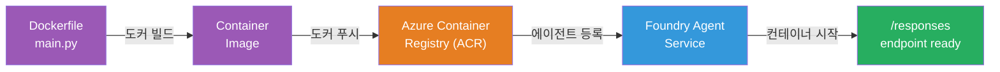
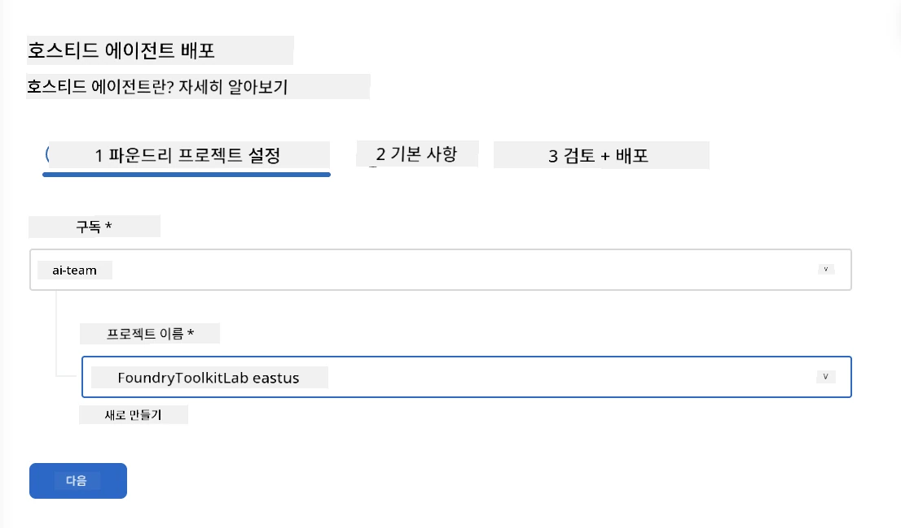
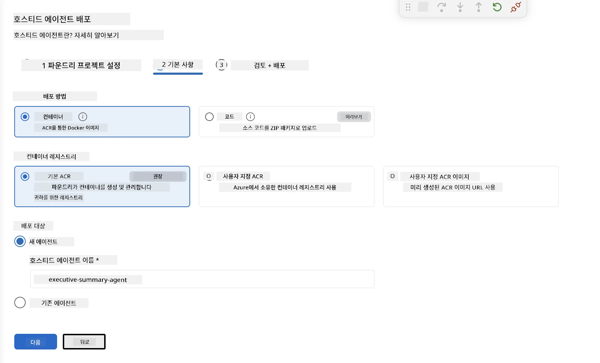
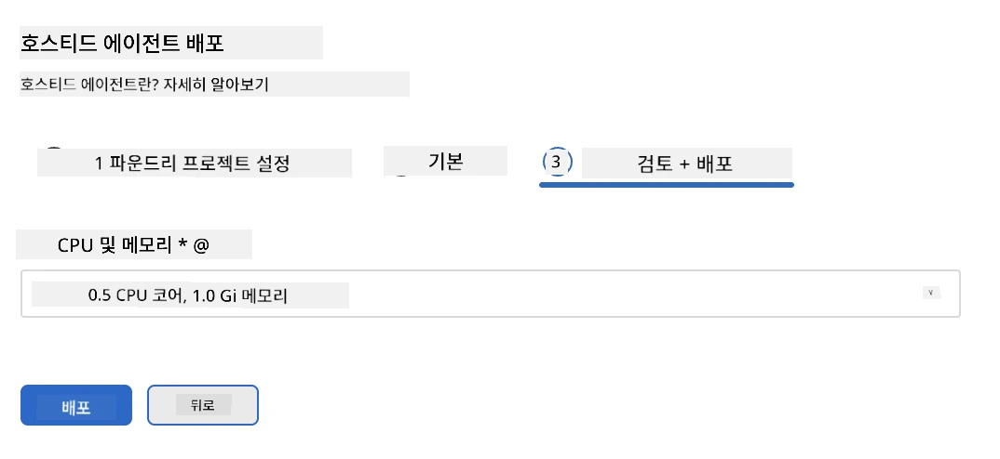
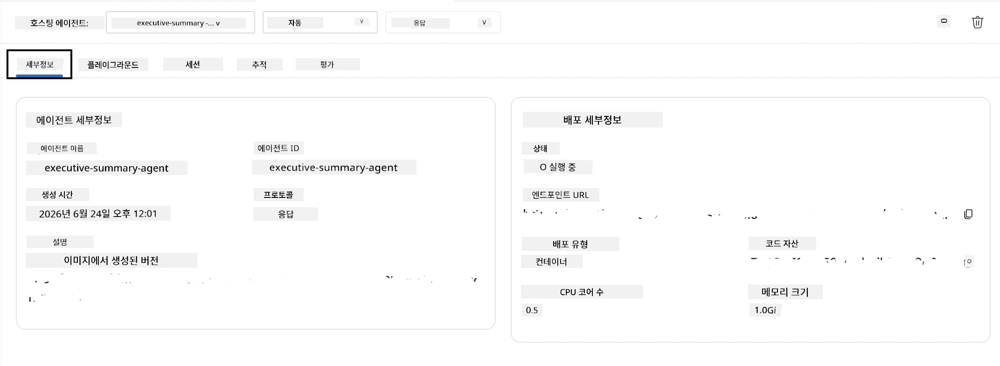

# 모듈 5 - Foundry 에이전트 서비스에 배포하기

⏱️ 약 10분

> ⚠️ **경로 B 사용자:** 이 모듈은 Foundry 구독이 필요합니다. Foundry Local을 사용 중이라면 [모듈 07 - 요약](07-summary.md)으로 넘어가세요. 로컬 개발 워크플로우를 성공적으로 완료했습니다!

이 모듈에서는 로컬에서 테스트한 에이전트를 Microsoft Foundry에 <strong>호스티드 에이전트</strong>로 배포합니다. 배포 과정에서 컨테이너 이미지를 빌드하고, Azure Container Registry에 푸시한 후 Foundry의 관리 인프라에서 에이전트를 시작합니다.

### 배포 파이프라인

---

## 사전 조건 확인

배포 전에 다음을 확인하세요:

- [ ] 에이전트가 [모듈 04](04-test-locally.md)의 3가지 로컬 시나리오 모두 통과함
- [ ] 프로젝트 수준에서 **Azure AI 사용자** 역할 보유 ([모듈 01, RBAC 할당](01-setup.md#deploy-a-model--assign-rbac))
- [ ] VS Code에서 Azure에 로그인되어 있음(계정 아이콘에 사용자 이름 표시)

---

## 1단계: 배포 시작

### 옵션 A: 에이전트 인스펙터에서 배포 (권장)

에이전트 인스펙터가 열려 있다면(테스트 중):
1. 오른쪽 상단의 <strong>배포</strong> 버튼(구름 아이콘 ↑)을 클릭합니다.

### 옵션 B: 명령 팔레트에서 배포

1. `Ctrl+Shift+P`를 누른 다음 <strong>Foundry Toolkit: 호스티드 에이전트 배포</strong>를 선택합니다.

---

## 2단계: 배포 설정

마법사가 다음을 안내합니다:

| 안내 | 선택 사항 |
|--------|-----------|
| <strong>구독</strong> | 귀하의 Azure 구독 |
| **대상 프로젝트** | 귀하의 Foundry 프로젝트 (예: `workshop-agents`) |

<strong>다음</strong>을 클릭하여 에이전트를 구성합니다.

| 안내 | 선택 사항 |
|--------|-----------|
| **배포 방법** | 컨테이너 |
| **컨테이너 레지스트리** | **기본 ACR** (Microsoft Foundry가 생성 및 관리) |
| **배포 대상** | 새 에이전트 (이름, `executive-summary-agent`) |

<strong>다음</strong>을 클릭하여 에이전트를 검토하고 배포합니다.

| 안내 | 선택 사항 |
|--------|-----------|
| **CPU 및 메모리** | **0.25 CPU 코어, 0.5 Gi 메모리** (워크숍에 충분함) |

---

## 3단계: 배포 및 모니터링

1. <strong>배포</strong>를 클릭합니다.
2. <strong>출력</strong> 패널을 관찰합니다 (드롭다운에서 **Microsoft Foundry** 선택).
3. 배포는 다음 단계로 진행됩니다:
   - **도커 빌드** - Dockerfile에서 컨테이너 빌드
   - **도커 푸시** - 이미지를 ACR에 푸시 (최초 배포 시 1~3분 소요)
   - **에이전트 등록** - Foundry에 호스티드 에이전트 생성
   - **컨테이너 시작** - 시스템 관리 아이덴티티로 시작

4. 완료되면 알림이 나타납니다:
   > **my-agent가 성공적으로 배포되었습니다.** `로그 보기` `에이전트 실행`

5. <strong>에이전트 실행</strong>을 클릭하여 에이전트 플레이그라운드를 엽니다.

### 배포 상태 값

| 상태 | 의미 |
|--------|---------|
| **실행 중** | 컨테이너가 준비되어 에이전트가 응답 중 |
| **대기 중** | 컨테이너가 시작 중 - 30~60초 대기 |
| <strong>실패</strong> | 로그 확인 필요 (아래 문제 해결 참조) |

---

## 일반적인 배포 오류

| 오류 | 근본 원인 | 해결법 |
|-------|-----------|-----|
| `agents/write` 권한 거부 | 프로젝트 수준에서 **Azure AI 사용자** 역할 누락 | [모듈 01, RBAC 할당](01-setup.md#deploy-a-model--assign-rbac) |
| 도커 실행 안 됨 | Docker Desktop 미실행 | Docker Desktop 시작 → `docker info`로 확인 |
| ACR 인증 문제 | 관리 아이덴티티가 이미지 가져오기 실패 | [모듈 08 - 문제 해결](08-troubleshooting.md) 참조 |

---

### ✅ 체크포인트

- [ ] 오류 없이 배포 완료
- [ ] Foundry 사이드바의 <strong>호스티드 에이전트(미리보기)</strong>에 에이전트 표시됨
- [ ] 컨테이너 상태가 <strong>실행 중</strong>으로 표시됨
- [ ] 에이전트 플레이그라운드 탭이 열려 에이전트 세부정보 및 엔드포인트 URL 표시

---

**이전:** [04 - 로컬에서 테스트하기](04-test-locally.md) · **다음:** [06 - 플레이그라운드에서 검증하기 →](06-verify-in-playground.md)

---

<!-- CO-OP TRANSLATOR DISCLAIMER START -->
**면책 조항**:
이 문서는 AI 번역 서비스 [Co-op Translator](https://github.com/Azure/co-op-translator)를 사용하여 번역되었습니다. 정확성을 기하기 위해 노력하고 있으나, 자동 번역은 오류나 부정확한 부분이 있을 수 있음을 유의하시기 바랍니다. 원본 문서의 원어본이 권위 있는 자료로 간주되어야 합니다. 중요한 정보의 경우, 전문가의 인간 번역을 권장합니다. 이 번역 사용으로 인해 발생하는 오해나 잘못된 해석에 대해 당사는 책임을 지지 않습니다.
<!-- CO-OP TRANSLATOR DISCLAIMER END -->