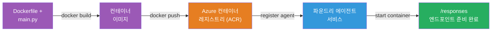
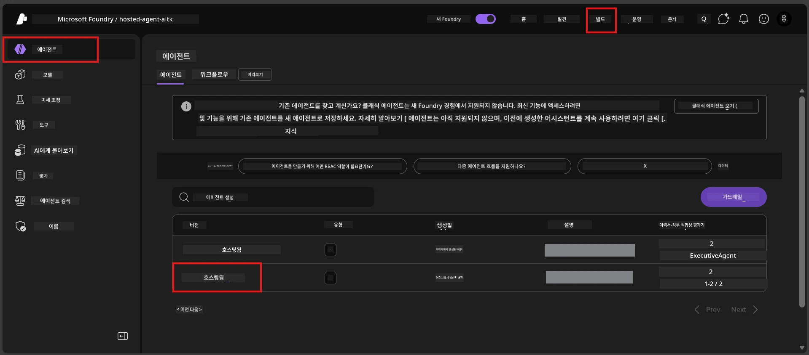

# Module 6 - Foundry 에이전트 서비스에 배포하기

이 모듈에서는 로컬에서 테스트한 에이전트를 Microsoft Foundry의 [**호스티드 에이전트**](https://learn.microsoft.com/azure/foundry/agents/concepts/hosted-agents)로 배포합니다. 배포 과정에서는 프로젝트에서 Docker 컨테이너 이미지를 빌드하고, 이를 [Azure Container Registry (ACR)](https://learn.microsoft.com/azure/container-registry/container-registry-intro)에 푸시한 뒤, [Foundry 에이전트 서비스](https://learn.microsoft.com/azure/foundry/agents/overview)에 호스티드 에이전트 버전을 생성합니다.

### 배포 파이프라인


---

## 전제 조건 확인

배포하기 전에 아래 항목들을 모두 확인하세요. 이 단계를 건너뛰는 것이 배포 실패의 가장 흔한 원인입니다.

1. **에이전트가 로컬 스모크 테스트를 통과함:**
   - [모듈 5](05-test-locally.md)에서 모든 4가지 테스트를 완료했고 에이전트가 올바르게 응답했음.

2. **[Azure AI User](https://learn.microsoft.com/azure/foundry/concepts/rbac-foundry#built-in-roles) 역할이 있음:**
   - [모듈 2, 3단계](02-create-foundry-project.md)에서 할당됨. 확실하지 않으면 지금 확인:
   - Azure Portal → 해당 Foundry <strong>프로젝트</strong> 리소스 → **액세스 제어 (IAM)** → **역할 할당** 탭 → 이름 검색 → <strong>Azure AI User</strong>가 목록에 있는지 확인.

3. **VS Code에서 Azure에 로그인됨:**
   - VS Code 왼쪽 하단의 계정 아이콘을 확인. 계정 이름이 보여야 함.

4. **(선택 사항) Docker Desktop이 실행 중임:**
   - 로컬 빌드를 요구하면 Docker가 필요하지만, 대부분 배포 중 확장 프로그램이 컨테이너 빌드를 자동으로 처리함.
   - Docker가 설치되어 있다면 `docker info`로 실행 중인지 확인.

---

## 1단계: 배포 시작

배포는 두 가지 방법이 있으며, 둘 다 같은 결과를 도출합니다.

### 옵션 A: 에이전트 인스펙터에서 배포(권장)

에이전트를 디버거(F5)로 실행 중이며, 에이전트 인스펙터가 열려 있으면:

1. 에이전트 인스펙터 패널의 <strong>오른쪽 상단</strong>을 확인하세요.
2. <strong>배포</strong> 버튼(위쪽 화살표가 있는 구름 아이콘)을 클릭하세요.
3. 배포 마법사가 열립니다.

### 옵션 B: 명령 팔레트에서 배포

1. `Ctrl+Shift+P`를 눌러 <strong>명령 팔레트</strong>를 엽니다.
2. <strong>Microsoft Foundry: Deploy Hosted Agent</strong>를 입력하고 선택합니다.
3. 배포 마법사가 열립니다.

---

## 2단계: 배포 설정

배포 마법사가 설정 단계를 안내합니다. 각 프롬프트에 따라 입력하세요:

### 2.1 대상 프로젝트 선택

1. 드롭다운에 Foundry 프로젝트 목록이 나타납니다.
2. 모듈 2에서 만든 프로젝트(예: `workshop-agents`)를 선택하세요.

### 2.2 컨테이너 에이전트 파일 선택

1. 에이전트 진입점을 선택하라는 요청이 옵니다.
2. **`main.py`** (Python)를 선택하세요 - 마법사가 에이전트 프로젝트를 식별하는 데 사용하는 파일입니다.

### 2.3 리소스 구성

| 설정 | 권장 값 | 참고 |
|---------|------------------|-------|
| **CPU** | `0.25` | 기본값, 워크숍에 충분함. 프로덕션 워크로드는 더 늘릴 수 있음 |
| <strong>메모리</strong> | `0.5Gi` | 기본값, 워크숍에 충분함 |

이 값들은 `agent.yaml`과 일치합니다. 기본값을 사용해도 됩니다.

---

## 3단계: 확인 및 배포

1. 마법사가 다음 내용을 요약해서 보여줍니다:
   - 대상 프로젝트 이름
   - 에이전트 이름(`agent.yaml`에서)
   - 컨테이너 파일과 리소스
2. 요약을 검토하고 **확인 후 배포** (또는 <strong>배포</strong>)를 클릭하세요.
3. VS Code에서 진행 상태를 확인하세요.

### 배포 중 일어나는 일 (순서대로)

배포는 여러 단계가 있습니다. VS Code <strong>출력</strong> 패널에서 ("Microsoft Foundry" 선택) 진행을 확인할 수 있습니다:

1. **Docker 빌드** - VS Code가 `Dockerfile`로부터 컨테이너 이미지를 빌드합니다. Docker 레이어 메시지가 출력됩니다:
   ```
   Step 1/6 : FROM python:<version>-slim
   Step 2/6 : WORKDIR /app
   ...
   Successfully built abc123def456
   ```

2. **Docker 푸시** - 이미지를 Foundry 프로젝트와 연결된 <strong>Azure Container Registry (ACR)</strong>에 푸시합니다. 첫 배포 시 1~3분 걸릴 수 있습니다 (기본 이미지 크기 >100MB).

3. **에이전트 등록** - Foundry 에이전트 서비스에서 새 호스티드 에이전트(또는 기존 에이전트 새 버전)를 생성합니다. `agent.yaml`의 메타데이터가 사용됩니다.

4. **컨테이너 시작** - 컨테이너가 Foundry의 관리 인프라에서 시작됩니다. 플랫폼은 [시스템 관리 ID](https://learn.microsoft.com/azure/foundry/agents/concepts/agent-identity)를 할당하고 `/responses` 엔드포인트를 노출합니다.

> **첫 배포는 느릴 수 있음** (Docker가 모든 레이어를 푸시해야 하기 때문). 이후 배포는 캐시된 레이어 덕분에 더 빠릅니다.

---

## 4단계: 배포 상태 확인

배포 명령이 완료된 후:

1. 활동 표시줄에서 Foundry 아이콘을 클릭해 **Microsoft Foundry** 사이드바를 엽니다.
2. 프로젝트 아래의 **Hosted Agents (Preview)** 섹션을 확장하세요.
3. 에이전트 이름(예: `ExecutiveAgent` 또는 `agent.yaml`의 이름)이 보입니다.
4. <strong>에이전트 이름을 클릭</strong>하여 확장합니다.
5. 하나 이상의 <strong>버전</strong>(예: `v1`)이 보입니다.
6. 버전을 클릭해 <strong>컨테이너 세부 정보</strong>를 확인하세요.
7. <strong>상태</strong> 필드를 확인합니다:

   | 상태 | 의미 |
   |--------|---------|
   | **Started** 또는 **Running** | 컨테이너가 실행 중이며 에이전트 준비 완료 |
   | **Pending** | 컨테이너가 시작 중 (30~60초 대기) |
   | **Failed** | 컨테이너 시작 실패 (로그 확인 - 아래 문제 해결 참조) |



> **"Pending" 상태가 2분 이상 지속되면:** 컨테이너가 기본 이미지를 끌어오는 중일 수 있습니다. 조금 더 기다리세요. 계속 대기 상태라면 컨테이너 로그를 확인하세요.

---

## 일반적인 배포 오류 및 해결 방법

### 오류 1: 권한 거부 - `agents/write`

```
Error: lacks the required data action 
Microsoft.CognitiveServices/accounts/AIServices/agents/write 
to perform POST /api/projects/{projectName}/assistants operation.
```

**원인:** 해당 <strong>프로젝트</strong> 수준에서 `Azure AI User` 역할이 없음.

**해결 방법:**

1. [https://portal.azure.com](https://portal.azure.com) 열기.
2. 검색창에 Foundry <strong>프로젝트</strong> 이름을 입력하고 클릭.
   - **중요:** 부모 계정/허브 리소스가 아닌 <strong>프로젝트</strong> 리소스("Microsoft Foundry project" 유형)인지 확인.
3. 왼쪽 탐색에서 **액세스 제어 (IAM)** 클릭.
4. **+ 추가** → **역할 할당 추가** 클릭.
5. <strong>역할</strong> 탭에서 [**Azure AI User**](https://learn.microsoft.com/azure/foundry/concepts/rbac-foundry#built-in-roles)를 검색하고 선택 후 <strong>다음</strong> 클릭.
6. <strong>구성원</strong> 탭에서 **사용자, 그룹 또는 서비스 주체** 선택.
7. **+ 구성원 선택** 클릭, 이름/이메일 검색 후 자신 선택 → <strong>선택</strong> 클릭.
8. **검토 + 할당** → 다시 **검토 + 할당** 클릭.
9. 역할 할당 전파까지 1~2분 대기.
10. 1단계부터 배포 다시 시도.

> 역할은 <strong>프로젝트</strong> 범위여야 하며, 계정 범위에만 있으면 배포 실패의 1순위 원인입니다.

### 오류 2: Docker가 실행 중이 아님

```
Error: Docker build failed / Cannot connect to Docker daemon
```

**해결 방법:**
1. Docker Desktop을 시작 (시작 메뉴 또는 시스템 트레이에서 찾기).
2. "Docker Desktop이 실행 중" 메시지가 나타날 때까지 30~60초 대기.
3. 터미널에서 `docker info` 실행해 확인.
4. **Windows 전용:** Docker Desktop 설정 → <strong>일반</strong> → **WSL 2 기반 엔진 사용** 활성화.
5. 배포 재시도.

### 오류 3: ACR 권한 오류 - `AcrPullUnauthorized`

```
Error: AcrPullUnauthorized
```

**원인:** Foundry 프로젝트의 관리형 ID에 컨테이너 레지스트리 풀 권한이 없음.

**해결 방법:**
1. Azure Portal에서 해당 <strong>[컨테이너 레지스트리](https://learn.microsoft.com/azure/container-registry/container-registry-intro)</strong>로 이동 (Foundry 프로젝트와 동일한 리소스 그룹).
2. **액세스 제어 (IAM)** → <strong>추가</strong> → **역할 할당 추가** 클릭.
3. **[AcrPull](https://learn.microsoft.com/azure/container-registry/container-registry-roles)** 역할 선택.
4. 구성원에서 **관리형 ID** 선택 → Foundry 프로젝트 관리형 ID 찾기.
5. **검토 + 할당** 클릭.

> 일반적으로 Foundry 확장 프로그램이 자동으로 설정합니다. 이 오류가 발생하면 자동 설정이 실패한 경우입니다.

### 오류 4: 컨테이너 플랫폼 불일치 (Apple Silicon)

Apple Silicon Mac(M1/M2/M3)에서 배포하는 경우 컨테이너는 `linux/amd64`로 빌드되어야 합니다:

```bash
docker build --platform linux/amd64 -t myagent:v1 .
```

> Foundry 확장 프로그램이 대부분 자동으로 처리합니다.

---

### 체크포인트

- [ ] VS Code에서 배포 명령이 오류 없이 완료됨
- [ ] Foundry 사이드바의 <strong>Hosted Agents (Preview)</strong>에 에이전트가 나타남
- [ ] 에이전트를 클릭 → 버전 선택 → **컨테이너 세부 정보** 확인함
- [ ] 컨테이너 상태가 **Started** 또는 <strong>Running</strong>임
- [ ] (오류가 있었다면) 오류를 확인하고 수정한 뒤 재배포 성공

---

**이전:** [05 - 로컬 테스트](05-test-locally.md) · **다음:** [07 - 플레이그라운드에서 검증 →](07-verify-in-playground.md)

---

<!-- CO-OP TRANSLATOR DISCLAIMER START -->
**면책조항**:  
이 문서는 AI 번역 서비스 [Co-op Translator](https://github.com/Azure/co-op-translator)를 사용하여 번역되었습니다. 정확성을 위해 노력하고 있으나, 자동 번역에는 오류나 부정확성이 있을 수 있음을 유의하시기 바랍니다. 원문은 해당 언어의 원본 문서가 권위 있는 출처로 간주되어야 합니다. 중요한 정보의 경우, 전문적인 인간 번역을 권장합니다. 본 번역 사용으로 인해 발생하는 오해나 잘못된 해석에 대해 저희는 책임지지 않습니다.
<!-- CO-OP TRANSLATOR DISCLAIMER END -->