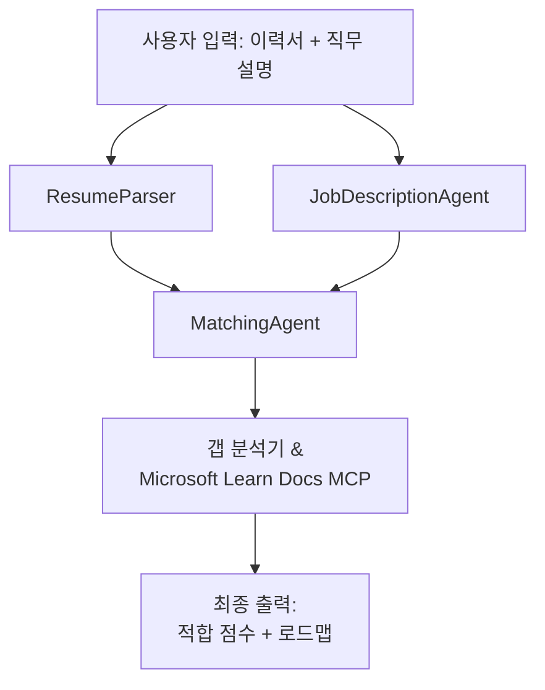

# PersonalCareerCopilot - 이력서 → 직무 적합도 평가기

이력서가 직무 설명과 얼마나 잘 맞는지 평가한 후, 격차를 해소하기 위한 맞춤형 학습 로드맵을 생성하는 멀티 에이전트 워크플로우입니다.

---

## 에이전트

| 에이전트 | 역할 | 도구 |
|-------|------|-------|
| **ResumeParser** | 이력서 텍스트에서 구조화된 기술, 경험, 자격증 추출 | - |
| **JobDescriptionAgent** | 직무 설명(JD)에서 요구/선호 기술, 경험, 자격증 추출 | - |
| **MatchingAgent** | 프로필과 요구 사항 비교 → 적합도 점수(0-100) + 일치/누락 기술 | - |
| **GapAnalyzer** | Microsoft Learn 리소스를 활용해 맞춤형 학습 로드맵 생성 | `search_microsoft_learn_for_plan` (MCP) |

## 워크플로우


---

## 빠른 시작

### 1. 환경 설정

```powershell
cd workshop\lab02-multi-agent\PersonalCareerCopilot
python -m venv .venv
.\.venv\Scripts\Activate.ps1          # Windows PowerShell
# source .venv/bin/activate            # macOS / Linux
pip install -r requirements.txt
```

### 2. 자격 증명 구성

예시 env 파일을 복사 후 Foundry 프로젝트 정보를 입력하세요:

```powershell
cp .env.example .env
```

`.env` 파일 편집:

```env
PROJECT_ENDPOINT=https://<your-account>.services.ai.azure.com/api/projects/<your-project>
MODEL_DEPLOYMENT_NAME=gpt-4.1-mini
```

| 값 | 위치 |
|-------|-----------------|
| `PROJECT_ENDPOINT` | VS Code 내 Microsoft Foundry 사이드바 → 프로젝트 우클릭 → **Copy Project Endpoint** |
| `MODEL_DEPLOYMENT_NAME` | Foundry 사이드바 → 프로젝트 확장 → **Models + endpoints** → 배포 이름 |

### 3. 로컬 실행

```powershell
python -m debugpy --listen 127.0.0.1:5679 -m agentdev run main.py --verbose --port 8088
```

또는 VS Code 작업: `Ctrl+Shift+P` → **Tasks: Run Task** → **Run Lab02 HTTP Server** 사용.

### 4. Agent Inspector로 테스트

Agent Inspector 열기: `Ctrl+Shift+P` → **Foundry Toolkit: Open Agent Inspector**.

아래 테스트 프롬프트 붙여넣기:

```
Resume:
Jane Doe
Senior Software Engineer with 5 years of experience in Python, Django, and AWS.
Built microservices handling 10K+ requests/second. Led a team of 4 developers.
Certifications: AWS Solutions Architect Associate.
Education: B.S. Computer Science, State University.

Job Description:
Senior Cloud Engineer at Contoso Ltd.
Required: Python, Azure, Kubernetes, Terraform, CI/CD pipelines.
Preferred: Go, monitoring (Prometheus/Grafana), cost optimization.
Experience: 5+ years in cloud infrastructure.
Certifications: Azure Solutions Architect Expert preferred.
```

**예상 결과:** 적합도 점수(0-100), 일치/누락 기술, Microsoft Learn URL 포함 개인화 학습 로드맵.

### 5. Foundry 배포

`Ctrl+Shift+P` → **Microsoft Foundry: Deploy Hosted Agent** → 프로젝트 선택 → 확인.

---

## 프로젝트 구조

```
PersonalCareerCopilot/
├── .env.example        ← Template for environment variables
├── .env                ← Your credentials (git-ignored)
├── agent.yaml          ← Hosted agent definition (name, resources, env vars)
├── Dockerfile          ← Container image for Foundry deployment
├── main.py             ← 4-agent workflow (instructions, MCP tool, WorkflowBuilder)
└── requirements.txt    ← Python dependencies
```

## 주요 파일

### `agent.yaml`

Foundry Agent Service의 호스팅 에이전트를 정의:
- `kind: hosted` - 관리형 컨테이너로 실행
- `protocols: [responses v1]` - `/responses` HTTP 엔드포인트 노출
- `environment_variables` - 배포 시 `PROJECT_ENDPOINT` 및 `MODEL_DEPLOYMENT_NAME` 주입

### `main.py`

포함 내용:
- **에이전트 지침** - 에이전트별 네 개의 `*_INSTRUCTIONS` 상수
- **MCP 도구** - `search_microsoft_learn_for_plan()`는 Streamable HTTP를 통해 `https://learn.microsoft.com/api/mcp` 호출
- **에이전트 생성** - `create_agents()` 컨텍스트 매니저에서 `AzureAIAgentClient.as_agent()` 사용
- **워크플로우 그래프** - `create_workflow()`는 `WorkflowBuilder`로 에이전트를 fan-out/fan-in/순차 패턴 연결
- **서버 시작** - `from_agent_framework(agent).run_async()`로 8088 포트 실행

### `requirements.txt`

| 패키지 | 버전 | 용도 |
|---------|---------|---------|
| `agent-framework-azure-ai` | `1.0.0rc3` | Microsoft Agent Framework용 Azure AI 통합 |
| `agent-framework-core` | `1.0.0rc3` | 핵심 런타임 (WorkflowBuilder 포함) |
| `azure-ai-agentserver-agentframework` | `1.0.0b16` | 호스팅 에이전트 서버 런타임 |
| `azure-ai-agentserver-core` | `1.0.0b16` | 핵심 에이전트 서버 추상화 |
| `debugpy` | 최신 | Python 디버깅 (VS Code에서 F5) |
| `agent-dev-cli` | `--pre` | 로컬 개발 CLI + Agent Inspector 백엔드 |

---

## 문제 해결

| 문제 | 해결 방법 |
|-------|-----|
| `RuntimeError: Missing required environment variable(s)` | `PROJECT_ENDPOINT` 및 `MODEL_DEPLOYMENT_NAME` 포함 `.env` 파일 생성 |
| `ModuleNotFoundError: No module named 'agent_framework'` | 가상환경 활성화 후 `pip install -r requirements.txt` 실행 |
| 출력에 Microsoft Learn URL 없음 | `https://learn.microsoft.com/api/mcp` 인터넷 연결 확인 |
| 격차 카드가 1개만 표시(잘림) | `GAP_ANALYZER_INSTRUCTIONS`에 `CRITICAL:` 블록 포함 여부 확인 |
| 포트 8088 사용 중 | 다른 서버 중지: `netstat -ano \| findstr :8088` |

자세한 문제 해결은 [Module 8 - Troubleshooting](../docs/08-troubleshooting.md) 참고.

---

**전체 과정:** [Lab 02 Docs](../docs/README.md) · **뒤로가기:** [Lab 02 README](../README.md) · [워크숍 홈](../../../README.md)

---

<!-- CO-OP TRANSLATOR DISCLAIMER START -->
**면책 조항**:  
이 문서는 AI 번역 서비스 [Co-op Translator](https://github.com/Azure/co-op-translator)를 사용하여 번역되었습니다. 정확성을 위해 노력하고 있으나, 자동 번역은 오류나 부정확성이 포함될 수 있음을 유의하시기 바랍니다. 원문 문서는 권위 있는 출처로 간주되어야 합니다. 중요한 정보는 전문적인 인간 번역을 권장합니다. 본 번역 사용으로 인한 오해나 잘못된 해석에 대해서는 책임을 지지 않습니다.
<!-- CO-OP TRANSLATOR DISCLAIMER END -->