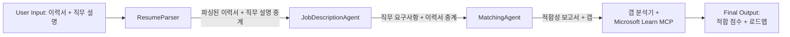

# PersonalCareerCopilot - 이력서 → 직무 적합도 평가기

이 workflow 우선 다중 에이전트 앱은 이력서가 직무 설명과 얼마나 잘 맞는지 평가한 후, 격차를 해소하기 위한 개인 맞춤 학습 로드맵을 생성합니다.

---

## 에이전트

| 에이전트 | 역할 | 도구 |
|-------|------|-------|
| **ResumeParser** | 이력서 텍스트에서 구조화된 기술, 경험, 자격증 추출 | - |
| **JobDescriptionAgent** | 직무 설명에서 필수/선호 기술, 경험, 자격증 추출 | - |
| **MatchingAgent** | 프로필과 요구 사항 비교 → 적합도 점수 (0-100) + 일치/누락 기술 | - |
| **GapAnalyzer** | Microsoft Learn 리소스를 활용한 개인 맞춤 학습 로드맵 구축 | `search_microsoft_learn_for_plan` (MCP) |

## 워크플로우


```mermaid
flowchart LR
    UserInput["User Input: 이력서 + 직무 설명"] --> ResumeParser
    ResumeParser -- "파싱된 이력서 + 직무 설명 중계" --> JobDescriptionAgent
    JobDescriptionAgent -- "직무 요구사항 + 이력서 중계" --> MatchingAgent
    MatchingAgent -- "적합성 보고서 + 갭" --> GapAnalyzerMCP["갭 분석기 +\nMicrosoft Learn MCP"]
    GapAnalyzerMCP --> FinalOutput["Final Output:\n적합 점수 + 로드맵"]
```

---

## 빠른 시작

### 1. 환경 설정

이 폴더는 workflow 기반 Lab 02 스캐폴드의 참조 구현입니다. `main.py`는 기존 프롬프트 블록과 `WorkflowBuilder`를 사용해 네 개 에이전트를 연결합니다.

```powershell
cd workshop\lab02-multi-agent\PersonalCareerCopilot
python -m venv .venv
.\.venv\Scripts\Activate.ps1          # Windows PowerShell
# source .venv/bin/activate            # macOS / Linux
pip install -r requirements.txt
```

### 2. 자격 증명 구성

이 폴더에 `.env` 파일을 생성하세요:

```powershell
copy .env .env.bak 2>$null; echo $null > .env
```

`.env`를 편집하세요:

```env
FOUNDRY_PROJECT_ENDPOINT=https://<your-account>.services.ai.azure.com/api/projects/<your-project>
AZURE_AI_MODEL_DEPLOYMENT_NAME=gpt-4.1-mini
```

| 값 | 위치 |
|-------|------------------|
| `FOUNDRY_PROJECT_ENDPOINT` | Foundry Toolkit 사이드바 → 프로젝트 우클릭 → **Copy Project Endpoint** |
| `AZURE_AI_MODEL_DEPLOYMENT_NAME` | Foundry 사이드바 → 프로젝트 확장 → **Models + endpoints** → 배포 이름 |

### 3. 로컬 실행

```powershell
python -m debugpy --listen 127.0.0.1:5679 main.py --port 8088
```

또는 VS Code 작업 사용: `Ctrl+Shift+P` → **Tasks: Run Task** → **Run Agent HTTP Server**.

F5 디버깅 시에는 <strong>Debug Local Agent HTTP Server</strong>를 사용하세요.

### 4. Agent Inspector로 테스트

Agent Inspector 열기: `Ctrl+Shift+P` → **Foundry Toolkit: Open Agent Inspector**.

다음 테스트 프롬프트를 붙여넣으세요:

```
Resume:
Jane Doe
Senior Software Engineer with 5 years of experience in Python, Django, and AWS.
Built microservices handling 10K+ requests/second. Led a team of 4 developers.
Certifications: AWS Solutions Architect Associate.
Education: B.S. Computer Science, State University.

Job Description:
Senior Cloud Engineer at Contoso Ltd.
Required: Python, Azure, Kubernetes, Terraform, CI/CD pipelines.
Preferred: Go, monitoring (Prometheus/Grafana), cost optimization.
Experience: 5+ years in cloud infrastructure.
Certifications: Azure Solutions Architect Expert preferred.
```

**예상 결과:** 적합도 점수 (0-100), 일치/누락 기술, Microsoft Learn URL이 포함된 개인 맞춤 학습 로드맵.

### 5. Foundry에 배포

`Ctrl+Shift+P` → **Foundry Toolkit: Deploy Hosted Agent** → 프로젝트 선택 → 확인.

---

## 프로젝트 구조

```
PersonalCareerCopilot/
├── .env                ← Your credentials (git-ignored)
├── agent.yaml          ← Hosted agent definition (name, resources, env vars)
├── Dockerfile          ← Container image for Foundry deployment
├── main.py             ← 4-agent workflow (instructions, MCP tool, WorkflowBuilder)
└── requirements.txt    ← Python dependencies
```

## 주요 파일

### `agent.yaml`

Foundry Agent Service용 호스팅 에이전트를 정의합니다:
- `kind: hosted` - 관리되는 컨테이너로 실행
- `protocols` - `version: 1.0.0`의 `responses` 프로토콜, `/responses` HTTP 엔드포인트 노출
- `environment_variables` - `AZURE_AI_MODEL_DEPLOYMENT_NAME` 선언; `FOUNDRY_PROJECT_ENDPOINT`는 배포 시 자동 주입

### `main.py`

포함 내용:
- **에이전트 명령어** - 에이전트별 네 개의 `*_INSTRUCTIONS` 상수
- **MCP 도구** - Streamable HTTP를 통해 `search_microsoft_learn_for_plan()`가 `https://learn.microsoft.com/api/mcp` 호출
- **에이전트 생성** - 하나의 `FoundryChatClient`를 공유하는 네 개의 `Agent()` + `AgentExecutor()` 인스턴스
- **워크플로우 그래프** - `WorkflowBuilder`가 에이전트를 순차 파이프라인으로 연결: ResumeParser → JD Agent → MatchingAgent → GapAnalyzer
- **서버 시작** - `ResponsesHostServer`가 포트 8088에서 실행

### `requirements.txt`

| 패키지 | 용도 |
|---------|----------|
| `agent-framework-foundry` | 핵심 런타임: `Agent`, `AgentExecutor`, `WorkflowBuilder`, `@tool`, `FoundryChatClient` |
| `agent-framework-foundry-hosting` | `ResponsesHostServer` + Foundry 호스팅 통합 |
| `mcp<2,>=1.24.0` | GapAnalyzer용 MCP 클라이언트 (`streamable_http_client`) |
| `debugpy` | Python 디버깅 (VS Code F5) |

---

## 문제 해결

| 문제 | 해결책 |
|-------|-----|
| `KeyError: 'FOUNDRY_PROJECT_ENDPOINT'` 또는 `KeyError: 'AZURE_AI_MODEL_DEPLOYMENT_NAME'` | `FOUNDRY_PROJECT_ENDPOINT`와 `AZURE_AI_MODEL_DEPLOYMENT_NAME`가 설정된 `.env` 생성 |
| `ModuleNotFoundError: No module named 'agent_framework'` | 가상환경 활성화 후 `pip install -r requirements.txt` 실행 |
| 출력에 Microsoft Learn URL 없음 | `https://learn.microsoft.com/api/mcp`와 인터넷 연결 확인 |
| 격차 카드가 1개만 표시됨 (잘림 현상) | `GAP_ANALYZER_INSTRUCTIONS`에 `CRITICAL:` 블록 포함 여부 확인 |
| 포트 8088 사용 중 | 다른 서버 중지: `netstat -ano \| findstr :8088` |

자세한 문제 해결 방법은 [Module 8 - Troubleshooting](../docs/08-troubleshooting.md)을 참고하세요.

---

**전체 워크스루:** [Lab 02 Docs](../docs/README.md) · **뒤로가기:** [Lab 02 README](../README.md) · [워크숍 홈](../../../README.md)

---

<!-- CO-OP TRANSLATOR DISCLAIMER START -->
**면책 조항**:
이 문서는 AI 번역 서비스 [Co-op Translator](https://github.com/Azure/co-op-translator)를 사용하여 번역되었습니다. 정확성을 기하기 위해 노력하고 있으나, 자동 번역은 오류나 부정확한 부분이 있을 수 있음을 유의하시기 바랍니다. 원본 문서의 원어본이 권위 있는 자료로 간주되어야 합니다. 중요한 정보의 경우, 전문가의 인간 번역을 권장합니다. 이 번역 사용으로 인해 발생하는 오해나 잘못된 해석에 대해 당사는 책임을 지지 않습니다.
<!-- CO-OP TRANSLATOR DISCLAIMER END -->