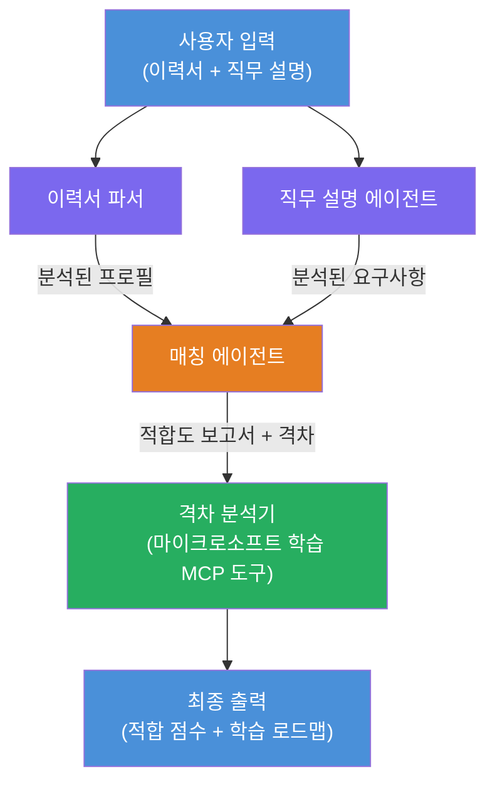

# Lab 02 - 다중 에이전트 워크플로우: 이력서 → 직무 적합도 평가기

---

## 만들 내용

**이력서 → 직무 적합도 평가기** - 네 명의 전문 에이전트가 협력하여 후보자의 이력서가 직무 설명에 얼마나 잘 부합하는지 평가하고, 격차를 해소하기 위한 개인 맞춤 학습 로드맵을 생성하는 다중 에이전트 워크플로우입니다.

### 에이전트 소개

| 에이전트 | 역할 |
|-------|------|
| **이력서 파서** | 이력서 텍스트에서 구조화된 기술, 경험, 자격증 추출 |
| **직무 설명 에이전트** | 직무 설명(JD)에서 필수/선호 기술, 경험, 자격증 추출 |
| **매칭 에이전트** | 프로필과 요구사항 비교 → 적합도 점수(0-100) + 일치/부족 기술 산출 |
| **격차 분석기** | 리소스, 일정, 빠른 프로젝트와 함께 개인 맞춤 학습 로드맵 작성 |

### 데모 흐름

**이력서 + 직무 설명** 업로드 → **적합도 점수 + 부족 기술** 획득 → **개인 맞춤 학습 로드맵** 수령.

### 워크플로우 아키텍처

> 보라색 = 병렬 에이전트 | 주황색 = 집계 지점 | 초록색 = 도구를 갖춘 최종 에이전트. 자세한 다이어그램과 데이터 흐름은 [모듈 1 - 아키텍처 이해](docs/01-understand-multi-agent.md) 및 [모듈 4 - 오케스트레이션 패턴](docs/04-orchestration-patterns.md)을 참조하세요.

### 학습 주제

- <strong>WorkflowBuilder</strong>를 이용한 다중 에이전트 워크플로우 생성  
- 에이전트 역할 정의 및 오케스트레이션 흐름(병렬 + 순차)  
- 에이전트 간 통신 패턴  
- Agent Inspector로 로컬 테스트  
- Foundry Agent Service에 다중 에이전트 워크플로우 배포

---

## 사전 조건

먼저 Lab 01 완료:

- [Lab 01 - 단일 에이전트](../lab01-single-agent/README.md)

---

## 시작하기

전체 설정 지침, 코드 해설, 테스트 명령어는 다음에서 확인:

- [Lab 2 문서 - 사전 조건](docs/00-prerequisites.md)  
- [Lab 2 문서 - 전체 학습 경로](docs/README.md)  
- [PersonalCareerCopilot 실행 가이드](PersonalCareerCopilot/README.md)

## 오케스트레이션 패턴 (에이전트 대안)

Lab 2는 기본 **병렬 → 집계기 → 플래너** 흐름을 포함하며, 문서에는 더욱 강력한 에이전트 동작을 보여주는 대안적 패턴도 설명합니다:

- **가중 합의 방식의 팬아웃/팬인**  
- **최종 로드맵 전 리뷰어/비평가 단계**  
- **조건부 라우터** (적합도 점수와 부족 기술에 따른 경로 선택)

자세한 내용은 [docs/04-orchestration-patterns.md](docs/04-orchestration-patterns.md)를 참고하세요.

---

**이전:** [Lab 01 - 단일 에이전트](../lab01-single-agent/README.md) · **목차로:** [워크숍 홈](../../README.md)

---

<!-- CO-OP TRANSLATOR DISCLAIMER START -->
**면책 조항**:  
이 문서는 AI 번역 서비스 [Co-op Translator](https://github.com/Azure/co-op-translator)를 사용하여 번역되었습니다. 정확성을 위해 노력하고 있으나 자동 번역은 오류나 부정확성이 포함될 수 있음을 유의하시기 바랍니다. 원문 문서는 해당 언어의 권위 있는 자료로 간주되어야 합니다. 중요한 정보에 대해서는 전문적인 인간 번역을 권장합니다. 본 번역 사용으로 인한 오해나 잘못된 해석에 대해 당사는 책임을 지지 않습니다.
<!-- CO-OP TRANSLATOR DISCLAIMER END -->