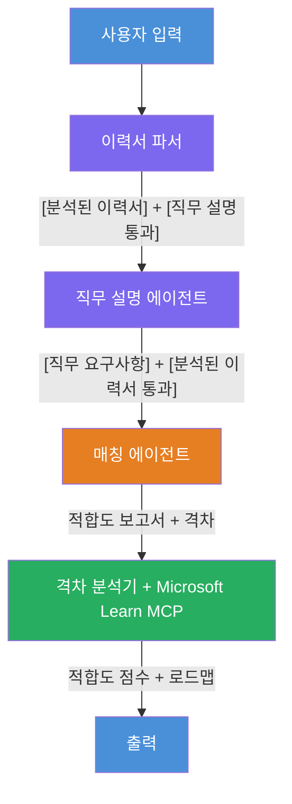

# 실습 02 - 다중 에이전트 워크플로우: 이력서 → 직무 적합도 평가기

## 개요

이 핸즈온 실습에서는 VS Code의 Foundry Toolkit을 사용하여 <strong>워크플로우 중심 다중 에이전트 앱</strong>을 구축하고 Microsoft Foundry Agent Service에 배포합니다.

**구축할 내용:** 이력서와 직무 설명을 파싱하여 일치도를 평가하고, Microsoft Learn 리소스를 활용한 개인 맞춤 학습 로드맵을 생성하는 이력서 → 직무 적합도 평가기입니다.

---

## 아키텍처

```mermaid
flowchart TD
    A["사용자 입력"] --> B["이력서 파서"]
    B -->|"[분석된 이력서] + [직무 설명 통과]"| C["직무 설명 에이전트"]
    C -->|"[직무 요구사항] + [분석된 이력서 통과]"| D["매칭 에이전트"]
    D -->|적합도 보고서 + 격차| E["격차 분석기 + Microsoft Learn MCP"]
    E -->|적합도 점수 + 로드맵| F["출력"]

    style A fill:#4A90D9,color:#fff
    style B fill:#7B68EE,color:#fff
    style C fill:#7B68EE,color:#fff
    style D fill:#E67E22,color:#fff
    style E fill:#27AE60,color:#fff
    style F fill:#4A90D9,color:#fff
```

**작동 원리:**
1. 사용자가 이력서와 직무 설명을 붙여넣습니다.
2. <strong>ResumeParser</strong>가 이력서를 파싱하고 JD를 원문 그대로 `[JOB DESCRIPTION PASS-THROUGH]` 섹션에 복사합니다.
3. <strong>JD Agent</strong>는 패스스루를 통해 구조화된 요구사항을 추출하고, `[PARSED RESUME]`를 `[PARSED RESUME PASS-THROUGH]`로 전달합니다.
4. <strong>MatchingAgent</strong>가 `[PARSED RESUME PASS-THROUGH]`와 `[JD REQUIREMENTS]`를 비교하여 적합도 점수를 산출합니다.
5. <strong>GapAnalyzer</strong>는 격차를 실질적인 로드맵으로 전환하고 MCP를 통해 실제 Microsoft Learn 링크를 가져옵니다.

---

## 사전 준비 사항

먼저 실습 01을 완료하세요:

- [실습 01 - 단일 에이전트](../lab01-single-agent/README.md)

---

## 1부: 모듈을 순서대로 읽기

전체 학습 경로는 다음에서 확인하세요:

- [실습 2 문서 - 사전 준비](docs/00-prerequisites.md)
- [실습 2 문서 - 전체 학습 경로](docs/README.md)
- [PersonalCareerCopilot 실행 가이드](PersonalCareerCopilot/README.md)

---

## 2부: 워크플로우 구축 및 테스트

1. Foundry Toolkit 마법사를 사용하여 워크플로우 기반 프로젝트를 스캐폴딩합니다.
2. `PersonalCareerCopilot/main.py`에서 프롬프트 블록과 워크플로우 그래프를 복사하여 작업 공간에 붙여넣습니다.
3. Agent Inspector로 로컬에서 실행하여 네 개의 에이전트와 MCP 도구가 모두 작동하는지 확인합니다.
4. 로컬 테스트가 통과하면 호스팅 에이전트를 Foundry에 배포합니다.

---

## 오케스트레이션 패턴

실습 02에는 기본 **팬아웃 → 팬인 → 순차** 흐름이 포함되며, 문서에는 실험용 대체 오케스트레이션 패턴도 설명되어 있습니다.

- **가중 합의 기반 팬아웃/팬인**
- **최종 로드맵 전 리뷰어/비평가 패스**
- **적합도 점수 및 누락 기술 기준 조건부 라우터**

[docs/04-orchestration-patterns.md](docs/04-orchestration-patterns.md)를 참조하세요.

---

**이전:** [실습 01 - 단일 에이전트](../lab01-single-agent/README.md) · **목록으로:** [워크숍 홈](../../README.md)

---

<!-- CO-OP TRANSLATOR DISCLAIMER START -->
**면책 조항**:
이 문서는 AI 번역 서비스 [Co-op Translator](https://github.com/Azure/co-op-translator)를 사용하여 번역되었습니다. 정확성을 기하기 위해 노력하고 있으나, 자동 번역은 오류나 부정확한 부분이 있을 수 있음을 유의하시기 바랍니다. 원본 문서의 원어본이 권위 있는 자료로 간주되어야 합니다. 중요한 정보의 경우, 전문가의 인간 번역을 권장합니다. 이 번역 사용으로 인해 발생하는 오해나 잘못된 해석에 대해 당사는 책임을 지지 않습니다.
<!-- CO-OP TRANSLATOR DISCLAIMER END -->