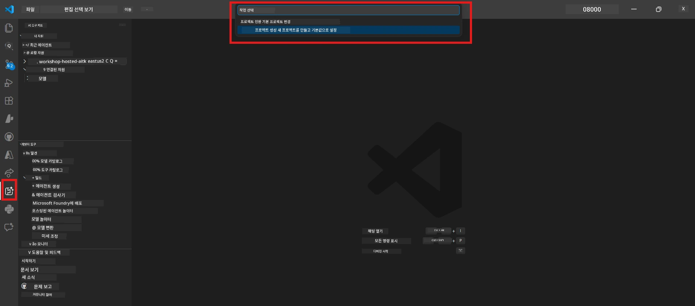

# Module 0 - 사전 준비 사항

Lab 02를 시작하기 전에 다음이 완료되었는지 확인하세요. 이 랩은 Lab 01을 기반으로 진행되므로 건너뛰지 마십시오.

---

## 1. Lab 01 완료하기

Lab 02는 다음을 이미 완료했다고 가정합니다:

- [x] [Lab 01 - Single Agent](../../lab01-single-agent/README.md)의 8개 모듈 모두 완료
- [x] 단일 에이전트를 Foundry Agent Service에 성공적으로 배포
- [x] 로컬 Agent Inspector와 Foundry Playground 모두에서 에이전트 작동 확인

Lab 01을 완료하지 않았다면 지금 돌아가서 마무리하세요: [Lab 01 문서](../../lab01-single-agent/docs/00-prerequisites.md)

---

## 2. 기존 설정 확인

Lab 01에서 사용한 모든 도구가 여전히 설치되어 작동하는지 확인하세요. 다음 간단한 점검을 수행합니다:

### 2.1 Azure CLI

```powershell
az account show --query "{name:name, id:id}" --output table
```

예상 결과: 구독 이름과 ID가 표시됩니다. 실패 시, [`az login`](https://learn.microsoft.com/cli/azure/authenticate-azure-cli-interactively)를 실행하세요.

### 2.2 VS Code 확장

1. `Ctrl+Shift+P`를 누르고 **"Microsoft Foundry"** 입력 → 명령어가 보이는지 확인 (예: `Microsoft Foundry: Create a New Hosted Agent`)
2. `Ctrl+Shift+P`를 누르고 **"Foundry Toolkit"** 입력 → 명령어가 보이는지 확인 (예: `Foundry Toolkit: Open Agent Inspector`)

### 2.3 Foundry 프로젝트 & 모델

1. VS Code 활동 표시줄에서 **Microsoft Foundry** 아이콘 클릭
2. 프로젝트가 리스트에 있는지 확인 (예: `workshop-agents`)
3. 프로젝트를 확장 → 배포된 모델이 있고 상태가 <strong>Succeeded</strong>인지 확인 (예: `gpt-4.1-mini`)

> **모델 배포가 만료된 경우:** 일부 무료 계층 배포는 자동 만료됩니다. [모델 카탈로그](https://learn.microsoft.com/azure/foundry/foundry-models/concepts/models-sold-directly-by-azure)에서 다시 배포하세요 (`Ctrl+Shift+P` → **Microsoft Foundry: Open Model Catalog**).



### 2.4 RBAC 역할

Foundry 프로젝트에서 **Azure AI User** 역할이 있는지 확인하세요:

1. [Azure Portal](https://portal.azure.com) → Foundry <strong>프로젝트</strong> 리소스 → **액세스 제어 (IAM)** → **[역할 할당](https://learn.microsoft.com/azure/foundry/concepts/rbac-foundry)** 탭
2. 이름을 검색 → <strong>[Azure AI User](https://aka.ms/foundry-ext-project-role)</strong>가 있는지 확인

---

## 3. 멀티 에이전트 개념 이해하기 (Lab 02 신규)

Lab 02는 Lab 01에서 다루지 않은 개념을 도입합니다. 계속 진행하기 전에 읽어보세요:

### 3.1 멀티 에이전트 워크플로우란?

한 에이전트가 모든 작업을 처리하는 대신, <strong>멀티 에이전트 워크플로우</strong>는 여러 전문화된 에이전트에 작업을 분할합니다. 각 에이전트는:

- 고유한 <strong>지침</strong> (시스템 프롬프트)
- 고유한 <strong>역할</strong> (책임 범위)
- 선택적 <strong>도구</strong> (호출 가능한 함수)

에이전트들은 데이터 흐름을 정의하는 <strong>오케스트레이션 그래프</strong>를 통해 소통합니다.

### 3.2 WorkflowBuilder

`agent_framework`의 [`WorkflowBuilder`](https://learn.microsoft.com/agent-framework/workflows/agents-in-workflows) 클래스는 에이전트들을 연결하는 SDK 구성 요소입니다:

```python
from agent_framework import WorkflowBuilder

workflow = (
    WorkflowBuilder(
        name="MyWorkflow",
        start_executor=agent_a,
        output_executors=[agent_d],
    )
    .add_edge(agent_a, agent_b)
    .add_edge(agent_a, agent_c)
    .add_edge(agent_b, agent_d)
    .add_edge(agent_c, agent_d)
    .build()
)
```

- **`start_executor`** - 사용자 입력을 처음 받는 에이전트
- **`output_executors`** - 최종 응답이 되는 출력 에이전트(들)
- **`add_edge(source, target)`** - `target`이 `source`의 출력을 받도록 정의

### 3.3 MCP (Model Context Protocol) 도구

Lab 02에서는 Microsoft Learn API를 호출해 학습 자료를 가져오는 <strong>MCP 도구</strong>를 사용합니다. [MCP (Model Context Protocol)](https://modelcontextprotocol.io/introduction)은 AI 모델과 외부 데이터 소스 및 도구를 연결하는 표준화된 프로토콜입니다.

| 용어 | 정의 |
|------|-----------|
| **MCP 서버** | [MCP 프로토콜](https://learn.microsoft.com/azure/foundry/agents/how-to/tools/model-context-protocol)을 통해 도구/리소스를 제공하는 서비스 |
| **MCP 클라이언트** | MCP 서버에 연결해 도구를 호출하는 에이전트 코드 |
| **[스트리밍 가능한 HTTP](https://learn.microsoft.com/agent-framework/agents/tools/hosted-mcp-tools)** | MCP 서버와 통신하는 전송 방식 |

### 3.4 Lab 02가 Lab 01과 다른 점

| 항목 | Lab 01 (단일 에이전트) | Lab 02 (멀티 에이전트) |
|--------|----------------------|---------------------|
| 에이전트 수 | 1 | 4개 (전문화된 역할) |
| 오케스트레이션 | 없음 | WorkflowBuilder (병렬 + 순차 처리) |
| 도구 | 선택적 `@tool` 함수 | MCP 도구 (외부 API 호출) |
| 복잡도 | 단순 프롬프트 → 응답 | 이력서 + JD → 적합도 점수 → 로드맵 |
| 컨텍스트 흐름 | 직접 | 에이전트 간 전달 |

---

## 4. Lab 02 워크숍 저장소 구조

Lab 02 파일의 위치를 확인하세요:

```
workshop/
└── lab02-multi-agent/
    ├── README.md                       ← Lab overview
    ├── docs/                           ← You are here
    │   ├── README.md                   ← Learning path index
    │   ├── 00-prerequisites.md         ← This file
    │   ├── 01-understand-multi-agent.md
    │   ├── ...
    │   └── 08-troubleshooting.md
    └── PersonalCareerCopilot/          ← The agent project
        ├── agent.yaml                  ← Agent definition
        ├── main.py                     ← 4-agent workflow code
        ├── Dockerfile                  ← Container configuration
        └── requirements.txt            ← Python dependencies
```

---

### 체크포인트

- [ ] Lab 01을 완전히 완료함 (8개 모듈 모두, 에이전트 배포 및 검증)
- [ ] `az account show` 명령어가 구독 정보 반환
- [ ] Microsoft Foundry 및 Foundry Toolkit 확장 프로그램 설치 및 작동 확인
- [ ] Foundry 프로젝트에 배포된 모델 존재 (예: `gpt-4.1-mini`)
- [ ] 프로젝트에서 **Azure AI User** 역할 보유
- [ ] 위의 멀티 에이전트 개념 섹션을 읽고 WorkflowBuilder, MCP, 에이전트 오케스트레이션 이해

---

**다음:** [01 - 멀티 에이전트 아키텍처 이해하기 →](01-understand-multi-agent.md)

---

<!-- CO-OP TRANSLATOR DISCLAIMER START -->
**면책 조항**:  
이 문서는 AI 번역 서비스 [Co-op Translator](https://github.com/Azure/co-op-translator)를 사용하여 번역되었습니다. 정확성을 위해 노력하고 있으나, 자동 번역은 오류나 부정확성이 포함될 수 있음을 유의하시기 바랍니다. 원문은 해당 언어의 원본 문서를 권위 있는 출처로 간주해야 합니다. 중요한 정보의 경우 전문적인 사람의 번역을 권장합니다. 본 번역 사용으로 인해 발생하는 오해나 잘못된 해석에 대해 당사는 책임을 지지 않습니다.
<!-- CO-OP TRANSLATOR DISCLAIMER END -->