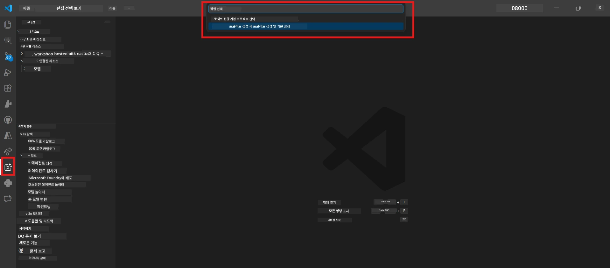

# 모듈 0 - 소개

⏱️ 약 10분

> [!WARNING]
> **미리보기 및 제한사항:** [호스팅 에이전트](https://learn.microsoft.com/azure/foundry/agents/concepts/hosted-agents)는 현재 **공개 미리보기** 상태이며, 프로덕션 워크로드에는 권장되지 않습니다. 이 워크숍에서 보여지는 일부 기능은 서비스가 정식 출시(GA)로 가면서 변경될 수 있습니다.

## 여러분이 만들 내용

이 랩에서는 Lab 01에서 단일 에이전트 기술을 확장하여 **멀티 에이전트 워크플로우** - 이력서 → 직무 적합도 평가기를 만듭니다.

여러분은 <strong>이력서</strong>와 <strong>직무 설명서</strong>를 붙여넣습니다. 네 명의 특수화된 에이전트가 입력을 순차적으로 처리한 후 다음을 반환합니다:
- 적합 점수 (0–100 및 점수 세부 내역)
- 기술 및 자격증 차이 목록
- 각 차이에 대해 실제 Microsoft Learn 링크가 포함된 개인화된 학습 로드맵

**워크플로우 구성 요소:**
- **Microsoft Agent Framework** - 순차 파이프라인 오케스트레이션에 사용하는 `WorkflowBuilder`
- **Foundry Toolkit for VS Code** - 스캐폴딩, 로컬 테스트, 배포
- **AI 모델** (예: `gpt-4.1-mini`) - 네 개의 에이전트 모두에 사용
- **Microsoft Learn MCP 서버** - 각 기술 차이에 대해 실제 학습 리소스 링크 제공

---

## 경로 선택

> ⚠️ **Lab 01에서 사용한 동일 경로로 계속 진행하세요.**

<details open>
<summary><strong>🅰️ 경로 A - Azure 클라우드 (Azure 구독 필요)</strong></summary>

| | 세부 사항 |
|---|---|
| **대상 사용자** | Azure 구독으로 Lab 01을 완료한 분 |
| <strong>모델</strong> | Foundry를 통한 Azure OpenAI (예: `gpt-4.1-mini`) |
| **다루는 모듈** | 전체 모듈 (00–09) |
| **클라우드에 배포?** | ✅ 예 - 완전한 엔드투엔드 배포 |

</details>

<details open>
<summary><strong>🅱️ 경로 B - Foundry Local (Azure 구독 불필요)</strong></summary>

| | 세부 사항 |
|---|---|
| **대상 사용자** | Foundry Local로 Lab 01을 완료한 분 |
| <strong>모델</strong> | Foundry Local (무료, 사용자의 컴퓨터에서 실행) |
| **다루는 모듈** | 모듈 00–05 (06–07 배포 및 클라우드 검증은 생략) |
| **클라우드에 배포?** | ❌ 아니요 - Agent Inspector를 통한 로컬 테스트만 수행 |

</details>

---

## Lab 01 확인

Lab 02는 Lab 01을 직접 기반으로 합니다. 먼저 Lab 01을 완료한 후 시작하세요.

Lab 01을 완료하지 않았다면, 여기서 시작하세요: [Lab 01 - 소개](../../lab01-single-agent/docs/00-prerequisites.md)

<details open>
<summary><strong>🅰️ 경로 A - Azure 클라우드</strong></summary>

```powershell
az account show --query "{name:name, id:id}" --output table
```

실패하면 `az login`을 실행하세요. 그런 다음 VS Code에서 확인하세요:

1. `Ctrl+Shift+P` → **Foundry Toolkit** 입력 → 명령이 나타나는지 확인합니다.
2. **Foundry Toolkit** 아이콘 클릭 → 프로젝트 및 배포된 모델이 <strong>성공됨</strong>으로 표시됩니다.



> **RBAC:** Lab 01에서 **Foundry User** 역할을 할당했습니다. 다시 할당이 필요하면 [Lab 01, 모듈 1](../../lab01-single-agent/docs/01-setup.md#deploy-a-model--assign-rbac)을 참조하세요. 이 역할은 이전에 <strong>Azure AI User</strong>로 불렸으며 동일한 권한입니다.

</details>

<details open>
<summary><strong>🅱️ 경로 B - Foundry Local</strong></summary>

```powershell
Invoke-WebRequest -Uri "http://localhost:5273/v1/health" -UseBasicParsing | Select-Object StatusCode
```

정상 출력: `StatusCode: 200`. 아닐 경우 Foundry Toolkit 사이드바에서 Foundry Local을 재시작하세요.

> 모든 추론은 사용자의 컴퓨터에서 실행됩니다. 유일한 외부 호출은 MCP 도구가 `https://learn.microsoft.com/api/mcp` 로 하는 호출입니다.

</details>

---

## Lab 02의 새로운 점

| | Lab 01 | Lab 02 |
|--|--------|--------|
| 에이전트 수 | 1 | 4 (WorkflowBuilder 연결) |
| 스캐폴드 템플릿 | 기본 - Agent Framework | 워크플로우 - Agent Framework |
| 새 패키지 | - | `mcp` |
| 오케스트레이션 | 단일 대화형 에이전트 | 순차 파이프라인 (WorkflowBuilder) |
| 새 도구 | - | `search_microsoft_learn_for_plan` (MCP) |

---

**다음:** [01 - 아키텍처 이해하기 →](01-understand-multi-agent.md)

---

<!-- CO-OP TRANSLATOR DISCLAIMER START -->
**면책 조항**:
이 문서는 AI 번역 서비스 [Co-op Translator](https://github.com/Azure/co-op-translator)를 사용하여 번역되었습니다. 정확성을 기하기 위해 노력하고 있으나, 자동 번역은 오류나 부정확한 부분이 있을 수 있음을 유의하시기 바랍니다. 원본 문서의 원어본이 권위 있는 자료로 간주되어야 합니다. 중요한 정보의 경우, 전문가의 인간 번역을 권장합니다. 이 번역 사용으로 인해 발생하는 오해나 잘못된 해석에 대해 당사는 책임을 지지 않습니다.
<!-- CO-OP TRANSLATOR DISCLAIMER END -->