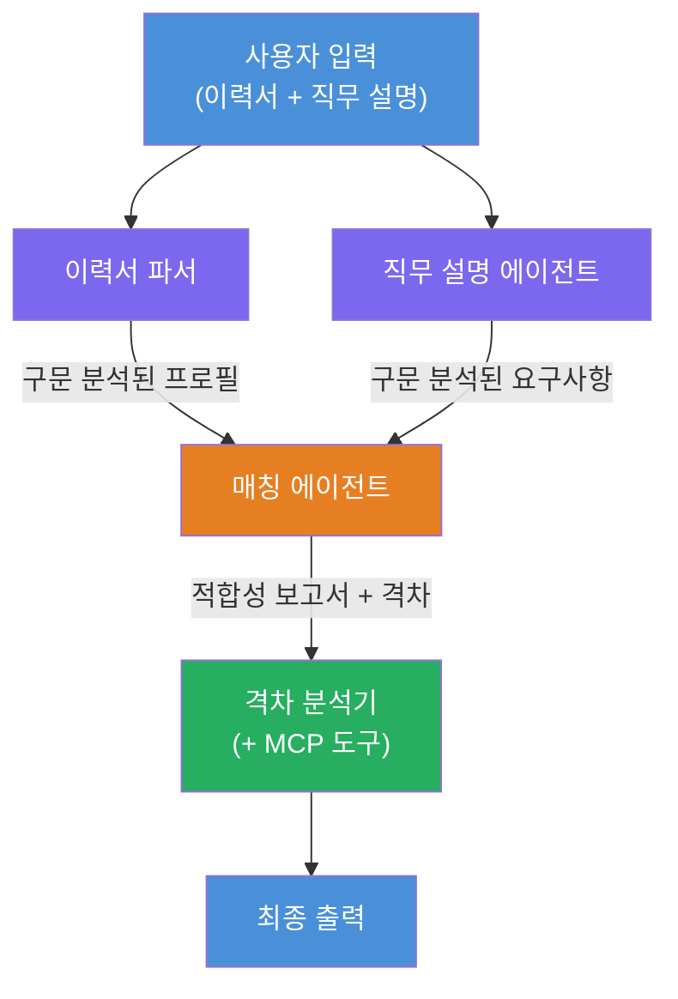
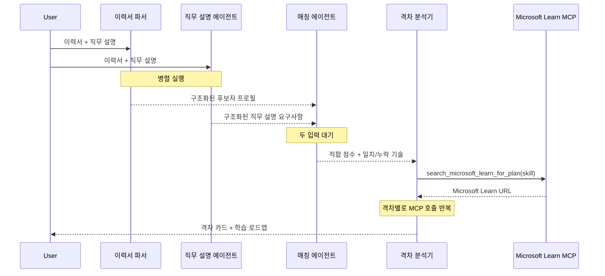
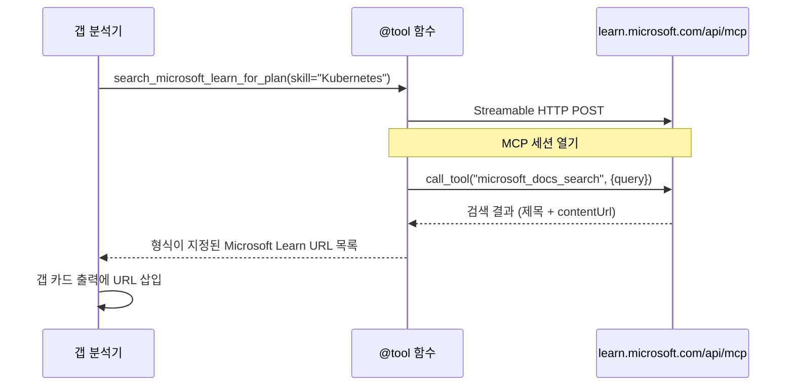

# Module 1 - 다중 에이전트 아키텍처 이해하기

이 모듈에서는 코드를 작성하기 전에 Resume → Job Fit Evaluator의 아키텍처를 배웁니다. 오케스트레이션 그래프, 에이전트 역할, 데이터 흐름을 이해하는 것은 [다중 에이전트 워크플로우](https://learn.microsoft.com/azure/architecture/ai-ml/idea/multiple-agent-workflow-automation)를 디버깅하고 확장하는 데 중요합니다.

---

## 이 문제가 해결하는 것

이력서를 직무 설명서에 맞추는 과정은 여러 가지 구별되는 기술을 포함합니다:

1. <strong>파싱</strong> - 정형화되지 않은 텍스트(이력서)에서 구조화된 데이터 추출
2. <strong>분석</strong> - 직무 설명서에서 요구 사항 추출
3. <strong>비교</strong> - 두 데이터를 정렬하여 점수 산출
4. <strong>계획</strong> - 격차를 해소하기 위한 학습 로드맵 구축

한 명의 에이전트가 한 번의 프롬프트로 네 가지 작업을 모두 수행하면 다음과 같은 문제가 발생하기 쉽습니다:
- 미완성 추출 (점수 산출을 위해 파싱을 급하게 진행)
- 얕은 점수 산출(증거 기반 분석 부족)
- 일반적인 로드맵(특정 격차에 맞춤형이 아님)

<strong>네 개의 전문화된 에이전트</strong>로 분리하면 각각의 작업에 전념하여 모든 단계에서 더 높은 품질의 결과물을 제공합니다.

---

## 네 개의 에이전트

각 에이전트는 `AzureAIAgentClient.as_agent()`를 통해 생성된 완전한 [Microsoft Foundry](https://learn.microsoft.com/azure/foundry/agents/concepts/hosted-agents) 에이전트입니다. 동일한 모델 배포를 공유하지만 서로 다른 지침과 (선택적으로) 도구를 사용합니다.

| # | 에이전트 이름 | 역할 | 입력 | 출력 |
|---|---------------|------|-------|--------|
| 1 | **ResumeParser** | 이력서 텍스트에서 구조화된 프로필 추출 | 원시 이력서 텍스트 (사용자로부터) | 후보자 프로필, 기술 스킬, 소프트 스킬, 인증, 도메인 경험, 성과 |
| 2 | **JobDescriptionAgent** | 직무 설명서에서 구조화된 요구 사항 추출 | 원시 직무 설명서 텍스트 (사용자 → ResumeParser를 통해 전달) | 역할 개요, 필수 스킬, 우대 스킬, 경력, 인증, 학력, 책임 |
| 3 | **MatchingAgent** | 증거 기반 적합도 점수 산출 | ResumeParser + JobDescriptionAgent 출력 | 적합도 점수(0-100 및 세부 분석), 일치 스킬, 누락 스킬, 격차 |
| 4 | **GapAnalyzer** | 개인 맞춤형 학습 로드맵 생성 | MatchingAgent 출력 | 격차 카드(스킬별), 학습 순서, 일정, Microsoft Learn 리소스 |

---

## 오케스트레이션 그래프

워크플로우는 **병렬 팬아웃** 다음에 <strong>순차적 집계</strong>를 사용합니다:


> **범례:** 보라색 = 병렬 에이전트, 주황색 = 집계 지점, 초록색 = 도구가 있는 최종 에이전트

### 데이터 흐름 방식


1. <strong>사용자</strong>가 이력서와 직무 설명서를 포함한 메시지를 전송합니다.
2. <strong>ResumeParser</strong>가 전체 사용자 입력을 받아 구조화된 후보자 프로필을 추출합니다.
3. <strong>JobDescriptionAgent</strong>가 병렬로 사용자 입력을 받고 구조화된 요구 사항을 추출합니다.
4. <strong>MatchingAgent</strong>가 **ResumeParser와 JobDescriptionAgent** 두 에이전트의 출력을 모두 받아 실행됩니다 (두 에이전트가 완료될 때까지 대기).
5. <strong>GapAnalyzer</strong>가 MatchingAgent 출력을 받고 각 격차에 대해 실질적인 학습 리소스를 가져오기 위해 <strong>Microsoft Learn MCP 도구</strong>를 호출합니다.
6. <strong>최종 출력</strong>은 GapAnalyzer의 응답이며, 적합도 점수, 격차 카드, 완벽한 학습 로드맵을 포함합니다.

### 병렬 팬아웃이 중요한 이유

ResumeParser와 JobDescriptionAgent는 서로 의존하지 않아 <strong>병렬로 실행</strong>됩니다. 이로 인해:
- 전체 지연 시간 감소 (동시 실행으로 순차 실행 대신)
- 자연스러운 나눔 (이력서 파싱과 직무 설명서 파싱은 독립 작업)
- 일반적인 다중 에이전트 패턴 시연: **팬아웃 → 집계 → 실행**

---

## 코드 내 WorkflowBuilder

위 그래프가 `main.py`의 [`WorkflowBuilder`](https://learn.microsoft.com/agent-framework/workflows/agents-in-workflows) API 호출에 어떻게 매핑되는지 설명합니다:

```python
from agent_framework import WorkflowBuilder

workflow = (
    WorkflowBuilder(
        name="ResumeJobFitEvaluator",
        start_executor=resume_parser,       # 사용자 입력을 처음으로 받는 에이전트
        output_executors=[gap_analyzer],     # 결과를 반환하는 최종 에이전트
    )
    .add_edge(resume_parser, jd_agent)      # ResumeParser → JobDescriptionAgent
    .add_edge(resume_parser, matching_agent) # ResumeParser → MatchingAgent
    .add_edge(jd_agent, matching_agent)      # JobDescriptionAgent → MatchingAgent
    .add_edge(matching_agent, gap_analyzer)  # MatchingAgent → GapAnalyzer
    .build()
)
```

**엣지 이해하기:**

| 엣지 | 의미 |
|------|-------|
| `resume_parser → jd_agent` | JD 에이전트가 ResumeParser 출력을 받음 |
| `resume_parser → matching_agent` | MatchingAgent가 ResumeParser 출력을 받음 |
| `jd_agent → matching_agent` | MatchingAgent가 JD 에이전트 출력을 함께 받음 (두 개 모두 대기) |
| `matching_agent → gap_analyzer` | GapAnalyzer가 MatchingAgent 출력을 받음 |

`matching_agent`에 **두 개의 입력 엣지** (`resume_parser`와 `jd_agent`)가 있기 때문에, 프레임워크가 두 에이전트가 모두 완료될 때까지 자동으로 기다린 후 Matching Agent를 실행합니다.

---

## MCP 도구

GapAnalyzer 에이전트는 `search_microsoft_learn_for_plan`이라는 단일 도구를 가집니다. 이는 Microsoft Learn API를 호출해 엄선된 학습 리소스를 가져오는 <strong>[MCP 도구](https://learn.microsoft.com/agent-framework/agents/tools/hosted-mcp-tools)</strong>입니다.

### 작동 방식

```python
@tool
async def search_microsoft_learn_for_plan(
    skill: str, role: str = "", max_results: int = 5
) -> str:
    """Search Microsoft Learn MCP and return curated official links."""
    # Streamable HTTP를 통해 https://learn.microsoft.com/api/mcp에 연결합니다
    # MCP 서버에서 'microsoft_docs_search' 도구를 호출합니다
    # Microsoft Learn URL의 형식화된 목록을 반환합니다
```

### MCP 호출 흐름


1. GapAnalyzer가 특정 스킬(예: "Kubernetes")에 대한 학습 리소스가 필요하다고 판단
2. 프레임워크가 `search_microsoft_learn_for_plan(skill="Kubernetes")` 호출
3. 함수가 `https://learn.microsoft.com/api/mcp`에 [Streamable HTTP](https://learn.microsoft.com/agent-framework/agents/tools/hosted-mcp-tools) 연결 열기
4. [MCP 서버](https://learn.microsoft.com/azure/foundry/agents/how-to/tools/model-context-protocol)에서 `microsoft_docs_search` 도구 호출
5. MCP 서버가 검색 결과(제목 + URL)를 반환
6. 함수가 결과를 문자열로 포맷해 반환
7. GapAnalyzer가 반환된 URL을 격차 카드 출력에 사용

### 예상 MCP 로그

도구가 실행될 때 다음과 같은 로그 항목이 표시됩니다:

```
GET https://learn.microsoft.com/api/mcp → 405 (Method Not Allowed)
POST https://learn.microsoft.com/api/mcp → 200
DELETE https://learn.microsoft.com/api/mcp → 405 (Method Not Allowed)
```

**이는 정상입니다.** MCP 클라이언트가 초기화 중 GET과 DELETE로 프로브를 수행하며 405 응답은 정상 동작입니다. 실제 도구 호출은 POST를 사용하고 200 응답을 반환합니다. POST 호출 실패 시에만 주의하면 됩니다.

---

## 에이전트 생성 패턴

각 에이전트는 **[`AzureAIAgentClient.as_agent()`](https://learn.microsoft.com/python/api/overview/azure/ai-agents-readme) 비동기 컨텍스트 관리자**를 사용해 생성됩니다. 이는 자동 정리를 보장하는 Foundry SDK의 에이전트 생성 패턴입니다:

```python
async with (
    get_credential() as credential,
    AzureAIAgentClient(
        project_endpoint=PROJECT_ENDPOINT,
        model_deployment_name=MODEL_DEPLOYMENT_NAME,
        credential=credential,
    ).as_agent(
        name="ResumeParser",
        instructions=RESUME_PARSER_INSTRUCTIONS,
    ) as resume_parser,
    # ... 각 에이전트에 대해 반복 ...
):
    # 여기에는 4명의 에이전트가 모두 존재합니다
    workflow = create_workflow(resume_parser, jd_agent, matching_agent, gap_analyzer)
```

**핵심 포인트:**
- 각 에이전트는 고유한 `AzureAIAgentClient` 인스턴스를 갖습니다 (SDK는 에이전트 이름이 클라이언트 범위에 속하도록 요구)
- 모든 에이전트는 동일한 `credential`, `PROJECT_ENDPOINT`, `MODEL_DEPLOYMENT_NAME`을 공유
- `async with` 블록은 서버 종료 시 모든 에이전트를 정리보장
- GapAnalyzer는 추가로 `tools=[search_microsoft_learn_for_plan]`를 받음

---

## 서버 시작

에이전트 생성 및 워크플로우 구축 후 서버가 시작됩니다:

```python
from azure.ai.agentserver.agentframework import from_agent_framework

agent = create_workflow(resume_parser, jd_agent, matching_agent, gap_analyzer)
await from_agent_framework(agent).run_async()
```

`from_agent_framework()`는 워크플로우를 HTTP 서버로 래핑하여 8088 포트에서 `/responses` 엔드포인트를 노출합니다. Lab 01과 동일한 패턴이지만 이번에는 "에이전트"가 전체 [워크플로우 그래프](https://learn.microsoft.com/agent-framework/workflows/as-agents)입니다.

---

### 체크포인트

- [ ] 4 에이전트 아키텍처와 각 에이전트의 역할을 이해하고 있습니다
- [ ] 데이터 흐름을 추적할 수 있습니다: 사용자 → ResumeParser → (병렬) JD 에이전트 + MatchingAgent → GapAnalyzer → 출력
- [ ] MatchingAgent가 ResumeParser와 JD 에이전트 두 에이전트 출력을 기다리는 이유를 이해합니다 (두 개의 입력 엣지)
- [ ] MCP 도구의 역할, 호출 방법, GET 405 로그가 정상임을 이해합니다
- [ ] `AzureAIAgentClient.as_agent()` 패턴과 각 에이전트가 고유 클라이언트 인스턴스를 갖는 이유를 이해합니다
- [ ] `WorkflowBuilder` 코드를 읽고 시각적 그래프와 매핑할 수 있습니다

---

**이전:** [00 - 사전 준비](00-prerequisites.md) · **다음:** [02 - 다중 에이전트 프로젝트 골격 만들기 →](02-scaffold-multi-agent.md)

---

<!-- CO-OP TRANSLATOR DISCLAIMER START -->
**면책 조항**:  
이 문서는 AI 번역 서비스 [Co-op Translator](https://github.com/Azure/co-op-translator)를 사용하여 번역되었습니다. 정확성을 위해 노력하고 있지만, 자동 번역에는 오류나 부정확성이 있을 수 있음을 유의하시기 바랍니다. 원본 문서의 원어 버전이 권위 있는 출처로 간주되어야 합니다. 중요한 정보의 경우, 전문적인 인간 번역을 권장합니다. 이 번역 사용으로 인한 오해나 잘못된 해석에 대해 당사는 책임을 지지 않습니다.
<!-- CO-OP TRANSLATOR DISCLAIMER END -->