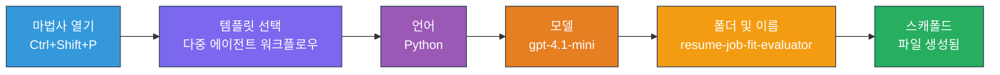
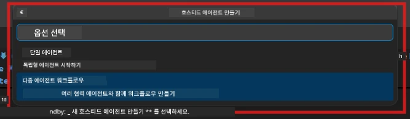

# Module 2 - 멀티 에이전트 프로젝트 스캐폴딩

이 모듈에서는 [Microsoft Foundry 확장](https://marketplace.visualstudio.com/items?itemName=TeamsDevApp.vscode-ai-foundry)을 사용하여 <strong>멀티 에이전트 워크플로 프로젝트를 스캐폴딩</strong>합니다. 이 확장은 전체 프로젝트 구조( `agent.yaml`, `main.py`, `Dockerfile`, `requirements.txt`, `.env`, 디버그 구성)를 생성합니다. 그런 다음 3, 4 모듈에서 이 파일들을 맞춤 설정합니다.

> **참고:** 이 실습의 `PersonalCareerCopilot/` 폴더는 사용자 정의된 멀티 에이전트 프로젝트의 완전한 작동 예시입니다. 새 프로젝트를 스캐폴딩하는 방법(학습에 권장) 또는 기존 코드를 직접 살펴볼 수 있습니다.

---

## 1단계: Create Hosted Agent 마법사 열기


1. `Ctrl+Shift+P`를 눌러 <strong>명령 팔레트</strong>를 엽니다.
2. <strong>Microsoft Foundry: Create a New Hosted Agent</strong>를 입력하고 선택합니다.
3. 호스트된 에이전트 생성 마법사가 열립니다.

> **대안:** 활동 표시줄의 **Microsoft Foundry** 아이콘 → **Agents** 옆의 **+** 아이콘 클릭 → **Create New Hosted Agent** 클릭.

---

## 2단계: 멀티 에이전트 워크플로 템플릿 선택

마법사가 템플릿 선택을 요청합니다:

| 템플릿 | 설명 | 사용 시기 |
|----------|-------------|-------------|
| 단일 에이전트 | 하나의 에이전트와 지침, 선택적 도구 포함 | 실습 01 |
| **멀티 에이전트 워크플로** | WorkflowBuilder를 통해 협업하는 여러 에이전트 | **이번 실습 (실습 02)** |

1. **멀티 에이전트 워크플로** 선택.
2. <strong>다음</strong> 클릭.



---

## 3단계: 프로그래밍 언어 선택

1. **Python** 선택.
2. <strong>다음</strong> 클릭.

---

## 4단계: 모델 선택

1. 마법사가 Foundry 프로젝트에 배포된 모델을 표시합니다.
2. 실습 01에서 사용한 동일한 모델(예: **gpt-4.1-mini**) 선택.
3. <strong>다음</strong> 클릭.

> **팁:** [`gpt-4.1-mini`](https://learn.microsoft.com/azure/foundry/foundry-models/concepts/models-sold-directly-by-azure#gpt-41-series)는 개발에 권장됩니다 - 빠르고 저렴하며 멀티 에이전트 워크플로도 잘 처리합니다. 더 품질 높은 출력을 원할 경우 최종 프로덕션 배포 시 `gpt-4.1`로 전환하세요.

---

## 5단계: 폴더 위치와 에이전트 이름 선택

1. 파일 대화상자가 열립니다. 대상 폴더 선택:
   - 워크숍 저장소를 따라하는 경우: `workshop/lab02-multi-agent/`로 이동해 새 하위 폴더 생성
   - 새로 시작하는 경우: 원하는 폴더 선택
2. 호스트된 에이전트의 <strong>이름</strong> 입력 (예: `resume-job-fit-evaluator`).
3. <strong>생성</strong> 클릭.

---

## 6단계: 스캐폴딩 완료 대기

1. VS Code가 새 창을 열거나 현재 창이 스캐폴딩된 프로젝트로 업데이트됩니다.
2. 다음과 같은 파일 구조가 보여야 합니다:

```
resume-job-fit-evaluator/
├── .env                ← Environment variables (placeholders)
├── .vscode/
│   └── launch.json     ← Debug configuration
├── agent.yaml          ← Agent definition (kind: hosted)
├── Dockerfile          ← Container configuration
├── main.py             ← Multi-agent workflow code (scaffold)
└── requirements.txt    ← Python dependencies
```

> **워크숍 참고:** 워크숍 저장소에서는 `.vscode/` 폴더가 <strong>워크스페이스 루트</strong>에 있으며 공유된 `launch.json`과 `tasks.json`이 포함되어 있습니다. 실습 01과 실습 02의 디버그 구성이 모두 포함됩니다. F5를 누르면 드롭다운에서 <strong>"Lab02 - Multi-Agent"</strong>를 선택하세요.

---

## 7단계: 스캐폴딩된 파일 이해하기 (멀티 에이전트 특이사항)

멀티 에이전트 스캐폴딩은 단일 에이전트와 여러 측면에서 다릅니다:

### 7.1 `agent.yaml` - 에이전트 정의

```yaml
kind: hosted
name: resume-job-fit-evaluator
description: >
  A multi-agent workflow that evaluates resume-to-job fit.
metadata:
  authors:
    - Microsoft
  tags:
    - Multi-Agent Workflow
    - Resume Evaluator
protocols:
  - protocol: responses
    version: v1
environment_variables:
  - name: PROJECT_ENDPOINT
    value: ${PROJECT_ENDPOINT}
  - name: MODEL_DEPLOYMENT_NAME
    value: ${MODEL_DEPLOYMENT_NAME}
```

**실습 01과의 주요 차이점:** `environment_variables` 섹션에 MCP 엔드포인트나 기타 도구 구성을 위한 추가 변수가 포함될 수 있습니다. `name`과 `description`은 멀티 에이전트 사용 사례를 나타냅니다.

### 7.2 `main.py` - 멀티 에이전트 워크플로 코드

스캐폴드에는 다음이 포함됩니다:
- **여러 에이전트 지침 문자열** (에이전트별 상수 하나씩)
- **여러 [`AzureAIAgentClient.as_agent()`](https://learn.microsoft.com/python/api/overview/azure/ai-agents-readme) 컨텍스트 관리자** (에이전트별 하나씩)
- **에이전트들을 연결하는 [`WorkflowBuilder`](https://learn.microsoft.com/agent-framework/workflows/agents-in-workflows)**
- 워크플로를 HTTP 엔드포인트로 제공하는 **`from_agent_framework()`**

```python
from agent_framework import WorkflowBuilder, tool
from agent_framework.azure import AzureAIAgentClient
from azure.ai.agentserver.agentframework import from_agent_framework
```

Lab 01과 달리 추가된 [`WorkflowBuilder`](https://learn.microsoft.com/agent-framework/workflows/agents-in-workflows) import.

### 7.3 `requirements.txt` - 추가 종속성

멀티 에이전트 프로젝트는 Lab 01과 같은 기본 패키지에 MCP 관련 패키지를 추가 사용합니다:

```
agent-framework-azure-ai==1.0.0rc3
agent-framework-core==1.0.0rc3
azure-ai-agentserver-agentframework==1.0.0b16
azure-ai-agentserver-core==1.0.0b16
debugpy
agent-dev-cli --pre
```

> **중요 버전 참고:** `agent-dev-cli` 패키지는 최신 프리뷰 버전을 설치하려면 `requirements.txt`에 `--pre` 플래그가 필요합니다. 이는 Agent Inspector가 `agent-framework-core==1.0.0rc3`와 호환되기 위함입니다. 자세한 버전 내용은 [Module 8 - 문제 해결](08-troubleshooting.md)을 참고하세요.

| 패키지 | 버전 | 용도 |
|---------|---------|---------|
| [`agent-framework-azure-ai`](https://learn.microsoft.com/agent-framework/overview/) | `1.0.0rc3` | [Microsoft Agent Framework](https://github.com/microsoft/agent-framework)용 Azure AI 통합 |
| [`agent-framework-core`](https://learn.microsoft.com/agent-framework/overview/) | `1.0.0rc3` | 코어 런타임 (WorkflowBuilder 포함) |
| `azure-ai-agentserver-agentframework` | `1.0.0b16` | 호스트된 에이전트 서버 런타임 |
| `azure-ai-agentserver-core` | `1.0.0b16` | 코어 에이전트 서버 추상화 |
| `debugpy` | 최신 | Python 디버깅 (VS Code에서 F5) |
| `agent-dev-cli` | `--pre` | 로컬 개발 CLI + Agent Inspector 백엔드 |

### 7.4 `Dockerfile` - Lab 01과 동일

Dockerfile은 Lab 01과 동일하며, 파일 복사, `requirements.txt`에서 종속성 설치, 포트 8088 노출, `python main.py` 실행을 수행합니다.

```dockerfile
FROM python:3.14-slim
WORKDIR /app
COPY ./ .
RUN pip install --upgrade pip && \
    if [ -f requirements.txt ]; then \
        pip install -r requirements.txt; \
    else \
      echo "No requirements.txt found" >&2; exit 1; \
    fi
EXPOSE 8088
CMD ["python", "main.py"]
```

---

### 확인 사항

- [ ] 스캐폴딩 마법사 완료 → 새 프로젝트 구조가 보임
- [ ] 모든 파일이 보여야 함: `agent.yaml`, `main.py`, `Dockerfile`, `requirements.txt`, `.env`
- [ ] `main.py`가 `WorkflowBuilder` import 포함 (멀티 에이전트 템플릿 선택 확인)
- [ ] `requirements.txt`에 `agent-framework-core`와 `agent-framework-azure-ai` 모두 포함
- [ ] 멀티 에이전트 스캐폴드가 단일 에이전트 스캐폴드와 다른 점을 이해 (복수 에이전트, WorkflowBuilder, MCP 도구 등)

---

**이전:** [01 - 멀티 에이전트 아키텍처 이해하기](01-understand-multi-agent.md) · **다음:** [03 - 에이전트 및 환경 구성 →](03-configure-agents.md)

---

<!-- CO-OP TRANSLATOR DISCLAIMER START -->
**면책 조항**:  
이 문서는 AI 번역 서비스 [Co-op Translator](https://github.com/Azure/co-op-translator)를 사용하여 번역되었습니다. 정확성을 기하기 위해 노력하고 있으나, 자동 번역에는 오류나 부정확성이 포함될 수 있음을 유념해 주시기 바랍니다. 원문은 해당 언어의 원본 문서를 권위 있는 출처로 간주해야 합니다. 중요한 정보의 경우 전문적인 인간 번역을 권장합니다. 본 번역물의 사용으로 인한 오해나 잘못된 해석에 대해 저희는 책임지지 않습니다.
<!-- CO-OP TRANSLATOR DISCLAIMER END -->