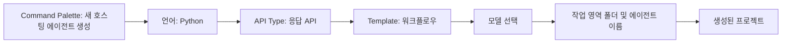
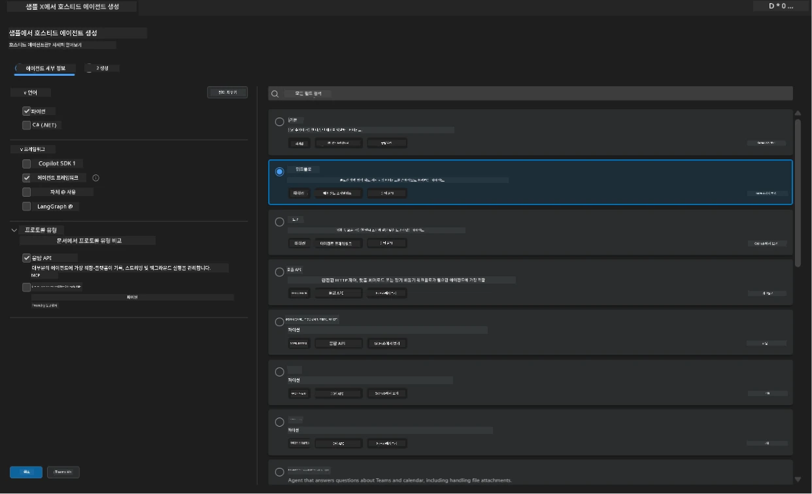
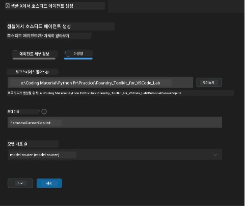

# 모듈 2 - 멀티 에이전트 프로젝트 스캐폴딩

⏱️ ~5분

이 모듈에서는 [Foundry Toolkit for VS Code](https://aka.ms/foundrytk)를 사용하여 <strong>멀티 에이전트 프로젝트를 스캐폴딩</strong>합니다. 마법사는 `agent.yaml`, `main.py`, `Dockerfile`, `requirements.txt`, `.env`, 그리고 VS Code 디버그 설정을 생성하므로, 모듈 3에서 4-에이전트 워크플로우를 연결하는 데 집중할 수 있습니다.

> **핵심 개념:** 스캐폴드는 하나의 에이전트가 작동하는 스텁입니다. 자리 표시자 로직은 모듈 3에서 `WorkflowBuilder` 그래프로 교체합니다. 보일러플레이트를 처음부터 작성하지 않습니다.

> **참고 구현:** [`PersonalCareerCopilot/`](../../../../../workshop/lab02-multi-agent/PersonalCareerCopilot)는 완전한 작동 예제입니다. 작업하면서 비교해 보세요.

### 스캐폴드 마법사 흐름


```mermaid
flowchart LR
    A[Command Palette: 새 호스팅 에이전트 생성] --> B[언어: Python]
    B --> C[API Type: 응답 API]
    C --> D[Template: 워크플로우]
    D --> E[모델 선택]
    E --> F[작업 영역 폴더 및 에이전트 이름]
    F --> G[생성된 프로젝트]
```

---

## 1단계: Create Hosted Agent 마법사 열기

1. `Ctrl+Shift+P`를 눌러 <strong>명령 팔레트</strong>를 엽니다.
2. 입력: <strong>Foundry Toolkit: Create a New Hosted Agent</strong>를 검색하고 선택합니다.
3. 마법사가 **Agent Details** 탭에서 열립니다.

> **대체 방법:** 활동 표시줄의 **Foundry Toolkit** 아이콘 클릭 → **Hosted Agents** 옆의 **+** 아이콘 클릭 → **Create New Hosted Agent** 클릭.

---

## 2단계: 설정 선택



1. 좌측 내비게이션/옵션 섹션에서 다음을 선택합니다:

| 메뉴 | 선택 | 참고 사항 |
|--------|-----------|-------|
| <strong>언어</strong> | Python | C# (.NET)도 지원 |
| <strong>프레임워크</strong> | Agent Framework | `Agent`, `AgentExecutor`, `WorkflowBuilder` 제공 |
| **API 유형** | Response API | `POST /responses` - 플랫폼 관리 이력, 스트리밍 지원 |
| <strong>템플릿</strong> | **Workflows** | 여러 에이전트가 순차적으로 요청 처리 |

2. 선택 완료 후 **Next** 클릭



3. 다음 창에서 다음을 선택합니다:

| 메뉴 | 선택 | 참고 사항 |
|--------|-----------|-------|
| **작업 공간 폴더** | 대상 폴더로 탐색 | 예: 이 저장소의 `workshop/lab02-multi-agent/` |
| **에이전트 이름** | `PersonalCareerCopilot` | 프로젝트 디렉터리 이름이 됩니다 |
| **모델 배포** | 배포된 모델 선택 | 예: Lab 01의 `gpt-4.1-mini` |

4. **Create** 클릭하여 프로젝트 스캐폴딩. VS Code가 파일을 생성하고 폴더를 엽니다.

> **팁:** [`gpt-4.1-mini`](https://learn.microsoft.com/azure/foundry/foundry-models/concepts/models-sold-directly-by-azure#gpt-41-series)는 멀티 에이전트 개발에 속도와 품질의 균형이 좋습니다.

---

## 3단계: 생성된 프로젝트 검토

스캐폴딩 완료 후 탐색기(`Ctrl+Shift+E`)에서 다음 파일들이 보이는지 확인합니다:

```
📂 <your-agent-name>/
├── .azdignore          ← Files excluded from Azure Developer CLI deployments
├── .dockerignore       ← Files excluded from Docker builds
├── .env                ← Environment variables (placeholders - fill in Module 3)
├── .vscode/
│   ├── launch.json     ← Debug config (F5 → run + Agent Inspector)
│   └── tasks.json      ← VS Code task definitions
├── agent.yaml          ← Agent definition (kind: hosted, protocol: responses)
├── Dockerfile          ← Container config for deployment
├── main.py             ← Stub agent entry point (replace with WorkflowBuilder in Module 3)
└── requirements.txt    ← Python dependencies
```

> **중요:** `.vscode/launch.json`과 `tasks.json`이 F5 디버깅에 올바르게 적용되도록 이 스캐폴딩된 폴더를 VS Code에서 직접 엽니다.

### 주요 파일 설명

| 파일 | 용도 |
|------|---------|
| `agent.yaml` | `kind: hosted` 선언, 환경 변수 매핑, `/responses` 프로토콜 정의 |
| `main.py` | 스텁: 하나의 `FoundryChatClient` → `Agent` → `ResponsesHostServer`. 모듈 3에서 4 에이전트와 `WorkflowBuilder`로 교체 |
| `Dockerfile` | `python:3.12-slim`, `requirements.txt` 설치, 포트 8088 공개, `python main.py` 실행 |
| `requirements.txt` | `agent-framework-foundry`, `agent-framework-foundry-hosting`, `mcp<2,>=1.24.0`, `debugpy` |

> **참고:** 전체 생성 내용을 [`PersonalCareerCopilot/agent.yaml`](../../../../../workshop/lab02-multi-agent/PersonalCareerCopilot/agent.yaml)과 [`PersonalCareerCopilot/requirements.txt`](../../../../../workshop/lab02-multi-agent/PersonalCareerCopilot/requirements.txt)에서 확인하세요.

---

### ✅ 체크포인트

- [ ] 스캐폴드 마법사 완료 - 탐색기에 새 프로젝트 폴더 보임
- [ ] 예상된 모든 파일 존재: `agent.yaml`, `main.py`, `Dockerfile`, `requirements.txt`, `.env`
- [ ] `agent.yaml`에서 `kind: hosted` 및 `protocol: responses` 확인
- [ ] `main.py`가 `Agent`, `FoundryChatClient`, `ResponsesHostServer`를 임포트함
- [ ] 스캐폴드된 폴더가 VS Code 작업 공간 루트로 열림
- [ ] `main.py`는 스텁임을 이해함 - `WorkflowBuilder`는 모듈 3에서 추가됨

---

**이전:** [01 - 멀티 에이전트 아키텍처 이해하기](01-understand-multi-agent.md) · **다음:** [03 - 에이전트 및 환경 구성 →](03-configure-agents.md)

---

<!-- CO-OP TRANSLATOR DISCLAIMER START -->
**면책 조항**:
이 문서는 AI 번역 서비스 [Co-op Translator](https://github.com/Azure/co-op-translator)를 사용하여 번역되었습니다. 정확성을 기하기 위해 노력하고 있으나, 자동 번역은 오류나 부정확한 부분이 있을 수 있음을 유의하시기 바랍니다. 원본 문서의 원어본이 권위 있는 자료로 간주되어야 합니다. 중요한 정보의 경우, 전문가의 인간 번역을 권장합니다. 이 번역 사용으로 인해 발생하는 오해나 잘못된 해석에 대해 당사는 책임을 지지 않습니다.
<!-- CO-OP TRANSLATOR DISCLAIMER END -->