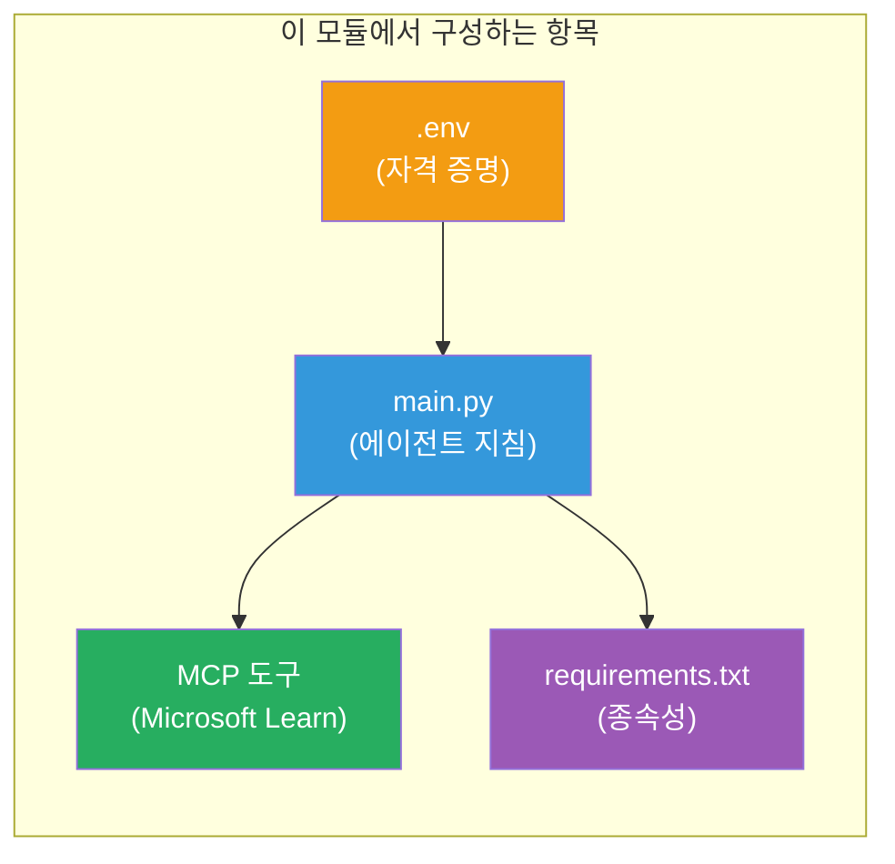

# Module 3 - 에이전트, MCP 도구 및 환경 구성

이 모듈에서는 골격이 잡힌 다중 에이전트 프로젝트를 사용자 지정합니다. 네 명의 에이전트 모두에 대한 지침을 작성하고, Microsoft Learn용 MCP 도구를 설정하며, 환경 변수를 구성하고, 종속성을 설치합니다.


> **참고:** 완성된 작동 코드는 [`PersonalCareerCopilot/main.py`](../../../../../workshop/lab02-multi-agent/PersonalCareerCopilot/main.py)에 있습니다. 자신만의 코드를 작성할 때 참조용으로 사용하세요.

---

## 1단계: 환경 변수 구성

1. 프로젝트 루트에 있는 **`.env`** 파일을 엽니다.
2. Foundry 프로젝트 세부 정보를 입력합니다:

   ```env
   PROJECT_ENDPOINT=https://<your-account>.services.ai.azure.com/api/projects/<your-project>
   MODEL_DEPLOYMENT_NAME=gpt-4.1-mini
   ```

3. 파일을 저장합니다.

### 해당 값을 찾는 방법

| 값 | 찾는 방법 |
|-------|---------------|
| **프로젝트 엔드포인트** | Microsoft Foundry 사이드바 → 프로젝트 클릭 → 세부 정보 보기에서 엔드포인트 URL |
| **모델 배포 이름** | Foundry 사이드바 → 프로젝트 확장 → **모델 + 엔드포인트** → 배포된 모델 옆의 이름 |

> **보안:** `.env`를 버전 관리에 절대 커밋하지 마세요. 아직 없으면 `.gitignore`에 추가하세요.

### 환경 변수 매핑

다중 에이전트 `main.py`는 표준 및 워크숍 전용 env 변수 이름을 모두 읽습니다:

```python
PROJECT_ENDPOINT = os.getenv("AZURE_AI_PROJECT_ENDPOINT") or os.getenv("PROJECT_ENDPOINT")
MODEL_DEPLOYMENT_NAME = os.getenv(
    "AZURE_AI_MODEL_DEPLOYMENT_NAME",
    os.getenv("MODEL_DEPLOYMENT_NAME", "gpt-4.1-mini"),
)
MICROSOFT_LEARN_MCP_ENDPOINT = os.getenv(
    "MICROSOFT_LEARN_MCP_ENDPOINT", "https://learn.microsoft.com/api/mcp"
)
```

MCP 엔드포인트는 합리적인 기본값이 있으므로 덮어쓰지 않는 이상 `.env`에 설정할 필요가 없습니다.

---

## 2단계: 에이전트 지침 작성

가장 중요한 단계입니다. 각 에이전트에는 역할, 출력 형식, 규칙을 정의하는 신중한 지침이 필요합니다. `main.py`를 열고 지침 상수를 생성(또는 수정)하세요.

### 2.1 이력서 파서 에이전트

```python
RESUME_PARSER_INSTRUCTIONS = """\
You are the Resume Parser.
Extract resume text into a compact, structured profile for downstream matching.

Output exactly these sections:
1) Candidate Profile
2) Technical Skills (grouped categories)
3) Soft Skills
4) Certifications & Awards
5) Domain Experience
6) Notable Achievements

Rules:
- Use only explicit or strongly implied evidence.
- Do not invent skills, titles, or experience.
- Keep concise bullets; no long paragraphs.
- If input is not a resume, return a short warning and request resume text.
"""
```

**왜 이 섹션들인가요?** MatchingAgent는 점수 매김을 위해 구조화된 데이터가 필요합니다. 일관된 섹션은 에이전트 간 전달을 신뢰할 수 있게 만듭니다.

### 2.2 직무 설명 에이전트

```python
JOB_DESCRIPTION_INSTRUCTIONS = """\
You are the Job Description Analyst.
Extract a structured requirement profile from a JD.

Output exactly these sections:
1) Role Overview
2) Required Skills
3) Preferred Skills
4) Experience Required
5) Certifications Required
6) Education
7) Domain / Industry
8) Key Responsibilities

Rules:
- Keep required vs preferred clearly separated.
- Only use what the JD states; do not invent hidden requirements.
- Flag vague requirements briefly.
- If input is not a JD, return a short warning and request JD text.
"""
```

**필수 및 선호 구분 이유?** MatchingAgent가 각 항목에 대해 다른 가중치(필수 기술 = 40점, 선호 기술 = 10점)를 사용하기 때문입니다.

### 2.3 매칭 에이전트

```python
MATCHING_AGENT_INSTRUCTIONS = """\
You are the Matching Agent.
Compare parsed resume output vs JD output and produce an evidence-based fit report.

Scoring (100 total):
- Required Skills 40
- Experience 25
- Certifications 15
- Preferred Skills 10
- Domain Alignment 10

Output exactly these sections:
1) Fit Score (with breakdown math)
2) Matched Skills
3) Missing Skills
4) Partially Matched
5) Experience Alignment
6) Certification Gaps
7) Overall Assessment

Rules:
- Be objective and evidence-only.
- Keep partial vs missing separate.
- Keep Missing Skills precise; it feeds roadmap planning.
"""
```

**명시적 점수화가 중요한 이유?** 재현 가능한 점수화로 실행 비교 및 문제 해결이 가능하며, 100점 척도는 최종 사용자가 이해하기 쉽습니다.

### 2.4 갭 분석 에이전트

```python
GAP_ANALYZER_INSTRUCTIONS = """\
You are the Gap Analyzer and Roadmap Planner.
Create a practical upskilling plan from the matching report.

Microsoft Learn MCP usage (required):
- For EVERY High and Medium priority gap, call tool `search_microsoft_learn_for_plan`.
- Use returned Learn links in Suggested Resources.
- Prefer Microsoft Learn for free resources.

CRITICAL: You MUST produce a SEPARATE detailed gap card for EVERY skill listed in
the Missing Skills and Certification Gaps sections of the matching report. Do NOT
skip or combine gaps. Do NOT summarize multiple gaps into one card.

Output format:
1) Personalized Learning Roadmap for [Role Title]
2) One DETAILED card per gap (produce ALL cards, not just the first):
   - Skill
   - Priority (High/Medium/Low)
   - Current Level
   - Target Level
   - Suggested Resources (include Learn URL from tool results)
   - Estimated Time
   - Quick Win Project
3) Recommended Learning Order (numbered list)
4) Timeline Summary (week-by-week)
5) Motivational Note

Rules:
- Produce every gap card before writing the summary sections.
- Keep it specific, realistic, and actionable.
- Tailor to candidate's existing stack.
- If fit >= 80, focus on polish/interview readiness.
- If fit < 40, be honest and provide a staged path.
"""
```

**"CRITICAL" 강조 이유?** 모든 갭 카드를 생성하도록 명시하지 않으면 모델이 1~2장만 만들고 나머지는 요약해버리는 경향이 있습니다. "CRITICAL" 블록이 이러한 요약을 방지합니다.

---

## 3단계: MCP 도구 정의

GapAnalyzer는 [Microsoft Learn MCP 서버](https://learn.microsoft.com/azure/foundry/agents/how-to/tools/model-context-protocol)를 호출하는 도구를 사용합니다. `main.py`에 다음을 추가하세요:

```python
import json
from agent_framework import tool
from mcp.client.session import ClientSession
from mcp.client.streamable_http import streamable_http_client

@tool
async def search_microsoft_learn_for_plan(
    skill: str, role: str = "", max_results: int = 5
) -> str:
    """Search Microsoft Learn MCP and return curated official links for roadmap planning."""
    query = " ".join(part for part in [skill, role, "learning path module"] if part).strip()
    query = query or "job skills learning path"

    try:
        async with streamable_http_client(MICROSOFT_LEARN_MCP_ENDPOINT) as (
            read_stream, write_stream, _,
        ):
            async with ClientSession(read_stream, write_stream) as session:
                await session.initialize()
                result = await session.call_tool(
                    "microsoft_docs_search", {"query": query}
                )

        if not result.content:
            return (
                "No results returned from Microsoft Learn MCP. "
                "Fallback: https://learn.microsoft.com/training/support/catalog-api"
            )

        payload_text = getattr(result.content[0], "text", "")
        data = json.loads(payload_text) if payload_text else {}
        items = data.get("results", [])[:max(1, min(max_results, 10))]

        if not items:
            return f"No direct Microsoft Learn results found for '{skill}'."

        lines = [f"Microsoft Learn resources for '{skill}':"]
        for i, item in enumerate(items, start=1):
            title = item.get("title") or item.get("url") or "Microsoft Learn Resource"
            url = item.get("url") or item.get("link") or ""
            lines.append(f"{i}. {title} - {url}".rstrip(" -"))
        return "\n".join(lines)
    except Exception as ex:
        return (
            f"Microsoft Learn MCP lookup unavailable. Reason: {ex}. "
            "Fallbacks: https://learn.microsoft.com/api/mcp"
        )
```

### 도구 작동 방식

| 단계 | 내용 |
|------|-------------|
| 1 | GapAnalyzer가 특정 기술(예: "Kubernetes")에 대한 리소스가 필요하다고 판단 |
| 2 | 프레임워크가 `search_microsoft_learn_for_plan(skill="Kubernetes")` 호출 |
| 3 | 함수가 [스트리밍 가능한 HTTP](https://learn.microsoft.com/agent-framework/agents/tools/hosted-mcp-tools) 연결을 `https://learn.microsoft.com/api/mcp`에 오픈 |
| 4 | [MCP 서버](https://learn.microsoft.com/azure/foundry/agents/how-to/tools/model-context-protocol)에서 `microsoft_docs_search` 호출 |
| 5 | MCP 서버가 검색 결과(제목 + URL) 반환 |
| 6 | 함수가 결과를 번호 매긴 목록으로 포맷팅 |
| 7 | GapAnalyzer가 URL을 갭 카드에 통합 |

### MCP 종속성

MCP 클라이언트 라이브러리는 [`agent-framework-core`](https://learn.microsoft.com/agent-framework/overview/)를 통해 간접 포함됩니다. `requirements.txt`에 별도 추가할 필요가 없습니다. 가져오기 오류가 발생하면 다음을 확인하세요:

```powershell
pip list | Select-String "mcp"
```

예상: `mcp` 패키지가 설치되어 있어야 함(버전 1.x 이상).

---

## 4단계: 에이전트 및 워크플로우 연결

### 4.1 컨텍스트 관리자와 함께 에이전트 생성

```python
from contextlib import asynccontextmanager

@asynccontextmanager
async def create_agents():
    async with (
        get_credential() as credential,
        AzureAIAgentClient(
            project_endpoint=PROJECT_ENDPOINT,
            model_deployment_name=MODEL_DEPLOYMENT_NAME,
            credential=credential,
        ).as_agent(
            name="ResumeParser",
            instructions=RESUME_PARSER_INSTRUCTIONS,
        ) as resume_parser,
        AzureAIAgentClient(
            project_endpoint=PROJECT_ENDPOINT,
            model_deployment_name=MODEL_DEPLOYMENT_NAME,
            credential=credential,
        ).as_agent(
            name="JobDescriptionAgent",
            instructions=JOB_DESCRIPTION_INSTRUCTIONS,
        ) as jd_agent,
        AzureAIAgentClient(
            project_endpoint=PROJECT_ENDPOINT,
            model_deployment_name=MODEL_DEPLOYMENT_NAME,
            credential=credential,
        ).as_agent(
            name="MatchingAgent",
            instructions=MATCHING_AGENT_INSTRUCTIONS,
        ) as matching_agent,
        AzureAIAgentClient(
            project_endpoint=PROJECT_ENDPOINT,
            model_deployment_name=MODEL_DEPLOYMENT_NAME,
            credential=credential,
        ).as_agent(
            name="GapAnalyzer",
            instructions=GAP_ANALYZER_INSTRUCTIONS,
            tools=[search_microsoft_learn_for_plan],
        ) as gap_analyzer,
    ):
        yield resume_parser, jd_agent, matching_agent, gap_analyzer
```

**주요 사항:**
- 각 에이전트는 자신만의 `AzureAIAgentClient` 인스턴스를 가짐
- GapAnalyzer만 `tools=[search_microsoft_learn_for_plan]`을 받음
- `get_credential()`는 Azure에서는 [`ManagedIdentityCredential`](https://learn.microsoft.com/python/api/overview/azure/identity-readme#managed-identity-support), 로컬에서는 [`DefaultAzureCredential`](https://learn.microsoft.com/azure/developer/python/sdk/authentication/credential-chains#defaultazurecredential-overview) 반환

### 4.2 워크플로우 그래프 생성

```python
def create_workflow(resume_parser, jd_agent, matching_agent, gap_analyzer):
    workflow = (
        WorkflowBuilder(
            name="ResumeJobFitEvaluator",
            start_executor=resume_parser,
            output_executors=[gap_analyzer],
        )
        .add_edge(resume_parser, jd_agent)
        .add_edge(resume_parser, matching_agent)
        .add_edge(jd_agent, matching_agent)
        .add_edge(matching_agent, gap_analyzer)
        .build()
    )
    return workflow.as_agent()
```

> `.as_agent()` 패턴을 이해하려면 [워크플로우를 에이전트로](https://learn.microsoft.com/agent-framework/workflows/as-agents)를 참고하세요.

### 4.3 서버 시작

```python
async def main() -> None:
    validate_configuration()
    async with create_agents() as (resume_parser, jd_agent, matching_agent, gap_analyzer):
        agent = create_workflow(resume_parser, jd_agent, matching_agent, gap_analyzer)
        from azure.ai.agentserver.agentframework import from_agent_framework
        await from_agent_framework(agent).run_async()

if __name__ == "__main__":
    asyncio.run(main())
```

---

## 5단계: 가상 환경 생성 및 활성화

### 5.1 환경 생성

```powershell
cd workshop\lab02-multi-agent\PersonalCareerCopilot
python -m venv .venv
```

### 5.2 활성화

**PowerShell (Windows):**
```powershell
.\.venv\Scripts\Activate.ps1
```

**macOS/Linux:**
```bash
source .venv/bin/activate
```

### 5.3 종속성 설치

```powershell
pip install -r requirements.txt
```

> **참고:** `requirements.txt`에 `agent-dev-cli --pre`가 포함되어 있어 최신 미리 보기 버전을 설치합니다. `agent-framework-core==1.0.0rc3`와 호환되기 위해 필요합니다.

### 5.4 설치 확인

```powershell
pip list | Select-String "agent-framework|agentserver|agent-dev"
```

예상 출력:
```
agent-dev-cli                  0.0.1b260316
agent-framework-azure-ai       1.0.0rc3
agent-framework-core            1.0.0rc3
azure-ai-agentserver-agentframework 1.0.0b16
azure-ai-agentserver-core      1.0.0b16
```

> **`agent-dev-cli`가 이전 버전을 표시하는 경우**(예: `0.0.1b260119`), Agent Inspector가 403/404 오류로 실패합니다. 업그레이드: `pip install agent-dev-cli --pre --upgrade`

---

## 6단계: 인증 확인

랩 01에서와 같은 인증 확인을 실행하세요:

```powershell
az account show --query "{name:name, id:id}" --output table
```

실패할 경우 [`az login`](https://learn.microsoft.com/cli/azure/authenticate-azure-cli-interactively)을 실행하세요.

다중 에이전트 워크플로우에서는 네 에이전트 모두 같은 자격 증명을 공유합니다. 한 에이전트에서 인증이 되면 모두 인증된 것입니다.

---

### 체크포인트

- [ ] `.env`에 유효한 `PROJECT_ENDPOINT` 및 `MODEL_DEPLOYMENT_NAME` 값이 있음
- [ ] `main.py`에 4개 에이전트 지침 상수 모두 정의됨 (ResumeParser, JD Agent, MatchingAgent, GapAnalyzer)
- [ ] `search_microsoft_learn_for_plan` MCP 도구가 정의되어 GapAnalyzer에 등록됨
- [ ] `create_agents()`가 각기 다른 `AzureAIAgentClient` 인스턴스와 함께 4개 에이전트를 모두 생성함
- [ ] `create_workflow()`가 `WorkflowBuilder`로 올바른 그래프 생성
- [ ] 가상 환경 생성 및 활성화 완료(`(.venv)` 표시)
- [ ] `pip install -r requirements.txt`가 오류 없이 완료
- [ ] `pip list`가 모든 예상 패키지와 올바른 버전(rc3 / b16)을 표시
- [ ] `az account show`가 구독 정보 반환

---

**이전:** [02 - 다중 에이전트 프로젝트 골격 잡기](02-scaffold-multi-agent.md) · **다음:** [04 - 오케스트레이션 패턴 →](04-orchestration-patterns.md)

---

<!-- CO-OP TRANSLATOR DISCLAIMER START -->
**면책 조항**:  
이 문서는 AI 번역 서비스 [Co-op Translator](https://github.com/Azure/co-op-translator)를 사용하여 번역되었습니다. 정확성을 위해 노력하고 있지만, 자동 번역에는 오류나 부정확성이 포함될 수 있음을 유의해 주시기 바랍니다. 원문은 해당 언어로 된 원본 문서가 권위 있는 출처로 간주되어야 합니다. 중요한 정보의 경우 전문 인간 번역을 권장합니다. 본 번역 사용으로 인해 발생하는 오해나 잘못된 해석에 대해서는 책임지지 않습니다.
<!-- CO-OP TRANSLATOR DISCLAIMER END -->