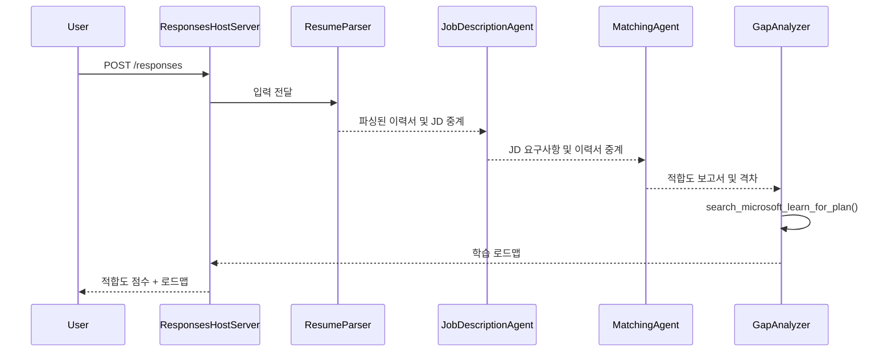

# 모듈 3 - 지침, 환경 구성 및 종속성 설치

⏱️ 약 15분

이 모듈에서는 스캐폴딩 된 스텁을 <strong>자신만의</strong> 멀티 에이전트 워크플로우로 변환합니다 - 환경 변수 설정, 에이전트 지침 작성, MCP 도구 추가, 워크플로우 그래프 연결 및 종속성 설치를 통해서입니다.

> **참고:** 전체 작동 코드는 [`PersonalCareerCopilot/main.py`](../../../../../workshop/lab02-multi-agent/PersonalCareerCopilot/main.py)에 있습니다. 자신의 워크플로우 그래프 및 프롬프트 블록을 구축할 때 참고하세요.

---

## 네 에이전트가 함께 작동하는 방식


```mermaid
sequenceDiagram
    participant User
    participant Server as ResponsesHostServer
    participant RP as ResumeParser
    participant JD as JobDescriptionAgent
    participant MA as MatchingAgent
    participant GA as GapAnalyzer

    User->>Server: POST /responses
    Server->>RP: 입력 전달
    RP-->>JD: 파싱된 이력서 및 JD 중계
    JD-->>MA: JD 요구사항 및 이력서 중계
    MA-->>GA: 적합도 보고서 및 격차
    GA->>GA: search_microsoft_learn_for_plan()
    GA-->>Server: 학습 로드맵
    Server-->>User: 적합도 점수 + 로드맵
```

---

## 1단계: 환경 변수 구성

1. 프로젝트 루트에 있는 **`.env`** 파일을 엽니다 (스캐폴딩 마법사가 생성).
2. 자리 표시자를 Lab 01에서 가져온 실제 값으로 바꿉니다.

<details open>
<summary><strong>🅰️ 경로 A - Foundry 구독</strong></summary>

```env
FOUNDRY_PROJECT_ENDPOINT=https://<your-account>.services.ai.azure.com/api/projects/<your-project>
AZURE_AI_MODEL_DEPLOYMENT_NAME=gpt-4.1-mini
```

> **값 위치:** [Lab 01, 모듈 1](../../lab01-single-agent/docs/01-setup.md#deploy-a-model--assign-rbac) 참고.

</details>

<details open>
<summary><strong>🅱️ 경로 B - Foundry Local</strong></summary>

```env
FOUNDRY_PROJECT_ENDPOINT=http://localhost:5273/v1
AZURE_AI_MODEL_DEPLOYMENT_NAME=phi-4-mini
```

> 모든 추론은 본인 머신에서 이루어지며 - 데이터가 기기를 벗어나지 않습니다. 정확한 모델 별칭은 `foundry model list`로 확인하세요. 유일한 외부 요청은 MCP 도구가 `https://learn.microsoft.com/api/mcp`에 요청하는 것입니다.

> **값 위치:** [Lab 01, 모듈 1 - 로컬 경로](../../lab01-single-agent/docs/01-setup.md#step-2-set-up-based-on-your-access) 참고.

</details>

> **보안:** `.env` 파일을 버전 관리에 절대 커밋하지 마세요. `.gitignore`에 이미 포함돼있어야 합니다.

---

## 2단계: 에이전트 지침 작성

각 에이전트의 역할, 출력 형식, 규칙을 지침으로 정의합니다. `main.py`를 열고 네 개의 지침 상수를 정의하거나 교체하세요 - 전체 문자열은 [`PersonalCareerCopilot/main.py`](../../../../../workshop/lab02-multi-agent/PersonalCareerCopilot/main.py)에 있습니다.

### 2.1 `RESUME_PARSER_INSTRUCTIONS`
이력서를 구조화된 후보자 프로필로 파싱하고 <strong>동시에</strong> 채용 공고를 그대로 `[JOB DESCRIPTION PASS-THROUGH]`에 복사합니다. 두 개의 레이블 섹션 모두 출력에 포함되어야 합니다.

> **왜 패스스루인가?** `context_mode="last_agent"`에서는 ResumeParser만이 원본 사용자 메시지를 볼 수 있습니다. JD를 전달하지 않으면, 이후 에이전트들은 이를 볼 수 없습니다.

### 2.2 `JOB_DESCRIPTION_INSTRUCTIONS`
ResumeParser 출력에서 `[PARSED RESUME]`와 `[JOB DESCRIPTION PASS-THROUGH]`를 읽습니다. `[JD REQUIREMENTS]` (구조화된 요구사항)와 `[PARSED RESUME PASS-THROUGH]` (MatchingAgent용 이력서 원문 복사본)를 출력합니다.

### 2.3 `MATCHING_AGENT_INSTRUCTIONS`
`[JD REQUIREMENTS]`와 `[PARSED RESUME PASS-THROUGH]`를 읽습니다. 세부 점수(0–100), 수학적 내역, 매칭된 기술, 부족한 기술, 경험 정렬 내용을 포함하는 적합성 보고서를 생성합니다.

### 2.4 `GAP_ANALYZER_INSTRUCTIONS`
적합성 보고서를 읽습니다. 부족한 모든 기술에 대해 `search_microsoft_learn_for_plan`를 호출해 Microsoft Learn 리소스를 가져옵니다. 기술별 상세 격차 카드 한 장과 주별 학습 로드맵을 출력합니다.

---

## 3단계: MCP 도구 추가

GapAnalyzer는 [Microsoft Learn MCP 서버](https://learn.microsoft.com/azure/foundry/agents/how-to/tools/model-context-protocol)를 호출해 각 기술 격차에 실질적인 학습 리소스를 가져옵니다. 전체 `search_microsoft_learn_for_plan` 함수는 [`PersonalCareerCopilot/main.py`](../../../../../workshop/lab02-multi-agent/PersonalCareerCopilot/main.py)에 있습니다.

에이전트 생성 시 GapAnalyzer에 이 도구를 등록합니다:

```python
gap_analyzer = Agent(
    client=client,
    instructions=GAP_ANALYZER_INSTRUCTIONS,
    name="GapAnalyzer",
    tools=[search_microsoft_learn_for_plan],
)
```

> `FoundryChatClient`, `AgentExecutor`, 모든 `add_edge()` 호출을 포함한 완전한 `WorkflowBuilder` 그래프는 [`PersonalCareerCopilot/main.py`](../../../../../workshop/lab02-multi-agent/PersonalCareerCopilot/main.py)를 참고하세요.

---

## 4단계: 가상 환경 생성 및 종속성 설치

> ⚠️ **이 단계를 건너뛰지 마세요.** 종속성이 설치되어 있지 않으면 F5 디버깅이 실패합니다.

### 4.1 가상 환경 생성

```powershell
python -m venv .venv
```

### 4.2 활성화

| 운영 체제 | 명령어 |
|----|---------|
| **Windows (PowerShell)** | `.\.venv\Scripts\Activate.ps1` |
| **Windows (CMD)** | `.venv\Scripts\activate.bat` |
| **macOS / Linux** | `source .venv/bin/activate` |

터미널 프롬프트에 `(.venv)`가 보여야 합니다.

### 4.3 종속성 설치

```powershell
pip install -r requirements.txt
```

### 4.4 확인

```powershell
pip list | Select-String "agent-framework|mcp|debugpy"
```

예상 결과: `agent-framework-foundry`, `agent-framework-foundry-hosting`, `mcp` 및 `debugpy`가 목록에 표시됩니다.

---

## 5단계: 인증 확인

<details open>
<summary><strong>🅰️ 경로 A - Azure 자격 증명</strong></summary>

```powershell
az account show --query "{name:name, id:id}" --output table
```

실패하면 [`az login`](https://learn.microsoft.com/cli/azure/authenticate-azure-cli-interactively)을 실행하세요.

네 에이전트 모두 하나의 `FoundryChatClient`와 하나의 `DefaultAzureCredential`을 공유합니다. 하나가 인증되면 모두 인증됩니다.

</details>

<details open>
<summary><strong>🅱️ 경로 B - Foundry Local</strong></summary>

로컬 테스트에는 인증이 필요 없습니다.

</details>

---

### ✅ 점검표

> 다음 조건을 모두 만족할 때까지 모듈 04로 진행하지 마세요: **(1)** 프롬프트에 `(.venv)`가 보이고 AND **(2)** `pip install -r requirements.txt`가 성공적으로 완료됨.

- [ ] `.env`에 유효한 엔드포인트 및 모델 배포명(자리 표시자 아님) 포함
- [ ] `main.py`에 네 개의 에이전트 지침 상수 정의 완료 (ResumeParser, JD Agent, MatchingAgent, GapAnalyzer)
- [ ] `search_microsoft_learn_for_plan` MCP 도구 정의 및 GapAnalyzer에 등록
- [ ] `main()`에서 `FoundryChatClient` + 4 `Agent` + 4 `AgentExecutor` 객체 생성 완료
- [ ] `WorkflowBuilder`가 올바른 순차 그래프를 모든 3개의 `add_edge()` 호출과 함께 빌드함
- [ ] 가상 환경 생성 및 활성화 완료 (`(.venv)`가 프롬프트에 표시됨)
- [ ] `pip install -r requirements.txt`가 에러 없이 완료됨
- [ ] **경로 A:** `az account show` 성공 또는 VS Code 계정 아이콘에 로그인 계정 표시

---

**이전:** [02 - 멀티 에이전트 프로젝트 스캐폴드](02-scaffold-multi-agent.md) · **다음:** [04 - 오케스트레이션 패턴 →](04-orchestration-patterns.md)

---

<!-- CO-OP TRANSLATOR DISCLAIMER START -->
**면책 조항**:
이 문서는 AI 번역 서비스 [Co-op Translator](https://github.com/Azure/co-op-translator)를 사용하여 번역되었습니다. 정확성을 기하기 위해 노력하고 있으나, 자동 번역은 오류나 부정확한 부분이 있을 수 있음을 유의하시기 바랍니다. 원본 문서의 원어본이 권위 있는 자료로 간주되어야 합니다. 중요한 정보의 경우, 전문가의 인간 번역을 권장합니다. 이 번역 사용으로 인해 발생하는 오해나 잘못된 해석에 대해 당사는 책임을 지지 않습니다.
<!-- CO-OP TRANSLATOR DISCLAIMER END -->