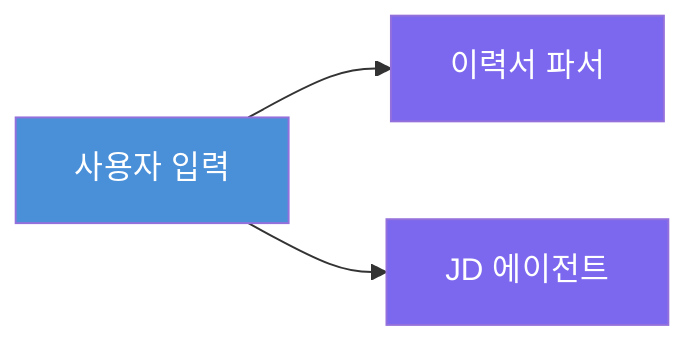
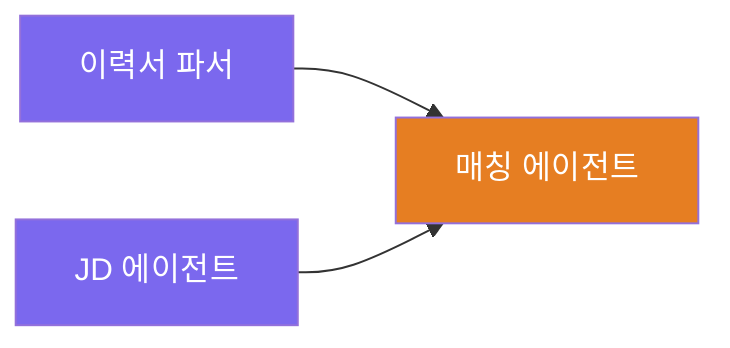
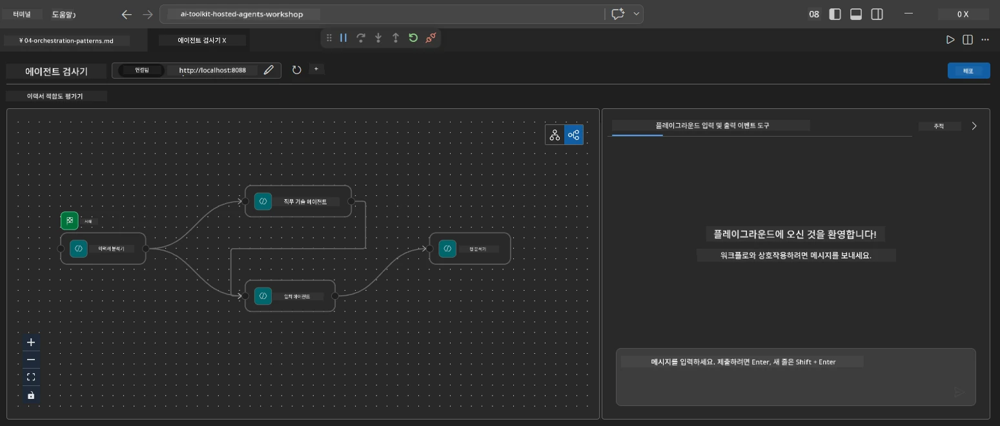
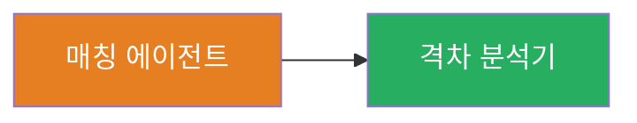
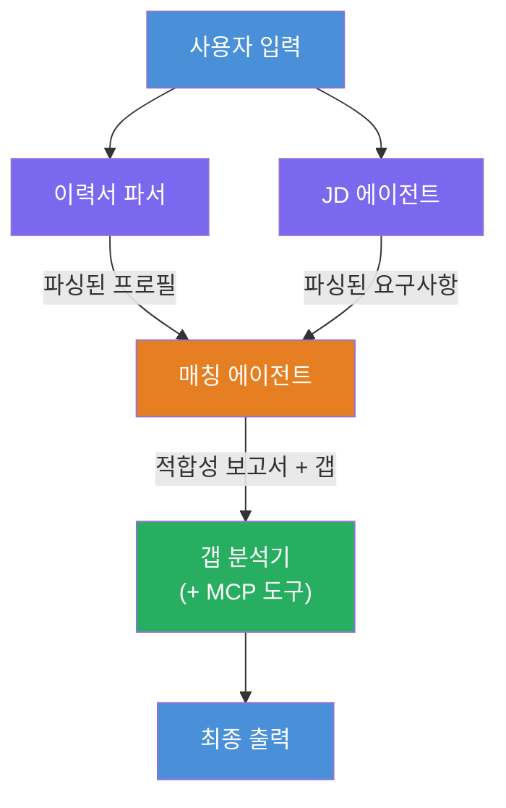
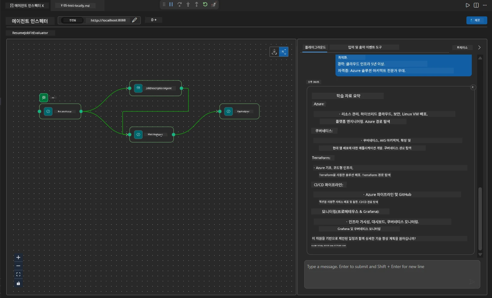

# Module 4 - 오케스트레이션 패턴

이 모듈에서는 Resume Job Fit Evaluator에서 사용되는 오케스트레이션 패턴을 탐구하고 워크플로 그래프를 읽고 수정하며 확장하는 방법을 배웁니다. 이러한 패턴을 이해하는 것은 데이터 흐름 문제를 디버깅하고 자체 [멀티 에이전트 워크플로](https://learn.microsoft.com/agent-framework/workflows/)를 구축하는 데 필수적입니다.

---

## 패턴 1: 팬아웃 (병렬 분기)

워크플로의 첫 번째 패턴은 <strong>팬아웃</strong>입니다 - 단일 입력이 여러 에이전트에 동시에 전송됩니다.


코드에서는 `resume_parser`가 `start_executor`이기 때문에 발생합니다 - 사용자의 메시지를 가장 먼저 받습니다. 그리고 `jd_agent`와 `matching_agent`가 모두 `resume_parser`로부터 엣지를 가지고 있으므로, 프레임워크는 `resume_parser`의 출력을 두 에이전트 모두로 라우팅합니다:

```python
.add_edge(resume_parser, jd_agent)         # ResumeParser 출력 → JD 에이전트
.add_edge(resume_parser, matching_agent)   # ResumeParser 출력 → MatchingAgent
```

**왜 이것이 작동하는가:** ResumeParser와 JD Agent는 같은 입력의 다른 측면을 처리합니다. 이들을 병렬로 실행하면 순차 실행에 비해 전체 대기 시간이 줄어듭니다.

### 팬아웃 사용 시기

| 사용 사례 | 예시 |
|----------|---------|
| 독립된 하위 작업 | 이력서 파싱 vs. JD 파싱 |
| 중복 / 투표 | 두 에이전트가 동일 데이터를 분석하고 세 번째가 최선의 답을 선택 |
| 다중 포맷 출력 | 한 에이전트는 텍스트를 생성하고 다른 에이전트는 구조화된 JSON을 생성 |

---

## 패턴 2: 팬인 (집계)

두 번째 패턴은 <strong>팬인</strong>입니다 - 여러 에이전트 출력이 수집되어 단일 하류 에이전트로 전송됩니다.


코드에서는:

```python
.add_edge(resume_parser, matching_agent)   # ResumeParser 출력 → MatchingAgent
.add_edge(jd_agent, matching_agent)        # JD Agent 출력 → MatchingAgent
```

**핵심 동작:** 에이전트에 <strong>두 개 이상의 들어오는 엣지</strong>가 있을 때, 프레임워크는 <strong>모든</strong> 상류 에이전트가 완료될 때까지 자동으로 기다렸다가 하류 에이전트를 실행합니다. MatchingAgent는 ResumeParser와 JD Agent가 모두 완료될 때까지 시작하지 않습니다.

### MatchingAgent가 받는 입력

프레임워크는 모든 상류 에이전트의 출력을 연결(concatenate)합니다. MatchingAgent의 입력은 다음과 같습니다:

```
[ResumeParser output]
---
Candidate Profile:
  Name: Jane Doe
  Technical Skills: Python, Azure, Kubernetes, ...
  ...

[JobDescriptionAgent output]
---
Role Overview: Senior Cloud Engineer
Required Skills: Python, Azure, Terraform, ...
...
```

> **참고:** 정확한 연결 형식은 프레임워크 버전에 따라 다릅니다. 에이전트의 지침은 구조화된 출력과 비구조화된 상류 출력을 모두 처리할 수 있도록 작성되어야 합니다.



---

## 패턴 3: 순차 체인

세 번째 패턴은 <strong>순차 체인</strong>입니다 - 한 에이전트의 출력이 다음 에이전트로 직접 입력됩니다.


코드에서는:

```python
.add_edge(matching_agent, gap_analyzer)    # MatchingAgent 출력 → GapAnalyzer
```

가장 단순한 패턴입니다. GapAnalyzer는 MatchingAgent의 적합 점수, 일치/누락 기술 및 갭 데이터를 받습니다. 그런 다음 각 갭에 대해 [MCP 툴](https://learn.microsoft.com/azure/foundry/agents/how-to/tools/model-context-protocol)을 호출하여 Microsoft Learn 리소스를 가져옵니다.

---

## 전체 그래프

세 가지 패턴을 모두 결합하면 전체 워크플로가 생성됩니다:


### 실행 타임라인

```mermaid
gantt
    title 에이전트 실행 타임라인
    dateFormat X
    axisFormat %s

    section 병렬
    Resume Parser       :rp, 0, 3
    JD Agent            :jd, 0, 2

    section 순차
    Matching Agent      :ma, 3, 5
    Gap Analyzer        :ga, 5, 9
```


> 전체 벽시계 시간은 대략 `max(ResumeParser, JD Agent) + MatchingAgent + GapAnalyzer`입니다. GapAnalyzer가 가장 느린데, 이는 여러 MCP 툴 호출(갭당 하나)을 하기 때문입니다.

---

## WorkflowBuilder 코드 읽기

다음은 `main.py`의 전체 `create_workflow()` 함수에 주석을 단 내용입니다:

```python
def create_workflow(resume_parser, jd_agent, matching_agent, gap_analyzer):
    workflow = (
        WorkflowBuilder(
            name="ResumeJobFitEvaluator",

            # 사용자 입력을 받는 첫 번째 에이전트
            start_executor=resume_parser,

            # 출력이 최종 응답이 되는 에이전트(들)
            output_executors=[gap_analyzer],
        )
        # 팬아웃: ResumeParser 출력이 JD Agent와 MatchingAgent 모두로 전달됨
        .add_edge(resume_parser, jd_agent)
        .add_edge(resume_parser, matching_agent)

        # 팬인: MatchingAgent가 ResumeParser와 JD Agent 모두를 기다림
        .add_edge(jd_agent, matching_agent)

        # 순차적: MatchingAgent 출력이 GapAnalyzer로 전달됨
        .add_edge(matching_agent, gap_analyzer)

        .build()
    )
    return workflow.as_agent()
```

### 엣지 요약 표

| # | 엣지 | 패턴 | 효과 |
|---|------|---------|--------|
| 1 | `resume_parser → jd_agent` | 팬아웃 | JD Agent가 ResumeParser의 출력(원본 사용자 입력 포함)을 받음 |
| 2 | `resume_parser → matching_agent` | 팬아웃 | MatchingAgent가 ResumeParser의 출력 받음 |
| 3 | `jd_agent → matching_agent` | 팬인 | MatchingAgent가 JD Agent의 출력도 받음 (모두 완료 대기) |
| 4 | `matching_agent → gap_analyzer` | 순차 | GapAnalyzer가 적합 보고서 및 갭 리스트 받음 |

---

## 그래프 수정하기

### 새 에이전트 추가

다섯 번째 에이전트(예: 갭 분석을 기반으로 인터뷰 질문을 생성하는 **InterviewPrepAgent**)를 추가하려면:

```python
# 1. 지침 정의
INTERVIEW_PREP_INSTRUCTIONS = """\
You are the Interview Prep Agent.
Given a gap analysis and fit report, generate 10 targeted interview questions
the candidate should prepare for.
"""

# 2. 에이전트 생성 (async with 블록 내에서)
AzureAIAgentClient(
    project_endpoint=PROJECT_ENDPOINT,
    model_deployment_name=MODEL_DEPLOYMENT_NAME,
    credential=credential,
).as_agent(
    name="InterviewPrepAgent",
    instructions=INTERVIEW_PREP_INSTRUCTIONS,
) as interview_prep,

# 3. create_workflow()에서 엣지 추가
.add_edge(matching_agent, interview_prep)   # 적합 보고서 수신
.add_edge(gap_analyzer, interview_prep)     # 갭 카드도 수신

# 4. output_executors 업데이트
output_executors=[interview_prep],  # 이제 최종 에이전트
```

### 실행 순서 변경

JD Agent를 ResumeParser <strong>이후에</strong> 실행하도록 하려면 (병렬 대신 순차):

```python
# 제거: .add_edge(resume_parser, jd_agent)  ← 이미 존재하므로 유지합니다
# jd_agent가 사용자 입력을 직접 받지 않도록 하여 암묵적인 병렬 처리를 제거합니다
# start_executor는 먼저 resume_parser에 전송하고, jd_agent는
# resume_parser의 출력을 엣지를 통해서만 받습니다. 이렇게 하면 순차적으로 동작합니다.
```

> **중요:** `start_executor`는 원본 사용자 입력을 받는 유일한 에이전트입니다. 다른 모든 에이전트는 상류 엣지에서 출력을 받습니다. 에이전트가 원본 사용자 입력도 받게 하려면 `start_executor`로부터 엣지를 가져야 합니다.

---

## 일반적인 그래프 실수

| 실수 | 증상 | 해결책 |
|---------|---------|-----|
| `output_executors`에 엣지가 없음 | 에이전트는 실행되지만 출력이 비어 있음 | `start_executor`에서 각 `output_executors` 에이전트로 가는 경로가 있는지 확인 |
| 순환 의존성 | 무한 루프 또는 시간 초과 | 어느 에이전트가 상류 에이전트로 피드백하지 않는지 확인 |
| `output_executors`내의 에이전트가 들어오는 엣지가 없음 | 출력이 비어 있음 | 적어도 하나의 `add_edge(source, that_agent)` 추가 |
| 팬인 없이 여러 `output_executors` 존재 | 출력에 한 에이전트 응답만 포함됨 | 단일 출력 에이전트가 집계하도록 하거나 다중 출력 허용 |
| `start_executor` 누락 | 빌드 시 `ValueError` 발생 | `WorkflowBuilder()`에서 항상 `start_executor` 지정 |

---

## 그래프 디버깅

### Agent Inspector 사용법

1. 에이전트를 로컬에서 시작(F5 또는 터미널 - [Module 5](05-test-locally.md) 참조).
2. Agent Inspector 열기 (`Ctrl+Shift+P` → **Foundry Toolkit: Open Agent Inspector**).
3. 테스트 메시지 전송.
4. Inspector의 응답 패널에서 <strong>스트리밍 출력</strong>을 확인 - 각 에이전트의 기여가 순서대로 표시됩니다.



### 로깅 사용

`main.py`에 로깅을 추가하여 데이터 흐름 추적:

```python
import logging
logger = logging.getLogger("resume-job-fit")

# create_workflow() 내에서, 빌드한 후:
logger.info("Workflow graph built with edges: RP→JD, RP→MA, JD→MA, MA→GA")
```

서버 로그에 에이전트 실행 순서와 MCP 툴 호출이 표시됩니다:

```
INFO:resume-job-fit:Starting Resume -> Job Fit Evaluator HTTP server...
INFO:resume-job-fit:Server running on http://localhost:8088
INFO:agent_framework:Executing agent: ResumeParser
INFO:agent_framework:Executing agent: JobDescriptionAgent
INFO:agent_framework:Waiting for upstream agents: ResumeParser, JobDescriptionAgent
INFO:agent_framework:Executing agent: MatchingAgent
INFO:agent_framework:Executing agent: GapAnalyzer
INFO:agent_framework:Tool call: search_microsoft_learn_for_plan(skill="Kubernetes")
POST https://learn.microsoft.com/api/mcp → 200
INFO:agent_framework:Tool call: search_microsoft_learn_for_plan(skill="Terraform")
POST https://learn.microsoft.com/api/mcp → 200
```

---

### 체크포인트

- [ ] 워크플로에서 세 가지 오케스트레이션 패턴(팬아웃, 팬인, 순차 체인)을 식별할 수 있습니다.
- [ ] 여러 들어오는 엣지가 있는 에이전트가 상류 에이전트 모두가 완료될 때까지 기다린다는 것을 이해합니다.
- [ ] `WorkflowBuilder` 코드를 읽고 각 `add_edge()` 호출을 시각적 그래프에 매핑할 수 있습니다.
- [ ] 실행 타임라인을 이해합니다: 병렬 에이전트가 먼저 실행되고, 그 다음 집계, 그 다음 순차 실행.
- [ ] 그래프에 새 에이전트를 추가하는 방법을 알고 있습니다 (지침 정의, 에이전트 생성, 엣지 추가, 출력 업데이트).
- [ ] 일반적인 그래프 실수와 그 증상을 인지하고 있습니다.

---

**이전:** [03 - 에이전트 및 환경 구성](03-configure-agents.md) · **다음:** [05 - 로컬 테스트 →](05-test-locally.md)

---

<!-- CO-OP TRANSLATOR DISCLAIMER START -->
**면책 조항**:  
이 문서는 AI 번역 서비스 [Co-op Translator](https://github.com/Azure/co-op-translator)를 사용하여 번역되었습니다. 정확성을 위해 노력하고 있지만, 자동 번역에는 오류나 부정확성이 포함될 수 있음을 양지하시기 바랍니다. 원본 문서의 원어가 권위 있는 출처로 간주되어야 합니다. 중요한 정보에 대해서는 전문적인 인간 번역을 권장합니다. 본 번역 사용으로 인한 오해나 잘못된 해석에 대해 당사는 책임을 지지 않습니다.
<!-- CO-OP TRANSLATOR DISCLAIMER END -->