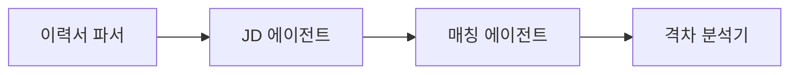
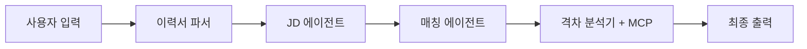

# 모듈 4 - 오케스트레이션 패턴

⏱️ ~10 분

이 모듈에서는 Resume Job Fit Evaluator에서 사용되는 오케스트레이션 패턴을 탐구하고 워크플로우 그래프를 읽고 수정하며 확장하는 방법을 배웁니다. 이러한 패턴을 이해하는 것은 데이터 흐름 문제를 디버깅하고 자신만의 [멀티 에이전트 워크플로우](https://learn.microsoft.com/agent-framework/workflows/)를 구축하는 데 필수적입니다.

---

## 패턴 1: 순차적 체인

워크플로우의 기본 패턴은 <strong>순차적 체인</strong>으로, 각 에이전트의 출력이 다음 에이전트로 직접 전달됩니다.


```mermaid
flowchart LR
    RP[이력서 파서] --> JD[JD 에이전트]
    JD --> MA[매칭 에이전트]
    MA --> GA[격차 분석기]
```

코드에서는 각 `add_edge()` 호출이 체인의 한 단계를 생성합니다:

```python
.add_edge(resume_executor, jd_executor)       # 이력서 파서 출력 → JD 에이전트
.add_edge(jd_executor, matching_executor)     # JD 에이전트 출력 → 매칭 에이전트
.add_edge(matching_executor, gap_executor)    # 매칭 에이전트 출력 → 갭 분석기
```

> **왜 팬아웃/팬인(fan-out/fan-in)이 아니라 순차적 방식인가?** `WorkflowBuilder`는 들어오는 엣지에 대해 <strong>OR-시멘틱(OR-semantics)</strong>을 사용합니다: 다운스트림 실행기는 <strong>어떤</strong> 선행 작업자가 완료되는 즉시 실행됩니다. 만약 `matching_executor`가 `resume_executor`와 `jd_executor` 둘 다로부터 두 개의 입력 엣지를 받는다면, ResumeParser가 끝날 때 한 번, JD Agent가 끝날 때 또 한 번 두 번 트리거되어 GapAnalyzer가 두 번 실행되고 출력도 두 번 나타나게 됩니다. 순차적 파이프라인은 이를 완전히 방지합니다.

## 패턴 2: 내용 릴레이

`context_mode="last_agent"`이 각 실행기가 오직 **직전 에이전트의 출력만** 볼 수 있음을 의미하므로, 순차적 체인에 있는 에이전트들은 다운스트림 에이전트가 필요한 데이터를 명시적으로 전달해야 합니다.

이 워크플로우에서:
- <strong>ResumeParser</strong>가 JD를 그대로 `[JOB DESCRIPTION PASS-THROUGH]`에 복사합니다 (그래서 JD Agent가 찾을 수 있습니다).
- <strong>JD Agent</strong>가 `[PARSED RESUME]`를 `[PARSED RESUME PASS-THROUGH]`에 그대로 복사합니다 (그래서 MatchingAgent가 양쪽 프로필을 비교할 수 있습니다).

```
ResumeParser output
└─ [PARSED RESUME]               ← extracted by JD Agent
└─ [JOB DESCRIPTION PASS-THROUGH] ← extracted by JD Agent

JD Agent output
└─ [JD REQUIREMENTS]             ← extracted by MatchingAgent
└─ [PARSED RESUME PASS-THROUGH]  ← extracted by MatchingAgent
```

각 릴레이 구간은 반드시 <strong>있는 그대로 복사</strong>되어야 하며, 요약하거나 바꾸면 해당 데이터를 의존하는 다운스트림 에이전트가 제대로 작동하지 않습니다.

---

## 전체 그래프

순차적 체인과 내용 릴레이 패턴을 결합하면 전체 워크플로우가 완성됩니다:


```mermaid
flowchart LR
    U[사용자 입력] --> RP[이력서 파서]
    RP --> JD[JD 에이전트]
    JD --> MA[매칭 에이전트]
    MA --> GA[격차 분석기 + MCP]
    GA --> O[최종 출력]
```

Agent Inspector는 에이전트가 로컬에서 실행 중일 때 이와 동일한 그래프 구조를 보여줍니다. 스크린샷은 [모듈 5 - 로컬에서 테스트](05-test-locally.md)를 참조하세요.

---

## WorkflowBuilder 코드 읽기

전체 `create_workflow()` 함수는 [`PersonalCareerCopilot/main.py`](../../../../../workshop/lab02-multi-agent/PersonalCareerCopilot/main.py)에 있습니다. 세 개의 `add_edge()` 호출이 순차 파이프라인을 구성합니다:

| # | 엣지 | 효과 |
|---|------|--------|
| 1 | `resume_executor → jd_executor` | JD Agent가 `[PARSED RESUME]` + `[JOB DESCRIPTION PASS-THROUGH]`를 받음 |
| 2 | `jd_executor → matching_executor` | MatchingAgent가 `[JD REQUIREMENTS]` + `[PARSED RESUME PASS-THROUGH]`를 받음 |
| 3 | `matching_executor → gap_executor` | GapAnalyzer가 적합성 보고서 + 격차 목록을 받음 |

---

## 그래프 수정하기

### 새 에이전트 추가하기

다섯 번째 에이전트(예: GapAnalyzer 뒤에 **InterviewPrepAgent**)를 추가하려면:

1. `INTERVIEW_PREP_INSTRUCTIONS` 상수를 정의합니다.
2. 기존 네 개 에이전트와 같은 패턴으로 `Agent` 및 `AgentExecutor` 객체를 만듭니다.
3. `WorkflowBuilder`에서 `.add_edge(gap_executor, interview_exec)`를 추가합니다.
4. `output_executors=[interview_exec]`를 업데이트합니다.

> **중요:** `start_executor`만이 원본 사용자 입력을 받으며, 다른 모든 에이전트들은 상류 엣지에서 나온 출력을 받습니다.

---

## 일반적인 그래프 실수

| 실수 | 증상 | 해결 방법 |
|---------|---------|-----|
| `output_executors`로 가는 엣지를 빼먹음 | 에이전트는 실행되지만 출력이 비어있음 | `start_executor`에서 모든 `output_executors` 에이전트까지 경로가 존재하는지 확인 |
| 순환 종속성 | 무한 루프 또는 타임아웃 | 에이전트가 상류 에이전트로 피드백하는지 확인하지 않음 |
| 입력 엣지가 없는 `output_executors` 에이전트 | 빈 출력 | 최소 하나의 `add_edge(source, that_agent)` 추가 필요 |
| 팬인 없는 다중 `output_executors` | 출력이 한 에이전트 응답만 포함 | 출력 에이전트 한 개로 집계하거나 여러 출력을 허용 |
| 누락된 `start_executor` | 빌드 시 `ValueError` 발생 | 항상 `WorkflowBuilder()`에 `start_executor` 지정 |

---

## 그래프 디버깅하기

### Agent Inspector 사용하기

1. F5로 에이전트를 로컬에서 시작합니다.
2. Agent Inspector 열기 (`Ctrl+Shift+P` → **Foundry Toolkit: Open Agent Inspector**).
3. 테스트 메시지를 보냅니다.
4. Inspector의 응답 패널에서 <strong>스트리밍 출력</strong>을 확인하세요 — 각 에이전트의 기여가 순서대로 나타납니다.


### 로깅 사용하기

데이터 흐름 추적을 위해 `main.py`에 로깅을 추가하세요:

```python
import logging
logger = logging.getLogger("resume-job-fit")

# main()에서, 워크플로우를 구축한 후:
logger.info("Workflow graph built with edges: RP→JD, JD→MA, MA→GA")
```

서버 로그는 에이전트 실행 순서와 MCP 도구 호출을 보여줍니다:

```
INFO:agent_framework:Executing agent: ResumeParser
INFO:agent_framework:Executing agent: JobDescriptionAgent
INFO:agent_framework:Executing agent: MatchingAgent
INFO:agent_framework:Executing agent: GapAnalyzer
INFO:agent_framework:Tool call: search_microsoft_learn_for_plan(skill="Kubernetes")
POST https://learn.microsoft.com/api/mcp → 200
INFO:agent_framework:Tool call: search_microsoft_learn_for_plan(skill="Terraform")
POST https://learn.microsoft.com/api/mcp → 200
```

---

### 체크포인트

- [ ] 워크플로우에서 두 가지 오케스트레이션 패턴인 순차적 체인과 내용 릴레이를 식별할 수 있습니다
- [ ] `context_mode="last_agent"`가 에이전트 간 명시적인 데이터 릴레이를 요구하는 이유를 이해합니다
- [ ] `WorkflowBuilder` 코드를 읽고 각 `add_edge()` 호출을 시각적 그래프에 매핑할 수 있습니다
- [ ] 파이프라인 끝에 새 에이전트를 추가하는 방법을 알고 있습니다
- [ ] 일반적인 그래프 실수와 그 증상을 식별할 수 있습니다

---

**이전:** [03 - 에이전트 및 환경 구성](03-configure-agents.md) · **다음:** [05 - 로컬 테스트 →](05-test-locally.md)

---

<!-- CO-OP TRANSLATOR DISCLAIMER START -->
**면책 조항**:
이 문서는 AI 번역 서비스 [Co-op Translator](https://github.com/Azure/co-op-translator)를 사용하여 번역되었습니다. 정확성을 기하기 위해 노력하고 있으나, 자동 번역은 오류나 부정확한 부분이 있을 수 있음을 유의하시기 바랍니다. 원본 문서의 원어본이 권위 있는 자료로 간주되어야 합니다. 중요한 정보의 경우, 전문가의 인간 번역을 권장합니다. 이 번역 사용으로 인해 발생하는 오해나 잘못된 해석에 대해 당사는 책임을 지지 않습니다.
<!-- CO-OP TRANSLATOR DISCLAIMER END -->