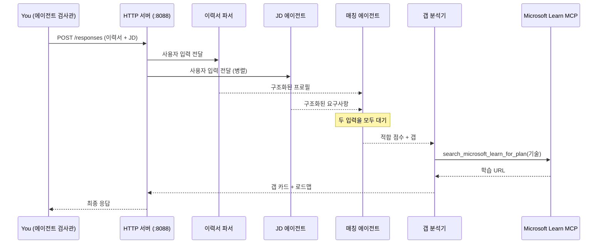
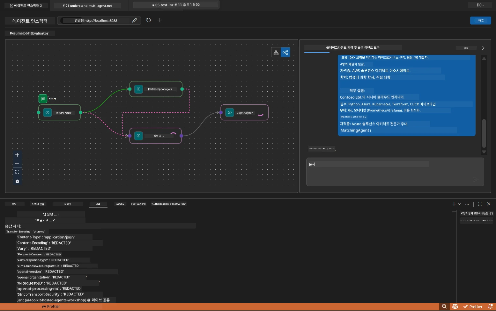

# Module 5 - 로컬에서 테스트하기 (멀티 에이전트)

이 모듈에서는 멀티 에이전트 워크플로우를 로컬에서 실행하고, Agent Inspector로 테스트하며, 네 개의 에이전트와 MCP 도구가 모두 올바르게 작동하는지 확인한 후 Foundry에 배포합니다.

### 로컬 테스트 실행 시 일어나는 일


---

## Step 1: 에이전트 서버 시작하기

### 옵션 A: VS Code 작업 사용하기 (권장)

1. `Ctrl+Shift+P`를 누르고 <strong>Tasks: Run Task</strong>를 입력 → **Run Lab02 HTTP Server** 선택.
2. 작업이 `5679` 포트에 debugpy를 연결하고, `8088` 포트에 에이전트를 시작합니다.
3. 출력에 다음 내용이 보일 때까지 기다립니다:

```
INFO:resume-job-fit:Starting Resume -> Job Fit Evaluator HTTP server...
INFO:resume-job-fit:Server running on http://localhost:8088
```

### 옵션 B: 터미널에서 수동으로 실행하기

```powershell
cd workshop\lab02-multi-agent\PersonalCareerCopilot
```

가상환경 활성화:

**PowerShell (Windows):**
```powershell
.\.venv\Scripts\Activate.ps1
```

**macOS/Linux:**
```bash
source .venv/bin/activate
```

서버 시작:

```powershell
python -m debugpy --listen 127.0.0.1:5679 -m agentdev run main.py --verbose --port 8088
```

### 옵션 C: F5 사용 (디버그 모드)

1. `F5`를 누르거나 **실행 및 디버그**(`Ctrl+Shift+D`)로 이동합니다.
2. 드롭다운에서 **Lab02 - Multi-Agent** 실행 구성을 선택합니다.
3. 서버가 전체 중단점 지원과 함께 시작됩니다.

> **팁:** 디버그 모드는 `search_microsoft_learn_for_plan()` 내부에 중단점을 설정하여 MCP 응답을 확인하거나 에이전트 지시 문자열 내부에 중단점을 걸어 각 에이전트가 받는 내용을 확인할 수 있습니다.

---

## Step 2: Agent Inspector 열기

1. `Ctrl+Shift+P`를 누르고 <strong>Foundry Toolkit: Open Agent Inspector</strong>를 입력합니다.
2. Agent Inspector가 브라우저 탭에서 `http://localhost:5679`로 열립니다.
3. 에이전트 인터페이스가 메시지 수신 준비가 된 것을 확인할 수 있습니다.

> **Agent Inspector가 열리지 않는 경우:** 서버가 완전히 시작되었는지 확인하세요 ("Server running" 로그가 보임). 5679 포트가 바쁘면 [Module 8 - 문제 해결](08-troubleshooting.md)을 참조하세요.

---

## Step 3: 스모크 테스트 실행

세 가지 테스트를 순서대로 실행합니다. 각 테스트는 워크플로우를 점진적으로 더 많이 검사합니다.

### 테스트 1: 기본 이력서 + 직무 설명

다음 내용을 Agent Inspector에 붙여넣으세요:

```
Resume:
Jane Doe
Senior Software Engineer with 5 years of experience in Python, Django, and AWS.
Built microservices handling 10K+ requests/second. Led a team of 4 developers.
Certifications: AWS Solutions Architect Associate.
Education: B.S. Computer Science, State University.

Job Description:
Senior Cloud Engineer at Contoso Ltd.
Required: Python, Azure, Kubernetes, Terraform, CI/CD pipelines.
Preferred: Go, monitoring (Prometheus/Grafana), cost optimization.
Experience: 5+ years in cloud infrastructure.
Certifications: Azure Solutions Architect Expert preferred.
```

**예상 출력 구조:**

응답에는 네 개의 에이전트 출력이 순서대로 포함되어야 합니다:

1. **Resume Parser 출력** - 카테고리별로 분류된 기술을 포함한 구조화된 후보자 프로필
2. **JD Agent 출력** - 필수 기술과 우대 기술이 구분된 구조화된 요구사항
3. **Matching Agent 출력** - 세부 내역이 포함된 적합 점수(0-100), 일치하는 기술, 누락 기술, 갭
4. **Gap Analyzer 출력** - 누락된 각 기술별 개별 갭 카드, 각 카드에 Microsoft Learn URL 포함



### 테스트 1에서 확인할 사항

| 점검 항목 | 기대 결과 | 통과 여부 |
|-----------|------------|-----------|
| 응답에 적합 점수 포함 | 0-100 사이의 숫자와 세부 내역 포함 | |
| 일치하는 기술 목록 포함 | Python, CI/CD(부분적), 기타 | |
| 누락된 기술 목록 포함 | Azure, Kubernetes, Terraform 등 | |
| 각 누락 기술별 갭 카드 존재 | 기술별 한 장씩 | |
| Microsoft Learn URL 포함 | 실제 `learn.microsoft.com` 링크 | |
| 응답에 오류 메시지 없음 | 깔끔한 구조화된 출력 | |

### 테스트 2: MCP 도구 실행 확인

테스트 1이 실행되는 동안 <strong>서버 터미널</strong>에서 MCP 로그 항목을 확인하세요:

```
GET https://learn.microsoft.com/api/mcp → 405 (Method Not Allowed)
POST https://learn.microsoft.com/api/mcp → 200
DELETE https://learn.microsoft.com/api/mcp → 405 (Method Not Allowed)
```

| 로그 항목 | 의미 | 예상 결과 |
|-----------|-------|-----------|
| `GET ... → 405` | 초기화 시 MCP 클라이언트가 GET으로 프로브 | 예 - 정상 |
| `POST ... → 200` | Microsoft Learn MCP 서버에 도구 호출 | 예 - 실제 호출 |
| `DELETE ... → 405` | 정리 시 MCP 클라이언트가 DELETE로 프로브 | 예 - 정상 |
| `POST ... → 4xx/5xx` | 도구 호출 실패 | 아니요 - [문제 해결](08-troubleshooting.md) 참조 |

> **중요:** `GET 405` 및 `DELETE 405` 항목은 <strong>예상 동작</strong>입니다. 비정상적인 점은 `POST` 호출이 200 이외의 상태 코드를 반환할 때뿐입니다.

### 테스트 3: 에지 케이스 - 높은 적합도 후보자

JD에 매우 가까운 이력서를 붙여넣어 GapAnalyzer가 높은 적합도 상황을 처리하는지 확인하세요:

```
Resume:
Alex Chen
Senior Cloud Engineer with 7 years of experience.
Skills: Python, Azure (AKS, Functions, DevOps), Kubernetes, Terraform, CI/CD (GitHub Actions, Azure Pipelines), Go, Prometheus, Grafana, cost optimization.
Certifications: Azure Solutions Architect Expert, Azure DevOps Engineer Expert.
Led infrastructure migration to Azure for 3 enterprise clients.
Education: M.S. Computer Science, Tech University.

Job Description:
Senior Cloud Engineer at Contoso Ltd.
Required: Python, Azure, Kubernetes, Terraform, CI/CD pipelines.
Preferred: Go, monitoring (Prometheus/Grafana), cost optimization.
Experience: 5+ years in cloud infrastructure.
Certifications: Azure Solutions Architect Expert preferred.
```

**예상 동작:**
- 적합 점수는 <strong>80 이상</strong>이어야 함 (대부분 기술 일치)
- 갭 카드는 기초 학습보다는 다듬기/면접 준비에 중점
- GapAnalyzer 지침에 "적합도 >= 80일 경우, 다듬기/면접 준비에 집중" 명시

---

## Step 4: 출력 완전성 확인

테스트를 실행한 후 출력이 다음 기준을 충족하는지 확인합니다:

### 출력 구조 체크리스트

| 섹션 | 에이전트 | 존재 여부 |
|-------|---------|-----------|
| 후보자 프로필 | Resume Parser | |
| 기술(그룹화됨) | Resume Parser | |
| 역할 개요 | JD Agent | |
| 필수 vs. 우대 기술 | JD Agent | |
| 세부 내역이 있는 적합 점수 | Matching Agent | |
| 일치/누락/부분 기술 | Matching Agent | |
| 누락 기술별 갭 카드 | Gap Analyzer | |
| 갭 카드 내 Microsoft Learn URL | Gap Analyzer (MCP) | |
| 학습 순서(번호 매김) | Gap Analyzer | |
| 타임라인 요약 | Gap Analyzer | |

### 이 단계에서 흔한 문제

| 문제 | 원인 | 해결책 |
|--------|---------|---------|
| 갭 카드 1장만 있음 (다른 카드 잘림) | GapAnalyzer 지침에 CRITICAL 블록 누락 | `GAP_ANALYZER_INSTRUCTIONS`에 `CRITICAL:` 문단 추가 - [Module 3](03-configure-agents.md) 참조 |
| Microsoft Learn URL 없음 | MCP 엔드포인트 접속 불가 | 인터넷 연결 및 `.env` 내 `MICROSOFT_LEARN_MCP_ENDPOINT`가 `https://learn.microsoft.com/api/mcp`인지 확인 |
| 빈 응답 | `PROJECT_ENDPOINT` 또는 `MODEL_DEPLOYMENT_NAME` 미설정 | `.env` 파일 값 확인. 터미널에서 `echo $env:PROJECT_ENDPOINT` 실행 |
| 적합 점수 0 또는 없음 | MatchingAgent가 상위 데이터 수신 실패 | `create_workflow()` 내 `add_edge(resume_parser, matching_agent)` 및 `add_edge(jd_agent, matching_agent)` 존재 확인 |
| 에이전트가 즉시 종료됨 | 임포트 오류 또는 종속성 문제 | `pip install -r requirements.txt` 재실행. 터미널에 스택 트레이스 확인 |
| `validate_configuration` 오류 | 환경 변수 누락 | `.env` 파일에 `PROJECT_ENDPOINT=<your-endpoint>`, `MODEL_DEPLOYMENT_NAME=<your-model>` 추가 |

---

## Step 5: 본인 데이터로 테스트하기 (선택 사항)

본인 이력서와 실제 직무 설명을 붙여 넣어 테스트해 보세요. 이렇게 하면:

- 에이전트가 다양한 이력서 형식(연대기형, 기능별, 하이브리드)을 처리하는지 확인 가능
- JD Agent가 다양한 직무 설명 스타일(글머리표, 단락, 구조화)을 처리하는지 확인 가능
- MCP 도구가 실제 기술에 맞는 관련 리소스를 반환하는지 검증 가능
- 갭 카드가 개인 배경에 적합하게 맞춤화되는지 확인 가능

> **개인정보 주의:** 로컬 테스트 시 데이터는 사용자의 컴퓨터에만 저장되고 Azure OpenAI 배포에만 전송됩니다. 워크숍 인프라에서 로그나 저장하지 않습니다. 원할 경우 실제 이름 대신 예: "Jane Doe" 같은 가명 사용 권장.

---

### 체크포인트

- [ ] `8088` 포트에서 서버가 정상 시작됨 ("Server running" 로그 확인)
- [ ] Agent Inspector가 열리고 에이전트에 연결됨
- [ ] 테스트 1: 적합 점수, 일치/누락 기술, 갭 카드, Microsoft Learn URL 포함된 완전한 응답
- [ ] 테스트 2: MCP 로그에 `POST ... → 200` (도구 호출 성공) 표시
- [ ] 테스트 3: 높은 적합도 후보자에게 80+ 점수 및 다듬기 중심 권장사항 제공
- [ ] 모든 갭 카드 존재(누락 기술별 1장, 잘림 없음)
- [ ] 서버 터미널에 오류 또는 스택 트레이스 없음

---

**이전:** [04 - Orchestration Patterns](04-orchestration-patterns.md) · **다음:** [06 - Deploy to Foundry →](06-deploy-to-foundry.md)

---

<!-- CO-OP TRANSLATOR DISCLAIMER START -->
**면책 조항**:  
이 문서는 AI 번역 서비스 [Co-op Translator](https://github.com/Azure/co-op-translator)를 사용하여 번역되었습니다. 정확성을 위해 노력하고 있으나 자동 번역에는 오류나 부정확성이 있을 수 있음을 유의해 주십시오. 원본 문서는 해당 언어의 원문이 권위 있는 출처로 간주되어야 합니다. 중요한 정보의 경우 전문적인 인간 번역을 권장합니다. 본 번역 사용으로 인해 발생하는 어떠한 오해나 잘못된 해석에 대해 당사는 책임을 지지 않습니다.
<!-- CO-OP TRANSLATOR DISCLAIMER END -->