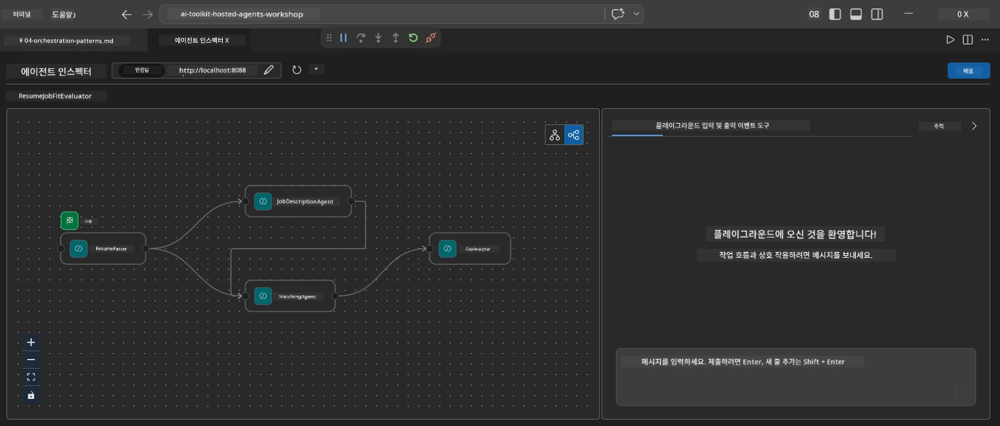
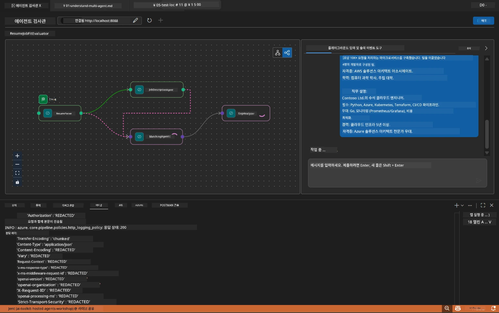
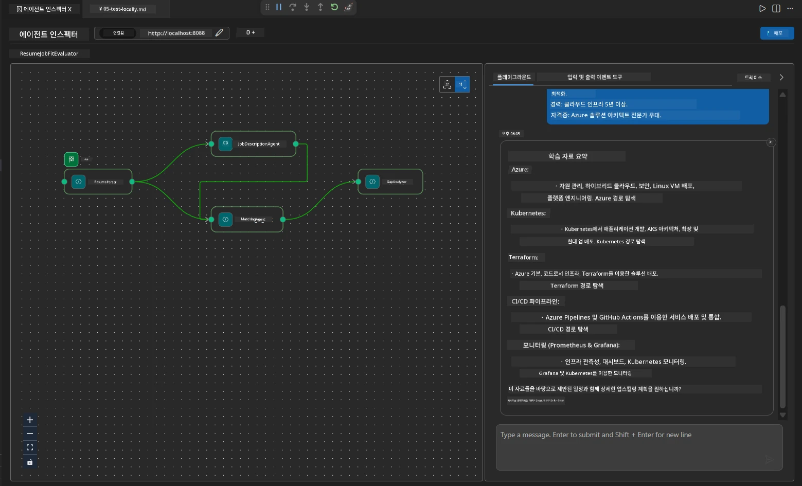

# 모듈 5 - 로컬 테스트

⏱️ 약 15분

이 모듈에서는 멀티 에이전트 워크플로우를 로컬에서 실행하고, Agent Inspector로 테스트하며, 모든 네 에이전트와 MCP 도구가 제대로 작동하는지 확인한 후 배포합니다.

---

## 1단계: 에이전트 서버 시작

### 옵션 A: VS Code 작업 사용 (권장)

1. `workshop/lab02-multi-agent/PersonalCareerCopilot/`를 VS Code 폴더로 엽니다.
2. `Ctrl+Shift+P`를 누른 후 <strong>Tasks: Run Task</strong>를 입력하고 <strong>Run Agent HTTP Server</strong>를 선택합니다.
3. 작업은 디버그파이가 포트 `5679`에 연결된 상태로 서버를 시작하고 에이전트를 포트 `8088`에서 실행합니다.
4. 다음 출력이 보일 때까지 기다립니다:

```
INFO:resume-job-fit:Starting Resume -> Job Fit Evaluator HTTP server...
INFO:resume-job-fit:Server running on http://localhost:8088
```

### 옵션 B: F5 사용 (디버그 모드)

1. `F5`를 누른 후 <strong>Debug Local Agent HTTP Server</strong>를 선택합니다.
2. 서버가 전체 중단점 지원과 함께 시작되며, MCP 응답이나 에이전트 출력을 검사하는 데 유용합니다.

---

## 2단계: Agent Inspector 열기

1. `Ctrl+Shift+P`를 누른 후 <strong>Foundry Toolkit: Open Agent Inspector</strong>를 입력합니다.
2. Agent Inspector가 `http://localhost:8088`에 연결된 VS Code 패널로 열립니다.
3. 메시지를 수신할 준비가 된 에이전트 인터페이스를 볼 수 있습니다.



> **Agent Inspector가 열리지 않는 경우:** 서버가 완전히 시작되었는지 확인하세요("Server running" 로그가 보임). 포트 5679가 사용 중인 경우, [모듈 8 - 문제 해결](08-troubleshooting.md)을 참조하세요.

---

## 2b단계: (선택) 워크플로우 비주얼라이저 열기

Foundry Toolkit에는 에이전트 간 상호 작용이 실행 그래프로 실시간 표시되는 <strong>워크플로우 비주얼라이저</strong>가 포함되어 있습니다. 멀티 에이전트 디버깅에 특히 유용합니다.

1. `Ctrl+Shift+P`를 누른 후 <strong>Foundry Toolkit: Open Visualizer for Hosted Agents</strong>를 입력합니다.
2. 새 VS Code 탭이 열리며 실시간 실행 그래프가 표시됩니다.
3. Agent Inspector에서 메시지를 보낼 때 비주얼라이저가 자동으로 업데이트되며, 녹색 노드는 완료된 에이전트를, 애니메이션된 선은 에이전트 간 데이터 흐름을 나타냅니다.

> **포트 충돌:** 비주얼라이저 포트가 이미 사용 중인 경우, VS Code 설정 → **Extensions** → **Microsoft Foundry Configuration** → <strong>Hosted Agents: Visualizer Port</strong>에서 변경하세요.

---

## 3단계: 스모크 테스트 실행

세 가지 테스트를 순서대로 실행하세요. 각 테스트는 워크플로우의 점진적인 부분을 확인합니다.

### 테스트 1: 기본 이력서 + 직무 내용

다음 내용을 Agent Inspector에 붙여넣으세요:

```
Resume:
Jane Doe
Senior Software Engineer with 5 years of experience in Python, Django, and AWS.
Built microservices handling 10K+ requests/second. Led a team of 4 developers.
Certifications: AWS Solutions Architect Associate.
Education: B.S. Computer Science, State University.

Job Description:
Senior Cloud Engineer at Contoso Ltd.
Required: Python, Azure, Kubernetes, Terraform, CI/CD pipelines.
Preferred: Go, monitoring (Prometheus/Grafana), cost optimization.
Experience: 5+ years in cloud infrastructure.
Certifications: Azure Solutions Architect Expert preferred.
```

**예상 출력 구조:**

응답에는 네 에이전트 출력이 순서대로 포함되어야 합니다:

1. **이력서 파서 출력** - 두 개의 레이블 섹션: `[PARSED RESUME]` (그룹화된 기술이 있는 후보자 프로필) 및 `[JOB DESCRIPTION PASS-THROUGH]` (JD 에이전트에 전달하는 직무 설명 텍스트)
2. **JD 에이전트 출력** - 필요한 기술과 우대 기술이 구분된 구조화된 요구사항
3. **매칭 에이전트 출력** - 적합 점수(0-100) 및 세부 사항, 매칭된 기술, 누락된 기술, 격차 목록
4. **갭 분석기 출력** - 각 누락 기술별 Microsoft Learn URL이 포함된 개별 격차 카드





### 테스트 1에서 확인할 항목

| 확인 사항 | 예상 내용 | 통과 여부 |
|---------|----------|-------|
| 응답에 적합 점수가 포함되어 있음 | 0-100 사이 숫자 및 세부 내역 | |
| 매칭된 기술들이 목록에 있음 | Python, CI/CD (부분적), 등 | |
| 누락된 기술들이 목록에 있음 | Azure, Kubernetes, Terraform, 등 | |
| 누락 기술별 격차 카드가 존재함 | 기술당 하나의 카드 | |
| Microsoft Learn URL이 포함됨 | 실제 `learn.microsoft.com` 링크 | |
| 응답에 오류 메시지 없음 | 깔끔하고 구조화된 출력 | |

### 테스트 2: 극단 사례 - 고적합 후보

직무 내용과 거의 완벽히 일치하는 이력서를 붙여넣어 GapAnalyzer가 고적합 상황을 제대로 처리하는지 확인하세요:

```
Resume:
Alex Chen
Senior Cloud Engineer with 7 years of experience.
Skills: Python, Azure (AKS, Functions, DevOps), Kubernetes, Terraform, CI/CD (GitHub Actions, Azure Pipelines), Go, Prometheus, Grafana, cost optimization.
Certifications: Azure Solutions Architect Expert, Azure DevOps Engineer Expert.
Led infrastructure migration to Azure for 3 enterprise clients.
Education: M.S. Computer Science, Tech University.

Job Description:
Senior Cloud Engineer at Contoso Ltd.
Required: Python, Azure, Kubernetes, Terraform, CI/CD pipelines.
Preferred: Go, monitoring (Prometheus/Grafana), cost optimization.
Experience: 5+ years in cloud infrastructure.
Certifications: Azure Solutions Architect Expert preferred.
```

**예상 동작:**
- 적합 점수는 <strong>80 이상</strong>이어야 합니다 (대부분의 기술이 일치)
- 격차 카드는 기초 학습보다는 다듬기/면접 준비에 집중해야 합니다
- GapAnalyzer 지침은 "적합 점수가 80 이상이면 다듬기/면접 준비에 집중"이라고 명시함

---

## 4단계: 자신의 데이터로 테스트 (선택 사항)

자신의 이력서와 실제 직무 설명을 붙여넣어 다음 사항을 검증해 보세요:

- 에이전트가 다양한 이력서 형식(연대기식, 기능식, 하이브리드)을 처리하는지
- JD 에이전트가 다양한 직무 설명 스타일(글머리표, 문단, 구조화)을 처리하는지
- MCP 도구가 실제 기술에 적절한 리소스를 반환하는지
- 격차 카드가 당신의 특정 배경에 맞게 개인화되는지

> **프라이버시 - 경로 A (Foundry 클라우드):** 이력서 및 직무 설명 텍스트는 추론을 위해 Azure OpenAI 배포로 전송됩니다. 워크숍 인프라에는 로그나 저장이 되지 않습니다. 원한다면 "Jane Doe" 같은 자리 표시자 이름을 사용하세요.
>
> **프라이버시 - 경로 B (Foundry 로컬):** 네 에이전트 추론은 모두 당신 장치에서 실행됩니다. 당신의 이력서 및 직무 설명 텍스트는 **절대 장치를 벗어나지 않습니다**. 유일한 아웃바운드 호출은 MCP 도구가 `https://learn.microsoft.com/api/mcp`에서 리소스를 가져오는 것으로, 쿼리에는 기술 이름만 포함되고 개인 데이터는 포함되지 않습니다.

---

### 체크포인트

- [ ] 포트 `8088`에서 서버가 성공적으로 시작됨 ("Server running" 로그 표시)
- [ ] Agent Inspector가 열리고 에이전트에 연결됨
- [ ] 테스트 1: 적합 점수, 매칭/누락 기술, 격차 카드, Microsoft Learn URL이 포함된 완전한 응답
- [ ] 테스트 2: 고적합 후보가 80 이상 점수와 다듬기 중심 권고를 받음
- [ ] 모든 격차 카드가 존재함 (누락 기술당 하나, 누락 없음)
- [ ] 서버 터미널에 오류나 스택 트레이스 없음

---

**이전:** [04 - 오케스트레이션 패턴](04-orchestration-patterns.md) · **다음:** [06 - Foundry에 배포 →](06-deploy-to-foundry.md)

---

<!-- CO-OP TRANSLATOR DISCLAIMER START -->
**면책 조항**:
이 문서는 AI 번역 서비스 [Co-op Translator](https://github.com/Azure/co-op-translator)를 사용하여 번역되었습니다. 정확성을 기하기 위해 노력하고 있으나, 자동 번역은 오류나 부정확한 부분이 있을 수 있음을 유의하시기 바랍니다. 원본 문서의 원어본이 권위 있는 자료로 간주되어야 합니다. 중요한 정보의 경우, 전문가의 인간 번역을 권장합니다. 이 번역 사용으로 인해 발생하는 오해나 잘못된 해석에 대해 당사는 책임을 지지 않습니다.
<!-- CO-OP TRANSLATOR DISCLAIMER END -->