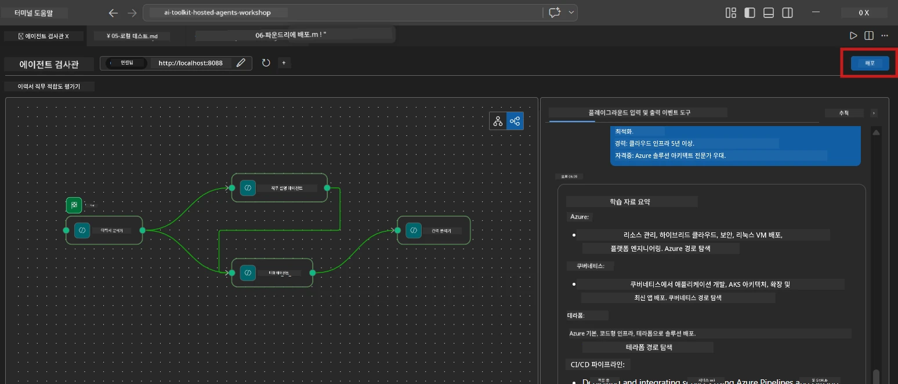
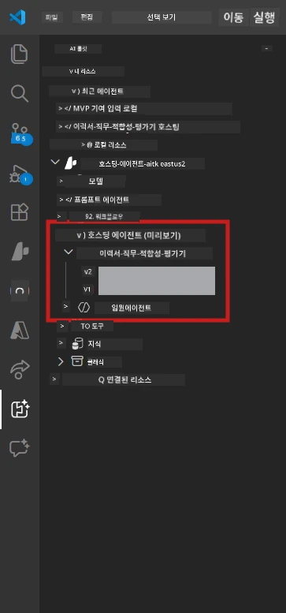

# Module 6 - Foundry 에이전트 서비스에 배포

이 모듈에서는 로컬에서 테스트한 다중 에이전트 워크플로를 [Microsoft Foundry](https://learn.microsoft.com/azure/foundry/agents/concepts/hosted-agents)에 <strong>호스티드 에이전트</strong>로 배포합니다. 배포 과정에서는 Docker 컨테이너 이미지를 빌드하고, 이를 [Azure Container Registry (ACR)](https://learn.microsoft.com/azure/container-registry/container-registry-intro)에 푸시한 다음, [Foundry Agent Service](https://learn.microsoft.com/azure/foundry/agents/how-to/publish-agent)에 호스티드 에이전트 버전을 생성합니다.

> **Lab 01과의 주요 차이점:** 배포 과정은 동일합니다. Foundry는 다중 에이전트 워크플로를 단일 호스티드 에이전트로 취급하며, 복잡성은 컨테이너 내부에 있지만 배포 표면은 동일하게 `/responses` 엔드포인트입니다.

---

## 사전 조건 확인

배포 전 다음 항목들을 확인하세요:

1. **에이전트가 로컬 스모크 테스트를 통과함:**
   - [Module 5](05-test-locally.md)에서 3가지 테스트를 모두 완료했고 워크플로가 gap 카드 및 Microsoft Learn URL이 포함된 완전한 출력을 생성했는지 확인.

2. **[Azure AI 사용자](https://learn.microsoft.com/azure/foundry/concepts/rbac-foundry) 역할을 보유:**
   - [Lab 01, Module 2](../../lab01-single-agent/docs/02-create-foundry-project.md)에서 할당됨. 다음에서 확인:
   - [Azure Portal](https://portal.azure.com) → 해당 Foundry <strong>프로젝트</strong> 리소스 → **액세스 제어 (IAM)** → **역할 할당** → 계정에 **[Azure AI 사용자](https://aka.ms/foundry-ext-project-role)** 역할이 나열됨 확인.

3. **VS Code에서 Azure에 로그인됨:**
   - VS Code 왼쪽 하단의 계정 아이콘에서 계정 이름이 보여야 함.

4. **`agent.yaml`에 올바른 값 있음:**
   - `PersonalCareerCopilot/agent.yaml`을 열고 다음을 확인:
     ```yaml
     environment_variables:
       - name: PROJECT_ENDPOINT
         value: ${PROJECT_ENDPOINT}
       - name: MODEL_DEPLOYMENT_NAME
         value: ${MODEL_DEPLOYMENT_NAME}
     ```
   - 이 값들은 `main.py`가 읽는 환경 변수와 일치해야 함.

5. **`requirements.txt`에 올바른 버전 있음:**
   ```
   agent-framework-azure-ai==1.0.0rc3
   agent-framework-core==1.0.0rc3
   azure-ai-agentserver-agentframework==1.0.0b16
   azure-ai-agentserver-core==1.0.0b16
   debugpy
   agent-dev-cli --pre
   ```

---

## 1단계: 배포 시작

### 옵션 A: 에이전트 인스펙터에서 배포 (권장)

에이전트가 F5로 실행 중이며 에이전트 인스펙터가 열려 있으면:

1. 에이전트 인스펙터 패널 <strong>오른쪽 상단</strong>을 봅니다.
2. <strong>배포</strong> 버튼(위쪽 화살표 ↑가 있는 구름 아이콘)을 클릭합니다.
3. 배포 마법사가 열립니다.



### 옵션 B: 명령 팔레트에서 배포

1. `Ctrl+Shift+P`를 눌러 <strong>명령 팔레트</strong>를 엽니다.
2. 입력: <strong>Microsoft Foundry: Deploy Hosted Agent</strong>를 선택합니다.
3. 배포 마법사가 열립니다.

---

## 2단계: 배포 구성

### 2.1 대상 프로젝트 선택

1. 드롭다운에 Foundry 프로젝트가 표시됩니다.
2. 워크숍 전체에서 사용한 프로젝트를 선택합니다 (예: `workshop-agents`).

### 2.2 컨테이너 에이전트 파일 선택

1. 에이전트 엔트리 포인트 선택을 요청받습니다.
2. `workshop/lab02-multi-agent/PersonalCareerCopilot/`로 이동해 **`main.py`**를 선택합니다.

### 2.3 리소스 구성

| 설정 | 권장 값 | 비고 |
|---------|------------------|-------|
| **CPU** | `0.25` | 기본값. 다중 에이전트 워크플로는 모델 호출이 I/O 바운드이므로 더 많은 CPU가 필요 없음 |
| <strong>메모리</strong> | `0.5Gi` | 기본값. 대규모 데이터 처리 도구 추가 시 `1Gi`로 증가 가능 |

---

## 3단계: 확인 및 배포

1. 마법사에서 배포 요약을 보여줍니다.
2. 검토 후 <strong>확인 및 배포</strong>를 클릭합니다.
3. VS Code에서 진행 상황을 확인합니다.

### 배포 시 일어나는 일

VS Code <strong>출력</strong> 패널(드롭다운에서 "Microsoft Foundry" 선택)을 봅니다:


1. **Docker 빌드** - `Dockerfile`에서 컨테이너 빌드:
   ```
   Step 1/6 : FROM python:3.14-slim
   Step 2/6 : WORKDIR /app
   ...
   Successfully built abc123def456
   ```

2. **Docker 푸시** - 이미지를 ACR에 푸시 (첫 배포 시 1-3분 소요).

3. **에이전트 등록** - Foundry가 `agent.yaml` 메타데이터로 호스티드 에이전트 생성. 에이전트 이름은 `resume-job-fit-evaluator`.

4. **컨테이너 시작** - Foundry의 관리형 인프라에서 시스템 관리 ID와 함께 컨테이너 시작.

> **첫 배포가 더 느림** (Docker가 모든 레이어를 푸시함). 이후 배포는 캐시된 레이어를 재사용하여 더 빠름.

### 다중 에이전트 관련 참고 사항

- **모든 네 개의 에이전트가 하나의 컨테이너에 포함됨.** Foundry는 단일 호스티드 에이전트로 인식함. WorkflowBuilder 그래프는 내부에서 실행됨.
- **MCP 호출은 외부로 나감.** 컨테이너가 `https://learn.microsoft.com/api/mcp`에 접근할 수 있는 인터넷 연결 필요. Foundry 관리형 인프라가 기본적으로 제공.
- **[관리형 ID](https://learn.microsoft.com/python/api/overview/azure/identity-readme#managed-identity-support).** 호스티드 환경에서는 `main.py`에서 `get_credential()`가 `ManagedIdentityCredential()` 반환 (`MSI_ENDPOINT`가 설정되어 있기 때문). 자동 처리됨.

---

## 4단계: 배포 상태 확인

1. **Microsoft Foundry** 사이드바를 엽니다 (활동 표시줄에서 Foundry 아이콘 클릭).
2. 프로젝트 아래의 <strong>호스티드 에이전트 (미리보기)</strong>를 확장합니다.
3. **resume-job-fit-evaluator** (또는 에이전트 이름)을 찾습니다.
4. 에이전트 이름 클릭 → 버전 확장 (예: `v1`).
5. 버전 클릭 → **컨테이너 세부정보** → <strong>상태</strong> 확인:



| 상태 | 의미 |
|--------|---------|
| **Started** / **Running** | 컨테이너가 실행 중이며 에이전트가 준비됨 |
| **Pending** | 컨테이너가 시작 중 (30-60초 대기) |
| **Failed** | 컨테이너가 시작 실패 (로그 확인 - 아래 참조) |

> **다중 에이전트 시작은 단일 에이전트보다 더 오래 걸림** - 컨테이너가 시작 시 4개의 에이전트 인스턴스를 만듦. "Pending" 상태가 최대 2분 정도는 정상임.

---

## 일반적인 배포 오류 및 해결 방법

### 오류 1: 권한 거부 - `agents/write`

```
Error: lacks the required data action 
Microsoft.CognitiveServices/accounts/AIServices/agents/write
```

**해결:** **[Azure AI 사용자](https://learn.microsoft.com/azure/foundry/concepts/rbac-foundry)** 역할을 <strong>프로젝트</strong> 수준에서 할당하세요. 자세한 단계는 [Module 8 - 문제 해결](08-troubleshooting.md) 참조.

### 오류 2: Docker 실행 안 됨

```
Error: Docker build failed / Cannot connect to Docker daemon
```

**해결:**
1. Docker Desktop을 시작합니다.
2. "Docker Desktop is running" 상태가 될 때까지 기다립니다.
3. `docker info`로 확인합니다.
4. **Windows:** Docker Desktop 설정에서 WSL 2 백엔드가 활성화되어 있는지 확인합니다.
5. 다시 시도합니다.

### 오류 3: Docker 빌드 중 pip 설치 실패

```
Error: Could not find a version that satisfies the requirement agent-dev-cli
```

**해결:** `requirements.txt`의 `--pre` 플래그가 Docker에서는 다르게 처리됩니다. `requirements.txt`에 다음이 포함되어 있는지 확인:
```
agent-dev-cli --pre
```

계속 실패하면 `pip.conf`를 생성하거나 빌드 인수로 `--pre`를 전달하세요. [Module 8](08-troubleshooting.md) 참조.

### 오류 4: 호스티드 에이전트에서 MCP 도구 실패

배포 후 Gap Analyzer가 Microsoft Learn URL을 생성하지 않는 경우:

**원인:** 네트워크 정책이 컨테이너의 아웃바운드 HTTPS를 차단할 수 있음.

**해결:**
1. Foundry 기본 구성에서는 일반적으로 문제 없음.
2. 문제가 발생하면 Foundry 프로젝트의 가상 네트워크에 아웃바운드 HTTPS를 차단하는 NSG가 있는지 확인.
3. MCP 도구는 대체 URL을 내장하고 있으므로 라이브 URL 없이도 출력 생성은 계속됨.

---

### 체크포인트

- [ ] VS Code에서 배포 명령이 오류 없이 완료됨
- [ ] Foundry 사이드바의 <strong>호스티드 에이전트 (미리보기)</strong>에 에이전트가 나타남
- [ ] 에이전트 이름이 `resume-job-fit-evaluator` (또는 선택한 이름)임
- [ ] 컨테이너 상태가 **Started** 또는 <strong>Running</strong>으로 표시됨
- [ ] (오류 발생 시) 오류를 확인하고 수정하여 재배포 성공

---

**이전:** [05 - 로컬 테스트](05-test-locally.md) · **다음:** [07 - 플레이그라운드에서 검증 →](07-verify-in-playground.md)

---

<!-- CO-OP TRANSLATOR DISCLAIMER START -->
**면책 조항**:  
이 문서는 AI 번역 서비스 [Co-op Translator](https://github.com/Azure/co-op-translator)를 사용하여 번역되었습니다. 정확성을 위해 노력하고 있지만, 자동 번역에는 오류나 부정확성이 포함될 수 있음을 유의해 주시기 바랍니다. 원본 문서가 권위 있는 출처로 간주되어야 합니다. 중요한 정보의 경우 전문적인 인적 번역을 권장합니다. 본 번역 사용으로 인해 발생하는 오해나 잘못된 해석에 대해 당사는 책임을 지지 않습니다.
<!-- CO-OP TRANSLATOR DISCLAIMER END -->