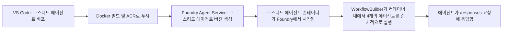
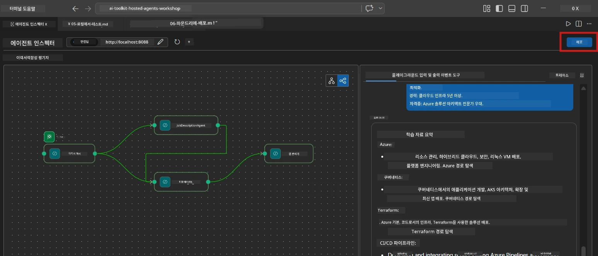

# 모듈 6 - Foundry 에이전트 서비스에 배포

⏱️ 약 10분

이 모듈에서는 로컬에서 테스트한 다중 에이전트 워크플로우를 [Microsoft Foundry](https://learn.microsoft.com/azure/foundry/agents/concepts/hosted-agents)에 <strong>호스티드 에이전트</strong>로 배포합니다. 배포 과정에서는 Docker 컨테이너 이미지를 빌드하고, 이를 [Azure Container Registry (ACR)](https://learn.microsoft.com/azure/container-registry/container-registry-intro)에 푸시하며, [Foundry Agent Service](https://learn.microsoft.com/azure/foundry/agents/how-to/publish-agent)에서 호스티드 에이전트 버전을 생성합니다.

> **Lab 01과의 주요 차이점:** 배포 프로세스는 동일합니다. Foundry는 다중 에이전트 워크플로우를 단일 호스티드 에이전트로 처리합니다 - 복잡성은 컨테이너 내부에 있지만 배포 대상은 동일한 `/responses` 엔드포인트입니다.

### 배포 파이프라인


```mermaid
flowchart LR
    A[VS Code: 호스티드 에이전트 배포] --> B[Docker 빌드 및 ACR로 푸시]
    B --> C[Foundry Agent Service: 호스티드 에이전트 버전 생성]
    C --> D[호스티드 에이전트 컨테이너가 Foundry에서 시작됨]
    D --> E[WorkflowBuilder가 컨테이너 내에서 4개의 에이전트를 순차적으로 실행]
    E --> F[에이전트가 /responses 요청에 응답함]
```

---

## 사전 조건 확인

배포 전에 아래 항목을 모두 확인하세요:

1. **에이전트가 로컬 스모크 테스트를 통과했는지:**
   - [모듈 5](05-test-locally.md)의 3가지 테스트를 모두 완료했고, 워크플로우가 누락 카드 및 Microsoft Learn URL과 함께 완성된 출력을 생성했습니다.

2. **[Foundry 사용자](https://learn.microsoft.com/azure/foundry/concepts/rbac-foundry) 역할이 있는지** (배포하려면 프로젝트 범위에서 최소한 <strong>Foundry 프로젝트 관리자</strong>여야 합니다):

   > **참고:** Foundry RBAC 역할 이름이 최근 변경되었습니다 - **Foundry 사용자**, **Foundry 소유자**, <strong>Foundry 프로젝트 관리자</strong>는 이전에 Azure AI 사용자, Azure AI 소유자, Azure AI 프로젝트 관리자였습니다. 역할 ID 및 권한은 변경되지 않았습니다.

   - [Azure 포털](https://portal.azure.com) → Foundry <strong>프로젝트</strong> 리소스 → **액세스 제어 (IAM)** → <strong>역할 할당</strong>에서 귀하의 계정에 **Foundry 사용자**(또는 그 이상)가 나열되어 있는지 확인하세요.

3. **VS Code에서 Azure에 로그인했는지:**
   - VS Code 왼쪽 하단의 계정 아이콘을 확인하세요. 계정 이름이 보여야 합니다.

4. **`agent.yaml`의 값이 올바른지:**
   - `PersonalCareerCopilot/agent.yaml`을 열고 다음을 확인하세요:
     ```yaml
     environment_variables:
       - name: AZURE_AI_MODEL_DEPLOYMENT_NAME
         value: ${AZURE_AI_MODEL_DEPLOYMENT_NAME}
     ```
   - `FOUNDRY_PROJECT_ENDPOINT`는 여기에 나열되지 않습니다 - Foundry가 런타임에 삽입합니다. 선언해야 하는 것은 `AZURE_AI_MODEL_DEPLOYMENT_NAME` 뿐입니다.

5. **`requirements.txt`에 올바른 버전이 있는지:**
   ```
   agent-framework-foundry
   agent-framework-foundry-hosting
   mcp<2,>=1.24.0
   debugpy
   ```

---

## 1단계: 배포 시작

### 옵션 A: 에이전트 검사기에서 배포 (권장)

에이전트가 F5로 실행 중이고 에이전트 검사기가 열려 있다면:

1. 에이전트 검사기 패널의 <strong>오른쪽 상단</strong>을 봅니다.
2. <strong>배포</strong> 버튼(클라우드 아이콘에 위쪽 화살표 ↑)을 클릭합니다.
3. 배포 마법사가 열립니다.



### 옵션 B: 명령 팔레트에서 배포

1. `Ctrl+Shift+P`를 눌러 <strong>명령 팔레트</strong>를 엽니다.
2. <strong>Foundry Toolkit: Deploy Hosted Agent</strong>를 입력하고 선택합니다.
3. 배포 마법사가 열립니다.

---

## 2단계: 배포 구성

### 2.1 대상 프로젝트 선택

1. Foundry 프로젝트 목록이 드롭다운으로 표시됩니다.
2. 워크숍 내내 사용한 프로젝트를 선택하세요(예: `workshop-agents`).

### 2.2 컨테이너 에이전트 파일 선택

1. 에이전트 진입점을 선택하라는 메시지가 표시됩니다.
2. `workshop/lab02-multi-agent/PersonalCareerCopilot/`로 이동하여 **`main.py`**를 선택합니다.

### 2.3 리소스 구성

| 설정 | 권장 값 | 비고 |
|---------|------------------|-------|
| **배포 방법** | <strong>컨테이너</strong> (권장) 또는 <strong>코드</strong> | 컨테이너는 Docker 이미지를 빌드; 코드는 소스를 ZIP으로 업로드(미리보기) |
| **컨테이너 레지스트리** | **기본 ACR** | Foundry가 자동으로 생성 및 관리 |
| **CPU** | `0.25` | 기본값. 다중 에이전트 워크플로우는 모델 호출이 I/O 바운드이므로 더 많은 CPU 불필요 |
| <strong>메모리</strong> | `0.5Gi` | 기본값. 대용량 데이터 처리 도구 추가 시 `1Gi`로 증가 가능 |

---

## 3단계: 확인 및 배포

1. 마법사에서 배포 요약을 보여줍니다.
2. 검토 후 <strong>확인 및 배포</strong>를 클릭합니다.
3. VS Code에서 진행 상황을 확인합니다.

### 배포 중에 벌어지는 일

VS Code <strong>출력</strong> 패널을 확인하세요 (드롭다운에서 "Microsoft Foundry" 선택):

1. **Docker 빌드** - `Dockerfile`에서 컨테이너를 빌드합니다
   ```
   Step 1/6 : FROM python:3.12-slim
   Step 2/6 : WORKDIR /app
   ...
   Successfully built abc123def456
   ```

2. **Docker 푸시** - 이미지를 ACR로 푸시합니다 (첫 배포 시 1-3분 소요).

3. **에이전트 등록** - Foundry가 `agent.yaml` 메타데이터를 사용해 호스티드 에이전트를 생성합니다. 에이전트 이름은 `resume-job-fit-evaluator`입니다.

4. **컨테이너 시작** - Foundry의 관리형 인프라에서 시스템 관리 ID로 컨테이너가 시작됩니다.

> **첫 배포는 느림** (Docker가 모든 레이어를 푸시). 이후 배포는 캐시된 레이어를 재사용하므로 더 빠릅니다.

### 다중 에이전트 관련 주의 사항

- **네 개의 모든 에이전트가 하나의 컨테이너 안에 있습니다.** Foundry는 단일 호스티드 에이전트로 인식합니다. WorkflowBuilder 그래프가 내부에서 실행됩니다.
- **MCP 호출은 아웃바운드입니다.** 컨테이너가 `https://learn.microsoft.com/api/mcp`에 접근할 인터넷 연결이 필요합니다. Foundry의 관리형 인프라가 기본적으로 이를 제공합니다.
- **[관리형 ID](https://learn.microsoft.com/azure/foundry/agents/concepts/agent-identity).** Foundry는 배포 시 각 호스티드 에이전트마다 <strong>전용 개별 Entra ID</strong>를 자동으로 생성합니다. 호스티드 환경에서는 `DefaultAzureCredential`이 자동으로 이 에이전트 신원을 사용하므로 별도의 관리형 ID 구성은 필요 없습니다.

---

## 4단계: 배포 상태 확인

1. **Microsoft Foundry** 사이드바를 엽니다 (액티비티 바에서 Foundry 아이콘 클릭).
2. 프로젝트 아래의 <strong>호스티드 에이전트 (미리보기)</strong>를 확장합니다.
3. **resume-job-fit-evaluator** (또는 본인이 정한 에이전트 이름)를 찾습니다.
4. 에이전트 이름을 클릭 → 버전(예: `v1`)을 확장합니다.
5. 버전을 클릭한 후 → **컨테이너 세부 정보** → <strong>상태</strong>를 확인합니다:


| 상태 | 의미 |
|--------|---------|
| **active** | 에이전트가 실행 중이며 요청을 받을 준비 완료 |
| **creating** | 컨테이너가 시작 중 (30~60초 대기) |
| **failed** | 컨테이너 시작 실패 (로그 확인 - 아래 참조) |

> **참고:** VS Code 사이드바는 "Running" 또는 "Started"와 같은 레이블을 표시하지만 내부 API 상태는 `active`/`creating`을 사용합니다. 두 표시 모두 동일한 상태를 나타냅니다.

> **다중 에이전트는 단일 에이전트보다 시작에 시간이 더 걸립니다** - 컨테이너가 시작 시 4개의 에이전트 인스턴스를 생성하기 때문입니다. `creating` 상태가 2분까지 지속되는 것은 정상입니다.

---

## 일반적인 배포 오류 및 해결 방법

### 오류 1: 권한 거부 - `agents/write`

```
Error: lacks the required data action 
Microsoft.CognitiveServices/accounts/AIServices/agents/write
```

**해결책:** 프로젝트 수준에서 **[Foundry 사용자](https://learn.microsoft.com/azure/foundry/concepts/rbac-foundry)** 역할(이전 명칭: Azure AI 사용자)을 할당하세요. 단계별 지침은 [모듈 8 - 문제 해결](08-troubleshooting.md)을 참조하세요.

### 오류 2: Docker가 실행되지 않음

```
Error: Docker build failed / Cannot connect to Docker daemon
```

**해결책:**
1. Docker Desktop을 시작합니다.
2. "Docker Desktop이 실행 중입니다" 메시지가 뜰 때까지 기다립니다.
3. `docker info`로 확인합니다.
4. **Windows:** Docker Desktop 설정에서 WSL 2 백엔드가 활성화되어 있는지 확인하세요.
5. 다시 시도합니다.

### 오류 3: Docker 빌드 중 pip 설치 실패

```
Error: Could not find a version that satisfies the requirement agent-framework-foundry
```

**해결책:** `requirements.txt`가 다음과 일치하는지 확인하세요:
```
agent-framework-foundry
agent-framework-foundry-hosting
mcp<2,>=1.24.0
debugpy
```

빌드가 여전히 실패하면 Docker 네트워크가 PyPI를 차단하고 있을 수 있습니다. `docker info`에서 프록시 설정을 확인하세요.

### 오류 4: 호스티드 에이전트에서 MCP 도구 실패

배포 후 Gap Analyzer가 Microsoft Learn URL 생성을 중단하는 경우:

**원인:** 네트워크 정책이 컨테이너의 아웃바운드 HTTPS를 차단할 수 있습니다.

**해결책:**
1. 일반적으로 Foundry의 기본 구성에서는 문제가 없습니다.
2. 발생 시 Foundry 프로젝트의 가상 네트워크에 NSG가 아웃바운드 HTTPS를 차단하는지 확인합니다.
3. MCP 도구에는 기본 URL 대체 기능이 내장되어 있어, 라이브 URL 없이도 출력 생성이 계속됩니다.

---

### 체크포인트

- [ ] VS Code에서 오류 없이 배포 명령이 완료됨
- [ ] Foundry 사이드바의 **호스티드 에이전트 (미리보기)** 아래에 에이전트가 나타남
- [ ] 에이전트 이름이 `resume-job-fit-evaluator` (또는 사용자가 선택한 이름)
- [ ] 컨테이너 상태가 <strong>시작됨</strong> 또는 <strong>실행 중</strong>으로 표시됨
- [ ] (오류 발생 시) 오류를 확인하고 수정한 후 재배포 성공

---

**이전:** [05 - 로컬에서 테스트](05-test-locally.md) · **다음:** [07 - 플레이그라운드에서 검증 →](07-verify-in-playground.md)

---

<!-- CO-OP TRANSLATOR DISCLAIMER START -->
**면책 조항**:
이 문서는 AI 번역 서비스 [Co-op Translator](https://github.com/Azure/co-op-translator)를 사용하여 번역되었습니다. 정확성을 기하기 위해 노력하고 있으나, 자동 번역은 오류나 부정확한 부분이 있을 수 있음을 유의하시기 바랍니다. 원본 문서의 원어본이 권위 있는 자료로 간주되어야 합니다. 중요한 정보의 경우, 전문가의 인간 번역을 권장합니다. 이 번역 사용으로 인해 발생하는 오해나 잘못된 해석에 대해 당사는 책임을 지지 않습니다.
<!-- CO-OP TRANSLATOR DISCLAIMER END -->