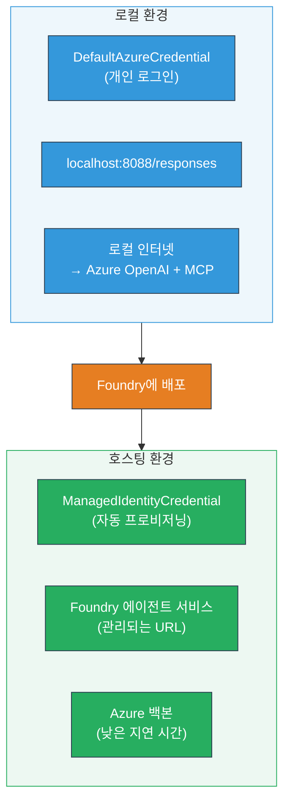

# Module 7 - 플레이그라운드에서 검증하기

이 모듈에서는 배포된 멀티 에이전트 워크플로우를 <strong>VS Code</strong>와 **[Foundry Portal](https://ai.azure.com)** 양쪽에서 테스트하여, 에이전트가 로컬 테스트와 동일하게 동작하는지 확인합니다.

---

## 배포 후 검증이 필요한 이유는?

멀티 에이전트 워크플로우가 로컬에서는 완벽히 실행되었지만, 왜 다시 테스트해야 할까요? 호스팅된 환경은 여러 면에서 다릅니다:


| 차이점 | 로컬 | 호스팅 |
|-----------|-------|--------|
| **신원(identity)** | [`DefaultAzureCredential`](https://learn.microsoft.com/azure/developer/python/sdk/authentication/credential-chains#defaultazurecredential-overview) (개인 로그인) | [`ManagedIdentityCredential`](https://learn.microsoft.com/python/api/overview/azure/identity-readme#managed-identity-support) (자동 제공) |
| <strong>엔드포인트</strong> | `http://localhost:8088/responses` | [Foundry Agent Service](https://learn.microsoft.com/azure/foundry/agents/concepts/hosted-agents) 엔드포인트 (관리되는 URL) |
| <strong>네트워크</strong> | 로컬 머신 → Azure OpenAI + MCP 아웃바운드 | Azure 백본 (서비스 간 지연시간 감소) |
| **MCP 연결** | 로컬 인터넷 → `learn.microsoft.com/api/mcp` | 컨테이너 아웃바운드 → `learn.microsoft.com/api/mcp` |

환경 변수 설정 오류, RBAC 차이, MCP 아웃바운드 차단 여부 등을 이 단계에서 발견할 수 있습니다.

---

## 옵션 A: VS Code 플레이그라운드에서 테스트하기 (추천 - 우선 시도)

[Foundry 확장](https://marketplace.visualstudio.com/items?itemName=TeamsDevApp.vscode-ai-foundry)에는 VS Code를 벗어나지 않고도 배포된 에이전트와 대화할 수 있는 통합 플레이그라운드가 포함되어 있습니다.

### 1단계: 호스팅된 에이전트 찾기

1. VS Code의 <strong>활동 표시줄(왼쪽 사이드바)</strong>에서 **Microsoft Foundry** 아이콘을 클릭하여 Foundry 패널을 엽니다.
2. 연결된 프로젝트 (예: `workshop-agents`)를 확장합니다.
3. <strong>Hosted Agents (Preview)</strong>를 확장합니다.
4. 에이전트 이름(예: `resume-job-fit-evaluator`)이 보일 것입니다.

### 2단계: 버전 선택

1. 에이전트 이름을 클릭하여 버전 목록을 엽니다.
2. 배포한 버전(예: `v1`)을 클릭합니다.
3. 컨테이너 세부정보가 표시되는 <strong>상세 패널</strong>이 열립니다.
4. 상태가 **Started** 또는 <strong>Running</strong>인지 확인합니다.

### 3단계: 플레이그라운드 열기

1. 상세 패널에서 **Playground** 버튼을 클릭하거나 버전을 우클릭하여 <strong>Open in Playground</strong>를 선택합니다.
2. VS Code 탭에 채팅 인터페이스가 열립니다.

### 4단계: 스모크 테스트 실행

[Module 5](05-test-locally.md) 에서 사용한 동일한 3가지 테스트를 플레이그라운드 입력 상자에 입력 후 <strong>Send(또는 Enter)</strong>를 눌러 실행합니다.

#### 테스트 1 - 전체 이력서 + JD (표준 흐름)

Module 5, Test 1에서 나온 전체 이력서 + JD 프롬프트를 붙여넣기 합니다 (Jane Doe + Contoso Ltd의 Senior Cloud Engineer).

**예상 결과:**
- 점수 내역이 포함된 적합도 점수 (100점 만점)
- 매칭된 기술 섹션
- 누락된 기술 섹션
- <strong>누락된 기술마다 한 개의 갭 카드</strong>와 Microsoft Learn URL
- 시간표가 포함된 학습 로드맵

#### 테스트 2 - 간단한 짧은 테스트 (최소 입력)

```
RESUME: 3 years Python developer, knows Django and PostgreSQL, no cloud experience.

JOB: Cloud DevOps Engineer requiring AWS, Kubernetes, Terraform, CI/CD. 5 years needed.
```

**예상 결과:**
- 낮은 적합도 점수 (< 40)
- 단계별 학습 경로가 포함된 솔직한 평가
- 여러 갭 카드 (AWS, Kubernetes, Terraform, CI/CD, 경험 부족)

#### 테스트 3 - 높은 적합도 후보자

```
RESUME:
10 years Azure Cloud Architect. AZ-305 certified. Expert in AKS, Terraform, Azure DevOps, 
Azure Functions, Helm, Prometheus, Grafana, Python, Go. Led platform team of 8.

JOB:
Senior Cloud Engineer. Required: AKS, Terraform, Azure DevOps, Python. Preferred: Helm, Go.
5+ years experience. AZ-305 preferred.
```

**예상 결과:**
- 높은 적합도 점수 (≥ 80)
- 인터뷰 준비 및 다듬기에 집중
- 갭 카드가 거의 없거나 없음
- 준비에 초점을 맞춘 짧은 일정

### 5단계: 로컬 결과와 비교

Module 5에서 저장한 로컬 응답이 있는 노트나 브라우저 탭을 엽니다. 각 테스트별로:

- 응답 구조가 <strong>동일한지</strong> (적합도 점수, 갭 카드, 로드맵)?
- **점수 산정 방식** (100점 기준 내역)이 같은가?
- 갭 카드에 **Microsoft Learn URL이 포함되어 있는가**?
- 누락된 기술마다 **갭 카드가 한 개씩 있는가** (잘리거나 합쳐지지 않은가)?

> **작은 문장 차이는 정상입니다** - 모델은 비결정적입니다. 구조, 점수 일관성 및 MCP 도구 사용 여부에 집중하세요.

---

## 옵션 B: Foundry Portal에서 테스트

[Foundry Portal](https://ai.azure.com)은 팀원 또는 이해관계자와 공유하기 좋은 웹 기반 플레이그라운드를 제공합니다.

### 1단계: Foundry Portal 열기

1. 브라우저를 열고 [https://ai.azure.com](https://ai.azure.com)으로 이동합니다.
2. 워크샵에서 사용하던 동일 Azure 계정으로 로그인합니다.

### 2단계: 프로젝트로 이동

1. 홈페이지 왼쪽 사이드바에서 <strong>최근 프로젝트</strong>를 찾습니다.
2. 프로젝트 이름(예: `workshop-agents`)을 클릭합니다.
3. 보이지 않는다면 <strong>모든 프로젝트</strong>를 클릭해 검색하세요.

### 3단계: 배포된 에이전트 찾기

1. 프로젝트의 왼쪽 탐색에서 **Build** → **Agents**(또는 **Agents** 섹션)를 클릭합니다.
2. 에이전트 목록이 나타납니다. 배포한 에이전트(예: `resume-job-fit-evaluator`)를 찾습니다.
3. 에이전트 이름을 클릭해 상세 페이지를 엽니다.

### 4단계: 플레이그라운드 열기

1. 에이전트 상세 페이지 상단 툴바를 확인합니다.
2. **Open in playground** (또는 **Try in playground**)를 클릭합니다.
3. 채팅 인터페이스가 열립니다.

### 5단계: 동일한 스모크 테스트 실행

위 VS Code 플레이그라운드 섹션에서 했던 3가지 테스트를 모두 반복해 실행합니다. 각 응답을 로컬 결과(Module 5) 및 VS Code 플레이그라운드 결과(옵션 A)와 비교하세요.

---

## 멀티 에이전트 전용 검증

기본 정확도 외에, 다음 멀티 에이전트 전용 동작을 검증하세요:

### MCP 도구 실행

| 검증 항목 | 확인 방법 | 통과 조건 |
|-------|--------------|-----------|
| MCP 호출 성공 여부 | 갭 카드에 `learn.microsoft.com` URL 포함 | 진짜 URL이 표시되고, 대체 메시지가 아님 |
| 다중 MCP 호출 | 각 고/중요 갭마다 리소스 존재 | 첫 번째 갭 카드만 아님 |
| MCP 대체 동작 | URL 누락 시 대체 텍스트 확인 | 에이전트가 갭 카드를 계속 생성함 (URL 유무 관계없이) |

### 에이전트 조정

| 검증 항목 | 확인 방법 | 통과 조건 |
|-------|-------------|-----------|
| 4개 에이전트 모두 실행 | 출력에 적합도 점수와 갭 카드 모두 포함 | 점수는 MatchingAgent, 카드는 GapAnalyzer에서 생성 |
| 병렬 병합 실행 | 반응 시간이 적절함 (< 2분) | 3분 이상이면 병렬 실행 오류 가능성 |
| 데이터 흐름 무결성 | 갭 카드가 매칭 보고서 기술 참조 | JD에 없는 기술이 홀루시네이션 없음 |

---

## 검증 기준표

호스팅된 멀티 에이전트 워크플로우 동작을 평가할 때 이 기준표를 사용하세요:

| # | 기준 | 통과 조건 | 통과 여부 |
|---|----------|--------------|-------|
| 1 | **기능적 정합성** | 에이전트가 이력서 + JD에 대해 적합도 점수와 갭 분석을 응답 | |
| 2 | **점수 일관성** | 100점 만점 점수와 세부 내역 사용 | |
| 3 | **갭 카드 완전성** | 누락된 기술마다 한 장의 카드 존재 (잘리거나 합쳐지지 않음) | |
| 4 | **MCP 도구 통합** | 갭 카드에 실제 Microsoft Learn URL 포함 | |
| 5 | **구조 일관성** | 로컬과 호스트 출력 구조 일치 | |
| 6 | **응답 시간** | 전체 평가 시 호스트 에이전트가 2분 이내 응답 | |
| 7 | **오류 없음** | HTTP 500, 타임아웃, 빈 응답 없음 | |

> "통과"는 3가지 스모크 테스트 모두에 대해 최소 한 개 플레이그라운드(VS Code 또는 Portal)에서 위 7가지 기준이 모두 만족됨을 의미합니다.

---

## 플레이그라운드 문제 해결

| 증상 | 원인 추정 | 해결 방법 |
|---------|-------------|-----|
| 플레이그라운드가 로드되지 않음 | 컨테이너 상태가 "Started"가 아님 | [Module 6](06-deploy-to-foundry.md)로 돌아가 배포 상태 확인. "Pending"이면 기다리기 |
| 에이전트가 빈 응답을 반환 | 모델 배포 이름 불일치 | `agent.yaml` → `environment_variables` → `MODEL_DEPLOYMENT_NAME`가 배포한 모델과 일치하는지 확인 |
| 에이전트가 오류 메시지 반환 | [RBAC](https://learn.microsoft.com/azure/foundry/concepts/rbac-foundry) 권한 없음 | 프로젝트 범위에 **[Azure AI User](https://aka.ms/foundry-ext-project-role)** 역할 할당 |
| 갭 카드에 Microsoft Learn URL 없음 | MCP 아웃바운드 차단 또는 MCP 서버 사용 불가 | 컨테이너가 `learn.microsoft.com`에 접근 가능한지 확인. [Module 8](08-troubleshooting.md) 참조 |
| 갭 카드가 한 장만 있음 (잘림) | GapAnalyzer 지침에 "CRITICAL" 블록 누락 | [Module 3, Step 2.4](03-configure-agents.md) 검토 |
| 적합도 점수가 로컬과 크게 다름 | 다른 모델 또는 지침 배포됨 | `agent.yaml` 환경 변수와 로컬 `.env` 비교. 필요 시 재배포 |
| Portal에서 "Agent not found" 표시 | 배포가 아직 전파 중이거나 실패 | 2분 기다린 후 새로고침. 계속 누락 시 [Module 6](06-deploy-to-foundry.md)에서 다시 배포 |

---

### 체크포인트

- [ ] VS Code 플레이그라운드에서 에이전트 테스트 - 3가지 스모크 테스트 모두 통과
- [ ] [Foundry Portal](https://ai.azure.com) 플레이그라운드에서 에이전트 테스트 - 3가지 스모크 테스트 모두 통과
- [ ] 응답이 로컬 테스트와 구조적으로 일치함 (적합도 점수, 갭 카드, 로드맵)
- [ ] 갭 카드에 Microsoft Learn URL 포함 (호스팅 환경에서 MCP 도구 정상 작동)
- [ ] 누락된 기술마다 한 개의 갭 카드 있음 (잘림 없음)
- [ ] 테스트하는 동안 오류나 타임아웃 없음
- [ ] 검증 기준표 완성 (7개 기준 모두 통과)

---

**이전:** [06 - Foundry에 배포](06-deploy-to-foundry.md) · **다음:** [08 - 문제 해결 →](08-troubleshooting.md)

---

<!-- CO-OP TRANSLATOR DISCLAIMER START -->
**면책 조항**:  
이 문서는 AI 번역 서비스 [Co-op Translator](https://github.com/Azure/co-op-translator)를 사용하여 번역되었습니다. 정확성을 기하기 위해 노력하고 있으나, 자동 번역에는 오류나 부정확성이 포함될 수 있음을 유의하시기 바랍니다. 원문 문서는 해당 언어로 작성된 원본이 권위 있는 자료로 간주되어야 합니다. 중요한 정보의 경우 전문적인 인간 번역을 권장합니다. 본 번역의 사용으로 인해 발생하는 오해나 잘못된 해석에 대해 당사는 책임을 지지 않습니다.
<!-- CO-OP TRANSLATOR DISCLAIMER END -->