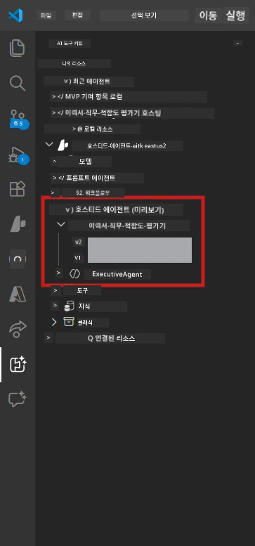

# 모듈 7 - 플레이그라운드에서 검증하기

⏱️ 약 10 분

이 모듈에서는 VS Code와 Foundry 포털에서 배포된 다중 에이전트 워크플로를 테스트하여 에이전트가 로컬 테스트와 동일하게 작동하는지 확인합니다.

---

## 배포 후 다시 테스트하는 이유는?

호스팅 환경은 로컬과 몇 가지 중요한 점에서 다릅니다:

| | 로컬 | 호스팅 |
|--|-------|--------|
| <strong>아이덴티티</strong> | 개인 로그인 (`DefaultAzureCredential`) | 배포 시 자동 프로비저닝 되는 에이전트별 전용 Entra 아이덴티티 |
| <strong>엔드포인트</strong> | `http://localhost:8088/responses` | Foundry 에이전트 서비스 관리 URL |
| <strong>네트워크</strong> | 내 컴퓨터 → Azure OpenAI + MCP | Azure 백본 (더 낮은 지연 시간) |

잘못 구성된 환경 변수, RBAC 문제, 차단된 MCP 아웃바운드 호출은 여기서 먼저 나타납니다.

---

## 옵션 A: VS Code 플레이그라운드에서 테스트하기 (먼저 권장)

### 1단계: 호스팅된 에이전트로 이동하기

1. 활동 표시줄에서 **Foundry Toolkit** 아이콘을 클릭하세요.
2. 프로젝트를 확장 → **Hosted Agents (Preview)** → 에이전트를 찾으세요.



### 2단계: 버전 선택하기

1. 에이전트를 클릭하여 버전을 확장하세요.
2. `v1`을 클릭 → 상태가 <strong>활성</strong>인지 확인 (사이드바에 "Running" 또는 "Started"로 표시될 수 있으며, 둘 다 준비 상태를 의미).

### 3단계: 플레이그라운드 열기

1. **Playground** 클릭 (또는 버전 우클릭 → **Open in Playground** 선택).
2. VS Code 탭에 채팅 창이 열립니다.

### 4단계: 스모크 테스트 실행하기

[모듈 5](05-test-locally.md)에서 사용한 동일한 3가지 테스트를 플레이그라운드 입력란에 입력 후 <strong>보내기</strong> (또는 **Enter**)를 누르세요.

#### 테스트 1 - 전체 이력서 + JD (표준 흐름)

모듈 5, 테스트 1에서 사용한 전체 이력서 + JD 프롬프트를 붙여넣기 (Jane Doe + Contoso Ltd의 선임 클라우드 엔지니어).

**예상 결과:**
- 점수 매기기 세부 항목(100점 만점)
- 일치하는 기술 섹션
- 누락된 기술 섹션
- <strong>누락된 기술당 하나씩의 갭 카드</strong>와 Microsoft Learn URL 포함
- 학습 로드맵과 일정

#### 테스트 2 - 간단한 짧은 테스트 (최소 입력)

```
RESUME: 3 years Python developer, knows Django and PostgreSQL, no cloud experience.

JOB: Cloud DevOps Engineer requiring AWS, Kubernetes, Terraform, CI/CD. 5 years needed.
```

**예상 결과:**
- 낮은 적합 점수 (< 40)
- 단계별 학습 경로가 포함된 솔직한 평가
- 여러 개의 갭 카드 (AWS, Kubernetes, Terraform, CI/CD, 경험 격차)

#### 테스트 3 - 높은 적합 점수 후보자

```
RESUME:
10 years Azure Cloud Architect. AZ-305 certified. Expert in AKS, Terraform, Azure DevOps, 
Azure Functions, Helm, Prometheus, Grafana, Python, Go. Led platform team of 8.

JOB:
Senior Cloud Engineer. Required: AKS, Terraform, Azure DevOps, Python. Preferred: Helm, Go.
5+ years experience. AZ-305 preferred.
```

**예상 결과:**
- 높은 적합 점수 (≥ 80)
- 인터뷰 준비 및 다듬기에 초점
- 갭 카드가 거의 없거나 없음
- 준비에 집중한 짧은 일정

### 5단계: 로컬 결과와 비교하기

모듈 5에서 로컬 응답을 저장한 노트 또는 브라우저 탭을 엽니다. 각 테스트마다:

- 응답이 **같은 구조**(적합 점수, 갭 카드, 로드맵)를 가지고 있나요?
- **같은 점수 기준**(100점 만점 세부 분류)이 적용되었나요?
- 갭 카드에 <strong>Microsoft Learn URL</strong>이 여전히 포함되어 있나요?
- <strong>누락된 기술당 하나씩의 갭 카드</strong>가 있나요 (잘리지 않았나요)?

> <strong>사소한 문구 차이는 정상</strong>입니다 - 모델은 비결정적입니다. 구조, 점수 일관성, MCP 도구 사용에 집중하세요.

---

## 옵션 B: Foundry 포털에서 테스트하기

[Foundry Portal](https://ai.azure.com)은 팀원이나 이해관계자와 공유하기 좋은 웹 기반 플레이그라운드를 제공합니다.

### 1단계: Foundry 포털 열기

1. 브라우저를 열고 [https://ai.azure.com](https://ai.azure.com)으로 이동하세요.
2. 워크숍에서 사용한 동일한 Azure 계정으로 로그인하세요.

### 2단계: 프로젝트로 이동하기

1. 홈 페이지에서 왼쪽 사이드바의 <strong>Recent projects</strong>를 찾으세요.
2. 프로젝트 이름(예: `workshop-agents`)을 클릭하세요.
3. 보이지 않는 경우 <strong>All projects</strong>를 클릭해 검색하세요.

### 3단계: 배포된 에이전트 찾기

1. 프로젝트 왼쪽 탐색에서 **Build** → **Agents** 클릭 (또는 **Agents** 섹션 찾기).
2. 에이전트 리스트가 보입니다. 배포된 에이전트(예: `resume-job-fit-evaluator`)를 찾으세요.
3. 에이전트 이름을 클릭해 상세 페이지를 여세요.

### 4단계: 플레이그라운드 열기

1. 에이전트 상세 페이지 상단 도구 모음을 확인하세요.
2. **Open in playground** (또는 **Try in playground**) 클릭.
3. 채팅 인터페이스가 열립니다.

### 5단계: 동일한 스모크 테스트 실행

위 VS Code 플레이그라운드 섹션의 3가지 테스트를 모두 반복하세요. 각 응답을 로컬 결과(모듈 5) 및 VS Code 플레이그라운드 결과(위 옵션 A)와 비교하세요.

---

## 다중 에이전트 전용 검증

기본적 정확성 외에도 다음 다중 에이전트 전용 동작을 확인하세요:

### MCP 도구 실행

| 확인 사항 | 검증 방법 | 통과 조건 |
|-------|---------------|----------------|
| MCP 호출 성공 | 갭 카드에 `learn.microsoft.com` URL 포함 | 실제 URL, 대체 메시지 아님 |
| 다중 MCP 호출 | 각 고/중요도 갭에 리소스 포함 | 첫 번째 갭 카드에만 제한되지 않음 |
| MCP 대체 동작 | URL이 없을 경우 대체 텍스트 확인 | 에이전트가 URL 유무에 관계 없이 갭 카드를 계속 생성 |

### 에이전트 조정

| 확인 사항 | 검증 방법 | 통과 조건 |
|-------|---------------|----------------|
| 4개 에이전트 모두 실행됨 | 출력에 적합 점수 및 갭 카드 포함 | 점수는 MatchingAgent, 카드는 GapAnalyzer가 생성 |
| 순차적 실행 | 응답 시간이 합리적임 (< 2분) | 3분 이상이면 터미널 로그에서 오류 확인 |
| 데이터 흐름 무결성 | 갭 카드가 매칭 리포트의 기술 참고 | JD에 없는 과장된 기술 없음 |

---

## 검증 기준표

다중 에이전트 워크플로의 호스팅 동작을 평가할 때 이 기준표를 사용하세요:

| 번호 | 기준 | 통과 조건 | 통과? |
|---|----------|---------------|-------|
| 1 | **기능적 정확성** | 에이전트가 이력서 + JD에 적합 점수 및 갭 분석 응답 | |
| 2 | **점수 일관성** | 적합 점수는 100점 만점 세부 수학 적용 | |
| 3 | **갭 카드 완전성** | 누락된 기술당 하나의 카드 (잘리거나 합쳐지지 않음) | |
| 4 | **MCP 도구 통합** | 갭 카드에 실제 Microsoft Learn URL 포함 | |
| 5 | **구조적 일관성** | 로컬과 호스팅 출력 구조가 일치 | |
| 6 | **응답 시간** | 호스팅 에이전트가 전체 평가를 2분 이내에 완료 | |
| 7 | **오류 없음** | HTTP 500 오류, 타임아웃, 빈 응답 없음 | |

> "통과"란 한 가지 플레이그라운드(VS Code 또는 포털)에서 3개의 스모크 테스트 모두에 대해 7가지 기준 모두를 충족함을 의미합니다.

---

## 플레이그라운드 문제 해결

| 증상 | 가능한 원인 | 해결 방법 |
|---------|-------------|-----|
| 플레이그라운드 로드 안 됨 | 컨테이너가 `active` 상태가 아님 | [모듈 6](06-deploy-to-foundry.md)로 돌아가 배포 상태 확인. `creating` 상태면 기다리기 |
| 에이전트가 빈 응답 반환 | 모델 배포 이름 불일치 | `agent.yaml` → `environment_variables` → `AZURE_AI_MODEL_DEPLOYMENT_NAME`가 배포 모델과 일치하는지 확인 |
| 에이전트가 오류 메시지 반환 | [RBAC](https://learn.microsoft.com/azure/foundry/concepts/rbac-foundry) 권한 부족 | 프로젝트 범위에 **[Foundry User](https://aka.ms/foundry-ext-project-role)**(이전 Azure AI User) 할당 |
| 갭 카드에 Microsoft Learn URL이 없음 | MCP 아웃바운드 차단 또는 MCP 서버 불가용 | 컨테이너가 `learn.microsoft.com`에 접근 가능한지 확인. [모듈 8](08-troubleshooting.md) 참조 |
| 갭 카드가 1개만 있음 (잘림) | GapAnalyzer 지침에 "CRITICAL" 블록 누락 | [모듈 3, 2.4단계](03-configure-agents.md) 검토 |
| 적합 점수가 로컬과 크게 다름 | 다른 모델 또는 지침 배포됨 | `agent.yaml` 환경 변수와 로컬 `.env` 비교. 필요시 재배포 |
| 포털에서 "Agent not found" | 배포가 아직 전파 중이거나 실패 | 2분 기다린 후 새로 고침. 계속 없으면 [모듈 6](06-deploy-to-foundry.md)에서 재배포 |

---

### 체크포인트

- [ ] VS Code 플레이그라운드에서 에이전트 테스트 완료 - 3가지 스모크 테스트 모두 통과
- [ ] [Foundry Portal](https://ai.azure.com) 플레이그라운드에서 에이전트 테스트 완료 - 3가지 스모크 테스트 모두 통과
- [ ] 응답이 로컬 테스트와 구조적으로 일치 (적합 점수, 갭 카드, 로드맵)
- [ ] 갭 카드에 Microsoft Learn URL 포함 (호스팅 환경에서 MCP 도구 작동 중)
- [ ] 누락된 기술당 하나의 갭 카드 (잘림 없음)
- [ ] 테스트 도중 오류나 타임아웃 없음
- [ ] 검증 기준표 완료 (7가지 기준 모두 통과)

---

**이전:** [06 - Foundry에 배포](06-deploy-to-foundry.md) · **다음:** [08 - 문제 해결 →](08-troubleshooting.md)

---

<!-- CO-OP TRANSLATOR DISCLAIMER START -->
**면책 조항**:
이 문서는 AI 번역 서비스 [Co-op Translator](https://github.com/Azure/co-op-translator)를 사용하여 번역되었습니다. 정확성을 기하기 위해 노력하고 있으나, 자동 번역은 오류나 부정확한 부분이 있을 수 있음을 유의하시기 바랍니다. 원본 문서의 원어본이 권위 있는 자료로 간주되어야 합니다. 중요한 정보의 경우, 전문가의 인간 번역을 권장합니다. 이 번역 사용으로 인해 발생하는 오해나 잘못된 해석에 대해 당사는 책임을 지지 않습니다.
<!-- CO-OP TRANSLATOR DISCLAIMER END -->